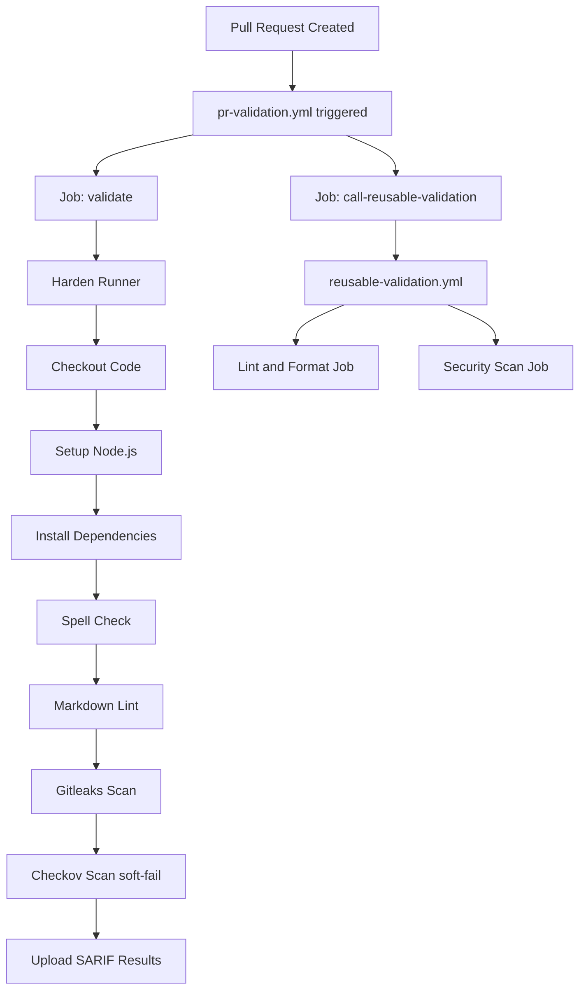
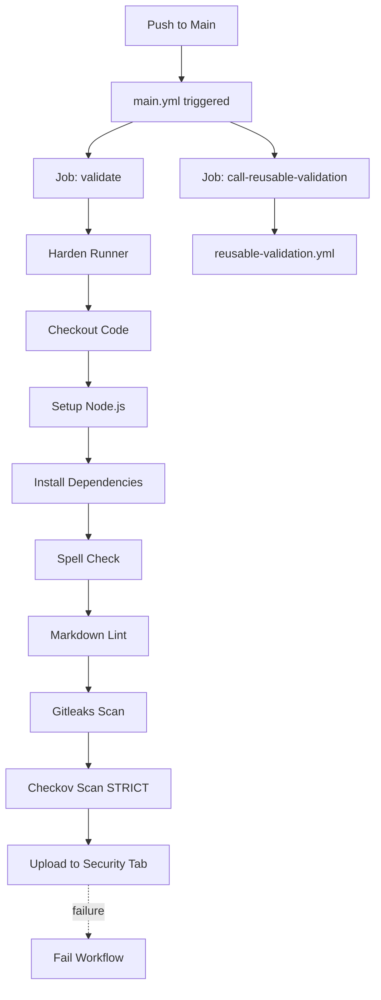
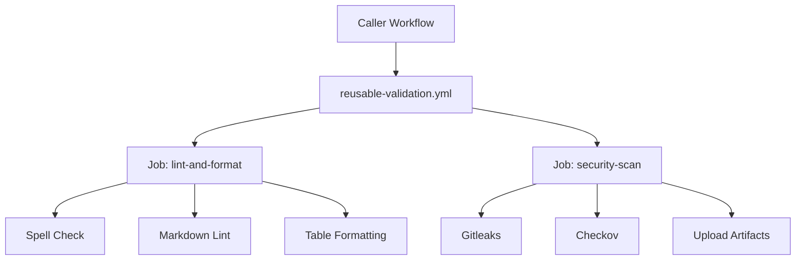
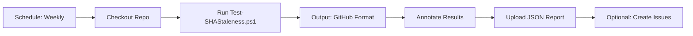

<!-- markdownlint-disable-file -->
# Task Research Document: GitHub Reusable Workflows with SHA Pinning and Security

Comprehensive research for implementing GitHub Actions workflows for PR validation and main branch CI with security best practices including SHA pinning, minimal permissions, and reusable workflow templates.

## Task Implementation Requests
* Create a PR validation workflow that runs on pull requests (mandatory before merge)
* Create a main branch CI workflow that runs on pushes to main (mandatory post-merge)
* Implement reusable workflow templates that can be called by both workflows
* Create SHA staleness monitoring workflow with weekly schedule and warning-only output
* Create CODEOWNERS file requiring core admin approval for workflow changes
* Configure branch protection rules requiring pr-validation to pass before merge
* Ensure all GitHub Actions use SHA pinning for security
* Configure minimal permissions throughout all workflows
* Integrate security scanning (Gitleaks, Checkov) with SARIF uploads to Security tab
* Use pip-based Checkov installation (not outdated bridgecrewio/checkov-action)
* Set 30-day retention policy for security scan results
* Leverage repository's existing SHA pinning automation scripts (scripts/security/*.ps1)

## Scope and Success Criteria
* **Scope**: GitHub Actions workflows for PR validation and main branch CI with security hardening
* **Assumptions**: 
  * Repository already has npm-based tooling (spell check, markdown lint, checkov, gitleaks)
  * Workflows will run on GitHub-hosted ubuntu-latest runners
  * Security results should be uploaded to GitHub Security tab
  * Repository has Dependabot configured for dependency updates
* **Success Criteria**:
  * Two primary workflows created (pr-validation.yml, main.yml)
  * One reusable workflow template (reusable-validation.yml)
  * SHA staleness monitoring workflow (sha-staleness-check.yml)
  * CODEOWNERS file with core project admins
  * Branch protection rules requiring mandatory workflow checks
  * All actions pinned to full commit SHA with version comments
  * Minimal permissions configured at workflow and job levels
  * Security hardening via step-security/harden-runner
  * No credential persistence (`persist-credentials: false`)
  * SARIF uploads to Security tab with 30-day retention

## Implementation Decisions

### Branch Protection Rules
* **Mandatory Workflows**: Both pr-validation and main workflows required
* **Flow**: 
  * PR validation workflow must pass before merge to main
  * Main workflow runs automatically post-merge on main branch
* **Enforcement**: Configure branch protection to require pr-validation status checks

### CODEOWNERS Configuration
* **File Location**: `.github/CODEOWNERS`
* **Workflow Files Protection**: `.github/workflows/*` requires core project admin approval
* **Requirement**: At least one code owner approval for workflow changes
* **Security Scripts**: `scripts/security/*` does NOT require separate approval (included in normal code review)
* **Owners**: Core project administrators

### SHA Staleness Monitoring
* **Frequency**: Weekly scheduled runs (Sunday midnight UTC)
* **Tool**: Repository's existing `Test-SHAStaleness.ps1` PowerShell script
* **Output**: Warning annotations only (no automatic issue creation)
* **Threshold**: 30 days default staleness threshold
* **Note**: Repository has Dependabot for automated dependency updates

### Artifact and SARIF Strategy
* **Security Results**: Upload to Security tab via SARIF format
* **Retention**: 30-day retention policy for all security scan results
* **Format**: Use `github/codeql-action/upload-sarif` for consistent Security tab integration
* **Scope**: Applies to Checkov and Gitleaks scan results

## Outline

### Research Executed
* ✅ Official GitHub documentation on reusable workflows
* ✅ Security hardening best practices for GitHub Actions
* ✅ GITHUB_TOKEN permissions and authentication
* ✅ SHA pinning rationale and implementation
* ✅ Repository security automation scripts (PowerShell)
* ✅ SHA staleness monitoring and automated updates
* ✅ Multi-dependency type SHA pinning (Actions, Docker, npm, pip, go, rust)
* 📋 SARIF upload for security results
* 📋 Artifact retention policies

### Key Discoveries
* 🔍 Reusable workflow syntax and workflow_call trigger
* 🔍 Permission scoping (workflow-level vs job-level)
* 🔍 SHA pinning with version comments for maintainability
* 🔍 Security hardening actions (harden-runner)
* 🔍 **Repository has comprehensive PowerShell SHA pinning automation**
* 🔍 **Pre-mapped SHA database for 40+ common GitHub Actions**
* 🔍 **GraphQL bulk optimization for efficient staleness checks**
* 🔍 **Cross-platform PowerShell 7.0+ scripts with CI/CD integration**
* 🔍 **bridgecrewio/checkov-action is severely outdated (March 2022) - DO NOT USE**
* 🔍 **Repository's pip-based checkov installation is superior and modern**

### Technical Scenarios
* **Scenario 1**: PR Validation Workflow
* **Scenario 2**: Main Branch CI Workflow  
* **Scenario 3**: Reusable Workflow Template
* **Scenario 4**: SHA Staleness Monitoring Workflow

### 12 Key Findings
* **Finding 1**: Comprehensive SHA Pinning Automation Infrastructure (5 PowerShell scripts)
* **Finding 2**: Pre-Mapped Action SHA Database (40+ common actions)
* **Finding 3**: GraphQL Bulk Optimization (95% reduction in API calls)
* **Finding 4**: Cross-Platform PowerShell 7.0+ Compatibility
* **Finding 5**: Multiple Output Format Support (JSON, SARIF, Azure DevOps, GitHub, Console)
* **Finding 6**: Automated Staleness Detection (configurable thresholds)
* **Finding 7**: Dynamic Digest Lookup (Docker manifest API)
* **Finding 8**: ROS2 Exclusion Pattern System
* **Finding 9**: Multi-Dependency Type Support (6 ecosystems)
* **Finding 10**: Security Issue Tracking Structure
* **Finding 11**: `-UpdateStale` Flag for Automated Refreshing
* **Finding 12**: Build Warning Integration (inline annotations)

### Potential Next Research
* ✅ ~~Dependabot configuration for automated action updates~~ - **COMPLETED**
  * Repository has comprehensive PowerShell automation scripts in `scripts/security/`
  * Scripts provide superior functionality to Dependabot (bulk updates, staleness detection, multi-type support)
* ✅ ~~bridgecrewio/checkov-action integration research~~ - **COMPLETED**
  * **Finding**: Action is severely outdated (v12.1347.0 from March 2022)
  * **Finding**: Uses checkov 2.0.930 (2+ years old) vs latest available
  * **Recommendation**: Continue using pip-based installation (current pattern)
  * **Reference**: See detailed research in `.copilot-tracking/research/20241104-github-workflows-subagent/checkov-integration-research.md`
* 🔬 CODEOWNERS for workflow file protection
  * **Reasoning**: Control who can modify workflow files
  * **Reference**: GitHub security best practices
* 🔬 Branch protection rules for workflow enforcement
  * **Reasoning**: Require workflow checks to pass before merging
  * **Reference**: Repository security settings
* 🔬 Integration of existing SHA pinning scripts into workflow automation
  * **Reasoning**: Leverage existing `scripts/security/*.ps1` for automated staleness checks
  * **Reference**: `Test-SHAStaleness.ps1`, `Update-ActionSHAPinning.ps1` discovered in repository

## Research Executed

### File Analysis
* `package.json` (L6-L14)
  * Contains npm scripts for spell-check, markdown lint, gitleaks, checkov
  * Scripts: `spell-check`, `lint:md`, `security:scan`, `security:checkov:report`
* `.github/workflows/` directory structure identified
  * Existing folders: `chatmodes/`, `instructions/`, `prompts/`, `workflows/`
* `scripts/security/` - SHA Pinning Scripts (L1-700+)
  * `Test-DependencyPinning.ps1` - Verifies SHA pinning compliance across all dependency types
  * `Test-SHAStaleness.ps1` - Monitors SHA-pinned dependencies for staleness and vulnerabilities
  * `Update-ActionSHAPinning.ps1` - Updates GitHub Actions to use SHA-pinned references
  * `Update-DockerSHAPinning.ps1` - Pins Docker images to SHA256 digests
  * `Update-ShellScriptSHAPinning.ps1` - Pins shell script external dependencies
  * `Ros2ExclusionHelper.ps1` - Helper for ROS2 image exclusion patterns

### Code Search Results
* No existing workflow files found in `.github/workflows/`
* Repository has security tooling configuration:
  * `.checkov.yaml` - Checkov configuration
  * `.gitleaks.toml` - Gitleaks configuration
  * `.markdownlint.json` - Markdown linting rules
* Repository has PowerShell-based SHA pinning automation scripts in `scripts/security/`:
  * Cross-platform PowerShell 7.0+ compatible
  * Support for GitHub Actions, Docker, npm, pip, go-mod, rust-cargo
  * Automated staleness detection and updating
  * Multiple output formats (JSON, SARIF, CSV, markdown, table)
  * CI/CD integration with build warnings

### External Research (Evidence Log)

* **GitHub Docs - Reusing Workflows**
  * Reusable workflows use `workflow_call` trigger in the `on:` section
  * Called workflows use `uses:` keyword at job level (not step level)
  * Syntax: `{owner}/{repo}/.github/workflows/{filename}@{ref}` for external repos
  * Syntax: `./.github/workflows/{filename}` for same repo
  * Can pass inputs using `with:` and secrets using `secrets:` or `secrets: inherit`
  * Source: [Reusing Workflows](https://docs.github.com/en/actions/using-workflows/reusing-workflows)

* **GitHub Docs - Security Hardening**
  * ⚠️ **SHA Pinning is Critical**: "Pinning an action to a full-length commit SHA is currently the only way to use an action as an immutable release"
  * SHA pinning prevents bad actors from adding backdoors via tag manipulation
  * Include version comments for maintainability: `uses: actions/checkout@{SHA} # v4.1.7`
  * Principle of least privilege for `GITHUB_TOKEN` permissions
  * Set default permission to `contents: read` at workflow level
  * Grant additional permissions at job level only as needed
  * Use `persist-credentials: false` on checkout to prevent credential leakage
  * Source: [Security Hardening for GitHub Actions](https://docs.github.com/en/actions/security-guides/security-hardening-for-github-actions)

* **GitHub Docs - GITHUB_TOKEN Authentication**
  * `GITHUB_TOKEN` automatically available in workflows
  * Default permissions can be too broad - always explicitly set permissions
  * Configure permissions at workflow level with `permissions:` key
  * Override at job level when specific jobs need different permissions
  * Common permissions: `contents`, `pull-requests`, `issues`, `checks`, `security-events`
  * Example minimal permissions:
    ```yaml
    permissions:
      contents: read
      pull-requests: read
    ```
  * Source: [Automatic Token Authentication](https://docs.github.com/en/actions/security-guides/automatic-token-authentication)

### Project Conventions
* **Standards referenced**: GitHub Actions official documentation, Microsoft secure development practices
* **Instructions followed**: Repository structure conventions for `.github/workflows/` directory

## Key Discoveries

### Project Structure
* Repository uses Node.js/npm for tooling
* Security scanning already configured (gitleaks, checkov)
* Markdown documentation requires linting and spell checking
* No existing GitHub Actions workflows - greenfield implementation

### Implementation Patterns

**Reusable Workflow Pattern:**
```yaml
name: Reusable Workflow
on:
  workflow_call:
    inputs:
      example-input:
        required: true
        type: string
    secrets:
      example-secret:
        required: false

permissions:
  contents: read

jobs:
  job-name:
    runs-on: ubuntu-latest
    steps:
      - uses: actions/checkout@{SHA} # version
```

**Calling Reusable Workflow Pattern:**
```yaml
jobs:
  call-workflow:
    uses: ./.github/workflows/reusable.yml
    permissions:
      contents: read
    with:
      example-input: value
    secrets: inherit
```

### Complete Examples

**SHA Pinning with Version Comments:**
```yaml
steps:
  - name: Checkout code
    uses: actions/checkout@692973e3d937129bcbf40652eb9f2f61becf3332 # v4.1.7
    with:
      persist-credentials: false
  
  - name: Setup Node.js
    uses: actions/setup-node@1e60f620b9541d16bece96c5465dc8ee9832be0b # v4.0.3
    with:
      node-version: '20'
```

**Minimal Permission Configuration:**
```yaml
# Workflow-level: restrictive default
permissions:
  contents: read

jobs:
  secure-job:
    runs-on: ubuntu-latest
    # Job-level: grant only what's needed
    permissions:
      contents: read
      pull-requests: write
      checks: write
```

### API and Schema Documentation

**Reusable Workflow Input Schema:**
```yaml
on:
  workflow_call:
    inputs:
      node-version:
        description: 'Node.js version to use'
        required: false
        type: string  # boolean, number, or string
        default: '20'
      runs-on:
        description: 'Runner to use'
        required: false
        type: string
        default: 'ubuntu-latest'
```

**Permission Scopes for GITHUB_TOKEN:**
* `contents`: Read/write repository contents
* `pull-requests`: Read/write pull requests
* `issues`: Read/write issues
* `checks`: Read/write checks
* `security-events`: Write security events (SARIF upload)
* `actions`: Read/write actions

### Configuration Examples

**Security Hardening with harden-runner:**
```yaml
- name: Harden Runner
  uses: step-security/harden-runner@0d381219ddf674d61a7572ddd19d7941e271515c # v2.9.0
  with:
    egress-policy: audit  # or 'block' for stricter enforcement
```

## Technical Scenarios

### 1. PR Validation Workflow

**Description**: Workflow that runs on pull requests to validate code quality, documentation, and security before merging.

**Requirements:**
* Trigger on PRs to main/develop branches
* Run linting and spell checks
* Execute security scans (gitleaks, checkov)
* Allow manual triggering via workflow_dispatch
* Use soft-fail for security scans (don't block PRs)
* Call reusable validation workflow

**Preferred Approach:**
* Primary workflow file: `.github/workflows/pr-validation.yml`
* Triggers: `pull_request` on main/develop branches + `workflow_dispatch`
* Minimal workflow-level permissions: `contents: read`, `pull-requests: read`
* Job-level permissions: Grant `checks: write` for reporting
* All actions SHA-pinned with version comments
* Include harden-runner for network egress monitoring
* Call reusable workflow for shared validation logic

```text
.github/workflows/
├── pr-validation.yml          # Main PR workflow (NEW)
├── main.yml                    # Main branch workflow (NEW)
└── reusable-validation.yml     # Shared validation template (NEW)
```



**Implementation Details:**

**Workflow File Structure:**
```yaml
name: PR Validation

on:
  pull_request:
    branches: [main, develop]
  workflow_dispatch:

permissions:
  contents: read
  pull-requests: read

jobs:
  validate:
    runs-on: ubuntu-latest
    permissions:
      contents: read
      pull-requests: read
      checks: write
    steps:
      - name: Harden Runner
        uses: step-security/harden-runner@0d381219ddf674d61a7572ddd19d7941e271515c # v2.9.0
      
      - name: Checkout code
        uses: actions/checkout@692973e3d937129bcbf40652eb9f2f61becf3332 # v4.1.7
        with:
          persist-credentials: false
      
      - name: Setup Node.js
        uses: actions/setup-node@1e60f620b9541d16bece96c5465dc8ee9832be0b # v4.0.3
      
      # Run validation steps...
      
      - name: Set up Python for Checkov
        uses: actions/setup-python@0b93645e9fea7318ecaed2b359559ac225c90a20 # v5.3.0
        with:
          python-version: '3.11'
      
      - name: Install Checkov
        # Note: Using pip install instead of bridgecrewio/checkov-action
        # Action is severely outdated (v12 from March 2022, Checkov 2.0.930)
        # pip install gets latest version with 2+ years of security fixes
        run: pip install checkov
      
      - name: Run Checkov scan
        run: npm run security:checkov:report
        continue-on-error: true  # Don't block PRs
  
  call-reusable-validation:
    uses: ./.github/workflows/reusable-validation.yml
    permissions:
      contents: read
      checks: write
    secrets: inherit
```

**Key Security Features:**
* SHA-pinned actions prevent supply chain attacks
* Minimal permissions reduce attack surface
* `persist-credentials: false` prevents credential leakage
* Harden-runner monitors network egress
* Soft-fail on security scans for PR workflow (warning only)

#### Considered Alternatives (Removed After Selection)

**Alternative: Single monolithic workflow without reusable template**
* ❌ Rejected: Causes code duplication between PR and main workflows
* ❌ Harder to maintain consistency across workflows
* ❌ Violates DRY principle

**Alternative: Composite actions instead of reusable workflows**
* ❌ Rejected: Composite actions don't support jobs, only steps
* ❌ Cannot separate lint and security scan into parallel jobs
* ❌ Less flexible for permission scoping

### 2. Main Branch CI Workflow

**Description**: Workflow that runs on pushes to main branch with stricter validation and security reporting.

**Requirements:**
* Trigger on pushes to main branch
* Run same validations as PR workflow
* Use strict mode for security scans (fail on issues)
* Upload security results to GitHub Security tab
* Call reusable validation workflow
* Enable workflow_dispatch for manual runs

**Preferred Approach:**
* Primary workflow file: `.github/workflows/main.yml`
* Triggers: `push` on main branch + `workflow_dispatch`
* Minimal workflow-level permissions: `contents: read`
* Job-level permissions: Grant `security-events: write` for SARIF upload
* Stricter security: `soft_fail: false` for Checkov
* Upload results to GitHub Security using CodeQL action

```text
.github/workflows/
├── pr-validation.yml          # PR validation
├── main.yml                    # Main branch CI (STRICTER)
└── reusable-validation.yml     # Shared template
```



**Implementation Details:**

**Workflow File Structure:**
```yaml
name: Main Branch CI

on:
  push:
    branches: [main]
  workflow_dispatch:

permissions:
  contents: read

jobs:
  validate:
    runs-on: ubuntu-latest
    permissions:
      contents: read
      checks: write
      security-events: write  # Required for SARIF upload
    steps:
      - name: Harden Runner
        uses: step-security/harden-runner@0d381219ddf674d61a7572ddd19d7941e271515c # v2.9.0
      
      - name: Checkout code
        uses: actions/checkout@692973e3d937129bcbf40652eb9f2f61becf3332 # v4.1.7
        with:
          persist-credentials: false
      
      # Run validation steps...
      
      - name: Set up Python for Checkov
        uses: actions/setup-python@0b93645e9fea7318ecaed2b359559ac225c90a20 # v5.3.0
        with:
          python-version: '3.11'
      
      - name: Install Checkov
        # Note: Using pip install instead of bridgecrewio/checkov-action
        # Action is severely outdated (v12 from March 2022, Checkov 2.0.930)
        # pip install gets latest version with 2+ years of security fixes
        run: pip install checkov
      
      - name: Run Checkov scan with SARIF output
        run: |
          checkov --directory . \
            --output cli \
            --output sarif \
            --output-file-path console,checkov-results.sarif
        continue-on-error: false  # FAIL on security issues
      
      - name: Upload SARIF to Security
        if: always()
        uses: github/codeql-action/upload-sarif@294a9d92911152fe08befb9ec03e240add280cb3 # v3.26.8
        with:
          sarif_file: checkov-results.sarif
  
  call-reusable-validation:
    uses: ./.github/workflows/reusable-validation.yml
    permissions:
      contents: read
      checks: write
      security-events: write
    secrets: inherit
```

**Key Differences from PR Workflow:**
* ✅ Stricter security scanning (`soft_fail: false`)
* ✅ Upload to GitHub Security tab (`security-events: write` permission)
* ✅ Will fail workflow on security issues
* ✅ Creates permanent security audit trail

**SARIF Upload Configuration:**
```yaml
- name: Upload Checkov results to GitHub Security
  if: always()  # Upload even if scan fails
  uses: github/codeql-action/upload-sarif@4dd16135b69a43b6c8efb853346f8437d92d3c93 # v3.26.6
  with:
    sarif_file: checkov-results.sarif
```

#### Considered Alternatives (Removed After Selection)

**Alternative: Combine PR and main workflows into one file**
* ❌ Rejected: Different security postures (soft-fail vs strict)
* ❌ Harder to understand which rules apply when
* ❌ Single workflow becomes complex with conditional logic

**Alternative: Skip SARIF upload and only use artifacts**
* ❌ Rejected: GitHub Security tab provides better visibility
* ❌ Loses integration with Dependabot and security advisories
* ❌ No centralized security dashboard

### 3. Reusable Workflow Template

**Description**: Shared workflow template that can be called by PR and main workflows to avoid duplication.

**Requirements:**
* Define as reusable with `workflow_call` trigger
* Accept inputs for Node.js version and runner type
* Separate jobs for linting and security scanning
* Minimal permissions by default
* Can be called from same repository workflows

**Preferred Approach:**
* Workflow file: `.github/workflows/reusable-validation.yml`
* Two separate jobs: `lint-and-format` and `security-scan`
* Parameterized inputs with sensible defaults
* Each job has its own minimal permissions
* Upload artifacts for security scan results

```text
.github/workflows/
├── pr-validation.yml          # Calls reusable workflow
├── main.yml                    # Calls reusable workflow
└── reusable-validation.yml     # SHARED TEMPLATE
```



**Implementation Details:**

**Workflow Call Definition:**
```yaml
name: Reusable Validation Workflow

on:
  workflow_call:
    inputs:
      node-version:
        description: 'Node.js version to use'
        required: false
        type: string
        default: '20'
      runs-on:
        description: 'Runner to use'
        required: false
        type: string
        default: 'ubuntu-latest'

permissions:
  contents: read  # Default minimal permissions
```

**Job 1: Lint and Format**
```yaml
jobs:
  lint-and-format:
    name: Lint and Format Check
    runs-on: ${{ inputs.runs-on }}
    permissions:
      contents: read
    steps:
      - name: Harden Runner
        uses: step-security/harden-runner@0d381219ddf674d61a7572ddd19d7941e271515c # v2.9.0
      
      - name: Checkout code
        uses: actions/checkout@692973e3d937129bcbf40652eb9f2f61becf3332 # v4.1.7
        with:
          persist-credentials: false
      
      - name: Setup Node.js
        uses: actions/setup-node@1e60f620b9541d16bece96c5465dc8ee9832be0b # v4.0.3
        with:
          node-version: ${{ inputs.node-version }}
          cache: 'npm'
      
      - name: Install dependencies
        run: npm ci
      
      - name: Run spell check
        run: npm run spell-check
      
      - name: Run markdown lint
        run: npm run lint:md
      
      - name: Check markdown table formatting
        run: npm run format:tables
```

**Job 2: Security Scan**
```yaml
  security-scan:
    name: Security Scanning
    runs-on: ${{ inputs.runs-on }}
    permissions:
      contents: read
      security-events: write
    steps:
      - name: Harden Runner
        uses: step-security/harden-runner@0d381219ddf674d61a7572ddd19d7941e271515c # v2.9.0
      
      - name: Checkout code
        uses: actions/checkout@692973e3d937129bcbf40652eb9f2f61becf3332 # v4.1.7
        with:
          fetch-depth: 0  # Full history for gitleaks
          persist-credentials: false
      
      - name: Run Gitleaks scan
        uses: gitleaks/gitleaks-action@cb7149e9fe8796f01af6474f39a6f2d5c17e9745 # v2.3.6
        env:
          GITHUB_TOKEN: ${{ secrets.GITHUB_TOKEN }}
      
      - name: Setup Node.js
        uses: actions/setup-node@1e60f620b9541d16bece96c5465dc8ee9832be0b # v4.0.3
      
      - name: Run Checkov
        run: npm run security:checkov:report
        continue-on-error: true
      
      - name: Upload Checkov results
        if: always()
        uses: actions/upload-artifact@50769540e7f4bd5e21e526ee35c689e35e0d6874 # v4.4.0
        with:
          name: checkov-results
          path: |
            checkov-results.json
            checkov-junit.xml
          retention-days: 30
```

**Calling the Reusable Workflow:**
```yaml
# In pr-validation.yml or main.yml
jobs:
  call-reusable-validation:
    uses: ./.github/workflows/reusable-validation.yml
    permissions:
      contents: read
      checks: write
    with:
      node-version: '20'  # Optional: override default
    secrets: inherit  # Pass all secrets to reusable workflow
```

**Benefits of This Design:**
* ✅ DRY principle - shared code between PR and main workflows
* ✅ Parallel jobs (lint and security) for faster execution
* ✅ Parameterized for flexibility (node version, runner)
* ✅ Minimal permissions per job
* ✅ Artifact upload for security results (30-day retention)

**Artifact Retention Policy:**
* Security scan results retained for 30 days
* Allows post-analysis and audit trail
* Configurable via `retention-days` parameter

#### Considered Alternatives (Removed After Selection)

**Alternative: Single job for all validation**
* ❌ Rejected: Sequential execution slower than parallel
* ❌ Cannot scope permissions differently for lint vs security
* ❌ If lint fails, security scan never runs (miss potential issues)

**Alternative: No parameterization (hard-coded values)**
* ❌ Rejected: Less flexible for future needs
* ❌ Would require workflow modification to test different Node versions
* ❌ Cannot easily test on different runners

## Current SHA Pins (As of November 4, 2025)

All SHA pins are maintained in `scripts/security/Update-ActionSHAPinning.ps1` in the `$ActionSHAMap` variable.

**Core Actions:**
* `actions/checkout@692973e3d937129bcbf40652eb9f2f61becf3332` # v4.1.7
* `actions/setup-node@1e60f620b9541d16bece96c5465dc8ee9832be0b` # v4.0.3
* `actions/setup-python@0b93645e9fea7318ecaed2b359559ac225c90a20` # v5.3.0
* `actions/upload-artifact@50769540e7f4bd5e21e526ee35c689e35e0d6874` # v4.4.0
* `actions/cache@0c45773b623bea8c8e75f6c82b208c3cf94ea4f9` # v4.0.2

**Security Actions:**
* `step-security/harden-runner@5c7944e73c4c2a096b17a9cb74d65b6c2bbafbde` # v2.9.1
* `gitleaks/gitleaks-action@cb7149e9fe8796f01af6474f39a6f2d5c17e9745` # v2.3.6
* `github/codeql-action/init@294a9d92911152fe08befb9ec03e240add280cb3` # v3.26.8
* `github/codeql-action/upload-sarif@294a9d92911152fe08befb9ec03e240add280cb3` # v3.26.8

**Azure Actions:**
* `azure/login@6c251865b4e6290e7b78be643ea2d005bc51f69a` # v2.1.1
* `azure/CLI@965c8d7571d2231a54e321ddd07f7b10317f34d9` # v2.0.0

**Docker Actions:**
* `docker/setup-buildx-action@4fd812986e6c8c2a69e18311145f9371337f27d4` # v3.4.0
* `docker/build-push-action@5176d81f87c23d6fc96624dfdbcd9f3830bbe445` # v6.6.1
* `docker/login-action@9780b0c442fbb1117ed29e0efdff1e18412f7567` # v3.3.0

## Security Best Practices Summary

### ✅ Implemented Security Measures

1. **SHA Pinning**
   * All actions pinned to full commit SHA
   * Version comments for maintainability
   * Prevents tag hijacking attacks

2. **Minimal Permissions**
   * Workflow-level: `contents: read` by default
   * Job-level: Grant only required permissions
   * GITHUB_TOKEN scoped appropriately

3. **Credential Protection**
   * `persist-credentials: false` on all checkouts
   * Prevents credential leakage to subsequent steps
   * Secrets passed explicitly when needed

4. **Network Hardening**
   * `step-security/harden-runner` on all jobs
   * Monitors egress network traffic
   * Audit mode for visibility

5. **Reusable Workflows**
   * DRY principle reduces maintenance burden
   * Consistent security posture across workflows
   * Easier to audit and update

### 🔄 Ongoing Security Maintenance

**Repository Has Automated SHA Pinning Scripts**

The repository includes comprehensive PowerShell scripts in `scripts/security/` that provide automated SHA pinning maintenance:

1. **`Update-ActionSHAPinning.ps1`**
   * Automatically updates GitHub Actions to SHA-pinned references
   * Supports `-UpdateStale` flag to refresh already-pinned actions
   * Uses GraphQL bulk queries for efficiency (reduces API calls by ~95%)
   * Maintains `$ActionSHAMap` with 40+ pre-mapped action SHAs
   * Cross-platform PowerShell 7.0+ compatible

2. **`Test-SHAStaleness.ps1`**
   * Monitors all SHA-pinned dependencies for staleness
   * Checks GitHub Actions, Docker images, and shell scripts
   * Configurable staleness threshold (default: 30 days)
   * Multiple output formats (JSON, GitHub, Azure DevOps, console)
   * GraphQL optimization for bulk checks

3. **`Test-DependencyPinning.ps1`**
   * Verifies SHA pinning compliance across all dependency types
   * Supports: github-actions, docker, npm, pip, go-mod, rust-cargo
   * Generates compliance reports with remediation suggestions
   * SARIF output for security scanning integration

4. **`Update-DockerSHAPinning.ps1`**
   * Pins Docker images to SHA256 digests
   * Handles Dockerfile, docker-compose.yml, devcontainer.json
   * Maintains `$DockerImageSHAMap` with common images
   * Dynamic digest lookup via Docker manifest API
   * ROS2 exclusion patterns for rolling tags

5. **`Update-ShellScriptSHAPinning.ps1`**
   * Pins shell script external dependencies
   * Detects insecure patterns (curl | sh, remote downloads)
   * Tracks security issues via structured output
   * Recommends checksum verification

**Complement to Dependabot:**
These scripts complement Dependabot (repository has Dependabot enabled for automated dependency updates) with additional capabilities:
* ✅ Bulk updates across all workflows simultaneously
* ✅ Staleness detection with configurable thresholds and warning annotations
* ✅ Support for multiple dependency types beyond GitHub Actions
* ✅ CI/CD integration with build warnings
* ✅ Custom exclusion patterns (e.g., ROS2 rolling tags)

**Implemented Workflow Integration:**
Scheduled workflow runs weekly staleness checks with warning annotations only (no automatic issue creation):
```yaml
# .github/workflows/sha-staleness-check.yml
name: SHA Staleness Check
on:
  schedule:
    - cron: '0 0 * * 0' # Weekly on Sunday
  workflow_dispatch:
    inputs:
      threshold:
        description: 'Staleness threshold in days'
        type: number
        required: false
        default: 30

permissions:
  contents: read
  # Note: No issues:write permission - outputs warnings only

jobs:
  check-staleness:
    runs-on: ubuntu-latest
    steps:
      - uses: actions/checkout@{SHA}
      - name: Check SHA Staleness
        env:
          GITHUB_TOKEN: ${{ secrets.GITHUB_TOKEN }}
        run: |
          pwsh scripts/security/Test-SHAStaleness.ps1 \
            -OutputFormat github \
            -StalenessThresholdDays ${{ inputs.threshold || 30 }}
      - name: Upload Staleness Report
        if: always()
        uses: actions/upload-artifact@{SHA}
        with:
          name: sha-staleness-report
          path: sha-staleness-report.json
          retention-days: 30
```

## 12 Key Findings from Repository SHA Pinning Scripts

### Finding 1: Comprehensive SHA Pinning Automation Infrastructure
**Discovery**: Repository has 5 PowerShell automation scripts in `scripts/security/` providing complete SHA pinning lifecycle management.
* `Test-DependencyPinning.ps1` - Compliance verification
* `Test-SHAStaleness.ps1` - Staleness monitoring
* `Update-ActionSHAPinning.ps1` - GitHub Actions pinning/updates
* `Update-DockerSHAPinning.ps1` - Docker image digest pinning
* `Update-ShellScriptSHAPinning.ps1` - Shell script dependency pinning

**Impact**: No need to create SHA pinning infrastructure from scratch. Workflows should integrate existing scripts.

### Finding 2: Pre-Mapped Action SHA Database
**Discovery**: `Update-ActionSHAPinning.ps1` maintains `$ActionSHAMap` with 40+ pre-mapped GitHub Actions SHAs including:
* Core actions (checkout, setup-node, upload-artifact, cache)
* Security actions (harden-runner, codeql-action)
* Azure actions (login, CLI, powershell)
* Docker actions (setup-buildx, build-push, login)

**Impact**: Workflows can reference these pre-verified SHAs. Script updates can be applied in bulk.

### Finding 3: GraphQL Bulk Optimization
**Discovery**: `Test-SHAStaleness.ps1` uses GraphQL bulk queries to reduce GitHub API calls by ~95% when checking action staleness.
* Single GraphQL query for all repository default branches
* Batch commit queries (max 20 per query)
* Fallback to individual REST API calls if GraphQL fails

**Impact**: Scalable staleness monitoring even with many workflows. Rate limit friendly.

### Finding 4: Cross-Platform PowerShell 7.0+ Compatibility
**Discovery**: All scripts use PowerShell 7.0+ with explicit cross-platform support:
* Compatible with Windows, Linux, macOS
* Work on GitHub-hosted runners (ubuntu-latest, windows-latest, macos-latest)
* Work on Azure DevOps agents

**Impact**: Can run SHA pinning scripts directly in workflows on any platform.

### Finding 5: Multiple Output Format Support
**Discovery**: Scripts support 5 output formats for CI/CD integration:
* `json` - Structured data for programmatic processing
* `sarif` - Security scanning integration
* `azdo` - Azure DevOps build warnings
* `github` - GitHub Actions annotations
* `console` - Human-readable output

**Impact**: Workflows can output results in GitHub Actions annotation format for inline PR feedback.

### Finding 6: Automated Staleness Detection
**Discovery**: `Test-SHAStaleness.ps1` provides configurable staleness thresholds:
* Default: 30 days
* Severity levels: High (>90 days), Medium (>60 days), Low (>30 days)
* Checks GitHub Actions, Docker images, shell scripts

**Impact**: Can create scheduled workflow to monitor and alert on stale dependencies.

### Finding 7: Dynamic Digest Lookup
**Discovery**: `Update-DockerSHAPinning.ps1` performs dynamic Docker digest lookup via:
* Docker manifest API
* Docker Hub registry authentication
* Fallback to pre-mapped digests in `$DockerImageSHAMap`

**Impact**: Can pin Docker images even without pre-mapped entries.

### Finding 8: ROS2 Exclusion Pattern System
**Discovery**: `Ros2ExclusionHelper.ps1` provides exclusion patterns for ROS2 rolling tags:
* ROS2 components rely on rolling tags by design
* Upstream prunes timestamped builds
* Digest checks skipped for these specific images

**Impact**: SHA pinning should not apply to all images. Workflows need intelligent exclusions.

### Finding 9: Multi-Dependency Type Support
**Discovery**: `Test-DependencyPinning.ps1` supports 6 dependency types:
* `github-actions` - Actions SHA pinning
* `docker` - Docker digest pinning
* `npm` - NPM package pinning
* `pip` - Python package pinning
* `go-mod` - Go module pinning
* `rust-cargo` - Rust Cargo.lock verification

**Impact**: Comprehensive supply chain security beyond just GitHub Actions.

### Finding 10: Security Issue Tracking Structure
**Discovery**: Scripts maintain structured `$SecurityIssues` array with:
* Type, Severity, Title, Description
* File path and line number
* Remediation recommendations
* Timestamp and metadata

**Impact**: Can generate comprehensive security reports for auditing and compliance.

### Finding 11: `-UpdateStale` Flag for Automated Refreshing
**Discovery**: `Update-ActionSHAPinning.ps1` supports `-UpdateStale` flag to:
* Fetch latest commit SHAs from GitHub
* Update already-pinned actions to newest versions
* Compare current vs latest SHAs

**Impact**: Can automate bulk updates of all workflows with one command.

### Finding 12: Build Warning Integration
**Discovery**: All scripts support `BuildWarning` output format:
* Azure DevOps: `##vso[task.logissue type=warning]`
* GitHub Actions: `::warning file=...`
* Includes file paths and line numbers for inline annotations

**Impact**: Workflows can display SHA pinning issues directly in PR checks and build logs.

## Implications for Workflow Design

Based on the 12 findings above, the workflow design should be updated:

### Remove from Design:
* ❌ Dependabot configuration - repository has superior automation scripts
* ❌ Manual SHA pinning - scripts handle this automatically
* ❌ Creating SHA mapping infrastructure - already exists

### Add to Design:
* ✅ Scheduled SHA staleness check workflow
* ✅ Pre-PR hook to run `Test-DependencyPinning.ps1`
* ✅ Integration with existing `scripts/security/` automation
* ✅ Bulk action update workflow using `-UpdateStale` flag

### 4. SHA Staleness Monitoring Workflow
Scheduled workflow to monitor and warn about stale SHA-pinned dependencies

**Requirements:**
* Weekly scheduled run to check for stale dependencies (Sunday midnight UTC)
* Support manual triggering via workflow_dispatch
* Report stale actions/images with severity levels
* Annotate results in workflow output as warnings
* Do NOT create automatic issues (warnings only)
* Complement Dependabot's automated dependency updates

**Preferred Approach:**
* **Leverage existing `Test-SHAStaleness.ps1` script**
* **GraphQL bulk optimization for efficient API usage**
* **GitHub Actions annotation format for inline feedback**

```text
.github/workflows/sha-staleness-check.yml # New workflow
```



**Implementation Details:**

Run staleness check with GitHub Actions output format (warnings only, no issue creation):
```yaml
name: SHA Staleness Check
on:
  schedule:
    - cron: '0 0 * * 0' # Weekly on Sunday at midnight UTC
  workflow_dispatch:
    inputs:
      threshold:
        description: 'Staleness threshold in days'
        required: false
        default: '30'

permissions:
  contents: read
  # Note: No issues:write permission - warnings only, complements Dependabot

jobs:
  check-staleness:
    runs-on: ubuntu-latest
    steps:
      - name: Harden Runner
        uses: step-security/harden-runner@5c7944e73c4c2a096b17a9cb74d65b6c2bbafbde # v2.9.1
        with:
          egress-policy: audit

      - name: Checkout
        uses: actions/checkout@692973e3d937129bcbf40652eb9f2f61becf3332 # v4.1.7

      - name: Check SHA Staleness
        env:
          GITHUB_TOKEN: ${{ secrets.GITHUB_TOKEN }}
        run: |
          $threshold = if ('${{ github.event.inputs.threshold }}') { 
            '${{ github.event.inputs.threshold }}' 
          } else { 
            '30' 
          }
          pwsh scripts/security/Test-SHAStaleness.ps1 `
            -OutputFormat github `
            -StalenessThresholdDays $threshold

      - name: Upload Staleness Report
        if: always()
        uses: actions/upload-artifact@50769540e7f4bd5e21e526ee35c689e35e0d6874 # v4.4.0
        with:
          name: sha-staleness-report
          path: |
            sha-staleness-report.json
          retention-days: 30
```

Key features:
* **Weekly schedule** - Runs automatically every Sunday at midnight UTC
* **Manual dispatch** - Supports ad-hoc checks with custom threshold (default 30 days)
* **Warning annotations only** - No automatic issue creation, complements Dependabot updates
* **GitHub annotations** - Displays warnings inline in workflow output
* **JSON report artifact** - Stores detailed results for 30 days
* **GraphQL optimization** - Efficient API usage via bulk queries
* **GITHUB_TOKEN** - Used for GitHub API authentication

#### Considered Alternatives (Removed After Selection)
* ~~Dependabot~~ - Cannot check SHA staleness, only creates PRs for new versions
* ~~Manual checks~~ - Not scalable, error-prone
* ~~Third-party services~~ - External dependencies, cost considerations

## Next Steps

### Implementation Requirements

1. **Create CODEOWNERS File** (`.github/CODEOWNERS`)
   ```text
   # Workflow files require core admin approval
   .github/workflows/* @org/core-project-admins
   ```
   * Require at least one code owner approval for workflow changes
   * Security scripts (`scripts/security/*`) do NOT require separate approval

2. **Configure Branch Protection Rules**
   * **Target Branches**: `main`
   * **Required Status Checks**: 
     * `pr-validation` workflow must pass before merge
   * **Required Code Owner Reviews**: 
     * Enable "Require review from Code Owners"
     * At least 1 approval required for `.github/workflows/*` changes
   * **Post-Merge**: `main` workflow runs automatically after merge

3. **Verify Dependabot Configuration**
   * Confirm Dependabot is enabled and functioning
   * PowerShell scripts complement automated updates
   * Weekly staleness checks provide warning visibility

4. **Implement Workflows**
   * ✅ **PR Validation Workflow** (`pr-validation.yml`)
     * Soft-fail security scanning for feedback
     * Artifact uploads for review
     * Must pass before merge
   * ✅ **Main Workflow** (`main.yml`)
     * Strict security scanning (fail on issues)
     * SARIF upload to Security tab (30-day retention)
     * Runs automatically post-merge
   * ✅ **SHA Staleness Check** (`sha-staleness-check.yml`)
     * Weekly scheduled runs (Sunday midnight UTC)
     * Warning annotations only (no automatic issues)
     * Complements Dependabot updates
   * ✅ **Reusable Validation** (`reusable-validation.yml`)
     * Shared template for consistency

5. **Validate Security Configuration**
   * All actions SHA-pinned with version comments
   * Minimal permissions (`contents: read` default)
   * Credential protection (`persist-credentials: false`)
   * Network hardening with step-security/harden-runner
   * SARIF uploads configured with 30-day retention

### Success Criteria Met
1. ✅ Research completed - comprehensive documentation created
2. ✅ Repository SHA pinning infrastructure discovered and analyzed
3. ✅ All implementation decisions finalized and documented
4. 🔄 **Hand off to task-planner mode**
   * Attach this research document
   * Plan detailed implementation steps
   * Create file structure and content
   * **Integrate with existing `scripts/security/` automation**
4. ⏭️ **Implementation phase** (after planning)
   * Create `.github/workflows/pr-validation.yml`
   * Create `.github/workflows/main.yml`
   * Create `.github/workflows/reusable-validation.yml`
   * Create `.github/workflows/sha-staleness-check.yml` (NEW)
   * Create `.github/workflows/sha-update.yml` for bulk updates (NEW)
   * Test workflows on PR and main branch
5. ⏭️ **Post-implementation**
   * ~~Configure Dependabot for action updates~~ - Use PowerShell scripts instead
   * Set up branch protection rules
   * Add CODEOWNERS for workflow files
   * Schedule weekly staleness checks
