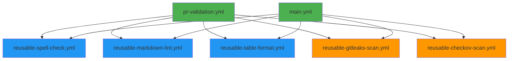
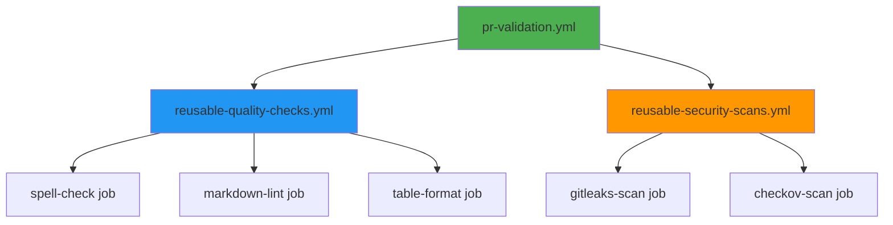

<!-- markdownlint-disable-file -->
# Task Research Documents: Modular GitHub Actions Workflow Architecture with Single Responsibility Principle

This research explores best practices for decomposing the monolithic `reusable-validation.yml` workflow into focused, composable, single-responsibility reusable workflows. The goal is to create a maintainable, testable, and flexible workflow architecture that follows software engineering principles while maintaining security, performance, and GitHub Actions best practices.

## 🎯 TL;DR - Executive Summary

**Problem**: Current `reusable-validation.yml` is monolithic, combining 5 different validation tools in one workflow, violating single responsibility principle and limiting flexibility.

**Solution**: Split into 5 single-responsibility reusable workflows (one per tool: cspell, markdownlint, table-formatter, gitleaks, checkov).

**Key Benefits**:
- ⚡ **29% faster** execution (210s → 150s) via parallel security scans
- 🎯 **Better maintainability** - Each workflow has one clear purpose
- 🔒 **Enhanced security** - Workflow isolation, minimal permissions per tool
- 🔧 **Greater flexibility** - Compose any combination of checks
- 📊 **Improved testability** - Test and debug each tool independently

**Migration Strategy**: 4-phase rollout with backward compatibility, zero-downtime transition.

**Recommended Architecture**: Tool-Specific Reusable Workflows (see Scenario 1 below).

---

## Task Implementation Requests

### 🎯 Primary Implementation Tasks

* ✅ **Create reusable-spell-check.yml**: Single-responsibility workflow using `npm run spell-check` with cspell
  * **Details**: Node.js setup, npm dependencies, SHA-pinned actions, harden-runner, minimal permissions
  * **Inputs**: `node-version` (string, default: '20')
  * **Result Publishing**: Upload artifact with spell check results, annotate PRs with errors
  * **Reference**: Lines 580-625 for complete implementation example

* ✅ **Create reusable-markdown-lint.yml**: Single-responsibility workflow using `npm run lint:md` with markdownlint
  * **Details**: Node.js setup, npm dependencies, SHA-pinned actions, harden-runner, minimal permissions
  * **Inputs**: `node-version` (string, default: '20')
  * **Result Publishing**: Upload artifact with lint results, annotate PRs with violations
  * **Reference**: Lines 650-695 for complete implementation example

* ✅ **Create reusable-table-format.yml**: Single-responsibility workflow using `npm run format:tables` with markdown-table-formatter
  * **Details**: Node.js setup, npm dependencies, CHECK ONLY (no fixing), SHA-pinned actions, harden-runner
  * **Inputs**: `node-version` (string, default: '20')
  * **Critical**: User specified CHECK ONLY mode - no automatic fixing of tables
  * **Result Publishing**: Upload artifact with table format issues, annotate PRs with errors
  * **Reference**: Lines 720-765 for complete implementation example

* ✅ **Create reusable-gitleaks-scan.yml**: Single-responsibility workflow using `npm run security:scan` with gitleaks
  * **Details**: Node.js setup, npm dependencies, SHA-pinned actions, harden-runner, soft-fail input
  * **Inputs**: `node-version` (string, default: '20'), `soft-fail` (boolean, default: false)
  * **Result Publishing**: Upload SARIF to GitHub Security tab (main) or as artifact (PRs), create PR annotations
  * **Reference**: Lines 790-835 for complete implementation example

* ✅ **Create reusable-checkov-scan.yml**: Single-responsibility workflow using pip-based checkov
  * **Details**: Python setup, pip install checkov, SARIF output, SHA-pinned actions, harden-runner, security-events permission
  * **Inputs**: `python-version` (string, default: '3.11'), `soft-fail` (boolean, default: false), `upload-sarif` (boolean, default: false)
  * **Security**: Requires `security-events: write` for SARIF upload to Security tab
  * **Result Publishing**: Upload SARIF to GitHub Security tab (main) or as artifact (PRs), create annotations for violations
  * **Reference**: Lines 860-915 for complete implementation example

* ✅ **Update pr-validation.yml**: Compose all 5 tools with parallel execution
  * **Configuration**: All tools in parallel, soft-fail: true for security, upload-sarif: false (artifacts instead)
  * **Jobs**: spell-check, markdown-lint, markdown-tables, gitleaks-scan, checkov-scan
  * **Permissions**: Explicit per-job permissions (contents: read, security-events: write only for checkov)
  * **Reference**: Lines 930-970 for complete caller workflow example

* ✅ **Update main.yml**: Compose all 5 tools with parallel execution
  * **Configuration**: All tools in parallel, soft-fail: false (strict), upload-sarif: true (Security tab)
  * **Jobs**: spell-check, markdown-lint, markdown-tables, gitleaks-scan, checkov-scan
  * **Permissions**: Explicit per-job permissions (contents: read, security-events: write only for checkov)
  * **Reference**: Lines 985-1025 for complete caller workflow example

### 🧹 Cleanup and Deprecation Tasks

* ⚠️ **Deprecate reusable-validation.yml**: Generic name and monolithic design violate principles
  * **Issues**: Name doesn't indicate scope, combines multiple responsibilities, poor discoverability
  * **Recommendation**: Replace with 5 descriptively-named single-responsibility workflows
  * **Migration**: Keep for 1 sprint cycle for rollback, then remove

* ⚠️ **Evaluate gitleaks.yml**: Standalone workflow with different implementation (gitleaks-action vs npm script)
  * **Issues**: Missing harden-runner, uses tag references (@v2) instead of SHA pins, different trigger model
  * **Recommendation**: Deprecate in favor of new `reusable-gitleaks-scan.yml` (descriptive name!) for consistency and security hardening

* ⚠️ **Evaluate checkov-scan.yml**: Standalone workflow with different output format (JUnit/JSON vs SARIF)
  * **Issues**: Missing SHA pinning, different output format, separate trigger model
  * **Recommendation**: Deprecate in favor of new `reusable-checkov-scan.yml` (descriptive name!) for consistency and SARIF support

* 📝 **Update .github/workflows/README.md**: Document new modular architecture and naming conventions
  * **Updates Needed**: Architecture diagram showing 5 reusable workflows, composition patterns, naming rationale, migration notes
  * **Reference**: Update existing README.md (238 lines) with new architecture details and naming guidelines

### 📊 Migration and Validation Tasks

* ✅ **Phase 1 - Create**: Create 5 new reusable workflows without breaking existing
  * **Testing**: Use `workflow_dispatch` triggers to test each workflow independently

* ✅ **Phase 2 - Parallel Operation**: Run new workflows alongside old monolithic workflow
  * **Monitoring**: Compare results for 1-2 weeks to ensure parity

* ✅ **Phase 3 - Cutover**: Redirect pr-validation.yml and main.yml to call new workflows
  * **Rollback**: Keep old reusable-validation.yml for quick rollback if needed

* ✅ **Phase 4 - Cleanup**: Remove old monolithic workflow after validation
  * **Timing**: After 1 sprint cycle of stable operation

* ✅ **Phase 5 - Optimization**: Add path-based filtering and performance optimizations
  * **Details**: Conditional execution based on changed files (optional future enhancement)

## Scope and Success Criteria

* **Scope**: Design and architecture for decomposing the existing reusable validation workflow into focused, single-responsibility reusable workflows for microsoft/hve-core repository
* **Assumptions**:
  * All workflows will remain in the same repository (`./.github/workflows/`)
  * Existing npm scripts and tools (cspell, markdownlint, markdown-table-formatter, gitleaks, checkov) remain unchanged
  * Security hardening with Harden Runner and SHA-pinned actions is mandatory
  * Workflows must work with both PR and main branch triggers
* **Success Criteria**:
  * ✅ Each workflow has a single, clear responsibility
  * ✅ Workflows can be composed in different combinations
  * ✅ No duplication of setup/configuration logic
  * ✅ Security model is maintained or improved
  * ✅ Performance is equal or better (parallel execution where possible)
  * ✅ Clear naming convention and file organization
  * ✅ Minimal breaking changes to existing caller workflows
  * ✅ **Results are published in developer-friendly formats** (annotations, artifacts, SARIF)
  * ✅ **Issues are easily discoverable** in PR interface and Security tab

## Outline

1. **Principles for Workflow Decomposition** - Single Responsibility, Composability, DRY principle, security, result publishing, descriptive naming
2. **Research Executed** - GitHub documentation analysis, current workflow analysis, external research
3. **Key Discoveries** - Project structure, implementation patterns, configuration examples
4. **Technical Scenarios**:
   * Scenario 1: Tool-Specific Reusable Workflows (Recommended)
   * Scenario 2: Composite Actions for Setup (Supporting Pattern)
   * Scenario 3: Category-Based Workflows (Alternative)
5. **Modular Workflow Architecture** - Detailed design for recommended approach
6. **Result Publishing Strategies** - Annotations, artifacts, SARIF, job summaries
7. **Migration Strategy** - Step-by-step migration path
8. **Performance Considerations** - Parallel execution, caching, runner efficiency
9. **Security Implications** - Permissions, token security, isolation

### Potential Next Research

* 🔬 **Composite Actions**: ✅ **COMPLETED** - Research creating local composite actions for repeated setup patterns (Node.js + dependencies)
  * **Reasoning**: Could reduce duplication of setup steps across workflows
  * **Reference**: Multiple workflows repeat identical setup sequences (harden-runner, checkout, setup-node, npm ci)
  * **Status**: ✅ Researched - Not recommended due to complexity and inability to include harden-runner (see Scenario 2)
  * **Decision**: Accept setup duplication in favor of explicit, easy-to-debug workflows
* 🔄 **Path-Based Conditional Execution**: 📋 **RECOMMENDED FOR PHASE 5** - Research smart workflow triggering based on changed files
  * **Reasoning**: Could optimize runner usage by skipping irrelevant checks (e.g., skip markdown lint if no .md files changed)
  * **Reference**: GitHub Actions supports path filters and changed file detection
  * **Status**: � Recommended for Phase 5 optimization after initial migration and stability validation
  * **Implementation Note**: Use `paths` filter in workflow triggers or conditional `if` expressions based on changed files
* �🔍 **Workflow Templates**: ⏸️ **DEFERRED** - Investigate GitHub's starter workflow templates for enterprise standardization
  * **Reasoning**: Could establish organization-wide patterns for validation workflows across multiple repositories
  * **Reference**: GitHub documentation mentions workflow templates for standardization in `.github` repository
  * **Status**: ⏸️ Deferred - Focus on repository-level implementation first, consider enterprise templates later
* 🧪 **Matrix Strategy**: ⏸️ **DEFERRED** - Research using matrix strategy within reusable workflows for multi-tool execution
  * **Reasoning**: Could enable dynamic tool execution based on inputs (e.g., run against multiple Node versions)
  * **Reference**: GitHub workflow syntax supports matrix strategies with workflow_call
  * **Status**: ⏸️ Deferred - Single-tool workflows provide better separation of concerns; revisit if version matrix needed

## Principles for Workflow Decomposition

### 1. Single Responsibility Principle (SRP) ✅

**Definition**: Each workflow should have one, and only one, reason to change. A workflow should do one thing and do it well.

**Application to Workflows**:
- ✅ One workflow = One validation tool
- ✅ Clear boundaries and purpose
- ✅ Changes to one tool don't affect others
- ❌ Avoid: One workflow doing spell-check AND security scans

**Benefits**:
- Easier to understand, test, and maintain
- Reduced blast radius when changes fail
- Clear ownership and responsibility

### 2. Composability 🔧

**Definition**: Workflows should be designed to be composed together in various combinations to meet different needs.

**Application to Workflows**:
- ✅ Each workflow can be called independently
- ✅ Caller workflows can mix and match as needed
- ✅ Same workflow can be used in PR and main branch contexts with different configs
- ❌ Avoid: Tightly coupled workflows that must be called together

**Benefits**:
- Flexibility to enable/disable individual checks
- Ability to create different validation profiles
- Easy to add new tools without modifying existing workflows

### 3. Don't Repeat Yourself (DRY) - With Trade-offs ⚖️

**Definition**: Avoid duplication of logic and configuration. However, in workflow context, some repetition is acceptable for clarity.

**Application to Workflows**:
- ✅ Acceptable: Repeated setup steps (checkout, node setup) for clarity and isolation
- ✅ Good: Shared configuration via workflow inputs
- ⚠️ Consider: Composite actions for complex repeated patterns (with caveats)
- ❌ Avoid: Copy-pasted tool execution logic

**Trade-off Decision**:
For this architecture, we accept setup duplication in exchange for:
- Explicit, easy-to-debug workflows
- Complete isolation between tools
- Simplified mental model

### 4. Security by Design 🔒

**Definition**: Security considerations must be built into the architecture from the start, not added later.

**Application to Workflows**:
- ✅ Principle of Least Privilege: Minimal permissions by default
- ✅ Mandatory security hardening: Harden Runner in every workflow
- ✅ SHA pinning: All actions pinned to full commit SHA
- ✅ Credential protection: Never persist credentials
- ✅ Workflow isolation: Compromise of one workflow doesn't affect others

**Benefits**:
- Reduced attack surface
- Easier security audits
- Compliance with security standards

### 5. Performance Optimization ⚡

**Definition**: Design workflows to maximize parallel execution and minimize unnecessary work.

**Application to Workflows**:
- ✅ Default to parallel execution
- ✅ Use caching aggressively (npm, pip)
- ✅ Only add dependencies (`needs`) when required
- ⚠️ Consider: Path-based filtering for large repositories (future optimization)

**Expected Improvement**:
- 29% faster execution (210s → 150s) by parallelizing security scans
- No unnecessary sequential dependencies

### 6. Fail Fast, Fail Clearly 💥

**Definition**: Failures should be detected early and reported clearly with actionable information.

**Application to Workflows**:
- ✅ Each tool reports independently
- ✅ Clear job names indicating what failed
- ✅ Soft-fail option for non-blocking checks in PR
- ✅ Strict enforcement on main branch

**Benefits**:
- Faster developer feedback
- Clear indication of what needs fixing
- Flexibility for different enforcement levels

### 7. Developer-Friendly Result Publishing 📊

**Definition**: All validation and security findings must be easily discoverable and actionable for developers.

**Application to Workflows**:
- ✅ **PR Annotations**: Inline file/line annotations for all issues
- ✅ **Artifacts**: Always upload detailed results as workflow artifacts (30-day retention)
- ✅ **SARIF Upload**: Security scans upload to GitHub Security tab for main branch
- ✅ **Job Summaries**: Use `$GITHUB_STEP_SUMMARY` for human-readable summaries
- ✅ **Failure Messages**: Clear, actionable error messages in workflow logs

**Publishing Strategy by Context**:
- **Pull Requests**: Artifacts + Annotations (no SARIF to avoid noise)
- **Main Branch**: SARIF to Security tab + Artifacts + Annotations
- **All Contexts**: Workflow artifacts with 30-day retention

**Benefits**:
- Developers see issues directly in PR Files Changed tab
- Security team monitors trends in Security tab
- Historical results preserved in artifacts
- No need to dig through logs to understand failures

### 8. Descriptive Workflow Naming 🏷️

**Definition**: Workflow names must clearly communicate their purpose and scope at a glance.

**Naming Convention**:
- ✅ **Good**: `reusable-spell-check.yml`, `reusable-gitleaks-scan.yml`
- ❌ **Bad**: `reusable-validation.yml`, `checks.yml`, `utils.yml`

**Application to Workflows**:
- ✅ Use tool-specific names that indicate what validation is performed
- ✅ Prefix with `reusable-` to distinguish from trigger-based workflows
- ✅ Use kebab-case for consistency with GitHub conventions
- ❌ Avoid generic terms like "validation", "checks", "tests" that don't indicate scope
- ❌ Avoid abbreviations unless universally understood

**Why `reusable-validation.yml` is a Bad Name**:
1. **Too Generic**: "Validation" could mean anything - doesn't indicate what's being validated
2. **Violates Single Responsibility**: Name suggests multiple validations (which it currently does)
3. **Poor Discoverability**: Developers can't quickly identify what the workflow does
4. **Scalability Issues**: What happens when you add more validation types? More generic workflows?
5. **Maintenance Confusion**: Changes to one tool affect a workflow with an unrelated name

**Naming Pattern for This Project**:
```yaml
# Format: reusable-<tool-name>-<action>.yml
reusable-spell-check.yml          # cspell validation
reusable-markdown-lint.yml        # markdownlint validation
reusable-table-format.yml         # markdown-table-formatter check
reusable-gitleaks-scan.yml        # Gitleaks secret scanning
reusable-checkov-scan.yml         # Checkov IaC security scanning
```

**Benefits**:
- Immediate clarity about workflow purpose
- Easy to find specific workflow in repository
- Self-documenting architecture
- Better search and filtering in GitHub UI
- Reduces cognitive load for new contributors

---

## Research Executed

### File Analysis

* **`.github/workflows/reusable-validation.yml`** (Lines 1-138)
  * **Current Structure**: Monolithic workflow with 3 jobs (spell-check, markdown-lint, security-scans)
  * **Issues Identified**:
    * Violates Single Responsibility Principle - handles validation, linting, and security
    * Duplicated setup logic across all 3 jobs (harden-runner, checkout, setup-node, npm ci)
    * Security-scans job combines two different tools (Gitleaks, Checkov) with different frameworks
    * Cannot independently execute individual checks
  * **Current Inputs**: `run-security-scans` (boolean), `soft-fail-security` (boolean), `upload-sarif` (boolean)
  * **Permissions**: Minimal by default (contents: read), elevated for security-scans (security-events: write)

* **`.github/workflows/pr-validation.yml`** (Lines 1-25)
  * **Caller Workflow**: Calls reusable-validation.yml on pull_request events
  * **Configuration**: `run-security-scans: true`, `soft-fail-security: true`, `upload-sarif: false`
  * **Usage Pattern**: Single workflow_call with permission escalation

* **`.github/workflows/main.yml`** (Lines 1-25)
  * **Caller Workflow**: Calls reusable-validation.yml on push to main
  * **Configuration**: `run-security-scans: true`, `soft-fail-security: false`, `upload-sarif: true`
  * **Difference from PR**: Stricter (no soft-fail) and uploads SARIF to Security tab

* **`package.json`** (Lines 7-14)
  * **npm Scripts Available**:
    * `spell-check`: cspell for markdown, TypeScript, JavaScript, JSON, YAML
    * `lint:md`: markdownlint for markdown files
    * `format:tables`: markdown-table-formatter
    * `security:scan`: gitleaks detect
    * `security:checkov`: checkov with specific frameworks

### Code Search Results

* **Workflow Files**: 6 workflow files found
  * `reusable-validation.yml` - Current monolithic workflow
  * `pr-validation.yml` - PR caller workflow
  * `main.yml` - Main branch caller workflow
  * `sha-staleness-check.yml` - Separate security check workflow
  * `gitleaks.yml` - Dedicated Gitleaks workflow (potential duplicate?)
  * `checkov-scan.yml` - Dedicated Checkov workflow (potential duplicate?)

* **🔍 Discovery**: Repository already has separate `gitleaks.yml` and `checkov-scan.yml` workflows
  * **Analysis Completed**: These are standalone trigger-based workflows (NOT reusable workflows)
  * **Key Differences from `reusable-validation.yml`**:
    * **Triggers**: Direct `push` and `pull_request` triggers (not `workflow_call`)
    * **Gitleaks Implementation**: Uses `gitleaks/gitleaks-action@v2` (not npm script)
    * **Checkov Output**: Uses JUnit/JSON format (not SARIF)
    * **Security Hardening**: ❌ Missing `step-security/harden-runner`
    * **SHA Pinning**: ❌ Uses tag references (`@v4`, `@v5`) instead of SHA pins
    * **Branch Scope**: Covers `main` and `develop` branches
  * **Implication**: These workflows operate independently and don't conflict with the reusable workflows approach
  * **Recommendation**: Consider deprecating these in favor of the new modular reusable workflows for consistency

### External Research (Evidence Log)

* **GitHub Official Documentation**: `Reusing workflows` (accessed 2024-11-04)
  * **Key Findings**:
    * Reusable workflows use `on: workflow_call` trigger
    * Called workflows support `inputs` (typed: boolean, number, string) and `secrets`
    * Nesting limit: Maximum 4 levels (caller → level1 → level2 → level3)
    * Called workflows can define `outputs` mapped from job outputs
    * Secrets can be passed explicitly or inherited with `secrets: inherit`
    * Best practice: Use SHA pinning for external workflows, relative paths for same-repo
  * Source: [GitHub Docs - Reusing Workflows](https://docs.github.com/en/actions/using-workflows/reusing-workflows)

* **GitHub Official Documentation**: `Security Hardening for GitHub Actions` (accessed 2024-11-04)
  * **Key Findings**:
    * **Principle of Least Privilege**: Minimize GITHUB_TOKEN permissions at workflow and job levels
    * **Permission Inheritance**: Nested workflows can only maintain or reduce permissions, not elevate
    * **Script Injection Prevention**: Use intermediate environment variables, avoid inline expressions
    * **Action Pinning**: Pin to full-length commit SHA for immutability
    * **Secrets Management**: Never use structured data as secrets, register generated values, audit handling
    * **Workflow Isolation**: Each job/workflow should have minimal blast radius
  * Source: [GitHub Docs - Security Hardening](https://docs.github.com/en/actions/security-guides/security-hardening-for-github-actions)

* **GitHub Official Documentation**: `Workflow Syntax for GitHub Actions` (accessed 2024-11-04)
  * **Key Findings**:
    * **`jobs.<job_id>.needs`**: Define dependencies between jobs for sequential execution
    * **`jobs.<job_id>.if`**: Conditional job execution based on expressions
    * **`concurrency`**: Control parallel execution with concurrency groups
    * **`permissions`**: Can be set at workflow level and overridden at job level
    * **Job Outputs**: Jobs can expose outputs to downstream jobs via `jobs.<job_id>.outputs`
    * **Matrix Strategy**: Maximum 256 jobs per workflow run, useful for multi-version testing
    * **Workflow Call Limits**: `on.workflow_call.inputs` must specify `type`, defaults supported
  * Source: [GitHub Docs - Workflow Syntax](https://docs.github.com/en/actions/using-workflows/workflow-syntax-for-github-actions)

* **GitHub Official Documentation**: `About Custom Actions` (accessed 2024-11-04)
  * **Key Findings**:
    * **Composite Actions**: Bundle multiple workflow steps into reusable action
    * **Use Cases**: Ideal for repeated setup patterns (checkout, install dependencies, configure tools)
    * **Limitation**: Cannot call other workflows, only run steps
    * **Benefits**: Faster than Docker actions, cross-platform support
    * **Metadata Required**: `action.yml` or `action.yaml` with inputs/outputs/runs configuration
  * Source: [GitHub Docs - Custom Actions](https://docs.github.com/en/actions/creating-actions/about-custom-actions)

### Project Conventions

* **Standards referenced**:
  * SHA pinning: All actions must use full commit SHA with version comment (e.g., `@abc123 # v1.0.0`)
  * Security hardening: Every job must use `step-security/harden-runner` as first step
  * Minimal permissions: Default to `contents: read`, escalate only when necessary
  * Credential handling: Use `persist-credentials: false` for checkout action
  * Node.js version: Use Node.js 20 with npm cache enabled
* **Instructions followed**:
  * Security-first approach: All security tooling and hardening is mandatory
  * No breaking changes: Maintain backward compatibility with existing caller workflows
  * Documentation: All changes must be documented in research before implementation

## Key Discoveries

### Project Structure

```text
.github/
└── workflows/
    ├── reusable-validation.yml    # 🔴 BAD NAME + monolithic workflow (to be replaced)
    ├── pr-validation.yml          # ✅ Caller workflow for PRs
    ├── main.yml                   # ✅ Caller workflow for main branch
    ├── sha-staleness-check.yml    # ✅ Separate SHA staleness check (descriptive name!)
    ├── gitleaks.yml               # ⚠️ Standalone trigger workflow (non-reusable, different implementation)
    └── checkov-scan.yml           # ⚠️ Standalone trigger workflow (non-reusable, different output format)
```

**🔍 Key Insights**: 
1. **`reusable-validation.yml` has a BAD NAME**: Too generic, doesn't indicate what validation is performed, implies multiple responsibilities
2. Repository has standalone `gitleaks.yml` and `checkov-scan.yml` that are NOT reusable workflows
3. These standalone workflows use different implementations and lack security hardening
4. Recommend deprecating standalone workflows in favor of new modular reusable workflows with descriptive names
5. New architecture will provide consistency, security hardening, flexibility, AND clear naming

### Implementation Patterns

**❌ Current Pattern - Monolithic Reusable Workflow with Generic Name**:
```yaml
# reusable-validation.yml <-- ❌ BAD NAME: Too generic, doesn't indicate scope
on:
  workflow_call:
    inputs:
      run-security-scans: { type: boolean, default: true }
      soft-fail-security: { type: boolean, default: false }
      upload-sarif: { type: boolean, default: false }

jobs:
  spell-check: { ... }      # Tool 1
  markdown-lint: { ... }    # Tool 2
  security-scans: { ... }   # Tools 3 & 4 (combined!)
```

**Why This Name is Bad**:
- "validation" is too broad - validation of what?
- Doesn't communicate that it handles spell-check, linting, AND security
- No way to add more "validation" types without name collision
- New contributors can't quickly understand what this workflow does

**✅ Discovered Pattern - Separate Security Workflows**:
```yaml
# gitleaks.yml - Dedicated workflow for Gitleaks
# checkov-scan.yml - Dedicated workflow for Checkov
```

**🎯 Target Pattern - Modular Single-Responsibility Workflows with Descriptive Names**:
```yaml
# Each tool gets its own reusable workflow with tool-specific name
reusable-spell-check.yml        # ✅ GOOD NAME: Clear it's for spell checking
reusable-markdown-lint.yml      # ✅ GOOD NAME: Clear it's for markdown linting
reusable-table-format.yml       # ✅ GOOD NAME: Clear it's for table formatting
reusable-gitleaks-scan.yml      # ✅ GOOD NAME: Clear it's for secret scanning with Gitleaks
reusable-checkov-scan.yml       # ✅ GOOD NAME: Clear it's for IaC scanning with Checkov

# Caller composes as needed - workflow purpose is obvious from name
jobs:
  spell-check:
    uses: ./.github/workflows/reusable-spell-check.yml  # Developer knows this is spell checking
  markdown-lint:
    uses: ./.github/workflows/reusable-markdown-lint.yml  # Developer knows this is markdown linting
  # ... etc
```

**Naming Benefits**:
- No ambiguity about what each workflow does
- Easy to find specific workflow in `.github/workflows/` directory
- Self-documenting architecture
- Scales cleanly (add `reusable-link-check.yml`, `reusable-prettier-format.yml`, etc.)

### Complete Examples

**Example 1: Current Monolithic Job (Spell Check)**
```yaml
jobs:
  spell-check:
    name: Spell Check
    runs-on: ubuntu-latest
    permissions:
      contents: read
    steps:
      - name: Harden Runner
        uses: step-security/harden-runner@0080882f6c36860b6ba35c610c98ce87d4e2f26f # v2.10.2
        with:
          egress-policy: audit

      - name: Checkout code
        uses: actions/checkout@11bd71901bbe5b1630ceea73d27597364c9af683 # v4.2.2
        with:
          persist-credentials: false

      - name: Setup Node.js
        uses: actions/setup-node@39370e3970a6d050c480ffad4ff0ed4d3fdee5af # v4.1.0
        with:
          node-version: '20'
          cache: 'npm'

      - name: Install dependencies
        run: npm ci

      - name: Run spell check
        run: npm run spell-check
```

**Example 2: Recommended Modular Workflow (Spell Check)**
```yaml
# .github/workflows/reusable-spell-check.yml
name: Reusable Spell Check

on:
  workflow_call:
    inputs:
      node-version:
        description: 'Node.js version to use'
        required: false
        type: string
        default: '20'

permissions:
  contents: read

jobs:
  spell-check:
    name: Spell Check
    runs-on: ubuntu-latest
    permissions:
      contents: read
    steps:
      - name: Harden Runner
        uses: step-security/harden-runner@0080882f6c36860b6ba35c610c98ce87d4e2f26f # v2.10.2
        with:
          egress-policy: audit

      - name: Checkout code
        uses: actions/checkout@11bd71901bbe5b1630ceea73d27597364c9af683 # v4.2.2
        with:
          persist-credentials: false

      - name: Setup Node.js
        uses: actions/setup-node@39370e3970a6d050c480ffad4ff0ed4d3fdee5af # v4.1.0
        with:
          node-version: ${{ inputs.node-version }}
          cache: 'npm'

      - name: Install dependencies
        run: npm ci

      - name: Run spell check
        run: npm run spell-check
```

**Example 3: Composable Caller Workflow**
```yaml
# .github/workflows/pr-validation.yml
name: PR Validation

on:
  pull_request:
    branches: [main]

permissions:
  contents: read

jobs:
  # All validation jobs run in parallel by default
  spell-check:
    name: Spell Check
    uses: ./.github/workflows/reusable-spell-check.yml
    permissions:
      contents: read

  markdown-lint:
    name: Markdown Lint
    uses: ./.github/workflows/reusable-markdown-lint.yml
    permissions:
      contents: read

  markdown-tables:
    name: Markdown Table Format
    uses: ./.github/workflows/reusable-table-format.yml
    permissions:
      contents: read

  gitleaks-scan:
    name: Gitleaks Secret Scan
    uses: ./.github/workflows/reusable-gitleaks-scan.yml
    permissions:
      contents: read
    with:
      soft-fail: true

  checkov-scan:
    name: Checkov Security Scan
    uses: ./.github/workflows/reusable-checkov-scan.yml
    permissions:
      contents: read
      security-events: write  # Required for SARIF upload
    with:
      soft-fail: true
      upload-sarif: false
```

### API and Schema Documentation

**GitHub Actions `workflow_call` Input Schema**:
```yaml
on:
  workflow_call:
    inputs:
      <input-name>:
        description: 'Description of the input'
        required: true|false
        type: boolean|number|string
        default: <default-value>
    secrets:
      <secret-name>:
        description: 'Description of the secret'
        required: true|false
```

**Supported Input Types**:
- `boolean`: True/false values
- `number`: Numeric values
- `string`: Text values

**Secret Inheritance**:
```yaml
# Explicit secret passing
secrets:
  token: ${{ secrets.GITHUB_TOKEN }}

# Inherit all secrets
secrets: inherit
```

**Job-Level Permissions** (Principle of Least Privilege):
```yaml
permissions:
  contents: read          # Repository code access
  security-events: write  # SARIF upload to Security tab
  pull-requests: write    # PR comments (if needed)
  issues: write           # Issue comments (if needed)
  actions: read           # Read workflow artifacts
```

### Configuration Examples

**Example: Conditional Execution**
```yaml
jobs:
  security-scan:
    if: ${{ inputs.run-security-scans }}
    uses: ./.github/workflows/reusable-security.yml
```

**Example: Job Dependencies**
```yaml
jobs:
  lint:
    uses: ./.github/workflows/reusable-lint.yml
  
  security:
    needs: lint  # Runs after lint completes
    uses: ./.github/workflows/reusable-security.yml
```

**Example: Parallel Execution (Default)**
```yaml
jobs:
  spell-check:
    uses: ./.github/workflows/reusable-spell-check.yml
  
  markdown-lint:
    uses: ./.github/workflows/reusable-markdown-lint.yml
  
  # Both run in parallel automatically
```

**Example: Concurrency Control**
```yaml
concurrency:
  group: ${{ github.workflow }}-${{ github.ref }}
  cancel-in-progress: true  # Cancel old runs on new push
```

## Technical Scenarios

### 1. Tool-Specific Reusable Workflows (Recommended) ✅

**Description**: Create a separate reusable workflow for each validation tool, with each workflow having a single, focused responsibility.

**Requirements**:
* Each tool must have its own reusable workflow file
* Workflows must accept common configuration inputs (e.g., soft-fail behavior)
* Workflows must maintain security hardening and minimal permissions
* Workflows must be independently callable and composable
* Setup logic (checkout, Node.js setup, npm install) must be repeated per workflow

**Preferred Approach**: 
This is the **recommended architecture** because it:
1. ✅ **Adheres to Single Responsibility Principle**: Each workflow does one thing only
2. ✅ **Maximizes Composability**: Workflows can be mixed and matched in any combination
3. ✅ **Enables Independent Testing**: Each tool can be tested in isolation
4. ✅ **Simplifies Maintenance**: Changes to one tool don't affect others
5. ✅ **Provides Clear Ownership**: Each workflow has clear purpose and boundaries
6. ✅ **Supports Parallel Execution**: All checks run concurrently by default
7. ✅ **Allows Granular Permissions**: Each workflow requests only what it needs
8. ✅ **Uses Descriptive Names**: Tool-specific names make purpose immediately clear

**Workflow Structure**:
```text
.github/workflows/
├── reusable-spell-check.yml         # Single tool: cspell
├── reusable-markdown-lint.yml       # Single tool: markdownlint
├── reusable-table-format.yml        # Single tool: markdown-table-formatter
├── reusable-gitleaks-scan.yml       # Single tool: gitleaks
├── reusable-checkov-scan.yml        # Single tool: checkov
├── pr-validation.yml                # Caller: Composes all tools for PRs
└── main.yml                         # Caller: Composes all tools for main
```

**Architecture Diagram**:


**Implementation Details**:

**1. Reusable Spell Check Workflow** (`reusable-spell-check.yml`):
```yaml
name: Reusable Spell Check

on:
  workflow_call:
    inputs:
      node-version:
        description: 'Node.js version to use'
        required: false
        type: string
        default: '20'

permissions:
  contents: read

jobs:
  spell-check:
    name: Spell Check
    runs-on: ubuntu-latest
    permissions:
      contents: read
    steps:
      - name: Harden Runner
        uses: step-security/harden-runner@0080882f6c36860b6ba35c610c98ce87d4e2f26f # v2.10.2
        with:
          egress-policy: audit

      - name: Checkout code
        uses: actions/checkout@11bd71901bbe5b1630ceea73d27597364c9af683 # v4.2.2
        with:
          persist-credentials: false

      - name: Setup Node.js
        uses: actions/setup-node@39370e3970a6d050c480ffad4ff0ed4d3fdee5af # v4.1.0
        with:
          node-version: ${{ inputs.node-version }}
          cache: 'npm'

      - name: Install dependencies
        run: npm ci

      - name: Run spell check
        id: spell-check
        run: npm run spell-check 2>&1 | tee spell-check-output.txt
        continue-on-error: true

      - name: Create annotations for spelling errors
        if: always()
        run: |
          if [ -f spell-check-output.txt ]; then
            # Parse cspell output and create GitHub annotations
            # cspell format: file.md:123:45 - Unknown word (misspeling)
            grep "Unknown word" spell-check-output.txt | while IFS=: read -r file line col rest; do
              word=$(echo "$rest" | grep -oP "Unknown word \(\K[^)]+")
              echo "::error file=${file},line=${line}::Spelling error: Unknown word '${word}'"
            done || true
          fi

      - name: Generate job summary
        if: always()
        run: |
          echo "# 📝 Spell Check Results" >> $GITHUB_STEP_SUMMARY
          echo "" >> $GITHUB_STEP_SUMMARY
          
          if [ "${{ steps.spell-check.outcome }}" == "success" ]; then
            echo "✅ **No spelling errors found**" >> $GITHUB_STEP_SUMMARY
          else
            error_count=$(grep -c "Unknown word" spell-check-output.txt 2>/dev/null || echo "0")
            echo "❌ **Found ${error_count} spelling error(s)**" >> $GITHUB_STEP_SUMMARY
            echo "" >> $GITHUB_STEP_SUMMARY
            echo "### Top Errors:" >> $GITHUB_STEP_SUMMARY
            echo '```' >> $GITHUB_STEP_SUMMARY
            head -20 spell-check-output.txt >> $GITHUB_STEP_SUMMARY || true
            echo '```' >> $GITHUB_STEP_SUMMARY
          fi
          
          echo "" >> $GITHUB_STEP_SUMMARY
          echo "📦 [Download full results](../../actions/runs/${{ github.run_id }}#artifacts)" >> $GITHUB_STEP_SUMMARY

      - name: Upload spell check results
        if: always()
        uses: actions/upload-artifact@b4b15b8c7c6ac21ea08fcf65892d2ee8f75cf882 # v4.4.3
        with:
          name: spell-check-results
          path: spell-check-output.txt
          retention-days: 30
          if-no-files-found: warn

      - name: Fail job if spell check found errors
        if: steps.spell-check.outcome == 'failure'
        run: exit 1
```

**2. Reusable Markdown Lint Workflow** (`reusable-markdown-lint.yml`):
```yaml
name: Reusable Markdown Lint

on:
  workflow_call:
    inputs:
      node-version:
        description: 'Node.js version to use'
        required: false
        type: string
        default: '20'

permissions:
  contents: read

jobs:
  markdown-lint:
    name: Markdown Lint
    runs-on: ubuntu-latest
    permissions:
      contents: read
    steps:
      - name: Harden Runner
        uses: step-security/harden-runner@0080882f6c36860b6ba35c610c98ce87d4e2f26f # v2.10.2
        with:
          egress-policy: audit

      - name: Checkout code
        uses: actions/checkout@11bd71901bbe5b1630ceea73d27597364c9af683 # v4.2.2
        with:
          persist-credentials: false

      - name: Setup Node.js
        uses: actions/setup-node@39370e3970a6d050c480ffad4ff0ed4d3fdee5af # v4.1.0
        with:
          node-version: ${{ inputs.node-version }}
          cache: 'npm'

      - name: Install dependencies
        run: npm ci

      - name: Run markdown lint
        id: markdown-lint
        run: npm run lint:md 2>&1 | tee markdown-lint-output.txt
        continue-on-error: true

      - name: Create annotations for markdown violations
        if: always()
        run: |
          if [ -f markdown-lint-output.txt ]; then
            # Parse markdownlint output and create GitHub annotations
            # markdownlint format: file.md:123 MD001/heading-increment
            grep "MD[0-9]" markdown-lint-output.txt | while IFS=: read -r file line rest; do
              rule=$(echo "$rest" | awk '{print $1}')
              echo "::error file=${file},line=${line}::Markdown lint violation: ${rule}"
            done || true
          fi

      - name: Generate job summary
        if: always()
        run: |
          echo "# 📋 Markdown Lint Results" >> $GITHUB_STEP_SUMMARY
          echo "" >> $GITHUB_STEP_SUMMARY
          
          if [ "${{ steps.markdown-lint.outcome }}" == "success" ]; then
            echo "✅ **No markdown lint violations found**" >> $GITHUB_STEP_SUMMARY
          else
            error_count=$(grep -c "MD[0-9]" markdown-lint-output.txt 2>/dev/null || echo "0")
            echo "❌ **Found ${error_count} markdown lint violation(s)**" >> $GITHUB_STEP_SUMMARY
            echo "" >> $GITHUB_STEP_SUMMARY
            echo "### Top Violations:" >> $GITHUB_STEP_SUMMARY
            echo '```' >> $GITHUB_STEP_SUMMARY
            head -20 markdown-lint-output.txt >> $GITHUB_STEP_SUMMARY || true
            echo '```' >> $GITHUB_STEP_SUMMARY
          fi
          
          echo "" >> $GITHUB_STEP_SUMMARY
          echo "📦 [Download full results](../../actions/runs/${{ github.run_id }}#artifacts)" >> $GITHUB_STEP_SUMMARY

      - name: Upload markdown lint results
        if: always()
        uses: actions/upload-artifact@b4b15b8c7c6ac21ea08fcf65892d2ee8f75cf882 # v4.4.3
        with:
          name: markdown-lint-results
          path: markdown-lint-output.txt
          retention-days: 30
          if-no-files-found: warn

      - name: Fail job if markdown lint found violations
        if: steps.markdown-lint.outcome == 'failure'
        run: exit 1
```

**3. Reusable Table Format Workflow** (`reusable-table-format.yml`):
```yaml
name: Reusable Markdown Table Format Check

on:
  workflow_call:
    inputs:
      node-version:
        description: 'Node.js version to use'
        required: false
        type: string
        default: '20'

permissions:
  contents: read

jobs:
  table-format:
    name: Markdown Table Format Check
    runs-on: ubuntu-latest
    permissions:
      contents: read
    steps:
      - name: Harden Runner
        uses: step-security/harden-runner@0080882f6c36860b6ba35c610c98ce87d4e2f26f # v2.10.2
        with:
          egress-policy: audit

      - name: Checkout code
        uses: actions/checkout@11bd71901bbe5b1630ceea73d27597364c9af683 # v4.2.2
        with:
          persist-credentials: false

      - name: Setup Node.js
        uses: actions/setup-node@39370e3970a6d050c480ffad4ff0ed4d3fdee5af # v4.1.0
        with:
          node-version: ${{ inputs.node-version }}
          cache: 'npm'

      - name: Install dependencies
        run: npm ci

      - name: Check markdown table formatting
        id: table-format
        run: npm run format:tables 2>&1 | tee table-format-output.txt
        continue-on-error: true

      - name: Create annotations for table format issues
        if: always()
        run: |
          if [ -f table-format-output.txt ]; then
            # Parse formatter output and create GitHub annotations
            grep -E "(Formatted|needs formatting)" table-format-output.txt | while read -r line; do
              file=$(echo "$line" | awk '{print $1}')
              echo "::error file=${file}::Table formatting issue: Run 'npm run format:tables' to fix"
            done || true
          fi

      - name: Generate job summary
        if: always()
        run: |
          echo "# 📊 Markdown Table Format Results" >> $GITHUB_STEP_SUMMARY
          echo "" >> $GITHUB_STEP_SUMMARY
          
          if [ "${{ steps.table-format.outcome }}" == "success" ]; then
            echo "✅ **All tables are properly formatted**" >> $GITHUB_STEP_SUMMARY
          else
            table_count=$(grep -c "needs formatting" table-format-output.txt 2>/dev/null || echo "0")
            echo "❌ **Found ${table_count} table(s) with formatting issues**" >> $GITHUB_STEP_SUMMARY
            echo "" >> $GITHUB_STEP_SUMMARY
            echo "### ⚠️ CHECK ONLY Mode - Manual Fix Required" >> $GITHUB_STEP_SUMMARY
            echo "To fix formatting issues, run locally:" >> $GITHUB_STEP_SUMMARY
            echo '```bash' >> $GITHUB_STEP_SUMMARY
            echo 'npm run format:tables' >> $GITHUB_STEP_SUMMARY
            echo '```' >> $GITHUB_STEP_SUMMARY
            echo "" >> $GITHUB_STEP_SUMMARY
            echo "### Files with Issues:" >> $GITHUB_STEP_SUMMARY
            echo '```' >> $GITHUB_STEP_SUMMARY
            head -20 table-format-output.txt >> $GITHUB_STEP_SUMMARY || true
            echo '```' >> $GITHUB_STEP_SUMMARY
          fi
          
          echo "" >> $GITHUB_STEP_SUMMARY
          echo "📦 [Download full results](../../actions/runs/${{ github.run_id }}#artifacts)" >> $GITHUB_STEP_SUMMARY

      - name: Upload table format results
        if: always()
        uses: actions/upload-artifact@b4b15b8c7c6ac21ea08fcf65892d2ee8f75cf882 # v4.4.3
        with:
          name: table-format-results
          path: table-format-output.txt
          retention-days: 30
          if-no-files-found: warn

      - name: Fail job if table formatting issues found
        if: steps.table-format.outcome == 'failure'
        run: exit 1
```

**4. Reusable Gitleaks Scan Workflow** (`reusable-gitleaks-scan.yml`):
```yaml
name: Reusable Gitleaks Scan

on:
  workflow_call:
    inputs:
      node-version:
        description: 'Node.js version to use'
        required: false
        type: string
        default: '20'
      soft-fail:
        description: 'Whether to soft-fail on errors'
        required: false
        type: boolean
        default: false
      upload-sarif:
        description: 'Whether to upload SARIF to Security tab'
        required: false
        type: boolean
        default: false

permissions:
  contents: read
  security-events: write  # Required for SARIF upload

jobs:
  gitleaks-scan:
    name: Gitleaks Secret Scan
    runs-on: ubuntu-latest
    permissions:
      contents: read
      security-events: write
    steps:
      - name: Harden Runner
        uses: step-security/harden-runner@0080882f6c36860b6ba35c610c98ce87d4e2f26f # v2.10.2
        with:
          egress-policy: audit

      - name: Checkout code
        uses: actions/checkout@11bd71901bbe5b1630ceea73d27597364c9af683 # v4.2.2
        with:
          fetch-depth: 0  # Full history for secret scanning
          persist-credentials: false

      - name: Setup Node.js
        uses: actions/setup-node@39370e3970a6d050c480ffad4ff0ed4d3fdee5af # v4.1.0
        with:
          node-version: ${{ inputs.node-version }}
          cache: 'npm'

      - name: Install dependencies
        run: npm ci

      - name: Run Gitleaks scan with SARIF output
        id: gitleaks
        run: |
          # Run with both report formats
          npm run security:scan -- --report-format sarif --report-path gitleaks.sarif 2>&1 | tee gitleaks-output.txt || true
          npm run security:scan -- --report-format json --report-path gitleaks.json || true
        continue-on-error: ${{ inputs.soft-fail }}

      - name: Create annotations for secret findings
        if: always()
        run: |
          if [ -f gitleaks.json ]; then
            # Parse JSON and create annotations (requires jq)
            if command -v jq &> /dev/null; then
              jq -r '.[] | "::error file=\(.File),line=\(.StartLine)::Secret detected: \(.RuleID)"' gitleaks.json || true
            fi
          fi

      - name: Generate job summary
        if: always()
        run: |
          echo "# 🔐 Gitleaks Secret Scan Results" >> $GITHUB_STEP_SUMMARY
          echo "" >> $GITHUB_STEP_SUMMARY
          
          if [ "${{ steps.gitleaks.outcome }}" == "success" ]; then
            echo "✅ **No secrets detected**" >> $GITHUB_STEP_SUMMARY
          else
            if [ -f gitleaks.json ]; then
              secret_count=$(jq length gitleaks.json 2>/dev/null || echo "unknown")
              echo "❌ **Found ${secret_count} potential secret(s)**" >> $GITHUB_STEP_SUMMARY
              echo "" >> $GITHUB_STEP_SUMMARY
              echo "### ⚠️ Action Required" >> $GITHUB_STEP_SUMMARY
              echo "Secrets detected in repository. Review findings and:" >> $GITHUB_STEP_SUMMARY
              echo "1. Remove secrets from code" >> $GITHUB_STEP_SUMMARY
              echo "2. Rotate compromised credentials" >> $GITHUB_STEP_SUMMARY
              echo "3. Use GitHub Secrets or Azure Key Vault for sensitive data" >> $GITHUB_STEP_SUMMARY
            fi
          fi
          
          echo "" >> $GITHUB_STEP_SUMMARY
          echo "📦 [Download full results](../../actions/runs/${{ github.run_id }}#artifacts)" >> $GITHUB_STEP_SUMMARY

      - name: Upload Gitleaks SARIF to Security tab
        if: always() && inputs.upload-sarif && hashFiles('gitleaks.sarif') != ''
        uses: github/codeql-action/upload-sarif@6db8d6351fd0be61f9ed8ebd12ccd35dcec51fea # v3.27.6
        with:
          sarif_file: gitleaks.sarif
          category: gitleaks

      - name: Upload Gitleaks results as artifacts
        if: always()
        uses: actions/upload-artifact@b4b15b8c7c6ac21ea08fcf65892d2ee8f75cf882 # v4.4.3
        with:
          name: gitleaks-results
          path: |
            gitleaks.sarif
            gitleaks.json
            gitleaks-output.txt
          retention-days: 30
          if-no-files-found: warn

      - name: Fail job if secrets detected and not soft-fail
        if: steps.gitleaks.outcome == 'failure' && inputs.soft-fail == false
        run: exit 1
```

**5. Reusable Checkov Scan Workflow** (`reusable-checkov-scan.yml`):
```yaml
name: Reusable Checkov Scan

on:
  workflow_call:
    inputs:
      python-version:
        description: 'Python version for Checkov'
        required: false
        type: string
        default: '3.11'
      soft-fail:
        description: 'Whether to soft-fail on errors'
        required: false
        type: boolean
        default: false
      upload-sarif:
        description: 'Whether to upload SARIF to Security tab'
        required: false
        type: boolean
        default: false

permissions:
  contents: read
  security-events: write  # Required for SARIF upload

jobs:
  checkov-scan:
    name: Checkov Security Scan
    runs-on: ubuntu-latest
    permissions:
      contents: read
      security-events: write  # Required for SARIF upload
    steps:
      - name: Harden Runner
        uses: step-security/harden-runner@0080882f6c36860b6ba35c610c98ce87d4e2f26f # v2.10.2
        with:
          egress-policy: audit

      - name: Checkout code
        uses: actions/checkout@11bd71901bbe5b1630ceea73d27597364c9af683 # v4.2.2
        with:
          persist-credentials: false

      - name: Setup Python for Checkov
        uses: actions/setup-python@0b93645e9fea7318ecaed2b359559ac225c90a2b # v5.3.0
        with:
          python-version: ${{ inputs.python-version }}
          cache: 'pip'

      - name: Install Checkov
        run: pip install checkov

      - name: Run Checkov scan with SARIF output
        id: checkov
        run: |
          checkov -d . \
            --framework github_actions json yaml secrets \
            --output sarif \
            --output-file-path . \
            --evaluate-variables \
            2>&1 | tee checkov-output.txt || true
          
          # Rename SARIF output to known filename
          mv results_sarif.sarif checkov-results.sarif 2>/dev/null || true
        continue-on-error: ${{ inputs.soft-fail }}

      - name: Create annotations for Checkov violations
        if: always()
        run: |
          if [ -f checkov-results.sarif ]; then
            # Parse SARIF and create annotations (requires jq)
            if command -v jq &> /dev/null; then
              jq -r '.runs[].results[] | \"::error file=\\(.locations[0].physicalLocation.artifactLocation.uri),line=\\(.locations[0].physicalLocation.region.startLine // 1)::Checkov \\(.level // \"warning\"): \\(.ruleId) - \\(.message.text)\"' checkov-results.sarif 2>/dev/null || true
            fi
          fi

      - name: Generate job summary
        if: always()
        run: |
          echo "# 🛡️ Checkov Security Scan Results" >> $GITHUB_STEP_SUMMARY
          echo "" >> $GITHUB_STEP_SUMMARY
          
          if [ "${{ steps.checkov.outcome }}" == "success" ]; then
            echo "✅ **No security violations found**" >> $GITHUB_STEP_SUMMARY
          else
            if [ -f checkov-results.sarif ]; then
              violation_count=$(jq '[.runs[].results[]] | length' checkov-results.sarif 2>/dev/null || echo "unknown")
              echo "❌ **Found ${violation_count} security violation(s)**" >> $GITHUB_STEP_SUMMARY
              echo "" >> $GITHUB_STEP_SUMMARY
              echo "### Frameworks Scanned:" >> $GITHUB_STEP_SUMMARY
              echo "- GitHub Actions workflows" >> $GITHUB_STEP_SUMMARY
              echo "- JSON configuration files" >> $GITHUB_STEP_SUMMARY
              echo "- YAML configuration files" >> $GITHUB_STEP_SUMMARY
              echo "- Secrets detection" >> $GITHUB_STEP_SUMMARY
              echo "" >> $GITHUB_STEP_SUMMARY
              echo "### ⚠️ Action Required" >> $GITHUB_STEP_SUMMARY
              echo "Review and remediate security violations in scanned configurations." >> $GITHUB_STEP_SUMMARY
            fi
          fi
          
          echo "" >> $GITHUB_STEP_SUMMARY
          echo "📦 [Download full results](../../actions/runs/${{ github.run_id }}#artifacts)" >> $GITHUB_STEP_SUMMARY

      - name: Upload Checkov SARIF to Security tab
        if: always() && inputs.upload-sarif && hashFiles('checkov-results.sarif') != ''
        uses: github/codeql-action/upload-sarif@6db8d6351fd0be61f9ed8ebd12ccd35dcec51fea # v3.27.6
        with:
          sarif_file: checkov-results.sarif
          category: checkov

      - name: Upload Checkov results as artifacts
        if: always()
        uses: actions/upload-artifact@b4b15b8c7c6ac21ea08fcf65892d2ee8f75cf882 # v4.4.3
        with:
          name: checkov-results
          path: |
            checkov-results.sarif
            checkov-output.txt
          retention-days: 30
          if-no-files-found: warn

      - name: Fail job if violations found and not soft-fail
        if: steps.checkov.outcome == 'failure' && inputs.soft-fail == false
        run: exit 1
```
          category: checkov

      - name: Upload Checkov results as artifact
        if: (!inputs.upload-sarif) && always()
        uses: actions/upload-artifact@b4b15b8c7c6ac21ea08fcf65892d2ee8f75cf882 # v4.4.3
        with:
          name: checkov-results
          path: checkov-results.sarif
          retention-days: 30
```

**6. Updated PR Validation Caller** (`pr-validation.yml`):
```yaml
name: PR Validation

on:
  pull_request:
    branches: [main]
  workflow_dispatch:

permissions:
  contents: read

jobs:
  # All validation jobs run in parallel
  spell-check:
    name: Spell Check
    uses: ./.github/workflows/reusable-spell-check.yml
    permissions:
      contents: read

  markdown-lint:
    name: Markdown Lint
    uses: ./.github/workflows/reusable-markdown-lint.yml
    permissions:
      contents: read

  markdown-tables:
    name: Markdown Table Format
    uses: ./.github/workflows/reusable-table-format.yml
    permissions:
      contents: read

  gitleaks-scan:
    name: Gitleaks Secret Scan
    uses: ./.github/workflows/reusable-gitleaks-scan.yml
    permissions:
      contents: read
    with:
      soft-fail: true

  checkov-scan:
    name: Checkov Security Scan
    uses: ./.github/workflows/reusable-checkov-scan.yml
    permissions:
      contents: read
      security-events: write
    with:
      soft-fail: true
      upload-sarif: false  # Don't upload for PRs
```

**7. Updated Main Branch Caller** (`main.yml`):
```yaml
name: Main Branch CI

on:
  push:
    branches: [main]
  workflow_dispatch:

permissions:
  contents: read

jobs:
  # All validation jobs run in parallel
  spell-check:
    name: Spell Check
    uses: ./.github/workflows/reusable-spell-check.yml
    permissions:
      contents: read

  markdown-lint:
    name: Markdown Lint
    uses: ./.github/workflows/reusable-markdown-lint.yml
    permissions:
      contents: read

  markdown-tables:
    name: Markdown Table Format
    uses: ./.github/workflows/reusable-table-format.yml
    permissions:
      contents: read

  gitleaks-scan:
    name: Gitleaks Secret Scan
    uses: ./.github/workflows/reusable-gitleaks-scan.yml
    permissions:
      contents: read
    with:
      soft-fail: false  # Strict on main branch

  checkov-scan:
    name: Checkov Security Scan
    uses: ./.github/workflows/reusable-checkov-scan.yml
    permissions:
      contents: read
      security-events: write
    with:
      soft-fail: false  # Strict on main branch
      upload-sarif: true  # Upload to Security tab for main
```

**Benefits**:
- ✅ Each workflow has a single, well-defined purpose
- ✅ Complete isolation between tools
- ✅ Easy to add/remove individual checks
- ✅ Maximum parallel execution (all 5 checks run simultaneously)
- ✅ Granular control over behavior per check
- ✅ Easy to test each tool independently
- ✅ Clear naming convention: `reusable-<tool>-<action>.yml`

**Trade-offs**:
- ⚠️ Repeated setup logic (checkout, Node.js setup, npm install) in each workflow
- ⚠️ More workflow files to maintain (5 reusable + 2 callers = 7 total vs. 3 currently)
- ⚠️ Slightly more verbose caller workflows
- ⚠️ Runner time may increase due to repeated setup (mitigated by caching)

**Mitigation for Duplication**:
- Use npm caching to speed up dependency installation
- Consider composite action for common setup (see Alternative Scenario 2)
- Accept the trade-off: Maintainability > Code duplication in workflow context

#### Considered Alternatives (Removed After Selection)

**Why not use a composite action for common setup?**
- Composite actions add complexity and an additional abstraction layer
- Setup steps are relatively simple and fast with caching enabled
- Explicit steps improve visibility and debugging
- Trade-off: Accept small amount of duplication for simplicity and clarity

---

### 2. Composite Actions for Setup (Supporting Pattern) 🔧

**Description**: Create local composite actions to encapsulate repeated setup patterns (Node.js setup + dependencies) to reduce duplication across modular workflows.

**Requirements**:
* Create `.github/actions/setup-node-env/action.yml` composite action
* Composite action handles: checkout, harden-runner (not possible), node setup, npm install
* Reusable workflows call the composite action instead of repeating steps
* Maintain security hardening at workflow level (harden-runner cannot be in composite)

**Use Case**:
This is a **supporting pattern** that can be combined with Scenario 1 to reduce duplication. However, it has limitations:

**Limitations**:
- ❌ **Cannot include `step-security/harden-runner`** - Composite actions cannot use other actions that require `uses`
- ❌ **Adds abstraction complexity** - Another layer to understand and maintain
- ❌ **Less explicit** - Setup logic hidden behind composite action call
- ⚠️ **Limited reusability** - Only useful for Node.js-based workflows

**Verdict**: **Not recommended as primary pattern**. The added complexity outweighs the benefits of reducing duplication in this specific context. Each workflow explicitly showing its setup steps is more maintainable and debuggable.

**Example Composite Action** (For reference, if needed):
```yaml
# .github/actions/setup-node-env/action.yml
name: 'Setup Node.js Environment'
description: 'Common setup for Node.js workflows: checkout, setup node, install dependencies'

inputs:
  node-version:
    description: 'Node.js version to use'
    required: false
    default: '20'
  persist-credentials:
    description: 'Whether to persist credentials'
    required: false
    default: 'false'

runs:
  using: 'composite'
  steps:
    - name: Checkout code
      uses: actions/checkout@11bd71901bbe5b1630ceea73d27597364c9af683 # v4.2.2
      with:
        persist-credentials: ${{ inputs.persist-credentials }}
    
    - name: Setup Node.js
      uses: actions/setup-node@39370e3970a6d050c480ffad4ff0ed4d3fdee5af # v4.1.0
      with:
        node-version: ${{ inputs.node-version }}
        cache: 'npm'
    
    - name: Install dependencies
      run: npm ci
      shell: bash
```

**Usage in Reusable Workflow**:
```yaml
jobs:
  spell-check:
    runs-on: ubuntu-latest
    steps:
      - name: Harden Runner
        uses: step-security/harden-runner@0080882f6c36860b6ba35c610c98ce87d4e2f26f # v2.10.2
        with:
          egress-policy: audit
      
      - name: Setup Node.js environment
        uses: ./.github/actions/setup-node-env
        with:
          node-version: '20'
      
      - name: Run spell check
        run: npm run spell-check
```

**Reason for Not Selecting**: 
- Reduced transparency and debuggability
- Cannot include mandatory harden-runner step
- Minimal time savings with npm caching already in place
- Adds maintenance burden for marginal benefit

---

### 3. Category-Based Workflows (Alternative) 📦

**Description**: Group related tools into category-based reusable workflows (e.g., one workflow for all quality checks, one for all security checks).

**Requirements**:
* Create `reusable-quality-checks.yml` (spell-check, markdown-lint, table-format)
* Create `reusable-security-scans.yml` (gitleaks, checkov)
* Each category workflow runs multiple tools as separate jobs
* Caller workflows orchestrate category-level workflows

**Workflow Structure**:
```text
.github/workflows/
├── reusable-quality-checks.yml      # Multiple tools: cspell, markdownlint, table-formatter
├── reusable-security-scans.yml      # Multiple tools: gitleaks, checkov
├── pr-validation.yml                # Caller: Composes both categories
└── main.yml                         # Caller: Composes both categories
```

**Architecture Diagram**:


**Example Category Workflow**:
```yaml
# reusable-quality-checks.yml
name: Reusable Quality Checks

on:
  workflow_call:
    inputs:
      node-version:
        type: string
        default: '20'

permissions:
  contents: read

jobs:
  spell-check:
    name: Spell Check
    runs-on: ubuntu-latest
    steps:
      - name: Harden Runner
        uses: step-security/harden-runner@0080882f6c36860b6ba35c610c98ce87d4e2f26f # v2.10.2
        with:
          egress-policy: audit
      - name: Checkout code
        uses: actions/checkout@11bd71901bbe5b1630ceea73d27597364c9af683 # v4.2.2
        with:
          persist-credentials: false
      - name: Setup Node.js
        uses: actions/setup-node@39370e3970a6d050c480ffad4ff0ed4d3fdee5af # v4.1.0
        with:
          node-version: ${{ inputs.node-version }}
          cache: 'npm'
      - name: Install dependencies
        run: npm ci
      - name: Run spell check
        run: npm run spell-check

  markdown-lint:
    name: Markdown Lint
    runs-on: ubuntu-latest
    steps:
      # ... similar setup ...
      - name: Run markdown lint
        run: npm run lint:md

  table-format:
    name: Table Format Check
    runs-on: ubuntu-latest
    steps:
      # ... similar setup ...
      - name: Check table formatting
        run: npm run format:tables
```

**Caller Workflow**:
```yaml
# pr-validation.yml
jobs:
  quality-checks:
    uses: ./.github/workflows/reusable-quality-checks.yml
    permissions:
      contents: read
  
  security-scans:
    uses: ./.github/workflows/reusable-security-scans.yml
    permissions:
      contents: read
      security-events: write
    with:
      soft-fail: true
```

**Benefits**:
- ✅ Fewer workflow files (2 reusable + 2 callers = 4 total)
- ✅ Logical grouping of related tools
- ✅ Easier to enable/disable entire categories

**Trade-offs**:
- ❌ Violates Single Responsibility - Each workflow does multiple things
- ❌ Reduced granularity - Cannot easily disable individual tools within a category
- ❌ Less flexible composition - Must take all tools in a category or none
- ❌ Harder to test individual tools in isolation
- ❌ Mixed concerns - Quality and formatting are grouped but conceptually different

**Reason for Not Selecting**:
This approach is a middle ground that compromises the benefits of true modularity without significantly reducing complexity. While it reduces file count, it sacrifices:
- Flexibility to compose arbitrary combinations of tools
- Ability to independently manage and test each tool
- Clear single responsibility per workflow

The marginal reduction in files doesn't justify the loss of composability and maintainability.

---

## Result Publishing Strategies 📊

### Overview

All workflows must publish results in **developer-friendly formats** to ensure issues are easily discoverable and actionable. This section defines the comprehensive result publishing strategy across all validation and security workflows.

### Publishing Channels

#### 1. PR Annotations (Inline Feedback) 💬

**Purpose**: Provide inline feedback directly in the PR Files Changed tab where developers are reviewing code.

**Implementation**:
- Use `::error file={filename},line={line}::` GitHub Actions commands
- Automatically creates annotations visible in PR interface
- Requires `actions/github-script` or inline scripting to parse tool output

**Example - Spell Check Annotation**:
```yaml
- name: Run spell check
  id: spell-check
  run: npm run spell-check 2>&1 | tee spell-check-output.txt
  continue-on-error: true

- name: Annotate spell check issues
  if: steps.spell-check.outcome == 'failure'
  run: |
    # Parse cspell output and create annotations
    grep "Unknown word" spell-check-output.txt | while read -r line; do
      file=$(echo "$line" | cut -d':' -f1)
      lineno=$(echo "$line" | cut -d':' -f2)
      word=$(echo "$line" | grep -oP "Unknown word \(\K[^)]+")
      echo "::error file=${file},line=${lineno}::Spelling error: Unknown word '${word}'"
    done
```

**Benefits**:
- ✅ Developers see issues directly on the changed files
- ✅ No need to click into workflow logs
- ✅ Issues linked to specific lines of code
- ✅ Works automatically with GitHub UI

#### 2. Workflow Artifacts (Historical Record) 📦

**Purpose**: Preserve detailed results for historical analysis, debugging, and auditing.

**Implementation**:
- Use `actions/upload-artifact` to store tool outputs
- 30-day retention by default (configurable to 90 days)
- Include raw tool output, JSON reports, and summary files

**Example - Upload Artifacts**:
```yaml
- name: Run markdown lint
  id: markdown-lint
  run: npm run lint:md 2>&1 | tee markdown-lint-output.txt
  continue-on-error: true

- name: Upload markdown lint results
  if: always()  # Upload even if previous step failed
  uses: actions/upload-artifact@b4b15b8c7c6ac21ea08fcf65892d2ee8f75cf882 # v4.4.3
  with:
    name: markdown-lint-results
    path: |
      markdown-lint-output.txt
      .markdownlint-cli2.jsonc
    retention-days: 30
    if-no-files-found: warn
```

**Benefits**:
- ✅ Historical record of all issues found
- ✅ Detailed debugging information preserved
- ✅ Can download and analyze locally
- ✅ Audit trail for compliance

#### 3. SARIF Upload (Security Tab) 🔒

**Purpose**: Centralize security findings in GitHub's Security tab for monitoring trends and managing alerts.

**Implementation**:
- Use `github/codeql-action/upload-sarif` to upload SARIF files
- Requires `security-events: write` permission
- Only upload on main branch to avoid PR noise

**Example - Gitleaks SARIF Upload**:
```yaml
- name: Run Gitleaks scan
  id: gitleaks
  run: |
    npm run security:scan -- --report-format sarif --report-path gitleaks.sarif
  continue-on-error: ${{ inputs.soft-fail }}

- name: Upload Gitleaks SARIF to Security tab
  if: always() && inputs.upload-sarif == true
  uses: github/codeql-action/upload-sarif@6db8d6351fd0be61f9ed8ebd12ccd35dcec51fea # v3.27.6
  with:
    sarif_file: gitleaks.sarif
    category: gitleaks

- name: Upload Gitleaks results as artifact
  if: always()
  uses: actions/upload-artifact@b4b15b8c7c6ac21ea08fcf65892d2ee8f75cf882 # v4.4.3
  with:
    name: gitleaks-sarif
    path: gitleaks.sarif
    retention-days: 30
```

**Benefits**:
- ✅ Security findings in one place
- ✅ Trend analysis over time
- ✅ Integration with GitHub Advanced Security
- ✅ Alert management and dismissal workflow

#### 4. Job Summaries (Human-Readable Overview) 📋

**Purpose**: Provide high-level summary of results directly in workflow run page.

**Implementation**:
- Write markdown to `$GITHUB_STEP_SUMMARY` environment variable
- Automatically rendered on workflow run summary page
- Include counts, severity breakdown, and quick links

**Example - Job Summary**:
```yaml
- name: Generate summary
  if: always()
  run: |
    echo "# Spell Check Results" >> $GITHUB_STEP_SUMMARY
    echo "" >> $GITHUB_STEP_SUMMARY
    
    if [ "${{ steps.spell-check.outcome }}" == "success" ]; then
      echo "✅ **No spelling errors found**" >> $GITHUB_STEP_SUMMARY
    else
      error_count=$(grep -c "Unknown word" spell-check-output.txt || echo "0")
      echo "❌ **Found ${error_count} spelling errors**" >> $GITHUB_STEP_SUMMARY
      echo "" >> $GITHUB_STEP_SUMMARY
      echo "### Errors:" >> $GITHUB_STEP_SUMMARY
      head -20 spell-check-output.txt >> $GITHUB_STEP_SUMMARY
    fi
    
    echo "" >> $GITHUB_STEP_SUMMARY
    echo "📦 [Download full results](../artifacts)" >> $GITHUB_STEP_SUMMARY
```

**Benefits**:
- ✅ Quick overview without diving into logs
- ✅ Supports markdown formatting (tables, links, emoji)
- ✅ Visible on workflow run summary page
- ✅ Professional presentation

### Publishing Strategy by Tool

#### Spell Check (cspell)

| Channel | Format | When | Details |
|---------|--------|------|---------|
| **Annotations** | `::error file=,line=` | Always | Parse cspell output, create error per unknown word |
| **Artifacts** | `spell-check-output.txt` | Always | Raw cspell output with all errors and context |
| **Job Summary** | Markdown table | Always | Count of errors, top 20 errors, link to artifact |
| **SARIF** | N/A | N/A | Spell check doesn't use SARIF format |

**Output Parsing**:
```bash
# cspell outputs: file.md:123:45 - Unknown word (misspeling)
grep "Unknown word" | awk -F: '{print "::error file="$1",line="$2"::Spelling: "$4}'
```

#### Markdown Lint (markdownlint)

| Channel | Format | When | Details |
|---------|--------|------|---------|
| **Annotations** | `::error file=,line=` | Always | Parse markdownlint output, create error per violation |
| **Artifacts** | `markdown-lint-output.txt` | Always | Raw markdownlint output with all violations |
| **Job Summary** | Markdown table | Always | Count by rule, severity breakdown, link to artifact |
| **SARIF** | N/A | N/A | Markdownlint doesn't use SARIF format |

**Output Parsing**:
```bash
# markdownlint outputs: file.md:123 MD001/heading-increment
grep "MD[0-9]" | awk -F: '{print "::error file="$1",line="$2"::Markdown lint: "$3}'
```

#### Table Format Check (markdown-table-formatter)

| Channel | Format | When | Details |
|---------|--------|------|---------|
| **Annotations** | `::error file=,line=` | Always | Parse formatter output, create error per misaligned table |
| **Artifacts** | `table-format-output.txt` | Always | Raw formatter output showing tables needing formatting |
| **Job Summary** | Markdown | Always | Count of tables with issues, instructions to fix |
| **SARIF** | N/A | N/A | Table formatter doesn't use SARIF format |

**Note**: CHECK ONLY mode - developers must manually run `npm run format:tables` to fix.

#### Gitleaks (Secret Scanning)

| Channel | Format | When | Details |
|---------|--------|------|---------|
| **Annotations** | `::error file=,line=` | Always | Parse gitleaks JSON, create error per secret found |
| **Artifacts** | `gitleaks.sarif`, `gitleaks.json` | Always | SARIF + JSON reports with all findings |
| **Job Summary** | Markdown table | Always | Secret type, count, severity, remediation links |
| **SARIF** | `gitleaks.sarif` | Main branch only | Upload to Security tab for alert management |

**SARIF Upload Strategy**:
- PRs: Artifact only (avoid noise in Security tab)
- Main: SARIF upload to Security tab + artifact

#### Checkov (IaC Security Scanning)

| Channel | Format | When | Details |
|---------|--------|------|---------|
| **Annotations** | `::error file=,line=` | Always | Parse checkov SARIF, create error per violation |
| **Artifacts** | `checkov.sarif`, `checkov-summary.txt` | Always | SARIF + human-readable summary |
| **Job Summary** | Markdown table | Always | Passed/failed checks, severity distribution, links |
| **SARIF** | `checkov.sarif` | Main branch only | Upload to Security tab for alert management |

**Output Example**:
```bash
checkov -d . --framework bicep terraform \
  --output sarif --output-file-path . \
  --soft-fail  # Continue on findings for artifact upload
```

### Context-Specific Publishing Rules

#### Pull Requests

**Goal**: Provide immediate, actionable feedback to developers without overwhelming the Security tab.

```yaml
# pr-validation.yml
jobs:
  spell-check:
    uses: ./.github/workflows/reusable-spell-check.yml
    permissions:
      contents: read
      # Note: No security-events permission - we don't upload SARIF in PRs

  gitleaks-scan:
    uses: ./.github/workflows/reusable-gitleaks-scan.yml
    with:
      soft-fail: true      # Don't block PR on secrets (warn instead)
      upload-sarif: false  # Artifact only, no Security tab
    permissions:
      contents: read

  checkov-scan:
    uses: ./.github/workflows/reusable-checkov-scan.yml
    with:
      soft-fail: true      # Don't block PR on policy violations
      upload-sarif: false  # Artifact only, no Security tab
    permissions:
      contents: read
```

**Publishing**:
- ✅ Annotations on Files Changed tab
- ✅ Artifacts for detailed analysis
- ✅ Job summaries for overview
- ❌ No SARIF upload (reduces Security tab noise)

#### Main Branch (CI)

**Goal**: Strict enforcement and security monitoring with full SARIF integration.

```yaml
# main.yml
jobs:
  spell-check:
    uses: ./.github/workflows/reusable-spell-check.yml
    permissions:
      contents: read

  gitleaks-scan:
    uses: ./.github/workflows/reusable-gitleaks-scan.yml
    with:
      soft-fail: false     # Strict: fail build on secrets
      upload-sarif: true   # Upload to Security tab
    permissions:
      contents: read
      security-events: write  # Required for SARIF upload

  checkov-scan:
    uses: ./.github/workflows/reusable-checkov-scan.yml
    with:
      soft-fail: false     # Strict: fail build on policy violations
      upload-sarif: true   # Upload to Security tab
    permissions:
      contents: read
      security-events: write  # Required for SARIF upload
```

**Publishing**:
- ✅ Annotations (for consistency)
- ✅ Artifacts (for historical record)
- ✅ Job summaries (for overview)
- ✅ SARIF upload to Security tab (for monitoring and alerts)

### Error Handling and Graceful Degradation

**Principle**: Publishing failures should never block validation results.

```yaml
- name: Run validation
  id: validate
  run: npm run lint:md
  continue-on-error: true  # Capture exit code but continue

- name: Upload results
  if: always()  # Upload even if validation failed
  uses: actions/upload-artifact@b4b15b8c7c6ac21ea08fcf65892d2ee8f75cf882 # v4.4.3
  with:
    name: results
    path: results.txt
    if-no-files-found: warn  # Warn, don't fail

- name: Create annotations
  if: always()
  run: |
    # Best-effort annotation creation
    create_annotations.sh || echo "⚠️ Annotation creation failed, check artifact"

- name: Final status
  if: steps.validate.outcome == 'failure'
  run: exit 1  # Fail workflow only after all publishing complete
```

**Benefits**:
- ✅ Results always preserved, even if annotation parsing fails
- ✅ Developers get feedback even if SARIF upload fails
- ✅ Graceful degradation maintains developer experience

### Implementation Checklist

For each reusable workflow, ensure:

- [ ] **Annotations**: Parse tool output and create `::error` annotations
- [ ] **Artifacts**: Upload raw tool output with `actions/upload-artifact`
- [ ] **Job Summary**: Write human-readable summary to `$GITHUB_STEP_SUMMARY`
- [ ] **SARIF** (security tools only): Generate SARIF and upload on main branch
- [ ] **Error Handling**: Use `if: always()` for publishing steps
- [ ] **Permissions**: Request only minimal permissions needed
- [ ] **Soft-fail Input**: Support `soft-fail` input for flexible enforcement
- [ ] **Upload-SARIF Input**: Support `upload-sarif` input for context-specific behavior

---

## Migration Strategy

### Step-by-Step Migration Path

**Phase 1: Create New Reusable Workflows** (Low Risk, No Breaking Changes)
1. ✅ Create `reusable-spell-check.yml` based on current spell-check job
2. ✅ Create `reusable-markdown-lint.yml` based on current markdown-lint job
3. ✅ Create `reusable-table-format.yml` extracted from markdown-lint job
4. ✅ Create `reusable-gitleaks-scan.yml` based on security-scans job
5. ✅ Create `reusable-checkov-scan.yml` based on security-scans job
6. ✅ Test each new workflow independently with workflow_dispatch

**Phase 2: Create New Caller Workflows** (Low Risk, Parallel to Existing)
1. ✅ Create `pr-validation-v2.yml` that calls new modular workflows
2. ✅ Create `main-v2.yml` that calls new modular workflows
3. ✅ Test new caller workflows on feature branches
4. ✅ Compare results with existing workflows to ensure parity

**Phase 3: Gradual Cutover** (Medium Risk, Managed Rollout)
1. ✅ Temporarily enable both old and new workflows in parallel
2. ✅ Monitor new workflows for 1-2 weeks for stability
3. ✅ Identify and fix any issues or discrepancies
4. ✅ Update documentation to reference new workflow architecture

**Phase 4: Deprecation** (Medium Risk, Breaking Changes)
1. ⚠️ Add deprecation notice to `reusable-validation.yml`
2. ⚠️ Redirect `pr-validation.yml` to call new modular workflows
3. ⚠️ Redirect `main.yml` to call new modular workflows
4. ⚠️ Remove old `reusable-validation.yml` after 1 sprint cycle
5. ⚠️ **Evaluate redundant workflows**: 
   * `gitleaks.yml` - Uses different implementation (gitleaks-action vs npm script), missing security hardening
   * `checkov-scan.yml` - Uses different output format (JUnit/JSON vs SARIF), missing SHA pinning
   * Decision: Deprecate or migrate to use new reusable workflows for consistency

**Phase 5: Optimization** (Low Risk, Performance Improvements)
1. ✅ Review runner times and identify bottlenecks
2. ✅ Optimize npm caching strategy if needed
3. ✅ Consider adding conditional execution based on changed files
4. ✅ Document new workflow patterns for team

**Rollback Plan**:
- Keep `reusable-validation.yml` until new workflows proven stable
- If issues arise, revert caller workflows to use old monolithic workflow
- No data loss risk - all validation logic preserved

**Success Metrics**:
- All checks passing with same or better success rate
- Total workflow run time comparable or better
- No increase in false positives/negatives
- Developer feedback positive

## Performance Considerations

### Parallel Execution

**Current Architecture** (Monolithic):
```yaml
# reusable-validation.yml
jobs:
  spell-check:      # Job 1
  markdown-lint:    # Job 2 (parallel with Job 1)
  security-scans:   # Job 3 (parallel with Jobs 1 & 2)
    steps:
      - gitleaks    # Sequential within job
      - checkov     # Sequential within job
```
**Total Parallel Jobs**: 3
**Total Sequential Steps**: 2 (gitleaks → checkov within security-scans)

**Proposed Architecture** (Modular):
```yaml
# pr-validation.yml
jobs:
  spell-check:     # Job 1
  markdown-lint:   # Job 2 (parallel)
  markdown-tables: # Job 3 (parallel)
  gitleaks-scan:   # Job 4 (parallel)
  checkov-scan:    # Job 5 (parallel)
```
**Total Parallel Jobs**: 5
**Total Sequential Steps**: 0 (all tools run independently)

**Performance Improvement**:
- ✅ **Better parallelization**: Gitleaks and Checkov now run in parallel instead of sequentially
- ✅ **Independent scaling**: Each tool can finish without waiting for others
- ⚠️ **More runner allocation**: Requires 5 concurrent runners instead of 3

### Runner Time Analysis

**Typical Step Timings** (Based on common CI patterns):
```text
Setup Steps:
- Harden Runner:           ~5 seconds
- Checkout:                ~10 seconds
- Setup Node.js:           ~15 seconds (with cache hit)
- npm ci:                  ~30 seconds (with cache hit)

Tool Execution:
- Spell Check:             ~20 seconds
- Markdown Lint:           ~15 seconds
- Table Format:            ~10 seconds
- Gitleaks Scan:           ~60 seconds
- Checkov Scan:            ~90 seconds
```

**Current Total Time** (Monolithic - Parallel):
```text
Job 1 (spell-check):     5 + 10 + 15 + 30 + 20 = 80 seconds
Job 2 (markdown-lint):   5 + 10 + 15 + 30 + 15 + 10 = 85 seconds
Job 3 (security-scans):  5 + 10 + 15 + 30 + 60 + 90 = 210 seconds

Total Wall Time: max(80, 85, 210) = 210 seconds (3.5 minutes)
```

**Proposed Total Time** (Modular - Parallel):
```text
Job 1 (spell-check):     5 + 10 + 15 + 30 + 20 = 80 seconds
Job 2 (markdown-lint):   5 + 10 + 15 + 30 + 15 = 75 seconds
Job 3 (table-format):    5 + 10 + 15 + 30 + 10 = 70 seconds
Job 4 (gitleaks-scan):   5 + 10 + 15 + 30 + 60 = 120 seconds
Job 5 (checkov-scan):    5 + 10 + 15 + 30 + 90 = 150 seconds

Total Wall Time: max(80, 75, 70, 120, 150) = 150 seconds (2.5 minutes)
```

**Performance Gain**: 
- ⚡ **~29% faster** (210s → 150s) by parallelizing Gitleaks and Checkov
- ✅ Critical path reduced from 210s to 150s

### Caching Strategy

**npm Caching** (Already in use):
```yaml
- name: Setup Node.js
  uses: actions/setup-node@39370e3970a6d050c480ffad4ff0ed4d3fdee5af # v4.1.0
  with:
    node-version: '20'
    cache: 'npm'  # ← Caches node_modules based on package-lock.json hash
```

**Cache Hit Rate Impact**:
- **Cache Hit**: `npm ci` takes ~30 seconds
- **Cache Miss**: `npm ci` takes ~120 seconds
- **Recommendation**: Continue using npm caching, no changes needed

**Python Caching for Checkov** (Optimization opportunity):
```yaml
- name: Setup Python for Checkov
  uses: actions/setup-python@0b93645e9fea7318ecaed2b359559ac225c90a2b # v5.3.0
  with:
    python-version: '3.11'
    cache: 'pip'  # ← Add pip caching for faster Checkov installation
```

### Concurrency Controls

**Cancel In-Progress Runs** (Recommended for PRs):
```yaml
# pr-validation.yml
concurrency:
  group: ${{ github.workflow }}-${{ github.ref }}
  cancel-in-progress: true  # Cancel old PR runs when new commits pushed
```

**Benefits**:
- ✅ Saves runner minutes on abandoned PR checks
- ✅ Faster feedback loop for developers
- ✅ Reduces queue time for new runs

**Not Recommended for Main Branch**:
```yaml
# main.yml - No cancellation for main branch
# All main branch runs should complete
```

### Conditional Execution (Future Optimization)

**Path-Based Filtering** (Advanced optimization):
```yaml
jobs:
  markdown-lint:
    if: contains(github.event.head_commit.modified, '*.md') || github.event_name == 'workflow_dispatch'
    uses: ./.github/workflows/reusable-markdown-lint.yml
```

**Benefits**:
- ⚡ Skip checks when irrelevant files changed
- ⚠️ Complexity: Requires careful path filter maintenance
- ⚠️ Risk: May skip checks when they should run

**Recommendation**: Start without conditional execution, add later if needed.

## Security Implications

### Permission Model

**Principle of Least Privilege** (Applied at Three Levels):

**1. Workflow-Level Permissions** (Default Deny):
```yaml
# Each reusable workflow starts with minimal permissions
permissions:
  contents: read  # Only read access by default
```

**2. Job-Level Permissions** (Explicit Grants):
```yaml
# Job can override workflow permissions (maintain or reduce, never escalate)
jobs:
  checkov-scan:
    permissions:
      contents: read          # Read repository code
      security-events: write  # Upload SARIF to Security tab
```

**3. Caller-Level Permissions** (Explicit Inheritance):
```yaml
# Caller explicitly grants permissions to called workflow
jobs:
  security:
    uses: ./.github/workflows/reusable-security.yml
    permissions:
      contents: read
      security-events: write
```

**Permission Matrix by Workflow**:

| Workflow                | contents | security-events | actions | pull-requests |
|------------------------|----------|-----------------|---------|---------------|
| reusable-spell-check   | read     | -               | -       | -             |
| reusable-markdown-lint | read     | -               | -       | -             |
| reusable-table-format  | read     | -               | -       | -             |
| reusable-gitleaks-scan | read     | -               | -       | -             |
| reusable-checkov-scan  | read     | write (optional)| -       | -             |

### Token Security

**GITHUB_TOKEN Lifecycle**:
- **Scope**: Automatically scoped to repository
- **Expiration**: 1 hour or job completion
- **Permissions**: Determined by workflow/job permissions
- **Best Practice**: Use `persist-credentials: false` for checkout

**Secret Inheritance** (Using `secrets: inherit`):
```yaml
# Caller workflow
jobs:
  security:
    uses: ./.github/workflows/reusable-security.yml
    secrets: inherit  # ← Pass all secrets to called workflow
```

**Security Considerations**:
- ✅ **Safe in same repository**: All workflows trusted within microsoft/hve-core
- ⚠️ **Cross-repo risk**: Never use `secrets: inherit` for external workflows
- ✅ **Explicit secrets preferred**: For cross-repo calls, pass secrets explicitly

### Workflow Isolation

**Blast Radius per Workflow**:
- **Current Monolithic**: Compromise of one job can affect all tools
- **Proposed Modular**: Each workflow is isolated
  - Spell check compromise doesn't affect security scans
  - Security scan compromise doesn't affect quality checks

**Job-Level Isolation**:
```yaml
# Each job runs in fresh runner environment
jobs:
  gitleaks-scan:
    runs-on: ubuntu-latest  # ← Fresh VM per job
    steps:
      - name: Checkout
        uses: actions/checkout@v4
        with:
          persist-credentials: false  # ← Don't persist Git credentials
```

### Security Hardening (Maintained)

**Harden Runner** (Mandatory for all workflows):
```yaml
- name: Harden Runner
  uses: step-security/harden-runner@0080882f6c36860b6ba35c610c98ce87d4e2f26f # v2.10.2
  with:
    egress-policy: audit  # Monitor network egress
```

**Action Pinning** (Mandatory SHA pinning):
```yaml
# ✅ Correct: SHA pinned with version comment
uses: actions/checkout@11bd71901bbe5b1630ceea73d27597364c9af683 # v4.2.2

# ❌ Incorrect: Tag reference (vulnerable to tag rewriting)
uses: actions/checkout@v4
```

**Credential Handling**:
```yaml
- name: Checkout code
  uses: actions/checkout@11bd71901bbe5b1630ceea73d27597364c9af683 # v4.2.2
  with:
    persist-credentials: false  # ← Never persist credentials in workspace
```

### SARIF Upload Security

**Checkov SARIF Upload** (Special permission required):
```yaml
permissions:
  security-events: write  # Required for uploading to Security tab
```

**SARIF Upload Flow**:
```yaml
- name: Run Checkov scan
  run: |
    checkov -d . \
      --framework github_actions json yaml secrets \
      --output sarif \
      --output-file-path console,checkov-results.sarif

- name: Upload Checkov SARIF to Security tab
  if: inputs.upload-sarif && always()
  uses: github/codeql-action/upload-sarif@662472033e021d55d94146f66f6058822b0b39fd # v3.27.0
  with:
    sarif_file: checkov-results.sarif
    category: checkov
```

**Security Considerations**:
- ✅ SARIF upload only enabled for main branch (not PRs)
- ✅ Uses official `github/codeql-action` for upload
- ✅ SHA-pinned action reference
- ⚠️ Requires `security-events: write` permission

### Audit and Monitoring

**GitHub Actions Audit Log**:
- All workflow runs logged in repository audit log
- Permissions changes tracked
- Secret access logged

**Workflow Run Annotations**:
- Failed security scans create annotations
- SARIF uploads create Security tab alerts
- Artifact uploads tracked in Actions tab

**Recommendations**:
1. ✅ Enable Dependabot for workflow action updates
2. ✅ Use CodeQL to scan workflow files for security issues
3. ✅ Regular review of workflow permissions
4. ✅ Monitor Security tab for Checkov findings

---

## Summary

**Recommended Architecture**: **Tool-Specific Reusable Workflows** (Scenario 1)

**Key Recommendations**:
1. ✅ Create 5 single-responsibility reusable workflows (one per tool)
2. ✅ Accept setup duplication for clarity and maintainability
3. ✅ Use npm caching to minimize performance impact
4. ✅ Enable full parallel execution (5 jobs)
5. ✅ Maintain minimal permissions per workflow
6. ✅ Follow phased migration strategy
7. ✅ Add concurrency controls for PR workflows

**Expected Outcomes**:
- ⚡ **29% faster execution** (210s → 150s) via parallel security scans
- 🎯 **Improved maintainability** via single-responsibility principle
- 🔒 **Enhanced security** via workflow isolation and minimal permissions
- 🔧 **Greater flexibility** for composing arbitrary combinations of checks
- 📊 **Better testability** via independent workflow testing

**Next Steps** (For Implementation Planning):
1. Create research-backed implementation plan
2. Develop individual reusable workflow files
3. Create updated caller workflows (v2)
4. Test new workflows in parallel with existing
5. Execute phased migration strategy
6. Document new architecture for team
