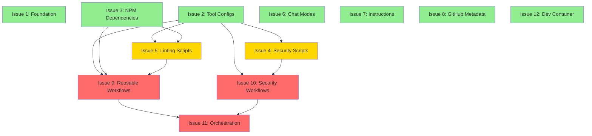
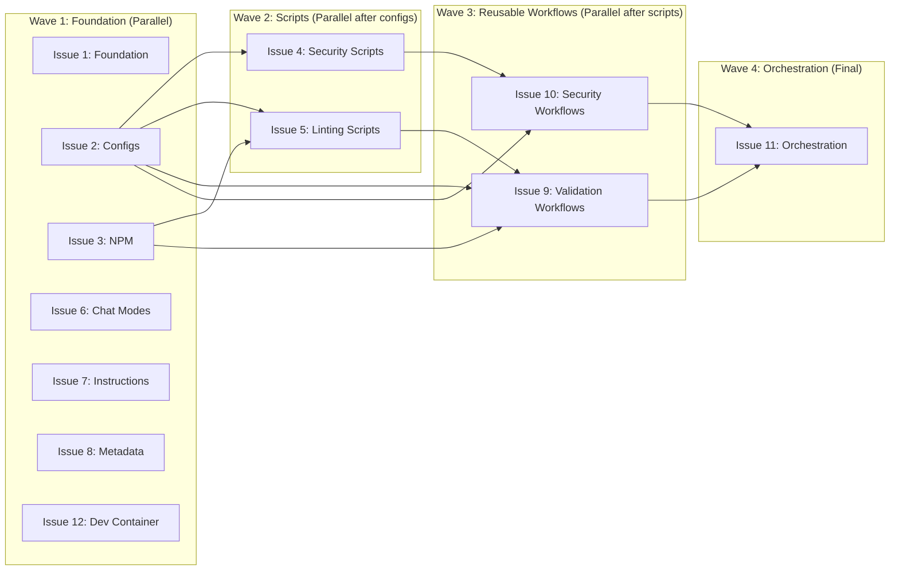

<!-- markdownlint-disable-file -->
# Task Research Document: PR Grouping Strategy for HVE Core Repository

This research document analyzes the current state of the HVE Core repository and provides a comprehensive strategy for grouping all existing changes into a series of independent pull requests that can be merged into an empty repository without dependencies or conflicts.

## Task Implementation Requests

* 📋 Create 12 distinct GitHub issues for PR grouping strategy
* 🔄 Define clear merge order for sequential and parallel PR workflows
* 📝 Document dependencies between issue groups
* ✅ Validate that no circular dependencies exist in the grouping strategy
* 🎯 Ensure each PR group is independently testable and mergeable

## Scope and Success Criteria

* **Scope**: Analyze the complete repository structure (all files, directories, configurations, workflows, scripts, documentation) and create a logical grouping strategy that enables parallel development and sequential merging without breaking the repository at any point
* **Assumptions**: 
  * Target repository is empty or newly initialized
  * All PRs will be reviewed and merged to `main` branch
  * Branch protection rules will be configured after initial foundational PRs
  * Team can work on multiple issues in parallel
  * Each PR should be independently reviewable and testable
* **Success Criteria**:
  * ✅ All repository files are assigned to exactly one issue/PR group
  * ✅ Dependency relationships are clearly documented
  * ✅ No circular dependencies exist
  * ✅ Issues can be worked on in parallel where dependencies allow
  * ✅ Repository remains in a functional state after each PR merge
  * ✅ Critical infrastructure (workflows, configs) are deployed early

## Outline

1. **Repository Inventory**: Complete listing of all files and directories
2. **Dependency Analysis**: Identification of file relationships and dependencies
3. **Grouping Strategy**: Logical grouping of files into 12 independent issues
4. **Merge Order & Parallelization**: Recommended sequences and parallel tracks
5. **Technical Scenarios**: Specific implementation approaches for each issue
6. **Validation Strategy**: How to verify each PR independently

### Potential Next Research

* 🔍 **Dependabot Configuration Analysis**
  * **Reasoning**: Need to understand if dependabot.yml exists and should be included in configuration PR
  * **Reference**: Not found in initial directory listings, need to verify
* 🔍 **GitHub Issue Templates Research**
  * **Reasoning**: Check if issue/PR templates exist that should be included in foundation PR
  * **Reference**: Standard `.github/ISSUE_TEMPLATE/` directory not verified yet
* 🔍 **GitHub Actions Secrets/Variables Requirements**
  * **Reasoning**: Determine if workflows require repository secrets or variables to be configured
  * **Reference**: Workflows reference npm packages and security tools that may need tokens

## Research Executed

### File Analysis

* **Root directory** (`c:\Users\wberry\src\hve-core\`)
  * Community files: `CODE_OF_CONDUCT.md`, `CONTRIBUTING.md`, `LICENSE`, `SECURITY.md`, `SUPPORT.md`
  * Main documentation: `README.md`
  * Configuration files: `.gitignore`, `.gitattributes`, `.npmrc`, `.cspell.json`, `.markdownlint.json`, `.markdownlint-cli2.jsonc`, `.gitleaks.toml`, `.checkov.yaml`
  * Package management: `package.json`, `package-lock.json`
  
* **`logs/` directory**
  * Generated artifacts: `dependency-pinning-results.json`, `sha-staleness-results.json`, `link-lang-check-results.json`, `psscriptanalyzer-results.json`, `psscriptanalyzer-summary.json`, `sha-staleness-monitoring.log`
  
* **`.github/` directory structure**
  * `chatmodes/`: 4 chat mode files + README (5 files total)
  * `instructions/`: 1 instruction file + README (2 files total)
  * `workflows/`: 15 workflow files + README (16 files total)
  * `prompts/`: Empty directory
  * Root: `CODEOWNERS`, `GITHUB_OVERVIEW.md`

* **`scripts/` directory structure**
  * `linting/`: 5 PowerShell scripts + 1 config + 1 module directory + README (8+ files)
    * `Invoke-LinkLanguageCheck.ps1`, `Invoke-PSScriptAnalyzer.ps1`, `Link-Lang-Check.ps1`, `Markdown-Link-Check.ps1`, `Validate-MarkdownFrontmatter.ps1`
    * `markdown-link-check.config.json`, `PSScriptAnalyzer.psd1`
    * `Modules/LintingHelpers.psm1`
  * `security/`: 3 PowerShell scripts + README (4 files)
    * `Test-DependencyPinning.ps1` (683 lines - comprehensive dependency checker)
    * `Test-SHAStaleness.ps1`
    * `Update-ActionSHAPinning.ps1`
  * Root: `README.md`

* **`.devcontainer/` directory**
  * `devcontainer.json`, `README.md` (2 files)

* **`.cspell/` directory**
  * 4 custom dictionary files: `azure-services.txt`, `general-technical.txt`, `industry-acronyms.txt`, `microsoft-sample-companies.txt`

* **`logs/` directory**
  * Directory structure for log file storage (appears to be empty/gitignored)

### Code Search Results

* **Workflow call patterns** - Search: `uses: \.\/\.github\/workflows`
  * Found 16 matches across 3 orchestration workflows
  * `pr-validation.yml`: Calls 9 reusable workflows (all validation + security scans with soft-fail)
  * `main.yml`: Calls 5 reusable workflows (validation + security scans with SARIF upload)
  * `weekly-security-maintenance.yml`: Calls 2 security workflows (gitleaks-scan, checkov-scan)

* **Reusable workflows identified**:
  * Validation: `spell-check.yml`, `markdown-lint.yml`, `table-format.yml`, `psscriptanalyzer.yml`, `frontmatter-validation.yml`, `link-lang-check.yml`, `markdown-link-check.yml`
  * Security: `gitleaks-scan.yml`, `checkov-scan.yml`
  * Maintenance: `weekly-security-maintenance.yml`, `sha-staleness-check.yml`
  * Legacy: `gitleaks.yml` (standalone trigger)

* **Script dependencies**:
  * All linting scripts import `Modules/LintingHelpers.psm1` (Lines ~24)
  * Workflows call PowerShell scripts directly from `scripts/linting/` and `scripts/security/`
  * PSScriptAnalyzer uses config: `PSScriptAnalyzer.psd1`
  * Markdown link check uses config: `markdown-link-check.config.json`

### External Research (Evidence Log)

* **GitHub Actions Best Practices** - `fetch_webpage`: GitHub Actions documentation
  * **Key Finding**: Reusable workflows should be merged before workflows that call them to avoid "workflow not found" errors
    * Source: [GitHub Actions - Reusing workflows](https://docs.github.com/en/actions/using-workflows/reusing-workflows)
  * **Key Finding**: Workflows require `contents: read` minimum permission; security scans need `security-events: write` for SARIF uploads
    * Source: [GitHub Actions - Permissions for GITHUB_TOKEN](https://docs.github.com/en/actions/security-guides/automatic-token-authentication#permissions-for-the-github_token)

* **NPM package.json structure**:
  * **Key Finding**: `package.json` defines all npm scripts and devDependencies required by workflows
    * Discovered in: `c:\Users\wberry\src\hve-core\package.json`
    * Scripts include: `spell-check`, `lint:md`, `format:tables`, `security:scan`, `security:checkov`
    * Dev dependencies: `cspell@^8.14.4`, `markdownlint-cli@^0.42.0`, `markdown-table-formatter@^1.6.0`, `markdown-link-check@^3.12.2`

* **Configuration file dependencies**:
  * `.cspell.json` → references dictionary files in `.cspell/` directory
  * `.markdownlint.json` and `.markdownlint-cli2.jsonc` → used by markdown-lint workflows
  * `.gitleaks.toml` → used by gitleaks-scan workflows
  * `.checkov.yaml` → used by checkov-scan workflows
  * All config files must be present before workflows that use them can execute successfully

### Project Conventions

* **Standards referenced**: 
  * Markdown frontmatter required for all `.md` files (based on `Validate-MarkdownFrontmatter.ps1` script)
  * SHA pinning mandatory for all GitHub Actions (enforced by `Test-DependencyPinning.ps1`)
  * All workflows include `step-security/harden-runner` for network auditing
  * Minimal permissions principle applied to all workflows
* **Instructions followed**: 
  * Repository uses emoji-enhanced documentation style (discovered in README files)
  * 4-channel result publishing pattern (annotations, artifacts, SARIF, summaries) in all workflows
  * Modular workflow architecture with single responsibility per workflow file

## Key Discoveries

### Project Structure

The repository follows a well-organized structure with clear separation of concerns:

```text
hve-core/
├── .github/                         # GitHub-specific configurations
│   ├── chatmodes/                   # Copilot chat mode definitions (5 files)
│   ├── instructions/                # Copilot coding instructions (2 files)
│   ├── workflows/                   # CI/CD workflows (16 files)
│   ├── prompts/                     # Empty - for future prompt templates
│   ├── CODEOWNERS                   # Code ownership definitions
│   └── GITHUB_OVERVIEW.md           # Repository overview
├── .cspell/                         # Custom spell-check dictionaries (4 files)
├── .devcontainer/                   # Dev container configuration (2 files)
├── scripts/                         # Automation scripts
│   ├── linting/                     # Validation scripts (8+ files)
│   └── security/                    # Security scanning scripts (4 files)
├── logs/                            # Log file storage directory
├── Root configs (11 files)          # Linting, security, git configurations
├── Package management (2 files)     # package.json, package-lock.json
└── Documentation (6 files)          # README, LICENSE, CODE_OF_CONDUCT, etc.
```

**Critical Discovery**: The repository implements a **modular GitHub Actions architecture** where:
* 9 reusable workflows handle specific validation/security tasks
* 2 orchestration workflows (`pr-validation.yml`, `main.yml`) compose these reusable workflows
* This architecture requires reusable workflows to exist before orchestration workflows can reference them

### Implementation Patterns

**Workflow Architecture Pattern**:
* **Reusable workflows** (`.github/workflows/{tool-name}.yml`): Single-responsibility workflows with `workflow_call` trigger
* **Orchestration workflows** (`.github/workflows/{pr-validation,main}.yml`): Compose multiple reusable workflows with appropriate inputs
* **Result Publishing**: 4-channel strategy (annotations, artifacts, SARIF for security, job summaries)

**Security Patterns**:
* SHA pinning with 40-character commit hashes for all GitHub Actions
* Comments include semantic version tags (e.g., `# v4.2.2`) for readability
* Minimal permissions (`contents: read` by default, escalate only when needed)
* Network hardening with `step-security/harden-runner` in all jobs
* `persist-credentials: false` in all checkouts

**Script Integration Pattern**:
* PowerShell scripts in `scripts/` directory called directly by workflows
* Shared module `LintingHelpers.psm1` provides GitHub Actions integration functions
* Scripts support both local execution and CI environment detection
* All scripts follow PSScriptAnalyzer compliance

### Complete Examples

#### Example: Modular Workflow Structure

```yaml
# Reusable workflow: .github/workflows/spell-check.yml
name: Spell Check

on:
  workflow_call:
    inputs:
      soft-fail:
        description: 'Whether to continue on spell check errors'
        required: false
        type: boolean
        default: false

permissions:
  contents: read

jobs:
  spell-check:
    name: Spell Check
    runs-on: ubuntu-latest
    steps:
      - name: Harden Runner
        uses: step-security/harden-runner@92c522aaa6f53af082553dedc1596c80b71aba33 # v2.10.2
        with:
          egress-policy: audit
      - name: Checkout code
        uses: actions/checkout@71cf2267d89c5cb81562390fa70a37fa40b1305e # v4.2.2
        with:
          persist-credentials: false
      - name: Setup Node.js
        uses: actions/setup-node@dda4788290998366da86b6a4f497909644397bb2 # v4.1.0
        with:
          node-version: '20'
          cache: 'npm'
      - name: Install dependencies
        run: npm ci
      - name: Run spell check
        run: npm run spell-check
```

```yaml
# Orchestration workflow: .github/workflows/pr-validation.yml
name: PR Validation

on:
  pull_request:
    branches:
      - main

permissions:
  contents: read

jobs:
  spell-check:
    uses: ./.github/workflows/spell-check.yml
    with:
      soft-fail: false
  
  markdown-lint:
    uses: ./.github/workflows/markdown-lint.yml
    with:
      soft-fail: false
  # ... more jobs
```

#### Example: Package.json Configuration

```json
{
  "name": "hve-core",
  "scripts": {
    "spell-check": "cspell \"**/*.{md,ts,js,json,yaml,yml}\"",
    "lint:md": "markdownlint \"**/*.md\" --ignore node_modules",
    "format:tables": "markdown-table-formatter \"**/*.md\"",
    "security:scan": "gitleaks detect --verbose",
    "security:checkov": "checkov -d . --framework github_actions json yaml secrets"
  },
  "devDependencies": {
    "cspell": "^8.14.4",
    "markdownlint-cli": "^0.42.0",
    "markdown-table-formatter": "^1.6.0",
    "markdown-link-check": "^3.12.2"
  }
}
```

### API and Schema Documentation

**GitHub Actions Workflow Schema**:
* `workflow_call` trigger: Enables reusable workflows
* `inputs`: Define parameters for reusable workflows (type: boolean, string, number)
* `permissions`: Specify GITHUB_TOKEN permissions at workflow and job level
* `uses: ./.github/workflows/{workflow}.yml`: Reference reusable workflows (local repository)

**PowerShell Script Integration**:
* Scripts use `$GITHUB_ENV` for setting environment variables visible to subsequent steps
* `$GITHUB_STEP_SUMMARY` for markdown-formatted job summaries
* Exit codes: `0` = success, non-zero = failure
* `continue-on-error: true` in workflow steps to support soft-fail patterns

### Configuration Examples

#### .cspell.json (Spell Check Configuration)
```json
{
  "version": "0.2",
  "language": "en",
  "dictionaries": [
    "azure-services",
    "general-technical",
    "industry-acronyms",
    "microsoft-sample-companies"
  ],
  "dictionaryDefinitions": [
    {
      "name": "azure-services",
      "path": "./.cspell/azure-services.txt"
    }
  ]
}
```

#### PSScriptAnalyzer.psd1 (PowerShell Linting Configuration)
```powershell
@{
    Severity = @('Error', 'Warning')
    ExcludeRules = @()
    IncludeDefaultRules = $true
}
```

## Technical Scenarios

### 1. PR Grouping Strategy for Empty Repository Population

**Description**: Strategy to populate an empty repository with all HVE Core components through a series of independent, parallelizable PRs that respect dependencies and maintain repository functionality at each merge point.

**Requirements:**
* ✅ No circular dependencies between PR groups
* ✅ Each PR is independently testable and reviewable
* ✅ Repository remains functional after each merge
* ✅ Maximize parallel development opportunities
* ✅ Infrastructure and tooling deployed early in the sequence
* ✅ Critical security configurations in place before code
* ✅ Documentation available from the first PR

**Preferred Approach:**

**12-Issue Grouping Strategy** with 5 parallel development tracks and clear dependency chain.

```text
📁 Repository Structure (Post-Implementation)
hve-core/
├── Issue #1: Foundation          # 🟢 No dependencies
├── Issue #2: Tool Configs         # 🟢 No dependencies  
├── Issue #3: NPM Dependencies     # 🟢 No dependencies
├── Issue #4: Security Scripts     # 🟡 Depends on #2
├── Issue #5: Linting Scripts      # 🟡 Depends on #2, #3
├── Issue #6: Copilot Chat Modes   # 🟢 No dependencies
├── Issue #7: Copilot Instructions # 🟢 No dependencies
├── Issue #8: GitHub Metadata      # 🟢 No dependencies
├── Issue #9: Reusable Workflows   # 🔴 Depends on #2, #3, #5
├── Issue #10: Security Workflows  # 🔴 Depends on #2, #4
├── Issue #11: Orchestration       # 🔴 Depends on #9, #10
└── Issue #12: Dev Container       # 🟢 No dependencies
```



**Implementation Details**:

#### Issue #1: Repository Foundation & Documentation
**Status**: 🟢 Independent (No dependencies)
**Merge Priority**: 1 (Critical - First PR)

**Files**:
```text
Root documentation and structure:
├── CODE_OF_CONDUCT.md             # Community guidelines
├── CONTRIBUTING.md                # Contributor guide
├── LICENSE                        # MIT license
├── README.md                      # Project overview
├── SECURITY.md                    # Security policy
├── SUPPORT.md                     # Support resources
├── .gitignore                     # Git ignore patterns
├── .gitattributes                 # Git attributes
├── .npmrc                         # NPM configuration
└── logs/                          # Log directory structure
```

**Rationale**: Foundation must be in place first. README provides context for all subsequent PRs. Community files establish contribution process. Git configs ensure consistent file handling.

**Testing Strategy**: 
* Verify README renders correctly on GitHub
* Validate all markdown files pass basic markdown linting
* Confirm `.gitignore` patterns work correctly

---

#### Issue #2: Development Tools Configuration
**Status**: 🟢 Independent (No dependencies)
**Merge Priority**: 1 (Can merge in parallel with #1, #3)

**Files**:
```text
Tool configuration files:
├── .cspell.json                   # Spell check main config
├── .cspell/                       # Custom dictionaries
│   ├── azure-services.txt         # Azure service names
│   ├── general-technical.txt      # Technical terms
│   ├── industry-acronyms.txt      # Industry acronyms
│   └── microsoft-sample-companies.txt  # Sample company names
├── .markdownlint.json             # Markdown linting rules
├── .markdownlint-cli2.jsonc       # Markdown CLI config
├── .gitleaks.toml                 # Secret scanning config
├── .checkov.yaml                  # IaC security config
├── scripts/linting/PSScriptAnalyzer.psd1          # PS linting rules
└── scripts/linting/markdown-link-check.config.json # Link check config
```

**Rationale**: Configuration files have no runtime dependencies and are required by scripts and workflows. Deploying early enables testing of subsequent PRs.

**Testing Strategy**:
* Validate JSON/YAML/TOML syntax
* Verify custom dictionaries load correctly with cspell
* Test configuration files with their respective tools locally

---

#### Issue #3: NPM/Node Dependencies
**Status**: 🟢 Independent (No dependencies)
**Merge Priority**: 1 (Can merge in parallel with #1, #2)

**Files**:
```text
Node.js package management:
├── package.json                   # NPM scripts and dependencies
└── package-lock.json              # Locked dependency versions
```

**Rationale**: Package definitions have no external dependencies. Scripts and workflows depend on these definitions to install and run npm-based tools.

**Testing Strategy**:
* Run `npm ci` to verify package-lock integrity
* Execute `npm run spell-check` (should fail gracefully if no configs present)
* Validate all scripts are executable

---

#### Issue #4: Security Scanning Scripts
**Status**: 🟡 Depends on Issue #2 (Tool configs)
**Merge Priority**: 2

**Files**:
```text
scripts/security/
├── README.md                      # Security scripts documentation
├── Test-DependencyPinning.ps1     # SHA pinning validation
├── Test-SHAStaleness.ps1          # SHA staleness checker
└── Update-ActionSHAPinning.ps1    # SHA update automation
```

**Dependencies**:
* Issue #2: Scripts may reference configuration files
* No npm dependencies (pure PowerShell scripts)

**Rationale**: Security scripts are independent utilities that can be tested locally before workflows use them. Critical for supply chain security enforcement.

**Testing Strategy**:
* Execute each script locally with `-Verbose` flag
* Test `Test-DependencyPinning.ps1` against repository root
* Validate PowerShell syntax with `Test-Path` and basic linting

---

#### Issue #5: Linting & Validation Scripts
**Status**: 🟡 Depends on Issues #2 (configs) and #3 (npm)
**Merge Priority**: 2 (After #2 and #3)

**Files**:
```text
scripts/linting/
├── README.md                      # Linting scripts documentation
├── Invoke-LinkLanguageCheck.ps1   # Language path detection
├── Invoke-PSScriptAnalyzer.ps1    # PowerShell static analysis
├── Link-Lang-Check.ps1            # Link language checker
├── Markdown-Link-Check.ps1        # Markdown link validation
├── Validate-MarkdownFrontmatter.ps1  # Frontmatter validation
└── Modules/
    └── LintingHelpers.psm1        # Shared helper module
scripts/
└── README.md                      # Scripts overview
```

**Dependencies**:
* Issue #2: Requires `PSScriptAnalyzer.psd1` and `markdown-link-check.config.json`
* Issue #3: Scripts invoke npm commands defined in `package.json`

**Rationale**: Linting scripts depend on both configuration files and npm packages. Must be available before workflows attempt to call them.

**Testing Strategy**:
* Run `Invoke-PSScriptAnalyzer.ps1 -Verbose` locally
* Execute `Validate-MarkdownFrontmatter.ps1` on sample markdown files
* Test `LintingHelpers.psm1` module import: `Import-Module ./scripts/linting/Modules/LintingHelpers.psm1`

---

#### Issue #6: GitHub Copilot Chat Modes
**Status**: 🟢 Independent (No dependencies)
**Merge Priority**: 1 (Can merge anytime, no blocking dependencies)

**Files**:
```text
.github/chatmodes/
├── README.md                      # Chat modes documentation
├── pr-review.chatmode.md          # PR review assistant
├── prompt-builder.chatmode.md     # Prompt engineering assistant
├── task-planner.chatmode.md       # Task planning assistant
└── task-researcher.chatmode.md    # Research assistant
```

**Rationale**: Chat modes are self-contained markdown files with no runtime dependencies. Pure documentation/configuration for GitHub Copilot extension.

**Testing Strategy**:
* Validate markdown syntax and frontmatter
* Test chat modes in VS Code with GitHub Copilot extension
* Verify `@task-planner` and other modes are recognized

---

#### Issue #7: GitHub Copilot Instructions
**Status**: 🟢 Independent (No dependencies)
**Merge Priority**: 1 (Can merge anytime)

**Files**:
```text
.github/instructions/
├── README.md                      # Instructions documentation
└── markdown.instructions.md       # Markdown coding standards
```

**Rationale**: Instruction files are self-contained markdown documents that GitHub Copilot reads. No runtime dependencies.

**Testing Strategy**:
* Validate markdown syntax and frontmatter
* Verify `applyTo` glob patterns in frontmatter
* Test with GitHub Copilot when editing matching files

---

#### Issue #8: GitHub Metadata
**Status**: 🟢 Independent (No dependencies)
**Merge Priority**: 1 (Can merge anytime, should merge early for governance)

**Files**:
```text
.github/
├── CODEOWNERS                     # Code ownership definitions
├── GITHUB_OVERVIEW.md             # Repository overview
├── dependabot.yml                 # Dependency update automation
├── PULL_REQUEST_TEMPLATE.md       # PR template with security checklist
├── ISSUE_TEMPLATE/
│   ├── general-issue.yml          # General issue template
│   ├── instruction-file-request.yml  # Copilot instruction file request
│   ├── prompt-request.yml         # Prompt template request
│   ├── chatmode-request.yml       # Chat mode/agent request
│   └── bug-report.yml             # Bug report template
└── prompts/                       # Empty directory (future use)
```

**Rationale**: Metadata files provide repository governance but have no code dependencies. `CODEOWNERS` should be in place early to enforce review requirements on subsequent PRs.

**Testing Strategy**:
* Validate `CODEOWNERS` syntax
* Verify team references (e.g., `@microsoft/hve-core-admins`) exist or will be created
* Test that `CODEOWNERS` patterns match expected file paths

---

#### Issue #9: Core GitHub Actions Workflows (Part 1: Validation Workflows)
**Status**: 🔴 Depends on Issues #2 (configs), #3 (npm), #5 (linting scripts)
**Merge Priority**: 3

**Files**:
```text
.github/workflows/
├── spell-check.yml                # Spell check reusable workflow
├── markdown-lint.yml              # Markdown linting reusable workflow
├── table-format.yml               # Table formatting reusable workflow
├── psscriptanalyzer.yml           # PowerShell linting reusable workflow
├── frontmatter-validation.yml     # Frontmatter validation reusable workflow
├── link-lang-check.yml            # Link language check reusable workflow
└── markdown-link-check.yml        # Link validation reusable workflow
```

**Dependencies**:
* Issue #2: Workflows reference config files (`.cspell.json`, `.markdownlint.json`, etc.)
* Issue #3: Workflows run `npm ci` and execute npm scripts
* Issue #5: Workflows invoke PowerShell scripts from `scripts/linting/`

**Rationale**: These are reusable workflows that must exist before orchestration workflows (`pr-validation.yml`, `main.yml`) can reference them via `uses: ./.github/workflows/{name}.yml`.

**Testing Strategy**:
* Validate YAML syntax for all workflow files
* Test each reusable workflow independently via workflow_dispatch (if implemented)
* Verify SHA pinning compliance using `Test-DependencyPinning.ps1`

---

#### Issue #10: Security GitHub Actions Workflows (Part 2: Security)
**Status**: 🔴 Depends on Issues #2 (configs), #4 (security scripts)
**Merge Priority**: 3 (After #2, #4; parallel with #9)

**Files**:
```text
.github/workflows/
├── gitleaks-scan.yml              # Gitleaks secret scanning reusable workflow
├── gitleaks.yml                   # Legacy standalone Gitleaks workflow
├── checkov-scan.yml               # Checkov IaC scanning reusable workflow
├── sha-staleness-check.yml        # SHA staleness check workflow
└── weekly-security-maintenance.yml # Weekly security maintenance workflow
```

**Dependencies**:
* Issue #2: Workflows reference `.gitleaks.toml` and `.checkov.yaml`
* Issue #4: `weekly-security-maintenance.yml` calls security scripts

**Rationale**: Security workflows are reusable workflows that orchestration workflows will call. Also includes standalone maintenance workflows.

**Testing Strategy**:
* Validate YAML syntax for all workflow files
* Test security scans independently
* Verify SARIF upload paths and permissions

---

#### Issue #11: PR & Main Branch Orchestration Workflows
**Status**: 🔴 Depends on Issues #9 (validation workflows), #10 (security workflows)
**Merge Priority**: 4 (Final workflow PR - must be last)

**Files**:
```text
.github/workflows/
├── pr-validation.yml              # PR validation orchestration workflow
├── main.yml                       # Main branch CI orchestration workflow
└── README.md                      # Workflows documentation
```

**Dependencies**:
* Issue #9: Calls 7 validation reusable workflows
* Issue #10: Calls 2 security reusable workflows

**Rationale**: Orchestration workflows compose all reusable workflows. Must be merged last to avoid "workflow not found" errors. This PR completes the CI/CD pipeline.

**Testing Strategy**:
* Validate YAML syntax
* Create test PR to trigger `pr-validation.yml`
* Verify all called workflows exist and execute successfully
* Test branch protection with required checks

---

#### Issue #12: Development Container Configuration
**Status**: 🟢 Independent (No dependencies)
**Merge Priority**: 1 (Can merge anytime)

**Files**:
```text
.devcontainer/
├── devcontainer.json              # Dev container configuration
└── README.md                      # Dev container documentation
```

**Rationale**: Dev container configuration is standalone and enables consistent development environments. No runtime dependencies on other repository components.

**Testing Strategy**:
* Validate JSON syntax in `devcontainer.json`
* Test container build: "Reopen in Container" in VS Code
* Verify all specified tools and extensions install correctly
* Run basic commands inside container

---

### Implementation Summary Table

| Issue # | Title | Files Count | Dependencies | Parallel Track | Merge Priority |
|---------|-------|-------------|--------------|----------------|----------------|
| 1 | Repository Foundation | 10 | None | Track A | 1 |
| 2 | Tool Configs | 11 | None | Track A | 1 |
| 3 | NPM Dependencies | 2 | None | Track A | 1 |
| 6 | Copilot Chat Modes | 5 | None | Track B | 1 |
| 7 | Copilot Instructions | 2 | None | Track B | 1 |
| 8 | GitHub Metadata | 11 | None | Track B | 1 |
| 12 | Dev Container | 2 | None | Track C | 1 |
| 4 | Security Scripts | 4 | #2 | Track D | 2 |
| 5 | Linting Scripts | 8 | #2, #3 | Track E | 2 |
| 9 | Validation Workflows | 7 | #2, #3, #5 | Track F | 3 |
| 10 | Security Workflows | 5 | #2, #4 | Track G | 3 |
| 11 | Orchestration Workflows | 3 | #9, #10 | Track H | 4 |

---

### Merge Order Strategy

#### Sequential Merge Order (Safest)
For teams that prefer sequential merging to minimize risk:

1. **Wave 1** (Merge Priority 1): Issues #1, #2, #3, #6, #7, #8, #12
   * Foundation, configs, docs, metadata (7 independent PRs)
   * Can be merged in any order within this wave
   
2. **Wave 2** (Merge Priority 2): Issues #4, #5
   * Scripts that depend on configs (2 PRs)
   * #4 can merge as soon as #2 is merged
   * #5 requires both #2 and #3 to be merged

3. **Wave 3** (Merge Priority 3): Issues #9, #10
   * Reusable workflows (2 PRs)
   * Both require configs and their respective scripts
   * Can merge in parallel once dependencies satisfied

4. **Wave 4** (Merge Priority 4): Issue #11
   * Orchestration workflows (1 PR - FINAL)
   * Requires all reusable workflows from #9 and #10

#### Parallel Development Tracks (Fastest)
For teams that want maximum parallelization:

**Track A - Foundation** (Work starts immediately):
* Issue #1: Foundation
* Issue #2: Tool Configs
* Issue #3: NPM Dependencies
* **Merge Order**: Any order, all independent

**Track B - Copilot Components** (Work starts immediately):
* Issue #6: Chat Modes
* Issue #7: Instructions
* Issue #8: GitHub Metadata
* **Merge Order**: Any order, all independent

**Track C - Dev Environment** (Work starts immediately):
* Issue #12: Dev Container
* **Merge Order**: Independent, can merge anytime

**Track D - Security Tooling** (Work starts after Track A Issue #2 merged):
* Issue #4: Security Scripts (depends on configs)
* Issue #10: Security Workflows (depends on #4)
* **Merge Order**: #4 → #10

**Track E - Validation Tooling** (Work starts after Track A Issues #2 and #3 merged):
* Issue #5: Linting Scripts (depends on configs + npm)
* Issue #9: Validation Workflows (depends on #5)
* **Merge Order**: #5 → #9

**Track F - Final Integration** (Work starts after Tracks D and E complete):
* Issue #11: Orchestration Workflows (depends on #9 and #10)
* **Merge Order**: Last PR - completes CI/CD pipeline

#### Dependency Chain Visualization



---

### Benefits of This Approach

✅ **Parallel Development**: 7 issues can start immediately (#1, #2, #3, #6, #7, #8, #12)
✅ **Clear Dependencies**: Explicit dependency chain prevents merge conflicts
✅ **Incremental Value**: Each PR adds working functionality (testable independently)
✅ **No Broken States**: Repository remains functional after every merge
✅ **Easier Review**: Logical groupings (5-10 files per PR typically) are manageable
✅ **Safe Merging**: Dependency order ensures workflows never reference missing files
✅ **Security First**: Security configs and scripts deployed before code that uses them
✅ **Documentation Available**: README and community files in first wave

#### Considered Alternatives (Removed After Selection)

**Alternative 1: Monolithic Single PR**
* **Rejected Reason**: Single massive PR with 70+ files would be extremely difficult to review, impossible to parallelize work, and high risk of conflicts if multiple team members contribute.

**Alternative 2: File-Type Grouping (Configs, Scripts, Workflows, Docs)**
* **Rejected Reason**: Creates circular dependencies. Workflows can't be tested without scripts, scripts can't run without configs, but this groups them separately without considering runtime dependencies.

**Alternative 3: 3-Issue Grouping (Foundation, Implementation, CI/CD)**
* **Rejected Reason**: Still too coarse-grained. Mixes independent components that could be parallelized, and creates large PRs that are harder to review.

**Alternative 4: Feature-Based Grouping (Spell Check, Markdown Lint, Security, etc.)**
* **Rejected Reason**: Would split configs from workflows that use them, creating complex cross-references and making it unclear what order to merge.

The **12-Issue Grouping Strategy** was selected because it:
* Respects natural file dependencies
* Maximizes parallelization (7 immediate-start issues)
* Creates reviewable PR sizes (2-11 files each)
* Ensures functionality at every merge point
* Provides clear merge order guidance
* Separates independent concerns (Copilot components, dev container, etc.)

