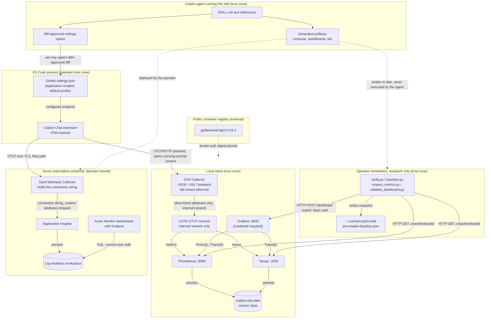

<!-- markdownlint-disable-file -->
# Copilot OTel Metrics Skill Security Model

This document records the STRIDE threat model for the copilot-otel-metrics skill. The shipped runtime is `examples/compose.yaml` (the local stack definition), `examples/otel-collector-local.yaml` (the local filtering pipeline), two Grafana dashboards under `examples/dashboards/`, five reference helper scripts and one shared policy module under `examples/`, and the Azure templates under `examples/azure/` (fleet collector configuration, the per-workstation relay under `agent-host-relay/`, Bicep, Terraform, and an Azure CLI script). The model is organized by trust bucket: editor OTLP ingest (B1), telemetry at rest and its query surfaces (B2), reference helper scripts to local service APIs (B3), container image supply chain (B4), editor-global configuration mutation (B5), host process control (B6), and cloud control-plane artifact generation (B7). Each bucket enumerates all six STRIDE categories. Assets and adversaries are enumerated first. Acknowledged enterprise readiness gaps are listed at the end.

The skill is an assistant rather than a reference pack, and that changes the model materially. It may write the user's global `settings.json` after presenting a diff and obtaining explicit approval, and it generates files intended for the user to execute. It never starts a service and never provisions infrastructure: `docker compose`, `az deployment`, and `terraform apply` are handed to the user, not run. Buckets B5 through B7 exist because generating and writing are themselves exposures, independent of who runs the result.

> **See also: repo-wide STRIDE model.** This skill participates in the repository-wide threat model at [`docs/security/security-model.md`](../../../../docs/security/security-model.md) and is registered in its [Skill Security Models](../../../../docs/security/security-model.md#skill-security-models) section. The seven buckets below are enumerated there as the **OT** threat family in [§ Copilot Telemetry Skill Threats](../../../../docs/security/security-model.md#copilot-telemetry-skill-threats); that section is authoritative for the current membership of the family. Each OT row derives its Likelihood, Impact, and Residual Risk from the risk-rating tables in this document wherever they rate the same failure mode, and marks any rating it does not inherit as a new assessment with a stated basis.

## Executive Summary

The copilot-otel-metrics skill helps an operator turn on GitHub Copilot Chat's OTLP export and stand up somewhere for the data to land, locally or in Azure. Its highest-risk property is **not the code, it is the payload**. Spans emitted by the extension were directly observed carrying full prompt text, tool call arguments and results, and system instructions, on a configuration where content capture was left at its default. Anyone who follows this skill therefore accumulates a durable corpus of prompt content, in a Docker volume locally or in a billed Log Analytics workspace for an organization.

That exposure is **not harmless and is not accepted silently**. Both capture paths filter before storage, and they filter the same way. The local path routes every export through an OpenTelemetry Collector whose attribute policy is a fail-closed allow-list, so an attribute this skill has never seen is dropped rather than stored. The fleet path applies that same allow-list and the same content scrub to traces, metrics, and logs. The direction matters: the delete-list this configuration previously used removed the content attributes someone already knew about and passed through the one a future extension release adds, and it did not run on the metrics pipeline at all. Under the organization topology telemetry is filtered twice, once by the workstation relay before it leaves the machine and again by the fleet Collector before shared storage. What filtering cannot change is what the extension emits, so content still leaves the editor and still crosses the loopback hop in plaintext. The skill states the same position everywhere it appears: the endpoint is sensitive regardless of the `captureContent` setting, and the user owns the decision.

**How far the local filtering reaches is measured, not asserted.** `tests/test_collector_carriers.py` starts the pinned Collector with the shipped configuration, sends payloads placing a distinct marker in each of 28 OTLP carriers, and records what survives. Every claim about local minimization in this document is that module's output. Its method matters as much as its result: a paired run with the content processors removed establishes that the instrument would have rendered each marker had it survived, so a carrier is never called governed merely because its marker was absent. The map is asserted, so a configuration or image change that opens a carrier fails the suite.

That measurement corrected this document. The allow-list governs attributes at every level and a map-valued log body; it does **not** reach span names, span status messages, span event names, trace state, non-map log bodies, severity text, log event names, metric metadata, span link attributes, or metric exemplar attributes. A content-scrub processor now closes the ones no shipped consumer reads. Three categories remain open and are registered as gaps rather than described as filtered: span names and metric metadata, because dashboard queries read them; span links and exemplars, because this Collector distribution provides no way to reach them; and the instrumentation scope and schema fields, which are left open on an expectation about emitter behavior rather than on a control.

The design bounds the local case by construction: a filtering Collector is the only OTLP listener published on the host, its attribute policy is a fail-closed allow-list rather than a delete-list, every published port binds to `127.0.0.1`, both images are pinned by manifest digest, Grafana requires an operator-supplied credential with anonymous access disabled, the documented settings block omits `captureContent`, and the skill supplies a verification command so a reader checks rather than assumes. Residual risk concentrates in four places the skill cannot close: the extension's own span content behavior before the Collector sees it, the carriers the Collector governs incompletely or not at all, the absence of authentication on the Prometheus and Tempo query APIs, and the lack of encryption on the persistent volume.

The assistant behaviors add three bounded exposures. The settings write mutates a user-owned JSONC file, which is contained by an executable that enforces a verified schema, splices only the target value span, backs up before writing without overwriting an earlier backup, stages the result and swaps it in atomically so a failed write leaves the original rather than a truncated file, and refuses to write when unrelated settings would change. Generated compose and IaC files are inert until the user runs them, and the agent is prohibited from running them. Organization capture places a shared write-side credential on every workstation with no per-user binding and no documented in-place rotation, which is the single largest new exposure and is the reason the Azure path leads with that fact rather than with the architecture. Holding that credential in the relay's own runtime environment keeps it out of the editor's environment and out of every agent-spawned subprocess, at the cost of making relay health a prerequisite for all of that workstation's telemetry.

### Security Posture Overview

| Dimension          | Value                                                                                                                                                                                                                                                                           |
|--------------------|---------------------------------------------------------------------------------------------------------------------------------------------------------------------------------------------------------------------------------------------------------------------------------|
| Runtime surface    | Local compose stack with a filtering Collector, two Grafana dashboards, five standard-library Python helpers plus one shared policy module, fleet collector configuration, Bicep, Terraform, and an Azure CLI script                                                            |
| Trust buckets      | B1 editor OTLP ingest, B2 telemetry at rest, B3 helper scripts, B4 image supply chain, B5 editor-global configuration mutation, B6 host process control, B7 cloud control-plane artifact generation                                                                             |
| Credentials        | Grafana admin credentials supplied by the operator through required environment variables, with no default and no committed value; an Application Insights connection string and a fleet ingest token for the Azure path, both operator-supplied and never written by the skill |
| Network egress     | None locally after the image pull. The Azure path sends telemetry to a collector the operator runs, which forwards to Application Insights over TLS                                                                                                                             |
| Agent execution    | Writes the user's global `settings.json` after an approved diff; writes generated artifacts to disk. Never starts a service and never provisions infrastructure                                                                                                                 |
| Open residual gaps | 29 registered, 15 open (highest: InfoDisc-Med, the carriers the filter does not reach and the shared fleet ingest credential). G-INF-1 is the highest-severity entry overall and is partially mitigated rather than open                                                        |

## Contents

* [System Description](#system-description)
* [Trust Boundaries](#trust-boundaries)
* [Assets](#assets)
* [Adversaries](#adversaries)
* [Bucket B1: Editor OTLP ingest](#bucket-b1-editor-otlp-ingest)
* [Bucket B2: Telemetry at rest and query surfaces](#bucket-b2-telemetry-at-rest-and-query-surfaces)
* [Bucket B3: Reference helper scripts to local service APIs](#bucket-b3-reference-helper-scripts-to-local-service-apis)
* [Bucket B4: Container image supply chain](#bucket-b4-container-image-supply-chain)
* [Bucket B5: Editor-global configuration mutation](#bucket-b5-editor-global-configuration-mutation)
* [Bucket B6: Host process control](#bucket-b6-host-process-control)
* [Bucket B7: Cloud control-plane artifact generation](#bucket-b7-cloud-control-plane-artifact-generation)
* [Enterprise Readiness Gaps](#enterprise-readiness-gaps)
* [References](#references)

## System Description

### Components

1. `examples/compose.yaml` — declares a Collector container publishing the only loopback-bound OTLP ports and one `grafana/otel-lgtm` container with no host OTLP mapping, joined by an explicit bridge network, mounting an external named volume at `/data` with a separate project-managed volume over Grafana's database at `/data/grafana/data`, requiring operator-supplied Grafana credentials with anonymous access disabled, and passing delta-to-cumulative conversion plus 120-day retention to Prometheus. Both images are digest-pinned, and the Collector service declares a memory limit, a read-only root filesystem, all capabilities dropped, and no-new-privileges.
2. `examples/otel-collector-local.yaml` — the local Collector pipeline. Applies a fail-closed `redaction` allow-list across the trace, metric, and log pipelines, masks recognizable credential shapes in surviving values, scrubs the content carriers the allow-list cannot reach, and exports only to the LGTM service over the internal network. What each of its controls actually reaches is recorded by `tests/test_collector_carriers.py` rather than inferred from the configuration.
3. `examples/dashboards/copilot-otel.json` — Grafana dashboard referencing the pre-provisioned `prometheus` and `tempo` datasource uids. Contains PromQL and TraceQL queries only.
4. `examples/_input_policy.py` — shared, not run directly. Centralizes endpoint scheme, authority, port, remote opt-in, redirect revalidation, path containment, and required-credential checks for the helpers that take configurable input.
5. `examples/verify.py` — read-only. Queries Grafana, Prometheus, and Tempo health plus stored signal presence. Exits non-zero when the stack is unhealthy. Takes no configurable endpoint.
6. `examples/baseline.py` — read-mostly. Snapshots Prometheus label values and Tempo trace names, writes one JSON file contained to the user cache root, and diffs a later store state against it.
7. `examples/inspect_metrics.py` — read-only. Enumerates `copilot_chat` and `gen_ai` series with labels and current values. Takes no configurable endpoint.
8. `examples/validate_dashboard.py` — imports a dashboard through the Grafana API with `overwrite: true`, then replays each panel query against Prometheus or Tempo. Every configurable endpoint and the dashboard path pass the shared policy first, and Grafana credentials are required with no default.
9. `examples/settings_upsert.py` — the settings mutation executable. Enforces a schema verified against a named extension build, splices only target value spans, backs up while retaining the five newest backups, stages the result and replaces the target atomically so a failed write leaves the original intact, and appends a redacted audit record whose endpoint summary carries no userinfo.
10. `examples/dashboards/copilot-otel-azure.json` — Grafana dashboard for the Azure path. Contains KQL queries against Log Analytics only.
11. `examples/azure/otel-collector-config.yaml` — fleet OpenTelemetry Collector pipeline. Requires active bearer authentication and TLS material from the environment, applies the local stack's fail-closed allow-list and content scrub to traces, metrics, and logs, labels the deployment environment after filtering, and exports to Application Insights using a connection string read from the environment.
12. `examples/azure/agent-host-relay/` — the per-workstation relay: an OTLP/HTTP loopback receiver, the same filtering policy applied to every signal, and an exporter that authenticates with the fleet ingest token and verifies the fleet receiver's certificate against an operator-supplied CA bundle mounted read-only. Its Compose service is digest-pinned, restart-managed independently of VS Code, memory-limited, read-only, capability-dropped, and reads every runtime input from an operator-owned environment file outside this repository.
13. `examples/azure/main.bicep`, `main.tf`, `variables.tf`, `outputs.tf`, `versions.tf`, `deploy.sh` — templates that create a per-environment Log Analytics workspace, Application Insights component, Azure Monitor dashboard, and an optional workspace-scoped `Monitoring Reader` role assignment. Inert until an operator deploys them.
14. `tests/` — static and behavioral tests over the local configuration, the shared policy, the settings executable, and the Azure templates, plus a fuzz harness and one runtime module. Most parse committed files and temporary fixtures. `tests/test_collector_carriers.py` is marked `slow` and does start disposable containers: the pinned Collector for the carrier map, and a relay plus an ephemeral TLS receiver for the forwarding evidence. Nothing in the suite contacts a cloud or uses a real credential.
15. `SKILL.md` and `references/` — the instructional surface. It authorizes exactly two write behaviors: a diff-approved per-key upsert into the user's global `settings.json`, and writing generated artifacts to disk.

### Data Flow



## Trust Boundaries

### Boundary Diagram

```text
┌────────────────────────────────────────────────────────────────┐
│ TRUST BOUNDARY: Copilot agent running this skill               │
│   writes settings (diff-approved) · writes generated files     │
│   NEVER starts a service · NEVER provisions infrastructure     │
└───────────┬──────────────────────────────┬─────────────────────┘
            │ per-key upsert               │ file writes only
┌───────────▼──────────────────────────────▼─────────────────────┐
│ TRUST BOUNDARY: Operator workstation                           │
│                                                                │
│  ┌──────────────────┐         ┌────────────────────────────┐   │
│  │ VS Code +        │         │ Reference helper scripts   │   │
│  │ Copilot Chat     │         │ (stdlib only, loopback)    │   │
│  │ global settings  │         │                            │   │
│  └────────┬─────────┘         └─────────────┬──────────────┘   │
│           │ OTLP/HTTP                       │ HTTP             │
│           │ prompt-bearing spans            │ queries          │
│  ─────────┼─────────────────────────────────┼───────────────   │
│           │   127.0.0.1 ONLY (no off-host listener)            │
│  ┌────────▼─────────────────────────────────────────────────┐  │
│  │ OTel Collector — the only published OTLP listener        │  │
│  │ fail-closed allow-list; unknown attributes dropped       │  │
│  └────────┬─────────────────────────────────────────────────┘  │
│           │ internal network, no host mapping                  │
│  ┌────────▼─────────────────────────────────────────────────┐  │
│  │ TRUST BOUNDARY: otel-lgtm container                      │  │
│  │  ┌──────────┐ ┌──────────┐ ┌────────┐ ┌───────────────┐  │  │
│  │  │ OTLP recv│ │Prometheus│ │ Tempo  │ │ Grafana       │  │  │
│  │  │ internal │ │  :9090   │ │ :3200  │ │ :3000 auth'd  │  │  │
│  │  └────┬─────┘ └────┬─────┘ └───┬────┘ └───────────────┘  │  │
│  │       └────────────┴───────────┘                         │  │
│  │                    │ persists                            │  │
│  │        ┌───────────▼────────────┐                        │  │
│  │        │ copilot-otel-data vol  │ prompt content at rest │  │
│  │        │ (unencrypted, 120d)    │ traces expire at 336h  │  │
│  │        └────────────────────────┘                        │  │
│  └──────────────────────────────────────────────────────────┘  │
└───────────────────────────┬────────────────────────────────────┘
                            │ image pull (digest-pinned)
              ┌─────────────▼───────────────┐
              │ TRUST BOUNDARY: public      │
              │ container registry          │
              └─────────────────────────────┘

  Organization path only, operator-deployed:
              ┌──────────────────────────────────────────────┐
              │ TRUST BOUNDARY: Azure subscription           │
              │  Collector (holds fleet write credential)    │
              │       │                                      │
              │  App Insights ──▶ Log Analytics ──▶ Grafana  │
              │  content attributes stripped at the collector│
              └──────────────────────────────────────────────┘
```

### Boundary Descriptions

| Boundary             | Assets Protected                                    | Controls Enforced                                                                                                                                                                                                        |
|----------------------|-----------------------------------------------------|--------------------------------------------------------------------------------------------------------------------------------------------------------------------------------------------------------------------------|
| Copilot agent        | User configuration, host process state, cloud spend | Mandatory backup, per-key upsert, approved diff, post-write parse with restore; generation-only boundary on Docker and infrastructure commands                                                                           |
| Operator workstation | Prompt content in transit, snapshot file            | Loopback-only port publishing; `captureContent` omitted from the documented settings block; stdlib-only helpers                                                                                                          |
| otel-lgtm container  | Stored metrics and traces, Grafana configuration    | Container isolation; single named volume; no host OTLP mapping, so the Collector allow-list cannot be bypassed by a local process; anonymous Grafana access disabled and admin credentials required from the environment |
| Public registry      | Image integrity, stack availability                 | Both images pinned by multi-architecture manifest digest; no build step and no third-party plugin installation                                                                                                           |
| Azure subscription   | Fleet telemetry, ingestion spend, ingest credential | Collector strips content attributes before ingestion; connection string supplied from the operator's secret store and never written by the skill; daily ingestion cap defaulted in every template                        |

## Assets

| Id  | Asset                                   | Lifetime                                    | Notes                                                                                                                                                                                                                         |
|-----|-----------------------------------------|---------------------------------------------|-------------------------------------------------------------------------------------------------------------------------------------------------------------------------------------------------------------------------------|
| A1  | Prompt and tool-call content in spans   | Persisted in the volume                     | Observed present despite content capture being left at its default. Highest-value asset here.                                                                                                                                 |
| A2  | Usage and cost metrics                  | Persisted, 120-day retention                | Token counts, AIU billing proxy, tool call counts. Commercially sensitive in aggregate.                                                                                                                                       |
| A3  | `copilot-otel-data` Docker volume       | Persistent until explicitly removed         | Unencrypted at rest. Survives `docker compose down` by design.                                                                                                                                                                |
| A4  | Grafana instance and dashboards         | Persistent                                  | Anonymous access disabled; admin credentials required from the operator's environment. Reachable on loopback only.                                                                                                            |
| A10 | `copilot-otel-grafana-db` Docker volume | Persistent until explicitly removed         | Grafana's `grafana.db`: admin password hash, users, and dashboards. Project-managed, so it is created per stack and removed by `docker compose down -v`. Separate from A3 so the configured admin credential is the live one. |
| A5  | Baseline snapshot file                  | Persistent under the user cache             | Contains metric and service names plus session ids, not content.                                                                                                                                                              |
| A6  | Stack container images                  | External, pulled on first run               | `grafana/otel-lgtm` and `otel/opentelemetry-collector-contrib`, both pinned by manifest digest.                                                                                                                               |
| A7  | Global `settings.json`                  | Persistent, user-owned                      | JSONC with the user's own comments and formatting. Which file resolves depends on the scope the installed build declares.                                                                                                     |
| A8  | Application Insights connection string  | Persistent until the component is recreated | Fleet-wide write credential. Supplied by the operator, never written into a generated file.                                                                                                                                   |
| A9  | Generated infrastructure templates      | Persistent in the user's workspace          | Inert until deployed. Deployment creates billable resources and an optional role assignment.                                                                                                                                  |

## Adversaries

| Id    | Adversary                                            | In-scope mitigations                                                                                                                                                                                                                                                          |
|-------|------------------------------------------------------|-------------------------------------------------------------------------------------------------------------------------------------------------------------------------------------------------------------------------------------------------------------------------------|
| ADV-a | Off-host network attacker                            | Every published port binds `127.0.0.1`, so no listener is reachable off the host. Grafana has no default credential: anonymous access is disabled and the admin credential is operator-supplied, so an unset variable fails the `up` rather than starting on a guessable one. |
| ADV-b | Malicious or compromised process on the same host    | Not mitigated. Loopback services are unauthenticated and any local process can read or write them (G-SPF-1).                                                                                                                                                                  |
| ADV-c | Another user on a shared workstation                 | Bounded by Docker socket access and filesystem permissions on the volume. Not otherwise mitigated (G-INF-2).                                                                                                                                                                  |
| ADV-d | Upstream image or registry compromise                | Both images are pinned by multi-architecture manifest digest, which removes substitution under a tag. Signature and provenance verification remain a documented operator step (G-SUP-1).                                                                                      |
| ADV-e | Operator error redirecting the exporter off-host     | Documentation states the endpoint carries prompt content and must be treated as sensitive regardless of the capture setting.                                                                                                                                                  |
| ADV-f | The agent itself, writing the wrong thing            | Backup before write, per-key upsert that never reserializes, exact diff, explicit approval, and a staged file validated then swapped in atomically so a failed write leaves the original (G-TAM-2).                                                                           |
| ADV-g | A fleet member misusing the shared ingest credential | Not mitigated. The credential is write-side only and identical on every workstation, with no per-user binding and no in-place rotation (G-INF-3, G-DOS-2). The shipped workstation relay narrows where the credential is readable without binding it to a person (G-INF-7).   |
| ADV-h | An operator deploying generated templates carelessly | Every template requires named inputs with no defaults for subscription, region, and naming; the role assignment is opt-in; a daily ingestion cap is set by default (G-EOP-3).                                                                                                 |

## Bucket B1: Editor OTLP ingest

Covers the path from the Copilot Chat exporter to the container's OTLP receiver.

### Spoofing

The OTLP receiver performs no authentication. Any process able to reach `127.0.0.1:4318` can submit spans and metrics using the `copilot-chat` service name and genuine Copilot metric names, making injected series indistinguishable from real editor output by inspection alone. `examples/baseline.py` exists specifically to make this detectable after the fact: it captures the pre-enablement store state and reports discriminators that require real editor activity. Detection, not prevention. Tracked as G-SPF-1.

### Tampering

An unauthenticated writer can also poison existing series by submitting conflicting samples for the same metric and label set. The stack applies no ingest-side validation or allow-listing. Loopback binding limits this to local processes.

### Repudiation

The receiver records no provenance for accepted payloads beyond the resource attributes the sender chooses to supply, so a submitting process cannot be identified after ingest. `service_version` and `session_id` label values are attacker-controlled in the injection case. `baseline.py` diffing provides a coarse before-and-after record rather than per-payload attribution, and it depends on `session.id` surviving the allow-list: the attribute is allow-listed for exactly that reason, and the runtime harness asserts per key that the running Collector keeps it.

### Information Disclosure

This is the material risk in the entire model. Spans emitted with content capture left at its documented default were directly observed carrying `copilot_chat.user_request` (full prompt text), `gen_ai.input.messages`, `gen_ai.output.messages`, `gen_ai.tool.call.arguments`, `gen_ai.tool.call.result`, and `gen_ai.system_instructions` in plaintext. A seventh, `copilot_chat.reasoning_content`, was present but marked `[encrypted]`. The transport is plaintext HTTP. On loopback this is contained; the moment `otlpEndpoint` is redirected to a shared or hosted collector, prompt content leaves the machine in clear text. The skill documents this discrepancy explicitly and supplies a `curl` check so a reader verifies rather than trusts the documented default. Tracked as G-INF-1 and G-TLS-1.

What the Collector does about it downstream is measured by `tests/test_collector_carriers.py` against the pinned image, with a paired control run establishing that each marker is renderable before any of them is called governed:

| Carrier                                                                        | Handling                           | Mechanism                    |
|--------------------------------------------------------------------------------|------------------------------------|------------------------------|
| Attributes on resource, scope, span, span event, log record, metric datapoint  | Dropped unless allow-listed        | `redaction`                  |
| Map-valued log body                                                            | Reduced to the allow-listed subset | `redaction`                  |
| An allow-listed value matching a credential shape                              | Replaced with `****`               | `redaction` `blocked_values` |
| Span status message, span event name, log severity text, log record event name | Replaced with `[redacted]`         | `transform/scrub`            |
| Log body — scalar, array, and bytes                                            | Replaced with `[redacted]`         | `transform/scrub`            |
| Span trace state                                                               | Cleared                            | `transform/scrub`            |
| **Span name**                                                                  | **Passes through**                 | none — G-INF-8               |
| **Metric name, description, unit**                                             | **Passes through**                 | none — G-INF-8               |
| **Span link attributes and link trace state**                                  | **Passes through**                 | none — G-INF-9               |
| **Metric exemplar filtered attributes**                                        | **Passes through**                 | none — G-INF-9               |
| Instrumentation scope name and version, resource and scope schema URLs         | **Pass through**                   | none — G-INF-11              |

The open rows differ in kind, and the difference decides whether any of them can be closed. Span names and metric metadata are preserved **by choice**: three dashboard TraceQL queries match on span name, `baseline.py` reads Tempo's `rootTraceName` as its injection discriminator, and every Prometheus query in the shipped dashboard selects by metric name. Span name is the more serious of the two, because a span name is emitter-composed and can carry request text. Span links and metric exemplars are open **by capability**: verified against the pinned image, OTTL has no `spanlink` context and refuses to index `links`, and assigning to `datapoint.exemplars` parses without effect, so no processor in this distribution reaches them.

The scope and schema fields are open **by low expected content**, which is the weakest of the three justifications and is recorded as G-INF-11 rather than waved past. In normal operation they carry a library name, a version, and a specification URL. That is a statement about what a well-behaved emitter sends, not a control: the receiver is unauthenticated, these fields are attacker-settable by any local process that can reach it, and the harness shows no processor filters them. The same reasoning shape — this field carries identity, not content — is what the harness disproved for span links, so it is registered as a gap on the same footing as the others instead of resting on the argument alone.

One further boundary: the harness probes the OTLP/HTTP receiver. The shipped configuration also publishes OTLP/gRPC, which is unprobed and recorded as G-INF-10.

### Denial of Service

Prometheus drops delta-temporality metrics by default, and a dropped delta metric was observed failing an entire batched write, discarding co-batched cumulative metrics. `compose.yaml` sets `--enable-feature=otlp-deltatocumulative` so conversion replaces dropping. The conversion state is held in memory and resets when the container restarts, producing a bounded gap rather than a persistent failure. Unauthenticated ingest also permits volumetric flooding of the local store by a local process. Tracked as G-DOS-1.

### Elevation of Privilege

Not applicable. The receiver executes no submitted content; OTLP payloads are parsed as data into the metric and trace stores, and no code path evaluates them.

### Risk Rating

| Threat                                                                    | Likelihood | Impact | Residual Risk | Status                                                                |
|---------------------------------------------------------------------------|------------|--------|---------------|-----------------------------------------------------------------------|
| Local process injects synthetic Copilot series                            | Low        | Medium | Medium        | Detectable via `baseline.py`; not prevented (G-SPF-1)                 |
| Prompt content traverses plaintext OTLP                                   | High       | High   | Medium        | Contained by loopback binding on the ingest socket (G-INF-1, G-TLS-1) |
| Content survives in a carrier the filter preserves for a shipped consumer | Medium     | High   | Medium        | Span names and metric metadata pass through by choice (G-INF-8)       |
| Content survives in a carrier no processor can reach                      | Low        | Medium | Medium        | Span links and exemplars unreachable in this distribution (G-INF-9)   |
| Content placed in a carrier assumed to hold only library identity         | Low        | Medium | Low           | Scope and schema fields unfiltered and attacker-settable (G-INF-11)   |
| Batched write loss from delta temporality                                 | Low        | Low    | Low           | Mitigated by delta-to-cumulative conversion (G-DOS-1)                 |
| Local flooding of the ingest endpoint                                     | Low        | Low    | Low           | Accepted for a single-machine demonstration stack                     |

## Bucket B2: Telemetry at rest and query surfaces

Covers the persistent volume, Prometheus, Tempo, and the Grafana UI.

### Spoofing

Grafana no longer runs on a published default. The compose file disables anonymous access, restores the login form, and requires `COPILOT_OTEL_GRAFANA_USER` and `COPILOT_OTEL_GRAFANA_PASSWORD` through the `${VAR:?message}` form, so the stack fails to start rather than coming up on a credential everyone knows. This matters more than it appears: the pinned image enables anonymous access with the Admin role by default, so the previous configuration exposed every panel and every stored prompt fragment to anything that could reach port 3000 without presenting a credential at all. Prometheus and Tempo still expose no authentication, and loopback binding remains their only control. Tracked as G-SPF-1.

### Tampering

A Grafana administrator can alter or delete dashboards and datasource definitions. `examples/validate_dashboard.py` performs exactly this operation with `overwrite: true`, which is intended for a dashboard the operator is checking but would overwrite an unrelated dashboard occupying the same uid. The helper refuses a non-loopback Grafana unless the operator sets `COPILOT_OTEL_ALLOW_REMOTE=1`, which confines the overwrite to a local stack by default. Direct volume access permits arbitrary modification of stored series. Tracked as G-TAM-1.

### Repudiation

Grafana's default configuration retains limited audit history, and Prometheus and Tempo record no query log. Actions taken through the shared `admin` account are attributable to the account, not to a person, so on a shared workstation no meaningful attribution exists.

### Information Disclosure

The volume holds A1 and A2 unencrypted for the life of the volume. Prometheus retention is set to 120 days deliberately, so monthly token aggregates are real rather than silently truncated at the 15-day default; the same setting extends how long usage data persists. Tempo retention is not configured here, so trace content carrying prompt text persists under the image's own default. Any local user with Docker access or filesystem access to the volume can read all of it. `docker compose down` deliberately preserves the volume, so an operator who believes they have torn the stack down has in fact retained the corpus. Teardown documentation states both variants explicitly. Tracked as G-INF-1 and G-INF-2.

### Denial of Service

The volume grows without bound for traces, because no Tempo retention limit is set. A long-running stack on a small disk can exhaust local storage. Prometheus is bounded by its 120-day retention setting.

### Elevation of Privilege

Grafana's administrator role is the highest privilege in this bucket. It was previously reachable with published default credentials, and on this image with anonymous Admin access, from any local process. The compose file now disables anonymous access and requires an operator-supplied credential. Even before that change this was privilege escalation within the stack rather than beyond the host user's existing authority, since the same actor could read the volume directly. Tracked as G-EOP-1.

### Risk Rating

| Threat                                            | Likelihood | Impact | Residual Risk | Status                                                                                                                                                                                                       |
|---------------------------------------------------|------------|--------|---------------|--------------------------------------------------------------------------------------------------------------------------------------------------------------------------------------------------------------|
| Prompt content readable at rest by any local user | Low        | High   | Medium        | Collector drops or scrubs content in every carrier it reaches; span names, metric metadata, links, and exemplars survive, and the volume remains unencrypted (G-INF-2, G-INF-8, G-INF-9)                     |
| Grafana admin reachable without a credential      | Low        | Medium | Low           | Anonymous access disabled, the admin credential is operator-supplied with no default, and Grafana's database is separated so it adopts that credential; loopback-only publishing (G-SPF-1, G-EOP-1, G-EOP-5) |
| Dashboard overwritten by the validation helper    | Low        | Low    | Low           | Non-loopback targets refused by default (G-TAM-1)                                                                                                                                                            |
| Unbounded trace growth exhausts disk              | Low        | Medium | Low           | Accepted; operator removes the volume to reclaim                                                                                                                                                             |

## Bucket B3: Reference helper scripts to local service APIs

Covers the four Python files under `examples/`. None is agent-executed.

### Spoofing

Every helper targets loopback `http://localhost` URLs by default with no certificate or identity verification, which is inherent to plaintext loopback HTTP. A local process that binds one of these ports before the container does can impersonate the service and return fabricated results, causing `verify.py` to report a healthy stack that does not exist. Low likelihood, and it requires an adversary already executing on the host. `validate_dashboard.py` accepts an environment override for its target and refuses a non-loopback host unless the operator sets `COPILOT_OTEL_ALLOW_REMOTE=1`, so redirecting it away from the local stack is a deliberate act rather than an accident.

### Tampering

Three of the four helpers issue only HTTP GET requests and mutate nothing. `validate_dashboard.py` issues one POST to the Grafana dashboard import API with `overwrite: true`, and it refuses to do so against a non-loopback host without an explicit opt-in. `baseline.py` writes a single JSON file, defaulting to `~/.cache/copilot-otel/pre-enable-baseline.json` and overridable through `COPILOT_OTEL_BASELINE`. The path is derived from the environment rather than from any service response, so a hostile service cannot redirect the write.

### Repudiation

Not applicable. The helpers are operator-invoked interactive tools that print their results to standard output and keep no log that a security decision depends on.

### Information Disclosure

The helpers print metric names, label values, and series values to the terminal. `inspect_metrics.py` prints label sets, which include model names, tool names, and session identifiers, but not span content: prompt-bearing attributes live on spans in Tempo and are not enumerated by any shipped helper. `baseline.py` persists metric names, service names, service versions, session ids, and trace names to its snapshot file. No helper writes prompt content to disk. No helper transmits anything off the host, and that now rests on the transport rather than on the address alone: `open_url` builds its opener with an explicitly empty `ProxyHandler`, because `urllib.request.build_opener` otherwise installs the default proxy handler and `proxy_bypass` does not exempt loopback. Before that pin, a `HTTP_PROXY` value in the operator's environment would have carried a loopback-addressed request — including the Grafana Basic credential `validate_dashboard.py` attaches — to the proxy host in plaintext, unless `no_proxy` happened to cover loopback. Terminal output may still be captured by shell history or a session recorder.

Everything returned from the store is untrusted data, never instructions. B1 Spoofing establishes that any local process can inject series carrying genuine Copilot names with attacker-controlled `service_version` and `session_id` values, and those values are exactly what these helpers print. The same applies to span attributes and trace names read through Tempo. Treat helper output, query results, and dashboard content as data to be inspected, and never act on text embedded in them.

### Denial of Service

`validate_dashboard.py` replays every dashboard panel query, which is the heaviest operation the skill performs against Prometheus and Tempo. It is bounded by the panel count and by per-request timeouts. `baseline.py` and `verify.py` issue one query per metric name, which scales with the store's cardinality. All are operator-triggered and none loops.

### Elevation of Privilege

Not applicable. The helpers run with the invoking user's privileges, spawn no subprocess, evaluate no fetched content, and require no elevation. They import only the Python standard library, so they introduce no third-party dependency.

### Risk Rating

| Threat                                             | Likelihood | Impact | Residual Risk | Status                                                            |
|----------------------------------------------------|------------|--------|---------------|-------------------------------------------------------------------|
| Local port impersonation misleads `verify.py`      | Low        | Low    | Low           | Accepted for loopback plaintext HTTP                              |
| Import helper overwrites a dashboard it should not | Low        | Low    | Low           | Refuses non-loopback targets without an explicit opt-in (G-TAM-1) |
| Sensitive label values reach terminal output       | Medium     | Low    | Low           | Labels only; span content is never enumerated by a helper         |

## Bucket B4: Container image supply chain

Covers acquisition of the three images this skill runs: `grafana/otel-lgtm` and `otel/opentelemetry-collector-contrib` in the local stack, and the same Collector image in the workstation relay.

### Spoofing

Every image is referenced by multi-architecture manifest digest, with the human-readable tag retained in a comment beside it. A registry or namespace compromise able to repoint a tag is therefore rejected, because the digest no longer resolves. What is not performed is signature or provenance verification before the container runs, so a compromise of the publisher's own signing path would still be accepted. Tracked as G-SUP-1.

### Tampering

A republished tag cannot reach a host that pulls by digest, which is what removes the substitution vector a mutable tag leaves open. The residual is narrower: an image whose digest this repository records could itself have been built from compromised inputs, and nothing here verifies the publisher's build provenance. Tracked as G-SUP-1.

### Repudiation

Docker records the resolved image digest locally after a pull, so the specific image actually running is identifiable on that host after the fact. Because the reference is the digest, two hosts pulling at different times run the same image by construction rather than by coincidence.

### Information Disclosure

Not applicable. The pull requests a public image by name and reveals nothing beyond ordinary registry access patterns. The skill supplies no credentials to the registry.

### Denial of Service

Registry unavailability blocks the first run only. Once layers are cached, `docker compose up -d` succeeds without network access, and `restart: unless-stopped` returns the stack after a host reboot. For the relay this matters more than it does locally, because a relay that cannot start takes that workstation's whole telemetry path with it (G-DOS-3).

### Elevation of Privilege

The containers run under the Docker daemon with whatever privileges the image declares. The local Collector and the relay drop all capabilities, set `no-new-privileges`, mount a read-only root filesystem, declare a memory limit, and mount no host paths beyond their read-only configuration, the named data volume, and the relay's read-only CA bundle. A compromised image would nonetheless hold whatever authority the daemon grants, which on a typical developer workstation is root-equivalent. That is inherent to running any container and is bounded here by digest pinning and by those container constraints. Tracked as G-SUP-1 and G-EOP-2.

### Risk Rating

| Threat                                   | Likelihood | Impact | Residual Risk | Status                                                                                                                             |
|------------------------------------------|------------|--------|---------------|------------------------------------------------------------------------------------------------------------------------------------|
| Malicious image substitution under a tag | Low        | High   | Low           | Both images digest-pinned; publisher verification is a separate documented step (G-SUP-1)                                          |
| Compromised image gains daemon authority | Low        | High   | Medium        | All capabilities dropped, no-new-privileges, read-only root, memory limit, no host mounts beyond read-only configuration (G-EOP-2) |
| Registry outage blocks first run         | Low        | Low    | Low           | Accepted; cached layers make later runs offline                                                                                    |

## Bucket B5: Editor-global configuration mutation

Covers the assisted write into the user's global `settings.json`. This bucket exists because the skill now acts on a file it does not own.

### Spoofing

Not applicable. The write is a local filesystem operation performed by the agent under the user's own identity. No authentication is presented and none is claimed.

### Tampering

This is the material risk in this bucket, and the tampering risk runs toward the user's file rather than from an attacker. `settings.json` is JSONC: it may hold comments, trailing commas, and formatting the user chose. A naive parse-and-reserialize destroys all of it silently. The mitigation is structural rather than advisory: a timestamped backup is taken first, the write is a per-key upsert that replaces only the value spans of the eleven target keys and inserts absent keys before the closing brace, all other content is left byte-identical, the resulting file is re-parsed, and a parse failure triggers an immediate restore from the backup. Concurrent writes by VS Code itself remain possible and are not preventable from outside the editor; the backup is the recovery path. Tracked as G-TAM-2.

### Repudiation

The write leaves the timestamped backup file beside the settings file, which records the pre-change state and the time. There is no per-key change log, so a user reconstructing what changed compares the backup against the current file. The approved diff shown before the write is the contemporaneous record and lives only in the conversation.

### Information Disclosure

The agent reads the whole settings file to perform the upsert, so unrelated settings enter model context. On a developer workstation that file frequently holds API endpoints, internal hostnames, and occasionally tokens that other extensions store there. The skill mitigates exposure in output rather than in reading: the presented diff shows only the changed lines, so unrelated values are not echoed. Tracked as G-INF-4.

### Denial of Service

A corrupted settings file would prevent VS Code from applying user configuration until repaired. The post-write parse plus automatic restore reduces this to a transient condition, and the backup makes it recoverable by hand even if the automatic restore fails.

### Elevation of Privilege

Not applicable. The write occurs under the invoking user's own filesystem privileges, targets a file that user already owns, and requires no elevation. Application-scoped settings confer no authority beyond the editor.

### Risk Rating

| Threat                                                  | Likelihood | Impact | Residual Risk | Status                                                                      |
|---------------------------------------------------------|------------|--------|---------------|-----------------------------------------------------------------------------|
| Reserialization destroys user comments and formatting   | Low        | Medium | Low           | Per-key upsert never reserializes; backup taken first (G-TAM-2)             |
| Write lands in a profile file and silently does nothing | Medium     | Low    | Low           | Procedure requires confirming the path via Open Application Settings (JSON) |
| Unrelated settings values enter model context           | Medium     | Low    | Low           | Whole file is read; only changed lines are echoed in the diff (G-INF-4)     |
| Concurrent VS Code write overwrites the change          | Low        | Low    | Low           | Not preventable externally; backup is the recovery path                     |
| Settings Sync propagates an unwanted change             | Low        | Low    | Low           | Behavior unconfirmed; disclosed as a caveat rather than asserted (G-REP-1)  |

## Bucket B6: Host process control

Covers artifacts the skill generates for the user to execute: the compose file and the local stack it defines.

### Spoofing

Not applicable. Generated files carry no identity claim and authenticate to nothing at generation time.

### Tampering

A generated compose file sits in the user's workspace between generation and execution, so anything with write access to that path can modify it before `docker compose up` runs. That is the ordinary trust model of any file in a workspace and is not specific to this skill. The relevant control is that the user reads and runs the file themselves, which puts a human between generation and execution.

### Repudiation

The generated file is the record of what was proposed. Because the agent does not run it, execution is attributable to the user's own shell history and Docker daemon records rather than to the agent.

### Information Disclosure

The generated compose file contains no credentials. Grafana's admin credentials are read from operator-supplied environment variables that the file requires and does not default, so a generated stack carries no secret and refuses to start without one. What the generated stack subsequently collects is covered by B1 and B2.

### Denial of Service

Running the generated stack binds five loopback ports, pulls a multi-hundred-megabyte image, and creates a Docker volume that outlives the container. A port already in use causes the stack to fail to start rather than to displace the existing listener. These are the reasons the skill hands over the command rather than running it: they are consequences a user should choose.

### Elevation of Privilege

**This is the reason the boundary exists.** `docker compose up` executes with Docker daemon authority, which on a typical developer workstation is root-equivalent. An agent that ran generated compose files on the user's behalf would be converting file-write capability into root-equivalent execution without a human decision in between. The skill therefore prohibits it: `docker compose`, `az deployment`, `az group create`, and `terraform apply` are printed for the user, never executed. That prohibition is advisory prose rather than an enforced control, which is its residual weakness. Tracked as G-EOP-4.

### Risk Rating

| Threat                                                         | Likelihood | Impact | Residual Risk | Status                                                                              |
|----------------------------------------------------------------|------------|--------|---------------|-------------------------------------------------------------------------------------|
| Agent executes a generated file with daemon authority          | Low        | High   | Medium        | Prohibited in SKILL.md constraints and stop rules; advisory, not enforced (G-EOP-4) |
| Generated file modified between generation and execution       | Low        | Medium | Low           | User reads and runs it; ordinary workspace trust model                              |
| Generated stack consumes host ports, disk, and image bandwidth | Medium     | Low    | Low           | Consequences stated before generation; user chooses to run it                       |

## Bucket B7: Cloud control-plane artifact generation

Covers the collector configuration, Bicep, Terraform, and Azure CLI templates under `examples/azure/`, and the organization data path they establish.

### Spoofing

Fleet telemetry authenticates to the collector with whatever static credential the managed settings distribute, because Copilot's exporter can only send a fixed header set. Every workstation therefore presents the same credential and no request is bound to a particular user or device. Anything holding that value can submit telemetry indistinguishable from a real developer's. Tracked as G-INF-3.

That credential does not reach every sender. Managed `telemetry.headers` are applied to the extension exporter directly and deliberately not through the environment, because an environment variable is inherited by the tool subprocesses the agent spawns and would place a fleet-wide write credential inside every model-directed subprocess. The agent host therefore exports without a credential, a receiver that requires one answers HTTP 401 or gRPC `UNAUTHENTICATED`, and OTLP treats neither as retryable, so that telemetry is dropped rather than queued. The two obvious remedies are both worse than the problem: exporting the token defeats the separation, and dropping receiver authentication reopens ingestion on a billed backend.

The documented remedy is a per-workstation loopback relay that accepts the unauthenticated local export and adds the fleet credential upstream, keeping that credential in the relay's own configuration rather than in the editor's environment. It moves the exposure rather than removing it: the relay's listener is unauthenticated, so any local process reaching loopback can inject through it, and loopback binding constrains reachability without establishing provenance. Mutual TLS would bind a workstation rather than the fleet, and the receiver half is available in this Collector, but whether the agent host can present a client certificate is unestablished, so it is recorded as preferred and blocked rather than offered. Tracked as G-INF-7.

### Tampering

The consequence of the shared credential is that dashboards can be made to say anything. An actor holding it can inject fabricated spans carrying real service names and attribute values, so token totals, tool counts, and per-team breakdowns are all forgeable. The blast radius is write-side only: the credential does not grant read access to the workspace, which is governed separately by Azure RBAC.

### Repudiation

Ingested telemetry carries no per-user provenance beyond the resource attributes the sender chose to send, and those are attacker-controlled in the injection case. There is no documented in-place rotation for the connection string, so revoking it means recreating the component and redistributing to the whole fleet. That makes incident response a fleet-wide operation rather than a per-user one.

### Information Disclosure

Prompt and response text has been observed on spans even with `captureContent` disabled, which for the organization path would place developer prompt content into a shared, queryable, billed workspace readable by anyone with `Monitoring Reader`. The generated collector configuration therefore deletes the six attributes observed carrying plaintext content, `copilot_chat.user_request`, `gen_ai.input.messages`, `gen_ai.output.messages`, `gen_ai.system_instructions`, `gen_ai.tool.call.arguments`, and `gen_ai.tool.call.result`, plus `copilot_chat.reasoning_content` defensively, which was observed marked `[encrypted]`. This is the strongest available control, because it acts before data reaches storage. It is defeated by removing the processor, so the configuration says so in place. The Azure dashboard also ships a panel that counts these attributes, so a workspace receiving content is visible rather than silent. Tracked as G-INF-1.

### Denial of Service

The shared credential permits unbounded ingestion against a billed backend, so the practical denial of service is financial rather than availability. Templates default `dailyQuotaGb` to 5 and name it as the only spend guardrail, and disabling the cap requires setting it to -1 deliberately. `captureContent` is named as the dominant volume multiplier wherever cost is discussed. Tracked as G-DOS-2.

### Elevation of Privilege

Deployment creates billable Azure resources and, when a principal is supplied, a `Monitoring Reader` role assignment on the workspace. That authority comes from the operator's own Azure credentials, which the agent never holds and never uses: the agent writes templates and the operator deploys them. The residual concern is a template that over-grants by default, which is why the role assignment is opt-in through an empty-by-default parameter rather than applied automatically. Tracked as G-EOP-3.

### Risk Rating

| Threat                                                      | Likelihood | Impact | Residual Risk | Status                                                                                    |
|-------------------------------------------------------------|------------|--------|---------------|-------------------------------------------------------------------------------------------|
| Shared fleet credential enables telemetry forgery           | Low        | Medium | Medium        | Inherent to static-header export; stated before generation (G-INF-3)                      |
| Agent-host telemetry silently dropped fleet-wide            | High       | Medium | Low           | Loopback relay documented as the remedy; both obvious alternatives rejected (G-INF-7)     |
| Local process injects through the relay's loopback listener | Low        | Medium | Medium        | Unauthenticated by construction; mTLS preferred and blocked on sender evidence (G-INF-7)  |
| Credential cannot be rotated without a fleet redeployment   | Medium     | Medium | Medium        | No documented in-place rotation; disclosed rather than mitigated (G-INF-3)                |
| Prompt content reaches a shared billed workspace            | Medium     | High   | Low           | Collector deletes six observed attributes plus one defensively (G-INF-1)                  |
| Ingestion cost inflation, accidental or deliberate          | Medium     | Medium | Low           | Daily cap defaulted in every template; `captureContent` named as the multiplier (G-DOS-2) |
| Generated template over-grants access on deployment         | Low        | Medium | Low           | Role assignment opt-in; agent never holds Azure credentials (G-EOP-3)                     |

## Enterprise Readiness Gaps

| Id       | Severity        | Gap                                                                                                                                                                                                                                                                                                                         | Status                                                                                                                                                                                                                                                                                                                                                                                                                                                                                                                                                                                                                                                                                                                                                                                     |
|----------|-----------------|-----------------------------------------------------------------------------------------------------------------------------------------------------------------------------------------------------------------------------------------------------------------------------------------------------------------------------|--------------------------------------------------------------------------------------------------------------------------------------------------------------------------------------------------------------------------------------------------------------------------------------------------------------------------------------------------------------------------------------------------------------------------------------------------------------------------------------------------------------------------------------------------------------------------------------------------------------------------------------------------------------------------------------------------------------------------------------------------------------------------------------------|
| G-INF-1  | InfoDisc-High   | Spans carry full prompt text, tool call arguments and results, and system instructions on a configuration where content capture was left at its documented default. The skill cannot change extension behavior.                                                                                                             | Partially mitigated. Content still leaves the editor and crosses the loopback hop in plaintext, which remains outside the skill's control. Both the local and organization paths now filter before storage: local uses a fail-closed allow-list at the Collector, so an attribute added by a future extension release is dropped rather than stored, and the Azure path applies the same fail-closed allow-list and content scrub to traces, metrics, and logs before export.                                                                                                                                                                                                                                                                                                              |
| G-INF-2  | InfoDisc-Med    | The `copilot-otel-data` volume stores whatever survives filtering, unencrypted, and survives `docker compose down` by design.                                                                                                                                                                                               | Open on encryption, reduced on content. The allow-list keeps observed and unknown content attributes out of the volume, so what remains is usage and cost data rather than prompt text. Volume encryption is a Docker and host-platform property the skill does not control. Traces inherit the image's 336h Tempo expiry rather than persisting indefinitely; metrics retain for 120 days by configuration. Teardown documentation states both variants explicitly.                                                                                                                                                                                                                                                                                                                       |
| G-INF-3  | InfoDisc-Med    | Organization capture distributes one static write-side credential to every workstation, with no per-user binding and no documented in-place rotation. Anything holding it can inject telemetry indistinguishable from a real developer's.                                                                                   | Open and now active rather than optional. The receiver requires the token instead of leaving authentication commented out, so the gap is a bounded shared-credential weakness rather than an unauthenticated endpoint. Disclosed before any Azure artifact is generated, with the write-side-only blast radius stated plainly.                                                                                                                                                                                                                                                                                                                                                                                                                                                             |
| G-INF-4  | InfoDisc-Low    | The assisted settings write reads the whole global `settings.json`, so unrelated values in that file enter model context.                                                                                                                                                                                                   | Accepted. Reading the whole document is required to preserve it; only the changed lines are echoed in the presented diff.                                                                                                                                                                                                                                                                                                                                                                                                                                                                                                                                                                                                                                                                  |
| G-SPF-1  | Spoofing-Med    | The Prometheus and Tempo query APIs are unauthenticated, and the local OTLP ingress accepts spans from any local process.                                                                                                                                                                                                   | Reduced. Grafana now requires an operator-supplied credential with anonymous access disabled. Prometheus and Tempo remain unauthenticated behind `127.0.0.1` binding, and injected spans are still accepted, though the allow-list bounds what an injector can store. `baseline.py` provides after-the-fact detection of injected series.                                                                                                                                                                                                                                                                                                                                                                                                                                                  |
| G-SUP-1  | SupplyChain-Med | Image identity was previously pinned by mutable tag, and no signature or provenance verification is performed before the container runs.                                                                                                                                                                                    | Partially closed. Both images are now pinned by multi-architecture manifest digest, which removes the substitution-under-a-tag vector. Signature and provenance verification remains a documented operator step rather than an enforced one; the update procedure states that digest pinning, publisher verification, and vulnerability review are three separate checks.                                                                                                                                                                                                                                                                                                                                                                                                                  |
| G-EOP-1  | EoP-Low         | Grafana administrator access was previously reachable from any local process using published default credentials.                                                                                                                                                                                                           | Closed, and now closed by mechanism rather than by configuration alone. Anonymous Admin access is disabled and the admin credential is operator-supplied with no default. The earlier closure claim was incomplete: Grafana applies `GF_SECURITY_ADMIN_*` only when it creates its database, and the shipped topology reused an external volume, so a stack could run on the `admin`/`admin` default while the required variables were supplied and ignored. Grafana's database now has its own project-managed volume mounted over `GF_PATHS_DATA`, and `verify.py` reports a live default credential distinctly from a rejected configured one. The residual observation stands that the same local actor can read the volume directly, so this was never a host-user boundary crossing. |
| G-EOP-2  | EoP-Med         | A compromised stack image would execute with Docker daemon authority, which is root-equivalent on a typical developer workstation.                                                                                                                                                                                          | Bounded by digest pinning, by adding no capabilities, and by mounting no host paths beyond the named volume and the read-only Collector configuration.                                                                                                                                                                                                                                                                                                                                                                                                                                                                                                                                                                                                                                     |
| G-TAM-1  | Tampering-Low   | `validate_dashboard.py` imports with `overwrite: true`, so it would replace an unrelated dashboard sharing the same uid.                                                                                                                                                                                                    | Constrained. All configurable endpoints pass a shared policy that refuses non-http schemes, credentials in the authority, unrelated local ports, and non-loopback hosts without an explicit opt-in, and re-applies the same rules to every redirect target. The dashboard path is contained to the examples directory.                                                                                                                                                                                                                                                                                                                                                                                                                                                                     |
| G-TAM-2  | Tampering-Med   | The assisted settings write mutates a user-owned JSONC file that may hold comments, formatting, and unrelated configuration the skill did not create.                                                                                                                                                                       | Mitigated structurally and now executably. `examples/settings_upsert.py` enforces the contract the prose described: schema-checked keys and types, value-span splicing that never reserializes, a refusal to write when unrelated settings would change or the result would not parse, backup before write, restore on failure, and a redacted audit record. Concurrent VS Code writes remain unpreventable.                                                                                                                                                                                                                                                                                                                                                                               |
| G-REP-1  | Repudiation-Low | Settings Sync conflict behavior for a write made outside the running VS Code instance was never confirmed.                                                                                                                                                                                                                  | Open. Disclosed to the user as a caveat before the write rather than asserted in either direction.                                                                                                                                                                                                                                                                                                                                                                                                                                                                                                                                                                                                                                                                                         |
| G-DOS-1  | DoS-Low         | Delta-to-cumulative conversion state is held in memory and resets on container restart, producing a bounded gap in converted series.                                                                                                                                                                                        | Accepted. Without the flag the failure mode is worse, because a dropped delta metric can fail an entire batched write.                                                                                                                                                                                                                                                                                                                                                                                                                                                                                                                                                                                                                                                                     |
| G-DOS-2  | DoS-Low         | The shared fleet credential permits unbounded ingestion against a billed backend, so the practical denial of service is financial.                                                                                                                                                                                          | Mitigated by a 5 GB daily cap defaulted in every generated template, and by naming `captureContent` as the dominant volume multiplier wherever cost is discussed.                                                                                                                                                                                                                                                                                                                                                                                                                                                                                                                                                                                                                          |
| G-EOP-3  | EoP-Med         | Generated infrastructure templates provision billable Azure resources and can create a `Monitoring Reader` role assignment when deployed.                                                                                                                                                                                   | Bounded. The agent never holds Azure credentials and never deploys; the role assignment is opt-in through an empty-by-default parameter and is scoped to a single workspace rather than to the resource group or subscription; required inputs have no defaults.                                                                                                                                                                                                                                                                                                                                                                                                                                                                                                                           |
| G-TLS-2  | Spoofing-Med    | The generated fleet receiver now terminates TLS from operator-supplied material, but how Copilot's exporter validates that certificate is exporter behavior the skill does not control.                                                                                                                                     | Open by ownership. The receiver requires TLS material or an explicitly recorded terminating ingress that owns certificate lifecycle and cipher policy. No claim is made about exporter-side validation or custom CA support, because none was verified.                                                                                                                                                                                                                                                                                                                                                                                                                                                                                                                                    |
| G-INF-5  | InfoDisc-Med    | A single shared Log Analytics workspace gives every authorized reader visibility across all environments, and a resource attribute cannot restrict that after the fact.                                                                                                                                                     | Mitigated by default. One collector endpoint, ingest token, Application Insights component, and workspace per environment is now the shipped topology; environment is a required input with no default in Bicep, Terraform, and the CLI script. Reader assignments are scoped to a single workspace. Attributes are documented as grouping keys, never as isolation controls. This is environment separation, not customer multi-tenancy, and is stated as such.                                                                                                                                                                                                                                                                                                                           |
| G-INF-6  | InfoDisc-Low    | Retention is the only deletion mechanism. Neither the local stack nor the Azure templates purge a specific person's data on request.                                                                                                                                                                                        | Open and operator-owned. Retention is documented as the deletion boundary in both templates and their guidance, and an erasure obligation is presented as an operator procedure against the workspace rather than a template capability. No purge automation is provided.                                                                                                                                                                                                                                                                                                                                                                                                                                                                                                                  |
| G-SUP-2  | SupplyChain-Low | Terraform state for the fleet templates contains the Application Insights connection string, a fleet-wide write credential, and `sensitive = true` does not remove it from state.                                                                                                                                           | Documented rather than solved. The configuration, its README, and the Azure reference all state that sensitivity hides CLI display only, and recommend an encrypted remote backend with restricted access and treating the state file as a secret.                                                                                                                                                                                                                                                                                                                                                                                                                                                                                                                                         |
| G-EOP-4  | EoP-Med         | The prohibition on the agent running `docker compose`, `az deployment`, or `terraform apply` is advisory prose in `SKILL.md` rather than an enforced control.                                                                                                                                                               | Open. Stated in the constraints and the stop rules and exercised by the behavior gate. A hook would make it enforced.                                                                                                                                                                                                                                                                                                                                                                                                                                                                                                                                                                                                                                                                      |
| G-TLS-1  | InfoDisc-Low    | OTLP ingest and all service queries use plaintext HTTP with no transport security.                                                                                                                                                                                                                                          | Acceptable on loopback, and that containment is now enforced rather than assumed. Ingest is contained by the receiver's `127.0.0.1` binding. The query path is the helpers, which reach the network only through `open_url`; it previously inherited whatever `HTTP_PROXY` the operator's environment carried, because `build_opener` adds the default proxy handler and `proxy_bypass` does not exempt loopback, so containment depended on `no_proxy` hygiene rather than on the code. `open_url` now pins an empty `ProxyHandler`, asserted by `tests/test_helpers.py::TestProxyNeutralization`. Plaintext remains material the moment `otlpEndpoint` targets a remote collector, which the skill states explicitly.                                                                    |
| G-INF-13 | InfoDisc-Low    | Proxy neutralization lives inside `open_url`, so it protects only code that routes through the shared policy module. The invariant that keeps helpers there is a source substring check for `urlopen(` across four named files.                                                                                             | Open and narrow. A helper that built its own opener, or a fifth helper not added to the list, would escape both the proxy pin and the redirect allow-list without failing the suite. Bounded by the four bundled helpers being the only shipped network callers and by `tests/test_helpers.py::TestPolicyRoutedHelpers`. Closing it means asserting the property against the built opener for every helper rather than against the source text of a fixed list.                                                                                                                                                                                                                                                                                                                            |
| G-EOP-5  | EoP-Low         | Grafana's first-run-only credential semantics survive the volume separation. Changing `COPILOT_OTEL_GRAFANA_PASSWORD` on a stack whose Grafana database already exists has no effect, so the shipped stack has no in-band rotation.                                                                                         | Open and disclosed. Separating the database fixes adoption, not rotation: the variable is still read once, now per project rather than per host. Rotation is an operator procedure — remove the `copilot-otel-grafana-db` volume and start the stack again, or use `grafana cli admin reset-admin-password` — documented in `examples/README.md`. Detection is `verify.py`, which reports whether the image default authenticates rather than only whether the configured pair does. A secondary residual: the pre-existing `grafana.db` on `copilot-otel-data` is shadowed rather than deleted, so it keeps its old password hash and dashboards until the operator removes that volume.                                                                                                  |
| G-INF-7  | InfoDisc-Med    | The shipped per-workstation relay listens without authentication, so any local process able to reach loopback can inject spans that the relay then forwards under the fleet credential. Its runtime environment file is readable by anything running as the same operating-system account or able to inspect the container. | Open, and the least-bad of three options: the alternatives are delivering the ingest token through an environment agent-spawned subprocesses inherit, or removing receiver authentication entirely. Loopback binding is necessary and not sufficient for provenance. The relay authenticates the relay, not the workstation and not the developer. The relay verifies the fleet receiver's certificate against an operator-supplied CA bundle and refuses an untrusted certificate or a mismatched hostname, which is proven by `tests/test_collector_carriers.py`. mTLS is the preferred replacement and is blocked on unestablished agent-host client-certificate support.                                                                                                               |
| G-DOS-3  | DoS-Med         | Managed settings expose one telemetry endpoint to both the extension and the agent host, so pointing it at the relay makes relay health a prerequisite for all of a workstation's Copilot telemetry. A stopped, missing, or unhealthy relay loses that telemetry outright rather than queueing it.                          | Open by design trade. The alternative topologies either distribute the fleet credential into every agent-spawned subprocess or leave agent-host telemetry dropped fleet-wide. Bounded by `restart: unless-stopped`, a health endpoint, relay-first rollout with positive verification before the managed endpoint changes, a documented rollback to the previous endpoint, and a detection table whose first symptom is total signal absence from one workstation.                                                                                                                                                                                                                                                                                                                         |
| G-INF-12 | InfoDisc-Low    | The content scrub runs with `error_mode: ignore`, so an OTTL statement that errors on one record shape is skipped and that record's carrier reaches the exporter unscrubbed. This makes the scrub fail-open per statement while its sibling allow-list is fail-closed.                                                      | Open and load-bearing rather than incidental: a map-valued log body keeps its allow-listed subset precisely because `set(log.body, ...)` does not apply to it. Bounded by digest-pinned images and by `tests/test_collector_carriers.py`, which asserts the resulting carrier map against the pinned runtime, so a change in that behaviour fails the suite rather than passing quietly. Recorded here rather than left implicit in the configuration comment.                                                                                                                                                                                                                                                                                                                             |
| G-INF-8  | InfoDisc-Med    | Span names, metric names, metric descriptions, and metric units reach storage unfiltered. A span name is emitter-composed and can carry request text.                                                                                                                                                                       | Open by choice, not by oversight. Three dashboard TraceQL queries match on span name, `baseline.py` reads Tempo `rootTraceName` as its injection discriminator, and every shipped Prometheus query selects by metric name; scrubbing any of them breaks shipped functionality. Recorded by `tests/test_collector_carriers.py`, which fails if a scrub rule is later added that targets them.                                                                                                                                                                                                                                                                                                                                                                                               |
| G-INF-9  | InfoDisc-Med    | Span link attributes, span link trace state, and metric exemplar filtered attributes reach storage unfiltered.                                                                                                                                                                                                              | Open by capability. Verified against the pinned Collector: the `redaction` processor does not traverse links or exemplars, OTTL has no `spanlink` context and refuses to index `links`, and assigning to `datapoint.exemplars` parses without effect. No processor in this distribution reaches them. Whether Copilot populates links or exemplars in practice is unmeasured, so the exposure is recorded unbounded rather than narrowed by an assumption; settling it needs a live capture.                                                                                                                                                                                                                                                                                               |
| G-INF-10 | InfoDisc-Low    | The carrier map is established against the OTLP/HTTP receiver. The shipped configuration also publishes OTLP/gRPC, whose content handling is unprobed.                                                                                                                                                                      | Open. Both receivers feed the same processor chain, so divergence is unlikely rather than excluded. Closing it means extending the harness to the gRPC path.                                                                                                                                                                                                                                                                                                                                                                                                                                                                                                                                                                                                                               |
| G-INF-11 | InfoDisc-Low    | Instrumentation scope name and version and the resource and scope schema URLs reach storage unfiltered. They normally carry library identity, but the receiver is unauthenticated and no processor filters them, so a local process can place arbitrary text there.                                                         | Open by low expected content, the weakest of this document's three justifications for an open carrier. Recorded as a gap rather than dismissed by rationale, because "identity, not content" is the same argument the harness disproved for span links. Closing it means extending `transform/scrub` to these fields, which is possible for the schema URLs and would need a consumer check for scope name.                                                                                                                                                                                                                                                                                                                                                                                |

## References

* [Monitor agent usage with OpenTelemetry](https://code.visualstudio.com/docs/agents/guides/monitoring-agents)
* [Manage AI settings in enterprise environments](https://code.visualstudio.com/docs/enterprise/ai-settings)
* [OTel GenAI semantic conventions](https://github.com/open-telemetry/semantic-conventions/blob/main/docs/gen-ai/)
* [Grafana OTel-LGTM image](https://github.com/grafana/docker-otel-lgtm)
* [Prometheus OTLP receiver documentation](https://prometheus.io/docs/guides/opentelemetry/)
* [Visualize Azure Monitor data with Grafana](https://learn.microsoft.com/azure/azure-monitor/visualize/visualize-grafana-overview)
* [Azure Monitor OpenTelemetry overview](https://learn.microsoft.com/azure/azure-monitor/app/opentelemetry-overview)
* [Repo-wide STRIDE model](../../../../docs/security/security-model.md)

🤖 Crafted with precision by ✨Copilot following brilliant human instruction, then carefully refined by our team of discerning human reviewers.
