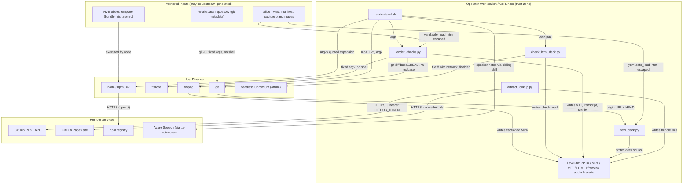

<!-- markdownlint-disable-file -->
# HVE Demo Material Skill Security Model

This document records the STRIDE threat model for the hve-demo-material skill (`scripts/artifact_lookup.py`, `scripts/html_deck.py`, `scripts/render-level.sh`, `scripts/render_checks.py`, and `scripts/check_html_deck.py`). The model is organized by trust bucket: GitHub API client and token handling (B1), Published site recovery and staging (B2), Deck source generation from authored content (B3), External program orchestration (B4), and CLI caller process and filesystem (B5). Each bucket enumerates all six STRIDE categories with the in-code mitigations that address them. Assets and adversaries are enumerated first. Acknowledged enterprise readiness gaps are listed at the end.

The skill renders levelled demo decks and narrated videos from authored slide content. `artifact_lookup.py` finds CI artifacts through the GitHub REST API using `GITHUB_TOKEN`, or recovers the published bundle over HTTPS. `html_deck.py` turns slide content into an HVE Slides source folder and reads local git metadata. `render_checks.py` writes captions, a transcript page, and the segments manifest, runs fixed-argument `ffprobe` and `git diff` calls, and scores the machine-verifiable criteria. `check_html_deck.py` opens the bundled deck in headless Chromium with the network disabled. `render-level.sh` orchestrates `uv`, `npm`, `node`, and `ffmpeg`, calls both Python checks, and calls sibling skills (powerpoint, tts-voiceover, demo-video, vscode-playwright). Scope note: the HVE Slides starter (`bundle.mjs` and the deck runtime it bundles) and the sibling skills' scripts, including `capture_vscode.py`, were not reviewed for this model and are treated as trust boundaries (G-SUP-2).

> **See also: repo-wide STRIDE model.** This skill participates in the repository-wide threat model at [`docs/security/security-model.md`](../../../../docs/security/security-model.md) and is registered in its [Skill Security Models](../../../../docs/security/security-model.md#skill-security-models) section.

## Executive Summary

The hve-demo-material skill makes outbound HTTPS requests (GitHub REST API with a bearer token, and unauthenticated GitHub Pages downloads), writes decks, frames, audio, video, captions, transcript pages, and downloaded bundle files to caller-chosen directories, deletes and recreates a deck source directory, runs `node`, `npm`, `ffmpeg`, `ffprobe`, `uv`, and `git` with paths derived from the level directory and workspace, and opens the generated deck in headless Chromium with the network disabled. Subprocess calls use argument lists or quoted expansions with no `eval` and no `shell=True`. Published-bundle file names are restricted to a fixed allowlist pattern, a recorded commit is passed to `git diff` only when it is 40 hex characters, YAML is read with `yaml.safe_load`, generated HTML and caption text is escaped, the transcript page carries a content security policy, and citation paths are sanitized. Residual risk concentrates in unvalidated endpoint and redirect handling for the token, unconfined image paths, unguarded directory deletion, execution of a caller-selected HTML deck template, a Chromium launched with Playwright's default sandbox setting, and unpinned runtime dependencies.

### Security Posture Overview

| Dimension          | Value                                                                                                                                           |
|--------------------|-------------------------------------------------------------------------------------------------------------------------------------------------|
| Runtime surface    | GitHub REST API and Pages downloads; local file writes and deletes; node, npm, ffmpeg, ffprobe, uv, git subprocesses; offline headless Chromium |
| Trust buckets      | B1 API client and token, B2 site recovery, B3 deck generation, B4 program orchestration, B5 caller and files                                    |
| Credentials        | GITHUB_TOKEN read from the environment and sent as a bearer header; Azure Speech credentials only inherited                                     |
| Network egress     | api.github.com (or GITHUB_API_URL), the repository's GitHub Pages site, the npm registry during npm ci                                          |
| Open residual gaps | 11 (InfoDisc-Med: token endpoint and redirect handling; EoP-Med: caller-selected template executed by node, Chromium without its sandbox)       |

## Contents

* [System Description](#system-description)
* [Trust Boundaries](#trust-boundaries)
* [Assets](#assets)
* [Adversaries](#adversaries)
* [Bucket B1: GitHub API client and token handling](#bucket-b1-github-api-client-and-token-handling)
* [Bucket B2: Published site recovery and staging](#bucket-b2-published-site-recovery-and-staging)
* [Bucket B3: Deck source generation from authored content](#bucket-b3-deck-source-generation-from-authored-content)
* [Bucket B4: External program orchestration](#bucket-b4-external-program-orchestration)
* [Bucket B5: CLI caller process and filesystem](#bucket-b5-cli-caller-process-and-filesystem)
* [Enterprise Readiness Gaps](#enterprise-readiness-gaps)
* [References](#references)

## System Description

### Components

1. `scripts/artifact_lookup.py` — `find` pages through completed workflow runs and artifacts on the GitHub REST API with `GITHUB_TOKEN`; `recover` downloads the published bundle over HTTPS using `index.json` as the file list. Standard library only.
2. `scripts/html_deck.py` — maps a level's slide YAML and manifest sources to an HVE Slides source folder, embeds images as CSS data URLs, and runs read-only `git` queries to build citation links.
3. `scripts/render-level.sh` — validates arguments, then runs live capture, deck build, validation and export, narration, MP4 assembly, HTML deck bundling, captions, and scoring by calling `uv`, `npm`, `node`, `ffmpeg`, `render_checks.py`, `check_html_deck.py`, and the sibling skills' wrappers.
4. `scripts/render_checks.py` — reads the level contracts and pinned sources from `references/curriculum.md`; `levels` and `changed` use only the standard library, and `changed` diffs against a recorded 40-hex commit; `segments`, `captions`, and `transcript` write the demo-video segments manifest, WebVTT captions, and an escaped transcript page; `evaluate` scores criteria T-04 to T-10 by reading local files and running `ffprobe`.
5. `scripts/check_html_deck.py` — opens the bundled single-file HTML deck from `file://` in headless Chromium through Playwright with the network disabled, steps through every slide, and writes a JSON result. It runs in the vscode-playwright environment.
6. Out of review scope (G-SUP-2): the HVE Slides starter (`bundle.mjs` and the deck runtime it bundles) and the powerpoint, tts-voiceover, demo-video, and vscode-playwright scripts, including `capture_vscode.py`.

### Data Flow



## Trust Boundaries

### Boundary Diagram

```text
┌─────────────────────────────────────────────────────────────────────┐
│ TRUST BOUNDARY: Operator Workstation / CI Runner                    │
│  ┌──────────────────┐  ┌──────────────┐  ┌───────────────────────┐  │
│  │ artifact_lookup  │  │ html_deck    │  │ render-level.sh       │  │
│  │ (token in env)   │  │ (rmtree)     │  │ (node/npm/ffmpeg/uv)  │  │
│  └──────────────────┘  └──────────────┘  └───────────────────────┘  │
│                    Level directory (caller-chosen)                  │
└───────┬─────────────────────┬───────────────────────┬───────────────┘
        │ HTTPS (+ token)     │ parse (safe_load)     │ argv / exec
┌───────▼───────────────┐ ┌───▼───────────────────┐ ┌─▼───────────────────────┐
│ BOUNDARY: Remote      │ │ BOUNDARY: Authored    │ │ BOUNDARY: Host binaries │
│ GitHub API, Pages,    │ │ inputs and template   │ │ uv, Chromium, siblings  │
│ npm, Azure Speech     │ │ (untrusted upstream)  │ │ node ffmpeg ffprobe git │
└───────────────────────┘ └───────────────────────┘ └─────────────────────────┘
```

### Boundary Descriptions

| Boundary                      | Assets Protected                | Controls Enforced                                                                                                                                                                                                         |
|-------------------------------|---------------------------------|---------------------------------------------------------------------------------------------------------------------------------------------------------------------------------------------------------------------------|
| Operator Workstation / Runner | Level directory, token, outputs | `set -euo pipefail`; validated level, narration, and capture values; quoted expansions; argument-list subprocesses; no shell eval                                                                                         |
| Remote services               | GITHUB_TOKEN, bundle integrity  | HTTPS-only site URL; request timeouts; owner/name check on the repository; file-name allowlist for downloaded bundle files                                                                                                |
| Authored inputs and template  | Build integrity, host files     | `yaml.safe_load`; HTML and caption escaping; content security policy on the transcript page; sanitized citation paths; HTTPS repo URL check; template must contain `bundle.mjs`                                           |
| Host binaries and siblings    | Host process integrity          | Fixed program arguments; `npm ci --ignore-scripts`; 30 s timeout on `git` in `html_deck.py`; 40-hex check on the `git diff` base; offline Chromium for the deck check; no credentials passed explicitly to child programs |

## Assets

| Id | Asset                                  | Lifetime         | Notes                                                                                                                                                                                   |
|----|----------------------------------------|------------------|-----------------------------------------------------------------------------------------------------------------------------------------------------------------------------------------|
| A1 | `GITHUB_TOKEN`                         | Process lifetime | Read from the environment by `artifact_lookup.py find` and sent as a bearer header on every API request. Never written to output or logs.                                               |
| A2 | Azure Speech credentials               | Process lifetime | `SPEECH_KEY` or `SPEECH_RESOURCE_ID` plus `SPEECH_REGION`; inherited by child processes and used only by the tts-voiceover sibling skill.                                               |
| A3 | Authored level content                 | Command lifetime | Slide YAML, speaker notes, manifest, capture plan, and referenced images; may originate from an upstream pipeline fed by untrusted material.                                            |
| A4 | Captured frames and narration audio    | Command lifetime | Live VS Code captures and speaker-note audio; can contain confidential on-screen material; notes are sent to Azure Speech under `azure`.                                                |
| A5 | Published bundle and artifact metadata | Per-invocation   | `index.json` and level files on GitHub Pages; run and artifact identifiers from the GitHub API.                                                                                         |
| A6 | Rendered outputs                       | Command lifetime | PPTX, MP4, WebVTT, transcript page, `segments.yml`, single-file HTML deck, `render-result.json`, and `html-deck-check.json` under the level directory.                                  |
| A7 | Level directory and surrounding files  | Persistent       | Target of `rm -rf`, `shutil.rmtree`, `mv`, `ffmpeg -y`, and `write_bytes` overwrites.                                                                                                   |
| A8 | HVE Slides template                    | Per-invocation   | `bundle.mjs`, `package.json`, `package-lock.json`, and `.npmrc` copied into the deck folder and executed or consumed by node and npm; its deck runtime also runs in the Chromium check. |
| A9 | Host binaries                          | Per-invocation   | `node`, `npm`, `uv`, `ffmpeg`, `ffprobe`, `git`, and the Chromium that Playwright launches, resolved from the caller's PATH or the Playwright browser install.                          |

## Adversaries

| Id    | Adversary                                   | In-scope mitigations                                                                                                                                                                                                                                                                                                                                                                  |
|-------|---------------------------------------------|---------------------------------------------------------------------------------------------------------------------------------------------------------------------------------------------------------------------------------------------------------------------------------------------------------------------------------------------------------------------------------------|
| ADV-a | Hostile or malformed authored content       | Slide YAML and the manifest are read with `yaml.safe_load`; all generated text and attributes pass through `html.escape`, including caption and transcript text; manifest source paths are rejected when absolute, backslashed, drive-prefixed, or containing `.` or `..` segments. Image paths are not confined (G-INF-1).                                                           |
| ADV-b | Spoofed or compromised API or site endpoint | The site URL must start with `https://` and every request has a 60 s timeout. `GITHUB_API_URL` is not validated and redirects use urllib defaults (G-TLS-1).                                                                                                                                                                                                                          |
| ADV-c | Hostile published bundle                    | `index.json` must be JSON with the `demo-material-site/v1` schema; levels must match `L[1-4]00`; every listed path must match the fixed `SITE_FILE` pattern, which blocks traversal and unexpected names. `render_checks.py changed` passes a recorded `source_sha` to `git diff` only when it is exactly 40 hex characters. File content is not verified against a digest (G-TAM-3). |
| ADV-d | Hostile template or dependency              | `npm ci` runs with `--ignore-scripts` against the template's lockfile, and the Chromium check opens the bundle with the network disabled and fails on any external request. The template's `bundle.mjs` and `.npmrc` are still executed or honored, and its deck runtime runs in the browser (G-EOP-1, G-EOP-2, G-SUP-1).                                                             |
| ADV-e | Hostile workspace repository                | Only fixed read-only git subcommands run (`remote get-url origin`, `rev-parse HEAD`) with a 30 s timeout. Only owner and repository name survive into the deck, so credentials in the remote URL are dropped, and the commit must be 40 hex characters.                                                                                                                               |
| ADV-f | Hostile caller controlling argv or env      | Level, narration, and capture values are validated by regex; level and workspace directories are resolved with `cd && pwd`; all expansions are quoted. Output and deck directories are caller-controlled and not confined (G-TAM-1, G-TAM-2).                                                                                                                                         |

## Bucket B1: GitHub API client and token handling

`artifact_lookup.py find` builds a `GitHubApi` client from `GITHUB_TOKEN`, `GITHUB_REPOSITORY`, and `GITHUB_API_URL`.

### Spoofing

* The client relies on urllib's default HTTPS certificate validation. `GITHUB_API_URL` defaults to `https://api.github.com` but is not checked for scheme or host, so an `http://` or look-alike value would receive the token (G-TLS-1).
* `GITHUB_REPOSITORY` must match `owner/name` (`[\w.-]+/[\w.-]+`) before any request is built.

### Tampering

* Response bodies are parsed with `json.loads` only; no response content is executed or written to disk. Query parameters are encoded with `urllib.parse.urlencode`.
* The `--workflow` value and run identifiers are interpolated into the API path without quoting. The caller controls these values and the request stays on the configured API host (G-TAM-2).

### Repudiation

* Failures print `ERROR: GitHub API <path> returned <code>` to stderr and exit non-zero, so automation can attribute a failed lookup. Successful lookups are not otherwise logged.

### Information Disclosure

* The token is sent only in the `Authorization` header and is not printed, written to the output file, or included in error messages. An unset token is sent as an empty bearer value rather than failing fast.
* The script installs no custom redirect handler. urllib's default `HTTPRedirectHandler` copies every request header except `Content-Length` and `Content-Type` to the redirect target, so the `Authorization` header would follow a cross-host redirect, including a downgrade to `http://` (G-TLS-1).

### Denial of Service

* Every request has a 60 s timeout. Run and artifact pagination is bounded by the 90-day retention window and page size, but response size and total page count are not capped (G-DOS-1).

### Elevation of Privilege

* Not applicable. The client performs read-only GET requests, runs no subprocess, and uses the caller's own token scopes.

### Risk Rating

| Threat                                            | Likelihood | Impact | Residual Risk | Status                    |
|---------------------------------------------------|------------|--------|---------------|---------------------------|
| Token sent to unintended host via env or redirect | Low        | High   | Med           | Open (G-TLS-1)            |
| Token leaked through logs or output               | Low        | High   | Low           | Mitigated (never emitted) |
| Oversized API response exhausts memory            | Low        | Low    | Low           | Accepted (G-DOS-1)        |

## Bucket B2: Published site recovery and staging

`artifact_lookup.py recover` downloads the published bundle without credentials and writes it into `--target`.

### Spoofing

* The site URL must start with `https://`; the default is derived from `GITHUB_REPOSITORY` as `https://<owner>.github.io/<name>/`. A caller-supplied `--site-url` may name any HTTPS host (G-TLS-1).
* `index.json` must carry the `demo-material-site/v1` schema or recovery fails with an error.

### Tampering

* Each path listed by `index.json`, plus the optional per-level files, must match the fixed `SITE_FILE` pattern (`L[1-4]00/` followed by one of a short set of file names), so traversal and arbitrary file names are rejected before any write.
* Required files that are missing abort recovery so a partial bundle is never staged. Downloaded bytes are written verbatim and are not verified against a digest, and the pattern's `$` anchor tolerates a trailing newline (G-TAM-3, G-TAM-2).

### Repudiation

* Recovery failures exit non-zero with an `ERROR:` message naming the URL or file; the success summary reports the status, levels, and file count.

### Information Disclosure

* Requests to the site carry no `Authorization` header and no credentials. The token is never used by `recover`.

### Denial of Service

* Requests time out after 60 s and the number of files is bounded by the allowlist pattern, but downloaded bodies are read fully into memory with no size cap (G-DOS-1).

### Elevation of Privilege

* Downloaded content is written as bytes and never parsed or executed by this script. The bundle is restaged for redeployment, so tampered files would be republished (G-TAM-3).

### Risk Rating

| Threat                                     | Likelihood | Impact | Residual Risk | Status                          |
|--------------------------------------------|------------|--------|---------------|---------------------------------|
| Path traversal through hostile index.json  | Low        | High   | Low           | Mitigated (SITE_FILE allowlist) |
| Tampered bundle restaged and republished   | Low        | Med    | Low           | Partially Mitigated (G-TAM-3)   |
| Oversized download exhausts memory or disk | Low        | Low    | Low           | Accepted (G-DOS-1)              |

## Bucket B3: Deck source generation from authored content

`html_deck.py` reads the level's slide YAML, manifest, images, and git metadata and writes an HVE Slides source folder. `render_checks.py` turns the same slide content into captions, a transcript page, the segments manifest, and scoring results.

### Spoofing

* Citation links are built only for `github.com` remotes. `github_blob_base` keeps only the owner and repository name and requires a 40-hex commit, so a remote URL carrying credentials or another host yields no citations. A caller-supplied `--repo-url` must be HTTPS and end in `/` but is not host-restricted.

### Tampering

* Slide and manifest YAML is read with `yaml.safe_load`; all slide text, titles, chapters, and `aria-label` values are escaped with `html.escape(quote=True)`, and `content.js` is emitted with `json.dumps(ensure_ascii=True)` and `<` escaped.
* `render_checks.py` also reads slide, style, and segment YAML with `yaml.safe_load`, escapes caption cue text with `html.escape(quote=False)`, escapes every authored value in the transcript page with `html.escape`, and gives that page a content security policy of `default-src 'none'; media-src 'self'; style-src 'unsafe-inline'; base-uri 'none'; form-action 'none'`, so authored text cannot add markup or load remote resources. The policy covers the transcript page only; the bundled deck's own policy comes from the HVE Slides starter and was not reviewed (G-SUP-2).
* `deck_dir` is removed with `shutil.rmtree` when it exists and nothing confines it to the level directory (G-TAM-1).

### Repudiation

* Missing images and the slide and source counts are recorded in `demo-material-build.json`; build errors exit non-zero with an `ERROR:` message.
* `render_checks.py evaluate` records a pass, fail, or deferred result with evidence for each check from T-04 to T-10 in `render-result.json` and exits non-zero unless every check passes. A missing offline-browser result scores T-10 as a failure rather than a pass.

### Information Disclosure

* `_image` resolves the `path` of an image element relative to the slide directory without a containment check and accepts absolute paths and symlinks. Any readable file whose name ends in `.png`, `.jpg`, or `.jpeg` is base64-embedded in the single-file HTML deck (G-INF-1).
* Manifest source paths are rejected when absolute, backslashed, drive-prefixed, or containing `.`, `..`, or empty segments, then percent-encoded into the citation URL.
* The transcript page lists every slide's title, on-screen text, and narration, so it republishes whatever the deck says (G-INF-2).

### Denial of Service

* Not applicable at the generator layer beyond input size: images are read fully and embedded, and there is no per-image or per-deck size cap (G-DOS-1).
* The accessibility check opens the built PPTX with `zipfile` and parses its members with the standard library `xml.etree.ElementTree`, with no limit on member size or entity expansion, and reads WAV headers with the `wave` module. These inputs are produced earlier in the same run (G-DOS-1).

### Elevation of Privilege

* The only subprocess in `html_deck.py` is `git -C <workspace>` with fixed read-only subcommands, an argument list, no shell, and a 30 s timeout. Git reads the workspace's local configuration, so an untrusted checkout is not a supported workspace. The subprocesses in `render_checks.py` are covered in B4.

### Risk Rating

| Threat                                           | Likelihood | Impact | Residual Risk | Status                             |
|--------------------------------------------------|------------|--------|---------------|------------------------------------|
| Unconfined image path discloses host image files | Low        | Med    | Low           | Open (G-INF-1)                     |
| HTML or script injection through slide text      | Low        | Med    | Low           | Mitigated (html.escape, safe_load) |
| HTML or caption injection through authored text  | Low        | Med    | Low           | Mitigated (html.escape, CSP)       |
| Credential leakage through citation remote URL   | Low        | Med    | Low           | Mitigated (owner/repo only)        |
| Unintended deletion through --deck-dir           | Low        | High   | Med           | Open (G-TAM-1)                     |

## Bucket B4: External program orchestration

`render-level.sh` runs `uv`, `npm`, `node`, and `ffmpeg`, calls `render_checks.py` and `check_html_deck.py`, and invokes the sibling skills' wrapper scripts, with paths derived from the level directory and workspace.

### Spoofing

* Programs resolve through the caller's PATH, so the identity of `node`, `npm`, `uv`, `ffmpeg`, `ffprobe`, and `git` is an operator responsibility. `check_html_deck.py` launches the Chromium that Playwright provides, which is likewise an operator-managed binary (G-SUP-1).
* `--html-deck-template` selects the directory whose `bundle.mjs`, `package.json`, and `.npmrc` are used; the default is the HVE Slides starter next to the skills folder (G-EOP-1).

### Tampering

* The script runs with `set -euo pipefail`, validates level, narration, and capture values with regular expressions, resolves directories with `cd && pwd`, and quotes every expansion. Options use argument arrays and nothing is passed to `eval`.
* `ffmpeg -y` overwrites the captioned output, and `mv` replaces the video with the captioned copy. Both paths are derived from the resolved level directory.
* `render_checks.py changed` runs `git -C <repo> diff --name-only <base>...HEAD` as an argument list. It passes a recorded `source_sha` only when it matches 40 lowercase hex characters, so a hostile `index.json` cannot inject an option or a revision expression. `ffprobe` runs with fixed arguments and a list-form path, and a failed read returns nothing, so the dependent checks fail or defer rather than pass.

### Repudiation

* Each stage logs a `==>` progress line, failures abort the run, and `render-result.json` plus `captures.json` and `html-deck-check.json` record outcomes. A failed HTML deck check is logged but does not stop the run.
* `check_html_deck.py` writes pass or fail with the slide count, overflowing slides, external requests, and page errors to `html-deck-check.json`, and exits non-zero on failure.

### Information Disclosure

* The script never prints credentials, but child programs inherit the whole environment, including any `GITHUB_TOKEN` or Azure Speech values present. Under `narration: azure`, speaker notes are sent to the configured Azure Speech region by the tts-voiceover sibling skill, and live captures can show confidential workspace content (G-INF-2).
* `npm ci` contacts the npm registry named by the template's lockfile and `.npmrc`.
* `check_html_deck.py` opens the deck from `file://` in a browser context created with `offline=True` and records any request other than the deck itself or a `data:` URL as a failure, so the check also detects a deck that reaches for remote resources.

### Denial of Service

* No timeouts bound `node`, `npm`, `ffmpeg`, the `git diff` and `ffprobe` calls in `render_checks.py`, or the sibling skills, so a pathological input or hung process stalls the run. The Chromium check waits 20 s for the deck to report ready and otherwise relies on Playwright's default timeouts (G-DOS-1).

### Elevation of Privilege

* `npm ci` runs with `--ignore-scripts`, which stops dependency lifecycle scripts, but `node bundle.mjs` executes the template's own code with the caller's privileges (G-EOP-1).
* `check_html_deck.py` calls `playwright.chromium.launch()` with no options. Playwright's documented default for `chromium_sandbox` is `False`, so the Chromium sandbox is off while the browser renders a deck built from authored content, including embedded images, and runs the HVE Slides runtime JavaScript, offline and from `file://` (G-EOP-2).
* `ffmpeg` receives the locally produced MP4 and the WebVTT file generated from speaker notes. Both paths are absolute and the arguments are fixed.

### Risk Rating

| Threat                                                   | Likelihood | Impact | Residual Risk | Status                          |
|----------------------------------------------------------|------------|--------|---------------|---------------------------------|
| Hostile template code executed by node                   | Low        | High   | Med           | Open (G-EOP-1)                  |
| Chromium renderer exploit through a hostile deck         | Low        | High   | Med           | Open (G-EOP-2)                  |
| Dependency or binary substitution                        | Low        | High   | Med           | Open (G-SUP-1)                  |
| Confidential material in captures or narration           | Med        | Med    | Med           | Partially Mitigated (G-INF-2)   |
| Command injection through level or workspace paths       | Low        | High   | Low           | Mitigated (quoting, validation) |
| Option injection through a recorded commit in index.json | Low        | Med    | Low           | Mitigated (40-hex check)        |

## Bucket B5: CLI caller process and filesystem

The caller controls argv, environment, and the output locations (`--target`, `--github-output`, `--level-dir`, `--deck-dir`, and `--output` for captions and the browser-check result), plus the `--index` and `--repo` inputs of `render_checks.py changed`.

### Spoofing

* Not applicable. The scripts run as the invoking OS user and assert no identity.

### Tampering

* `artifact_lookup.py` appends `key=value` lines to the caller-chosen `--github-output` file without stripping newlines from API-derived values, so a hostile API response could add extra output keys (G-TAM-2). `recover` creates parent directories and overwrites files under `--target` without symlink checks.
* `render-level.sh` removes and recreates `${LEVEL_DIR}/html-deck` with `rm -rf`, and `html_deck.py` removes `--deck-dir` with `shutil.rmtree` (G-TAM-1).
* `render_checks.py captions` and `check_html_deck.py` create parent directories for and overwrite the caller-chosen `--output` file, while `segments` and `transcript` write fixed names under `<level-dir>/output/`. None of these confines the path.

### Repudiation

* Exit codes are non-zero on failure and the level directory retains the render result, capture, and build summaries. The scripts keep no signed or tamper-evident record.

### Information Disclosure

* The scripts hold no secret beyond the in-memory token and write none to disk. Outputs may contain captured content, which is a content concern rather than a credential one (G-INF-2).

### Denial of Service

* Not applicable at the wrapper layer; the caller controls invocation cadence, and downloads and renders are bounded as described in B2 and B4 (G-DOS-1).

### Elevation of Privilege

* No privileged operation is performed and nothing is persisted beyond the requested outputs. Publication is outside the skill, which the skill's constraints reserve to a human-configured pipeline.

### Risk Rating

| Threat                                          | Likelihood | Impact | Residual Risk | Status              |
|-------------------------------------------------|------------|--------|---------------|---------------------|
| Output path overwrite or unintended write       | Low        | Med    | Low           | Operator-controlled |
| Extra keys injected into the GitHub output file | Low        | Low    | Low           | Open (G-TAM-2)      |

## Enterprise Readiness Gaps

The following are known limitations recorded so operators can make informed deployment decisions. Severity ratings are the project's own assessment and are not equivalent to a CVSS score.

| Id      | Gap                                                                                                                                                                                                                                                                                                          | Severity        | Status                                                                                                                                           |
|---------|--------------------------------------------------------------------------------------------------------------------------------------------------------------------------------------------------------------------------------------------------------------------------------------------------------------|-----------------|--------------------------------------------------------------------------------------------------------------------------------------------------|
| G-TLS-1 | `GITHUB_API_URL` and `--site-url` are not restricted by scheme or host (the API URL accepts `http://`), and the API client keeps urllib's default redirect handling, which forwards the `Authorization` header on a cross-host redirect, so the bearer token could reach an unintended host.                 | InfoDisc-Med    | Run only where the runner sets `GITHUB_API_URL`; use a least-privilege read-only token; planned fix is to require HTTPS and an allowlisted host. |
| G-INF-1 | An image `path` in slide content is not confined to the slide directory and follows absolute paths and symlinks, so any readable `.png`, `.jpg`, or `.jpeg` file can be embedded in the HTML deck.                                                                                                           | InfoDisc-Low    | Review slide content from untrusted authors; render untrusted content in an isolated account.                                                    |
| G-INF-2 | Live captures, frames, narration, and the generated transcript page can contain confidential workspace content, and nothing redacts them before a human-configured pipeline publishes them. Under `azure`, speaker notes leave the host.                                                                     | InfoDisc-Med    | Rely on the delivery approval step; use approved regions and avoid confidential material in captures and notes.                                  |
| G-TAM-1 | `html_deck.py` removes `--deck-dir` with `shutil.rmtree` and `render-level.sh` runs `rm -rf` on `<level-dir>/html-deck`, with no check that the target lies under the level directory.                                                                                                                       | Tampering-Med   | Pass only generated paths under the level directory; planned fix is a containment check before deletion.                                         |
| G-TAM-2 | `--github-output` values are written without newline stripping, `--workflow` is interpolated into the API path unquoted, and the `SITE_FILE` pattern uses `$`, which tolerates a trailing newline.                                                                                                           | Tampering-Low   | Use a trusted API endpoint; planned fix is `fullmatch`, path quoting, and single-line output values.                                             |
| G-TAM-3 | Recovered bundle files are checked only by name pattern and TLS, with no digest verification, and the bundle is restaged for redeployment.                                                                                                                                                                   | Tampering-Low   | Restrict who can alter the Pages site; planned fix is a digest list in `index.json` verified before staging.                                     |
| G-DOS-1 | API and download responses are read fully with no size cap, pagination has no page cap, embedded images have no size cap, PPTX members and XML are read without limits in the accessibility check, and `node`, `npm`, `ffmpeg`, `ffprobe`, `git diff`, and sibling skills run without timeouts.              | DoS-Low         | Run under CI job timeouts and resource limits.                                                                                                   |
| G-EOP-1 | `--html-deck-template` selects a directory whose `bundle.mjs` is executed by `node`, whose `.npmrc` and `package.json` drive `npm ci`, and whose bundled runtime then runs in the Chromium check; `--ignore-scripts` does not cover the template's own code.                                                 | EoP-Med         | Use only the repository's HVE Slides starter or a reviewed template; run untrusted templates in an isolated container.                           |
| G-EOP-2 | `check_html_deck.py` launches Chromium with default options, and Playwright's default for `chromium_sandbox` is off, so a renderer exploit through a hostile deck or an embedded image runs without the browser sandbox.                                                                                     | EoP-Med         | Run the render on a disposable runner or container; planned fix is `chromium_sandbox=True` where the runner supports it.                         |
| G-SUP-1 | `npm ci` and `uv run` fetch dependencies at render time, the Chromium that Playwright launches is a host-installed browser binary, and `node`, `npm`, `uv`, `ffmpeg`, `ffprobe`, and `git` are operator-installed and unpinned.                                                                              | SupplyChain-Med | Rely on lockfiles; pin and patch host binaries through the runner image.                                                                         |
| G-SUP-2 | The HVE Slides starter (`bundle.mjs` and the deck runtime it bundles) and the sibling skills' scripts (powerpoint, tts-voiceover, demo-video, vscode-playwright, including `capture_vscode.py`) were not reviewed for this model; claims about them come from skill documentation and are not verified here. | SupplyChain-Low | Review these components and extend this model; follow the powerpoint skill's model and the demo-video model once published.                      |

For an active issue tracker entry covering these gaps, see the [hve-core issues list](https://github.com/microsoft/hve-core/issues).

## References

* [STRIDE Threat Model](https://learn.microsoft.com/azure/security/develop/threat-modeling-tool-threats)
* [OWASP Top 10 for Web Applications](https://owasp.org/www-project-top-ten/)
* [GitHub REST API: workflow runs and artifacts](https://docs.github.com/rest/actions)
* [npm ci](https://docs.npmjs.com/cli/commands/npm-ci) and [FFmpeg](https://ffmpeg.org/)
* [Playwright for Python: browser launch options](https://playwright.dev/python/docs/api/class-browsertype#browser-type-launch)
* [Repository security model](../../../../docs/security/security-model.md)

🤖 Crafted with precision by ✨Copilot following brilliant human instruction, then carefully refined by our team of discerning human reviewers.
