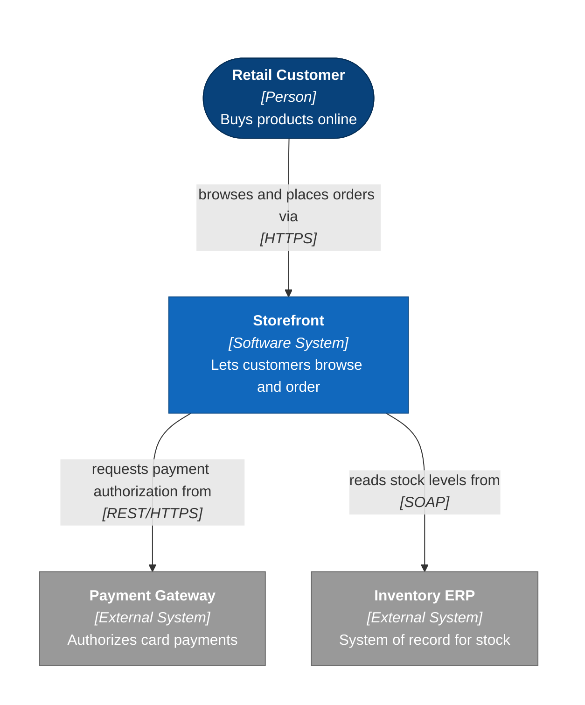
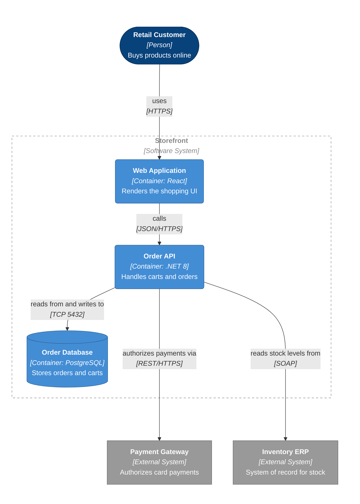
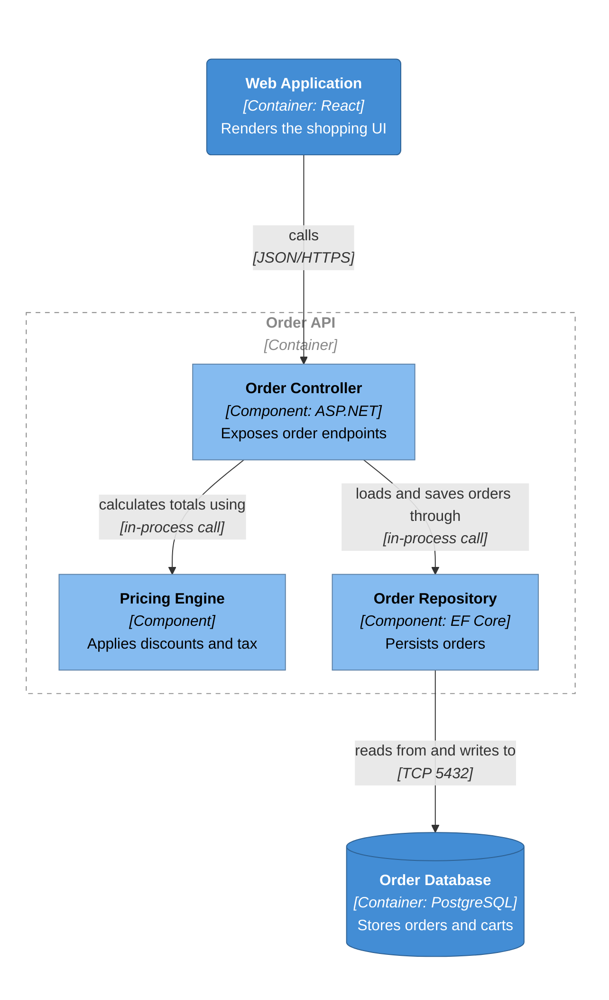
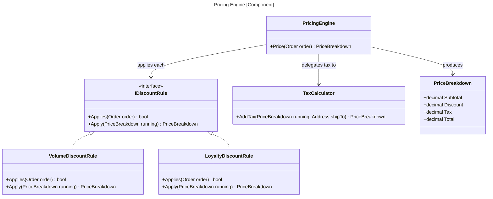
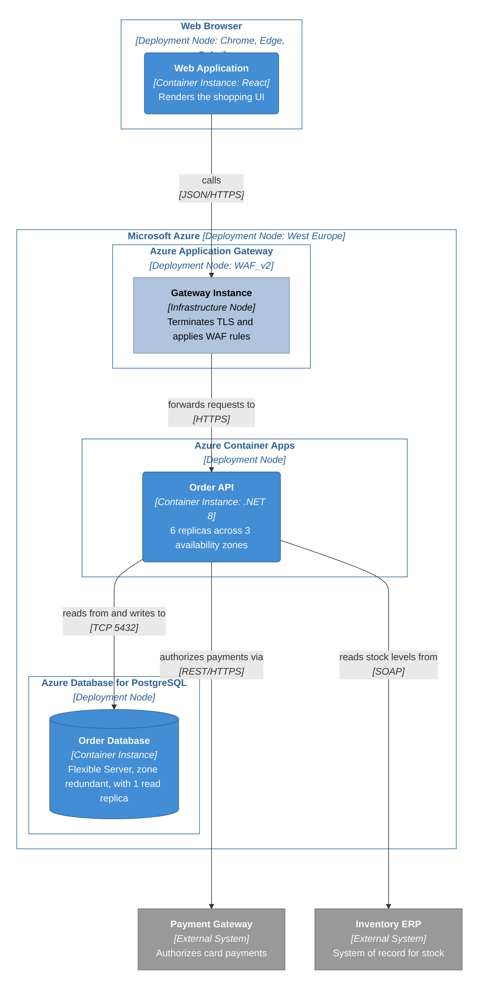

This renderer emits C4 diagrams as Mermaid `flowchart` blocks using C4 conventions applied through node shapes, subgraphs, and stereotype labels. Mermaid also ships dedicated `C4Context` and `C4Container` diagram types. This renderer does not use them.

## General rendering rules

* Always use `flowchart TB`. The [Legend](#legend) below is the single exception and uses `LR`.
* Always apply the [3-Bands-Layout](#3-bands-layout) rules to C4 Levels 1, 2, and 3 and deployment diagrams. The Legend and Level 4 code diagram are exceptions.
* Leverage [Rank Control](#rank-control) when the user asks to move a specific element up or down.
* Generate every flowchart node and subgraph id from the [Identifier scheme](#identifier-scheme). Ids are never shown to the reader; labels are.
* Use Mermaid Markdown strings for every visible label. Wrap the Markdown text in backticks and double quotes so formatting, line breaks, punctuation, and technology names parse correctly.
* Separate label lines with literal newlines. Bold the first line of every element label with `**Name**`. Render the stereotype and technology line as `*[Stereotype]*`, and keep the description line at normal weight.
* Visible subgraph titles begin with a bold name. A visible subgraph that contains other visible subgraphs uses the one-line form `**Name** *[Stereotype]*`. An innermost visible subgraph, which contains no visible subgraphs, puts `*[Stereotype]*` on the second line.
* In every relationship label, keep the intent at normal weight. When the relationship technology is supported by evidence, place `*[technology]*` on a second line. When it is unknown, omit the technology line rather than infer or invent a value.
* Give every element the shape and class for its type. See Element shapes and classes [below](#element-shapes-and-classes).
* Group `class` assignments by class, one line each, after the relationships.
* Keep descriptions to one short clause. Long prose belongs in the accompanying element table, not on the node.

## Identifier scheme

Prefix every generated flowchart identifier with its C4 element type. The prefix prevents a normalized name such as `graph`, `end`, `subgraph`, or `flowchart` from becoming an exact Mermaid keyword. Apply the same rule to declarations, relationships, class assignments, style statements, and invisible layout links.

| Element or helper                 | Prefix    | Example               |
|-----------------------------------|-----------|-----------------------|
| Person or actor                   | `person_` | `person_customer`     |
| Software system in focus          | `sys_`    | `sys_storefront`      |
| Container, including a data store | `ctr_`    | `ctr_order_db`        |
| Component                         | `cmp_`    | `cmp_pricing`         |
| External system or data store     | `ext_`    | `ext_payment_gateway` |
| Infrastructure node               | `infra_`  | `infra_app_gateway`   |
| Deployment node                   | `deploy_` | `deploy_azure`        |
| Generic boundary                  | `bnd_`    | `bnd_order_api`       |
| Layout-only subgraph              | `layout_` | `layout_top`          |

Create the suffix by lowercasing the element name, replacing each run of non-alphanumeric characters with one underscore, and trimming leading or trailing underscores. Keep an element's prefixed id stable wherever that same element appears. A software system used as both an L1 node and an L2 boundary therefore keeps its `sys_` id. Append a short, meaningful qualifier when two names normalize to the same id; do not remove the prefix. Container instances reuse their container id with an `_i` suffix, for example `ctr_api_i`. Legend placeholders use the normal type prefix with a `_legend` suffix.

## Element shapes and classes

The bracketed stereotype on the label is what states an element's type. Shape and colour reinforce that statement so a reader can scan the diagram without reading every label, and neither one carries the type on its own: three element types share the rectangle, and colour alone fails in greyscale.

| C4 element               | Shape             | Syntax                                  | Class             |
|--------------------------|-------------------|-----------------------------------------|-------------------|
| Person or actor          | Stadium           | ``person_id(["`...`"])``                | `person`          |
| Software system in focus | Rectangle         | ``sys_id["`...`"]``                     | `system`          |
| Container                | Rounded rectangle | ``ctr_id("`...`")``                     | `container`       |
| Component                | Rectangle         | ``cmp_id["`...`"]``                     | `component`       |
| External system          | Rectangle         | ``ext_id["`...`"]``                     | `external`        |
| Internal data store      | Cylinder          | ``ctr_id[("`...`")]``                   | `container`       |
| External data store      | Cylinder          | ``ext_id[("`...`")]``                   | `external`        |
| Boundary                 | Dashed subgraph   | ``subgraph bnd_id["`...`"] ... end``    | n/a, styled by id |
| Deployment node          | Solid subgraph    | ``subgraph deploy_id["`...`"] ... end`` | n/a, styled by id |
| Container instance       | Rounded rectangle | ``ctr_id_i("`...`")``                   | `container`       |
| Infrastructure node      | Rectangle         | ``infra_id["`...`"]``                   | `infrastructure`  |

Boundaries and deployment nodes take a `style` statement rather than a class, because Mermaid applies `classDef` to nodes and subgraphs are styled by id.

An instance reuses the id of the container it instantiates plus an `_i` suffix, so `ctr_api` at Level 2 becomes `ctr_api_i` on a deployment diagram. When the diagram contains multiple instances of the same container, append a short qualifier derived from each containing deployment node, for example `ctr_api_i_zone_1` and `ctr_api_i_zone_2`. An instance also reuses the `container` class, because an instance of a container is still that container.

## Config block

Open every diagram that contains a subgraph with this block, which reserves space below the title:

```text
---
config:
  flowchart:
    subGraphTitleMargin:
      bottom: 30
---
```

## Styling

Include each `classDef` used by the diagram so element types stay distinguishable when a diagram is viewed on its own. Assign every element to its corresponding class after the relationships.

```text
classDef person fill:#08427b,stroke:#052e56,color:#ffffff
classDef system fill:#1168bd,stroke:#0b4884,color:#ffffff
classDef container fill:#438dd5,stroke:#2e6295,color:#ffffff
classDef component fill:#85bbf0,stroke:#5d82a8,color:#000000
classDef external fill:#999999,stroke:#6b6b6b,color:#ffffff
classDef infrastructure fill:#b0c4de,stroke:#7b899b,color:#000000
```

Style each boundary subgraph by id, using the solid variant for a deployment node and the dashed variant for every other boundary:

```text
style <deployment_id> fill:none,stroke:#2e6295,color:#2e6295
style <boundary_id> fill:none,stroke:#888888,stroke-dasharray:5 5,color:#888888
```

Hide the boundaries of the three layout-only subgraphs:

```text
style layout_top fill:none,stroke:none
style layout_center fill:none,stroke:none
style layout_bottom fill:none,stroke:none
```

## 3-Bands-Layout

* Use `layout_top`, `layout_center`, and `layout_bottom` layout-only subgraphs. They use a blank title and carry no C4 stereotype or metadata. Include `layout_bottom` only when the in-focus element has callees or dependencies; otherwise omit it (see the last bullet).
* Put all invoking callers, clients, users, systems, and containers in `layout_top`.
* Put the system or container under scrutiny in `layout_center`. When it is a visible C4 boundary, nest that boundary inside `layout_center` and use the element's stable id, such as `sys_storefront` or `ctr_order_api`. Put all containers (L2 and deployment diagram) or all components of a container (L3 diagram) inside visible boundaries.
* Put all callees, invoked dependencies, and external systems in the bottom subgraph `layout_bottom`. When the in-focus element has no callees or dependencies among the diagram's elements, leave the bottom band empty by omitting `layout_bottom` rather than rendering an empty subgraph; do not invent a callee, and do not introduce a lower-level element absent from the owning higher level, just to fill it.

Leverage [Rank Control](#rank-control) to fine-tune element positions and force the three horizontal bands to stack vertically in top-center-bottom order.

## Rank control

Mermaid places a node one rank below the deepest element pointing at it.

To move an element up:
1. lengthen any of the real outgoing relationship edges starting at the element that needs moving up (preferred).
2. add or lengthen an invisible dependency from the top element to the bottom element that need to be stacked (fallback).

To move an element down:
1. lengthen any of the real incoming relationship edges ending at the element that needs moving down (preferred).
2. add or lengthen an invisible dependency from the top element to the bottom element that need to be stacked (fallback).

| Link type            | 1 rank | 2 ranks | 3 ranks | 4 ranks  |
|----------------------|--------|---------|---------|----------|
| Invisible dependency | `~~~`  | `~~~~`  | `~~~~~` | `~~~~~~` |
| Arrow                | `-->`  | `--->`  | `---->` | `----->` |

## Band stacking validation

Validate that the populated layout bands (`layout_top`, `layout_center`, and, when present, `layout_bottom`) occupy distinct horizontal bands stacked vertically in top-center-bottom order. Elements from adjacent bands must not share or overlap the same vertical rank. When the in-focus element has no callees or dependencies, `layout_bottom` is omitted (see [3-Bands-Layout](#3-bands-layout)); validate only the boundaries between the bands that are present.

When Mermaid rendering tooling is available, render the diagram and inspect the rendered positions of the visible descendants of each layout subgraph. The lowest visible point in `layout_top` must be above the highest visible point in `layout_center`, and, when `layout_bottom` is present, the lowest visible point in `layout_center` must be above the highest visible point in `layout_bottom`. Treat an overlap, equal vertical position, or reversed order as a failed band-stacking check. Do not use the hidden layout-subgraph border as the measurement boundary.

When rendering tooling is unavailable or the user has declined rendering, perform static rank analysis:

1. Assign every visible element to its containing layout band.
2. Treat each directed relationship or invisible dependency as a rank constraint from its source to its target. Use the link length from the [Rank control](#rank-control) table as the minimum rank separation.
3. Follow the constraints to calculate the earliest possible rank of every element. The greatest rank in `layout_top` must be less than the least rank in `layout_center`, and, when `layout_bottom` is present, the greatest rank in `layout_center` must be less than the least rank in `layout_bottom`.
4. Treat cycles, reverse constraints, disconnected populated adjacent bands, or any rank result that does not prove the applicable inequalities as a failed band-stacking check. An intentionally omitted `layout_bottom` (the in-focus element has no callees or dependencies) is not a disconnected-band failure.

On failure, apply [Rank control](#rank-control). Prefer lengthening an existing real relationship that preserves its architectural meaning. Otherwise add the shortest invisible dependency needed between elements in the adjacent bands that failed. Repeat rendered validation when tooling is available; otherwise repeat static rank analysis. Continue until both band boundaries pass, or report source validation as `Failed` when no valid rank control can establish the order without misrepresenting a relationship.

## Legend

Emit this legend once per document, above the level diagrams. Element entries use the same labels as the level diagrams, with `Name` and `Description` standing in for the element's own values and the bracketed stereotype naming the type. Boundary entries follow the one-line parent and two-line innermost title rules, so the level diagrams do not each carry a written key.

Copy the legend as shown, including its layout-only links.

```mermaid
---
config:
  flowchart:
    subGraphTitleMargin:
      bottom: 30
---
flowchart LR
    person_legend(["`**Name**
*[Person]*
Description`"])
    sys_legend["`**Name**
*[Software System]*
Description`"]
    ctr_legend("`**Name**
*[Container]*
Description`")
    cmp_legend["`**Name**
*[Component]*
Description`"]
    ext_legend["`**Name**
*[External System]*
Description`"]
    ext_legend_store[("`**Name**
*[External Data Store]*
Description`")]
    infra_legend["`**Name**
*[Infrastructure Node]*
Description`"]

    subgraph deploy_legend["`**Parent Name** *[Deployment Node]*`"]
        subgraph deploy_nested_legend["`**Nested Name**
*[Deployment Node]*`"]
            ctr_legend_i("`**Name**
*[Container Instance]*
Description`")
        end
    end

    subgraph bnd_legend["`**Name**
*[Software System]*`"]
        ctr_legend_store[("`**Name**
*[Internal Data Store]*
Description`")]
    end

    %% Layout only: chains the entries into a single row
    person_legend ~~~ sys_legend
    sys_legend ~~~ ctr_legend
    ctr_legend ~~~ cmp_legend
    cmp_legend ~~~ ext_legend
    ext_legend ~~~ ext_legend_store
    ext_legend_store ~~~ infra_legend
    infra_legend ~~~ deploy_legend
    deploy_legend ~~~ bnd_legend

    classDef person fill:#08427b,stroke:#052e56,color:#ffffff
    classDef system fill:#1168bd,stroke:#0b4884,color:#ffffff
    classDef container fill:#438dd5,stroke:#2e6295,color:#ffffff
    classDef component fill:#85bbf0,stroke:#5d82a8,color:#000000
    classDef external fill:#999999,stroke:#6b6b6b,color:#ffffff
    classDef infrastructure fill:#b0c4de,stroke:#7b899b,color:#000000

    class person_legend person
    class sys_legend system
    class ctr_legend,ctr_legend_i,ctr_legend_store container
    class cmp_legend component
    class ext_legend,ext_legend_store external
    class infra_legend infrastructure

    style deploy_legend fill:none,stroke:#2e6295,color:#2e6295
    style deploy_nested_legend fill:none,stroke:#2e6295,color:#2e6295
    style bnd_legend fill:none,stroke:#888888,stroke-dasharray:5 5,color:#888888
```



## Level 1: System Context

Example diagram:



## Level 2: Containers

Example diagram:



## Level 3: Components

Example diagram:



## Level 4: Code

This is the one level that is not a `flowchart`. Mermaid's `classDiagram` carries its own notation, so the shapes, palette classes, config block, and shared Legend above do not apply here, and the element ids used at Levels 1 through 3 give way to the real names of code constructs.

Each Level 4 diagram drills into one focused Level 3 component. Name that component in the diagram title and verify it appears in its container's Level 3 view before detailing it. Include only the code constructs the evidence attributes to that component and the dependencies that component owns; omit constructs and relationships that belong to other components or that the evidence does not support.

Set the title through a Mermaid frontmatter block placed directly above `classDiagram`: a `---` delimited `title:` line holding a single plain-text value, for example `title: Pricing Engine [Component]`. The title is plain text, so state the stereotype in square brackets.



## Supporting Diagram: Deployment

One environment per diagram, and every instance traces back to a container in the Level 2 diagram. Each managed service is its own deployment node, so the service is named on the boundary and the instance describes what runs on it. Apply the deployment-placement evidence rule from [C4 Modelling instructions](c4-modelling-instructions.md). Preserve every external element's stable ID and role from the Level 2 diagram. Place external systems outside deployment-node boundaries unless the evidence explicitly shows that an externally owned system or data store is hosted on a depicted deployment node. In that case, nest the external element directly in the evidenced node while retaining its `ext_` identifier, external stereotype, shape, and class. The deployment boundary communicates physical hosting, not ownership; state the external owner in the element description or accompanying table. When the shared hosting location is uncertain, stop and ask for clarification instead of choosing a placement. Deployment nodes may append concise, evidence-backed metadata after a colon, such as supported runtimes, region, or SKU, when it applies to the complete node. Generic boundaries carry no metadata.
Example diagram:



## Validation

Self-validate every produced diagram against the syntax and modelling rules in this reference. Source validation passes only when every applicable check below passes:

* Every Level 1, Level 2, Level 3, and deployment diagram declares `flowchart TB`. The canonical [Legend](#legend) declares `flowchart LR`, and no other diagram uses `LR`. Every flowchart containing a `subgraph` opens with the exact [Config block](#config-block).
* In every Level 1, Level 2, Level 3, and deployment diagram, omit `direction` declarations from all subgraphs (for example, `direction LR`) so the parent `flowchart TB` controls the three-band layout.
* Every identifier follows the type-prefix scheme and stays stable across declarations, relationships, class assignments, styles, and diagram levels.
* Every element uses the required shape, stereotype, class definition, class assignment, and boundary style.
* Class and style coverage: enumerate every declared node id and confirm each appears in exactly one `class` statement, or, for a boundary or deployment subgraph, exactly one `style` statement. Confirm every id used in a `class` or `style` statement is declared.
* Every visible label and relationship follows the Markdown-string and evidence-backed technology rules.
* Every relationship is supported by code, configuration, or documentation and follows the direction and cross-level consistency rules.
* The [Band stacking validation](#band-stacking-validation) passes by rendered position analysis when rendering tooling is available, or by static rank analysis when it is unavailable or rendering was declined.
* Every deployment instance is inside an evidenced execution environment, and every co-hosted external element follows the deployment exception above.
* Every emitted Legend block exactly matches the canonical [Legend](#legend), including every node, visible label, layout link, class definition, class assignment, and style statement.

When any check fails, correct the source and repeat the complete checklist. If the failure cannot be corrected from the available evidence, report source validation as `Failed`, identify the failed rule, and follow the skill's missing evidence stop behavior. Never report source validation as `Passed` while an applicable check is unresolved.

Resolve Mermaid CLI render validation in this order, stopping at the first step that applies:

1. When the user has declined rendering in the current request or conversation, report `Not run` with that reason.
2. When `mmdc` is available on `PATH`, render each Mermaid source to a temporary SVG without asking first. Correct any parse, render, or rendered band-stacking failure, apply rank control when required, then rerun both validation methods against the corrected source.
3. When `mmdc` is unavailable, ask whether to install Mermaid CLI unless the user has already declined installation, and install it only with explicit approval, then continue at step 2. If user has declined installation, report `Not run` with the unavailable-tool reason.

Report the two validation methods separately:

* Source validation: `Passed` or `Failed`
* Mermaid CLI render validation: `Passed`, `Failed`, or `Not run`, with the reason when not run

## Limitations

* Mermaid has no native legend construct, so the key is a separate diagram built from the same shapes and classes. It states the notation but cannot be attached to the diagrams it describes, so a level diagram copied out of this document arrives without it.
* Support for `direction LR` inside a subgraph of a `flowchart TB` varies across Mermaid renderers. Some renderers ignore or incorrectly render the nested direction, so this renderer omits subgraph `direction` declarations and uses rank control to preserve the three-band layout.
* Mermaid fixes subgraph titles at the top of their boundaries. A multiline Markdown title is left-aligned, and Mermaid provides no per-subgraph title position or margin control.
* `subGraphTitleMargin` applies to every subgraph in a diagram. With the default Dagre renderer, its spacing is not reliable for recursively nested clusters whose descendants have relationships crossing cluster boundaries. Nested titles can therefore overlap despite the configured margin.
* This renderer reduces title collisions by using one-line titles for boundaries that contain visible subgraphs and two-line titles only for boundaries that directly contain elements. This convention cannot guarantee collision-free output for every nested topology.

## Sources

* [C4 Model](https://c4model.com/) — © Simon Brown, [CC BY 4.0](https://creativecommons.org/licenses/by/4.0/). Concepts paraphrased with attribution; not reproduced verbatim.
* [Mermaid flowcharts](https://mermaid.js.org/syntax/flowchart.html)
* [Mermaid class diagrams](https://mermaid.js.org/syntax/classDiagram.html) — Mermaid documentation, [MIT](https://github.com/mermaid-js/mermaid/blob/develop/LICENSE). Syntax conventions paraphrased; keywords and identifiers are facts, not licensed prose.
