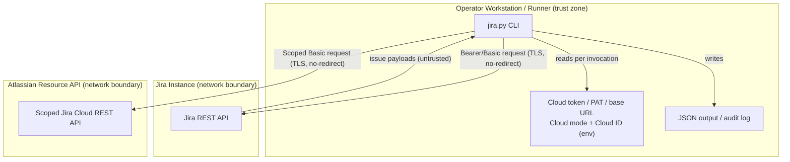

<!-- markdownlint-disable-file -->
# Jira Skill Security Model

This document records the STRIDE threat model for the Jira skill (`scripts/jira.py`). The model is organized by trust bucket: CLI → Jira API (B1), Environment credentials (B2), and CLI caller process (B3). Each bucket enumerates all six STRIDE categories with the in-code mitigations that address them. Assets and adversaries are enumerated first. Acknowledged enterprise readiness gaps are listed at the end.

The skill is a single-file, standard-library-only CLI. It performs no OAuth browser flow, runs no local listener, persists no tokens to disk, and spawns no subprocesses. Credentials are read from the process environment per invocation.

> **See also: repo-wide STRIDE model.** This skill participates in the repository-wide threat model at [`docs/security/security-model.md`](../../../../docs/security/security-model.md) and is registered in its [Skill Security Models](../../../../docs/security/security-model.md#skill-security-models) section.

## Executive Summary

The Jira skill is a single-file, standard-library-only REST CLI. It reads an
expiring Cloud API token or Data Center PAT from the environment and persists no
credentials. Scoped Cloud mode binds requests to the fixed Atlassian resource
origin; unscoped Cloud and Data Center retain validated configured origins.
Mixed modes fail closed. The optional audit sink records normalized origin and
auth mode and is operationally sensitive.

### Security Posture Overview

| Dimension          | Value                                                                     |
|--------------------|---------------------------------------------------------------------------|
| Runtime surface    | REST CLI (stdlib only); env credentials; no listener, no subprocess       |
| Trust buckets      | B1 CLI→Jira API, B2 environment credentials, B3 CLI caller process        |
| Credentials        | Expiring Cloud token or Data Center PAT from env; never persisted to disk |
| Network egress     | HTTPS to validated `JIRA_BASE_URL` or fixed `https://api.atlassian.com`   |
| Open residual gaps | 6 (EoP-Med: skill cannot revoke a leaked token)                           |

## Contents

* [System Description](#system-description)
* [Trust Boundaries](#trust-boundaries)
* [Assets](#assets)
* [Adversaries](#adversaries)
* [Bucket B1: CLI → Jira API](#bucket-b1-cli--jira-api)
* [Bucket B2: Environment credentials](#bucket-b2-environment-credentials)
* [Bucket B3: CLI caller process](#bucket-b3-cli-caller-process)
* [Enterprise Readiness Gaps](#enterprise-readiness-gaps)
* [References](#references)

## System Description

### Components

1. `scripts/jira.py` — a single-file CLI: parses arguments, resolves credentials from the environment, issues REST calls through a hardened opener, and prints JSON.
2. Hardened opener (`_OPENER` / `_NoRedirect`) — enforces TLS, refuses 30x redirects, and caps response bodies.

### Data Flow



## Trust Boundaries

### Boundary Diagram

```text
┌───────────────────────────────────────────────┐
│ TRUST BOUNDARY: Operator Workstation / Runner             │
│  ┌─────────┐   ┌─────────────┐   ┌───────────┐  │
│  │ jira CLI │   │ Env creds   │   │ JSON/audit │  │
│  │         │   │ (PAT/Basic) │   │ output     │  │
│  └─────────┘   └─────────────┘   └───────────┘  │
└────────────────────────┬─────────────────────┘
                          │ HTTPS (TLS, no-redirect)
            ┌──────────────▼─────────────────────────┐
            │ BOUNDARY: Jira Instance                │
            │  Jira REST API                         │
            └────────────────────────────────────────┘
            ┌────────────────────────────────────────┐
            │ BOUNDARY: Atlassian Resource API       │
            │  Scoped Jira Cloud REST API            │
            └────────────────────────────────────────┘
```

### Boundary Descriptions

| Boundary                      | Assets Protected                         | Controls Enforced                                                                 |
|-------------------------------|------------------------------------------|-----------------------------------------------------------------------------------|
| Operator Workstation / Runner | API token, output                        | Per-invocation env resolution (no persistence); redaction; write-confirm gate     |
| Jira Instance                 | Request/response integrity, bearer token | TLS (system trust store); `_NoRedirect`; origin-only base URL; capped JSON parser |
| Atlassian Resource API        | Scoped token, Cloud request integrity    | Fixed HTTPS origin; single-segment Cloud ID; `_NoRedirect`; capped JSON parser    |

## Assets

| Id | Asset                                   | Lifetime         | Notes                                                                                                                                          |
|----|-----------------------------------------|------------------|------------------------------------------------------------------------------------------------------------------------------------------------|
| A1 | Jira API token / PAT                    | Operator-managed | Read from `JIRA_API_TOKEN` / PAT env at invocation. Sent as Bearer (Server/DC) or HTTP Basic (`email:token` base64, Cloud) in `Authorization`. |
| A2 | Jira destination configuration          | Operator-managed | Scoped Cloud uses the fixed Atlassian resource origin; other modes use validated `JIRA_BASE_URL`.                                              |
| A3 | Request/response bodies, issue payloads | Command lifetime | Server responses may include issue text, comments, and field data authored by other users; downstream automation must treat as untrusted.      |
| A4 | Diagnostic / audit output               | Command lifetime | stderr diagnostics and the optional audit log; must never contain unredacted secrets.                                                          |

## Adversaries

| Id    | Adversary                                             | In-scope mitigations                                                                                                                                                 |
|-------|-------------------------------------------------------|----------------------------------------------------------------------------------------------------------------------------------------------------------------------|
| ADV-a | Same-uid malware on the operator workstation          | **Not defended.** A process running as the operator can read the environment directly. Workstation hygiene is the controlling defense.                               |
| ADV-b | Network attacker on the CLI ↔ Jira channel            | TLS with stdlib certificate validation; HTTP redirects refused (`_NoRedirect`); HTTPS required for non-loopback hosts; capped, content-type-checked response parser. |
| ADV-c | Hostile or malformed Jira server / response           | No-redirect opener; response size cap (`MAX_BODY_BYTES`); JSON content-type fail-closed; error bodies parsed-then-redacted before display.                           |
| ADV-d | Hostile caller process controlling argv / stdin / env | Inputs validated and URL-encoded; `JIRA_BASE_URL` canonicalized to origin-only; Basic-auth components ASCII-validated; stdin/JSON size-capped before parse.          |

## Bucket B1: CLI → Jira API

REST calls use `urllib.request` through a hardened opener. Scoped Cloud calls
target the fixed Atlassian resource origin; unscoped Cloud and Data Center calls
target validated `JIRA_BASE_URL`.

### Spoofing

* TLS certificate validation is enforced by the stdlib default `SSLContext` (system trust store).
* `JIRA_BASE_URL` is validated and normalized to an origin-only URL, rejecting embedded userinfo so a crafted value cannot impersonate a host with inline credentials (`_validate_base_url` / base-URL normalization).
* Scoped Cloud mode treats `JIRA_CLOUD_ID` as one bounded opaque path segment
    under `https://api.atlassian.com`; it cannot replace the request origin.

### Tampering

* TLS protects request and response bodies in transit.
* The shared opener `_OPENER` is built with `_NoRedirect`, which raises on any 30x so a redirect cannot silently retarget the request to another host.
* Interpolated path segments (project key, issue type id) are URL-encoded via `urllib.parse.quote(safe="")`; `max_results` is clamped; the issue key is matched against `ISSUE_KEY_PATTERN`.

### Repudiation

* Commands emit deterministic exit codes (`EXIT_SUCCESS`/`EXIT_FAILURE`/`EXIT_USAGE`) so automation can attribute outcomes.
* An optional audit record contains the normalized destination origin and auth
    mode while excluding request paths and Cloud IDs. The sink is operationally
    sensitive because internal hosts can appear in it; see Enterprise Readiness
    Gaps for integrity limitations.

### Information Disclosure

* The Bearer/Basic token is sent only in the `Authorization` header over TLS and is never logged.
* The token-bearing opener blocks 30x, preventing a hostile redirect from forwarding the `Authorization` header to a non-Jira origin (`_NoRedirect`).
* The response parser requires a JSON content type when JSON is expected and reads through a capped reader (`_read_response_body`, `_get_response_content_type`); a missing or non-JSON content type fails closed rather than being parsed as a token/payload.
* Remote error bodies are JSON-parsed first and only redacted for presentation (`_extract_error_message` → `_redact`), so structured extraction is preserved and secrets in error text are masked.
* `_redact` covers `Bearer`/`Basic`, `Authorization`/`Proxy-Authorization`/`X-API-Key`/`PRIVATE-TOKEN`/`Cookie`/`Set-Cookie`, and query-string secrets (`token`, `api_key`, `access_token`, `private_token`). It additionally applies `_REDACT_PATTERNS`, which mask every `_REDACT_KEYS` entry in JSON shape (`"key": "value"`), bare form shape (`key=value`, with no leading `?` or `&` required), and Azure Blob SAS query strings. `code_challenge` is deliberately excluded because a PKCE challenge is public by design and masking it would corrupt an authorization URL.
* Transport failures raise `JiraAPIError`, whose `__str__` renders only the status, method, query-stripped resource, redacted summary, and a character-validated request ID. The raw response body, the query-bearing request URL, and the header dictionary are never part of the rendered string (`_scrub_url`, `_response_request_id`).
* `JiraClient.auth_header` carries `repr=False`, so `repr(client)`, f-string interpolation, and traceback frame dumps cannot surface the `Bearer <pat>` or `Basic <base64(email:api_token)>` credential.

### Denial of Service

* Response bodies are read through `_read_response_body` with a `MAX_BODY_BYTES` cap so a runaway upstream cannot exhaust memory.
* The request uses `REQUEST_TIMEOUT_SECONDS` so a stalled server cannot hang the CLI indefinitely.

### Elevation of Privilege

* The skill issues only the operations exposed by its explicit subcommands; there is no dynamic endpoint construction beyond validated, encoded path segments.

### TLS posture

The skill performs every Jira call through the stdlib opener with no custom `SSLContext`, CA-bundle flag, or certificate pinning. Operators inherit Python's default HTTPS behavior: validation uses the system trust store; custom internal CAs require `SSL_CERT_FILE`/`SSL_CERT_DIR`; there is no pinning or mTLS (recorded as G-TLS-1). HTTPS is required for non-loopback hosts; plaintext `http://` is refused even when `JIRA_ALLOW_INSECURE=1` is set. The bypass is limited to loopback hosts only. Write operations such as `create`, `update`, `transition`, and `comment` now require explicit confirmation via `--confirm`/`--yes` or `JIRA_CONFIRM_WRITES=1` before dispatch.

### Risk Rating

| Threat                                  | Likelihood | Impact | Residual Risk | Status                          |
|-----------------------------------------|------------|--------|---------------|---------------------------------|
| TLS MITM / hostile redirect retargeting | Low        | High   | Low           | Mitigated (TLS + `_NoRedirect`) |
| Plaintext HTTP to a non-loopback host   | Low        | High   | Low           | Mitigated (refused)             |
| Unconfirmed write operation             | Low        | Med    | Low           | Mitigated (confirm gate)        |
| Oversized-response memory exhaustion    | Low        | Low    | Low           | Mitigated (body cap + timeout)  |

## Bucket B2: Environment credentials

Credentials and the instance origin are read from the process environment per invocation (`JiraClient.from_environment`). Nothing is persisted to disk.

### Spoofing

* The base URL is parsed with `urllib.parse.urlsplit` and must use `http`/`https`; HTTPS is enforced for non-loopback hosts.

### Tampering

* `JIRA_BASE_URL` is rejected when it contains control characters, embedded userinfo, a query, a fragment, or a non-root path — it is reduced to an origin-only URL before any request is built.
* Cloud mode must be `unscoped` or `scoped`; scoped mode requires a validated single-segment Cloud ID, and PAT/Cloud credential conflicts fail before authorization-header construction.
* The HTTP Basic credential is constructed from validated components and the resulting header is ASCII-only, preventing header injection via newline- or control-bearing email/token values.

### Repudiation

* Missing or malformed credentials fail fast with a `ScriptError` and a usage exit code, so a misconfigured environment is attributable.

### Information Disclosure

* Tokens are never written to disk and never logged. The Basic-auth base64 value is used only to build the `Authorization` header.
* Audit records exclude the Cloud ID, request path, query, and credential material.

### Denial of Service

* Not applicable; credential resolution is a bounded, in-process step.

### Elevation of Privilege

* The token's effective permissions are governed entirely by Jira; the skill adds no privilege and cannot broaden scope.

### Risk Rating

| Threat                                          | Likelihood | Impact | Residual Risk | Status                       |
|-------------------------------------------------|------------|--------|---------------|------------------------------|
| Header injection via credential components      | Low        | Med    | Low           | Mitigated (ASCII validation) |
| Base-URL host impersonation (embedded userinfo) | Low        | Med    | Low           | Mitigated (origin-only)      |

## Bucket B3: CLI caller process

The caller controls argv, environment, stdin, stdout, and stderr; the CLI treats that process as operator-controlled.

### Spoofing

* The CLI has no network listener or attach surface; it runs as the invoking OS user.

### Tampering

* Arguments are parsed with `argparse`; handlers validate identifiers and encode interpolated segments before issuing requests.
* JSON arguments are parsed through the JSON-argument helper, which enforces a size cap before `json.loads` so an oversized payload cannot be materialized in memory.

### Repudiation

* Validation, authentication, and runtime failures map to distinct exit codes so a calling step can attribute the failure class.

### Information Disclosure

* Command output is JSON-encoded Jira payloads; tokens never appear in normal output.
* Every process-stream write is funneled through `_emit` (stderr plus the `jira` logger), `_emit_stdout` (stdout), or `_emit_debug_traceback`, and each applies `_redact` before writing. A source-contract test asserts no `print` call exists outside those three helpers, so stdout cannot bypass the barrier that stderr passes.
* `JIRA_DEBUG=1` enables a traceback on the failure path; the formatted traceback is redacted before it is written. `LOGGER.exception` is banned by a source-contract test because it would emit an unredacted traceback.
* Jira-authored text returned in output must be treated as untrusted by downstream automation; the CLI never interpolates it into model instructions.

### Denial of Service

* stdin and JSON payloads are size-capped before parsing; `max_results` pagination is clamped to a bounded value.

### Elevation of Privilege

* There is no command path that bypasses input validation or constructs an unencoded request URL from caller input.

### Risk Rating

| Threat                                  | Likelihood | Impact | Residual Risk | Status                              |
|-----------------------------------------|------------|--------|---------------|-------------------------------------|
| Oversized stdin / JSON payload          | Low        | Low    | Low           | Mitigated (size caps)               |
| Untrusted Jira text consumed downstream | Med        | Med    | Med           | By design (consumer responsibility) |
| Leaked token not revocable by the skill | Low        | High   | Med           | Accepted upstream (G-EOP-1)         |

## Enterprise Readiness Gaps

The following are known limitations recorded so operators can make informed deployment decisions. Severity ratings are the project's own assessment and are not equivalent to a CVSS score.

| Id      | Gap                                                                                                                                                                                        | Severity        | Status                                                                                                      |
|---------|--------------------------------------------------------------------------------------------------------------------------------------------------------------------------------------------|-----------------|-------------------------------------------------------------------------------------------------------------|
| G-REP-1 | The write-ahead attempt is fail-closed, but the outcome is best-effort and the operator-supplied file is not signed or append-only.                                                        | Repudiation-Med | By design; integrate with host telemetry for tamper-evident logging.                                        |
| G-INF-1 | Redaction is regex-based and intentionally broad; it may over-redact benign diagnostic text. It is a defense-in-depth backstop, not a license to log secrets.                              | InfoDisc-Low    | Accepted; operators should still avoid logging credential-bearing values.                                   |
| G-INF-2 | `_REDACT_KEYS` enumerates known credential field names; a novel or vendor-specific field name is masked only if it also matches the header, `Bearer`/`Basic`, or query-string rules.       | InfoDisc-Low    | Accepted; extend `_REDACT_KEYS` as new credential shapes appear. `tests/test_jira_helpers.py` pins the set. |
| G-EOP-1 | The skill cannot revoke a leaked expiring Cloud API token or Data Center PAT; revocation is performed at Atlassian or the Jira instance.                                                   | EoP-Med         | Upstream control; rotate or revoke at the provider on suspicion of compromise.                              |
| G-SUP-1 | The skill's Python dependencies are declared in `pyproject.toml` but transitive hashes are not pinned and no SBOM is published for the skill; transport/URL/auth fuzz coverage is partial. | SupplyChain-Med | Tracked at the repository level.                                                                            |
| G-TLS-1 | No certificate pinning for the Jira origin; TLS validation depends entirely on the system trust store.                                                                                     | InfoDisc-Low    | Operator-acceptable for a managed Jira endpoint; documented for customers whose policy mandates pinning.    |

For an active issue tracker entry covering these gaps, see [microsoft/hve-core#2225](https://github.com/microsoft/hve-core/issues/2225).

## References

* [STRIDE Threat Model](https://learn.microsoft.com/azure/security/develop/threat-modeling-tool-threats)
* [OWASP Top 10 for Web Applications](https://owasp.org/www-project-top-ten/)
* [Jira REST API](https://developer.atlassian.com/cloud/jira/platform/rest/v3/)
* [Repository security model](../../../../docs/security/security-model.md)

🤖 Crafted with precision by ✨Copilot following brilliant human instruction, then carefully refined by our team of discerning human reviewers.
