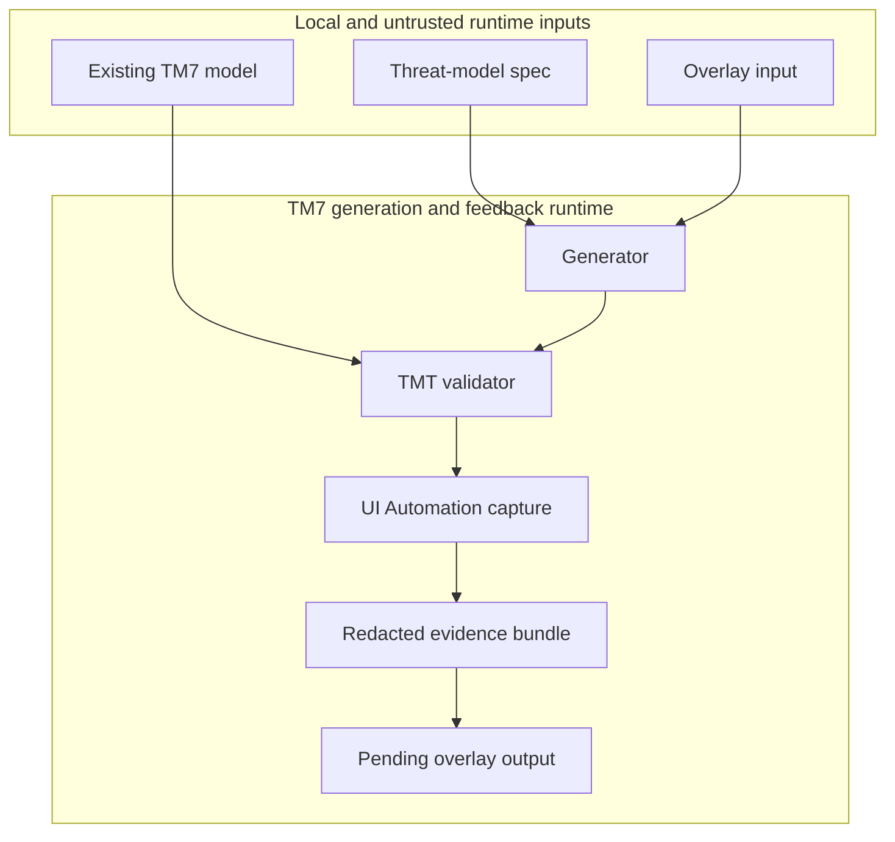

# Security Planning Skill Security Model

This document records the STRIDE threat model for the TM7 generation and native feedback runtime in the security-planning skill. The runtime now includes the generator, the native Microsoft Threat Modeling Tool validator, local UI Automation interaction, screenshot capture, evidence persistence, and overlay replay. The model is organized by trust bucket around the executable surfaces that the runtime directly touches: TMT process automation and UI Automation (B1), local screenshot and evidence capture (B2), and overlay and evidence path handling (B3). Each bucket enumerates all six STRIDE categories with the mitigations that address them. Assets and adversaries are enumerated first, and enterprise readiness gaps appear at the end. The runtime writes redacted evidence bundles under a local evidence root with `manifest.json`, `status.json`, `action.log`, and per-run screenshots/UIA/summaries folders, writes iteration-scoped candidate models and `overlay.yaml` files under `iterations/00-baseline` and `iterations/01` through `iterations/03`, emits pending overlay outputs for human review, and never rewrites the canonical baseline or auto-promotes overlays to `approved`.

> **See also: repo-wide STRIDE model.** This skill participates in the repository-wide threat model at [docs/security/security-model.md](../../../../docs/security/security-model.md) and is registered in its [Skill Security Models](../../../../docs/security/security-model.md#skill-security-models) section.

## Executive Summary

The highest-risk behavior is running a local executable against a threat-model artifact and then treating the resulting UI evidence and overlay as trustworthy enough for review, even though the automation only has partial visibility and the workflow must remain human-led. The runtime accepts a YAML or JSON spec, optional overlay inputs, a bundled template profile, and a local TM7 model, then drives Microsoft Threat Modeling Tool 7.3.51110.1 through process automation and UI Automation when the feedback loop is enabled. The workflow uses pinned versions, deterministic manifests, redaction, bounded timeouts, window-scoped capture, and a pending-approval overlay contract to prevent silent promotion or over-trust in visual scores.

### Security Posture Overview

| Dimension          | Value                                                                                                                                                                                                             |
|--------------------|-------------------------------------------------------------------------------------------------------------------------------------------------------------------------------------------------------------------|
| Runtime surface    | Local Python generator, native TMT validation harness, Windows UI Automation, screenshot capture, and evidence/overlay handling                                                                                   |
| Trust buckets      | B1 TMT process automation and UI Automation; B2 local screenshots and evidence capture; B3 overlay-manifest and output path handling                                                                              |
| Credentials        | None handled or persisted by the runtime; no network egress is expected                                                                                                                                           |
| Network egress     | None                                                                                                                                                                                                              |
| Open residual gaps | 10 (executable trust, UIA ambiguity, evidence disclosure, evidence tampering, overlay tampering, path confinement, visual-score over-trust, automation stalls, marked-workspace deletion, local assembly loading) |

## Contents

* [System Description](#system-description)
* [Trust Boundaries](#trust-boundaries)
* [Assets](#assets)
* [Adversaries](#adversaries)
* [Bucket B1: TMT process automation and UI Automation](#bucket-b1-tmt-process-automation-and-ui-automation)
* [Bucket B2: Local screenshots and evidence capture](#bucket-b2-local-screenshots-and-evidence-capture)
* [Bucket B3: Overlay manifest and output path handling](#bucket-b3-overlay-manifest-and-output-path-handling)
* [Enterprise Readiness Gaps](#enterprise-readiness-gaps)
* [References](#references)

## System Description

### Components

1. `scripts/generate_tm7.py`: loads and validates the input spec, selects a template profile, emits deterministic `.tm7` content, and replays a validated overlay when requested.
2. `scripts/validate_tm7_with_tmt.py`: discovers the local TMT executable, enforces the pinned version, launches the native UI, runs validation and feedback-loop modes, and writes redacted evidence bundles.
3. `scripts/tm7_visual_feedback.py`: evaluates geometry metrics, derives overlay candidates, ranks them deterministically, and evaluates convergence and semantic regression.
4. `assets/schemas/`: defines the overlay and evidence-manifest contracts that constrain replay and evidence output.
5. Generated evidence and overlays: `manifest.json`, `status.json`, iteration bundles, screenshots, UIA snapshots, and pending overlay output written for human review.

### Data Flow



## Trust Boundaries

### Boundary Diagram

```text
┌──────────────────────────────────────────────────────────────┐
│ TRUST BOUNDARY: local executable runtime                    │
│  ┌─────────────────┐  ┌─────────────────┐  ┌──────────────┐ │
│  │ Threat-model    │  │ Overlay/       │  │ TMT UIA and  │ │
│  │ spec and model  │  │ evidence files │  │ screenshots  │ │
│  └─────────────────┘  └─────────────────┘  └──────────────┘ │
└──────────────────────────────┬───────────────────────────────┘
                               │ consumed by runtime
   ┌───────────────────────────▼───────────────────────────────┐
   │ TRUST BOUNDARY: local TM7 generation and feedback runtime │
   │  ┌───────────────┐  ┌───────────────┐  ┌──────────────┐ │
   │  │ Generator     │  │ TMT validator │  │ Evidence     │ │
   │  │ + overlay     │  │ + UIA         │  │ writer       │ │
   │  └───────────────┘  └───────────────┘  └──────────────┘ │
   └──────────────────────────────────────────────────────────┘
```

### Boundary Descriptions

| Boundary                   | Assets Protected                                  | Controls Enforced                                                                                                |
|----------------------------|---------------------------------------------------|------------------------------------------------------------------------------------------------------------------|
| Local executable runtime   | Integrity of the local TMT process and UI state   | Version pinning, executable metadata checks, harness-owned process tracking, bounded timeouts, no network egress |
| Evidence and overlay files | Integrity of screenshots, manifests, and overlays | Path confinement, redaction, deterministic manifests, pending approval, human review before promotion            |

## Assets

| Id | Asset                                    | Lifetime                          | Notes                                                                          |
|----|------------------------------------------|-----------------------------------|--------------------------------------------------------------------------------|
| A1 | Threat-model spec                        | Ephemeral                         | YAML or JSON input that drives generation and overlay invalidation             |
| A2 | TM7 model and candidate models           | Ephemeral to persistent           | Baseline model plus candidate models generated for each iteration              |
| A3 | Overlay payload                          | Ephemeral to persistent           | Versioned replay rule that must remain pending until reviewed                  |
| A4 | TMT executable and UI Automation context | Runtime                           | Local Windows executable and desktop session used to validate the model        |
| A5 | Screenshots and UIA traces               | Persistent within evidence bundle | Local-only evidence that may contain model content and layout details          |
| A6 | Manifest and status files                | Persistent                        | Redacted evidence summary that records status, stop reason, and iteration data |

## Adversaries

| Id    | Adversary                                                                                               | In-scope mitigations                                                                                     |
|-------|---------------------------------------------------------------------------------------------------------|----------------------------------------------------------------------------------------------------------|
| ADV-a | Attacker supplies a forged or spoofed executable path to redirect the harness to an unintended binary   | Path validation, executable metadata checks, pinned version, harness-owned process tracking              |
| ADV-b | Attacker causes UI Automation to select the wrong window or pane, or to interact with unrelated content | Explicit surface identity checks, fail-closed selection, bounded timeouts                                |
| ADV-c | Attacker causes a hang, modal loop, or resource exhaustion in TMT or the harness                        | Bounded timeouts, modal detection, clean shutdown, retry boundaries, evidence flush on exit              |
| ADV-d | Attacker or operator discloses sensitive model content through screenshots or UIA traces                | Text-evidence redaction, local-only evidence handling, window-handle-isolated capture, no network egress |
| ADV-e | Attacker tampers with overlay manifests, fingerprints, or output paths                                  | Deterministic manifest fingerprints, path confinement, strict schema validation, pending approval        |
| ADV-f | Operator over-trusts a visual score or pending overlay without semantic review                          | Human approval before promotion, semantic regression checks, no automatic promotion                      |

## Bucket B1: TMT process automation and UI Automation

### Spoofing

* Not applicable. The harness does not authenticate the discovered executable as an authority; it treats the local path and version as a runtime target and validates them before use.

### Tampering

* The runtime validates the executable path and pinned version before launch, and records the discovered executable metadata in the evidence manifest. It rejects mismatches rather than proceeding with an unverified binary.

### Repudiation

* Not applicable. The runtime does not claim an operator identity, but it does record a redacted action log and manifest for each run.

### Information Disclosure

* The runtime does not transmit evidence or process details over the network. It stores only local evidence bundles and redacted status records.

### Denial of Service

* The runtime uses bounded timeouts, handles unexpected modal windows as failures, and stops the loop on automation timeout or unexpected modal conditions.

### Elevation of Privilege

* The runtime does not grant code execution from the input model. It only launches a local desktop process and interacts with UI Automation controls that the host operator can access.

### Risk Rating

| Threat                                                                                  | Likelihood | Impact | Residual Risk | Status                                                                                                                   |
|-----------------------------------------------------------------------------------------|------------|--------|---------------|--------------------------------------------------------------------------------------------------------------------------|
| Executable discovery or path spoofing causes the harness to launch the wrong binary     | Low        | High   | Medium        | Mitigated (absolute installation roots, Authenticode publisher check, pinned version, deterministic selection) (G-SPF-1) |
| UI Automation selects an unrelated window or pane                                       | Medium     | Medium | Medium        | Mitigated (explicit surface identity checks, fail-closed behavior) (G-TAM-1)                                             |
| TMT hangs, modal loops, or resource exhaustion stops the run or leaves partial evidence | Medium     | Medium | Medium        | Mitigated (timeouts, modal handling, bounded iterations) (G-DOS-1)                                                       |

## Bucket B2: Local screenshots and evidence capture

### Spoofing

* Not applicable. Screenshots and UIA traces are captured from the local desktop session and are never treated as an identity proof.

### Tampering

* The runtime writes redacted evidence bundles with deterministic manifest and status records. It stores screenshots and UIA traces under a local evidence root rather than accepting externally supplied evidence paths.

### Repudiation

* Not applicable. The runtime records the evidence bundle and action log as machine-readable output, but it does not claim a human identity for a screenshot or UIA state.

### Information Disclosure

* Screenshot and UIA capture can reveal the model content and layout. Screenshots cover the whole Threat Modeling Tool window rather than the diagram pane alone, so anything the tool displays is captured. Redaction applies to text evidence only; captured pixels are never redacted, and this document does not claim otherwise. Capture is refused unless the host can address a single native window handle, so a desktop-region capture that could include an unrelated application is never persisted. Where isolation is unavailable, capture is disabled, and a run that requires complete evidence fails closed rather than continuing without it. Evidence remains local-only.

### Denial of Service

* Evidence capture is bounded by the capture scope and output directories. The harness writes to a contained evidence path and does not allow arbitrary network or file-system expansion.

### Elevation of Privilege

* Local screenshots and UIA traces are read-only observational data. They do not execute code and do not grant the runtime new privileges beyond the host desktop session.

### Risk Rating

| Threat                                                     | Likelihood | Impact | Residual Risk | Status                                                                                                                                                     |
|------------------------------------------------------------|------------|--------|---------------|------------------------------------------------------------------------------------------------------------------------------------------------------------|
| Screenshots or UIA traces expose sensitive model content   | Medium     | Medium | Medium        | Partially mitigated (text-evidence redaction, window-handle-isolated capture that is refused when isolation is unavailable, local-only evidence) (G-INF-1) |
| Evidence files are replaced or tampered with after capture | Medium     | Medium | Medium        | Mitigated (deterministic manifests, local ownership, explicit status updates) (G-TAM-2)                                                                    |

## Bucket B3: Overlay manifest and output path handling

### Spoofing

* Not applicable. The overlay and manifest contract does not establish identity; it only validates shape and fingerprints before replay.

### Tampering

* The runtime validates overlay schema, required fingerprints, and path confinement before replay. It rejects overlays that do not match the current spec, generator profile, or surface identity fingerprint and keeps emitted overlays in `approval_state: pending` until a human review action promotes them outside the loop.

### Repudiation

* Not applicable. The runtime does not create a human review record for the overlay; it writes a pending overlay and leaves promotion to an explicit human action.

### Information Disclosure

* The overlay and manifest are local file artifacts with no network egress. They contain only redacted provenance and deterministic metadata.

### Denial of Service

* The runtime constrains overlay paths to local output directories and rejects absolute or traversal paths in overlay references.

### Elevation of Privilege

* Overlay content does not execute code. Its effect is limited to candidate generation and the pending overlay output file.

### Risk Rating

| Threat                                                                                                                 | Likelihood | Impact | Residual Risk | Status                                                                                                               |
|------------------------------------------------------------------------------------------------------------------------|------------|--------|---------------|----------------------------------------------------------------------------------------------------------------------|
| Overlay or manifest tampering changes the replay contract or the evidence metadata                                     | Medium     | Medium | Medium        | Mitigated (strict schema, required complete invalidation fingerprints, path confinement, pending approval) (G-TAM-3) |
| A path traversal or output-escape bug writes evidence or overlay content outside the intended local evidence directory | Low        | Medium | Low           | Mitigated (path validation and confinement) (G-EOP-1)                                                                |
| Visual scores or pending overlays are treated as equivalent to a semantic approval                                     | Medium     | High   | Medium        | Mitigated (semantic regression checks, no automatic promotion, human review gate) (G-REP-1)                          |

## Enterprise Readiness Gaps

The following residual gaps should be tracked before the runtime is treated as fully enterprise-ready for broad, policy-governed usage.

| Id      | Gap                                                                                                                                                                                                                                                                      | Severity         | Status                                                                |
|---------|--------------------------------------------------------------------------------------------------------------------------------------------------------------------------------------------------------------------------------------------------------------------------|------------------|-----------------------------------------------------------------------|
| G-SPF-1 | Executable discovery selects from absolute installation roots and requires a valid Authenticode signature from the accepted publisher, but the harness still trusts the local installation it finds, so operators must confirm the discovered binary and pinned version. | Spoofing-High    | Open; requires operator review and a trusted installation path        |
| G-TAM-1 | UI Automation can still target an unintended window or pane when the surface identity is ambiguous, so strict mode must remain fail-closed.                                                                                                                              | Tampering-Med    | Open; requires surface identification discipline and human inspection |
| G-INF-1 | Screenshots capture the whole Threat Modeling Tool window and UIA traces carry model text. Text evidence is redacted; captured pixels are not, so retention and handling of screenshots is a policy control rather than a runtime one.                                   | InfoDisc-Med     | Open; requires retention and handling controls for pixel evidence     |
| G-TAM-2 | Evidence files can still be modified or replaced after capture if the local environment is compromised, so bundle integrity checks remain important.                                                                                                                     | Tampering-Med    | Open; requires integrity and access controls                          |
| G-TAM-3 | Overlay and manifest tampering remain a practical risk when untrusted files are replayed, so strict schema and fingerprint validation must stay mandatory.                                                                                                               | Tampering-Med    | Open; requires review of overlay provenance and path origin           |
| G-EOP-1 | Output-path handling should remain confined to the runtime-owned evidence directory and reject traversal or escape attempts.                                                                                                                                             | EoP-Med          | Open; requires path-confinement validation and monitoring             |
| G-REP-1 | Visual scores and pending overlays are not semantic approval signals, so the workflow must continue to require human review before any promotion.                                                                                                                        | Repudiation-High | Open; requires explicit review and promotion process                  |
| G-DOS-1 | TMT or UI Automation can still hit a modal or resource exhaustion state, so the runtime must continue to enforce bounded timeouts and stop conditions.                                                                                                                   | DoS-Med          | Open; requires runtime monitoring and operator response               |
| G-EOP-2 | Recursive workspace deletion is restricted to a directory the harness created and marked itself, so an operator-supplied `--workspace-root` is treated as a parent only. The marker is a local file and offers no protection against a compromised host.                 | EoP-Med          | Open; requires local file-system integrity                            |
| G-SPF-2 | The PowerShell fidelity probe loads a .NET assembly from the discovered TMT installation to deserialize a model. The assembly is verified as signed by the accepted publisher before loading, but loading any local assembly executes publisher code in-process.         | Spoofing-Med     | Open; requires a trusted installation and operator confirmation       |

## References

* [Repository-wide security model](../../../../docs/security/security-model.md)
* [Skill security model conventions](../../../../.github/instructions/skill-security-model.instructions.md)
* [STRIDE Threat Model](https://learn.microsoft.com/azure/security/develop/threat-modeling-tool-threats)
* [Microsoft Threat Modeling Tool](https://learn.microsoft.com/azure/security/develop/threat-modeling-tool)

🤖 Crafted with precision by ✨Copilot following brilliant human instruction, then carefully refined by our team of discerning human reviewers.
