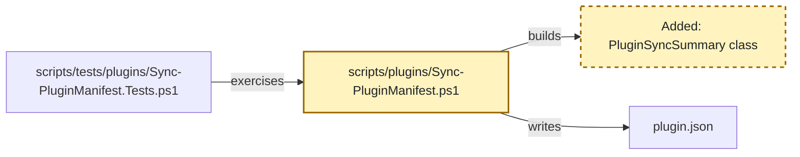

# RPI Plan Reference

## Artifact paths

Use one date and one lower-kebab-case task slug across the task's durable artifacts.

* `.copilot-tracking/research/{{YYYY-MM-DD}}/{{task_slug}}-research.md`
* `.copilot-tracking/plans/{{YYYY-MM-DD}}/{{task_slug}}-plan.md`
* `.copilot-tracking/reviews/plans/{{YYYY-MM-DD}}/{{task_slug}}-plan-critique.md`
* `.copilot-tracking/changes/{{YYYY-MM-DD}}/{{task_slug}}-changes.md`
* `.copilot-tracking/reviews/logs/{{YYYY-MM-DD}}/{{task_slug}}-review.md`

The research, changes, and review paths belong to their respective RPI stages. Planning creates or revises only the plan and critique artifact unless a justified research activation is required.

## Artifact audience and order

The plan is the user-facing source of truth, implementation handoff, and downstream checklist. A reader should understand what will change and how the work is sequenced before reaching supporting detail, so the sections appear in this order:

1. `## Task Metadata`
2. `## Executive Summary` with `### What You May Not Know`
3. `## Phase Checklist` with Before and After overall diagrams, phases, phase diagrams, and tasks
4. `## User Decisions and Requirements`
5. `## Planning Readiness and Next Step`
6. `## Goals`, `## Scope and Non-Goals`, `## Functional Requirements`, `## Non-Functional Requirements`, `## Risks and Open Questions`, `## Dependencies`, and `## Sources`, each included when it holds content
7. `## Critique Disposition`, `## Artifact Self-Check`, `## Follow-Up Items`, and `## Handoff`

Keep each fact in one canonical section; summary prose projects current state without creating another decision authority. Each task's `Requirements:` block is the checkable record for that task: it cites `FR-nnn` and `NFR-nnn` identifiers and adds binding conditions rather than restating the requirement catalog. Open decisions, risks, and questions live in `## User Decisions and Requirements` and `## Risks and Open Questions` with the affected `Pxx-Txx` named, not in per-task status blocks.

## Formatting conventions

The plan is read by people in an editor as well as by agents, so it uses ordinary Markdown navigation aids:

* Wrap code, commands, symbols, option names, and identifiers in backticks: `npm run lint:ps`, `New-PluginFixture`, `--json`.
* Link an existing file or folder with the workspace-relative path as the link text and a path relative to the plan file as the destination. From `.copilot-tracking/plans/{{YYYY-MM-DD}}/`, a repository file is three levels up and a sibling tracking artifact is two levels up:

  ```markdown
  * [scripts/tests/plugins/Sync-PluginManifest.Tests.ps1](../../../scripts/tests/plugins/Sync-PluginManifest.Tests.ps1): fixture and validation-test patterns
  * [.copilot-tracking/research/{{YYYY-MM-DD}}/{{task_slug}}-research.md](../../research/{{YYYY-MM-DD}}/{{task_slug}}-research.md):
    * Q2 under `## Findings` established the tracking responsibility boundary.
  ```

* Keep a path that does not exist yet in backticks rather than a link, and convert it to a link once the file exists.
* Do not use `#file:` directives or line-number references in the plan.

These conventions apply to the plan and to the changes record that `rpi-implement` maintains. Research, critique, and review records follow their own skills.

## Identity and markers

Use one stable task ID throughout the artifact set. Use `Pxx` for phase IDs and `Pxx-Txx` for task IDs. Put each marker immediately before its matching heading:

```markdown
<!-- rpi:phase id=P01 -->
### [ ] P01: Establish the change

<!-- rpi:task id=P01-T01 -->
#### [ ] P01-T01: Update the primary artifact
```

Do not use line numbers, line ranges, detail-line verification, or separate legacy log artifacts. Navigate by task ID, marker, and heading.

Use one stable overall task ID. Keep current `Pxx` and `Pxx-Txx` markers for navigation. During planning, the parent may add, update, delete, reorder, split, merge, or replace phases and tasks, and may renumber current IDs so the plan stays coherent. Remove obsolete active content rather than preserving it for identifier history.

## User decisions and requirements

The plan's `## User Decisions and Requirements` section has two distinct records. Confirmed User Direction is a concise freeform list of current user intent from prompts, user-pointed documents, tasks, issues, prior research, and accepted decisions. Planning Decisions and Feedback holds unresolved, proposed, deferred, and resolved material choices grouped by dependency and decision context. Each row records group, status, owner, rationale or requested input, evidence, and impact.

The planner synthesizes confirmed direction and current evidence into separate top-level `## Goals`, `## Scope and Non-Goals`, `## Functional Requirements`, and `## Non-Functional Requirements` sections after `## Phase Checklist`. Number functional requirements `FR-nnn` and non-functional requirements `NFR-nnn` so tasks can cite them. Each task's `Requirements:` block connects those requirements to planned work without duplicating confirmed direction or unresolved decision rows. Move a resolved user-owned choice into Confirmed User Direction and update or close its decision row.

When the user makes a clear change, update the list and every affected plan section directly without asking a redundant question. Reconcile the executive summary, phases, task markers, Goals, Requirements, Details, References, Dependencies, diagrams, critique inputs, and follow-up items after the update. Do not silently weaken or contradict a confirmed requirement.

When a decision-critical change remains unclear, apply the Planning Decision Walkthrough below. The question tool collects a choice; its evidence and explanation remain in the conversation and plan.

## Planning decision walkthrough

Resolve decision participation before presenting unresolved material planning decisions.

| Mode                               | Decision owner | Behavior                                                                                                                                                  |
|------------------------------------|----------------|-----------------------------------------------------------------------------------------------------------------------------------------------------------|
| Standalone or manual RPI           | User           | Walk through unresolved material decision groups and persist each answer before continuing.                                                               |
| Automatic RPI Agent, default       | Agent          | Resolve supported ordinary planning decisions and critique dispositions; stop on an unsupported material choice rather than asking or guessing.           |
| Automatic RPI Agent, user-retained | User           | Keep the session automatic, pause Plan for focused decision groups, then resume automatic progression after required answers and planning gates complete. |

Build groups from unresolved rows in Planning Decisions and Feedback. Order them by dependency, blocker status, and effect on Planning Readiness. A group contains one decision by default. Combine decisions only when they share the same choice, evidence, and consequences or when answering one independently would be misleading.

For each `user-owned` or `user-retained` group:

1. Persist the pending group and its evidence before conversation.
2. Present the plan and supporting research, source, or code as Markdown links. Explain the decision, why it matters now, viable choices and consequences, evidence-backed recommendation when available, uncertainty, and readiness effect in plain language.
3. Add a compact Mermaid diagram in conversation only when architecture, dependency, sequence, or a trade-off would otherwise be difficult to understand. The diagram supplements accessible prose.
4. Call `vscode_askQuestions` when available with one concise question per decision and fixed options plus freeform input when useful. When unavailable, ask the same question in chat and wait.
5. Persist the answer, provenance, affected requirements and phases, and readiness effect before presenting the next group.

When no unresolved material decision exists, record that no walkthrough is required and do not ask for acknowledgment. In `agent-owned` mode, apply the same group ordering internally, select only evidence-supported options, and persist each rationale. Missing decision-critical evidence produces Not ready or Blocked with the smallest evidence needed.

## Planning opening and material updates

Before substantive phase drafting, create or revise the plan, then persist canonical planning state in the sections that own it. Record task identity, interpreted planning goal, user decisions and requirements, goals, scope and non-goals, initial evidence and readiness assessment, active boundaries, unresolved decisions or blockers, and the resolved plan path. This persistence gives the opening and later updates a durable planning basis.

After that persistence, send one concise canonical `RPI Plan` opening using this shape:

```markdown
## 🧭 RPI Plan: [Task or topic] | [Readiness or planning focus]

[Interpreted planning goal.]

* Starting evidence and readiness: [current basis and readiness state]
* Initial phase direction: [first outcome or plan section to define]
* Active boundaries: [scope, non-goals, constraints, or critique boundary]
* Current decision state: [settled decisions, proposals, or unresolved items]
* Current blockers: [active blockers]
* Relevant links: [Markdown links when available]

These are the starting planning state and may evolve only through the existing evidence, critique, caller-direction, and planning-update rules.
```

Omit Current blockers when none are active. Omit Relevant links when no valid link is available. Do not invent state, links, or planning certainty.

Before each potential continual update, persist the item in the canonical plan or critique disposition section that owns it. Chat is a concise projection of that state, not a second history or delivery audit. A continual update is warranted only when the item changes phase direction, a current decision or readiness state, a material result or artifact state, a blocker or decision need, validation state where applicable, handoff, or the user's likely understanding. Suppress low-level actions, routine tool calls, raw extension returns, unchanged state, and minor rows or edits.

Use this compact shape when a message is warranted:

```markdown
### [Marker when useful] [Planning state]: [Short item]

Basis: [compact evidence, critique, or decision context and relevant Markdown links]

Planning consequence: [effect on goals, scope, requirements, phases, readiness, or unresolved work]

Next planning action: [next draft, revision, critique, decision request, handoff, or stop]
```

Use `✅` only for an evidence-backed settled decision or achieved readiness, `⚠️` for a proposal, unresolved item, critique concern, or revision need, and `⛔` for a blocker. Preserve factual uncertainty and identify proposals and unresolved items as such rather than presenting them as settled decisions. The pre-question decision-context requirement remains separate: provide it before a focused decision question, not before every tool call.

## Implementation-time updates and follow-up items

When `rpi-implement` updates the plan during implementation, update Confirmed User Direction and affected sections when the change affects current confirmed intent. Record unresolved choices in Planning Decisions and Feedback. Reconcile updated Goals, Requirements, Details, References, markers, dependencies, diagrams, and the executive summary. Remove superseded active content rather than retaining plan-state history. Checklist status and task-local `Guidance:` pointers are implementation annotations, not changes to the assessed candidate. A change to any assessed content, including requirements, scope, architecture, capability, safety, dependencies, evidence, or task wording, returns to planning for revision-bound closure before affected work resumes; a significant or divergent choice also needs the appropriate user decision. Never replay the old candidate's critique.

Implementation may also add a `Guidance:` block to a later task. It belongs immediately after that task's `Details:` and names something earlier work created that the later task needs and the plan did not already call out, such as a class, API, contract, utility, fixture, or path. Keep it short and concrete:

```markdown
Guidance:
* Consider using the contracts added under `scripts/plugins/contracts/`.
* `Get-PluginSyncSummary` in `scripts/plugins/Sync-PluginManifest.ps1` already builds the summary object; extend it rather than adding a second builder.
```

Persist any user answer that informed an implementation-time update in the freeform list and affected synthesized sections.

Every plan includes `## Follow-Up Items` immediately before `## Handoff`. Initialize it with `* None`. For each newly discovered item that is not immediately related to the approved plan, record the item, why it is outside immediate scope, and its owner or next action. Follow-up items are review-visible but do not become active `Pxx` or `Pxx-Txx` work, completion evidence, or acceptance claims without later planning.

## Executive summary

Every plan checklist includes a user-facing `## Executive Summary` immediately after `## Task Metadata`. It gives readers a useful overview before decisions, readiness, requirements, and phases.

Include these elements when evidence supports them:

* Explain, in approachable language, what the plan will implement and why the outcome matters.
* Include a `### What You May Not Know` subsection for important context, dependencies, risks, or constraints that a user might otherwise miss.
* State planning execution status, readiness, confidence, and residual uncertainty in plain language. Keep detailed decisions, blockers, and next actions in their canonical sections.

Keep summary claims synchronized with the evidence and the detailed plan. Do not invent claims, decisions, resources, risks, or links. Link to same-plan sections when navigation helps, and add an authoritative external explanatory link only when supplied evidence supports it and it materially improves comprehension. Follow the Formatting conventions above for paths, code, and commands.

Use readable Markdown selectively: concise paragraphs and lists for structure, bold for essential reader attention, and italics when introducing a term. Plain Markdown has no underline syntax. Use renderer-specific underline only when the generated tracking artifact's renderer is known to support it and the emphasis is essential; pair it with a plain-Markdown fallback, preferably bold. Do not use underline as decoration or repeat it for routine emphasis.

Update the executive summary after every material plan change, including critique-driven revisions, user decisions or their consequences, goals, scope, phases, dependencies, requirements, risks, and readiness. Before critique handoff and finalization, reconcile the summary with confirmed direction, decision rows, synthesized sections, and Planning Readiness and Next Step. Summary synchronization is a readiness condition.

## Research readiness

Read and understand the supplied research before deciding whether to activate `rpi-research`. Additional research is justified only when at least one condition holds:

* Evidence does not cover a requirement, acceptance criterion, dependency, or material risk needed for planning.
* The task's complexity or uncertainty makes a plan speculative.
* A decision-critical choice has multiple plausible outcomes without credible supporting evidence.

When none apply, plan from the supplied evidence. When one applies, ask `rpi-research` for the smallest evidence set that closes the gap, then resume planning.

## Overall planning and planning extensions

The primary planner owns Confirmed User Direction, Planning Decisions and Feedback, phase and task blocks, diagrams, phase order, dependencies, follow-up items, critique disposition, the complete plan, and finalization. It drafts every phase itself.

Skills and subagents whose descriptions say they are used during planning or with `rpi-plan` extend the planner. Read each description and follow its guidance on when and how to use it; the description is the contract. Exclude `rpi-plan`, `rpi-plan-critique`, and other RPI lifecycle phase entrypoints. An extension adds evidence, conventions, or proposals; verify what it returns against the evidence and write the plan yourself.

## Independent critique

Activate `rpi-plan-critique` when the primary planner judges the candidate ready for assessment. Reuse completed assessment evidence, close findings through Revision-bound closure, and recover unavailable work through Evidence-based recovery. A reservation coordinates a run; it does not prove assessment or consume a lifetime allowance. Do not critique an initial draft merely because it exists or repeat an assessment to obtain a more favorable verdict.

Select one critique depth and record its provenance before the critique runs:

| Depth      | Selection rule                           | Assessment behavior                                                                                                                                                                                                   |
|------------|------------------------------------------|-----------------------------------------------------------------------------------------------------------------------------------------------------------------------------------------------------------------------|
| `standard` | Default                                  | Assess the complete material supplied boundary as quickly as evidence permits, returning every evidence-supported implementation blocker and credibility gap without restatement, cosmetics, or low-impact expansion. |
| `deep`     | Explicit user request to critique deeply | Trace the supplied evidence more broadly, stress-test alternatives and boundaries, and include substantive lower-severity concerns. It remains one invocation and performs no open-ended research.                    |

Do not infer deep mode from plan size, complexity, uncertainty, or risk. Standard optimizes prioritization and output for minimal elapsed work without reducing complete coverage of actionable material concerns in the supplied boundary.

Before the critique runs, inspect Critique Disposition, parent state when present, and recorded critique paths. Preserve substantive results even when their files are missing. A surviving return may supply evidence; a status label alone cannot establish coverage. Reconcile a prior `started` record before authorizing another run rather than replaying its reservation.

Keep invocation outcome, assessment execution and verdict separate. A preflight limitation, interruption or host failure with no assessment records execution `Deferred` and verdict `unavailable`; record an uncertain outcome as `unknown`. A substantive assessment uses execution `Complete`, `Partial` or `Blocked` and its actual verdict. Do not relabel substantive findings as a transport failure. A missing dependency is a prerequisite to repair, not a verdict about the plan.

### Reservation and current-run ownership

Keep append-only attempt records in Critique Disposition: task, unique attempt ID, kind (`initial`, `revision-closure` or `recovery`), candidate identity, assessment scope, depth, distinct output, invocation outcome, execution, verdict and current-run provenance. Append reconciliation, ended-run evidence and findings without deleting earlier observations. When parent state exists, mirror current and original pointers in its single `Planning critique execution` entry; do not add top-level fields. Historical attempt kinds and counters remain evidence, not current retry limits.

Before reserving, verify the saved candidate and evidence at exact absolute workspace paths. Compute assessed content with [the canonical helper](#deterministic-assessed-content-identity). Record its resolved path, projection version, exact projection (inline or at an immutable evidence path) and SHA-256. A pointer-only `Guidance:` block is not a place to hide changed requirements or design; assessed edits follow Revision-bound closure. Persist `started`, verify the saved record, then immediately activate the named attempt. If persistence fails, repair that prerequisite before activation. On resume, a saved reservation without a result requires reconciliation, not automatic admission or permanent disqualification.

Give the critique the task, attempt ID/kind, candidate identity, assessment scope, depth, plan/state paths, output and current-run provenance. Use a host invocation identifier when exposed; otherwise record the uninterrupted reservation-to-activation sequence. Matching saved strings alone are not proof of a current run. The just-authorized run may assess its own reservation once. A later caller returns to the planner for reconciliation. Standalone first critique reserves its initial attempt in its output after verifying no earlier run or assessment needs reconciliation.

Supply the resolved canonical path to this reference from the active `rpi-plan` root, not an assumed sibling of the critique skill. The critique verifies admission but does not authorize its own recovery. An unavailable reference returns a preflight limitation to the planner; repair it and apply Evidence-based recovery rather than switching to a standalone invocation.

Lock applicable test ownership, exact removals or `none`, maximum additions, canonical and generated targets, semantic-versus-regression coverage, and validation evidence. Activate `rpi-plan-critique` once with the selected depth, exact task context, confirmed direction, resolved planning decisions, caller requirements, research, evidence, dependencies, task Requirements, plan path, and one critique output path. Assess the plan against the supplied evidence with fresh eyes rather than the drafting reasoning; running the critique in a subagent is one way to obtain that separation and is not required. The critique reads the plan and directly relevant supplied evidence, writes only the critique artifact, and returns one complete actionable finding set.

The critique is an internal readiness gate. Its verdict returns to the planning parent, which owns revision, decision requests, and finalization. It is not a peer lifecycle transition and does not cause a standalone user to invoke another stage.

Record the latest critique findings and their dispositions in the plan's standalone top-level `## Critique Disposition` section. Use the critique verdict to select the smallest next action:

* Revise the plan directly for evidence-backed corrections, applying all planner-owned findings in one coherent batch.
* Preserve confirmed user requests and answers when critique advice conflicts with them. Reject conflicting advice without re-asking when current user direction already resolves it.
* Route a significant or divergent finding not resolved by current user direction through the current Planning Decision Walkthrough when it affects requirements, scope, architecture, dependencies, or evidence boundary.
* Close every `PC-xxx` with its declared owner, disposition and exact resolving evidence. Record changed candidate identity and the parent-owned closure described below.
* Finalize from complete assessment coverage, closed blocking findings, explicit residual-risk dispositions and a current identity/closure record. Neither an attempted invocation nor approval alone establishes readiness.

When critique returns, resume the planning parent's authority to revise and finalize. An unresolved evidence gap pauses only affected work with its specific clearing action; it does not create an additional approval or human-review requirement.

### Revision-bound closure

The planning parent owns revisions and finding closure after critique returns. The critique's read-only boundary applies during assessment, not to the parent's subsequent editing. Keep the original assessment and verdict immutable. For each assessed-content edit, record predecessor and revised hashes, exact delta, affected requirements, finding dispositions and resolving evidence.

* For a supported correction that preserves assessed requirements, architecture, capability, safety and evidence boundaries, verify the delta directly and record parent closure. Reuse unaffected coverage with its applicability basis. Do not run a routine second critique or demand a new Pass for a historical Revise whose findings are resolved.
* For a material boundary change, obtain any unresolved user decision and commission a `revision-closure` assessment of the changed boundary and its affected dependencies. Use a full assessment when the impact cannot be bounded; otherwise retain explicitly applicable prior coverage. A changed hash alone is not a reason for reassessment.
* Partial or Blocked evidence does not establish complete coverage. Close actual findings against resolving evidence and identify the remaining assessment scope. When its prerequisite is supplied, assess that missing scope through Evidence-based recovery; do not discard the earlier findings or claim the missing work already ran.

For a new assessment, persist a distinct reservation with predecessor, adjacent hashes, delta, affected IDs and full-versus-scoped basis. A failed or interrupted revision assessment follows the same recovery protocol as an initial assessment. No interruption creates a human-assessment requirement.

Before finalization, recompute the delivered identity and verify its lineage to actual assessment evidence and each parent closure. Check complete combined coverage and dispositions, not only hash equality. Stop on missing identity, an unexplained delta, unresolved blocking findings or an unsupported retained-coverage claim. A current closure record can authorize hash B from assessed hash A; hash A alone cannot.

### Deterministic assessed-content identity

Execute [scripts/Get-PlanAssessmentHash.ps1](../scripts/Get-PlanAssessmentHash.ps1) from the
resolved `rpi-plan` skill root. The planner supplies that absolute helper path to the critic and
implementation handoff; a standalone consumer discovers `rpi-plan` by stable name, not an assumed
sibling directory. PowerShell 7.4 is required; the helper has no repository or package dependencies.
The [Bash entry point](../scripts/get-plan-assessment-hash.sh) forwards the same arguments to
PowerShell, preserving one implementation rather than duplicating the projection algorithm.

```powershell
pwsh -NoProfile -File "<resolved-rpi-plan-root>\scripts\Get-PlanAssessmentHash.ps1" -PlanPath "<absolute-saved-plan-path>"
```

The command emits JSON with `projection_version` (`rpi-plan-assessment-v1`), lowercase `sha256`,
and `projection`. The digest covers precisely the projection's UTF-8 bytes without BOM, not the
JSON serialization. It reads a literal path and never rewrites the plan.

The versioned projection follows the canonical plan template:

* Decode strict UTF-8, remove an optional leading BOM, and normalize CRLF and CR to LF. Preserve all
  other whitespace, including retained blank lines and terminal newlines.
* Remove the complete level-two `Critique Disposition`, `Artifact Self-Check`,
  `Planning Readiness and Next Step`, `Follow-Up Items` and `Handoff` sections through the next
  level-one or level-two heading, or EOF. Names are case-sensitive; optional closing ATX hashes
  and heading whitespace are recognized. Similarly named and deeper sections remain assessed.
* Within the single level-two `Phase Checklist`, normalize `[x]` to `[ ]` only in canonical
  `###` phase and `####` task headings immediately following their matching `rpi:phase` or
  `rpi:task` marker. Other checkboxes and unmarked headings remain unchanged.
* Within a marked task, remove `Guidance:` after `Details:` through the line before `References:`,
  including its trailing blank lines. Preserve the preceding separator. Guidance outside that
  scope remains assessed; a misplaced or unterminated recognized block is an error.
* Treat backtick/tilde fenced code and HTML comments as opaque to heading, marker and label
  recognition. The helper is for canonical ATX RPI plans, not arbitrary Markdown dialects.

Every consumer recomputes with this helper and compares both version and digest with the
assessment record. Retain its emitted projection for independent verification with a standard
SHA-256 tool. A missing helper, failed command, unsupported version, missing recorded projection,
or mismatched identity stops admission for planner reconciliation. Never substitute an agent-written
projection, invent a match or relabel historical hashes as this version. Reconcile earlier evidence
without changing its original identity; if coverage cannot be verified, readiness remains blocked.
Hash equality identifies the assessed bytes, not approval, complete assessment coverage or proof
that excluded Guidance contains only pointers.

### Evidence-based recovery

The planning parent may recover a deferred, interrupted or incomplete assessment within already-authorized scope without fresh recovery consent. This applies to initial and revision assessments, including repeated interruptions. There is no task-lifetime retry count or human-assessment fallback triggered by exhaustion. Recovery cannot override an explicit user stop or cancellation of the work.

1. Reconcile task-bound plan, state, outputs and available originating-run records. Preserve every result, fragment and finding. Record what was searched, what survives and which coverage is missing. Do not repeatedly request evidence already confirmed unavailable without a new lead. Missing historical budget fields are not a blocker by themselves; unknown candidate identity, unresolved fragments or run activity still require clarification.
2. Establish that each potentially competing run ended, using a host completion/cancellation record or explicit operator confirmation. Missing output, elapsed time or an empty local process list alone is insufficient. A verified never-dispatched reservation needs no fictional worker-termination proof. If activity is unknown, ask only for that lifecycle evidence; do not start a competing run.
3. Verify the saved candidate and canonical identity, readable evidence, writable distinct output and the concrete resolving action. Repair a missing reference or persistence failure before retrying. Resolve editor/disk conflicts without overwriting either. A reconstructed candidate needs evidence-backed identity and any decision its changed scope requires, not a routine approval prompt.
4. Record why the next attempt can advance: a repaired prerequisite, restored execution context after a confirmed interruption, new required evidence, or a bounded missing-coverage assignment. A positive infrastructure diagnosis is not required when the actual missing work and safe continuation are established. If the same failure recurs with no changed prerequisite or resolving action, stop with the diagnostic owner and smallest clearing evidence rather than retrying blindly.
5. Reuse completed coverage and disposition substantive findings. Authorize only missing or materially changed assessment scope, with predecessor hashes and retained-coverage evidence. If a completed assessment is irrecoverable, record that limitation and all surviving findings; after bounded reconciliation a replacement may reconstruct the missing coverage, but cannot erase known adverse findings or be used to choose a more favorable verdict.
6. Persist a fresh `recovery` reservation with an attempt-specific output, such as `-recovery-<attempt-id>.md`, and the recorded eligibility basis. Read it back and immediately activate its matching run. Preserve the prior reservation even when it never produced evidence. Reconcile an existing output rather than overwrite it.
7. Read back the returned assessment and reconcile late results, candidate identity, coverage, verdict and all findings. A late result before dispatch can eliminate the missing work; if both runs produced evidence, retain both and resolve conflicts. Mark readiness only after the combined assessment coverage is complete and blocking findings are closed.

Recovery changes neither the user's progression boundary nor source-write authority. A standalone critic returns to the planning parent; it cannot authorize recovery or Implementation. Operator input establishing liveness or clarifying scope is evidence, not a new human sign-off gate.

### Approval and human-review scope

Ordinary plan self-checks and critique dispositions are agent-owned. A Ready plan means assessment coverage, finding closure and current identity are established; it is not a claim of qualified-human attestation.

Require human review only when an applicable instruction, domain artifact or explicit user requirement names it for the affected action. Record that source, artifact/action, reviewer responsibility and clearing evidence. Leave genuine human-signature checkboxes to a human. Do not infer a signature gate from an unchecked task, an agent self-check, an interruption or the word "review".

Keep material user decisions and manual or before-Implementation advancement separate from human attestation. Automatic progression requires no routine plan-approval prompt. A direct Implementation request authorizes that phase within its declared scope once readiness and applicable gates hold.

An optional human assessment requested by the user remains human-authored and is reconciled with existing evidence; an agent does not write or attest it. It is not a mandatory recovery route.

For existing tasks, use the consistently updated workflow and preserve original records. Source edits do not hot-reload a prior conversation or update an installed snapshot. Reconcile evidence under the active contract rather than treating policy adoption, a historical count or an old readiness label as automatic clearance.

## Phase and task blocks

Each phase and task is a heading followed by labeled blocks. A label is a plain line ending in a colon, followed directly by its bullet list. This keeps the plan scannable and gives implementation a predictable place to read and update.

A phase has these blocks, then its diagram, then its tasks:

* `Goals:` states the coherent behavior, capability, or future state the phase establishes and why it matters. It aligns the tasks without dictating their implementation sequence.
* `Dependencies:` names prerequisite phases or external conditions, or `None`.

A task has these blocks in this order:

* `Goals:` states the observable behavior, capability, or state the task establishes. Write the outcome, not the steps.
* `Requirements:` is the checkable record for the task. Cite the `FR-nnn`, `NFR-nnn`, PRD, BRD, or ADR identifiers the task satisfies when they exist, then list the binding conditions that must hold when the task is done. When a shape is contractual, such as a JSON summary, an API signature, or a schema, put it in a fenced code block here and state that it is a contract.
* `Details:` gives the implementer evidence-backed context: what exists today and what it lacks, the approach the evidence supports, boundaries to respect, what to avoid and why, tests to add or remove, repository-owned checks worth running such as `npm run test:ps -- -TestPath <path>`, and where to follow existing patterns. State a supported assumption here when the implementer may resolve it locally. Leave room for judgment; do not script keystrokes or prescribe how to verify.
* `Guidance:` is optional and usually added by implementation. See Implementation-time updates and follow-up items.
* `References:` links the files, folders, and tracking artifacts the implementer needs, each with a short reason. Point into research or prior decisions with a nested bullet that names the section and item, such as `Q2 under ## Findings`.
* `Dependencies:` names prerequisite tasks or `None`.

A task does not carry acceptance, validation, completion, or unresolved-item blocks. Completion is the `[x]` marker plus the changes record. An open decision goes in Planning Decisions and Feedback and a risk or question goes in Risks and Open Questions, each naming the affected `Pxx-Txx`.

Treat examples and illustrative code as guidance unless a requirement or interface contract makes them binding, and say which applies.

## Phase Checklist diagrams

Once the phases are stable and before the critique runs, add Mermaid diagrams so a reader can see the shape of the change without reading every task.

Place two overall diagrams under `## Phase Checklist`, before the first phase:

* `### Before` shows the evidence-backed state before any planned work, including existing relationships and elements that will be modified or removed. Do not show proposed nodes or relationships as existing. For greenfield work, show the existing surrounding context or a clearly labeled absence of the planned capability. Label unknown state and record any decision-critical evidence gap rather than inventing a baseline.
* `### After` shows the intended result of all phases, not an intermediate state or phase sequence. Include added and retained elements with their final relationships; omit removed elements and obsolete edges. Mark new nodes with a dashed `classDef` and an `Added:` label so they remain distinguishable without color.

Use the same scope, orientation, and short stable node IDs for corresponding elements in both views; change labels and edges when the intended behavior changes. Include the components, files, contracts, tests, or behaviors needed to understand the change, without listing every file. Add a short prose explanation of the difference.

Each phase diagram sits after the phase's `Dependencies:` block and before its first task. Copy the After diagram's nodes and edges, highlight the nodes the phase changes, and retain the default theme styling on other nodes. Identify the highlighted nodes in a short caption so color is not the only cue. Preserve new-node dashed borders when also highlighting them. For a removal, add the affected Before-only nodes as clearly labeled `Removed in Pxx:` context, with any obsolete edges dashed and labeled as removed, rather than implying they survive in After. Highlight endpoints for relationship-only changes.

When the After diagram is large, drop nodes far from the phase but keep immediate neighbors. Reuse stable node IDs across all views. A phase diagram locates work within the final result; it is not a claim that later-phase work already exists.

### Readable styling

Apply this styling to the Before, After, phase, and any conversational decision diagrams:

* Inherit the renderer's light or dark Mermaid theme for ordinary nodes, edges, arrowheads, edge labels, and subgraphs. Do not force a light-only theme or canvas background.
* Use `Arial, Helvetica, sans-serif` with `16px` labels through Mermaid theme variables, as in the example. Keep labels short; split crowded diagrams instead of shrinking text.
* Reuse the example's initialization line unchanged in each diagram. Before critique, check every emitted initialization object: `themeVariables.fontFamily` is the string `Arial, Helvetica, sans-serif` and `themeVariables.fontSize` is the string `16px`. Correct malformed or nested values in the generated plan, even when the template is correct.
* Pair every custom fill with an explicit text color. For phase highlights use `fill:#fff3bf,color:#1f2328,stroke:#9a6700,stroke-width:2px`; the dark text stays readable on the pale fill in either surrounding theme. Do not inherit dark-mode light text onto a pale highlight.
* Keep meaning in labels, captions, border patterns, and relationships rather than color alone. If the renderer ignores configuration, retain those cues and disclose the limitation.
* Inspect rendered text, highlighted and ordinary nodes, edges, edge labels, and subgraphs in both light and dark modes when preview is available. Otherwise record that dual-theme rendering was not verified; source styling alone is not a rendering result.

Illustrative phase view of an After diagram:



Highlighted work: update the sync script and add the summary class. The dashed border and `Added:` label identify new work.

Keep After and phase diagrams current when phases or tasks change during planning or implementation. Preserve Before as the pre-change baseline; correct it only when evidence about that baseline or the approved comparison scope changes, not as tasks complete.

## Planning conversation and closeout

Use the planning opening and material-update protocol above during planning work. Use the Planning Decision Walkthrough for material choices and critique findings. Keep automatic agent-owned decisions free of routine prompts and keep user-retained automatic sessions automatic while awaiting a decision group.

At closeout, report planning execution status separately from readiness or decision state. Include results, important updates, decisions, and blockers or open items. Advise `/compact` only when stale tool output, superseded reasoning, or completed-stage detail outweighs useful context and the durable plan and critique artifact are current. When advising it, name the state and artifact pointers to retain. Otherwise omit compaction guidance.

For a standalone, implementation-ready plan, report planning execution status and readiness separately, then identify the latest critique disposition and current implementation context: plan, latest critique, relevant research, and the changes record's role as implementation evidence. Advise `/rpi-implement` without invoking it. Do not ask the user to attach artifacts.

If the plan is not ready, state the stop or no-handoff reason. In confirmed automatic RPI Agent mode, return that same context to the parent and state that it continues automatically when the gate and confirmation conditions are met. Do not give the parent attachment instructions.

For every relevant existing artifact, use the two-cell row `| [actual/workspace-relative/path.ext](actual/workspace-relative/path.ext) | Short description |`, using that artifact's actual workspace-relative path as both link text and destination; omit unavailable files and render the table immediately before the final `## Next Steps` section. End with `## Next Steps`: state the exact eligible user command, active-parent action, blocker-clearing action, or that no user action is required. When compaction is warranted, tell the user to run `/compact` before the next RPI command; otherwise omit compaction guidance.

## Final planning handoff

The final plan identifies the implementation handoff with task IDs, markers, task-local context, and artifact paths. Its Planning Readiness and Next Step record identifies the plan, latest critique, relevant research, downstream changes-record role, decision participation, blockers, gates, and continuation. A standalone planning response advises `/rpi-implement` only when the plan is ready. The parent continues instead in confirmed automatic RPI Agent mode. It does not create a separate details or legacy log artifact or require a line-based verification pass.
