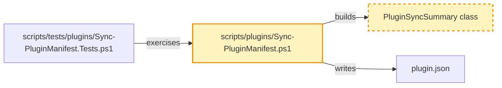

# RPI Plan Reference

## Artifact paths

Use one date and one lower-kebab-case task slug across the task's durable artifacts.

* `.copilot-tracking/research/{{YYYY-MM-DD}}/{{task_slug}}-research.md`
* `.copilot-tracking/plans/{{YYYY-MM-DD}}/{{task_slug}}-plan.md`
* `.copilot-tracking/reviews/plans/{{YYYY-MM-DD}}/{{task_slug}}-plan-critique.md`
* `.copilot-tracking/changes/{{YYYY-MM-DD}}/{{task_slug}}-changes.md`
* `.copilot-tracking/reviews/logs/{{YYYY-MM-DD}}/{{task_slug}}-review.md`

The research, changes, and review paths belong to their respective RPI stages. Planning creates or revises only the plan and critique artifact unless a justified research activation is required.

## Artifact audience and order

The plan is the user-facing source of truth, implementation handoff, and downstream checklist. A reader should understand what will change and how the work is sequenced before reaching supporting detail, so the sections appear in this order:

1. `## Task Metadata`
2. `## Executive Summary` with `### What You May Not Know`
3. `## Phase Checklist` with the overall diagram, phases, phase diagrams, and tasks
4. `## User Decisions and Requirements`
5. `## Planning Readiness and Next Step`
6. `## Goals`, `## Scope and Non-Goals`, `## Functional Requirements`, `## Non-Functional Requirements`, `## Risks and Open Questions`, `## Dependencies`, and `## Sources`, each included when it holds content
7. `## Critique Disposition`, `## Artifact Self-Check`, `## Follow-Up Items`, and `## Handoff`

Keep each fact in one canonical section; summary prose projects current state without creating another decision authority. Each task's `Requirements:` block is the checkable record for that task: it cites `FR-nnn` and `NFR-nnn` identifiers and adds binding conditions rather than restating the requirement catalog. Open decisions, risks, and questions live in `## User Decisions and Requirements` and `## Risks and Open Questions` with the affected `Pxx-Txx` named, not in per-task status blocks.

## Formatting conventions

The plan is read by people in an editor as well as by agents, so it uses ordinary Markdown navigation aids:

* Wrap code, commands, symbols, option names, and identifiers in backticks: `npm run lint:ps`, `New-PluginFixture`, `--json`.
* Link an existing file or folder with the workspace-relative path as the link text and a path relative to the plan file as the destination. From `.copilot-tracking/plans/{{YYYY-MM-DD}}/`, a repository file is three levels up and a sibling tracking artifact is two levels up:

  ```markdown
  * [scripts/tests/plugins/Sync-PluginManifest.Tests.ps1](../../../scripts/tests/plugins/Sync-PluginManifest.Tests.ps1): fixture and validation-test patterns
  * [.copilot-tracking/research/{{YYYY-MM-DD}}/{{task_slug}}-research.md](../../research/{{YYYY-MM-DD}}/{{task_slug}}-research.md):
    * Q2 under `## Findings` established the tracking responsibility boundary.
  ```

* Keep a path that does not exist yet in backticks rather than a link, and convert it to a link once the file exists.
* Do not use `#file:` directives or line-number references in the plan.

These conventions apply to the plan and to the changes record that `rpi-implement` maintains. Research, critique, and review records follow their own skills.

## Identity and markers

Use one stable task ID throughout the artifact set. Use `Pxx` for phase IDs and `Pxx-Txx` for task IDs. Put each marker immediately before its matching heading:

```markdown
<!-- rpi:phase id=P01 -->
### [ ] P01: Establish the change

<!-- rpi:task id=P01-T01 -->
#### [ ] P01-T01: Update the primary artifact
```

Do not use line numbers, line ranges, detail-line verification, or separate legacy log artifacts. Navigate by task ID, marker, and heading.

Use one stable overall task ID. Keep current `Pxx` and `Pxx-Txx` markers for navigation. During planning, the parent may add, update, delete, reorder, split, merge, or replace phases and tasks, and may renumber current IDs so the plan stays coherent. Remove obsolete active content rather than preserving it for identifier history.

## User decisions and requirements

The plan's `## User Decisions and Requirements` section has two distinct records. Confirmed User Direction is a concise freeform list of current user intent from prompts, user-pointed documents, tasks, issues, prior research, and accepted decisions. Planning Decisions and Feedback holds unresolved, proposed, deferred, and resolved material choices grouped by dependency and decision context. Each row records group, status, owner, rationale or requested input, evidence, and impact.

The planner synthesizes confirmed direction and current evidence into separate top-level `## Goals`, `## Scope and Non-Goals`, `## Functional Requirements`, and `## Non-Functional Requirements` sections after `## Phase Checklist`. Number functional requirements `FR-nnn` and non-functional requirements `NFR-nnn` so tasks can cite them. Each task's `Requirements:` block connects those requirements to planned work without duplicating confirmed direction or unresolved decision rows. Move a resolved user-owned choice into Confirmed User Direction and update or close its decision row.

When the user makes a clear change, update the list and every affected plan section directly without asking a redundant question. Reconcile the executive summary, phases, task markers, Goals, Requirements, Details, References, Dependencies, diagrams, critique inputs, and follow-up items after the update. Do not silently weaken or contradict a confirmed requirement.

When a decision-critical change remains unclear, apply the Planning Decision Walkthrough below. The question tool collects a choice; its evidence and explanation remain in the conversation and plan.

## Planning decision walkthrough

Resolve decision participation before presenting unresolved material planning decisions.

| Mode                                         | Decision owner | Behavior                                                                                                                                                  |
|----------------------------------------------|----------------|-----------------------------------------------------------------------------------------------------------------------------------------------------------|
| Standalone or manual RPI                     | User           | Walk through unresolved material decision groups and persist each answer before continuing.                                                               |
| Automatic RPI Agent, default                 | Agent          | Resolve supported ordinary planning decisions and critique dispositions; stop on an unsupported material choice rather than asking or guessing.           |
| Automatic RPI Agent, user-retained           | User           | Keep the session automatic, pause Plan for focused decision groups, then resume automatic progression after required answers and planning gates complete. |
| Parent-owned orchestration such as RPI Quick | Parent         | Follow the parent-provided decision-participation and continuation contract.                                                                              |

Build groups from unresolved rows in Planning Decisions and Feedback. Order them by dependency, blocker status, and effect on Planning Readiness. A group contains one decision by default. Combine decisions only when they share the same choice, evidence, and consequences or when answering one independently would be misleading.

For each `user-owned` or `user-retained` group:

1. Persist the pending group and its evidence before conversation.
2. Present the plan and supporting research, source, or code as Markdown links. Explain the decision, why it matters now, viable choices and consequences, evidence-backed recommendation when available, uncertainty, and readiness effect in plain language.
3. Add a compact Mermaid diagram in conversation only when architecture, dependency, sequence, or a trade-off would otherwise be difficult to understand. The diagram supplements accessible prose.
4. Call `vscode_askQuestions` when available with one concise question per decision and fixed options plus freeform input when useful. When unavailable, ask the same question in chat and wait.
5. Persist the answer, provenance, affected requirements and phases, and readiness effect before presenting the next group.

When no unresolved material decision exists, record that no walkthrough is required and do not ask for acknowledgment. In `agent-owned` mode, apply the same group ordering internally, select only evidence-supported options, and persist each rationale. Missing decision-critical evidence produces Not ready or Blocked with the smallest evidence needed.

## Planning opening and material updates

Before substantive phase drafting or delegation, create or revise the plan, then persist canonical planning state in the sections that own it. Record task identity, interpreted planning goal, user decisions and requirements, planning delegation and provenance, goals, scope and non-goals, initial evidence and readiness assessment, active boundaries, unresolved decisions or blockers, and the resolved plan path. This persistence gives the opening and later updates a durable planning basis.

After that persistence, send one concise canonical `RPI Plan` opening using this shape:

```markdown
## 🧭 RPI Plan: [Task or topic] | [Readiness or planning focus]

[Interpreted planning goal.]

* Starting evidence and readiness: [current basis and readiness state]
* Initial phase direction: [first outcome or plan section to define]
* Active boundaries: [scope, non-goals, constraints, or critique boundary]
* Current decision state: [settled decisions, proposals, or unresolved items]
* Planning delegation: [adaptive, never, or always with provenance]
* Current blockers: [active blockers]
* Relevant links: [Markdown links when available]

These are the starting planning state and may evolve only through the existing evidence, critique, caller-direction, and planning-update rules.
```

Omit Current blockers when none are active. Omit Relevant links when no valid link is available. Do not invent state, links, or planning certainty.

Before each potential continual update, persist the item in the canonical plan or critique disposition section that owns it. Chat is a concise projection of that state, not a second history or delivery audit. A continual update is warranted only when the item changes phase direction, a current decision or readiness state, a material result or artifact state, a blocker or decision need, validation state where applicable, handoff, or the user's likely understanding. Suppress low-level actions, routine tool calls, raw subagent returns, unchanged state, and minor rows or edits.

Use this compact shape when a message is warranted:

```markdown
### [Marker when useful] [Planning state]: [Short item]

Basis: [compact evidence, critique, or decision context and relevant Markdown links]

Planning consequence: [effect on goals, scope, requirements, phases, readiness, or unresolved work]

Next planning action: [next draft, revision, critique, decision request, handoff, or stop]
```

Use `✅` only for an evidence-backed settled decision or achieved readiness, `⚠️` for a proposal, unresolved item, critique concern, or revision need, and `⛔` for a blocker. Preserve factual uncertainty and identify proposals and unresolved items as such rather than presenting them as settled decisions. The pre-question decision-context requirement remains separate: provide it before a focused decision question, not before every tool call.

## Implementation-time updates and follow-up items

When `rpi-implement` updates the plan during implementation, update Confirmed User Direction and affected sections when the change affects current confirmed intent. Record unresolved choices in Planning Decisions and Feedback. Reconcile updated Goals, Requirements, Details, References, markers, dependencies, diagrams, and the executive summary. Remove superseded active content rather than retaining plan-state history. A significant or divergent discovery may require a user decision and plan update before affected work resumes, but the task's critique is not repeated.

Implementation may also add a `Guidance:` block to a later task. It belongs immediately after that task's `Details:` and names something earlier work created that the later task needs and the plan did not already call out, such as a class, API, contract, helper, fixture, or path. Keep it short and concrete:

```markdown
Guidance:
* Consider using the contracts added under `scripts/plugins/contracts/`.
* `Get-PluginSyncSummary` in `scripts/plugins/Sync-PluginManifest.ps1` already builds the summary object; extend it rather than adding a second builder.
```

Persist any user answer that informed an implementation-time update in the freeform list and affected synthesized sections.

Every plan includes `## Follow-Up Items` immediately before `## Handoff`. Initialize it with `* None`. For each newly discovered item that is not immediately related to the approved plan, record the item, why it is outside immediate scope, and its owner or next action. Follow-up items are review-visible but do not become active `Pxx` or `Pxx-Txx` work, completion evidence, or acceptance claims without later planning.

## Executive summary

Every plan checklist includes a user-facing `## Executive Summary` immediately after `## Task Metadata`. It gives readers a useful overview before decisions, readiness, requirements, and phases.

Include these elements when evidence supports them:

* Explain, in approachable language, what the plan will implement and why the outcome matters.
* Include a `### What You May Not Know` subsection for important context, dependencies, risks, or constraints that a user might otherwise miss.
* State planning execution status, readiness, confidence, and residual uncertainty in plain language. Keep detailed decisions, blockers, and next actions in their canonical sections.

Keep summary claims synchronized with the evidence and the detailed plan. Do not invent claims, decisions, resources, risks, or links. Link to same-plan sections when navigation helps, and add an authoritative external explanatory link only when supplied evidence supports it and it materially improves comprehension. Follow the Formatting conventions above for paths, code, and commands.

Use readable Markdown selectively: concise paragraphs and lists for structure, bold for essential reader attention, and italics when introducing a term. Plain Markdown has no underline syntax. Use renderer-specific underline only when the generated tracking artifact's renderer is known to support it and the emphasis is essential; pair it with a plain-Markdown fallback, preferably bold. Do not use underline as decoration or repeat it for routine emphasis.

Update the executive summary after every material plan change, including critique-driven revisions, user decisions or their consequences, goals, scope, phases, dependencies, requirements, risks, and readiness. Before critique handoff and finalization, reconcile the summary with confirmed direction, decision rows, synthesized sections, and Planning Readiness and Next Step. Summary synchronization is a readiness condition.

## Research readiness

Read and understand the supplied research before deciding whether to activate `rpi-research`. Additional research is justified only when at least one condition holds:

* Evidence does not cover a requirement, acceptance criterion, dependency, or material risk needed for planning.
* The task's complexity or uncertainty makes a plan speculative.
* A decision-critical choice has multiple plausible outcomes without credible supporting evidence.

When none apply, plan from the supplied evidence. When one applies, ask `rpi-research` for the smallest evidence set that closes the gap, then resume planning.

## Overall planning and bounded assignments

The planning parent owns Confirmed User Direction, Planning Decisions and Feedback, phase and task blocks, diagrams, phase order, dependencies, follow-up items, critique disposition, the complete plan, and finalization. It may activate planning skills or dispatch subagents selected from their available stable names and descriptions for bounded planning assignments.

Select a skill or subagent only when its stable name contains `plan` or `planning`, or its description explicitly says it is used during planning, and its description fits the bounded assignment. Exclude `rpi-plan`, `rpi-plan-critique`, and other RPI lifecycle phase entrypoints. Activate selected skills as scoped guidance. When delegated work has no suitable planning subagent, dispatch an unnamed general-purpose subagent with the agent selection omitted.

Resolve one planning delegation mode from caller or conversation direction and record its provenance:

| Mode       | Behavior                                                                                                                                                                                                  |
|------------|-----------------------------------------------------------------------------------------------------------------------------------------------------------------------------------------------------------|
| `adaptive` | Default. Prefer subagents when phases are large enough to benefit from isolated context and are relatively independent. Keep small or tightly related phases in the parent.                               |
| `never`    | Do not dispatch planning subagents. The parent plans every phase directly.                                                                                                                                |
| `always`   | Dispatch every phase as a bounded assignment. Run related or dependent phases sequentially and independent, write-disjoint phases in parallel. Stop if dispatch is unavailable instead of working inline. |

Every planning-worker dispatch contains:

* Exact plan path and assigned `Pxx` section
* Relevant user decisions and requirements, caller requirements, and supplied evidence pointers
* A bounded assignment to define or refine the phase's Goals and Dependencies and each task's Goals, Requirements, Details, References, or Dependencies, using the Phase and task blocks and Formatting conventions in this reference
* An explicit write boundary limited to the assigned phase
* An expected return that states findings, proposed or completed changes within the boundary, assumptions, unresolved items, and evidence
* A prohibition on production source edits, implementation, Review, overall-plan decisions, nested delegation, and writes outside the assigned plan section

Independent, write-disjoint assignments may run in parallel. Related or dependent assignments run sequentially. The worker does not perform unbounded research, implement production changes, critique the full plan, or redesign the overall plan. The primary planner evaluates every return and decides whether to add, update, delete, reorder, split, merge, or replace current plan content. A subagent return does not automatically become plan content.

## Independent critique

Activate `rpi-plan-critique` at most once, only when the primary planner judges the plan to be implementation-ready. Do not critique an initial draft merely because it exists.

Select one critique depth and record its provenance before dispatch:

| Depth      | Selection rule                           | Assessment behavior                                                                                                                                                                                                   |
|------------|------------------------------------------|-----------------------------------------------------------------------------------------------------------------------------------------------------------------------------------------------------------------------|
| `standard` | Default                                  | Assess the complete material supplied boundary as quickly as evidence permits, returning every evidence-supported implementation blocker and credibility gap without restatement, cosmetics, or low-impact expansion. |
| `deep`     | Explicit user request to critique deeply | Trace the supplied evidence more broadly, stress-test alternatives and boundaries, and include substantive lower-severity concerns. It remains one invocation and performs no open-ended research.                    |

Do not infer deep mode from plan size, complexity, uncertainty, or risk. Standard optimizes prioritization and output for minimal elapsed work without reducing complete coverage of actionable material concerns in the supplied boundary.

Before dispatch, inspect the plan's Critique Disposition, parent state when present, and the critique path. A `started`, `Complete`, `Partial`, or `Blocked` execution record or existing critique artifact consumes the task's single invocation. On resume, reconcile existing evidence instead of dispatching a replacement. Persist `started`, candidate identity, selected depth and provenance, and output path immediately before dispatch; do not dispatch if that write fails.

Lock applicable test ownership, exact removals or `none`, maximum additions, canonical and generated targets, semantic-versus-regression coverage, and validation evidence. Dispatch one fresh generic critique worker with selected depth, exact task context, confirmed direction, resolved planning decisions, caller requirements, research, evidence, dependencies, task Requirements, plan path, and one critique output path. The critique worker reads the plan and directly relevant supplied evidence, writes only the critique artifact, and returns one complete actionable finding set.

The critique is a one-time internal readiness gate. Its verdict returns to the planning parent, which owns revision, decision requests, and finalization. It is not a peer lifecycle transition and does not cause a standalone user to invoke another stage.

Record the latest critique findings and their dispositions in the plan's standalone top-level `## Critique Disposition` section. Use the critique verdict to select the smallest next action:

* Revise the plan directly for localized evidence-backed corrections, applying all planner-owned findings in one coherent batch.
* Dispatch a phase-matched planning subagent, or an unnamed general-purpose subagent with the planning restrictions above, when deeper planning work is needed.
* Preserve confirmed user requests and answers when critique advice conflicts with them. Reject conflicting advice without re-asking when current user direction already resolves it.
* Route a significant or divergent finding not resolved by current user direction through the current Planning Decision Walkthrough when it affects requirements, scope, architecture, dependencies, or evidence boundary.
* Close every `PC-xxx` with its declared owner, disposition, and exact resolving evidence, then finalize without a retry or closure critique.
* Finalize after direct corrections and required user decisions are resolved and any accepted residual risk is explicitly recorded.

Any returned execution status consumes the invocation. Partial or Blocked critique evidence remains terminal for the gate. If its missing evidence or open findings cannot be resolved by the planning parent, stop Plan with the exact blocker rather than dispatching again.

## Phase and task blocks

Each phase and task is a heading followed by labeled blocks. A label is a plain line ending in a colon, followed directly by its bullet list. This keeps the plan scannable and gives implementation a predictable place to read and update.

A phase has these blocks, then its diagram, then its tasks:

* `Goals:` states the coherent behavior, capability, or future state the phase establishes and why it matters. It aligns the tasks without dictating their implementation sequence.
* `Dependencies:` names prerequisite phases or external conditions, or `None`.

A task has these blocks in this order:

* `Goals:` states the observable behavior, capability, or state the task establishes. Write the outcome, not the steps.
* `Requirements:` is the checkable record for the task. Cite the `FR-nnn`, `NFR-nnn`, PRD, BRD, or ADR identifiers the task satisfies when they exist, then list the binding conditions that must hold when the task is done. When a shape is contractual, such as a JSON summary, an API signature, or a schema, put it in a fenced code block here and state that it is a contract.
* `Details:` gives the implementer evidence-backed context: what exists today and what it lacks, the approach the evidence supports, boundaries to respect, what to avoid and why, tests to add or remove, repository-owned checks worth running such as `npm run test:ps -- -TestPath <path>`, and where to follow existing patterns. State a supported assumption here when the implementer may resolve it locally. Leave room for judgment; do not script keystrokes or prescribe how to verify.
* `Guidance:` is optional and usually added by implementation. See Implementation-time updates and follow-up items.
* `References:` links the files, folders, and tracking artifacts the implementer needs, each with a short reason. Point into research or prior decisions with a nested bullet that names the section and item, such as `Q2 under ## Findings`.
* `Dependencies:` names prerequisite tasks or `None`.

A task does not carry acceptance, validation, completion, or unresolved-item blocks. Completion is the `[x]` marker plus the changes record. An open decision goes in Planning Decisions and Feedback and a risk or question goes in Risks and Open Questions, each naming the affected `Pxx-Txx`.

Treat examples and illustrative code as guidance unless a requirement or interface contract makes them binding, and say which applies.

## Phase Checklist diagrams

Once the phases are stable and before critique dispatch, add Mermaid diagrams so a reader can see the shape of the change without reading every task.

The overall diagram sits directly under the `## Phase Checklist` heading, before the first phase. It shows the components, files, contracts, tests, or behaviors the plan changes and how they relate through calls, data flow, or dependencies. Give every node a short stable ID and a readable label. Mark nodes that do not exist yet with a dashed `classDef` so new work is distinguishable from modified work. Include only nodes that help the user understand the change; a complex plan produces a complex diagram, and that is acceptable, but do not list every file.

Each phase diagram sits after the phase's `Dependencies:` block and before its first task. Copy the overall diagram's nodes and edges, apply a highlight `classDef` to the nodes the phase changes, and leave the rest unstyled so the reader can locate the phase within the whole. When the overall diagram is large, drop nodes that are far from the phase but keep the immediate neighbors. Reuse the overall diagram's node IDs exactly.



Keep the diagrams current when phases or tasks are added, merged, split, or removed during planning or implementation.

## Planning conversation and closeout

Use the planning opening and material-update protocol above during planning work. Use the Planning Decision Walkthrough for material choices and critique findings. Keep automatic agent-owned decisions free of routine prompts and keep user-retained automatic sessions automatic while awaiting a decision group.

At closeout, report planning execution status separately from readiness or decision state. Include results, important updates, decisions, and blockers or open items. Advise `/compact` only when stale tool output, superseded reasoning, or completed-stage detail outweighs useful context and the durable plan and critique artifact are current. When advising it, name the state and artifact pointers to retain. Otherwise omit compaction guidance.

For a standalone, implementation-ready plan, report planning execution status and readiness separately, then identify the latest critique disposition and current implementation context: plan, latest critique, relevant research, and the changes record's role as implementation evidence. Advise `/rpi-implement` without invoking it. Do not ask the user to attach artifacts.

If the plan is not ready, state the stop or no-handoff reason. In `rpi-quick` or confirmed automatic RPI Agent mode, return that same context to the parent and state that it continues automatically when the gate and confirmation conditions are met. Do not give the parent attachment instructions.

For every relevant existing artifact, use the two-cell row `| [actual/workspace-relative/path.ext](actual/workspace-relative/path.ext) | Short description |`, using that artifact's actual workspace-relative path as both link text and destination; omit unavailable files and render the table immediately before the final `## Next Steps` section. End with `## Next Steps`: state the exact eligible user command, active-parent action, blocker-clearing action, or that no user action is required. When compaction is warranted, tell the user to run `/compact` before the next RPI command; otherwise omit compaction guidance.

## Final planning handoff

The final plan identifies the implementation handoff with task IDs, markers, task-local context, and artifact paths. Its Planning Readiness and Next Step record identifies the plan, latest critique, relevant research, downstream changes-record role, decision participation, delegation mode, blockers, gates, and continuation. A standalone planning response advises `/rpi-implement` only when the plan is ready. The parent continues instead in `rpi-quick` or confirmed automatic RPI Agent mode. It does not create a separate details or legacy log artifact or require a line-based verification pass.
