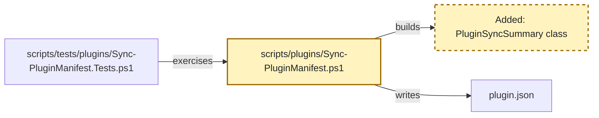

# RPI Plan Reference

## Artifact paths

Use one date and one lower-kebab-case task slug across the task's durable artifacts.

* `.copilot-tracking/research/{{YYYY-MM-DD}}/{{task_slug}}-research.md`
* `.copilot-tracking/plans/{{YYYY-MM-DD}}/{{task_slug}}-plan.md`
* `.copilot-tracking/reviews/plans/{{YYYY-MM-DD}}/{{task_slug}}-plan-critique.md`
* `.copilot-tracking/changes/{{YYYY-MM-DD}}/{{task_slug}}-changes.md`
* `.copilot-tracking/reviews/logs/{{YYYY-MM-DD}}/{{task_slug}}-review.md`

The research, changes, and review paths belong to their respective RPI stages. Planning creates or revises only the plan and critique artifact unless a justified research activation is required.

## Artifact audience and order

The plan is the user-facing source of truth, implementation handoff, and downstream checklist. A reader should understand what will change and how the work is sequenced before reaching supporting detail, so the sections appear in this order:

1. `## Task Metadata`
2. `## Executive Summary` with `### What You May Not Know`
3. `## Phase Checklist` with Before and After overall diagrams, phases, phase diagrams, and tasks
4. `## User Decisions and Requirements`
5. `## Planning Readiness and Next Step`
6. `## Goals`, `## Scope and Non-Goals`, `## Functional Requirements`, `## Non-Functional Requirements`, `## Risks and Open Questions`, `## Dependencies`, and `## Sources`, each included when it holds content
7. `## Critique Disposition`, `## Artifact Self-Check`, `## Follow-Up Items`, and `## Handoff`

Keep each fact in one canonical section; summary prose projects current state without creating another decision authority. Each task's `Requirements:` block is the checkable record for that task: it cites `FR-nnn` and `NFR-nnn` identifiers and adds binding conditions rather than restating the requirement catalog. Open decisions, risks, and questions live in `## User Decisions and Requirements` and `## Risks and Open Questions` with the affected `Pxx-Txx` named, not in per-task status blocks.

## Formatting conventions

The plan is read by people in an editor as well as by agents, so it uses ordinary Markdown navigation aids:

* Wrap code, commands, symbols, option names, and identifiers in backticks: `npm run lint:ps`, `New-PluginFixture`, `--json`.
* Link an existing file or folder with the workspace-relative path as the link text and a path relative to the plan file as the destination. From `.copilot-tracking/plans/{{YYYY-MM-DD}}/`, a repository file is three levels up and a sibling tracking artifact is two levels up:

  ```markdown
  * [scripts/tests/plugins/Sync-PluginManifest.Tests.ps1](../../../scripts/tests/plugins/Sync-PluginManifest.Tests.ps1): fixture and validation-test patterns
  * [.copilot-tracking/research/{{YYYY-MM-DD}}/{{task_slug}}-research.md](../../research/{{YYYY-MM-DD}}/{{task_slug}}-research.md):
    * Q2 under `## Findings` established the tracking responsibility boundary.
  ```

* Keep a path that does not exist yet in backticks rather than a link, and convert it to a link once the file exists.
* Do not use `#file:` directives or line-number references in the plan.

These conventions apply to the plan and to the changes record that `rpi-implement` maintains. Research, critique, and review records follow their own skills.

## Identity and markers

Use one stable task ID throughout the artifact set. Use `Pxx` for phase IDs and `Pxx-Txx` for task IDs. Put each marker immediately before its matching heading:

```markdown
<!-- rpi:phase id=P01 -->
### [ ] P01: Establish the change

<!-- rpi:task id=P01-T01 -->
#### [ ] P01-T01: Update the primary artifact
```

Do not use line numbers, line ranges, detail-line verification, or separate legacy log artifacts. Navigate by task ID, marker, and heading.

Use one stable overall task ID. Keep current `Pxx` and `Pxx-Txx` markers for navigation. During planning, the parent may add, update, delete, reorder, split, merge, or replace phases and tasks, and may renumber current IDs so the plan stays coherent. Remove obsolete active content rather than preserving it for identifier history.

## User decisions and requirements

The plan's `## User Decisions and Requirements` section has two distinct records. Confirmed User Direction is a concise freeform list of current user intent from prompts, user-pointed documents, tasks, issues, prior research, and accepted decisions. Planning Decisions and Feedback holds unresolved, proposed, deferred, and resolved material choices grouped by dependency and decision context. Each row records group, status, owner, rationale or requested input, evidence, and impact.

The planner synthesizes confirmed direction and current evidence into separate top-level `## Goals`, `## Scope and Non-Goals`, `## Functional Requirements`, and `## Non-Functional Requirements` sections after `## Phase Checklist`. Number functional requirements `FR-nnn` and non-functional requirements `NFR-nnn` so tasks can cite them. Each task's `Requirements:` block connects those requirements to planned work without duplicating confirmed direction or unresolved decision rows. Move a resolved user-owned choice into Confirmed User Direction and update or close its decision row.

When the user makes a clear change, update the list and every affected plan section directly without asking a redundant question. Reconcile the executive summary, phases, task markers, Goals, Requirements, Details, References, Dependencies, diagrams, critique inputs, and follow-up items after the update. Do not silently weaken or contradict a confirmed requirement.

When a decision-critical change remains unclear, apply the Planning Decision Walkthrough below. The question tool collects a choice; its evidence and explanation remain in the conversation and plan.

## Planning decision walkthrough

Resolve decision participation before presenting unresolved material planning decisions.

| Mode                               | Decision owner | Behavior                                                                                                                                                  |
|------------------------------------|----------------|-----------------------------------------------------------------------------------------------------------------------------------------------------------|
| Standalone or manual RPI           | User           | Walk through unresolved material decision groups and persist each answer before continuing.                                                               |
| Automatic RPI Agent, default       | Agent          | Resolve supported ordinary planning decisions and critique dispositions; stop on an unsupported material choice rather than asking or guessing.           |
| Automatic RPI Agent, user-retained | User           | Keep the session automatic, pause Plan for focused decision groups, then resume automatic progression after required answers and planning gates complete. |

Build groups from unresolved rows in Planning Decisions and Feedback. Order them by dependency, blocker status, and effect on Planning Readiness. A group contains one decision by default. Combine decisions only when they share the same choice, evidence, and consequences or when answering one independently would be misleading.

For each `user-owned` or `user-retained` group:

1. Persist the pending group and its evidence before conversation.
2. Present the plan and supporting research, source, or code as Markdown links. Explain the decision, why it matters now, viable choices and consequences, evidence-backed recommendation when available, uncertainty, and readiness effect in plain language.
3. Add a compact Mermaid diagram in conversation only when architecture, dependency, sequence, or a trade-off would otherwise be difficult to understand. The diagram supplements accessible prose.
4. Call `vscode_askQuestions` when available with one concise question per decision and fixed options plus freeform input when useful. When unavailable, ask the same question in chat and wait.
5. Persist the answer, provenance, affected requirements and phases, and readiness effect before presenting the next group.

When no unresolved material decision exists, record that no walkthrough is required and do not ask for acknowledgment. In `agent-owned` mode, apply the same group ordering internally, select only evidence-supported options, and persist each rationale. Missing decision-critical evidence produces Not ready or Blocked with the smallest evidence needed.

## Planning opening and material updates

Before substantive phase drafting, create or revise the plan, then persist canonical planning state in the sections that own it. Record task identity, interpreted planning goal, user decisions and requirements, goals, scope and non-goals, initial evidence and readiness assessment, active boundaries, unresolved decisions or blockers, and the resolved plan path. This persistence gives the opening and later updates a durable planning basis.

After that persistence, send one concise canonical `RPI Plan` opening using this shape:

```markdown
## 🧭 RPI Plan: [Task or topic] | [Readiness or planning focus]

[Interpreted planning goal.]

* Starting evidence and readiness: [current basis and readiness state]
* Initial phase direction: [first outcome or plan section to define]
* Active boundaries: [scope, non-goals, constraints, or critique boundary]
* Current decision state: [settled decisions, proposals, or unresolved items]
* Current blockers: [active blockers]
* Relevant links: [Markdown links when available]

These are the starting planning state and may evolve only through the existing evidence, critique, caller-direction, and planning-update rules.
```

Omit Current blockers when none are active. Omit Relevant links when no valid link is available. Do not invent state, links, or planning certainty.

Before each potential continual update, persist the item in the canonical plan or critique disposition section that owns it. Chat is a concise projection of that state, not a second history or delivery audit. A continual update is warranted only when the item changes phase direction, a current decision or readiness state, a material result or artifact state, a blocker or decision need, validation state where applicable, handoff, or the user's likely understanding. Suppress low-level actions, routine tool calls, raw extension returns, unchanged state, and minor rows or edits.

Use this compact shape when a message is warranted:

```markdown
### [Marker when useful] [Planning state]: [Short item]

Basis: [compact evidence, critique, or decision context and relevant Markdown links]

Planning consequence: [effect on goals, scope, requirements, phases, readiness, or unresolved work]

Next planning action: [next draft, revision, critique, decision request, handoff, or stop]
```

Use `✅` only for an evidence-backed settled decision or achieved readiness, `⚠️` for a proposal, unresolved item, critique concern, or revision need, and `⛔` for a blocker. Preserve factual uncertainty and identify proposals and unresolved items as such rather than presenting them as settled decisions. The pre-question decision-context requirement remains separate: provide it before a focused decision question, not before every tool call.

## Implementation-time updates and follow-up items

When `rpi-implement` updates the plan during implementation, update Confirmed User Direction and affected sections when the change affects current confirmed intent. Record unresolved choices in Planning Decisions and Feedback. Reconcile updated Goals, Requirements, Details, References, markers, dependencies, diagrams, and the executive summary. Remove superseded active content rather than retaining plan-state history. Checklist status and task-local `Guidance:` pointers are implementation annotations, not changes to the assessed candidate. A change to any assessed content, including requirements, scope, architecture, capability, safety, dependencies, evidence, or task wording, returns to planning for revision-bound closure before affected work resumes; a significant or divergent choice also needs the appropriate user decision. Never replay the old candidate's critique.

Implementation may also add a `Guidance:` block to a later task. It belongs immediately after that task's `Details:` and names something earlier work created that the later task needs and the plan did not already call out, such as a class, API, contract, utility, fixture, or path. Keep it short and concrete:

```markdown
Guidance:
* Consider using the contracts added under `scripts/plugins/contracts/`.
* `Get-PluginSyncSummary` in `scripts/plugins/Sync-PluginManifest.ps1` already builds the summary object; extend it rather than adding a second builder.
```

Persist any user answer that informed an implementation-time update in the freeform list and affected synthesized sections.

Every plan includes `## Follow-Up Items` immediately before `## Handoff`. Initialize it with `* None`. For each newly discovered item that is not immediately related to the approved plan, record the item, why it is outside immediate scope, and its owner or next action. Follow-up items are review-visible but do not become active `Pxx` or `Pxx-Txx` work, completion evidence, or acceptance claims without later planning.

## Executive summary

Every plan checklist includes a user-facing `## Executive Summary` immediately after `## Task Metadata`. It gives readers a useful overview before decisions, readiness, requirements, and phases.

Include these elements when evidence supports them:

* Explain, in approachable language, what the plan will implement and why the outcome matters.
* Include a `### What You May Not Know` subsection for important context, dependencies, risks, or constraints that a user might otherwise miss.
* State planning execution status, readiness, confidence, and residual uncertainty in plain language. Keep detailed decisions, blockers, and next actions in their canonical sections.

Keep summary claims synchronized with the evidence and the detailed plan. Do not invent claims, decisions, resources, risks, or links. Link to same-plan sections when navigation helps, and add an authoritative external explanatory link only when supplied evidence supports it and it materially improves comprehension. Follow the Formatting conventions above for paths, code, and commands.

Use readable Markdown selectively: concise paragraphs and lists for structure, bold for essential reader attention, and italics when introducing a term. Plain Markdown has no underline syntax. Use renderer-specific underline only when the generated tracking artifact's renderer is known to support it and the emphasis is essential; pair it with a plain-Markdown fallback, preferably bold. Do not use underline as decoration or repeat it for routine emphasis.

Update the executive summary after every material plan change, including critique-driven revisions, user decisions or their consequences, goals, scope, phases, dependencies, requirements, risks, and readiness. Before critique handoff and finalization, reconcile the summary with confirmed direction, decision rows, synthesized sections, and Planning Readiness and Next Step. Summary synchronization is a readiness condition.

## Research readiness

Read and understand the supplied research before deciding whether to activate `rpi-research`. Additional research is justified only when at least one condition holds:

* Evidence does not cover a requirement, acceptance criterion, dependency, or material risk needed for planning.
* The task's complexity or uncertainty makes a plan speculative.
* A decision-critical choice has multiple plausible outcomes without credible supporting evidence.

When none apply, plan from the supplied evidence. When one applies, ask `rpi-research` for the smallest evidence set that closes the gap, then resume planning.

## Overall planning and planning extensions

The primary planner owns Confirmed User Direction, Planning Decisions and Feedback, phase and task blocks, diagrams, phase order, dependencies, follow-up items, critique disposition, the complete plan, and finalization. It drafts every phase itself.

Skills and subagents whose descriptions say they are used during planning or with `rpi-plan` extend the planner. Read each description and follow its guidance on when and how to use it; the description is the contract. Exclude `rpi-plan`, `rpi-plan-critique`, and other RPI lifecycle phase entrypoints. An extension adds evidence, conventions, or proposals; verify what it returns against the evidence and write the plan yourself.

## Independent critique

Activate `rpi-plan-critique` only when the primary planner judges the plan implementation-ready. Allow one initial invocation and one explicitly confirmed interruption recovery. After both reservations are consumed without an assessment, only Infrastructure failure recovery may authorize further assessment of that candidate. A substantive assessment cannot be replayed for an unchanged candidate; necessary corrections follow Revision-bound closure below. Verified failures of a closure invocation may use only the remaining shared infrastructure-retry allowance, never a reset budget. Do not critique an initial draft merely because it exists.

Select one critique depth and record its provenance before the critique runs:

| Depth      | Selection rule                           | Assessment behavior                                                                                                                                                                                                   |
|------------|------------------------------------------|-----------------------------------------------------------------------------------------------------------------------------------------------------------------------------------------------------------------------|
| `standard` | Default                                  | Assess the complete material supplied boundary as quickly as evidence permits, returning every evidence-supported implementation blocker and credibility gap without restatement, cosmetics, or low-impact expansion. |
| `deep`     | Explicit user request to critique deeply | Trace the supplied evidence more broadly, stress-test alternatives and boundaries, and include substantive lower-severity concerns. It remains one invocation and performs no open-ended research.                    |

Do not infer deep mode from plan size, complexity, uncertainty, or risk. Standard optimizes prioritization and output for minimal elapsed work without reducing complete coverage of actionable material concerns in the supplied boundary.

Before the critique runs, inspect Critique Disposition, parent state when present, and every recorded critique path for this task. A substantive `Complete`, `Partial`, or `Blocked` assessment recorded in any trusted artifact or critique return consumes the assessment gate, even if its file is missing. An earlier `started` reservation consumes its attempt slot, not evidence of Pass. Reconcile it through the recovery contracts below rather than replaying a saved reservation.

Keep invocation outcome separate from assessment execution and verdict. Record infrastructure failure as invocation outcome `infrastructure-failed`, assessment `not-produced`, verdict `unavailable` only after the positive checks below. Missing or ambiguous evidence is `unknown`, not a failed assessment or Pass. A preflight dependency limitation is not a substantive assessment, but does not by itself qualify as infrastructure failure. A substantive Partial or Blocked assessment, refusal, or missing plan evidence is not an infrastructure retry opportunity.

### Reservation and current-run ownership

Keep append-only attempt records in the plan's Critique Disposition. Each records task identity, unique attempt ID, kind (`initial`, `revision-closure`, `recovery`, `infrastructure-retry`, or `human`), candidate revision and saved-content hash boundary, depth and provenance, output path, invocation outcome, assessment execution/availability, verdict, run provenance and authorization.
Append reconciliation evidence, failure classification, ended-run proof and findings without deleting earlier observations. When parent state exists, mirror original and current pointers and budget use in its single `Planning critique execution` entry; do not add top-level schema fields or replace original provenance.

Before reserving, verify the candidate and evidence at exact absolute paths under the resolved workspace. Hash the saved plan's assessed content before adding reservation metadata. Exclude the full `## Critique Disposition`, `## Artifact Self-Check`, `## Planning Readiness and Next Step`, `## Follow-Up Items` and `## Handoff` sections. Within `## Phase Checklist`, normalize only the `[ ]`/`[x]` status of marked `Pxx` and `Pxx-Txx` headings, and exclude only task-local `Guidance:` blocks used for implementation pointers. Record this exact projection and hash boundary for every attempt and final comparison. A `Guidance:` block cannot change requirements, architecture, capability, safety, dependencies, test ownership, or other assessed content; put such changes in the assessed plan blocks and follow Revision-bound closure. Changes to the executive summary, requirements, phases, task wording, decisions or evidence pointers still change the hash. Persist `started` in the plan and parent state, verify the saved records, then immediately run the named attempt in the same uninterrupted planner execution. If persistence fails, do not run the critique. A saved reservation without the immediate run remains consumed on resume.

The activation gives the critique the task, attempt ID and kind, candidate identity/hash boundary, depth, plan and state paths, exact output, and current-run provenance. Use the host invocation identifier when exposed; otherwise record the uninterrupted reservation-to-activation sequence. Matching saved strings are not proof of a current run.
A critique may assess its own just-authorized initial, revision-closure, recovery or infrastructure-retry reservation once; a later caller cannot replay it. Standalone critique requires an unconsumed task and reserves its initial attempt in its output before assessing. Human assessment follows its separate commissioning contract below, not automated activation.

Supply the critique with the resolved canonical path to this reference from the active `rpi-plan` skill root. Do not derive it from the critique skill's location; selective installations need not place the two skills together. The critique reads the contract to verify its activation, not to authorize recovery. If the critique reports an unavailable reference, preserve its reservation and reconcile the dependency without rerunning the activation or switching to standalone assessment.

Lock applicable test ownership, exact removals or `none`, maximum additions, canonical and generated targets, semantic-versus-regression coverage, and validation evidence. Activate `rpi-plan-critique` once with the selected depth, exact task context, confirmed direction, resolved planning decisions, caller requirements, research, evidence, dependencies, task Requirements, plan path, and one critique output path. Assess the plan against the supplied evidence with fresh eyes rather than the drafting reasoning; running the critique in a subagent is one way to obtain that separation and is not required. The critique reads the plan and directly relevant supplied evidence, writes only the critique artifact, and returns one complete actionable finding set.

The critique is an internal readiness gate. Its verdict returns to the planning parent, which owns revision, decision requests, and finalization. It is not a peer lifecycle transition and does not cause a standalone user to invoke another stage.

Record the latest critique findings and their dispositions in the plan's standalone top-level `## Critique Disposition` section. Use the critique verdict to select the smallest next action:

* Revise the plan directly for evidence-backed corrections, applying all planner-owned findings in one coherent batch.
* Preserve confirmed user requests and answers when critique advice conflicts with them. Reject conflicting advice without re-asking when current user direction already resolves it.
* Route a significant or divergent finding not resolved by current user direction through the current Planning Decision Walkthrough when it affects requirements, scope, architecture, dependencies, or evidence boundary.
* Close every `PC-xxx` with its declared owner, disposition, and exact resolving evidence. If the correction changes the plan hash, follow Revision-bound closure before finalizing.
* Finalize after direct corrections and required user decisions are resolved, residual risk is explicitly recorded, and the delivered plan hash is covered by a Complete assessment or a valid closure chain.

Every reservation consumes its invocation slot. Substantive Partial or Blocked critique evidence is not an infrastructure-retry opportunity or permission to replay the same candidate. If actual evidence cannot establish a completed assessment and resolved findings, stop Plan with the exact blocker rather than bypassing it. Transport failure without assessment consumes an attempt, not a completed assessment, and may qualify only for the bounded recovery routes below.

### Revision-bound closure

After a substantive assessment requires a planner-owned correction or a resolved user decision, retain the original assessment, verdict, every `PC-xxx`, and its disposition. Record the saved hash of the revised plan, the exact correction delta, affected requirement IDs and the evidence that makes the revision necessary. A material change to assessed content during implementation follows the same closure path, even when it needs no new user decision. Do not invoke closure for unchanged content, cosmetic edits without a required finding, a request for a more favorable verdict, or an unresolved evidence gap. Parent state retains all attempt pointers and candidate identities.

Classify the revision before reserving a new `revision-closure` attempt with a unique ID and output path that cannot overwrite an earlier critique:

* When requirements, architecture, capability, safety or evidence boundaries changed, commission a fresh full assessment of the revised candidate and its supplied evidence. The earlier assessment remains binding for its original boundary; reconcile all earlier findings against the new result.
* When those boundaries are unchanged, commission independent targeted closure of the exact correction delta and affected requirements. Supply the immediately preceding Complete assessment and the uninterrupted chain back to a Complete full assessment, including every intermediate hash, delta, finding and disposition. The critic verifies each link, then checks that the latest delta resolves required findings without introducing a material gap elsewhere in the affected boundary. Its Complete result extends the chain to the revised hash; it does not replace or regrade earlier assessments.
* A previous Partial or Blocked substantive assessment cannot be extended by targeted closure. If a supported correction resolves its missing coverage or blocker, require a fresh full assessment of the revised candidate. An unresolved blocker stops Plan.

Persist and read back the reservation with revision kind, immediate predecessor, two adjacent hashes, delta, affected IDs and full-versus-targeted basis before immediate activation. For targeted closure, also record the root Complete full assessment and every intervening result; a fresh full assessment after Partial or Blocked has no required Complete root. Apply current-run ownership as for the initial attempt. The critic verifies the applicable boundary and writes a distinct result. Reconcile late results, any new findings and all prior dispositions before choosing another revision. Continue only while required findings remain and the recorded correction provides an evidence-backed path to progress. Repeated hashes, reverted corrections, oscillating findings or no material progress stop as Revise or Blocked with the exact clearing action; do not reset attempt history through a new session or task. If a closure invocation fails without assessment, preserve its reservation and reconcile its run status. Only Infrastructure failure recovery may authorize a distinct retry for the same revised candidate within the remaining task-wide allowance; the generic interruption recovery does not apply.

If a closure invocation is interrupted without positive host/transport failure evidence, route directly to Exhaustion and independent human assessment once every run is confirmed ended and evidence reconciliation finds no substantive result or unresolved assessment fragments for the revised candidate. This includes user cancellation, a closed window or a session timeout; none alone proves run termination or infrastructure failure. Apply the saved-file, ended-run and evidence checks from Interrupted critique recovery without reserving its generic recovery. Record the interruption, any unknown invocation outcome, the unchanged retry counts, predecessor assessments, correction delta and candidate hashes. This route requires neither infrastructure classification nor budget exhaustion and permits no automated retry of the interrupted candidate. It opens human-assessment eligibility checks, not implementation readiness or permission to author the human report.

Before finalization, compare the delivered plan's saved assessed-content hash using the same projection as the reservation with the hash covered by the latest Complete full assessment or a Complete targeted closure chain rooted in a Complete full assessment. Verify every adjacent hash link and all findings across that chain are resolved or explicitly accepted as residual risk. If hashes, coverage or dispositions cannot be reconciled, stop Plan; earlier Complete evidence for hash A does not authorize implementing hash B.

### Interrupted critique recovery

This route permits one explicitly approved recovery of an interrupted initial attempt without a substantive terminal result. It is not a gate waiver or a new critique after findings. Automatic mode, generic resume, plan approval, and approval of this policy are not task-specific recovery consent. Only the planning parent authorizes recovery; a standalone critique routes the caller to `rpi-plan` without reassessing.

1. Reconcile the original plan, state, output and available critique return or host execution record using the recorded task and paths. Search only sources that could recover this attempt's evidence. Record the result and stop repeating searches or requests for a file the user already reported unavailable unless new evidence supplies a recovery lead. Preserve all surviving content and findings. A substantive terminal assessment anywhere prohibits recovery; unresolved partial output is not discarded to obtain a new verdict.
2. Establish that the original critique run is no longer active from a host completion/cancellation record or explicit operator confirmation that the originating execution has ended. Absence of a result, elapsed time or an empty local process list alone is insufficient. If liveness remains unknown, wait for the originating execution's status or confirmation, without starting a competing run.
3. Reconcile saved-file availability before eligibility. Read the exact workspace paths from the filesystem, not only editor buffers, and parse state as one JSON object. If editor and disk disagree, stop and request saving or synchronizing the identified file, then verify its bytes. Do not overwrite conflicting content, fabricate the original assessment, or silently replace a missing candidate. A reconstructed or revised candidate needs an explicit current identity, supporting evidence and user approval; keep original pointers distinct and assess current readiness before recovery.
4. Confirm no recovery was previously reserved or executed. If it was, reconcile evidence and evaluate Infrastructure failure recovery instead; do not reserve another generic recovery. Otherwise record an eligibility summary with original attempt, evidence searched, terminal-result check, inactivity basis, reconciled candidate and uncertainty. Present it and the distinct output to the user. Ask for this recovery for this task and candidate, with decline/wait and freeform choices. Explain that assessment may have run without saving a result. Without consent leave Plan paused; missing evidence is not Pass.
5. After consent, recheck eligibility and persisted evidence before the recovery runs. Reserve one `recovery` attempt with a new ID and the same depth unless explicitly changed, and use the task's critique path with `-recovery` before `.md`. Preserve original paths and output; if that path or record exists, reconcile it instead of overwriting. Persist approval and `started` using Reservation and current-run ownership. This consumes the generic recovery even if execution or persistence is interrupted. Only its immediate current run may assess. Never reserve another generic recovery or create a child to reset the limit.
6. Read back the result and reconcile it with the return before updating disposition or readiness. Preserve every finding by attempt and `PC-xxx` ID. If original output arrives late, retain both results and resolve combined findings; conflicting candidate identity, coverage or verdict blocks readiness until supported resolution. Do not select the more favorable result or repeat a substantive assessment. An interrupted recovery remains blocked pending evidence reconciliation; only a verified infrastructure-only failure may enter the separate route below.

Finalize only from actual `Complete` assessment evidence, closed blocking findings and explicit residual-risk dispositions. Missing evidence never becomes Pass. Keep task identity, manual or before-Implementation boundaries, and required human review unchanged. Describe the specific clearing action when blocked.

### Infrastructure failure recovery

The repository policy allows two `infrastructure-retry` reservations per task, shared across initial-assessment and revision-closure failures. Initial-assessment retries are eligible only after the initial and generic recovery slots are consumed; a closure failure does not consume or reuse that generic slot. This is a policy ceiling, not a host limit or measured reliability guarantee. Count all infrastructure reservations, including interrupted ones, from the preserved history. A changed candidate, new session, host switch, deleted state or replacement/child task never resets the allowance. If history cannot establish the count, stop for reconciliation rather than assume zero.

For a plan or parent state created before the `Infrastructure retry reservations` field existed, absence means `unknown`, not zero or exhausted. Before applying the eligibility steps, reconcile the original task's Critique Disposition and attempt provenance, the parent's single `Planning critique execution` entry when present, every recorded critique output (including numbered infrastructure outputs), and available originating host invocation/return records. Follow exact task-bound paths and any surviving prior state or output pointers; check for orphaned reservations, missing outputs, late results and conflicting copies. Correlate task ID, unique attempt ID, kind, candidate hash, output and run identity. Count each distinct `infrastructure-retry` reservation once, including `started` attempts with no output; a corroborating output or return is not a second reservation. A filename, absent output or blank field alone does not prove either a reservation or its absence.

Record the original fields and pointers unchanged, then append a migration inventory and the count's evidence and completeness basis in Critique Disposition and the parent's existing entry. Resolve `0`, `1` or `2` only when the task's history from the initial attempt through the latest run is accounted for, with no unexamined attempt pointer, unresolved orphan or contradictory record; proven absence across a complete pre-policy and subsequent history can establish zero. If only a lower bound is known, record `unknown` with that bound and the missing or conflicting pointers, not a remaining allowance. Ask the operator for the specific missing originating run/reservation records, prior state or output needed to reconcile identity and completeness. Operator input can identify records and confirm run termination as allowed above; consent, a bare recollection of the count, a new session or a repaired transport cannot reset it. If the evidence remains irrecoverably ambiguous, leave the count `unknown`, block another automated reservation and route to the diagnostic owner rather than treating ambiguity as exhaustion eligible for human commissioning. Verify the reconciled plan and parent state on disk before continuing; later evidence reopens reconciliation without erasing earlier observations.

1. Reconcile all recorded attempts using the exact plan/state/output paths and available host records or returns. Apply the saved-file and ended-run checks from Interrupted critique recovery to every originating run. Check partial and late evidence before classification. Preserve fragments; unresolved assessment content blocks a new attempt. Stop repeated searches for evidence already confirmed unavailable unless a new lead exists.
2. Establish positive host/transport failure evidence tied to each failed invocation, such as a recorded connection failure, plus completion/cancellation evidence or explicit operator confirmation that its originating execution ended. A network-looking message, missing file, elapsed time or empty process list alone is insufficient.
  Require no usable assessment for the interrupted invocation and no unresolved substantive result for its candidate after reconciliation. For closure recovery, preserve and reconcile all findings on predecessor candidates; these do not themselves disqualify the corrected candidate. Unknown outcome or liveness blocks an automated retry. A confirmed-ended closure interruption without positive failure evidence follows Revision-bound closure's direct human-assessment route; unknown liveness still waits. Missing dependencies must be repaired before another eligible attempt; a preflight limitation alone does not qualify.
3. Preserve older `started` or failure records. Append any evidence-backed classification; never erase the original status. An older `Complete`, `Partial` or `Blocked` record is conservatively substantive unless trusted originating evidence proves it was only a host failure wrapper with no assessment. Missing output or user preference cannot prove that exception. An actual assessment for the retry's candidate or unresolved assessment fragments for that candidate prohibit an infrastructure rerun. A substantive assessment of a predecessor candidate remains binding; it neither authorizes replay nor prevents eligible recovery of a failed closure for a distinct corrected candidate.
4. With fewer than two infrastructure reservations, record eligibility, all prior attempt pointers, failure/end evidence, reconciled candidate/hash and remaining allowance. For a closure retry, also preserve the immediately preceding assessment, correction delta, affected IDs and full-versus-targeted scope; a targeted retry needs its Complete chain. Ask for explicit consent to one identified attempt and output, with wait/decline and freeform choices. Earlier recovery approval, policy approval and Full Auto do not authorize it. If declined or unavailable, pause.
5. Recheck the complete evidence set and candidate after consent. New evidence, candidate changes or uncertain eligibility invalidate that consent; reconcile and seek fresh specific authorization if still eligible. Reserve a unique ID and numbered output (`-infrastructure-1.md` or `-infrastructure-2.md`) without overwriting, then use the existing persist/read-back/immediate-activation protocol.
  The reservation consumes one infrastructure slot even if no assessment is produced. Never run concurrent attempts or replay a saved reservation.
6. Read back and reconcile the result with the return. Retain every fragment and finding, including outputs arriving after authorization or execution. A late substantive result for the retry's candidate cancels pending eligibility; if another assessment has already started, preserve both and reconcile identity, coverage, verdict and combined findings before readiness.
  A completed assessment for that candidate ends retry eligibility. Otherwise classify the outcome afresh; do not automatically start the next attempt. At the ceiling use Exhaustion and independent human assessment.

### Exhaustion and independent human assessment

Enter this route after verified infrastructure exhaustion or the confirmed-ended closure interruption described in Revision-bound closure. Either route stops automated retries for the affected candidate, not the obligation to produce an assessment. Preserve actual reservation counts; direct interruption escalation does not consume or mark unused slots exhausted. Provide a sanitized diagnostic handoff in Critique Disposition: task/candidate hashes, attempt IDs, output/evidence pointers, failure classes or unknown outcome, originating execution status, evidence already searched, remaining uncertainty, host/network support owner and the specific evidence needed to resume.
Do not copy credentials, signed URLs or raw sensitive traces. Ask the operator to resolve unknown lifecycle status or diagnose the transport; a repair does not reset the budget.

Budget exhaustion or interruption alone does not authorize a human critique. Before commissioning one, verify every run ended, a saved current candidate, reconciled attempt history and no substantive result or unresolved assessment fragments for that candidate. Establish either verified infrastructure-only non-assessment failures at the task-wide ceiling or a closure interruption without positive host/transport failure evidence under Revision-bound closure. The latter retains uncertainty about whether an assessment ran without saving a result; do not relabel it as infrastructure failure. Live/unknown runs wait for lifecycle/result evidence. Substantive results for the current candidate follow existing disposition, not replacement review; predecessor assessments and findings remain binding for revision closure. Both eligible routes require specific user authorization for an independent human assessment.

* Present the exact task, candidate hash, evidence bundle and distinct `-human.md` output for consent. Recheck eligibility after consent and before the human starts; late evidence invalidates pending authorization until reconciled. Record a `human` attempt with the authorization and candidate boundary, preserving all automated reservation counts. If consent is declined or unavailable, leave Plan paused. Do not invoke an automated critic through this route.
* Ask a qualified human independent of the plan's authorship to supply the full critique, using the critique template's inputs, coverage, verdict, severity-graded findings, limitations and resolving evidence. Retain human-provided assessor identity/role, independence confirmation and assessment date; do not request unnecessary personal data. The agent may prepare the evidence handoff, but must not author or sign the human's assessment, invent attestation, or check human-review boxes.
* Reconcile the human-authored report against the saved task/candidate, supplied evidence and every surviving prior result. A human assessment of a corrected candidate covers the full revised boundary and all predecessor findings, not only the delta. Verify provenance, complete material coverage, explicit execution `Complete`, verdict and dispositions. Approval alone, missing sections, mismatched hashes or unresolved conflicts remain blocked with a precise correction/evidence request to the same human, not another automated call. Preserve report revisions and their provenance rather than overwriting history.
* If automated output arrives after authorized human work began, preserve both and resolve combined findings and candidate/coverage/verdict conflicts. Do not choose the favorable report. Only a completed actual assessment with closed blocking findings and explicit residual-risk dispositions permits implementation. Human review required elsewhere remains unchanged.

To resume an existing task under this policy, load the consistently updated workflow in a fresh session or update the installed distribution. Checkout edits do not override already-loaded instructions. Retain the same task and all original records; policy adoption is not task-specific retry or human-assessment consent.

## Phase and task blocks

Each phase and task is a heading followed by labeled blocks. A label is a plain line ending in a colon, followed directly by its bullet list. This keeps the plan scannable and gives implementation a predictable place to read and update.

A phase has these blocks, then its diagram, then its tasks:

* `Goals:` states the coherent behavior, capability, or future state the phase establishes and why it matters. It aligns the tasks without dictating their implementation sequence.
* `Dependencies:` names prerequisite phases or external conditions, or `None`.

A task has these blocks in this order:

* `Goals:` states the observable behavior, capability, or state the task establishes. Write the outcome, not the steps.
* `Requirements:` is the checkable record for the task. Cite the `FR-nnn`, `NFR-nnn`, PRD, BRD, or ADR identifiers the task satisfies when they exist, then list the binding conditions that must hold when the task is done. When a shape is contractual, such as a JSON summary, an API signature, or a schema, put it in a fenced code block here and state that it is a contract.
* `Details:` gives the implementer evidence-backed context: what exists today and what it lacks, the approach the evidence supports, boundaries to respect, what to avoid and why, tests to add or remove, repository-owned checks worth running such as `npm run test:ps -- -TestPath <path>`, and where to follow existing patterns. State a supported assumption here when the implementer may resolve it locally. Leave room for judgment; do not script keystrokes or prescribe how to verify.
* `Guidance:` is optional and usually added by implementation. See Implementation-time updates and follow-up items.
* `References:` links the files, folders, and tracking artifacts the implementer needs, each with a short reason. Point into research or prior decisions with a nested bullet that names the section and item, such as `Q2 under ## Findings`.
* `Dependencies:` names prerequisite tasks or `None`.

A task does not carry acceptance, validation, completion, or unresolved-item blocks. Completion is the `[x]` marker plus the changes record. An open decision goes in Planning Decisions and Feedback and a risk or question goes in Risks and Open Questions, each naming the affected `Pxx-Txx`.

Treat examples and illustrative code as guidance unless a requirement or interface contract makes them binding, and say which applies.

## Phase Checklist diagrams

Once the phases are stable and before the critique runs, add Mermaid diagrams so a reader can see the shape of the change without reading every task.

Place two overall diagrams under `## Phase Checklist`, before the first phase:

* `### Before` shows the evidence-backed state before any planned work, including existing relationships and elements that will be modified or removed. Do not show proposed nodes or relationships as existing. For greenfield work, show the existing surrounding context or a clearly labeled absence of the planned capability. Label unknown state and record any decision-critical evidence gap rather than inventing a baseline.
* `### After` shows the intended result of all phases, not an intermediate state or phase sequence. Include added and retained elements with their final relationships; omit removed elements and obsolete edges. Mark new nodes with a dashed `classDef` and an `Added:` label so they remain distinguishable without color.

Use the same scope, orientation, and short stable node IDs for corresponding elements in both views; change labels and edges when the intended behavior changes. Include the components, files, contracts, tests, or behaviors needed to understand the change, without listing every file. Add a short prose explanation of the difference.

Each phase diagram sits after the phase's `Dependencies:` block and before its first task. Copy the After diagram's nodes and edges, highlight the nodes the phase changes, and retain the default theme styling on other nodes. Identify the highlighted nodes in a short caption so color is not the only cue. Preserve new-node dashed borders when also highlighting them. For a removal, add the affected Before-only nodes as clearly labeled `Removed in Pxx:` context, with any obsolete edges dashed and labeled as removed, rather than implying they survive in After. Highlight endpoints for relationship-only changes.

When the After diagram is large, drop nodes far from the phase but keep immediate neighbors. Reuse stable node IDs across all views. A phase diagram locates work within the final result; it is not a claim that later-phase work already exists.

### Readable styling

Apply this styling to the Before, After, phase, and any conversational decision diagrams:

* Inherit the renderer's light or dark Mermaid theme for ordinary nodes, edges, arrowheads, edge labels, and subgraphs. Do not force a light-only theme or canvas background.
* Use `Arial, Helvetica, sans-serif` with `16px` labels through Mermaid theme variables, as in the example. Keep labels short; split crowded diagrams instead of shrinking text.
* Reuse the example's initialization line unchanged in each diagram. Before critique, check every emitted initialization object: `themeVariables.fontFamily` is the string `Arial, Helvetica, sans-serif` and `themeVariables.fontSize` is the string `16px`. Correct malformed or nested values in the generated plan, even when the template is correct.
* Pair every custom fill with an explicit text color. For phase highlights use `fill:#fff3bf,color:#1f2328,stroke:#9a6700,stroke-width:2px`; the dark text stays readable on the pale fill in either surrounding theme. Do not inherit dark-mode light text onto a pale highlight.
* Keep meaning in labels, captions, border patterns, and relationships rather than color alone. If the renderer ignores configuration, retain those cues and disclose the limitation.
* Inspect rendered text, highlighted and ordinary nodes, edges, edge labels, and subgraphs in both light and dark modes when preview is available. Otherwise record that dual-theme rendering was not verified; source styling alone is not a rendering result.

Illustrative phase view of an After diagram:



Highlighted work: update the sync script and add the summary class. The dashed border and `Added:` label identify new work.

Keep After and phase diagrams current when phases or tasks change during planning or implementation. Preserve Before as the pre-change baseline; correct it only when evidence about that baseline or the approved comparison scope changes, not as tasks complete.

## Planning conversation and closeout

Use the planning opening and material-update protocol above during planning work. Use the Planning Decision Walkthrough for material choices and critique findings. Keep automatic agent-owned decisions free of routine prompts and keep user-retained automatic sessions automatic while awaiting a decision group.

At closeout, report planning execution status separately from readiness or decision state. Include results, important updates, decisions, and blockers or open items. Advise `/compact` only when stale tool output, superseded reasoning, or completed-stage detail outweighs useful context and the durable plan and critique artifact are current. When advising it, name the state and artifact pointers to retain. Otherwise omit compaction guidance.

For a standalone, implementation-ready plan, report planning execution status and readiness separately, then identify the latest critique disposition and current implementation context: plan, latest critique, relevant research, and the changes record's role as implementation evidence. Advise `/rpi-implement` without invoking it. Do not ask the user to attach artifacts.

If the plan is not ready, state the stop or no-handoff reason. In confirmed automatic RPI Agent mode, return that same context to the parent and state that it continues automatically when the gate and confirmation conditions are met. Do not give the parent attachment instructions.

For every relevant existing artifact, use the two-cell row `| [actual/workspace-relative/path.ext](actual/workspace-relative/path.ext) | Short description |`, using that artifact's actual workspace-relative path as both link text and destination; omit unavailable files and render the table immediately before the final `## Next Steps` section. End with `## Next Steps`: state the exact eligible user command, active-parent action, blocker-clearing action, or that no user action is required. When compaction is warranted, tell the user to run `/compact` before the next RPI command; otherwise omit compaction guidance.

## Final planning handoff

The final plan identifies the implementation handoff with task IDs, markers, task-local context, and artifact paths. Its Planning Readiness and Next Step record identifies the plan, latest critique, relevant research, downstream changes-record role, decision participation, blockers, gates, and continuation. A standalone planning response advises `/rpi-implement` only when the plan is ready. The parent continues instead in confirmed automatic RPI Agent mode. It does not create a separate details or legacy log artifact or require a line-based verification pass.
