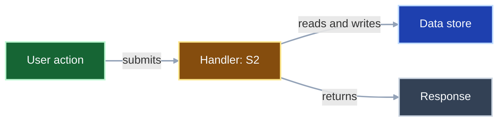

# RPI Walkthrough Protocol

This reference expands the `rpi-walkthrough` SKILL with the operational detail for a guided, conversational walkthrough. Conversation context owns the target refinement, detail level, segment pacing, current position, and follow-up depth. Use [../templates/walkthrough.md](../templates/walkthrough.md) only when a material user decision or requested change requires the optional ledger at `.copilot-tracking/walkthroughs/{{YYYY-MM-DD}}/{{task_slug}}-decisions.md`.

Follow the shared conventions in `copilot-tracking.instructions.md`. References inside `.copilot-tracking` artifacts use plain workspace-relative paths; references shown to the user in the conversation use markdown links with line numbers.

## Target resolution

Resolve the walkthrough target before any review or explanation:

* Prefer an explicit `target=...`, then attached or open files, then the most recent relevant `.copilot-tracking` artifact, then conversation context.
* Classify the target so the right review path and segment ordering apply:
  * Code or feature: source files, a feature flow, or a library or API surface.
  * UI or UX: components, routes, state wiring, styles, and the user-facing flow that connects them.
  * Prompt-engineering artifact: a prompt, instructions, agent, or skill file under `.github/`.
  * Artifact or document: a `.copilot-tracking` research, plan, details, changes, review, or log document, or another project document such as an architecture or planning record.
* Set `detail` to `brief`, `normal`, or `deep` (default `normal`). The user can change it at any segment boundary.
* When no target can be formed, stop and ask. When several unrelated targets match, ask the user to choose one before proceeding.
* When conversation context is unavailable, ask the user to identify the target and desired starting point. Do not treat a prior ledger as walkthrough progress or reconstruct pacing from it.

## Deep review before explaining

Understand the target through subagents before narrating it so the explanation stays accurate and grounded. Keep review results in active conversation and subagent returns.

* Dispatch a generic exploration subagent (`Explore`, or `runSubagent` with no named agent) to trace how the code, UI, UX, feature, or artifact actually works: entry points, call paths, data flow, connected files, and the decisions or evidence recorded inside `.copilot-tracking` artifacts.
* Activate `rpi-research` when the explanation depends on an external library, framework, standard, or anything that benefits from web or repository research with citations. Supply the walkthrough topic, purpose, audience, questions, evidence criteria, scope and non-goals, constraints, existing evidence, requested outputs, and analysis output mode, then read the completed primary research artifact before explaining.
* Scale the review to `detail`: a focused single pass for `brief`, a normal pass for `normal`, and a thorough multi-pass review with cross-references for `deep`.
* When dispatch tooling is unavailable, perform the equivalent review inline and state the fallback reason in the conversation.

## Segment planning

Turn the reviewed target into an ordered list of segments that each cover one coherent idea:

* Code or feature: order from entry point through the main flow to the key blocks and lines, grouping tightly-coupled lines into one segment.
* UI or UX: order along the user-facing flow, connecting each view or component to the state, events, and styles that drive them.
* Artifact: follow the document's own section order, pairing each decision with its rationale and evidence.

Keep the segment list, coverage, and current position in the conversation. Do not over-condense the walkthrough. When the target is large or nuanced, use more segments rather than forcing a compact summary, and 25 or more segments is acceptable when that is the clearest way to explain the material.

## Conversation markdown format

Use well-formatted markdown in every walkthrough turn.

* Start each segment with a segment header such as `### Segment 1: ...` before any narrative explanation.
* Before the first segment, render an overview Mermaid diagram when the target has meaningful architecture, control or data flow, section relationships, or a user journey. The diagram shows the target's actual structure or flow. Segment numbers may appear only as navigation cues.
* During a segment, include a compact focus diagram only when it adds useful information beyond the overview and prose. Show the current component or section and its real inbound or outbound relationships. Omit a diagram rather than fabricate or repeat decorative boxes.
* Keep labels short, add meaningful relationship labels when helpful, and follow every diagram with one sentence that states its takeaway. Classes describe target roles, not walkthrough progress; labels and prose carry the meaning independently of color.
* Use a contrast-safe Mermaid pattern like this when a diagram is useful. Adapt the nodes and edges to the actual target rather than reusing it as a progress diagram:

The handler is the focus because it receives the user action, coordinates data access, and produces the response.

* Keep the prose scannable. Each sentence or paragraph that discusses a file, line range, block, or artifact must include a nearby markdown link to that reference, rather than relying only on the reference table.
* Keep the reference table requirement. Render it near the bottom of each segment turn, immediately before the questions.

## Segment explanation loop

Run this loop once per segment, and never advance more than one segment per turn:

1. Explain the segment in the conversation. Start with the segment header, then move from what it does to how it connects to the rest of the target and why it is this way, without labeling those parts. Match the depth to `detail`. Keep the writing scannable: short paragraphs, a tight bullet list when it helps, and bold only for the few terms that carry the idea, and follow the "Writing the explanation for human eyes" section in this reference. Do not paste large code blocks; describe the code and point to it.
2. Render an overview diagram before the first segment only when the target has meaningful structure or flow. Add a compact focus diagram only when it clarifies a real relationship beyond the overview and prose, then state the diagram's takeaway in one sentence.
3. Add inline markdown links beside the explanatory prose for any file, block, or artifact being discussed. Do not rely only on the reference table for navigation.
4. Render the reference table for the segment (see Reference table format) so the user can navigate to every place being discussed.
5. Call `vscode_askQuestions` with one or two clear questions written in the same plain voice, with no praise or filler. The first offers more detail or a why on the current segment; the second continues to the next segment.

Write the full segment turn as visible chat text before this call: the segment header, diagrams, inline links, and reference table must already be in the response, and the questions come last in that same turn. Do not go straight from internal reasoning to the question tool with nothing rendered for the user; the failure mode is a bare `vscode_askQuestions` prompt that arrives before the explanation that sets it up. This gate holds before every `vscode_askQuestions` call and before any hand back of control, including mid-segment pauses.

## Writing the explanation for human eyes

Walkthrough prose is for a human reader. It should read like a thoughtful engineer explaining their own work, not like generated filler. Treat the lists below as patterns to recognize, not a literal find-and-replace blocklist; generalize from the examples so the prose stays natural rather than only dodging the exact words. Quoting or naming the target's actual identifiers, strings, or wording is always fine, even when they contain words this section would otherwise avoid.

### Avoid these AI tells

* Formulaic openers and recap wrappers such as "In today's world", "In conclusion", or "In summary", plus forced first-second-third scaffolding and transitions such as "Moreover" or "Additionally".
* Filler and empty restating such as "It's worth noting", "It's important to note", and "It should be mentioned", along with abstract intensifiers that do not earn their place.
* Promotional slogans and inflated language such as "game-changer", "paradigm shift", "cutting-edge", "unlock", "elevate", "empower", "supercharge", "leverage", and spike words such as "delve", "tapestry", "testament to", "realm", "landscape", "underscore", "showcase", "robust", "seamless", "intricate", "dive into", and "plays a crucial role".
* Sentence frames that feel packaged rather than thought-through, such as "It's not just X, it's Y", "not only X but also Y", rule-of-three triads, and "on one hand... on the other hand..." when they add no real analysis.
* Typography crutches: avoid em dashes, a common tell, and use commas, parentheses, or separate sentences instead; also avoid emoji in headings or bullets, bold-label-colon list items, Title Case headings, and excessive bolding.
* Conversational filler and sycophancy such as "Certainly!", "Great question!", and "I hope this helps", and over-agreeable phrasing, plus self-referential asides such as "let me be clear" or "to be clear".

### Write it like this instead

* Start with the real point, not a generic frame.
* Make every sentence do work and cut to the next useful sentence.
* Prefer concrete nouns and verbs over abstract labels.
* Use the shortest sentence that still says the thing clearly.
* Give one specific example tied to the actual code or artifact.
* Support claims with evidence rather than slogans, and keep the why behind each line or block in view.
* Let the prose carry the idea without announcing the structure.
* Make the last line of prose the implication, consequence, or next step, before the reference table and questions.
* Vary sentence and paragraph length so the rhythm reads human.
* When something is genuinely uncertain, say so plainly and separate what is known from what is likely, but do not manufacture hedging when the answer is clear.
* Use bold, lists, tables, and diagrams only when they help the reader.

### Shape of a segment message

Keep each turn easy to scan and small enough not to overwhelm:

* Open with the real point of this segment, and vary how you open across segments so the walkthrough does not fall into a repeated template.
* Explain how it works and why it is this way at a depth that matches `detail`: about one short paragraph for `brief`, two short paragraphs or a short list plus one concrete example for `normal`, and up to three short paragraphs plus one evidence-backed point for `deep`.
* Keep any single turn to roughly 200 words of prose or less, and move extra depth into a follow-up turn rather than one long message.
* Place the reference table near the bottom, just before the questions, so the reader can jump to the exact lines.
* Close with the one or two `vscode_askQuestions` prompts and nothing after them.

### A model segment message

This shows the intended rhythm: open with the point, explain how and why in a few plain lines, then the reference table, then the questions. The paths and code here are illustrative.

The `withRetry` wrapper exists so one flaky network call does not fail the whole import. It runs the callback, and when the callback throws it waits a short, growing delay and tries again, up to three attempts, before giving up. The delay grows on purpose: instant retries against a rate-limited API tend to make an outage worse, so each attempt backs off a little further.

| Reference                                    | What to look at                            |
|----------------------------------------------|--------------------------------------------|
| [src/net/retry.ts](src/net/retry.ts#L12-L28) | The retry loop and the backoff calculation |
| [src/net/client.ts](src/net/client.ts#L40)   | Where the import call is wrapped           |

Then ask, through `vscode_askQuestions`, whether to go deeper on how the backoff delay is calculated or move on to how a final failure is handled.

## Reference table format

Present references as a compact markdown table near the bottom of the message, before the questions. Use workspace-relative markdown links with line numbers, never inline code for file names, and never combine non-contiguous lines into one link.

| Reference                                    | What to look at                    |
|----------------------------------------------|------------------------------------|
| [path/to/file.ext](path/to/file.ext#L10-L24) | One-line description of this block |
| [path/to/other.ext](path/to/other.ext#L5)    | One-line description of this line  |

For a `.copilot-tracking` artifact walkthrough, link the artifact section being explained and any codebase files it references so the user can move between the decision and the code.

## Handling feedback

Interpret the user's `vscode_askQuestions` answer and respond in kind:

* More detail or why: repeat the deep review with subagents and tools as needed, then re-explain the same segment at greater depth before offering to continue.
* Less detail or a depth change: adjust `detail` and continue.
* Continue: advance to the next segment and run the loop again.
* A material decision or change request: capture it (see Recording decisions and requested changes) and offer immediate reconciliation or continuing with the entry open within the existing one-or-two-question cadence.
* A new or refined target: re-resolve the target, re-review, and re-plan the segments.

## Recording decisions and requested changes

The walkthrough is read-only by default. Create the ledger lazily, from [../templates/walkthrough.md](../templates/walkthrough.md), only when the user makes a material decision or requests a change. Do not create one for navigation, segment progress, evidence maps, explanations, scratch notes, or ordinary follow-up questions.

* Record the entry date, target, material decision or requested change, references, user rationale, reconciliation choice or status, and outcome or handoff evidence. The ledger stores only enough context to act on its entries later.
* When capturing an entry during a segment, ask whether the user wants to reconcile it now or keep it open while continuing. Include that choice in an existing segment-boundary question when possible rather than forcing an extra question.
* Reconcile each open entry with the user as one of: applied now, handed off to an RPI follow-on, deferred for later, or declined. Record the chosen disposition and any outcome or evidence pointer.
* Apply a source change only after the user explicitly chooses immediate reconciliation and the change is safely scoped. Confirm or clarify unsafe, ambiguous, destructive, externally visible, or out-of-scope work before acting. Record what happened in the ledger.
* A later request can read the ledger and reconcile open entries without treating it as walkthrough resumption state.

## Closing the walkthrough

When every planned segment is covered, or when the user declines another segment, asks for a summary, or ends the session:

* If a ledger exists, review its open entries and ask whether to reconcile them now or leave them for later.
* In a standalone walkthrough, recommend `/rpi-quick` for a one-shot pass, or the exact applicable `/rpi-research`, `/rpi-plan`, `/rpi-implement`, or `/rpi-review` command only for entries handed off or still requiring downstream work. Do not invoke it.
* State the no-handoff reason when no entry needs downstream work. In `rpi-quick` or confirmed automatic RPI Agent mode, return the evidence to the parent and state that it selects eligible continuation.
* Separate walkthrough session status from the ledger decision state. Include covered segments, important updates, and blockers or open entries. Advise `/compact` only when stale output, superseded reasoning, or completed-segment detail outweighs current context and the target and any ledger are current. When advising it, name retained state and artifact pointers. Otherwise omit compaction guidance.

## Final response contract

Close with a concise summary that contains:

* The segments covered and the detail level used.
* No ledger link when no material decision or requested change occurred. State that no decisions-and-changes artifact was needed.
* When a ledger exists, its path, the counts of material decisions and requested changes, and any remaining open entries.
* Markdown links to the ledger and its Reconciliation section when a ledger exists.
* An RPI recommendation only for entries handed off or still requiring downstream work.
* For the walked target and every relevant existing artifact, use the two-cell row `| [actual/workspace-relative/path.ext](actual/workspace-relative/path.ext) | Short description |`, using that artifact's actual workspace-relative path as both link text and destination; omit unavailable files and render the table immediately before the final `## Next Steps` section. End with `## Next Steps`: state the exact eligible user command, active-parent action, blocker-clearing action, or that no user action is required. When compaction is warranted, tell the user to run `/compact` before the next RPI command; otherwise omit compaction guidance.

Do not use status emojis in walkthrough headings or bullets. Use the existing human-writing rules, headings, inline links, diagrams, and reference tables to make the message scannable. The final table includes a ledger row and its Reconciliation link only when a ledger exists. It does not invent a ledger link.
