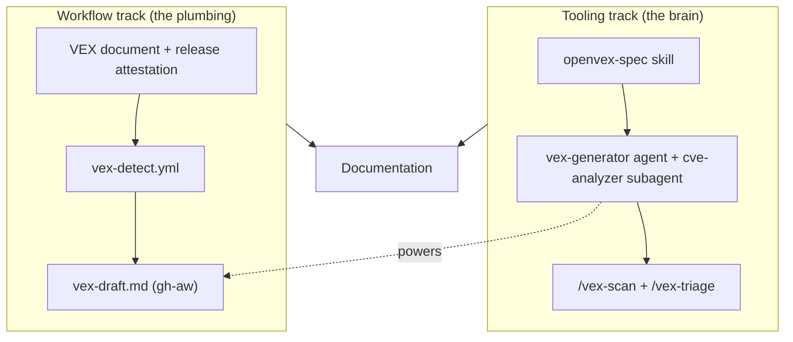

# Upstream PR: VEX (Vulnerability Exploitability eXchange) capability

> Draft pull request description for `dasiths/hve-core` -> `microsoft/hve-core`. Copy the section below into the PR body when opening the upstream PR.

---

## Summary

This PR adds an end-to-end **VEX (Vulnerability Exploitability eXchange)** capability to HVE Core. A scanner reports "you have N CVEs," but most are not exploitable in this product: the vulnerable function is never called, the code path is unreachable, or the dependency is only used at build time. VEX is a machine-readable, signed document that records, per CVE, *why* a vulnerability does or does not affect HVE Core. It turns scanner noise into accountable answers and lets VEX-aware scanners (Trivy, Grype) suppress findings the maintainers have assessed as `not_affected`.

The capability spans two complementary tracks that converge on an AI-assisted, human-reviewed drafting loop:

* **Workflow track (plumbing):** a signed VEX document published and attested with each release, a scheduled detection workflow, and an AI drafting workflow.
* **Tooling track (the brain):** an OpenVEX skill, a VEX Generator agent with a CVE Analyzer subagent, and `/vex-scan` + `/vex-triage` prompts.

The trust model is **AI drafts, human merges**: the agent performs every step except the merge click; the merge-commit author is the accountable author of record, and the agent is forbidden from asserting `not_affected` at low confidence.

## What's included

| Area | Artifacts |
|------|-----------|
| Foundation | `security/vex/hve-core.openvex.json` (OpenVEX v0.2.0 document); `attest-and-upload-vex` job in `release-stable.yml` |
| Skill + instructions | `.github/skills/security/openvex-spec/` (SKILL + schema, status-logic, and CVE-data-source references); `vex-standards` and `vex-generation` instructions |
| Agent | `.github/agents/security/vex-generator.agent.md` + `subagents/cve-analyzer.agent.md` |
| Prompts | `/vex-scan` and `/vex-triage`; collection registration |
| Detection workflow | `.github/workflows/vex-detect.yml` (OSV-Scanner scan, diff against the VEX doc, file a triage issue) |
| Drafting workflow | `.github/workflows/vex-draft.md` + compiled `vex-draft.lock.yml` (gh-aw, engine: copilot) |
| Documentation | `docs/security/vex-verification.md`, `docs/agents/security/vex-generator.md`; updates to `docs/security/security-model.md` (control SC-9), `docs/security/README.md`, and `SECURITY.md` |

## Architecture

## How it works once live

1. **Release** publishes the signed VEX document alongside the SBOM, attested via Sigstore.
2. **Detection** (`vex-detect.yml`) re-scans on a schedule and after each release, diffs OSV-Scanner findings against the VEX document, and files a single deduplicated triage issue for untriaged or non-terminal-status CVEs.
3. **AI drafting** (`vex-draft.md`) triggers off the detection run, invokes the VEX Generator agent to enrich each CVE, analyze reachability, route by confidence, and opens **one** pull request with an updated OpenVEX document.
4. **Human review** merges the PR. AI drafts, human merges; the merge commit author is the accountable author of record.
5. **Consumers** download the VEX document, verify its attestation, and apply it with `trivy --vex` / `grype --vex` to suppress `not_affected` findings.

## Testing and evidence

The capability was validated across seven layers: static re-validation, OpenVEX schema conformance, a local run of the detection workflow against the real dependency set, a bounded run of the agent pipeline, the integration seams, the release-attestation wiring (static), and a **live end-to-end run of the drafting workflow**.

### Live drafting run (gh-aw, GitHub Copilot engine)

A real run of the `VEX Drafting` workflow on the fork, dispatched against a seeded detection issue, drafted a schema-valid OpenVEX update as a pull request:

* Detection issue (work list): <https://github.com/dasiths/hve-core/issues/20>
* Workflow run (Actions): <https://github.com/dasiths/hve-core/actions/runs/27705375100>
* Drafted output (PR): <https://github.com/dasiths/hve-core/pull/22>

The run confirmed: the activation guard fired correctly (no spurious noop), the agent ran under the Copilot engine, the safe-output PR touched **only** `security/vex/hve-core.openvex.json`, and the forbidden-transition guard held (no unevidenced `not_affected`).

### Finding caught only by the live run

An initial live run degraded every finding to `under_investigation` with "advisory data not retrievable." Investigation showed two compounding causes that static checks and a fully-networked local run had both missed:

1. **Identifier keying:** OSV.dev keys records by their native id (`GHSA-`/`PYSEC-`); a `GET /v1/vulns/CVE-...` returns `404`. NVD keys by `CVE-`. The agent had queried by the CVE alias only.
2. **Network egress:** the gh-aw sandbox firewall did not allow `api.osv.dev` or `services.nvd.nist.gov`.

The fix adds an **alias-fallback enrichment** that queries each source by the id it is keyed on (GitHub Advisory Database + OSV by `GHSA-`/`PYSEC-`, NVD by `CVE-`) and walks all aliases, plus a **`network:` allowlist** for OSV/NVD. The GitHub Advisory Database was elevated to a first-class metadata source because `api.github.com` is reachable in the sandbox by default.

After the fix, the re-run resolved both sample CVEs to evidence-backed `not_affected` determinations (with justification codes and CVSS / codebase citations) instead of the conservative `under_investigation` fallback.

### Validation

`gh aw compile` (0 errors / 0 warnings), `lint:yaml` (actionlint), `lint:md`, `lint:frontmatter`, `lint:md-links`, `spell-check`, `lint:dependency-pinning`, `lint:permissions`, `validate:skills`, and `lint:ai-artifacts` all pass.

## Licensing posture

CVE advisory data is used under per-source licenses: NVD (US Government public domain) for CVSS and CWE; OSV.dev (mixed, routed by record prefix); GitHub Advisory Database (CC-BY-4.0) for identifiers, factual metadata, and reference URLs only. The agent writes original impact and remediation prose and does not quote or closely paraphrase advisory text. OpenVEX template text is CC0.

## Maturity and known follow-ups

* All new artifacts ship at **`experimental`** maturity. Promotion to `stable` follows validation across three or more codebases with a 5% or lower false-positive rate on `not_affected` determinations.
* **Release attestation predicate:** the `attest-and-upload-vex` step currently sets only `subject-path`. Confirm the intended attestation predicate type for the standalone VEX document before relying on `--predicate-type` verification.
* **Autonomous PR identity:** the drafting workflow uses gh-aw's `GH_AW_GITHUB_TOKEN` seam (falling back to `GITHUB_TOKEN`); populate it from a GitHub App so drafted PRs trigger downstream checks.

## Reviewer notes

- [ ] Reviewed and validated by a qualified human reviewer
