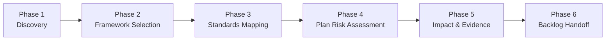

The Accessibility Planner is a phase-based conversational agent that guides your team through a structured accessibility assessment across five frameworks: WCAG 2.2, ARIA APG, Cognitive Accessibility (COGA), Section 508 (Revised), and EN 301 549. It produces framework selections, success-criterion mappings, evidence-register entries, plan-risk classifications, tradeoff logs, and a dual-format ADO + GitHub backlog handoff.

> The goal is not to replace accessibility expertise. It is to make sure the right frameworks get selected, the right success criteria get mapped, and the resulting work items land in your backlog with enough evidence to act on.

## Purpose

* Select the frameworks that apply to the product's surfaces and regulated markets, then capture conformance levels and license posture.
* Map in-scope surfaces against the selected frameworks and resolve each success criterion to a target compliance state with evidence pointers.
* Classify plan-level risk, document mitigation versus accept-with-tradeoff decisions, and produce work-item seeds with evidence references.
* Hand off prioritized backlog items in both Azure DevOps and GitHub formats, with autonomy tiers and a pinned planning disclaimer.

## When to Use

| Scenario                                                  | Recommended entry mode  |
|-----------------------------------------------------------|-------------------------|
| Fresh start with no upstream artifact                     | Capture mode            |
| Existing PRD with audience scope and surface inventory    | From-PRD mode           |
| Business requirements with market and procurement drivers | From-BRD mode           |
| Security plan already produced for the same project       | From-Security-Plan mode |
| RAI plan flagging AI-generated UI                         | From-RAI-Plan mode      |

## Entry Modes

Five entry modes determine how Phase 1 (Discovery) begins. All modes converge at Phase 2 once discovery completes.

| Mode                 | Trigger              | Input source                      | Behavior                                                                                             |
|----------------------|----------------------|-----------------------------------|------------------------------------------------------------------------------------------------------|
| `capture`            | Fresh start          | Conversation                      | Exploration-first questioning to build surface inventory, audience scope, and regulatory drivers     |
| `from-prd`           | PRD exists           | `.copilot-tracking/prd-sessions/` | Pre-populates Phase 1 from audience scope, in-scope surfaces, devices, and accessibility commitments |
| `from-brd`           | BRD exists           | `.copilot-tracking/brd-sessions/` | Extracts market geographies, procurement obligations, and contractual VPAT or ACR commitments        |
| `from-security-plan` | Security plan exists | Security Planner artifacts        | Reuses surface inventory, AI/ML flags, and external-input touchpoints; sets `securityPlanRef`        |
| `from-rai-plan`      | RAI plan exists      | RAI Planner artifacts             | Reuses AI-generated UI flags and audience-impact signals; sets `raiPlanRef`                          |

## The Six Phases

### Phase 1: Discovery

Captures project context, audience scope, surface inventory, regulatory drivers, and existing accessibility artifacts. In capture mode, the agent uses exploration-first questioning to build the inventory from scratch.

### Phase 2: Framework Selection

Presents the five supported frameworks (`wcag-22`, `aria-apg`, `coga`, `section-508`, `en-301-549`) using a host-aware multi-select, with `wcag-22@AA` and `section-508` pre-checked as defaults. Captures conformance levels, atomic disabled bundles, and license posture acknowledgements.

### Phase 3: Standards Mapping

Maps in-scope surfaces against the selected frameworks. Each success criterion resolves to a target compliance state, attaches evidence pointers, and emits cross-references for any criterion shared across frameworks.

### Phase 4: Plan Risk Assessment

Classifies the assessment risk tier (low, medium, or high), enumerates plan-level risks such as audience scope versus tested coverage and automation-only coverage, and raises escalations. The agent re-enters capture coaching when discovery gaps surface.

### Phase 5: Impact and Evidence

Produces the `evidenceRegister`, `tradeoffLog`, and `workItemSeeds` arrays in `state.json`. Documents mitigation versus accept-with-tradeoff choices for each unresolved gap, cross-links to RAI, SSSC, and Security Planner artifacts when present, and captures VPAT or EAA evidence references.

### Phase 6: Backlog Handoff

Renders Phase 5 outputs into dual-format ADO + GitHub backlog files, applies the review rubric, attaches autonomy tiers, sanitizes content, and emits the planning disclaimer block.

## Outputs

| Artifact             | Description                                                                  |
|----------------------|------------------------------------------------------------------------------|
| Framework selections | The frameworks in scope, with conformance levels and disabled-bundle records |
| Control mappings     | Success criteria mapped to surfaces with target compliance states            |
| Evidence register    | Stable-URI evidence records reusable by Security, SSSC, and RAI planners     |
| Tradeoff log         | Mitigation versus accept-with-tradeoff decisions for unresolved gaps         |
| Backlog handoff      | Dual-format ADO + GitHub work items with autonomy tiers and disclaimer       |

State persists at `.copilot-tracking/accessibility/{project-slug}/state.json`, validated against `scripts/linting/schemas/accessibility-state.schema.json`.

## Cross-Planner Integration

The Accessibility Planner shares evidence and signals with the Security, RAI, and SSSC planners through reference fields and a shared evidence-register schema.

| Outbound flow            | What is shared                                                                                                |
|--------------------------|---------------------------------------------------------------------------------------------------------------|
| Accessibility → Security | Evidence records carry stable URIs that security reports cite under external evidence                         |
| Accessibility → RAI      | Phase 4 inserts `humanReviewControl` entries when the profile declares AI-generated UI, alt text, or captions |
| Accessibility → SSSC     | Section 508 and EN 301 549 evidence records feed SSSC procurement gates such as VPAT and EAA conformance      |

See [Cross-Planner Integration](../../getting-started/cross-planner-integration.md) for the full integration matrix, including the inbound flows from the RAI and Security planners.

## Related Files

| File type    | Location                                                      |
|--------------|---------------------------------------------------------------|
| Agent        | `.github/agents/accessibility/accessibility-planner.agent.md` |
| State schema | `scripts/linting/schemas/accessibility-state.schema.json`     |
| Instructions | `.github/instructions/accessibility/`                         |

## Next Steps

* [Accessibility Reviewer](accessibility-reviewer.md) for codebase profiling and findings assessment.
* [Accessibility Planner Quickstart](../../getting-started/accessibility-planner.md) for a five-minute walkthrough.
* [Cross-Planner Integration](../../getting-started/cross-planner-integration.md) for how the planners share evidence and signals.

<!-- markdownlint-disable MD036 -->
*🤖 Crafted with precision by ✨Copilot following brilliant human instruction,
then carefully refined by our team of discerning human reviewers.*
<!-- markdownlint-enable MD036 -->
