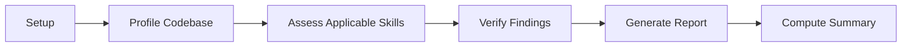

The Accessibility Reviewer is an orchestrator agent that audits a codebase against accessibility skills, verifies the findings, and produces a consolidated conformance report. It delegates to specialized subagents and supports audit, diff, and plan modes.

> A reviewer is only as useful as the findings it can defend. Every FAIL and PARTIAL finding passes through deep verification before it reaches the report.

## Purpose

* Profile the codebase to determine which accessibility skills apply.
* Assess applicable skills (WCAG 2.2, ARIA APG, COGA, Section 508, EN 301 549) and collect findings.
* Verify FAIL and PARTIAL findings through a deep verifier before reporting.
* Generate a consolidated report with summary counts and a severity breakdown.

## When to Use

| Scenario                                             | Recommended mode  |
|------------------------------------------------------|-------------------|
| Full review of an existing codebase                  | `audit` (default) |
| Review only the surfaces touched by a set of changes | `diff`            |
| Evaluate an accessibility plan document before build | `plan`            |

## Modes and Inputs

| Mode    | Behavior                                                                      | Key inputs                           |
|---------|-------------------------------------------------------------------------------|--------------------------------------|
| `audit` | Profiles the full codebase, assesses applicable skills, and verifies findings | Optional path focus, skills override |
| `diff`  | Assesses only the changed files, then verifies findings                       | Changed files                        |
| `plan`  | Assesses a plan document and passes findings through without verification     | Plan document                        |

Additional inputs accepted across modes include an optional path focus, a skills-list override, a target skill (which fast-paths past the profiler), and a prior scan report.

## The Pipeline

| Step | Stage                    | What happens                                                                                                             |
|------|--------------------------|--------------------------------------------------------------------------------------------------------------------------|
| 1    | Setup                    | Resolve mode, focus paths, and the skill set to assess                                                                   |
| 2    | Profile Codebase         | The Codebase Profiler determines which skills apply; a supplied target skill bypasses this step                          |
| 3    | Assess Applicable Skills | Each applicable skill produces findings; diff mode assesses only changed files, plan mode assesses the plan content      |
| 4    | Verify Findings          | Audit and diff modes run the Finding Deep Verifier per skill for FAIL and PARTIAL findings; plan mode skips verification |
| 5    | Generate Report          | The Report Generator produces the consolidated report from verified findings                                             |
| 6    | Compute Summary          | A completion summary displays counts, assessed skills, the report path, and any excluded skills with reasons             |

## Subagents

| Subagent                     | Responsibility                                                |
|------------------------------|---------------------------------------------------------------|
| Codebase Profiler            | Determines which accessibility skills apply to the codebase   |
| Accessibility Skill Assessor | Assesses a single skill and produces findings                 |
| Finding Deep Verifier        | Re-verifies FAIL and PARTIAL findings in audit and diff modes |
| Report Generator             | Produces the consolidated conformance report                  |

If a subagent response is incomplete or malformed, the orchestrator retries once and then excludes that skill, recording the reason.

## Outputs

The reviewer writes a consolidated report under `.copilot-tracking/accessibility-reviews/`. Report filenames encode the mode and a dated sequence:

* `audit-{{YYYY-MM-DD}}-{{NNN}}.md`
* `diff-{{YYYY-MM-DD}}-{{NNN}}.md`
* `plan-{{YYYY-MM-DD}}-{{NNN}}.md`

The report includes summary counts, the list of assessed skills, a severity breakdown, and any excluded skills with reasons.

## Cross-Planner Integration

The reviewer's deterministic signals can be shared with the Security Planner's profiler and vice versa when both run in the same session. See [Cross-Planner Integration](../../getting-started/cross-planner-integration.md) for the full matrix.

## Related Files

| File type | Location                                                       |
|-----------|----------------------------------------------------------------|
| Agent     | `.github/agents/accessibility/accessibility-reviewer.agent.md` |
| Skills    | `.github/skills/accessibility/`                                |
| Reports   | `.copilot-tracking/accessibility-reviews/`                     |

## Next Steps

* [Accessibility Planner](accessibility-planner.md) for upstream framework selection and backlog handoff.
* [Accessibility Planner Quickstart](../../getting-started/accessibility-planner.md) for a five-minute walkthrough.

<!-- markdownlint-disable MD036 -->
*🤖 Crafted with precision by ✨Copilot following brilliant human instruction,
then carefully refined by our team of discerning human reviewers.*
<!-- markdownlint-enable MD036 -->
