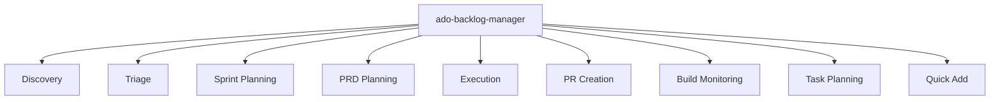

The ADO Backlog Manager automates work item lifecycle management across Azure DevOps projects. It coordinates nine specialized workflows (discovery, triage, PRD planning, sprint planning, execution, quick add, task planning, build info, and PR creation) through planning files and handoff artifacts, applying consistent field classification, detecting duplicates, and organizing work items into iterations with configurable autonomy levels.



> Backlog management is a constraint-satisfaction problem. Each workflow handles a bounded scope, reducing errors by limiting the decisions any single step makes.

## Why Use the Backlog Manager?

* 🏷️ Consistency: Every work item receives Area Path, Priority, Tags, and Iteration Path assignment following the same classification model, eliminating drift across contributors
* 🔍 Visibility: Discovery workflows surface work items from user assignments, search queries, and artifact analysis, so nothing falls through gaps
* ⚡ Throughput: Automated triage and sprint planning handle repetitive decisions, freeing your team for engineering work
* 📄 Format Awareness: Content format detection distinguishes Azure DevOps Services (Markdown) from Azure DevOps Server (HTML), applying the correct template syntax automatically

> [!TIP]
> For the full rationale and quality comparison, see [Why the Backlog Manager Works](why-backlog-manager.md).

## The Nine Workflows

### 🔍 Discovery

Discovery finds and categorizes work items from multiple sources. Two primary paths cover different starting points: user-centric (assigned work items) and artifact-driven (documents, branches, and commits mapped to backlog items). A third search-based path supports criteria-driven queries across projects. Discovery produces analysis files that feed into triage.

See the [Discovery workflow guide](discovery.md) for paths, artifacts, and examples.

### 🏷️ Triage

Triage classifies work items across five dimensions: Area Path, Priority, Severity (bugs only), Tags, and Iteration Path. It detects duplicates by comparing work items across multiple similarity dimensions. A triage trigger criteria model identifies candidates automatically based on their classification state.

See the [Triage workflow guide](triage.md) for classification dimensions and duplicate detection.

### 📄 PRD Planning

PRD Planning converts product requirements documents into Azure DevOps work item hierarchies. It delegates to the `@AzDO PRD to WIT` agent, which parses requirements, builds parent-child structures (Epic > Feature > Story > Task), and produces execution-ready handoff files.

See the [PRD Planning workflow guide](prd-planning.md) for the conversion process and hierarchy model.

### 📋 Sprint Planning

Sprint Planning organizes work items into iterations with coverage analysis, capacity tracking, and gap detection. It coordinates Discovery and Triage inline when needed, producing iteration-scoped analysis in a single sequence. A hierarchy coverage matrix analyzes decomposition completeness across Epic, Feature, Story, and Task levels.

See the [Sprint Planning workflow guide](sprint-planning.md) for iteration discovery and capacity analysis.

### ⚡ Execution

Execution consumes handoff files produced by earlier workflows and applies the planned operations. It creates, updates, and state-changes work items according to the plan, tracking each operation with checkbox-based progress and per-operation logging. Content sanitization strips internal tracking references before any ADO API call.

See the [Execution workflow guide](execution.md) for handoff consumption and operation logging.

### ➕ Quick Add

Quick Add creates a single work item without running the full pipeline. Use it when you need to file a bug, story, or task quickly with standard field assignments and interaction templates applied in a single step. Quick Add is an inline operation with no dedicated workflow page.

### 📝 Task Planning

Task Planning prioritizes your current work items and recommends what to work on next. It retrieves assigned items, analyzes priority and state, and produces an ordered task list with reasoning.

See the [Task Planning workflow guide](task-planning.md) for prioritization strategies and prompt examples.

### 🔧 Build Info

Build Info retrieves Azure DevOps pipeline status, build logs, and failure details. Query by PR number, build ID, or branch name to get pipeline status without leaving the chat session.

See the [Build Monitoring workflow guide](build-monitoring.md) for query options and log analysis.

### 🔀 PR Creation

PR Creation generates Azure DevOps pull requests with work item linking, reviewer identification, and branch management. It follows the structured PR creation protocol to produce complete pull requests from local changes.

See the [PR Creation workflow guide](pr-creation.md) for the complete workflow including confirmation gates.

## Content Format Detection

The backlog manager automatically detects the appropriate content format for your Azure DevOps environment:

| Environment           | Format   | Detection Method                                                 |
|-----------------------|----------|------------------------------------------------------------------|
| Azure DevOps Services | Markdown | URL contains `dev.azure.com` or `visualstudio.com`               |
| Azure DevOps Server   | HTML     | URL contains an on-premises hostname or uses `_apis` with a port |

All interaction templates (work item descriptions, comments, acceptance criteria) exist in both Markdown and HTML variants. The detected format determines which template variant the agent uses for API calls.

## Autonomy Levels

The backlog manager operates at three autonomy tiers, controlling which operations proceed automatically and which pause for approval.

| Tier              | Area Path | Priority | Tags | Iteration | State Change | Create |
|-------------------|-----------|----------|------|-----------|--------------|--------|
| Full              | Auto      | Auto     | Auto | Auto      | Auto         | Auto   |
| Partial (default) | Auto      | Auto     | Auto | Gate      | Gate         | Gate   |
| Manual            | Gate      | Gate     | Gate | Gate      | Gate         | Gate   |

Partial autonomy is the default, applying classification fields automatically while gating iteration assignment, state changes, and creation for review. Adjust the tier based on project maturity and team trust.

## When to Use

| Use Backlog Manager When...                     | Use Manual Management When...            |
|-------------------------------------------------|------------------------------------------|
| Managing more than 20 open work items           | Working with fewer than 10 items         |
| Multiple contributors need consistent triage    | Single contributor with full context     |
| Sprint planning requires iteration organization | No iteration-based planning process      |
| PRD-to-work-item conversion is needed           | Requirements are already decomposed      |
| Field consistency matters for reporting         | Ad-hoc classification suits the workflow |

## Quick Start

1. Configure your MCP servers following the [MCP Configuration guide](../../getting-started/mcp-configuration.md)
2. Open a Copilot Chat session with the ADO Backlog Manager agent
3. Type: `Discover work items assigned to me`
4. Review the discovery output, then use the Triage handoff button
5. Continue through sprint planning and execution as needed

> [!IMPORTANT]
> Clear context between workflows by typing `/clear`. Each workflow operates independently and mixing contexts produces unreliable results.

## Prerequisites

The ADO Backlog Manager requires MCP server configuration for Azure DevOps API access. See [MCP Configuration](../../getting-started/mcp-configuration.md) for setup instructions. The Azure DevOps MCP tools listed in the agent specification must be available in your VS Code context.

The MCP server entry in `.vscode/mcp.json` configures the Azure DevOps connection:

```json
{
  "servers": {
    "ado": {
      "command": "npx",
      "args": [
        "-y", "@azure-devops/mcp", "<organization>",
        "--tenant", "<tenant-id>",
        "-d", "core", "work", "work-items", "search", "repositories", "pipelines"
      ]
    }
  }
}
```

## Handoff Navigation

The agent provides handoff buttons for transitioning between workflows:

| Button   | Target Workflow | Use When                                         |
|----------|-----------------|--------------------------------------------------|
| Discover | Discovery       | Starting a new backlog review                    |
| Triage   | Triage          | Work items need classification                   |
| Sprint   | Sprint Planning | Organizing items into iterations                 |
| Execute  | Execution       | Applying planned changes from handoff files      |
| Add      | Quick Add       | Creating a single work item                      |
| Plan     | Task Planning   | Prioritizing current assigned work               |
| PRD      | PRD Planning    | Converting a requirements document to work items |
| Build    | Build Info      | Checking pipeline status                         |
| PR       | PR Creation     | Creating an Azure DevOps pull request            |
| Save     | Memory          | Saving session state for later resumption        |

## Next Steps

* [Discovery](discovery.md): Find and categorize work items from multiple sources
* [Triage](triage.md): Classify fields, priorities, and detect duplicates
* [PRD Planning](prd-planning.md): Convert requirements documents to work item hierarchies
* [Sprint Planning](sprint-planning.md): Organize work items into iterations
* [Execution](execution.md): Execute planned operations from handoff files
* [Task Planning](task-planning.md): Prioritize assigned work items and plan your day
* [Build Monitoring](build-monitoring.md): Check pipeline status and analyze build logs
* [PR Creation](pr-creation.md): Create Azure DevOps pull requests with work item linking
* [Using Workflows Together](using-together.md): End-to-end pipeline walkthrough
* [Why the Backlog Manager Works](why-backlog-manager.md): Design rationale and quality comparison

---

<!-- markdownlint-disable MD036 -->
*🤖 Crafted with precision by ✨Copilot following brilliant human instruction,
then carefully refined by our team of discerning human reviewers.*
<!-- markdownlint-enable MD036 -->
