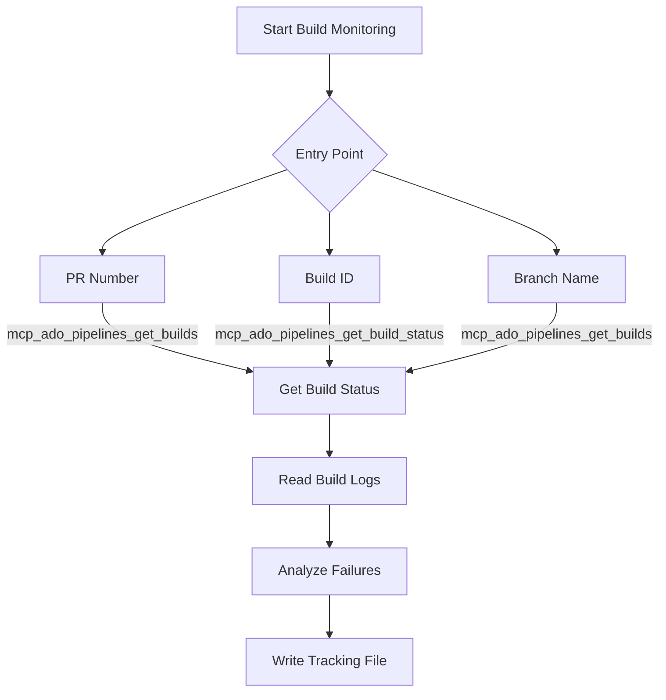

The Build Monitoring workflow retrieves Azure DevOps build status, reads pipeline logs, analyzes failures, and writes tracking files for persistent build history.

> The agent locates your build through any of three entry points (PR number, build ID, or branch name) and provides failure analysis with suggested fixes.

## When to Use

* 🔴 PR build fails and you need to understand the root cause quickly
* 🔍 Investigating pipeline issues across multiple build runs
* 📊 Checking deployment status or stage progression for a specific build
* 📋 Reviewing what source changes triggered a build
* 📁 Generating a persistent tracking file for build results

## What It Does

1. Identifies the target build through your chosen entry point (PR number, build ID, or branch name)
2. Retrieves current build status and stage information using pipeline tools
3. Reads build logs to surface errors, warnings, and failure details
4. Analyzes log content to identify failure patterns and suggest fixes
5. Writes a tracking file with build metadata, log excerpts, and analysis



> [!NOTE]
> Build Monitoring performs read-only operations on your pipeline data, with one exception: the `mcp_ado_pipelines_update_build_stage` tool can retry or skip a stage when you explicitly request it.

### Retrieval Paths

Three entry points converge on the same analysis pipeline.

The PR number path calls `mcp_ado_pipelines_get_builds` filtered to your pull request, returning the most recent build. This works best when you are already reviewing a PR and want to check its latest build.

The build ID path uses `mcp_ado_pipelines_get_build_status` for a direct lookup when you have the build identifier from a notification or another workflow. This is the fastest path.

The branch name path queries recent builds filtered to your branch, allowing selection when multiple builds exist. Use this for monitoring feature branch builds outside of a PR context.

### Log Analysis

The agent reads build logs using `mcp_ado_pipelines_get_build_log` for the full log list and `mcp_ado_pipelines_get_build_log_by_id` for specific log entries. It scans for error patterns, test failures, and infrastructure issues, then summarizes findings with line references and suggested actions.

For builds with multiple stages, the agent identifies which stage failed and reads only the relevant log sections. You can request a full log dump if you need the complete output, but targeted reads are faster and produce more relevant analysis.

## Output Artifacts

```text
.copilot-tracking/pr/
└── <YYYY-MM-DD>-build-<buildId>.md    # Build tracking file with status, logs, and analysis
```

The tracking file captures build metadata (ID, status, source branch, triggered by), log excerpts for failed steps, and the agent's failure analysis. These files persist across sessions, providing a history of build investigations.

## How to Use

### Option 1: Prompt Shortcut

Ask about a build directly:

```text
Check the build status for my PR
```

```text
Why did build 12345 fail?
```

### Option 2: Handoff Button

Click the "Build Info" handoff button in the ADO Backlog Manager agent to start a build monitoring session with the standard prompt.

### Option 3: Direct Agent

Start a conversation with the ADO Backlog Manager agent and describe what you want to know about a build. The agent determines the entry point from your description and retrieves the relevant information.

## Example Prompts

Quick status check for current branch:

```text
Check the latest build for my current branch. If it passed, show a
summary of stage durations. If it failed, read the logs and identify
the root cause. Write a tracking file with your analysis.
```

Deep-dive into a specific build failure:

```text
Analyze build 48291 in the PlatformCI pipeline. Read the failure logs
for the test and deploy stages. Identify:
- Which tests failed and their error messages
- Whether the failure is a code issue or infrastructure flake
- Recommended fix based on the error patterns
```

Comparative analysis between two builds:

```text
Compare build 48291 (failed) with build 48287 (passed) in the same
pipeline. Show what changed between the two runs and identify which
stage regressed. Check whether the failure correlates with a specific
commit.
```

**Output artifacts:** Build monitoring writes a tracking file to `.copilot-tracking/pr/` containing build status, stage results, log analysis, and recommended actions. Review the tracking file for accuracy before using it to guide your fix.

## Tips

* ✅ Use the build ID entry point when you have it (fastest retrieval path)
* ✅ Request targeted log reads for failed stages instead of full log dumps
* ✅ Review the tracking file before re-running a failed build to confirm the fix addresses the right issue
* ✅ Ask the agent to compare two build runs when investigating intermittent failures
* ❌ Do not request stage updates unless you understand the pipeline's retry behavior
* ❌ Do not assume a passing build means all stages completed (some stages may be skipped by design)
* ❌ Do not ignore infrastructure errors in log analysis (they may indicate transient issues, not code problems)

## Common Pitfalls

| Pitfall                                    | Solution                                                                                   |
|--------------------------------------------|--------------------------------------------------------------------------------------------|
| Agent cannot find builds for your PR       | Verify the project name and confirm the PR has triggered a pipeline run                    |
| Build logs are empty or truncated          | Check that the build completed (in-progress builds may not have all logs)                  |
| Wrong build selected from branch query     | Specify the build ID directly or narrow the time range                                     |
| Stage update has no effect                 | Verify the pipeline supports the retry or skip action for that stage type                  |
| Tracking file overwrites previous analysis | Each file uses a date-prefixed name; check for existing files before requesting new output |

## Next Steps

1. Return to [PR Creation](pr-creation) to update your pull request based on build findings
2. See [Using Workflows Together](using-together) for the full pipeline walkthrough

> [!TIP]
> When a build fails on a PR, run build monitoring first to diagnose the issue. Fix the code, push the change, then re-run build monitoring to confirm the fix before requesting another review.

---

<!-- markdownlint-disable MD036 -->
*🤖 Crafted with precision by ✨Copilot following brilliant human instruction, then carefully refined by our team of discerning human reviewers.*
