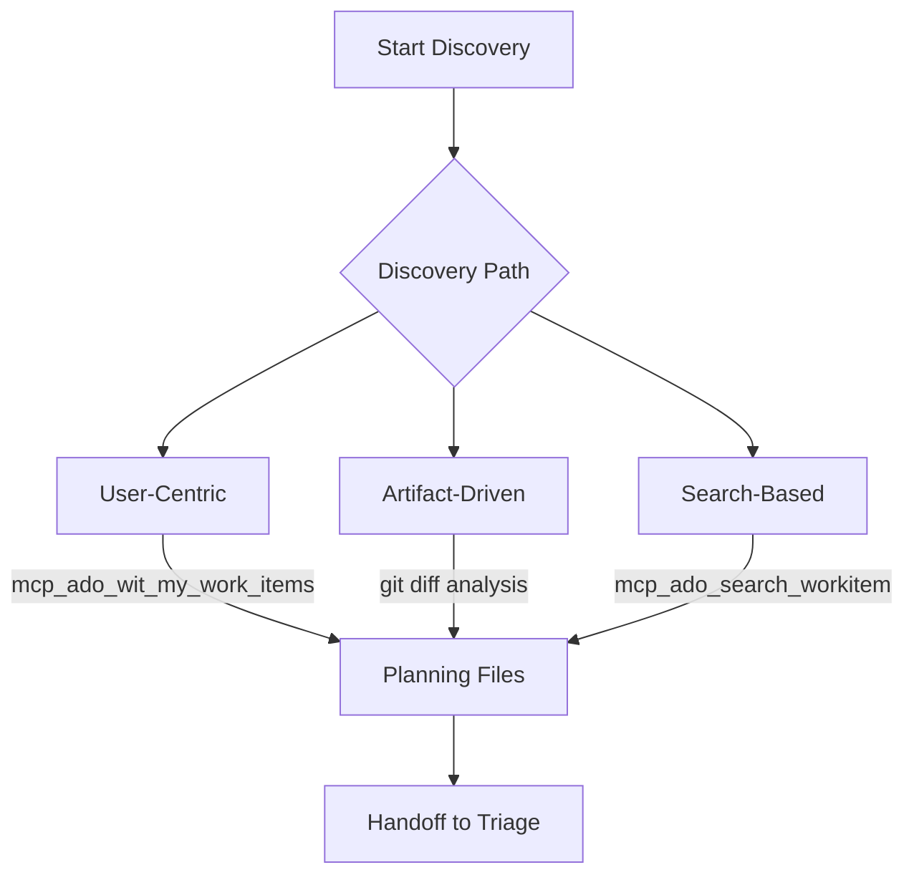

The Discovery workflow finds and categorizes Azure DevOps work items from multiple sources, producing structured analysis files that feed into triage and planning.

## When to Use

* 🆕 Starting a new sprint and need to survey work items across your project
* 👤 Reviewing work items assigned to you or your team before a planning session
* 🔀 Code changes on a feature branch that may relate to existing backlog items
* 🔍 Searching for work items matching specific criteria across projects
* 📄 Documents or PRDs that need mapping to existing work items

## What It Does

1. Identifies work items through one of three discovery paths (user-centric, artifact-driven, or search-based)
2. Retrieves full work item metadata including Area Path, Priority, Iteration Path, Tags, and State
3. Categorizes work items by type, area, and current state
4. Produces structured analysis files with work item summaries and recommendations
5. Flags work items that may need triage attention (unclassified, stale, or missing field values)

> [!NOTE]
> Discovery is deliberately separated from triage. Finding work items and deciding what to do with them are different cognitive tasks. Running them in a single pass increases the chance of misclassification.



## The Three Discovery Paths

### User-Centric Discovery

Finds work items assigned to or recently modified by a specific user. This path is ideal for sprint preparation, where you need to see your current backlog before planning new work. The workflow calls `mcp_ado_wit_my_work_items` to retrieve items by assignee, filters by state and type, and organizes results by work item type and state.

When an iteration path is specified, the workflow uses `mcp_ado_wit_get_work_items_for_iteration` instead, scoping results to a specific sprint.

### Artifact-Driven Discovery

Analyzes local documents, branches, and commits, then maps them to existing backlog items. This path surfaces work items related to your current work, helping you avoid duplicate effort and identify items your changes may resolve. The workflow reads git diff output or document content and searches for matching work items by keyword, component area, and description overlap.

### Search-Based Discovery

Queries Azure DevOps using criteria you define: work item types, states, area paths, keywords, or any combination. This path handles broad inventory tasks, such as finding all unassigned items, all bugs in a specific area path, or all items in the `New` state without tags.

## Output Artifacts

```text
.copilot-tracking/workitems/discovery/<scope-name>/
├── planning-log.md       # Search terms, discovered items, and phase tracking
├── artifact-analysis.md  # Extracted requirements and field values (artifact-driven only)
├── work-items.md         # Source of truth for planned operations (artifact-driven only)
└── handoff.md            # Create and update actions for execution (artifact-driven only)
```

Discovery writes its output to the `.copilot-tracking/workitems/discovery/` directory. The scope name reflects the discovery target (a username, project, or search description). These files serve as input for the triage workflow.

## How to Use

### Option 1: Prompt Shortcut

Use the backlog manager prompts to start a discovery session:

```text
Discover work items assigned to me in my Azure DevOps project
```

```text
Find work items related to my current branch changes
```

```text
Search for unclassified work items in the New state
```

### Option 2: Handoff Button

Click the "Discover" handoff button in the ADO Backlog Manager agent to launch a discovery session with the standard prompt.

### Option 3: Direct Agent

Start a conversation with the ADO Backlog Manager agent and describe your discovery goal. The agent classifies your intent and dispatches the appropriate discovery path automatically.

## Example Prompts

User-centric discovery scoped to unplanned items:

```text
Discover work items assigned to me that don't have an iteration path
assigned. Include any items in the New state without tags, regardless
of assignee. Write the analysis to the discovery tracking directory.
```

Artifact-driven discovery from branch changes:

```text
Discover work items related to my current feature branch. Match against
committed diffs and include items in Active, New, and Resolved states.
Focus on:
- Stories and Bugs under the Platform area path
- Items without parent links
- Anything mentioning the authentication module
```

Broad backlog search with filters:

```text
Search the project backlog for all unassigned Bugs in the Active state.
Group results by area path and priority. Limit to items created in the
last 30 days.
```

**Output artifacts:** Discovery creates a planning file in `.copilot-tracking/workitems/discovery/` containing the work item inventory, query summary, and analysis. Review this file for result completeness and query accuracy before proceeding to triage.

## Tips

* ✅ Scope discovery to a specific project or user to keep results manageable
* ✅ Run discovery before triage to ensure you have a complete picture
* ✅ Use artifact-driven discovery when working on a feature branch to find related items
* ✅ Review the planning log to understand what queries produced the results
* ❌ Do not combine discovery with triage in a single session (clear context between workflows)
* ❌ Do not run discovery across an entire organization without filters (results become unwieldy)
* ❌ Do not skip reviewing the analysis before proceeding to triage
* ❌ Do not assume discovery catches everything on the first pass (iterate if needed)

## Common Pitfalls

| Pitfall                                | Solution                                                                    |
|----------------------------------------|-----------------------------------------------------------------------------|
| Too many results to review             | Narrow the scope with project, area path, state, or type filters            |
| Missing items from restricted projects | Verify MCP token has access to the target Azure DevOps project              |
| Stale results from cached queries      | Clear context and re-run discovery for fresh API results                    |
| Artifact-driven path finds no matches  | Ensure your branch has committed changes (unstaged files are skipped)       |
| User-centric path returns all types    | Apply the work item type filter to scope results to Stories, Bugs, or Tasks |

## Next Steps

1. Send your discovery output through the [Triage workflow](triage.md) to assign classifications
2. See [Using Workflows Together](using-together.md) for the full pipeline walkthrough

> [!TIP]
> Run `/clear` between discovery and triage. Each workflow reads its own planning files and mixing session context produces unreliable classification suggestions.

---

<!-- markdownlint-disable MD036 -->
*🤖 Crafted with precision by ✨Copilot following brilliant human instruction,
then carefully refined by our team of discerning human reviewers.*
<!-- markdownlint-enable MD036 -->
