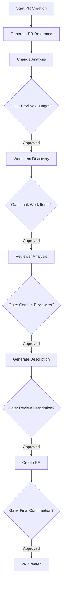

The PR Creation workflow automates Azure DevOps pull request generation, including change analysis, work item discovery, reviewer identification, and description drafting across a seven-phase pipeline with confirmation gates.

> The agent handles the entire PR lifecycle from diff analysis through creation, pausing at five confirmation gates so you retain full control over what gets submitted.

## When to Use

* 🚀 Feature branch is ready for review and you want a complete, well-linked PR
* 🐛 Bug fix is committed and you need to discover related work items automatically
* 📝 Documentation changes span multiple files and you want an organized change summary
* 🔗 Cross-project work requires linking to work items in another Azure DevOps project
* ⚡ Rapid iteration calls for draft PRs with automatic reviewer suggestions

## What It Does

1. Generates a PR reference file capturing the full diff between your source and base branches
2. Analyzes changes to produce a structured PR description with conventional commit formatting
3. Discovers related work items by searching Azure DevOps with keywords extracted from your changes
4. Identifies potential reviewers by analyzing git history for each changed file
5. Resolves reviewer Azure DevOps identities for automatic assignment
6. Presents five confirmation gates where you approve or adjust each section
7. Creates the pull request with linked work items, assigned reviewers, and the finalized description



> [!NOTE]
> PR Creation handles drafting and submitting the pull request. Code review, approval workflows, and merge operations are separate activities managed through your team's existing process.

### Confirmation Gates

The workflow pauses at five gates, each presenting a specific artifact for your review before proceeding.

| Gate   | What You Review                              | What You Can Change                                       |
|--------|----------------------------------------------|-----------------------------------------------------------|
| Gate 1 | Changed files with descriptions              | Remove accidental files, flag missing files               |
| Gate 2 | Discovered work items with relevance scores  | Select which items to link, skip linking entirely         |
| Gate 3 | Suggested reviewers with contribution scores | Add or remove reviewers, adjust from optional to required |
| Gate 4 | PR title and description                     | Edit title, revise description text, add notes            |
| Gate 5 | Final PR summary before creation             | Confirm or cancel the entire operation                    |

Pass the `noGates` input to skip all confirmation gates. In no-gates mode, the agent uses all discovered work items, assigns the top two reviewers by contribution score, and creates the PR immediately.

### Work Item Discovery

The agent extracts keywords from your changed file paths, commit messages, and diff content, then queries Azure DevOps using `mcp_ado_search_workitem`. Each discovered work item receives a similarity score based on title comparison, description overlap, and acceptance criteria alignment. Only items meeting the similarity threshold appear for your review.

When no existing work items match, the agent enters an automatic creation phase, generating a User Story or Bug based on your branch type and commit history. The created item links to the PR alongside any manually specified work item IDs.

## Output Artifacts

```text
.copilot-tracking/pr/new/<branch-name>/
├── pr-reference.xml       # Full diff between source and base branches
├── pr.md                  # Generated PR title and description
├── pr-analysis.md         # Work item discovery results with relevance scores
├── reviewer-analysis.md   # Reviewer candidates with contribution analysis
├── planning-log.md        # Phase-by-phase execution log
└── handoff.md             # Final state and action summary
```

## How to Use

### Option 1: Prompt Shortcut

Type a prompt describing your PR creation goal:

```text
Create a PR for my current branch against main in my Azure DevOps project
```

```text
Create a draft PR and link it to work item 1234
```

### Option 2: Handoff Button

Click the "Create PR" handoff button in the ADO Backlog Manager agent to launch with the standard prompt and default settings.

### Option 3: Direct Agent

Start a conversation with the ADO Backlog Manager agent and describe your pull request requirements. The agent detects the PR creation intent and enters the seven-phase workflow automatically.

## Example Prompts

Full PR with automated work item discovery:

```text
Create a pull request for my feature branch against develop. Search
for related work items in the Active and New states with a similarity
threshold of 0.7. Include:
- Conventional commit title based on the diff summary
- Work item links for all matched items
- Reviewer suggestions based on git blame history
```

PR with known work item IDs (skip discovery):

```text
Create a pull request linking work items #12345 and #12390. Target
the main branch. Use the commit messages to generate the description
and skip the work item discovery phase.
```

Draft PR with no confirmation gates:

```text
Create a draft pull request for my current branch against develop.
Skip confirmation gates and use a similarity threshold of 0.5 for
work item matching. Mark it as draft so it does not trigger required
reviewer policies.
```

**Output artifacts:** PR creation generates a PR reference file in `.copilot-tracking/pr/` and creates the pull request in Azure DevOps. Review the generated description at Gate 4 for accurate commit formatting and work item links before final submission.

## Tips

* ✅ Commit all changes before starting (the agent reads committed diffs, not staged files)
* ✅ Use draft mode for early feedback without triggering required reviewer policies
* ✅ Provide work item IDs directly when you already know the relevant items (skips discovery)
* ✅ Review the PR description in Gate 4 for accurate conventional commit formatting
* ❌ Do not skip Gate 1 when your branch includes generated files or build artifacts
* ❌ Do not ignore the similarity threshold setting when discovery returns too many results
* ❌ Do not assume reviewer suggestions are complete (the agent only analyzes git history)

## Common Pitfalls

| Pitfall                                            | Solution                                                          |
|----------------------------------------------------|-------------------------------------------------------------------|
| Agent cannot find the Azure DevOps project         | Verify the project name matches exactly, including capitalization |
| Work item discovery returns zero results           | Lower the similarity threshold or provide work item IDs manually  |
| Reviewer identity resolution fails                 | Check that reviewer emails match their Azure DevOps profile       |
| PR description includes changes not in your branch | Clear context and regenerate the PR reference file                |
| Gates appear when you expected no-gates mode       | Confirm the `noGates` input is set to true in your prompt         |

## Next Steps

1. Monitor your PR build status with the [Build Monitoring workflow](build-monitoring)
2. See [Using Workflows Together](using-together) for the full pipeline walkthrough

> [!TIP]
> Run `/clear` before starting PR creation if you were working in another workflow. The agent reads its own planning files, and residual context from other sessions can affect work item discovery results.

---

<!-- markdownlint-disable MD036 -->
*🤖 Crafted with precision by ✨Copilot following brilliant human instruction, then carefully refined by our team of discerning human reviewers.*
