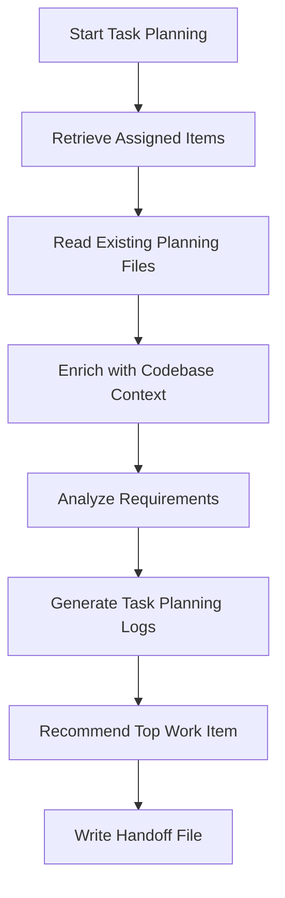

The Task Planning workflow retrieves your assigned Azure DevOps work items, enriches them with codebase context, decomposes them into implementation tasks, and organizes the results into structured planning files.

> The agent reads your backlog, maps each item to relevant code, generates task breakdowns with priority ordering, and produces a recommended starting point for your next coding session.

## When to Use

* 📋 Sprint planning preparation when you need to decompose assigned stories into tasks
* 🏔️ Breaking down epics or features into smaller, actionable work items
* 📅 Organizing your daily work queue with priority-ordered implementation plans
* 🔍 Reviewing assigned items to identify gaps, stale entries, or items needing updates
* 🔄 Refreshing planning files after backlog changes to keep local tracking current

## What It Does

1. Retrieves work items assigned to you using `mcp_ado_wit_my_work_items` with configurable filters
2. Reads planning files from previous sessions to maintain continuity across runs
3. Enriches each work item with codebase context through semantic search for related files
4. Analyzes requirements, acceptance criteria, and existing comments to build implementation context
5. Generates task planning logs with per-item breakdowns, priority ordering, and a recommended top work item
6. Produces a handoff file for downstream workflows (sprint planning, execution, or triage)



> [!NOTE]
> Task Planning focuses on decomposition and prioritization. It produces planning files consumed by Sprint Planning and Execution workflows. Running task planning before sprint planning gives the sprint planner richer context about each item.

### Planning File Structure

The workflow writes its output to a structured directory under `.copilot-tracking/workitems/`. Each planning session creates or updates files following a consistent template.

The `planning-log.md` tracks search terms used, work items discovered at each stage, and phase completion status. The `work-items.md` file serves as the source of truth for planned operations, listing each work item with its action (create, update, or no change), reference number, type, and summary. The `handoff.md` file packages actions for downstream automation.

Field conventions follow Azure DevOps work item types. User Stories carry title, description, acceptance criteria, story points, and priority. Bugs include repro steps, severity, and priority. Every work item preserves its area path, iteration path, and tags for organizational context.

### Work Item Operations

The agent supports creation, updates, batch operations, and linking through MCP ADO tools.

For retrieval, `mcp_ado_wit_get_work_item` and `mcp_ado_wit_get_work_items` (batch) hydrate work items with full field values. Batch retrieval reduces API calls when processing multiple items.

The search workflow uses `mcp_ado_search_workitem` with keyword groups composed from your codebase, commit messages, and existing work item fields. The search protocol supports OR/AND syntax and paging for large result sets.

New work items are created through `mcp_ado_wit_create_work_item`, and `mcp_ado_wit_add_child_work_items` decomposes a parent into child tasks. Created items inherit the parent's area path and iteration path unless you override them.

Field changes go through `mcp_ado_wit_update_work_item`, and `mcp_ado_wit_add_work_item_relation` handles linking related items. Comments posted through `mcp_ado_wit_create_work_item_comment` record implementation context directly on the work item.

## Output Artifacts

```text
.copilot-tracking/workitems/<planning-type>/<scope-name>/
├── planning-log.md          # Search terms, discovered items, and phase tracking
├── work-items.md            # Source of truth for planned operations
├── task-planning-logs.md    # Per-item breakdowns with priority ordering
└── handoff.md               # Actions packaged for downstream workflows
```

## How to Use

### Option 1: Prompt Shortcut

Invoke task planning with a direct prompt:

```text
Process my work items for task planning in my Azure DevOps project
```

```text
Plan tasks for my assigned items in the current sprint iteration
```

### Option 2: Handoff Button

Click the "Task Planning" handoff button in the ADO Backlog Manager agent to launch with the standard prompt and default configuration.

### Option 3: Direct Agent

Start a conversation with the ADO Backlog Manager agent and describe your planning goal. The agent recognizes task planning intent and enters the retrieve-enrich-plan pipeline automatically.

## Example Prompts

Full task planning for sprint work:

```text
Process my assigned work items for task planning. Include items in
Active and New states from the current sprint iteration. Enrich each
item with codebase context and recommend:
- Implementation sequence based on dependencies
- Risk areas from related recent changes
- The best starting point for today's work session
```

Tag-focused planning with priority boost:

```text
Process my assigned work items but focus on items tagged with
"api-redesign." Boost their priority above other items. Limit to
10 items and structure planning files by area path grouping.
```

Single work item deep planning:

```text
Plan implementation for work item #15432. Pull the full description,
acceptance criteria, and linked items from Azure DevOps. Enrich with
codebase context from the local workspace and generate a detailed
task breakdown.
```

**Output artifacts:** Task planning writes planning files to `.copilot-tracking/workitems/` containing the prioritized work item list, codebase enrichment results, and recommended start point. Review the enrichment accuracy before feeding output into other workflows.

## Tips

* ✅ Run task planning at the start of a sprint to generate fresh planning files from your current assignments
* ✅ Use the `boostTags` input to prioritize items matching specific tags
* ✅ Review the recommended top work item before starting your coding session
* ✅ Keep planning files current by re-running after backlog changes (reassignments, new items, state updates)
* ❌ Do not skip the enrichment phase (codebase context improves task decomposition accuracy)
* ❌ Do not edit planning files manually if you plan to re-run task planning (the agent overwrites them)
* ❌ Do not run task planning across multiple projects in a single session (scope to one project per run)

## Common Pitfalls

| Pitfall                                        | Solution                                                                               |
|------------------------------------------------|----------------------------------------------------------------------------------------|
| Agent retrieves no work items                  | Verify your Azure DevOps identity and check that items are assigned to you             |
| Codebase enrichment finds no related files     | Ensure the workspace contains the relevant repository (the agent searches local files) |
| Planning files are stale after backlog changes | Re-run task planning to refresh from current Azure DevOps state                        |
| Too many items returned                        | Use the `maxItems` input to cap results or filter by iteration path                    |
| Handoff file references outdated work item IDs | Clear the planning directory and regenerate from scratch                               |

## Next Steps

1. Feed your planning output into the [Discovery workflow](discovery.md) for work item analysis
2. See [Using Workflows Together](using-together.md) for the full pipeline walkthrough

> [!TIP]
> Combine task planning with the `forceTopId` input when you already know which work item to tackle first. The agent adjusts its recommendation and structures the remaining items accordingly.

---

<!-- markdownlint-disable MD036 -->
*🤖 Crafted with precision by ✨Copilot following brilliant human instruction, then carefully refined by our team of discerning human reviewers.*
