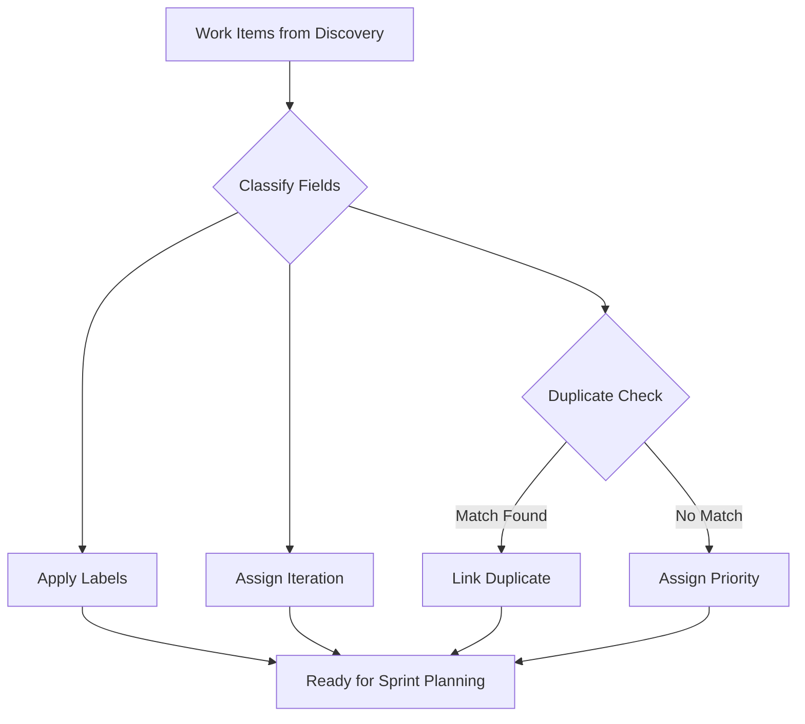

The Triage workflow classifies work items discovered in the previous phase, assigning Area Path, Priority, Severity (bugs), Tags, and Iteration Path while detecting duplicates and producing handoff files for sprint planning or direct execution.

## When to Use

* 🏷️ Work items need field classification after a discovery pass
* 🔁 Suspected duplicates require confirmation before resolution
* 📊 Preparing work item metadata for iteration assignment in sprint planning
* 🧹 Cleaning up a backlog with inconsistent or missing field values

## What It Does

1. Discovers available Area Paths and Iterations for the project
2. Fetches candidate work items matching triage trigger criteria
3. Hydrates full field details for each candidate
4. Classifies each work item across five dimensions
5. Detects duplicates by comparing work items across similarity dimensions
6. Produces triage recommendations with reasoning for each classification

> [!NOTE]
> Triage recommendations are proposals, not automatic changes. The execution workflow applies field assignments and resolves duplicates only after you review and approve the handoff file.



## Five-Dimensional Classification

The triage workflow classifies each work item across five dimensions:

### Area Path

Content analysis of title and description identifies component, feature area, or team references. The workflow maps each work item to the closest matching Area Path from discovered patterns in the project.

### Priority

Reclassifies from the default value of 2 based on content analysis:

| Priority | Criteria                                                          |
|----------|-------------------------------------------------------------------|
| 1        | Critical or blocking: production outage, data loss, security flaw |
| 2        | Default or unclassified: requires content analysis to reclassify  |
| 3        | Standard: functional improvement, moderate impact                 |
| 4        | Nice-to-have: cosmetic, minor convenience, low impact             |

### Severity (Bugs Only)

Applied only when `System.WorkItemType` is `Bug`:

| Severity | Criteria                                                    |
|----------|-------------------------------------------------------------|
| 1        | System crash, data loss, or complete feature unavailability |
| 2        | Major feature broken with no workaround                     |
| 3        | Minor impact with viable workaround                         |
| 4        | Cosmetic or trivial issue                                   |

### Tags

Keywords from title and description are cross-referenced against existing tags in the project. Tags align with the established taxonomy rather than inventing new ones.

### Iteration Path

Assignment uses priority as the primary signal: Priority 1 items target the current iteration, Priority 3-4 items target the next iteration, and Priority 2 items require content analysis before assignment.

## Triage Trigger Criteria

Work items qualify for triage automatically when they meet any of these conditions:

* State is `New` and Area Path equals the project root (no sub-path assigned)
* State is `New` and Priority remains at the default value of 2 without explicit assignment
* State is `New` and Tags is empty

## Duplicate Detection

Duplicate detection compares work items across multiple dimensions:

* Title similarity using normalized keyword matching
* Description overlap through content comparison
* Field alignment to identify functionally equivalent items
* Parent-child relationships to catch split work items

When confidence exceeds the threshold, the workflow links the duplicate pair in its recommendation file and suggests which item to keep based on age, completeness, and discussion activity.

## Output Artifacts

```text
.copilot-tracking/workitems/triage/<YYYY-MM-DD>/
├── planning-log.md    # Progress tracking and analysis results
└── work-items.md      # Classification suggestions, duplicate findings, and recommended operations
```

The triage plan includes reasoning for each classification, making it possible to adjust recommendations before execution applies them.

## How to Use

### Option 1: Prompt Shortcut

```text
Triage the work items discovered in my latest discovery session
```

```text
Check for duplicates in my project's New state work items
```

### Option 2: Handoff Button

Click the "Triage" handoff button in the ADO Backlog Manager agent after completing a discovery pass.

### Option 3: Direct Agent

Attach or reference the discovery output files when starting a triage conversation. The agent reads the analysis and begins classification automatically.

## Example Prompts

Full triage from latest discovery:

```text
Triage all work items from my latest discovery pass. For each item:
- Assign Area Paths based on title and description analysis
- Reclassify priorities from the default Priority 2
- Flag potential duplicates with confidence scores above 0.6
- Recommend state transitions for stale items
```

Duplicate-focused triage:

```text
Triage the discovery output and focus on duplicate detection. Use a
similarity threshold of 0.8 and compare across all work item types.
Skip Area Path and Priority reclassification for this pass.
```

Targeted field assignment:

```text
Triage discovery results but limit changes to Area Path assignments
only. Do not modify priorities or flag duplicates. Apply the
Infrastructure/Backend area path to any item mentioning API or
service layer changes.
```

**Output artifacts:** Triage creates a handoff file in `.copilot-tracking/workitems/triage/` with checkbox-formatted recommendations. Review duplicate pairs and confidence scores before passing the handoff to execution.

## Tips

* ✅ Run discovery first to build a complete work item inventory before you triage
* ✅ Review duplicate pairs before approving resolution recommendations
* ✅ Adjust classification suggestions in the handoff file before passing to execution
* ✅ Use the confidence scores to prioritize which recommendations to review first
* ❌ Do not triage items you have not discovered (the workflow needs analysis files as input)
* ❌ Do not auto-approve all triage recommendations without reviewing confidence scores
* ❌ Do not modify the handoff file format (execution depends on the checkbox structure)
* ❌ Do not run triage and execution in the same session without clearing context

## Common Pitfalls

| Pitfall                               | Solution                                                                     |
|---------------------------------------|------------------------------------------------------------------------------|
| Low confidence on classifications     | Provide more context in the work item description or add manual field values |
| False-positive duplicate matches      | Review the similarity dimensions and adjust the confidence threshold         |
| Missing Area Paths from project       | Verify the Area Path exists in the project settings before expecting triage  |
| Triage conflicts with existing fields | The workflow flags conflicts rather than overwriting existing field values   |
| Default Priority 2 not reclassified   | Content analysis requires meaningful title and description text              |

## Next Steps

1. Review and adjust the triage handoff file before proceeding
2. Move to [Sprint Planning](sprint-planning.md) to assign iterations, or skip directly to [Execution](execution.md) for field-only changes

> [!TIP]
> For projects with custom field schemes, verify Area Paths and Iteration Paths in project settings before running triage. The workflow applies whatever classification structures exist in the project, so mismatches produce irrelevant suggestions.

---

<!-- markdownlint-disable MD036 -->
*🤖 Crafted with precision by ✨Copilot following brilliant human instruction,
then carefully refined by our team of discerning human reviewers.*
<!-- markdownlint-enable MD036 -->
