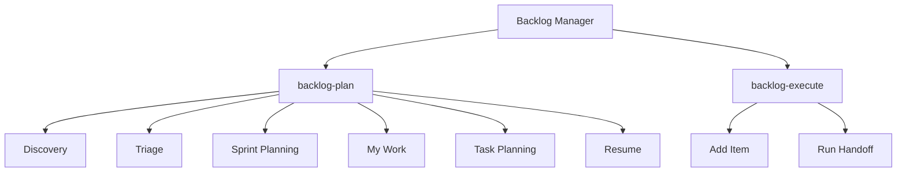

Backlog management automates the work item lifecycle across Azure DevOps, GitHub, and Jira. One set of workflows serves all three trackers: the commands resolve which tracker backs your workspace at runtime and read the matching platform reference, so you do not choose a platform-specific variant.

> Backlog management is a constraint-satisfaction problem. Each workflow handles a bounded scope, reducing errors by limiting the decisions any single step makes.

## Two Commands, One Split

The workflows divide on a single boundary: whether they change anything in your tracker.

| Command                                                                         | Mutates a tracker | Covers                                                                   |
|---------------------------------------------------------------------------------|-------------------|--------------------------------------------------------------------------|
| [`backlog-plan`](../../reference/skills/project-planning/backlog-plan.md)       | No                | Discovery, triage, sprint planning, assigned work, task planning, resume |
| [`backlog-execute`](../../reference/skills/project-planning/backlog-execute.md) | Yes               | Single-item creation, and applying a reviewed handoff file               |

`backlog-plan` reads from the tracker and writes planning files. Every create, update, transition, link, close, and comment belongs to `backlog-execute`. That separation is what makes it safe to explore a backlog without a confirmation prompt on every step.

The [Backlog Manager](../project-planning/README.md) agent orchestrates both across a longer session; the [Functional Planner](../project-planning/README.md) agent turns a PRD into a planned hierarchy before anything reaches a tracker.

## How the Platform Is Resolved

You do not declare a platform. The skill resolves it from your workspace, then runs a preflight for that platform before its first call.

| Platform     | Resolution signal                                                      | Access mechanism                             |
|--------------|------------------------------------------------------------------------|----------------------------------------------|
| Azure DevOps | ADO remote, existing `.copilot-tracking/workitems/`                    | MCP server                                   |
| GitHub       | GitHub remote, existing `.copilot-tracking/github-issues/`             | MCP server                                   |
| Jira         | Configured Jira environment, existing `.copilot-tracking/jira-issues/` | Environment credentials via the `jira` skill |

When the signals are ambiguous, the workflow states its inference and asks you to confirm before touching anything. See [MCP Configuration](../../getting-started/mcp-configuration.md) for server setup, and the `jira` skill's Credential Setup section for Jira.

> [!NOTE]
> GitLab is not a backlog tracker in this model. The `gitlab` skill covers merge request and pipeline inspection for delivery context.

## The Workflows

### Discovery workflow

Finds and categorizes work from a user request, a set of documents, or a search. Three paths cover different starting points: user-centric (work assigned to you), artifact-driven (documents, branches, and commits mapped to existing items), and search-based (criteria-driven queries). Discovery produces analysis files that feed triage.

See the [Discovery workflow guide](discovery.md).

### Triage workflow

Classifies existing items and recommends field, label, priority, and status changes. Duplicate detection compares items across several similarity dimensions before noise accumulates.

See the [Triage workflow guide](triage.md).

### Sprint Planning workflow

Organizes items into the platform's iteration container with coverage analysis, capacity tracking, and gap detection. A hierarchy coverage matrix analyzes decomposition completeness across levels.

See the [Sprint Planning workflow guide](sprint-planning.md).

### My Work and Task Planning workflow

Retrieves the work assigned to you, then enriches it into an implementation-ready handoff with an ordered recommendation and reasoning. These are two stages of one flow: retrieve, then enrich.

See the [Task Planning workflow guide](task-planning.md).

### Execution workflow

Consumes a reviewed handoff file and applies the planned operations in sequence, tracking each with checkbox progress and per-operation logging. Content sanitization strips internal tracking references before any API call.

See the [Execution workflow guide](execution.md).

### Single Item workflow

Creates one item through guided field collection without running the full pipeline. Item types are discovered from your tracker rather than assumed, because the available types differ by platform and by project.

### Resume workflow

Rebuilds context from the durable planning artifacts and continues an interrupted workflow without duplicating completed work.

## Platform Differences

The workflows are the same on every platform. What differs is the vocabulary each tracker uses and a small number of genuine capability gaps.

### Container and field bindings

| Concept             | Azure DevOps                   | GitHub                             | Jira                                      |
|---------------------|--------------------------------|------------------------------------|-------------------------------------------|
| Iteration container | Iteration Path                 | Milestone                          | Sprint                                    |
| Categorization      | Area Path, Tags                | Labels                             | Components, Labels                        |
| Effort              | Story Points                   | *No native field*                  | Story Points (instance-specific field ID) |
| Priority            | Priority, Severity (bugs)      | Label convention                   | Priority                                  |
| Tracking root       | `.copilot-tracking/workitems/` | `.copilot-tracking/github-issues/` | `.copilot-tracking/jira-issues/`          |

### Capability gaps worth knowing

* **GitHub has no native effort field.** Capacity analysis reports item counts unless you supply a size-label convention.
* **A GitHub milestone has no start date.** The sprint window must be derived, and the derivation is recorded in the planning file so the basis is visible.
* **Jira story points, sprint, and burndown fields are instance-assigned custom field IDs.** They are confirmed through field discovery rather than assumed, because the IDs differ per Jira instance.
* **Azure DevOps content format varies by host.** Azure DevOps Services uses Markdown; Azure DevOps Server uses HTML. The format is detected from the organization URL and the matching template variant is applied automatically.

### Delivery workflows are Azure DevOps only

Pull request creation and build monitoring are not backlog workflows and are not part of these commands. They ship as prompts in the `hve-core` collection:

* `/ado-create-pull-request` creates an Azure DevOps PR with a generated description, linked work items, and reviewers.
* `/ado-get-build-info` retrieves pipeline status and logs by PR, build ID, or branch.

## Autonomy Levels

Three tiers control which operations proceed automatically and which pause for approval. Only `backlog-execute` is affected; `backlog-plan` never mutates a tracker, so it has nothing to gate.

| Tier              | Field and label updates | Iteration assignment | Create | Transition and close |
|-------------------|-------------------------|----------------------|--------|----------------------|
| Full              | Auto                    | Auto                 | Auto   | Auto                 |
| Partial (default) | Auto                    | Gate                 | Gate   | Gate                 |
| Manual            | Gate                    | Gate                 | Gate   | Gate                 |

Partial is the default: classification applies automatically while creation, iteration assignment, and state changes wait for review. Autonomy gates per-operation approval only. It never waives the inferred-platform confirmation, the content sanitization guards, or a required human review.

## When to Use

| Use backlog management when...                  | Manage manually when...                  |
|-------------------------------------------------|------------------------------------------|
| Managing more than 20 open items                | Working with fewer than 10 items         |
| Multiple contributors need consistent triage    | Single contributor with full context     |
| Sprint planning requires iteration organization | No iteration-based planning process      |
| PRD-to-work-item conversion is needed           | Requirements are already decomposed      |
| Field consistency matters for reporting         | Ad-hoc classification suits the workflow |

## Quick Start

1. Configure the server or credentials for your tracker. See [MCP Configuration](../../getting-started/mcp-configuration.md).
2. Run `/backlog-plan my-work` to retrieve your assigned work.
3. Review the planning output, then run `/backlog-plan task-plan` to enrich it into a handoff.
4. Run `/backlog-execute run` against the reviewed handoff when you are ready to apply changes.

> [!IMPORTANT]
> Clear context between workflows by typing `/clear`. Each workflow operates independently, and mixing contexts produces unreliable results.

## Next Steps

* [Discovery](discovery.md): Find and categorize work from requests, documents, or search
* [Triage](triage.md): Classify fields and detect duplicates
* [Sprint Planning](sprint-planning.md): Organize work into the platform's iteration container
* [Task Planning](task-planning.md): Retrieve assigned work and enrich it into a handoff
* [Execution](execution.md): Apply planned operations from a handoff file
* [Using Workflows Together](using-together.md): End-to-end pipeline walkthrough
* [Why Backlog Management Works](why-backlog-management.md): Design rationale and quality comparison

---

<!-- markdownlint-disable MD036 -->
*🤖 Crafted with precision by ✨Copilot following brilliant human instruction,
then carefully refined by our team of discerning human reviewers.*
<!-- markdownlint-enable MD036 -->
