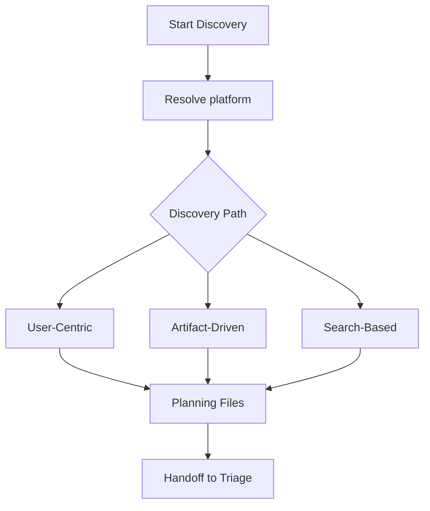

The Discovery workflow finds and categorizes work from multiple sources, producing structured analysis files that feed triage and planning. It is read-only: discovery never creates or modifies an item.

Run it with `/backlog-plan discover`.

## When to Use

* 🆕 Starting a new sprint and need to survey open work
* 👤 Reviewing work assigned to you or your team before a planning session
* 🔀 Code changes on a feature branch that may relate to existing backlog items
* 🔍 Searching for items matching specific criteria
* 📄 Documents or PRDs that need mapping to existing items

## What It Does

1. Resolves the backing tracker and runs its preflight
2. Identifies items through one of three discovery paths
3. Retrieves full item metadata using the platform's field vocabulary
4. Categorizes items by type, area, and current state
5. Produces structured analysis files with summaries and recommendations
6. Flags items that may need triage attention: unclassified, stale, or missing field values

> [!NOTE]
> Discovery is deliberately separated from triage. Finding work and deciding what to do with it are different cognitive tasks. Running them in a single pass increases the chance of misclassification.



## The Three Discovery Paths

### User-Centric Discovery

Finds items assigned to or recently modified by a specific user. Ideal for sprint preparation, where you need to see your current backlog before planning new work. When an iteration is specified, results are scoped to that sprint instead.

### Artifact-Driven Discovery

Analyzes local documents, branches, and commits, then maps them to existing items. This surfaces work related to what you are doing now, helping you avoid duplicate effort and identify items your changes may resolve. The workflow reads git diff output or document content and searches for matches by keyword, component area, and description overlap.

### Search-Based Discovery

Queries the tracker using criteria you define: types, states, areas, keywords, or any combination. This handles broad inventory tasks, such as finding everything unassigned, all bugs in one area, or all new items without categorization.

## Platform Differences

The three paths are identical everywhere. The query surface underneath differs.

| Aspect                 | Azure DevOps                       | GitHub                      | Jira                                                 |
|------------------------|------------------------------------|-----------------------------|------------------------------------------------------|
| Assigned-work query    | `wit_my_work_items`                | `assignee:@me` issue search | Jira Query Language (JQL) `assignee = currentUser()` |
| Iteration-scoped query | `wit_get_work_items_for_iteration` | Milestone filter            | JQL `sprint in openSprints()`                        |
| Free-text search       | `search_workitem`                  | Issue search qualifiers     | JQL text operators                                   |
| Categorization read    | Area Path, Tags, Priority          | Labels                      | Components, Labels, Priority                         |

> [!NOTE]
> Jira field availability varies by instance. Custom fields such as story points carry instance-assigned IDs, so the workflow discovers them rather than assuming a fixed name.

## Output Artifacts

Discovery writes to the tracking root for the resolved platform: `.copilot-tracking/workitems/` for Azure DevOps, `.copilot-tracking/github-issues/` for GitHub, `.copilot-tracking/jira-issues/` for Jira.

Two of the four file names are platform bindings rather than fixed names. Resolve them from the Platform Binding Resolution table in the `backlog-management` skill before reading or writing:

| File             | Azure DevOps           | GitHub              | Jira                |
|------------------|------------------------|---------------------|---------------------|
| Progress log     | `planning-log.md`      | `planning-log.md`   | `planning-log.md`   |
| Analysis file    | `artifact-analysis.md` | `issue-analysis.md` | `issue-analysis.md` |
| Plan file        | `work-items.md`        | `issues-plan.md`    | `issues-plan.md`    |
| Reviewed handoff | `handoff.md`           | `handoff.md`        | `handoff.md`        |

The analysis and plan names above are the discovery bindings. The PRD-to-work-item path resolves different names on Jira, so do not carry these across workflows.

Discovery output files, all written under `<tracking-root>/discovery/<scope-name>/`:

* `planning-log.md`: search terms, discovered items, and phase tracking.
* The resolved analysis file: extracted requirements and field values. Artifact-driven path only.
* The resolved plan file: the source of truth for planned operations. Artifact-driven path only.
* `handoff.md`: the reviewed summary the next workflow consumes.

```text
<tracking-root>/discovery/<scope-name>/
├── planning-log.md       # Search terms, discovered items, and phase tracking
├── <analysis-file>.md    # Extracted requirements and field values (artifact-driven only)
├── <plan-file>.md        # Source of truth for planned operations (artifact-driven only)
└── handoff.md            # Reviewed summary for the next workflow
```

## Next Steps

* [Triage](triage.md): Classify the items discovery surfaced
* [Sprint Planning](sprint-planning.md): Organize discovered work into an iteration
* [Using Workflows Together](using-together.md): End-to-end pipeline walkthrough

---

<!-- markdownlint-disable MD036 -->
*🤖 Crafted with precision by ✨Copilot following brilliant human instruction,
then carefully refined by our team of discerning human reviewers.*
<!-- markdownlint-enable MD036 -->
