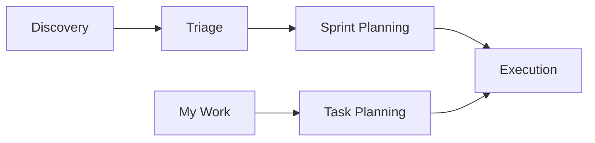

Individual workflows are useful alone. Chained, they form a pipeline where each stage consumes the reviewed output of the last, so decisions are made once and carried forward in a file rather than in memory.

## The Pipeline



Every arrow is a handoff file you review before continuing. Nothing advances automatically.

## A Full Pass

### 1. Survey the backlog

```text
/backlog-plan discover
```

The workflow resolves your tracker, runs its preflight, and asks which discovery path fits. Choose the search-based path for a broad inventory. Review the analysis file it produces before continuing.

### 2. Classify what you found

```text
/clear
/backlog-plan triage
```

Point triage at the discovery handoff. It classifies each item, flags duplicate candidates with per-dimension reasoning, and writes recommendations. Read the duplicates file carefully; ambiguous pairs are gated for you regardless of autonomy tier.

### 3. Organize into an iteration

```text
/clear
/backlog-plan sprint
```

Sprint planning discovers the target iteration, derives its window, and maps classified items into it with coverage and capacity analysis. On GitHub, check the derived window basis recorded in the planning file, since a milestone carries no start date.

### 4. Apply the changes

```text
/clear
/backlog-execute run --dry-run
```

Run the dry-run first. It validates the full sequence and reports exactly what would change without making a call. When the preview matches your intent, run it for real:

```text
/backlog-execute run
```

> [!IMPORTANT]
> Clear context between workflows with `/clear`. Each workflow operates independently, and mixing contexts produces unreliable results.

## The Shorter Daily Loop

Most days do not need the full pipeline.

```text
/backlog-plan my-work
/backlog-plan task-plan
```

Retrieval refreshes your assigned set; enrichment hydrates it with context and comment history, then produces an ordered plan with a top recommendation and the reasoning behind it.

## Resuming After an Interruption

```text
/backlog-plan resume
```

Resume reads the durable planning artifacts, rebuilds context, and reports where the workflow stopped. Because execution logs each operation as it completes, resuming an interrupted execution skips completed work and rebuilds temporary identifiers rather than creating duplicates.

## Where Handoff Files Live

All artifacts sit under the tracking root for the resolved platform.

| Platform     | Tracking root                      |
|--------------|------------------------------------|
| Azure DevOps | `.copilot-tracking/workitems/`     |
| GitHub       | `.copilot-tracking/github-issues/` |
| Jira         | `.copilot-tracking/jira-issues/`   |

The handoff file is the contract between stages. It is plain Markdown, so correcting a recommendation you disagree with is a line edit before the next stage runs, not a tracker correction afterward.

## Related Workflows

* **PRD to hierarchy.** The [Functional Planner](../project-planning/README.md) agent converts a requirements document into a planned hierarchy without touching a tracker. Its output feeds `backlog-execute` after review.
* **Azure DevOps delivery.** `/ado-create-pull-request` and `/ado-get-build-info` handle pull requests and pipeline status. They are delivery workflows in the `hve-core` collection, not backlog workflows.

## Next Steps

* [Why Backlog Management Works](why-backlog-management.md): The reasoning behind the separation
* [Execution](execution.md): The safety protocols that gate tracker changes

---

<!-- markdownlint-disable MD036 -->
*🤖 Crafted with precision by ✨Copilot following brilliant human instruction,
then carefully refined by our team of discerning human reviewers.*
<!-- markdownlint-enable MD036 -->
