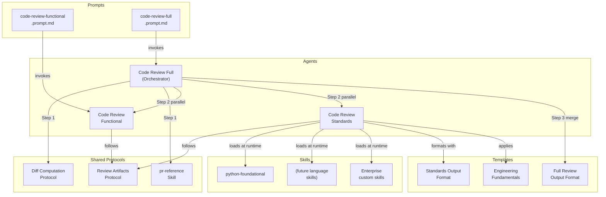
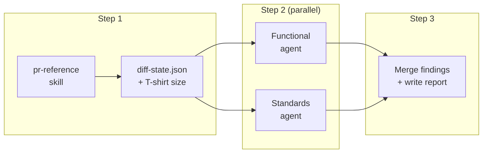

The code review system provides two complementary review passes that run before you open a pull request. A functional review catches logic errors, edge cases, and error handling gaps. A standards review enforces project-defined coding conventions through dynamically loaded skills. An orchestrator agent combines both into a single merged report.

> Most review feedback arrives after a PR is already open, when context switching and rework costs are highest. Running these agents on a local branch before pushing catches issues while the code is still fresh.

## Why Pre-PR Code Review?

| Benefit                       | Description                                                                                |
|-------------------------------|--------------------------------------------------------------------------------------------|
| Earlier defect detection      | Catches functional bugs on the branch, before reviewers spend time on a PR                 |
| Consistent standards coverage | Every diff gets the same skill-based analysis regardless of which reviewer picks up the PR |
| Extensible language support   | Teams add their own skills without modifying the review agents                             |
| Actionable output             | Every finding includes file paths, line numbers, current code, and a suggested fix         |

> [!TIP]
> New to hve-core code review? Start with the [functional review prompt](#functional-review) on your current branch to see the output format, then move to the [full orchestrated review](#full-orchestrated-review) once you are comfortable with the workflow.

## Architecture



The orchestrator computes the diff once in Step 1 using the pr-reference skill, writes a shared `diff-state.json`, then dispatches both subagents in parallel in Step 2. Each subagent writes structured JSON findings to disk. In Step 3, the orchestrator reads both findings files and merges them into a single deduplicated report using the full review output format template.

## The Three Agents

> [!NOTE]
> The Functional and Standards agents are dual-mode: they operate independently when invoked from the Chat panel and run as subagents with lane boundaries when the orchestrator dispatches them. This differs from the separate-file subagent pattern used elsewhere in the repo (e.g., RPI's dedicated subagent files). The dual-mode design avoids duplicating agent definitions while supporting both standalone and orchestrated use.

### Code Review Functional

Analyzes branch diffs for functional correctness across five focus areas:

| Focus Area     | What It Catches                                                                   |
|----------------|-----------------------------------------------------------------------------------|
| Logic          | Incorrect control flow, wrong boolean conditions, off-by-one errors               |
| Edge Cases     | Unhandled boundaries, missing null checks, empty collection handling              |
| Error Handling | Uncaught exceptions, swallowed errors, resource cleanup gaps                      |
| Concurrency    | Race conditions, deadlock potential, shared mutable state without synchronization |
| Contract       | API misuse, type mismatches at boundaries, violated preconditions                 |

Findings are severity-ordered (Critical, High, Medium, Low) with concrete code fixes. The agent includes false positive mitigation filters to keep noise low.

### Code Review Standards

Enforces project-defined coding standards through dynamically loaded skills. The agent is language-agnostic: it scans the workspace for `**/SKILL.md` files, matches them against the languages in the diff, and loads up to 8 relevant skills per review.

Skills provide the domain-specific checklists. The standards agent provides the review protocol, output format, and verdict logic. See [Language Skills](language-skills.md) for details on the built-in skills and how to create your own.

### Code Review Full (Orchestrator)

Runs both agents in parallel and produces a merged report:

| Step              | What happens                                                                                                                                                                             |
|-------------------|------------------------------------------------------------------------------------------------------------------------------------------------------------------------------------------|
| Compute Diff      | Generates a structured XML diff via the pr-reference skill, captures working-tree changes, and writes `diff-state.json` with branch metadata, file list, and T-shirt size classification |
| Parallel Dispatch | Dispatches Functional and Standards subagents simultaneously with lane directives that prevent overlapping findings (functional correctness vs skill-backed standards)                   |
| Merge Report      | Reads both subagents' structured JSON findings, applies transformation rules (deduplication, severity sorting, source tagging), and writes a merged `review.md` plus `metadata.json`     |

The orchestrator classifies review size into T-shirt tiers (XS through XL) and adapts its strategy accordingly. Small reviews dispatch a single pair of subagents. Large reviews (50+ files) split the file list into batches with one Functional + Standards pair per batch.

Lane directives in the dispatch prompts tell each subagent what to focus on and what to skip, reducing duplicate findings in the merged output. The Functional agent covers logic, edge cases, and contract violations. The Standards agent covers skill-backed coding conventions.

The merged report includes severity-tagged findings from both sources, a unified changed files table, combined testing recommendations, and acceptance criteria coverage when a story reference is provided.

## How the Orchestrated Review Works



The orchestrator's three steps are visible to the user through progress announcements emitted at each stage:

| Step | Announcement       | What happens                                                                                                                         |
|------|--------------------|--------------------------------------------------------------------------------------------------------------------------------------|
| 1    | Diff computed      | pr-reference generates a structured XML diff; the orchestrator writes `diff-state.json` with file list, extensions, and T-shirt size |
| 2a   | Reviews dispatched | Both agents start in parallel with lane directives                                                                                   |
| 2b   | Reviews complete   | Both agents have written JSON findings to disk                                                                                       |
| 3    | Merged report      | Findings are deduplicated, severity-sorted, source-tagged, and written as `review.md` + `metadata.json`                              |

### T-Shirt Size Classification

The orchestrator classifies each review to choose the right dispatch strategy:

| Size | Files | Diff Lines  | Strategy                             |
|------|-------|-------------|--------------------------------------|
| XS   | &lt;5 | &lt;100     | Single parallel pair                 |
| S    | 5-19  | 100-399     | Single parallel pair                 |
| M    | 20-49 | 400-999     | Single parallel pair                 |
| L    | 50-99 | 1,000-2,999 | Batches of 30 files per pair         |
| XL   | 100+  | 3,000+      | Multi-round batches, high-risk first |

When files and lines fall in different tiers, the orchestrator uses the smaller tier to avoid over-batching.

## Usage

### Full Orchestrated Review

Run both reviews in a single pass:

```text
/code-review-full
```

Pass a work item reference to enable acceptance criteria coverage:

```text
/code-review-full story=AB#456
```

The orchestrator passes the story reference to the Standards agent, which includes an Acceptance Criteria Coverage table in its report.

### Functional Review

Run the functional review prompt from the Copilot Chat panel:

```text
/code-review-functional
```

Optionally specify a base branch:

```text
/code-review-functional baseBranch=origin/develop
```

Defaults to `origin/main` when no base branch is specified.

### Standards Review

The standards review does not have a standalone prompt. Invoke the Code Review Standards agent directly from the Copilot Chat panel and describe what you want reviewed. The agent detects the diff automatically using the diff computation protocol.

## Review Output

Both agents produce severity-ordered findings. Each finding includes:

* A descriptive title and severity level (Critical, High, Medium, Low)
* The file path and line range where the issue appears
* The current code from the diff that has the issue
* A suggested fix with replacement code
* The category and (for standards findings) the skill that surfaced the finding
* A source tag (`[Functional]` or `[Standards]`) in orchestrated mode

### Structured JSON Contracts

When running under the orchestrator, subagents write findings as structured JSON rather than markdown. This enables deterministic merging without LLM re-parsing. The JSON schema is defined in the [Full Review Output Format](../../templates/full-review-output-format) template, which both the orchestrator and subagents reference as the authoritative data contract.

The data flow through the orchestrator:

```text
diff-state.json          (orchestrator writes, subagents read)
  ↓
functional-findings.json (functional subagent writes)
standards-findings.json  (standards subagent writes)
  ↓
review.md + metadata.json (orchestrator merges and writes)
```

### Lane Separation

The orchestrator's dispatch prompts include lane directives that tell each subagent what to focus on and what to skip:

| Subagent   | In-lane                                                                    | Out-of-lane                                                                       |
|------------|----------------------------------------------------------------------------|-----------------------------------------------------------------------------------|
| Functional | Logic errors, edge cases, error handling, concurrency, contract violations | Coding style, naming conventions, skill-backed standards                          |
| Standards  | Skill-backed coding standards violations                                   | Logic errors, edge cases, behavioral bugs (unless a skill explicitly covers them) |

This reduces duplicate findings in the merged report and keeps each subagent focused on its domain.

### Verdict Scale

| Condition                     | Verdict               |
|-------------------------------|-----------------------|
| Any Critical or High findings | Request changes       |
| Only Medium or Low findings   | Approve with comments |
| No findings                   | Approve               |

The orchestrator uses the stricter verdict when merging: if either subagent would request changes, the merged report requests changes.

### Artifact Persistence

Review artifacts are saved to `.copilot-tracking/reviews/code-reviews/{branch-slug}/` with two files:

* `review.md`: the full review report in the standards output format
* `metadata.json`: a machine-readable summary for automation

The `metadata.json` file contains fields that CI pipelines, pre-commit hooks, and custom scripts can consume:

```json
{
  "schema_version": "1",
  "branch": "feat/my-feature",
  "head_commit": "abc123...",
  "reviewed_at": "2026-03-28T15:30:00Z",
  "verdict": "request_changes",
  "files_changed": ["src/main.py", "src/utils.py"],
  "findings_count": {
    "critical": 0,
    "high": 2,
    "medium": 1,
    "low": 0
  },
  "reviewer": "code-review-full"
}
```

The `verdict` field holds one of three values: `approve`, `approve_with_comments`, or `request_changes`. A pre-commit hook can read this file and block commits when the verdict is `request_changes`, ensuring review findings are addressed before code leaves the local branch. For example:

```bash
verdict=$(jq -r '.verdict' .copilot-tracking/reviews/code-reviews/*/metadata.json 2>/dev/null)
if [ "$verdict" = "request_changes" ]; then
  echo "Code review requires changes. Fix findings before committing."
  exit 1
fi
```

## What You Need

| Requirement         | Details                                                               |
|---------------------|-----------------------------------------------------------------------|
| VS Code + Copilot   | GitHub Copilot Chat with agent mode enabled                           |
| Git branch          | A local branch with commits ahead of the base branch                  |
| hve-core collection | The `coding-standards` or `hve-core-all` collection installed         |
| pr-reference skill  | Included in the `coding-standards` collection; generates the XML diff |

The agents work with any programming language. Standards enforcement requires skills that match the languages in your diff. If no matching skills are found, the standards agent notes the gap and restricts its verdict.

## Extending with Custom Skills

The standards agent discovers skills dynamically at review time. You extend coverage by adding `SKILL.md` files to your repository without modifying the agent itself. See [Language Skills](language-skills.md) for the full guide on built-in skills, skill stacking, and authoring enterprise-specific standards.

<!-- markdownlint-disable MD036 -->
*🤖 Crafted with precision by ✨Copilot following brilliant human instruction,
then carefully refined by our team of discerning human reviewers.*
<!-- markdownlint-enable MD036 -->
