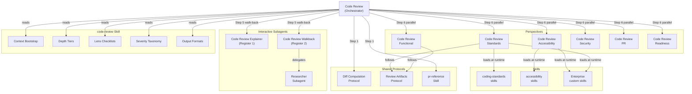
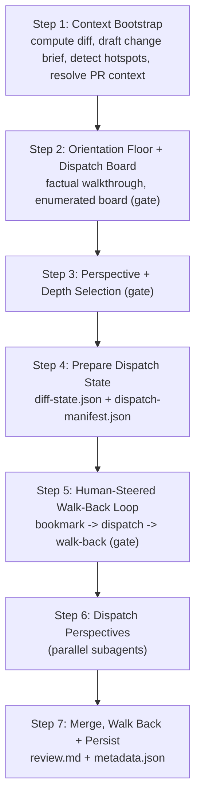

The code review system is a single human-gated agent that reviews your changes before you open a pull request. It bootstraps the change context once, confirms scope with you, lets you choose which perspectives run and how deeply, dispatches each chosen perspective to a thin skill-backed subagent, and merges every perspective into one report.

> Most review feedback arrives after a PR is already open, when context switching and rework costs are highest. Running the agent on a local branch before pushing catches issues while the code is still fresh.

## Why Pre-PR Code Review?

| Benefit                       | Description                                                                                        |
|-------------------------------|----------------------------------------------------------------------------------------------------|
| Earlier defect detection      | Catches functional bugs on the branch, before reviewers spend time on a PR                         |
| Consistent standards coverage | Every diff gets the same skill-based analysis regardless of which reviewer picks up the PR         |
| Multiple perspectives         | One run can cover functional, standards, accessibility, security, PR-level, and readiness concerns |
| Extensible language support   | Teams add their own skills without modifying the review agent                                      |
| Actionable output             | Every finding includes file paths, line numbers, current code, and a suggested fix                 |

> [!TIP]
> New to hve-core code review? Run the **Code Review** agent on your current branch with the `standard` depth tier and one or two perspectives to see the output format, then add perspectives or raise the depth as you get comfortable with the workflow.

## Architecture



The orchestrator computes the diff once in Step 1 using the `pr-reference` skill, writes a shared `diff-state.json`, then builds a factual orientation walkthrough and an enumerated dispatch board.
During the interactive walk-back loop it routes the human's questions to the Code Review Explainer (factual) or Code Review Walkback (deep research) before dispatching the selected perspective subagents concurrently.
Each subagent writes structured JSON findings to disk. The orchestrator reads every findings file and merges them into a single deduplicated report.

## The Orchestrator and Its Perspectives

A single user-invocable **Code Review** agent orchestrates the review. It owns the human-gated flow and dispatches one thin subagent per selected perspective. Perspective selection (which lanes run) and depth level (how deeply each lane verifies) are independent choices.

| Perspective     | Subagent                  | Lane focus                                                                                                                 |
|-----------------|---------------------------|----------------------------------------------------------------------------------------------------------------------------|
| `functional`    | Code Review Functional    | Logic, edge cases, error handling, concurrency, contract correctness                                                       |
| `standards`     | Code Review Standards     | Project coding standards traceable to loaded `coding-standards` skills                                                     |
| `accessibility` | Code Review Accessibility | Accessibility conformance traceable to loaded `accessibility` skills                                                       |
| `security`      | Code Review Security      | Authn/authz, input validation, secrets, injection, deserialization paths                                                   |
| `pr`            | Code Review PR            | PR-level summary, scope hygiene, validation evidence, follow-up items                                                      |
| `readiness`     | Code Review Readiness     | Non-code: PR description accuracy, linked-issue alignment, checkbox and mergeable readiness, changed-documentation content |
| `full`          | all of the above          | Runs every perspective and synthesizes one merged assessment                                                               |

The `security` and `accessibility` perspectives are self-contained and skill-backed. They source their review logic from the `code-review` and domain skills and do not call into the standalone Security Reviewer or Accessibility Reviewer agents. When a high-risk surface is in scope, the perspective surfaces a one-line note that a deeper standalone audit exists.

### Skill-Backed Review Logic

The review workflow lives in the `code-review` skill, not in the agent. The orchestrator and subagents read the skill entry and its references once and apply them verbatim:

| Reference         | Provides                                                                   |
|-------------------|----------------------------------------------------------------------------|
| Context Bootstrap | Tier 0 procedure for proving the change surface and scoping hotspots       |
| Depth Tiers       | Basic, standard, and comprehensive verification-rigor dials                |
| Lens Checklists   | Per-perspective review questions                                           |
| Severity Taxonomy | Severity levels, verdict normalization, and risk classification            |
| Output Formats    | Reporting structure, merged report skeleton, and persisted artifact schema |

The Standards perspective is language-agnostic: it scans the workspace for `**/SKILL.md` files, matches them against the languages in the diff, and loads the relevant `coding-standards` skills. See [Language Skills](language-skills.md) for details on the built-in skills and how to create your own.

## How the Review Works

The agent runs a human-gated flow. Each step pauses for your input where the table notes a gate.



| Step | Stage                              | What happens                                                                                                                                                                                                                      |
|------|------------------------------------|-----------------------------------------------------------------------------------------------------------------------------------------------------------------------------------------------------------------------------------|
| 1    | Context Bootstrap                  | The `pr-reference` skill generates a structured XML diff; the agent drafts a change brief, auto-detects hotspot candidates, and resolves PR context when a pull request is targeted                                               |
| 2    | Orientation Floor + Dispatch Board | The agent builds a factual Register 1 walkthrough (changed areas, control flow, data flow, blast radius) and presents an enumerated dispatch board; you confirm or edit the walkthrough and bookmark or reject board items (gate) |
| 3    | Perspective + Depth Selection      | You pick which perspectives run and the depth tier; the agent pre-populates a recommended default derived from the scope (gate)                                                                                                   |
| 4    | Prepare Dispatch State             | The agent writes `diff-state.json` and a `dispatch-manifest.json` so every subagent operates on the same input                                                                                                                    |
| 5    | Human-Steered Walk-Back Loop       | You bookmark a board item and ask a question; the agent routes factual questions to the Explainer (Register 1) and deep questions to the Walkback (Register 2), then walks each answer back onto its board item (gate)            |
| 6    | Dispatch Perspectives              | Selected perspective subagents run concurrently, each writing structured JSON findings to disk                                                                                                                                    |
| 7    | Merge, Walk Back + Persist         | Findings are deduplicated, severity-sorted, source-tagged, walked back onto the board, and written as `review.md` plus `metadata.json`                                                                                            |

### Orientation, Registers, and the Walk-Back Loop

The flow separates two distinct modes of reasoning so factual orientation never gets entangled with severity judgments:

* **Register 1 (factual, orientation):** the Step 2 walkthrough and the Code Review Explainer answer "what does this symbol or function do" without assigning severity, verdicts, or recommendations. This gives you a shared, factual map of the change before any judgment is applied.
* **Register 2 (investigative, deep research):** the Code Review Walkback answers "is this correct, is this safe, what are the implications" by delegating to the generic Researcher Subagent and repackaging the evidence as a research artifact anchored to its board item.

In the Step 5 walk-back loop you steer the review by bookmarking a board item and asking a question.
The orchestrator routes the question by depth: shallow factual questions dispatch to the **Code Review Explainer** subagent (Register 1), and deep investigative questions dispatch to the **Code Review Walkback** subagent (Register 2).
Each answer is walked back onto its board item, updating the item status and queueing any follow-on questions. The loop continues until you are satisfied or request the full perspective sweep.
In non-interactive (workflow) mode, Steps 2, 3, and 5 are skipped and the board is swept as a batch.

### Depth Tiers

Depth controls how deeply each selected perspective verifies the confirmed scope. It does not add or remove perspectives.

| Tier | Depth           | When to use                                               |
|------|-----------------|-----------------------------------------------------------|
| 1    | `basic`         | Quick pass on small or low-risk changes                   |
| 2    | `standard`      | Default rigor for most reviews                            |
| 3    | `comprehensive` | Deep verification for high-risk surfaces or large changes |

## Usage

The Code Review agent is invoked from the agent picker in the Copilot Chat panel. It is not a slash command. Select **Code Review**, then follow the prompts: confirm the change scope, choose your perspectives, and pick a depth tier.

### Story Reference

Pass a work item reference (for example, `AB#456` or `AIAA-123`) when you start the review to enable acceptance criteria coverage. The orchestrator forwards the reference to the Standards perspective, which includes an Acceptance Criteria Coverage table in its report.

### Base Branch

The agent compares against `origin/main` by default. Supply a different base branch (for example, `baseBranch=origin/develop`) when your branch targets another base. The diff-computation decision tree may auto-detect a base when one is not supplied.

### Perspectives and Depth

When the agent reaches the selection step, choose any combination of `functional`, `standards`, `accessibility`, `security`, `pr`, and `readiness`, or select `full` to run all six. Pick a depth tier (`basic`, `standard`, or `comprehensive`) independently.
The agent pre-populates a recommended selection based on the confirmed change scope; for example, it proposes `accessibility` only when a UI, markup, or document surface is in scope, `security` when a hotspot touches auth, crypto, parsing, deserialization, secrets, or networking, and `readiness` when changed documentation is in scope or a PR/issue context was resolved in Step 1.

## Review Output

Each perspective produces severity-ordered findings. Every finding includes:

* A descriptive title and severity level (Critical, High, Medium, Low)
* The file path and line range where the issue appears
* The current code from the diff that has the issue
* A suggested fix with replacement code
* The category and (for standards findings) the skill that surfaced the finding
* A source tag (for example, `[Functional]` or `[Standards]`) indicating which perspective raised it

### Structured JSON Contracts

Subagents write findings as structured JSON rather than markdown. This enables deterministic merging without LLM re-parsing. The JSON schema is defined in the `code-review` skill's output-formats reference, which both the orchestrator and subagents treat as the authoritative data contract.

The data flow through the orchestrator:

```text
diff-state.json              (orchestrator writes, subagents read)
  ↓
<perspective>-findings.json  (each dispatched subagent writes its own file)
  ↓
review.md + metadata.json    (orchestrator merges and writes)
```

### Lane Separation

Each dispatch prompt includes a lane note telling the subagent to stay within its own focus and not duplicate findings owned by another selected perspective. This reduces duplicate findings in the merged report and keeps each subagent focused on its domain.

### Verdict Scale

| Condition                     | Verdict               |
|-------------------------------|-----------------------|
| Any Critical or High findings | Request changes       |
| Only Medium or Low findings   | Approve with comments |
| No findings                   | Approve               |

The orchestrator uses the strictest verdict across the perspectives that ran: if any perspective would request changes, the merged report requests changes. Any Critical finding forces `request_changes`.

### Artifact Persistence

Review artifacts are saved to `.copilot-tracking/reviews/code-reviews/{branch-slug}/` with two files:

* `review.md`: the full merged review report
* `metadata.json`: a machine-readable summary for automation

The `metadata.json` file contains fields that CI pipelines, pre-commit hooks, and custom scripts can consume:

```json
{
  "schema_version": "1",
  "branch": "feat/my-feature",
  "head_commit": "abc123...",
  "reviewed_at": "2026-06-19T15:30:00Z",
  "verdict": "request_changes",
  "files_changed": ["src/main.py", "src/utils.py"],
  "findings_count": {
    "critical": 0,
    "high": 2,
    "medium": 1,
    "low": 0
  },
  "reviewer": "code-review"
}
```

The `verdict` field holds one of three values: `approve`, `approve_with_comments`, or `request_changes`. A pre-commit hook can read this file and block commits when the verdict is `request_changes`, ensuring review findings are addressed before code leaves the local branch. For example:

```bash
verdict=$(jq -r '.verdict' .copilot-tracking/reviews/code-reviews/*/metadata.json 2>/dev/null)
if [ "$verdict" = "request_changes" ]; then
  echo "Code review requires changes. Fix findings before committing."
  exit 1
fi
```

## What You Need

| Requirement         | Details                                                               |
|---------------------|-----------------------------------------------------------------------|
| VS Code + Copilot   | GitHub Copilot Chat with agent mode enabled                           |
| Git branch          | A local branch with commits ahead of the base branch                  |
| hve-core collection | The `coding-standards` or `hve-core-all` collection installed         |
| pr-reference skill  | Included in the `coding-standards` collection; generates the XML diff |

The agent works with any programming language. Standards and accessibility enforcement require skills that match the languages and surfaces in your diff. If no matching skills are found, the relevant perspective notes the gap and restricts its verdict.

## Extending with Custom Skills

The Standards and Accessibility perspectives discover skills dynamically at review time. You extend coverage by adding `SKILL.md` files to your repository without modifying the agent itself. See [Language Skills](language-skills.md) for the full guide on built-in skills, skill stacking, and authoring enterprise-specific standards.

<!-- markdownlint-disable MD036 -->
*🤖 Crafted with precision by ✨Copilot following brilliant human instruction,
then carefully refined by our team of discerning human reviewers.*
<!-- markdownlint-enable MD036 -->
