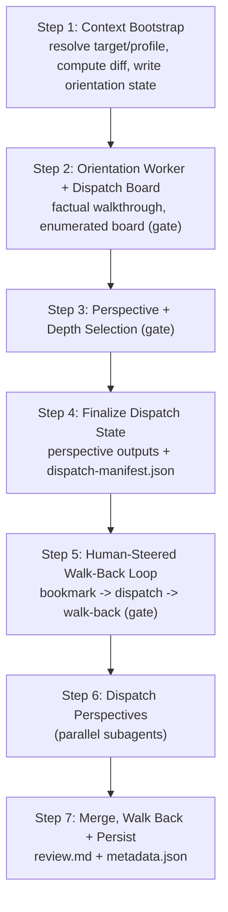

The code review system is a single human-gated agent for pull requests, branch diffs, and local changes. It resolves the review target, applies a recommended profile, bootstraps change context once, confirms scope with you, lets you adjust which findings perspectives run and how deeply, and merges their results into one report.

Use the **PR Review** prompt when a pull request is open, or select the **Code Review** agent directly for branch and working-tree reviews. Both entry points use the same target-aware workflow and human-gated emission controls.

## Why Pre-PR Code Review?

| Benefit                       | Description                                                                                 |
|-------------------------------|---------------------------------------------------------------------------------------------|
| Flexible review targets       | Reviews an open PR or MR, an explicit branch diff, or local working-tree changes            |
| Consistent standards coverage | Every diff gets the same skill-based analysis regardless of which reviewer picks up the PR  |
| Multiple perspectives         | One run can cover functional, standards, accessibility, security, and deliverable readiness |
| Extensible language support   | Teams add their own skills without modifying the review agent                               |
| Actionable output             | Every finding includes file paths, line numbers, current code, and a suggested fix          |

> [!TIP]
> New to hve-core code review? Run the **Code Review** agent on your current branch with the `standard` depth tier and one or two perspectives to see the output format, then add perspectives or raise the depth as you get comfortable with the workflow.

## Architecture


```mermaid
flowchart TD
  ORCH["Code Review<br/>(Orchestrator)"]
  AO["Code Review Orientation<br/>(Register 1 stage)"]

  subgraph Perspectives
    AF["Code Review<br/>Functional"]
    AS["Code Review<br/>Standards"]
    AA["Code Review<br/>Accessibility"]
    ASEC["Code Review<br/>Security"]
    AR["Code Review<br/>Readiness"]
  end

  subgraph "Interactive Subagents"
    EX["Code Review Explainer<br/>(Register 1)"]
    WB["Code Review Walkback<br/>(Register 2)"]
    RR["rpi-research<br/>Skill"]
  end

  subgraph "Shared Protocols"
    D["Diff Computation<br/>Protocol"]
    R["Review Artifacts<br/>Protocol"]
    PR["pr-reference<br/>Skill"]
  end

  subgraph "code-review Skill"
    K1["Context Bootstrap"]
    K2["Depth Tiers"]
    K3["Lens Checklists"]
    K4["Severity Taxonomy"]
    K5["Output Formats"]
    K6["Review Targets<br/>and Profiles"]
  end

  subgraph Skills
    S1["coding-standards<br/>skills"]
    S2["accessibility<br/>skills"]
    S3["Enterprise<br/>custom skills"]
  end

  ORCH -->|"reads"| K1 & K2 & K3 & K4 & K5 & K6
  ORCH -->|"Step 1"| D
  ORCH -->|"Step 1"| PR
  ORCH -->|"Step 2"| AO
  ORCH -->|"Step 5 walk-back"| EX & WB
  WB -->|"activates"| RR
  ORCH -->|"Step 6 parallel"| AF & AS & AA & ASEC & AR
  AS -->|"loads at runtime"| S1 & S3
  AA -->|"loads at runtime"| S2 & S3
  AF -->|"follows"| R
  AS -->|"follows"| R
```

The orchestrator resolves the target and profile, computes the diff once in Step 1 using the `pr-reference` skill, and writes a shared `diff-state.json` with an explicit orientation task. The Code Review Orientation worker then builds the factual walkthrough and dispatch-board appendices without grading findings.
During the interactive walk-back loop it routes the human's questions to the Code Review Explainer (factual) or Code Review Walkback (deep research) before dispatching the selected perspective subagents concurrently.
Each subagent writes structured JSON findings to disk. The orchestrator reads every findings file and merges them into a single deduplicated report.

## The Orchestrator and Its Perspectives

A single user-invocable **Code Review** agent orchestrates the review. It owns the human-gated flow and dispatches one thin subagent per selected perspective. Perspective selection (which lanes run) and depth level (how deeply each lane verifies) are independent choices.

:::table{caption="Review perspectives and the subagents that own each lane"}

| Perspective     | Subagent                  | Lane focus                                                                                                    |
|-----------------|---------------------------|---------------------------------------------------------------------------------------------------------------|
| `functional`    | Code Review Functional    | Logic, edge cases, error handling, concurrency, contract correctness                                          |
| `standards`     | Code Review Standards     | Project coding standards traceable to loaded `coding-standards` skills                                        |
| `accessibility` | Code Review Accessibility | Accessibility conformance traceable to loaded `accessibility` skills                                          |
| `security`      | Code Review Security      | Authn/authz, input validation, secrets, injection, deserialization paths                                      |
| `readiness`     | Code Review Readiness     | Change packaging, scope hygiene, validation evidence, PR metadata, follow-up items, and changed documentation |
| `full`          | all of the above          | Runs every perspective and synthesizes one merged assessment                                                  |

:::

The `security` and `accessibility` perspectives are self-contained and skill-backed. They source their review logic from the `code-review` and domain skills and do not call into the standalone Security Reviewer or Accessibility Reviewer agents. When a high-risk surface is in scope, the perspective surfaces a one-line note that a deeper standalone audit exists.

Code Review Orientation is a required workflow stage rather than a findings perspective.

### Review Targets and Profiles

Targets identify what is reviewed. Profiles recommend which findings perspectives run.

| Target        | Default profile | Recommended findings perspectives                                                                    |
|---------------|-----------------|------------------------------------------------------------------------------------------------------|
| Pull request  | `standard`      | Functional, Standards, and Readiness, plus Security and Accessibility when their signals are present |
| Branch diff   | `standard`      | Functional, Standards, and Readiness, plus Security and Accessibility when their signals are present |
| Local changes | `standard`      | Functional, Standards, and Readiness, plus Security and Accessibility when their signals are present |

Select `full` to run all five findings perspectives. Select `custom` for caller-selected or changed-surface-inferred perspectives, then confirm them. Profile selection and depth remain independent of the target.

For pull-request and branch-diff targets, the agent resolves an immutable target head SHA and requires checked-out `HEAD` to match it before generating the diff. If they differ, the review stops and asks you to check out the target head. This keeps provider metadata, the reviewed commit, and prepared line comments bound to the same change.

### Skill-Backed Review Logic

The review workflow lives in the `code-review` skill, not in the agent. The orchestrator and subagents read the skill entry and its references once and apply them verbatim:

| Reference         | Provides                                                                   |
|-------------------|----------------------------------------------------------------------------|
| Context Bootstrap | Tier 0 procedure for proving the change surface and scoping hotspots       |
| Depth Tiers       | Basic, standard, and comprehensive verification-rigor dials                |
| Lens Checklists   | Per-perspective review questions                                           |
| Severity Taxonomy | Severity levels, verdict normalization, and risk classification            |
| Output Formats    | Reporting structure, merged report skeleton, and persisted artifact schema |
| Review Targets    | Target resolution, profile expansion, task state, and emission identity    |

The Standards perspective is language-agnostic: it scans the workspace for `**/SKILL.md` files, matches them against the languages in the diff, and loads the relevant `coding-standards` skills. See [Language Skills](language-skills.md) for details on the built-in skills and how to create your own.

## How the Review Works

The agent runs a human-gated flow. Each step pauses for your input where the table notes a gate.


```mermaid
flowchart TD
  S1["Step 1: Context Bootstrap<br/>resolve target/profile, compute diff, write orientation state"]
  S2["Step 2: Orientation Worker + Dispatch Board<br/>factual walkthrough, enumerated board (gate)"]
  S3["Step 3: Perspective + Depth Selection (gate)"]
  S4["Step 4: Finalize Dispatch State<br/>perspective outputs + dispatch-manifest.json"]
  S5["Step 5: Human-Steered Walk-Back Loop<br/>bookmark -> dispatch -> walk-back (gate)"]
  S6["Step 6: Dispatch Perspectives<br/>(parallel subagents)"]
  S7["Step 7: Merge, Walk Back + Persist<br/>review.md + metadata.json"]

  S1 --> S2 --> S3 --> S4 --> S5 --> S6 --> S7
```

| Step | Stage                               | What happens                                                                                                                                                                                                                                                                        |
|------|-------------------------------------|-------------------------------------------------------------------------------------------------------------------------------------------------------------------------------------------------------------------------------------------------------------------------------------|
| 1    | Context Bootstrap                   | The agent resolves the target and profile, verifies that the target head SHA matches checked-out `HEAD`, generates a structured XML diff from the exact target base, drafts a change brief, detects hotspots, resolves optional PR context, and writes serialized orientation state |
| 2    | Orientation Worker + Dispatch Board | Code Review Orientation reads the serialized task, writes the factual Register 1 walkthrough, and seeds the dispatch board; you confirm or edit it and bookmark or reject board items (gate)                                                                                        |
| 3    | Perspective + Depth Selection       | You adjust the profile's recommended findings perspectives and choose an independent depth tier (gate)                                                                                                                                                                              |
| 4    | Finalize Dispatch State             | The agent records exact per-perspective output paths in `diff-state.json` and writes `dispatch-manifest.json`                                                                                                                                                                       |
| 5    | Human-Steered Walk-Back Loop        | You bookmark a board item and ask a question; the agent routes factual questions to the Explainer (Register 1) and deep questions to the Walkback (Register 2), then walks each answer back onto its board item (gate)                                                              |
| 6    | Dispatch Perspectives               | Selected perspective subagents run concurrently, each writing structured JSON findings to disk                                                                                                                                                                                      |
| 7    | Merge, Walk Back + Persist          | Findings are deduplicated, severity-sorted, source-tagged, walked back onto the board, and written as `review.md` plus `metadata.json`                                                                                                                                              |

### Orientation, Registers, and the Walk-Back Loop

The flow separates two distinct modes of reasoning so factual orientation never gets entangled with severity judgments:

* **Register 1 (factual, orientation):** the Step 2 walkthrough and the Code Review Explainer answer "what does this symbol or function do" without assigning severity, verdicts, or recommendations. This gives you a shared, factual map of the change before any judgment is applied.
* **Register 2 (investigative, deep research):** the Code Review Walkback answers "is this correct, is this safe, what are the implications" by activating `rpi-research` and anchoring the resulting evidence to its board item.

In the Step 5 walk-back loop you steer the review by bookmarking a board item and asking a question.
The orchestrator routes the question by depth: shallow factual questions dispatch to the **Code Review Explainer** subagent (Register 1), and deep investigative questions dispatch to the **Code Review Walkback** subagent (Register 2).
Each answer is walked back onto its board item, updating the item status and queueing any follow-on questions. The loop continues until you are satisfied or request the full perspective sweep.
In non-interactive (workflow) mode, Steps 2, 3, and 5 are skipped and the board is swept as a batch.

### Depth Tiers

Depth controls how deeply each selected perspective verifies the confirmed scope. It does not add or remove perspectives.

| Tier | Depth           | When to use                                               |
|------|-----------------|-----------------------------------------------------------|
| 1    | `basic`         | Quick pass on small or low-risk changes                   |
| 2    | `standard`      | Default rigor for most reviews                            |
| 3    | `comprehensive` | Deep verification for high-risk surfaces or large changes |

## Usage

For an open pull request or merge request, invoke the **PR Review** prompt and optionally provide its number or URL. The prompt resolves the PR target and routes to Code Review with the target-independent `standard` profile. For branch diffs or local changes, select **Code Review** from the agent picker. Then confirm the target and scope, adjust the recommended perspectives, and choose a depth tier.

### Story Reference

Pass a work item reference (for example, `AB#456` or `AIAA-123`) when you start the review to enable acceptance criteria coverage. The orchestrator forwards the reference to the Standards perspective, which includes an Acceptance Criteria Coverage table in its report.

### Pull Request and Base Branch

The PR Review prompt accepts an explicit PR or MR number or URL. Without one, the agent first looks for an open PR or MR mapped from the current branch. If none exists, it compares the current branch against the resolved default base. Supply a different base branch (for example, `baseBranch=origin/develop`) when your branch targets another base.

Check out the PR or branch head before starting the review. The agent compares checked-out `HEAD` with the resolved target head SHA and stops on mismatch instead of reviewing another checkout under the requested target's metadata. Before native emission, it verifies again that the target is open and its base, head, and head SHA are unchanged.

### Perspectives and Depth

When the agent reaches the selection step, choose any combination of `functional`, `standards`, `accessibility`, `security`, and `readiness`, or select `full` to run all five. Pick a depth tier (`basic`, `standard`, or `comprehensive`) independently.
The `standard` profile pre-populates Functional, Standards, and Readiness for every target. It adds Accessibility only when a UI, markup, or documentation surface is in scope and Security when a hotspot touches auth, crypto, parsing, deserialization, secrets, or networking. PR metadata enrichment, readiness PR checks, PR-comment drafts, and native emission apply only when the resolved target is a pull request and its `prContext` is available.

## Review Output

Each perspective produces severity-ordered findings. Every finding includes:

* A descriptive title and severity level (Critical, High, Medium, Low)
* The file path and line range where the issue appears
* The current code from the diff that has the issue
* A suggested fix with replacement code
* The category and (for standards findings) the skill that surfaced the finding
* A source tag (for example, `[Functional]` or `[Standards]`) indicating which perspective raised it

### Structured JSON Contracts

Subagents write findings as structured JSON rather than markdown. This enables deterministic merging without LLM re-parsing. The JSON schema is defined in the `code-review` skill's output-formats reference, which both the orchestrator and subagents treat as the authoritative data contract.

The data flow through the orchestrator:

```text
diff-state.json              (orchestrator writes orientation task)
  ↓
orientation-walkthrough.md   (orientation worker writes Register 1)
  ↓
diff-state.json              (orchestrator records perspective outputs)
  ↓
<perspective>-findings.json  (each dispatched subagent writes its own file)
  ↓
review.md + metadata.json    (orchestrator merges and writes)
```

### Lane Separation

Each dispatch prompt includes a lane note telling the subagent to stay within its own focus and not duplicate findings owned by another selected perspective. This reduces duplicate findings in the merged report and keeps each subagent focused on its domain.

### Verdict Scale

| Condition                     | Verdict               |
|-------------------------------|-----------------------|
| Any Critical or High findings | Request changes       |
| Only Medium or Low findings   | Approve with comments |
| No findings                   | Approve               |

The orchestrator uses the strictest verdict across the perspectives that ran: if any perspective would request changes, the merged report requests changes. Any Critical finding forces `request_changes`.

### Artifact Persistence

Review artifacts are saved to `.copilot-tracking/reviews/code-reviews/{branch-slug}/` with two files:

* `review.md`: the full merged review report
* `metadata.json`: a machine-readable summary for automation

The `metadata.json` file contains fields that CI pipelines, pre-commit hooks, and custom scripts can consume:

```json
{
  "schema_version": "1",
  "branch": "feat/my-feature",
  "head_commit": "abc123...",
  "reviewed_at": "2026-06-19T15:30:00Z",
  "verdict": "request_changes",
  "files_changed": ["src/main.py", "src/utils.py"],
  "findings_count": {
    "critical": 0,
    "high": 2,
    "medium": 1,
    "low": 0
  },
  "reviewer": "code-review"
}
```

The `verdict` field holds one of three values: `approve`, `approve_with_comments`, or `request_changes`. A pre-commit hook can read this file and block commits when the verdict is `request_changes`, ensuring review findings are addressed before code leaves the local branch. For example:

```bash
verdict=$(jq -r '.verdict' .copilot-tracking/reviews/code-reviews/*/metadata.json 2>/dev/null)
if [ "$verdict" = "request_changes" ]; then
  echo "Code review requires changes. Fix findings before committing."
  exit 1
fi
```

## What You Need

| Requirement        | Details                                               |
|--------------------|-------------------------------------------------------|
| VS Code + Copilot  | GitHub Copilot Chat with agent mode enabled           |
| Git branch         | A local branch with commits ahead of the base branch  |
| HVE Core           | The complete `hve-core` extension or plugin installed |
| pr-reference skill | Included with HVE Core; generates the XML diff        |

The agent works with any programming language. Standards and accessibility enforcement require skills that match the languages and surfaces in your diff. If no matching skills are found, the relevant perspective notes the gap and restricts its verdict.

## Extending with Custom Skills

The Standards and Accessibility perspectives discover skills dynamically at review time. You extend coverage by adding `SKILL.md` files to your repository without modifying the agent itself. See [Language Skills](language-skills.md) for the full guide on built-in skills, skill stacking, and authoring enterprise-specific standards.

<!-- markdownlint-disable MD036 -->
*🤖 Crafted with precision by ✨Copilot following brilliant human instruction,
then carefully refined by our team of discerning human reviewers.*
<!-- markdownlint-enable MD036 -->
