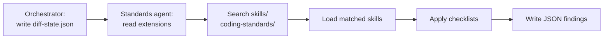
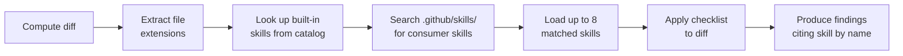
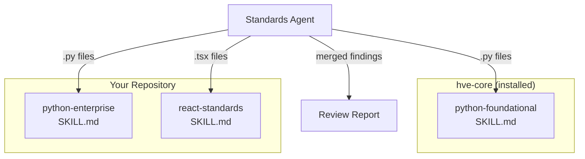

The Code Review Standards agent enforces coding conventions through skills, not hardcoded rules. Each skill is a self-contained `SKILL.md` file with a checklist that the agent loads at review time based on the languages present in the diff. This design means you can add, replace, or overlay standards for any language without modifying the agent.

## How Skill Loading Works

The skill loading path depends on whether the Standards agent is running standalone or under the Code Review Full orchestrator.

### Orchestrated Mode (via Code Review Full)

When the orchestrator dispatches the Standards agent, it provides a `diff-state.json` containing the file extensions from the diff. The Standards agent uses those extensions to discover and load skills itself.



1. The orchestrator extracts file extensions from the diff during Step 1 and writes them to the `extensions` array in `diff-state.json`.
2. The Standards agent reads `diff-state.json`, extracts the extensions, and searches `skills/coding-standards/` for matching `SKILL.md` files.
3. It loads up to 8 matching skills and applies each skill's checklist to the diff.
4. It writes structured JSON findings for the orchestrator to merge.

Skill discovery is owned entirely by the Standards agent. The orchestrator supplies the extensions; the Standards agent decides which skills to load.

### Standalone Mode

When invoked directly (without an orchestrator), the agent uses a two-layer approach: a built-in catalog for known skills and a scoped search for consumer-authored skills.



In standalone mode:

1. The agent extracts unique file extensions from the diff's changed-file list.
2. It normalizes each extension to language tokens (for example, `.py` to `python`, `.cs` to `csharp`, `.sh` to `bash`) and searches `skills/coding-standards/` for `SKILL.md` files whose `name` or `description` matches those tokens. Literal extension matches also count.
3. It selects up to 8 matching skills, preferring those whose domain appears most frequently in the changed files.
4. It loads the full `SKILL.md` body for each selected skill and applies its checklist to the diff.
5. Every finding traces back to the skill that surfaced it, cited by the skill's exact `name` from frontmatter.

> [!NOTE]
> Both orchestrated and standalone modes use the same skill discovery logic inside the Standards agent. The only difference is the input source: in orchestrated mode, extensions come from `diff-state.json`; in standalone mode, the agent extracts them from the diff itself. Discovery normalizes file extensions to language tokens before matching against skill metadata.

## Built-in Skills

The `coding-standards` collection ships with one language skill. Additional language skills follow the same pattern and can be contributed to the repository or authored independently.

### python-foundational

| Field        | Value                                                  |
|--------------|--------------------------------------------------------|
| Skill path   | `.github/skills/coding-standards/python-foundational/` |
| Activates on | `.py` files in the diff                                |
| Sections     | 9 checklist sections, 30+ individual checks            |
| Maturity     | Experimental                                           |

The python-foundational skill covers:

| Section                   | What It Checks                                                    |
|---------------------------|-------------------------------------------------------------------|
| Readability and Style     | Naming conventions, import grouping, whitespace                   |
| Pythonic Idioms           | Comprehensions, context managers, dataclasses, pathlib usage      |
| Function and Class Design | Single responsibility, docstrings, side-effect documentation      |
| Type Safety Foundations   | Public API type hints, generics, `Any` avoidance                  |
| Error Handling            | Exception specificity, resource cleanup, error context            |
| Testing Foundations       | Arrange/Act/Assert structure, fixture usage, parametrize patterns |
| Security Baseline         | Input validation, secret exposure, safe deserialization           |
| Performance Awareness     | Collection choice, generator usage, I/O batching                  |
| Dependency and Packaging  | Pinned versions, minimal dependencies, PEP 723 inline metadata    |

Each section contains concrete checks that the agent applies line by line against the diff. Findings reference the section name as their Category in the review output.

## Built-in Instructions (Complementary)

The coding-standards collection also includes language-specific instruction files that auto-apply when Copilot generates or edits code. These instruct Copilot how to write code; skills instruct the review agent how to evaluate it.

| Language   | Instruction files                                               | Activation pattern     |
|------------|-----------------------------------------------------------------|------------------------|
| Bash       | `bash.instructions.md`                                          | `**/*.sh`              |
| Bicep      | `bicep.instructions.md`                                         | `**/bicep/**`          |
| C#         | `csharp.instructions.md`, `csharp-tests.instructions.md`        | `**/*.cs`              |
| PowerShell | `powershell.instructions.md`, `pester.instructions.md`          | `**/*.ps1, **/*.psm1`  |
| Python     | `python-script.instructions.md`, `python-tests.instructions.md` | `**/*.py`              |
| Rust       | `rust.instructions.md`, `rust-tests.instructions.md`            | `**/*.rs`              |
| Terraform  | `terraform.instructions.md`                                     | `**/*.tf, **/*.tfvars` |

Instructions and skills serve different activation contexts. Instructions guide code generation passively (always on for matching files). Skills guide code review actively (loaded on demand by the standards agent). Keeping both aligned ensures that code Copilot generates passes the review skill's checks.

> [!TIP]
> When you author a new language skill, review the corresponding instruction files to ensure they do not contradict each other. A mismatch creates a generate-then-flag loop where Copilot writes code that the review agent immediately flags.

## Authoring a Custom Skill

You extend the standards agent by creating a `SKILL.md` file under `.github/skills/` in your repository. The agent discovers it through a scoped search of that directory at review time.

### Skill Stacking

Skills stack additively. When a Python diff is reviewed, the agent might load both `python-foundational` (from hve-core) and `python-enterprise` (from your repository). Findings from all loaded skills appear in the same report, each tagged with the skill that surfaced them.



### Directory Structure

Place custom skills under `.github/skills/{your-collection}/{skill-name}/`:

```text
.github/skills/
└── contoso/
    └── python-enterprise/
        ├── SKILL.md
        └── references/
            └── api-conventions.md
```

### SKILL.md Template

```yaml
---
name: python-enterprise
description: >-
  Contoso Python enterprise standards covering internal API conventions,
  approved libraries, and production deployment requirements.
---
```

The `name` and `description` are required. The description drives the agent's activation decision during consumer skill discovery, so include the language names, framework names, or file extensions your skill targets.

### Checklist Structure

Organize checks into numbered sections with bullet points. Each bullet should be a concrete, verifiable check:

```markdown
## Core Checklist

#### 1. API Conventions

* Use `@api_version("v2")` decorator on all public endpoint functions.
* Return `ApiResponse` wrapper for all HTTP handlers.
* Include `correlation_id` in every log statement within request handlers.

#### 2. Approved Libraries

* Use `httpx` for HTTP clients (not `requests`).
* Use `pydantic` for data validation (not manual dict parsing).
* Pin all production dependencies with exact versions in `pyproject.toml`.
```

### What Makes a Good Skill

| Quality         | Guidance                                                                              |
|-----------------|---------------------------------------------------------------------------------------|
| Specificity     | Each check should be verifiable from a diff without running the code                  |
| Traceability    | Group checks into named sections so findings carry a meaningful Category              |
| Scope alignment | Write the description to match only the languages and frameworks you intend to cover  |
| Reasonable size | Aim for 5-15 sections with 2-5 checks each; larger skills dilute focus                |
| No duplication  | Do not repeat checks already covered by the foundational skill your skill stacks with |

### Testing Your Skill

1. Place the `SKILL.md` file in your repository.
2. Make a change to a file that matches the skill's target language.
3. Run `/code-review-full` or invoke the Code Review Standards agent directly.
4. Verify that findings cite your skill's `name` in their Skill field.
5. If the skill does not activate, verify that the `description` mentions the language, framework, or file extension present in the diff and that the `SKILL.md` is under `.github/skills/`.

## Enterprise Scenarios

### Overlay Company Standards on Built-in Skills

A financial services team installs the `coding-standards` collection and adds `.github/skills/woodgrove/python-finserv/SKILL.md` with checks for audit logging, PII handling, and approved cryptographic libraries. The standards agent loads both `python-foundational` and `python-finserv` for every Python diff, producing a unified report.

### Add Coverage for an Unsupported Language

A team working in Go creates `.github/skills/tailspin/go-standards/SKILL.md` with checks for error wrapping conventions, context propagation, and struct tag formatting. The standards agent discovers and loads it for any `.go` files in the diff, even though hve-core ships no built-in Go skill.

### Scope a Skill to a Specific Framework

A frontend team authors `.github/skills/northwind/react-standards/SKILL.md` with its description mentioning "React components, hooks, and JSX patterns." The agent loads it only when `.tsx` or `.jsx` files appear in the diff, leaving unrelated reviews unaffected.

## Reference

| Resource                    | Path                                                           |
|-----------------------------|----------------------------------------------------------------|
| python-foundational skill   | `.github/skills/coding-standards/python-foundational/SKILL.md` |
| Standards output format     | `docs/templates/standards-review-output-format.md`             |
| Full review output format   | `docs/templates/full-review-output-format.md`                  |
| Engineering fundamentals    | `docs/templates/engineering-fundamentals.md`                   |
| Skill authoring guide       | [Authoring Custom Skills](../../customization/skills.md)       |
| Contributing skills         | [Contributing: Skills](../../contributing/skills.md)           |
| coding-standards collection | `collections/coding-standards.collection.yml`                  |

<!-- markdownlint-disable MD036 -->
*🤖 Crafted with precision by ✨Copilot following brilliant human instruction,
then carefully refined by our team of discerning human reviewers.*
<!-- markdownlint-enable MD036 -->
