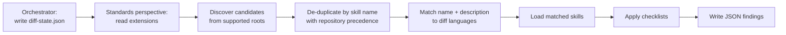

The Code Review Standards perspective enforces coding conventions through skills, not hardcoded rules. Each skill is a self-contained `SKILL.md` file with a checklist that the perspective loads at review time based on the languages present in the diff. This design means you can add, replace, or overlay standards for any language without modifying the agent.

## How Skill Loading Works

The orchestrator dispatches the Standards perspective with a `diff-state.json` containing the file extensions from the diff. The Standards perspective uses those extensions to select and load skills itself.



1. The orchestrator extracts file extensions from the diff during the context bootstrap step and writes them to the `extensions` array in `diff-state.json`.
2. The Standards perspective reads `diff-state.json`, extracts the extensions, and discovers candidate skills from supported built-in and repository-authored roots.
3. It de-duplicates same-named skills by precedence, then evaluates each remaining skill by matching its name and description against the detected languages or file types.
4. It selects up to 8 relevant skills and applies each skill's checklist to the diff.
5. It writes structured JSON findings for the orchestrator to merge.

Skill discovery is owned entirely by the Standards perspective. The orchestrator supplies the extensions; the Standards perspective decides which skills to load.

### Skill Selection Steps

The Standards perspective selects skills as follows:

1. It reads the unique file extensions from `diff-state.json` (or extracts them from the diff's changed-file list when not provided).

2. It normalizes each extension to language tokens (for example, `.py` to `python`, `.cs` to `csharp`, `.sh` to `bash`).

3. It discovers candidate `coding-standards` skills from the built-in hve-core baseline and supported repository-authored skill roots.

4. It de-duplicates candidates that share the same frontmatter `name`, using repository-authored skills before built-in baseline skills.

5. It semantically matches each remaining candidate's `name` and `description` against the detected languages, frameworks, or file types.

6. It selects up to 8 relevant skills total, prioritizing those most closely aligned with the changed files.

7. It loads the full `SKILL.md` body for each selected skill and applies its checklist to the diff.

8. Every finding traces back to the skill that surfaced it, cited by the skill's exact `name` from frontmatter.

> [!NOTE]
>
> Skills are discovered from supported roots, then selected through semantic matching of their name and description against detected languages, frameworks, or file types. Semantic matching is the selection step, not a replacement for supported discovery locations.

### Supported Discovery Roots

The Standards perspective considers these candidate sources:

| Source                     | Roots                                                                                                      | Notes                                                                                                |
|----------------------------|------------------------------------------------------------------------------------------------------------|------------------------------------------------------------------------------------------------------|
| Built-in hve-core baseline | Packaged `skills/coding-standards/` resolved through the hve-core artifact root                            | Used by generated extension and plugin distributions where `.github/` prefixes are stripped          |
| Repository-authored skills | `.github/skills/coding-standards/`, `.claude/skills/coding-standards/`, `.agents/skills/coding-standards/` | `.github/skills/coding-standards/` is the default customer authoring path                            |
| VS Code extra roots        | `chat.agentSkillsLocations` entries that contain `coding-standards` skills                                 | Use this for mounted or peer-cloned hve-core installations                                           |
| User-profile roots         | `~/.copilot/skills`, `~/.agents/skills`                                                                    | Out of scope for this implementation unless the active platform exposes them as available candidates |

Generated extension and plugin packages can expose bundled hve-core skills under
`skills/`. That packaged layout is not the default repository authoring path for
customer skills. Author repository skills under `.github/skills/` unless your
platform configuration points to another supported root.

### Skill Merge Behavior

The Standards perspective merges discovered candidates before selection:

| Case                                        | Behavior                                                                                                                                                                                          |
|---------------------------------------------|---------------------------------------------------------------------------------------------------------------------------------------------------------------------------------------------------|
| Distinct skill names                        | Skills stack additively when they match the diff. Findings keep the exact originating skill `name`.                                                                                               |
| Same skill name                             | The repository-authored skill shadows the built-in baseline skill. If the platform exposes user-profile candidates, precedence is repository-authored, then user-profile, then built-in baseline. |
| Contradictory checks across distinct skills | The perspective surfaces findings from each skill and cites both names. It does not silently choose one standard or combine skill bodies.                                                         |

Same-named skill bodies are never concatenated. A shadowed skill does not load
and does not consume one of the 8 selected-skill slots.

## Built-in Skills

The `coding-standards` collection ships with one language skill. Additional language skills follow the same pattern and can be contributed to the repository or authored independently.

### python-foundational

| Field        | Value                                                                                                                                                           |
|--------------|-----------------------------------------------------------------------------------------------------------------------------------------------------------------|
| Skill path   | `skills/coding-standards/python-foundational/` in packaged distributions; `.github/skills/coding-standards/python-foundational/` in repository authoring layout |
| Activates on | `.py` files in the diff                                                                                                                                         |
| Sections     | 9 checklist sections, 30+ individual checks                                                                                                                     |
| Maturity     | Experimental                                                                                                                                                    |

The python-foundational skill covers:

| Section                   | What It Checks                                                    |
|---------------------------|-------------------------------------------------------------------|
| Readability and Style     | Naming conventions, import grouping, whitespace                   |
| Pythonic Idioms           | Comprehensions, context managers, dataclasses, pathlib usage      |
| Function and Class Design | Single responsibility, docstrings, side-effect documentation      |
| Type Safety Foundations   | Public API type hints, generics, `Any` avoidance                  |
| Error Handling            | Exception specificity, resource cleanup, error context            |
| Testing Foundations       | Arrange/Act/Assert structure, fixture usage, parametrize patterns |
| Security Baseline         | Input validation, secret exposure, safe deserialization           |
| Performance Awareness     | Collection choice, generator usage, I/O batching                  |
| Dependency and Packaging  | Pinned versions, minimal dependencies, PEP 723 inline metadata    |

Each section contains concrete checks that the agent applies line by line against the diff. Findings reference the section name as their Category in the review output.

## Built-in Instructions (Complementary)

The coding-standards collection also includes language-specific instruction files that auto-apply when Copilot generates or edits code. These instruct Copilot how to write code; skills instruct the review agent how to evaluate it.

| Language   | Instruction files                                               | Activation pattern     |
|------------|-----------------------------------------------------------------|------------------------|
| Bash       | `bash.instructions.md`                                          | `**/*.sh`              |
| Bicep      | `bicep.instructions.md`                                         | `**/bicep/**`          |
| C#         | `csharp.instructions.md`, `csharp-tests.instructions.md`        | `**/*.cs`              |
| PowerShell | `powershell.instructions.md`, `pester.instructions.md`          | `**/*.ps1, **/*.psm1`  |
| Python     | `python-script.instructions.md`, `python-tests.instructions.md` | `**/*.py`              |
| Rust       | `rust.instructions.md`, `rust-tests.instructions.md`            | `**/*.rs`              |
| Terraform  | `terraform.instructions.md`                                     | `**/*.tf, **/*.tfvars` |

Instructions and skills serve different activation contexts. Instructions guide code generation passively (always on for matching files). Skills guide code review actively (loaded on demand by the Standards perspective). Keeping both aligned ensures that code Copilot generates passes the review skill's checks.

> [!TIP]
> When you author a new language skill, review the corresponding instruction files to ensure they do not contradict each other. A mismatch creates a generate-then-flag loop where Copilot writes code that the review perspective immediately flags.

## Authoring a Custom Skill

You extend the Standards perspective by creating a `SKILL.md` file under `.github/skills/coding-standards/` in your repository. The perspective activates it by discovering it from the supported repository root and matching the skill's name or description against the languages, frameworks, or file types present in the diff.

### Skill Stacking

Skills stack additively. When a Python diff is reviewed, the perspective might load both `python-foundational` (from hve-core) and `python-enterprise` (from your repository). Findings from all loaded skills appear in the same report, each tagged with the skill that surfaced them.


### Directory Structure

Place custom skills under `.github/skills/coding-standards/{your-collection}/{skill-name}/`

```text
.github/skills/coding-standards/
└── contoso/
    └── python-enterprise/
        ├── SKILL.md
        └── references/
            └── api-conventions.md
```

### SKILL.md Template

```yaml
---
name: python-enterprise
description: >-
  Contoso Python enterprise standards covering internal API conventions,
  approved libraries, and production deployment requirements.
---
```

The `name` and `description` are required. The description drives the agent's activation decision during consumer skill discovery, so include the language names, framework names, or file extensions your skill targets.

### Checklist Structure

Organize checks into numbered sections with bullet points. Each bullet should be a concrete, verifiable check:

```markdown
## Core Checklist

#### 1. API Conventions

* Use `@api_version("v2")` decorator on all public endpoint functions.
* Return `ApiResponse` wrapper for all HTTP handlers.
* Include `correlation_id` in every log statement within request handlers.

#### 2. Approved Libraries

* Use `httpx` for HTTP clients (not `requests`).
* Use `pydantic` for data validation (not manual dict parsing).
* Pin all production dependencies with exact versions in `pyproject.toml`.
```

### What Makes a Good Skill

| Quality         | Guidance                                                                              |
|-----------------|---------------------------------------------------------------------------------------|
| Specificity     | Each check should be verifiable from a diff without running the code                  |
| Traceability    | Group checks into named sections so findings carry a meaningful Category              |
| Scope alignment | Write the description to match only the languages and frameworks you intend to cover  |
| Reasonable size | Aim for 5-15 sections with 2-5 checks each; larger skills dilute focus                |
| No duplication  | Do not repeat checks already covered by the foundational skill your skill stacks with |

### Testing Your Skill

1. Place the `SKILL.md` file in your repository.
2. Make a change to a file that matches the skill's target language.
3. Invoke the **code-review** agent and select the `standards` perspective (or `full`).
4. Verify that findings cite your skill's `name` in their Skill field.
5. If the skill does not activate, verify that it is under a supported discovery root and that the `description` clearly mentions the language, framework, or file extension present in the diff.

## Enterprise Scenarios

### Overlay Company Standards on Built-in Skills

A financial services team installs the `coding-standards` collection and adds `.github/skills/coding-standards/woodgrove/python-finserv/SKILL.md` with checks for audit logging, PII handling, and approved cryptographic libraries. The Standards perspective loads both `python-foundational` and `python-finserv` for every Python diff, producing a unified report.

### Add Coverage for an Unsupported Language

A team working in Go creates `.github/skills/coding-standards/tailspin/go-standards/SKILL.md` with checks for error wrapping conventions, context propagation, and struct tag formatting. The Standards perspective selects and loads it for any `.go` files in the diff based on semantic matching.

### Scope a Skill to a Specific Framework

A frontend team authors `.github/skills/coding-standards/northwind/react-standards/SKILL.md` with its description mentioning "React components, hooks, and JSX patterns." The agent loads it only when `.tsx` or `.jsx` files appear in the diff, leaving unrelated reviews unaffected.

## Reference

| Resource                    | Path                                                                                                                                                                  |
|-----------------------------|-----------------------------------------------------------------------------------------------------------------------------------------------------------------------|
| python-foundational skill   | `skills/coding-standards/python-foundational/SKILL.md` in packaged distributions; `.github/skills/coding-standards/python-foundational/SKILL.md` in repository layout |
| Standards output format     | `docs/templates/standards-review-output-format.md`                                                                                                                    |
| Full review output format   | `docs/templates/full-review-output-format.md`                                                                                                                         |
| Engineering fundamentals    | `docs/templates/engineering-fundamentals.md`                                                                                                                          |
| Skill authoring guide       | [Authoring Custom Skills](../../customization/skills.md)                                                                                                              |
| Contributing skills         | [Contributing: Skills](../../contributing/skills.md)                                                                                                                  |
| coding-standards collection | `collections/coding-standards.collection.yml`                                                                                                                         |

<!-- markdownlint-disable MD036 -->
*🤖 Crafted with precision by ✨Copilot following brilliant human instruction,
then carefully refined by our team of discerning human reviewers.*
<!-- markdownlint-enable MD036 -->
