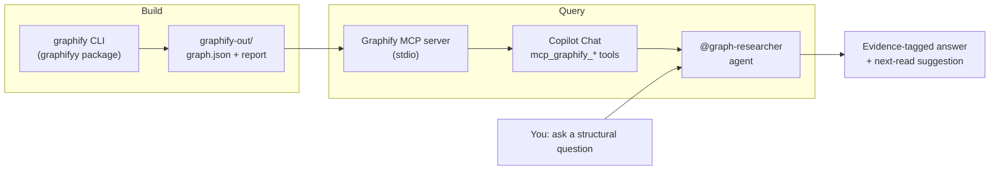

:::warning Experimental
Graph Research ships in the [`experimental`](../../getting-started/collections.md) collection. It depends on the upstream [`graphifyy`](https://pypi.org/project/graphifyy/) Python package, which iterates rapidly. Pin a specific version and expect occasional breaking changes.
:::

The Graph Research workflow turns a folder of source code, documentation, PDFs, and images into a navigable knowledge graph, then lets you query that graph from GitHub Copilot Chat. It surfaces structural relationships that grep cannot answer cleanly: "what depends on this module," "what cluster does this file belong to," "what is the shortest path between feature X and config Y."

> The goal is not to replace grep or your IDE's "Find All References." It is to answer the *structural* questions that those tools cannot: god nodes, communities, multi-hop relationships, and surprising connections across file types.

## Why Use Graph Research?

| Benefit               | Description                                                                                                                                              |
|-----------------------|----------------------------------------------------------------------------------------------------------------------------------------------------------|
| Structural awareness  | Get answers like "what is implicitly affected if I change `auth_middleware.py`?" without reading every importer by hand                                  |
| Audit-tagged evidence | Every edge in the graph is tagged `EXTRACTED` (deterministic AST), `INFERRED` (LLM-derived, with confidence score), or `AMBIGUOUS` (multiple candidates) |
| Mixed-input ingestion | The graph spans code, markdown, PDFs, and images, so a docs/code drift question can be answered as a single query                                        |
| MCP-native            | Tools surface in Copilot Chat as `mcp_graphify_*`, so the agent uses typed queries (shortest path, neighbors, community) rather than free-form retrieval |

## How It Fits Together



The build step is run on demand from the terminal. The query step is fully inside Copilot Chat, mediated by the agent and MCP server.

## Three Steps to Get Started

### 1. Install and build the graph

```bash
pip install graphifyy==0.5.4
graphify . --mode standard --update
```

The first build can take several minutes and (in `deep` mode) issues parallel Claude API calls against your `ANTHROPIC_API_KEY`. For a quick first pass, use `--mode fast` (deterministic AST only, no LLM calls, no API key required).

Outputs land in `graphify-out/`. Add the directory to `.gitignore` before the first build.

### 2. Register the MCP server with Copilot Chat

Add an entry to your workspace's `.vscode/mcp.json`:

```json
{
  "servers": {
    "graphify": {
      "command": "python3",
      "args": ["-m", "graphify.serve", "graphify-out/graph.json"],
      "type": "stdio"
    }
  }
}
```

Reload the VS Code window. The seven `mcp_graphify_*` tools appear in the Copilot Chat tool list.

### 3. Ask the Graph Researcher agent

In Copilot Chat, address `@graph-researcher` with a structural question. The agent picks the smallest sufficient MCP tool, reports findings with audit tags, and ends with one suggested file to read next.

## Questions It Answers Well

| Question                                                           | Tool used                    |
|--------------------------------------------------------------------|------------------------------|
| "What other modules are implicitly affected if I change file X?"   | `mcp_graphify_get_neighbors` |
| "Show me the shortest path between feature A and legacy module B." | `mcp_graphify_shortest_path` |
| "Which files are the most-connected hubs in this repo?"            | `mcp_graphify_god_nodes`     |
| "What community does this auth code belong to?"                    | `mcp_graphify_get_community` |
| "What clusters or themes exist in this codebase?"                  | `mcp_graphify_graph_stats`   |

## Questions It Does Not Answer Well

* "Where is the literal string `'TODO'`?" (use grep, not the graph)
* "Is this code correct?" (graph centrality is not a code-quality signal)
* "What did this commit change?" (use git, not the graph)

The agent declines these gracefully and points you to the right tool.

## Reading the Audit Tags

Every conclusion the agent reports identifies the evidence behind it:

| Tag         | How the agent reports it                                           |
|-------------|--------------------------------------------------------------------|
| `EXTRACTED` | Stated as fact: "X depends on Y."                                  |
| `INFERRED`  | Hedged with confidence: "X likely depends on Y (confidence 0.74)." |
| `AMBIGUOUS` | Surfaced as a question: "It is unclear whether X depends on Y."    |

A path through the graph is only as strong as its weakest edge. A two-hop path that combines `EXTRACTED` and `INFERRED` is reported as inferred overall.

## Cost and Privacy

Two things to think about before running `--mode deep`:

1. **Cost.** Deep mode dispatches many parallel Claude API calls. A first build over a 10k-file repo can run several USD. Subsequent builds with `--update` reuse a SHA256 cache and only re-process changed files.
2. **Upload scope.** Deep mode uploads file *contents* to the Claude API for semantic extraction. Do not run deep mode against trees containing secrets, credentials, or content under upload restrictions. Use `--mode fast` for sensitive trees (AST-only, no LLM).

The agent will warn before recommending a deep rebuild and will recommend `--mode fast` when it detects sensitive files.

## What Ships With This Workflow

| Artifact                                                                                                                                    | Role                                                                             |
|---------------------------------------------------------------------------------------------------------------------------------------------|----------------------------------------------------------------------------------|
| [`graphify` skill](https://github.com/microsoft/hve-core/blob/main/.github/skills/experimental/graphify/SKILL.md)                           | Technical reference: install, build modes, MCP registration, troubleshooting     |
| [`@graph-researcher` agent](https://github.com/microsoft/hve-core/blob/main/.github/agents/experimental/graph-researcher.agent.md)          | Orchestrates queries, picks the right MCP tool, reports findings with audit tags |
| [`graphify-out/**` instruction](https://github.com/microsoft/hve-core/blob/main/.github/instructions/experimental/graphify.instructions.md) | Auto-applies whenever Copilot reads files under `graphify-out/`                  |

## Promotion Path

Graph Research lives in `experimental` because the upstream `graphifyy` project is young and iterates rapidly. Promotion to a stable collection requires:

* Several minor-version bumps without breaking changes to the MCP tool surface
* A vetted version-pinning policy with a CHANGELOG-diff review process (already in place; see the skill)
* Independent confirmation of the deep-mode cost envelope on representative repos

## Where Next

* Skill technical reference: [`SKILL.md`](https://github.com/microsoft/hve-core/blob/main/.github/skills/experimental/graphify/SKILL.md)
* Upstream project: [github.com/safishamsi/graphify](https://github.com/safishamsi/graphify)
* Collections overview: [Available Collections](../../getting-started/collections.md)
* How agents are structured: [Agent Systems Catalog](../README.md)

*🤖 Crafted with precision by ✨Copilot following brilliant human instruction, then carefully refined by our team of discerning human reviewers.*
