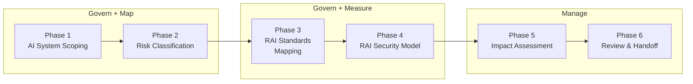

> Responsible AI assessment should be as structured and repeatable as security planning.
> When every AI system goes through the same principled evaluation, risk coverage improves,
> stakeholder trust increases, and compliance gaps surface before they become costly.

## Why Use RAI Planning?

The RAI Planner agent transforms informal AI ethics reviews into repeatable, evidence-backed assessment planning:

* 🔍 **Systematic coverage** maps each AI component against seven NIST AI RMF 1.0 trustworthiness characteristics and seven threat categories, eliminating the guesswork of ad-hoc reviews
* 📊 **Structured outcomes** produce suggested backlog items and maturity indicators so stakeholders can prioritize RAI improvements across projects
* 🔗 **Security plan integration** picks up where the Security Planner leaves off, inheriting AI component data and continuing threat ID sequences without duplication

> [!TIP]
> If you have already completed a security plan, the `from-security-plan` entry mode is recommended. It pre-populates AI system scope from the security plan's `state.json` and starts RAI threat IDs at the next sequence after the security plan's threat count.

## How It Works

The RAI Planner follows six sequential phases, each mapped to NIST AI RMF functions. Every phase produces artifacts, and the agent never advances without your confirmation.

### Phase 1: AI System Scoping

Discover the AI system's purpose, technology stack, deployment model, and stakeholder roles. Classify AI components and establish assessment boundaries. Maps to NIST Govern and Map functions.

### Phase 2: Risk Classification

Classify the AI system's risk level through the prohibited uses gate and three binary risk indicators aligned with NIST AI RMF trustworthiness characteristics. Determine the suggested assessment depth tier for subsequent phases.

### Phase 3: RAI Standards Mapping

Map AI system components and behaviors to the seven NIST AI RMF 1.0 trustworthiness characteristics: Valid and Reliable, Safe, Secure and Resilient, Accountable and Transparent, Explainable and Interpretable, Privacy-Enhanced, and Fair with Harmful Bias Managed. Cross-reference with NIST AI RMF subcategories and applicable regulations.

### Phase 4: RAI Security Model Analysis

Facilitate AI-specific threat analysis per component using AI STRIDE extensions, eight AI element types, and five trust boundaries. Threats follow the `T-RAI-{NNN}` sequential format with optional `T-{BUCKET}-AI-{NNN}` cross-references.

### Phase 5: RAI Impact Assessment

Explore control surface coverage for each identified threat. Document existing mitigations, identify gaps, analyze tradeoffs between competing trustworthiness characteristics, and prepare the control surface catalog and evidence register.

### Phase 6: Review and Handoff

Prepare a review summary of findings across dimensions. Generate suggested backlog items for identified gaps and hand off to the ADO or GitHub backlog system. Optionally dispatch findings back to the Security Planner for integrated tracking.

## Entry Modes

Three entry modes determine how Phase 1 begins. All converge at Phase 2 once AI system scoping completes.

| Mode                 | Source              | Best for                                                      |
|----------------------|---------------------|---------------------------------------------------------------|
| `capture`            | Fresh interview     | New AI projects without prior artifacts                       |
| `from-prd`           | PRD/BRD documents   | Projects with product definition artifacts                    |
| `from-security-plan` | Security plan state | Projects that completed security planning first (recommended) |

See [entry modes](entry-modes.md) for detailed guidance on when to choose each mode and what each mode pre-populates.

## Related Pages

| Page                                       | Description                                                          |
|--------------------------------------------|----------------------------------------------------------------------|
| [Why RAI planning?](why-rai-planning.md)   | The case for structured RAI assessment over ad-hoc reviews           |
| [Agent overview](agent-overview.md)        | Architecture, state management, and interaction model                |
| [Entry modes](entry-modes.md)              | Choosing between capture, from-prd, and from-security-plan           |
| [Phase reference](phase-reference.md)      | Detailed inputs, outputs, and state transitions for all six phases   |
| [Handoff pipeline](handoff-pipeline.md)    | Backlog generation, review summary, and the Security-to-RAI pipeline |
| [Security planning overview](../security/) | The Security Planner agent that feeds into RAI assessment            |

<!-- markdownlint-disable MD036 -->
*🤖 Crafted with precision by ✨Copilot following brilliant human instruction,
then carefully refined by our team of discerning human reviewers.*
<!-- markdownlint-enable MD036 -->
