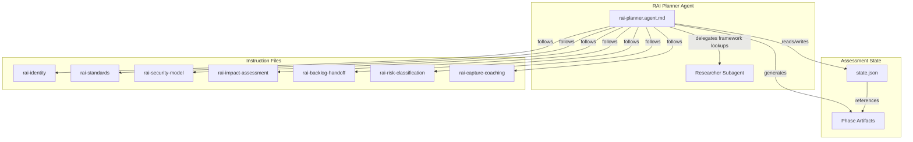

## Architecture Diagram

The RAI Planner agent definition lives at `.github/agents/rai-planning/rai-planner.agent.md`. Seven instruction files under `.github/instructions/rai-planning/` provide domain-specific guidance, auto-applied via `applyTo` patterns when working within `.copilot-tracking/rai-plans/`.

| Instruction file                          | Domain                                                                                                  |
|-------------------------------------------|---------------------------------------------------------------------------------------------------------|
| `rai-identity.instructions.md`            | Agent identity, orchestration, state management, session recovery                                       |
| `rai-risk-classification.instructions.md` | Risk classification screening, depth tier assignment, prohibited uses gate                              |
| `rai-standards.instructions.md`           | NIST AI RMF 1.0 trustworthiness characteristics, subcategory mappings, framework isolation architecture |
| `rai-security-model.instructions.md`      | AI-specific threat taxonomy, `T-RAI-{NNN}` format, concern level assessment                             |
| `rai-impact-assessment.instructions.md`   | Control surface evaluation, evidence register, characteristic tradeoff analysis                         |
| `rai-backlog-handoff.instructions.md`     | Dual-format backlog handoff, content sanitization, autonomy tiers                                       |
| `rai-capture-coaching.instructions.md`    | Exploration-first questioning techniques for capture mode                                               |

## State Management

All assessment state persists under `.copilot-tracking/rai-plans/{project-slug}/`. The `state.json` file tracks phase progress, entry mode, and assessment metadata.

### State Fields

| Field                          | Type           | Purpose                                                                         |
|--------------------------------|----------------|---------------------------------------------------------------------------------|
| `projectSlug`                  | string         | Kebab-case project identifier                                                   |
| `raiPlanFile`                  | string         | Path to the RAI plan markdown file                                              |
| `currentPhase`                 | number         | Current phase (1-6)                                                             |
| `entryMode`                    | string         | `capture`, `from-prd`, or `from-security-plan`                                  |
| `disclaimerShownAt`            | string or null | ISO 8601 timestamp when the disclaimer was displayed                            |
| `securityPlanRef`              | string or null | Path to security plan state when using `from-security-plan`                     |
| `assessmentDepth`              | string         | Assessment tier (`Basic`, `Standard`, or `Comprehensive`)                       |
| `riskClassification`           | object         | Phase 2 risk classification results including `suggestedDepthTier`              |
| `standardsMapped`              | boolean        | Whether Phase 3 mapping is complete                                             |
| `securityModelAnalysisStarted` | boolean        | Whether Phase 4 analysis has begun                                              |
| `raiThreatCount`               | number         | Running count of identified RAI threats                                         |
| `impactAssessmentGenerated`    | boolean        | Whether Phase 5 assessment is complete                                          |
| `evidenceRegisterComplete`     | boolean        | Whether evidence register is finalized                                          |
| `handoffGenerated`             | object         | Dual-format handoff status (`{ "ado": false, "github": false }`)                |
| `gateResults`                  | object         | Gate outcomes for threat coverage                                               |
| `runningObservations`          | array          | Cross-phase observation log with phase number, observation text, and flag level |
| `principleTracker`             | object         | Per-principle coverage status, threat counts, and open observations             |
| `referencesProcessed`          | array          | Files that have been read and incorporated                                      |
| `nextActions`                  | array          | Pending action items for the current phase                                      |
| `signingRequested`             | boolean        | Whether artifact signing was requested                                          |
| `signingManifestPath`          | string or null | Path to the signing manifest file                                               |
| `userPreferences`              | object         | User-specified preferences for interaction and output                           |

### Six-Step State Protocol

Every conversation turn follows this protocol:

| Step | Action    | Description                                                   |
|------|-----------|---------------------------------------------------------------|
| 1    | READ      | Load `state.json` at conversation start                       |
| 2    | VALIDATE  | Confirm state integrity and check for missing fields          |
| 3    | DETERMINE | Identify current phase and next actions from state            |
| 4    | EXECUTE   | Perform phase work (questions, analysis, artifact generation) |
| 5    | UPDATE    | Update `state.json` with results                              |
| 6    | WRITE     | Persist updated `state.json` to disk                          |

## Interaction Model

The agent asks up to 7 focused questions per turn, using emoji checklists to track progress within each phase.

| Marker | Meaning                                            |
|--------|----------------------------------------------------|
| ❓      | Pending: question not yet answered                 |
| ✅      | Complete: answer received and recorded             |
| ❌      | Blocked or skipped: user indicated "skip" or "n/a" |

Each turn begins by showing the current phase checklist status. When all questions for a phase reach ✅ or ❌, the agent summarizes findings and asks for explicit confirmation before advancing.

> [!NOTE]
> The agent never advances to the next phase without user confirmation. This ensures the user maintains control over assessment pacing and can revisit questions before moving forward.

## Session Resume Protocol

When returning to an existing RAI assessment, the agent follows a four-step resume protocol:

1. Read `state.json` from the project slug directory
2. Display the disclaimer blockquote and attribution notices
3. Display current phase progress and checklist status. Summarize completed phases and remaining work
4. Continue from the last incomplete action

### Post-Summarization Recovery

When conversation context is compacted, a five-step recovery process reconstructs state:

1. Read `state.json` for project slug and current phase
2. Read the RAI plan markdown file referenced in `raiPlanFile`
3. Reconstruct context from existing artifacts (system definition pack, standards mapping, security model addendum, control surface catalog, evidence register, and tradeoffs)
4. Identify the next incomplete task within the current phase
5. Display the disclaimer blockquote and attribution notices, then resume with a brief summary of recovered state and the next action

> [!NOTE]
> The disclaimer and attribution notices described above are conversational, displayed in the chat interface during session starts, resumes, and exit points. Generated artifacts in Phases 5 and 6 carry separate persisted footers (AI-content transparency notes, human review checkboxes, and full disclaimers on handoff deliverables) written directly into the markdown files. See [Handoff Pipeline](handoff-pipeline#artifact-attribution-and-review) for details on persisted artifact footers.

## Operational Constraints

* All files are created under `.copilot-tracking/rai-plans/{project-slug}/`
* The agent never modifies application source code
* Embedded standards (NIST AI RMF 1.0) are referenced from the rai-standards instruction file
* Additional framework lookups (WAF, CAF, ISO 42001, EU AI Act details) are delegated to the Researcher Subagent
* In `from-security-plan` mode, security plan artifacts are read-only

## Related Files

| File                                                                 | Purpose                           |
|----------------------------------------------------------------------|-----------------------------------|
| `.github/agents/rai-planning/rai-planner.agent.md`                   | Agent definition                  |
| `.github/instructions/rai-planning/*.instructions.md`                | Phase-specific instruction files  |
| `.github/prompts/rai-planning/rai-capture.prompt.md`                 | Capture mode entry prompt         |
| `.github/prompts/rai-planning/rai-plan-from-prd.prompt.md`           | PRD-seeded entry prompt           |
| `.github/prompts/rai-planning/rai-plan-from-security-plan.prompt.md` | Security plan-seeded entry prompt |
| `.copilot-tracking/rai-plans/{project-slug}/state.json`              | Assessment state                  |

<!-- markdownlint-disable MD036 -->
*🤖 Crafted with precision by ✨Copilot following brilliant human instruction,
then carefully refined by our team of discerning human reviewers.*
<!-- markdownlint-enable MD036 -->
