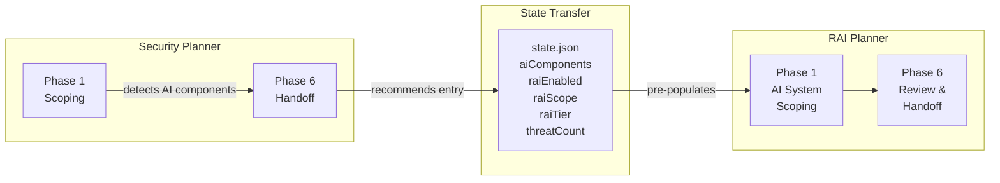
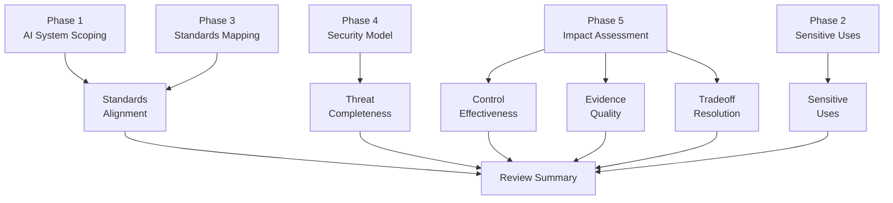

## Security Planner to RAI Planner Pipeline

The Security Planner and RAI Planner form a connected assessment pipeline. When the Security Planner detects AI or ML components during Phase 1, it captures component details and enables RAI dispatch. At Phase 6, the Security Planner recommends starting the RAI Planner in `from-security-plan` mode.

<!-- cspell:ignore nrai -->

### What the RAI Planner Receives

When entering via `from-security-plan` mode, the RAI Planner reads the security plan's `state.json` and inherits:

| Data                    | Source field         | How it is used                                                        |
|-------------------------|----------------------|-----------------------------------------------------------------------|
| AI component inventory  | `aiComponents` array | Pre-populates Phase 1 AI element catalog                              |
| RAI assessment scope    | `raiScope`           | Sets initial assessment boundaries                                    |
| RAI depth tier          | `raiTier`            | Determines assessment depth (`Basic`, `Standard`, or `Comprehensive`) |
| Threat count            | threat catalog size  | Starting sequence for `T-RAI-{NNN}` IDs                               |
| Security plan reference | state.json path      | Stored in `securityPlanRef` for cross-referencing                     |

> [!NOTE]
> The RAI Planner reads security plan artifacts as read-only. It never modifies files under `.copilot-tracking/security-plans/`.

## Review Summary Generation

Phase 6 produces a review summary covering observations across six dimensions. The review summary presents maturity indicators rather than numeric scores, supporting handoff decisions and backlog prioritization.

### Review Dimensions

| Dimension             | What it covers                                                         |
|-----------------------|------------------------------------------------------------------------|
| Standards Alignment   | How well AI components map to RAI principles and regulatory frameworks |
| Threat Completeness   | Completeness and accuracy of AI-specific threat identification         |
| Control Effectiveness | Coverage and effectiveness of controls for identified threats          |
| Evidence Quality      | Quality and availability of evidence supporting control effectiveness  |
| Tradeoff Resolution   | Clarity of principle tradeoff analysis and resolution rationale        |
| Sensitive Uses        | Whether sensitive use triggers were addressed with appropriate depth   |

## Backlog Generation

Gaps identified during Phases 3 through 5 are converted to work items using the same dual-platform format as the Security Planner.

### Dual-Platform Support

| Platform | ID format        | Formatting                     | Target system           |
|----------|------------------|--------------------------------|-------------------------|
| ADO      | `WI-RAI-{NNN}`   | HTML `
` wrapper           | Azure DevOps work items |
| GitHub   | `{{RAI-TEMP-N}}` | Markdown with YAML frontmatter | GitHub issues           |

### Autonomy Tiers

Each generated work item receives an autonomy tier based on the severity and complexity of the finding.

| Tier    | Human involvement                                    | When assigned                                              |
|---------|------------------------------------------------------|------------------------------------------------------------|
| Full    | Agent creates and submits without confirmation       | Low-severity findings with clear remediation               |
| Partial | Agent creates items; user confirms before submission | Default tier for most findings                             |
| Manual  | Agent recommends; user creates items                 | High-severity findings or cross-team coordination required |

### Content Sanitization

All generated backlog content is sanitized before handoff:

1. Replace `.copilot-tracking/` paths with descriptive text
2. Replace full file system paths with relative references
3. Remove state JSON content or references
4. Remove internal tracking IDs that are not work item IDs
5. Preserve standards references in all cases

## Pipeline Artifacts

| Artifact                       | Path                                                                      | Generated during |
|--------------------------------|---------------------------------------------------------------------------|------------------|
| System definition pack         | `.copilot-tracking/rai-plans/{slug}/system-definition-pack.md`            | Phase 1          |
| Stakeholder impact map         | `.copilot-tracking/rai-plans/{slug}/stakeholder-impact-map.md`            | Phase 1          |
| Sensitive uses trigger summary | `.copilot-tracking/rai-plans/{slug}/system-definition-pack.md` (appended) | Phase 2          |
| RAI standards mapping          | `.copilot-tracking/rai-plans/{slug}/rai-standards-mapping.md`             | Phase 3          |
| RAI security model addendum    | `.copilot-tracking/rai-plans/{slug}/rai-security-model-addendum.md`       | Phase 4          |
| Control surface catalog        | `.copilot-tracking/rai-plans/{slug}/control-surface-catalog.md`           | Phase 5          |
| Evidence register              | `.copilot-tracking/rai-plans/{slug}/evidence-register.md`                 | Phase 5          |
| RAI tradeoffs                  | `.copilot-tracking/rai-plans/{slug}/rai-tradeoffs.md`                     | Phase 5          |
| RAI review summary             | `.copilot-tracking/rai-plans/{slug}/rai-review-summary.md`                | Phase 6          |
| Handoff summary                | `.copilot-tracking/rai-plans/{slug}/rai-backlog-handoff-summary.md`       | Phase 6          |

## Artifact Attribution and Review

Persisted RAI artifacts include transparency footers that communicate AI involvement and establish expectations for human review. Footer composition varies based on whether an artifact is consumed by subsequent agent phases or delivered to human reviewers for validation and decision-making.

### AI-Content Note

Every Phase 5 and Phase 6 artifact includes a transparency note at the end of the file:

<!-- markdownlint-disable search-replace -->
> **Note** — The author created this content with assistance from AI. All outputs should be reviewed and validated before use.
<!-- markdownlint-enable search-replace -->

### Human Review Checkbox

Artifacts delivered to human reviewers include a review validation checkbox beneath the AI-content note:

<!-- markdownlint-disable MD004 -->
> - [ ] Reviewed and validated by a human reviewer
<!-- markdownlint-enable MD004 -->

Reviewers check this box upon completing their assessment to signal that the content has been validated.

### Full Disclaimer

The Handoff Summary and Compact Handoff Summary append the full RAI Planner disclaimer after the review checkbox. This disclaimer establishes that the agent is an assistive tool only and that all outputs require independent review by appropriate legal and compliance reviewers before use.

### Footer Classification

The following table shows which footer components appear on each Phase 5 and Phase 6 artifact. Agentic artifacts are consumed by subsequent agent phases, while human-facing artifacts are delivered to reviewers.

| Artifact                  | Phase | Category     | AI-content note | Review checkbox | Full disclaimer |
|---------------------------|-------|--------------|:---------------:|:---------------:|:---------------:|
| Control surface catalog   | 5     | Agentic      |        ✓        |                 |                 |
| Evidence register         | 5     | Agentic      |        ✓        |                 |                 |
| RAI tradeoffs             | 5     | Human-facing |        ✓        |        ✓        |                 |
| RAI review summary        | 6     | Human-facing |        ✓        |        ✓        |                 |
| ADO work items            | 6     | Human-facing |        ✓        |        ✓        |                 |
| GitHub issues             | 6     | Human-facing |        ✓        |        ✓        |                 |
| Transparency note outline | 6     | Human-facing |        ✓        |        ✓        |                 |
| Monitoring summary        | 6     | Human-facing |        ✓        |        ✓        |                 |
| Handoff summary           | 6     | Human-facing |        ✓        |        ✓        |        ✓        |
| Compact handoff summary   | 6     | Human-facing |        ✓        |        ✓        |        ✓        |

> [!NOTE]
> Transparency note outline and monitoring summary are optional artifacts generated only when the user opts in during Phase 6.

End-to-end assessment flow

1. Security Planner completes Phase 6 with `raiEnabled: true` and AI component data in state
2. User starts RAI Planner with `from-security-plan` prompt, providing the security plan project slug
3. RAI Planner reads security plan state and pre-populates Phase 1 with AI components and threat count
4. Phases 1-5 proceed with focused assessment of AI-specific risks, building on the security plan's foundation
5. Phase 6 produces the review summary with observations across six dimensions
6. Backlog items are generated for identified gaps using the user's preferred platform format
7. Assessment artifacts persist under `.copilot-tracking/rai-plans/{project-slug}/` for future reference and updates

<!-- markdownlint-disable MD036 -->
*🤖 Crafted with precision by ✨Copilot following brilliant human instruction,
then carefully refined by our team of discerning human reviewers.*
<!-- markdownlint-enable MD036 -->
