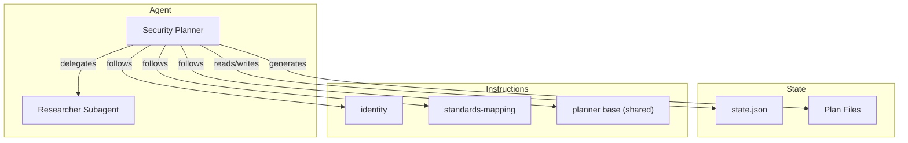

The Security Planner is a phase-based conversational agent that produces security models, standards mappings, and backlog handoff artifacts. It detects AI/ML components during scoping and coordinates with the RAI Planner for responsible AI assessments.

## Architecture

The agent is driven by the Security Planner agent definition plus a small set of instruction files: the security identity instructions govern overall behavior and state management, the standards-mapping instructions scope the delegated standards lookups, and the shared planner base supplies the common phase-orchestration scaffold. Phase-specific guidance for bucket classification, security model analysis, and backlog generation lives in the agent definition itself.

## State Management

All state lives in `.copilot-tracking/security-plans/{project-slug}/state.json`. The agent follows a six-step protocol on every turn:

| Step      | Action                                                                 |
|-----------|------------------------------------------------------------------------|
| READ      | Load the current state file                                            |
| VALIDATE  | Confirm the state schema is intact and the current phase is consistent |
| DETERMINE | Decide which phase and step to execute based on state and user input   |
| EXECUTE   | Perform the phase work (questions, analysis, artifact generation)      |
| UPDATE    | Modify the in-memory state to reflect completed work                   |
| WRITE     | Persist the updated state back to the file                             |

### State Fields

The state file tracks 21 fields across scoping, analysis, and handoff concerns.

| Field                    | Type     | Description                                                   |
|--------------------------|----------|---------------------------------------------------------------|
| `projectSlug`            | string   | Kebab-case project identifier                                 |
| `securityPlanFile`       | string   | Path to the main plan markdown file                           |
| `currentPhase`           | number   | Current phase (1-6)                                           |
| `entryMode`              | string   | `from-prd` or `capture`                                       |
| `phaseGates`             | object   | Per-phase gate status; phases 1, 4, 6 are hard gates          |
| `bucketsCompleted`       | string[] | Operational buckets that have been classified                 |
| `standardsMapped`        | string[] | Buckets with completed standards mapping                      |
| `riskSurfaceStarted`     | boolean  | Whether Phase 4 threat modeling has begun                     |
| `handoffGenerated`       | object   | `{ado: boolean, github: boolean}`                             |
| `context`                | object   | Tech stack, deployment model, data classification, compliance |
| `referencesProcessed`    | string[] | Paths to PRD/BRD artifacts that were consumed                 |
| `nextActions`            | string[] | Pending actions for the current or next phase                 |
| `disclaimerShownAt`      | string   | ISO 8601 timestamp when the disclaimer was shown, or null     |
| `noticeLog`              | object[] | Audit log of disclaimers, attributions, and review reminders  |
| `userPreferences`        | object   | Autonomy preference: `guided`, `partial`, or `full`           |
| `raiEnabled`             | boolean  | Whether AI/ML components were detected                        |
| `raiScope`               | string   | `none`, `embedded`, or `delegated`                            |
| `raiTier`                | string   | `none`, `basic`, `standard`, or `comprehensive`               |
| `raiRecommendationShown` | boolean  | Whether the RAI recommendation has been presented             |
| `raiPlannerDispatched`   | boolean  | Whether the user actually started the RAI Planner handoff     |
| `aiComponents`           | string[] | List of detected AI/ML components                             |

## Interaction Model

The agent follows strict question rules during each phase:

| Guardrail                             | Description                                                                                        |
|---------------------------------------|----------------------------------------------------------------------------------------------------|
| 3-5 questions per turn                | Enough to make progress without overwhelming the user                                              |
| Emoji checklists                      | Questions use ❓ for pending, ✅ for answered, and ❌ for blocked items                               |
| No phase advance without confirmation | The agent summarizes phase findings and asks for explicit approval before moving to the next phase |

## Session Resume

When a conversation resumes from a prior session, the agent follows a four-step recovery protocol:

1. Read the state file from `.copilot-tracking/security-plans/{project-slug}/`.
2. Validate that the state schema matches the expected version.
3. Present a summary of completed phases and pending work.
4. Continue from the current phase without re-asking answered questions.

A five-step post-summarization recovery handles cases where conversation context was compacted by the chat system.

## Operational Constraints

* All generated files are placed under `.copilot-tracking/security-plans/{project-slug}/`.
* The agent never modifies source code or files outside its tracking directory.
* The Researcher Subagent is dispatched for runtime standards and framework lookups during Phase 3, covering WAF and CAF as well as MCSB, PCI-DSS, S2C2F, SLSA, SOC 2, HIPAA, and FedRAMP when those are in scope.
* When AI/ML components were detected, Phase 6 recommends the RAI Planner and suggests the `from-security-plan` entry mode pointed at the Security Planner `state.json`, but the handoff is marked dispatched only once the user starts it.

## Related Files

| File type    | Location                                                     |
|--------------|--------------------------------------------------------------|
| Agent        | `.github/agents/security/security-planner.agent.md`          |
| Prompts      | `.github/prompts/security/`                                  |
| Instructions | `.github/instructions/security/`                             |
| State        | `.copilot-tracking/security-plans/{project-slug}/state.json` |

<!-- markdownlint-disable MD036 -->
*🤖 Crafted with precision by ✨Copilot following brilliant human instruction,
then carefully refined by our team of discerning human reviewers.*
<!-- markdownlint-enable MD036 -->
