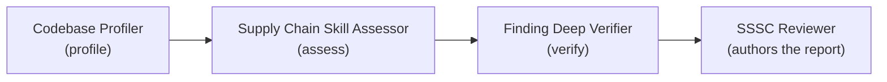

The SSSC Reviewer is a user-invocable agent that reviews your repository's software supply-chain security posture and authors an evidence-based review report. It dispatches a three-stage subagent pipeline (profile the codebase, assess it against the applicable supply-chain skill, and verify findings through adversarial review), then writes the report itself, so the output reflects evidence-backed findings rather than a raw checklist pass.

> The reviewer is an analysis-and-reporting agent, not a planning conversation. It reviews what exists today (or what a plan proposes) and produces a point-in-time report you can act on.

It also owns HVE Core's [VEX assessment capability](vex-capability.md) for triaging dependency vulnerabilities and drafting OpenVEX statements.

## When to Use

HVE Core includes three complementary security agents. Pick the one matched to your goal.

| Use this             | When you want to…                                                                                                             |
|----------------------|-------------------------------------------------------------------------------------------------------------------------------|
| 🔎 SSSC Reviewer     | Run an automated, evidence-verified posture review of the current codebase (or a PR diff, or a plan) and get a written report |
| 🛡️ Security Planner | Walk a structured six-phase threat-modeling interview that produces backlog items across seven operational buckets            |
| 🔗 SSSC Planner      | Hold a conversational supply-chain planning session that maps OpenSSF Scorecard, SLSA, Sigstore, and SBOM gaps to a backlog   |

In short: reach for the **SSSC Reviewer** when you need an assessment report now, the **Security Planner** for broad threat modeling and backlog generation, and the **SSSC Planner** when you want a guided, conversational supply-chain plan with handoff-ready work items.

## Operating Modes

The reviewer runs in one of three modes. When no mode is supplied, it defaults to `audit`.

| Mode    | Scope                                      | Report artifact               |
|---------|--------------------------------------------|-------------------------------|
| `audit` | Full repository                            | `sssc-review-{{NNN}}.md`      |
| `diff`  | Changed files in a PR (full-repo verifies) | `sssc-review-diff-{{NNN}}.md` |
| `plan`  | An implementation plan document            | `sssc-plan-review-{{NNN}}.md` |

* **audit** profiles and assesses the entire codebase.
* **diff** resolves the changed files, scopes the assessment to them, and keeps supply-chain-relevant configuration (CI/CD workflows, dependency manifests, lockfiles, SBOM documents, signing or provenance configuration) in scope.
  It takes a PR reference or changed-files list you supply, generates a PR reference with the `pr-reference` skill when you supply neither, and compares the branch against its base when that skill is unavailable, noting the reduced rigor under Limitations.
  Verification still searches the full repository so mitigations in unchanged code do not produce false positives.
* **plan** evaluates an implementation plan document for supply-chain risk before the work is built. Findings pass through without the adversarial verification step.

## The Three-Subagent Pipeline



| Stage   | Owner                       | Responsibility                                                                                       |
|---------|-----------------------------|------------------------------------------------------------------------------------------------------|
| Profile | Codebase Profiler           | Detects the technology stack and lists applicable supply-chain skills from the codebase signals      |
| Assess  | Supply Chain Skill Assessor | Assesses the codebase (or plan) against each applicable skill and returns a findings table           |
| Verify  | Finding Deep Verifier       | Runs adversarial review on every FAIL and PARTIAL finding, confirming, disproving, or downgrading it |
| Report  | SSSC Reviewer               | Translates the verified findings into its own nine-section review report and writes it               |

The reviewer delegates all reference reading to the subagents; it never reads the supply-chain reference files directly. `PASS` and `NOT_ASSESSED` findings pass through unchanged. In `plan` mode the verify stage is skipped.

The reviewer authors the report itself rather than delegating to the shared `Report Generator`, whose report roots are fixed to the security and accessibility directories and whose format differs from the SSSC review contract.

## Subagent Reference

Each subagent is internal (not user-invocable) and is dispatched by the reviewer. Two of the three are shared with the security and accessibility review pipelines; only the Supply Chain Skill Assessor is specific to supply-chain assessment.

### Codebase Profiler

* **Role:** Scans the repository to identify languages, frameworks, and infrastructure patterns, then matches those technology signals against the skill catalog to recommend applicable skills.
* **Inputs:** Codebase root (defaults to the repository root); optional subdirectory focus, prior profile, diff-mode changed files, or plan-mode plan content.
* **Output:** A structured profile (repository, mode, primary languages, frameworks, and an applicable-skills list) passed verbatim to the downstream subagents.
* **Notes:** Errs toward inclusion, listing a skill when its signals are uncertain to avoid missing potential issues. Skipped when a single target skill is supplied to the reviewer.

### Supply Chain Skill Assessor

* **Role:** Assesses exactly one supply-chain skill per invocation. Reads the `supply-chain-security` skill and its referenced catalogs (capabilities inventory, adoption taxonomies, Scorecard mapping, SLSA, Sigstore, and SBOM references), then analyzes the codebase or plan against them.
* **Inputs:** The skill name and the codebase profile (both required); optional diff-mode changed files or plan-mode plan content.
* **Output:** A findings table with status (`PASS`, `FAIL`, `PARTIAL`, `NOT_ASSESSED`) and severity (`CRITICAL`, `HIGH`, `MEDIUM`, `LOW`), plus per-finding evidence and remediation guidance. In `plan` mode it returns risk-oriented statuses (`RISK`, `CAUTION`, `COVERED`, `NOT_APPLICABLE`).
* **Notes:** Read-only; it never modifies repository files. The reviewer runs one assessor per applicable skill.

### Finding Deep Verifier

* **Role:** Adversarial reviewer that independently re-checks every `FAIL` and `PARTIAL` finding for a skill in a single invocation, searching for both confirming and contradicting evidence.
* **Inputs:** The skill name, the list of `FAIL`/`PARTIAL` findings, and the codebase profile; optional diff context.
* **Output:** One verdict block per finding (`CONFIRMED`, `DISPROVED`, or `DOWNGRADED`) with the updated status and severity.
* **Notes:** Invoked only in `audit` and `diff` modes; verification is skipped entirely in `plan` mode. In `diff` mode it searches the full repository so mitigations in unchanged code are not flagged as false positives.

### Report Authoring

* **Role:** The reviewer authors the report directly, translating the subagent vocabulary into its own review contract.
* **Status mapping:** `PASS`, `PARTIAL`, and `FAIL` carry through unchanged; `NOT_ASSESSED` becomes `NEEDS_REVIEW`.
* **Verification:** Each verified finding records its verdict (`CONFIRMED`, `DOWNGRADED`, or `UNCHANGED`) alongside its verified status and severity. `DISPROVED` findings are retained in a distinct subsection rather than dropped, so the report shows what adversarial verification eliminated.
* **Notes:** The report follows a nine-section contract with an evidence inventory, limitations, follow-up guidance, and human-review checkboxes.

## Inputs

The reviewer runs with no required arguments; an unqualified invocation performs a full `audit`. The following optional inputs refine the run:

| Input                | Effect                                                                                                                      |
|----------------------|-----------------------------------------------------------------------------------------------------------------------------|
| Mode                 | `audit`, `diff`, or `plan`. Defaults to `audit`.                                                                            |
| PR reference         | An existing PR reference or changed-files list for `diff` mode. The agent produces one itself when you omit it.             |
| Subdirectory / path  | Focus profiling and scanning on a specific area of the codebase (audit and diff).                                           |
| Specific skills list | Comma-separated skills that override the profiler's automatic skill detection. The profiler still runs for context.         |
| Target skill         | A single supply-chain skill (for example, `supply-chain-security`). Fast-paths past profiling and assesses only that skill. |
| Prior scan report    | A previous report path for incremental comparison.                                                                          |
| Plan document        | The plan path or content used in `plan` mode. The agent asks for this if it cannot resolve one.                             |

## Output Artifacts

The review report is written to the SSSC reviews directory, dated by the run:

```text
.copilot-tracking/sssc-reviews/{{YYYY-MM-DD}}/sssc-review-{{NNN}}.md
.copilot-tracking/sssc-reviews/{{YYYY-MM-DD}}/sssc-review-diff-{{NNN}}.md   # diff mode
.copilot-tracking/sssc-reviews/{{YYYY-MM-DD}}/sssc-plan-review-{{NNN}}.md   # plan mode
```

The `{{NNN}}` sequence number increments per day, starting at `001`. After the report is written, the agent prints a completion summary with the report path and the highest-priority next steps, followed by a professional review disclaimer.

## Prerequisites

* The SSSC Reviewer agent installed and enabled through the complete `hve-core` identity.
* The three pipeline subagents available: Codebase Profiler, Supply Chain Skill Assessor, and Finding Deep Verifier.
* The `supply-chain-security` skill and the `security-reviewer-formats` skill for the assessment references and finding formats.
* For `diff` work: the `pr-reference` skill, when you want generated PR evidence rather than the base-branch comparison fallback.
* For VEX work: the `vex` skill and the `CVE Analyzer` subagent.

## Quick Start

1. Open the agent picker and select **SSSC Reviewer**.
2. Run it with no arguments for a full `audit`, or specify a mode (`diff` or `plan`) and any optional focus.
3. For `diff` mode, optionally supply a pull request reference or changed-files list; the agent resolves the changed files itself when you supply neither. For `plan` mode, provide the plan document path.
4. Review the generated report under `.copilot-tracking/sssc-reviews/{{YYYY-MM-DD}}/` and act on the severity-grouped findings.

> [!IMPORTANT]
> The report is an AI-assisted assessment. Treat the professional review disclaimer in the completion output as a prompt for qualified human review before relying on the findings. The human-review checkboxes in the report are never marked complete by the agent.

## Next Steps

* [VEX Capability](vex-capability.md) for dependency vulnerability triage and OpenVEX drafting.
* [Security Planning](README.md) for structured threat modeling and backlog generation.
* [Why Security Planning?](why-security-planning.md) for the reasoning behind the security workflow.

<!-- markdownlint-disable MD036 -->
*🤖 Crafted with precision by ✨Copilot following brilliant human instruction,
then carefully refined by our team of discerning human reviewers.*
<!-- markdownlint-enable MD036 -->
