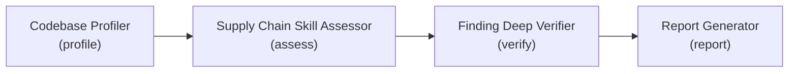

The Supply Chain Reviewer is a user-invocable agent that assesses your repository's software supply-chain posture and writes a consolidated security report. It orchestrates a four-stage subagent pipeline (profile the codebase, assess it against the applicable supply-chain skill, verify findings through adversarial review, and generate the report) so the output reflects evidence-backed findings rather than a raw checklist pass.

> The reviewer is an analysis-and-reporting agent, not a planning conversation. It scans what exists today (or what a plan proposes) and produces a point-in-time report you can act on.

## When to Use

The security collection ships three complementary agents. Pick the one matched to your goal.

| Use this                  | When you want to…                                                                                                            |
|---------------------------|----------------------------------------------------------------------------------------------------------------------------|
| 🔎 Supply Chain Reviewer  | Run an automated, evidence-verified posture scan of the current codebase (or a PR diff, or a plan) and get a written report |
| 🛡️ Security Planner       | Walk a structured six-phase threat-modeling interview that produces backlog items across seven operational buckets          |
| 🔗 SSSC Planner           | Hold a conversational supply-chain planning session that maps OpenSSF Scorecard, SLSA, Sigstore, and SBOM gaps to a backlog |

In short: reach for the **Supply Chain Reviewer** when you need an assessment report now, the **Security Planner** for broad threat modeling and backlog generation, and the **SSSC Planner** when you want a guided, conversational supply-chain plan with handoff-ready work items.

## Operating Modes

The reviewer runs in one of three modes. When no mode is supplied, it defaults to `audit`.

| Mode    | Scope                                       | Report artifact                                                       |
|---------|---------------------------------------------|----------------------------------------------------------------------|
| `audit` | Full repository                             | `security-report-{{NNN}}.md`                                          |
| `diff`  | Changed files in a PR (full-repo verifies)  | `security-report-diff-{{NNN}}.md`                                     |
| `plan`  | An implementation plan document             | `plan-risk-assessment-{{NNN}}.md`                                     |

* **audit** profiles and assesses the entire codebase.
* **diff** uses the `pr-reference` skill to resolve the changed files, scopes the assessment to those files, and keeps supply-chain-relevant configuration (CI/CD workflows, dependency manifests, lockfiles, SBOM documents, signing or provenance configuration) in scope. Verification still searches the full repository so mitigations in unchanged code do not produce false positives.
* **plan** evaluates an implementation plan document for supply-chain risk before the work is built. Findings pass through without the adversarial verification step.

## The Four-Subagent Pipeline



| Stage   | Subagent                    | Responsibility                                                                                       |
|---------|-----------------------------|-----------------------------------------------------------------------------------------------------|
| Profile | Codebase Profiler           | Detects the technology stack and lists applicable supply-chain skills from the codebase signals      |
| Assess  | Supply Chain Skill Assessor | Assesses the codebase (or plan) against each applicable skill and returns a findings table           |
| Verify  | Finding Deep Verifier       | Runs adversarial review on every FAIL and PARTIAL finding, confirming, disproving, or downgrading it  |
| Report  | Report Generator            | Collates the verified findings and writes the consolidated report under `Domain: security`           |

The orchestrator delegates all reference reading to the subagents; it never reads the supply-chain reference files directly. PASS and `NOT_ASSESSED` findings pass through unchanged. In `plan` mode the verify stage is skipped.

## Subagent Reference

Each subagent is internal (not user-invocable) and is dispatched by the reviewer. Three of the four are shared across the security and accessibility review pipelines; only the Supply Chain Skill Assessor is specific to supply-chain assessment.

### Codebase Profiler

* **Role:** Scans the repository to identify languages, frameworks, and infrastructure patterns, then matches those technology signals against the skill catalog to recommend applicable skills.
* **Inputs:** Codebase root (defaults to the repository root); optional subdirectory focus, prior profile, diff-mode changed files, or plan-mode plan content.
* **Output:** A structured profile (repository, mode, primary languages, frameworks, and an applicable-skills list) passed verbatim to the downstream subagents.
* **Notes:** Errs toward inclusion, listing a skill when its signals are uncertain to avoid missing potential issues. Skipped when a single target skill is supplied to the reviewer.

### Supply Chain Skill Assessor

* **Role:** Assesses exactly one supply-chain skill per invocation. Reads the `supply-chain-security` skill and its referenced catalogs (capabilities inventory, adoption taxonomies, Scorecard mapping, SLSA, Sigstore, and SBOM references), then analyzes the codebase or plan against them.
* **Inputs:** The skill name and the codebase profile (both required); optional diff-mode changed files or plan-mode plan content.
* **Output:** A findings table with status (`PASS`, `FAIL`, `PARTIAL`, `NOT_ASSESSED`) and severity (`CRITICAL`, `HIGH`, `MEDIUM`, `LOW`), plus per-finding evidence and remediation guidance. In `plan` mode it returns risk-oriented statuses (`RISK`, `CAUTION`, `COVERED`, `NOT_APPLICABLE`).
* **Notes:** Read-only; it never modifies repository files. The reviewer runs one assessor per applicable skill.

### Finding Deep Verifier

* **Role:** Adversarial reviewer that independently re-checks every `FAIL` and `PARTIAL` finding for a skill in a single invocation, searching for both confirming and contradicting evidence.
* **Inputs:** The skill name, the list of `FAIL`/`PARTIAL` findings, and the codebase profile; optional diff context.
* **Output:** One verdict block per finding (`CONFIRMED`, `DISPROVED`, or `DOWNGRADED`) with the updated status and severity.
* **Notes:** Invoked only in `audit` and `diff` modes; verification is skipped entirely in `plan` mode. In `diff` mode it searches the full repository so mitigations in unchanged code are not flagged as false positives.

### Report Generator

* **Role:** Collates the verified findings into a single report, computes summary and severity counts, sorts remediation guidance by severity, and writes the dated report file.
* **Inputs:** The verified findings collection (grouped by skill), repository name, ISO 8601 report date, and the assessed-skills list; optional mode, domain, changed-files appendix, and plan reference.
* **Output:** The written report path plus the format used and the computed counts returned to the reviewer for its completion summary.
* **Notes:** Supply-chain runs pass `Domain: security`, so the report lands in the shared security reports directory while the body uses supply-chain terminology.

## Inputs

The reviewer runs with no required arguments; an unqualified invocation performs a full `audit`. The following optional inputs refine the run:

| Input                 | Effect                                                                                                                     |
|-----------------------|---------------------------------------------------------------------------------------------------------------------------|
| Mode                  | `audit`, `diff`, or `plan`. Defaults to `audit`.                                                                          |
| Subdirectory / path   | Focus profiling and scanning on a specific area of the codebase (audit and diff).                                         |
| Specific skills list  | Comma-separated skills that override the profiler's automatic skill detection. The profiler still runs for context.        |
| Target skill          | A single supply-chain skill (for example, `supply-chain-security`). Fast-paths past profiling and assesses only that skill. |
| Prior scan report     | A previous report path for incremental comparison.                                                                       |
| Plan document         | The plan path or content used in `plan` mode. The agent asks for this if it cannot resolve one.                          |

## Output Artifacts

The consolidated report is written to the shared security reports directory, dated by the run:

```text
.copilot-tracking/security/{{YYYY-MM-DD}}/security-report-{{NNN}}.md
.copilot-tracking/security/{{YYYY-MM-DD}}/security-report-diff-{{NNN}}.md   # diff mode
.copilot-tracking/security/{{YYYY-MM-DD}}/plan-risk-assessment-{{NNN}}.md   # plan mode
```

The `{{NNN}}` sequence number increments per day, starting at `001`. After the report is written, the agent prints a completion summary with severity and status counts, the assessed skills, and the report path, followed by a professional review disclaimer. Reports are written under `Domain: security` while the report body uses supply-chain terminology.

## Prerequisites

* The Supply Chain Reviewer agent installed and enabled. It ships in the **security** collection and the bundled **hve-core-all** collection.
* The four pipeline subagents available: Codebase Profiler, Supply Chain Skill Assessor, Finding Deep Verifier, and Report Generator.
* The `supply-chain-security` skill and the `security-reviewer-formats` skill for the assessment references and report templates.
* For `diff` mode: the `pr-reference` skill to resolve the changed files for a pull request.

## Quick Start

1. Open the agent picker and select **Supply Chain Reviewer**.
2. Run it with no arguments for a full `audit`, or specify a mode (`diff` or `plan`) and any optional focus.
3. For `diff` mode, ensure the change is available as a pull request reference; for `plan` mode, provide the plan document path.
4. Review the generated report under `.copilot-tracking/security/{{YYYY-MM-DD}}/` and act on the severity-grouped findings.

> [!IMPORTANT]
> The report is an AI-assisted assessment. Treat the professional review disclaimer in the completion output as a prompt for qualified human review before relying on the findings.

## Next Steps

* [Security Planning](README.md) for structured threat modeling and backlog generation.
* [Why Security Planning?](why-security-planning.md) for the reasoning behind the security workflow.

<!-- markdownlint-disable MD036 -->
*🤖 Crafted with precision by ✨Copilot following brilliant human instruction,
then carefully refined by our team of discerning human reviewers.*
<!-- markdownlint-enable MD036 -->
