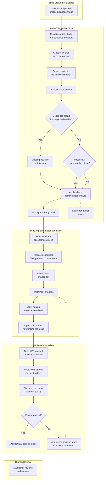
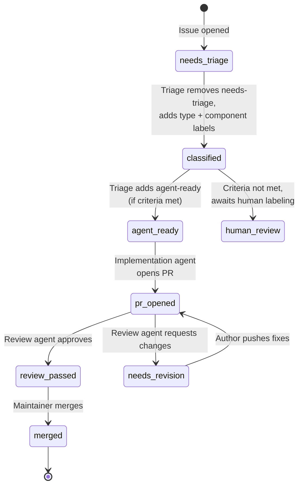
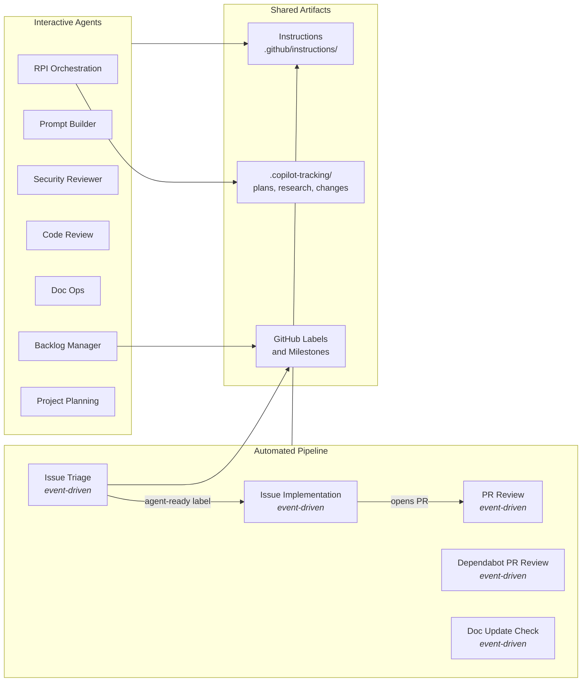

hve-core uses GitHub Agentic Workflows to automate the journey from issue creation through implementation, code review, and dependency management. Five event-driven workflows connect specialized agents into a pipeline where each stage triggers the next through labels, pull requests, and GitHub events.

> [!NOTE]
> GitHub Agentic Workflows is an experimental/beta feature. The workflows described here represent hve-core's early experiments with the technology and may evolve as the platform matures.

## End-to-End Process Flow

## Workflow Details

| Workflow                 | Trigger                                    | Agent                                                                                                                               | Key Actions                                                                       |
|--------------------------|--------------------------------------------|-------------------------------------------------------------------------------------------------------------------------------------|-----------------------------------------------------------------------------------|
| Issue Triage             | Issue opened or labeled `needs-triage`     | [Issue Triage Agent](https://github.com/microsoft/hve-core/blob/main/.github/agents/github/issue-triage.agent.md)                   | Classify, detect duplicates, assess quality, decompose, label, evaluate readiness  |
| Issue Implementation     | Issue labeled `agent-ready`                | [Task Implementor Agent](https://github.com/microsoft/hve-core/blob/main/.github/agents/hve-core/task-implementor.agent.md)         | Research codebase, plan changes, implement, open PR                                |
| PR Review                | PR opened or marked ready for review       | [PR Review Agent](https://github.com/microsoft/hve-core/blob/main/.github/agents/hve-core/pr-review.agent.md)                       | Review correctness, conventions, security; label `review-passed` or `needs-revision` |
| Dependabot PR Review     | Dependabot PR opened or updated            | [Dependency Reviewer Agent](https://github.com/microsoft/hve-core/blob/main/.github/agents/dependency-reviewer.agent.md)            | Validate licensing, SHA pinning, environment sync; approve safe bumps              |
| Documentation Update     | Push to main                               | [Documentation Update Checker Agent](https://github.com/microsoft/hve-core/blob/main/.github/agents/doc-update-checker.agent.md)    | Map code changes to docs, create issues for stale documentation                    |

> [!TIP]
> The triage agent only classifies, labels, and optionally decomposes issues. It does not close issues, assign users, or modify issue titles.

<!-- markdownlint-disable-next-line MD028 -->

> [!NOTE]
> The implementation agent keeps PRs small and focused. If the issue is ambiguous or too large, it posts a comment requesting clarification instead of guessing.

## Workflow Configuration

All five workflows are defined as GitHub Agentic Workflow markdown files under `.github/workflows/` and compiled to lock files using `gh aw compile`:

| Workflow File             | Lock File                       | Trigger                                | Agent                    |
|---------------------------|---------------------------------|----------------------------------------|--------------------------|
| `issue-triage.md`         | `issue-triage.lock.yml`         | Issue opened or labeled `needs-triage` | Issue Triage Agent       |
| `issue-implement.md`      | `issue-implement.lock.yml`      | Issue labeled `agent-ready`            | Task Implementor Agent   |
| `pr-review.md`            | `pr-review.lock.yml`            | PR opened or marked ready for review   | PR Review Agent          |
| `dependency-pr-review.md` | `dependency-pr-review.lock.yml` | Dependabot PR opened or updated        | Dependency Reviewer      |
| `doc-update-check.md`     | `doc-update-check.lock.yml`     | Push to main                           | Documentation Checker    |

Each workflow file declares permissions, safe output limits, and activation guards that prevent unintended execution.

## Label-Driven Handoffs

Labels serve as the event bus connecting workflows. Each label transition triggers the next stage:

## Interactive Agent Workflows

Beyond the automated GitHub event-driven pipeline, hve-core provides interactive agents invoked through VS Code Copilot Chat. These agents support the manual side of the development lifecycle.

### RPI Orchestration

The [RPI Agent](https://github.com/microsoft/hve-core/blob/main/.github/agents/hve-core/rpi-agent.agent.md) runs a five-phase iterative cycle: Research, Plan, Implement, Review, and Discover. It delegates to four specialized subagents:

| Agent            | Role                                                           |
|------------------|----------------------------------------------------------------|
| Task Researcher  | Deep codebase and domain analysis, produces research documents |
| Task Planner     | Creates phased implementation plans with validation steps      |
| Task Implementor | Executes plans through subagent delegation and tracks changes  |
| Task Reviewer    | Validates completed work against plans and conventions         |

Each agent hands off to the next through structured artifacts stored in `.copilot-tracking/`.

### Prompt Engineering

The [Prompt Builder](https://github.com/microsoft/hve-core/blob/main/.github/agents/hve-core/prompt-builder.agent.md) orchestrates a three-phase workflow for creating and refining AI artifacts (agents, prompts, instructions, skills):

1. Execute and evaluate prompt files using sandbox testing
2. Research findings and best practices
3. Apply modifications based on evaluation results

It delegates to Prompt Tester, Prompt Evaluator, Prompt Updater, and Researcher subagents.

### Security Review

The [Security Reviewer](https://github.com/microsoft/hve-core/blob/main/.github/agents/security/security-reviewer.agent.md) orchestrates OWASP-based vulnerability assessment through four subagents: Codebase Profiler, Skill Assessor, Finding Deep Verifier, and Report Generator. It supports audit, diff, and plan modes.

### Code Review

The [Functional Code Review](https://github.com/microsoft/hve-core/blob/main/.github/agents/code-review/functional-code-review.agent.md) agent analyzes branch diffs for logic errors, edge case gaps, and error handling deficiencies before code reaches a pull request. The [PR Review](https://github.com/microsoft/hve-core/blob/main/.github/agents/hve-core/pr-review.agent.md) agent provides comprehensive review after PR creation.

### Documentation Operations

The [Doc Ops](https://github.com/microsoft/hve-core/blob/main/.github/agents/hve-core/doc-ops.agent.md) agent audits documentation for style compliance, accuracy against implementation, and coverage gaps.

### Backlog Management

The [GitHub Backlog Manager](https://github.com/microsoft/hve-core/blob/main/.github/agents/github/github-backlog-manager.agent.md) coordinates five workflows (discovery, triage, sprint planning, execution, and quick add) for managing issue lifecycles. The [ADO Backlog Manager](https://github.com/microsoft/hve-core/blob/main/.github/agents/ado/ado-backlog-manager.agent.md) provides equivalent capabilities for Azure DevOps work items.

### Project Planning

Five agents support upstream planning activities:

| Agent                        | Purpose                                  |
|------------------------------|------------------------------------------|
| BRD Builder                  | Business Requirements Documents          |
| PRD Builder                  | Product Requirements Documents           |
| ADR Creation                 | Architecture Decision Records            |
| Architecture Diagram Builder | Visual system architecture diagrams      |
| Security Plan Creator        | Security assessment and mitigation plans |

## How It All Connects

The automated pipeline and interactive agents share instruction files for consistent coding standards. Interactive agents produce tracking artifacts that inform implementation. The automated pipeline uses GitHub labels as its coordination mechanism, while interactive agents coordinate through `.copilot-tracking/` files.

---

🤖 Crafted with precision by ✨Copilot following brilliant human instruction, then carefully refined by our team of discerning human reviewers.
