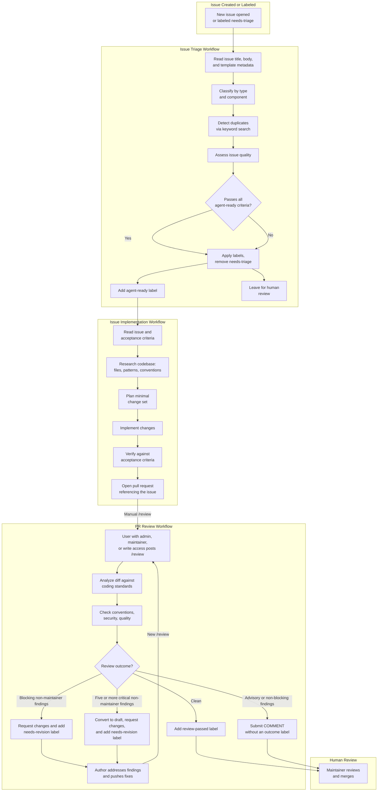
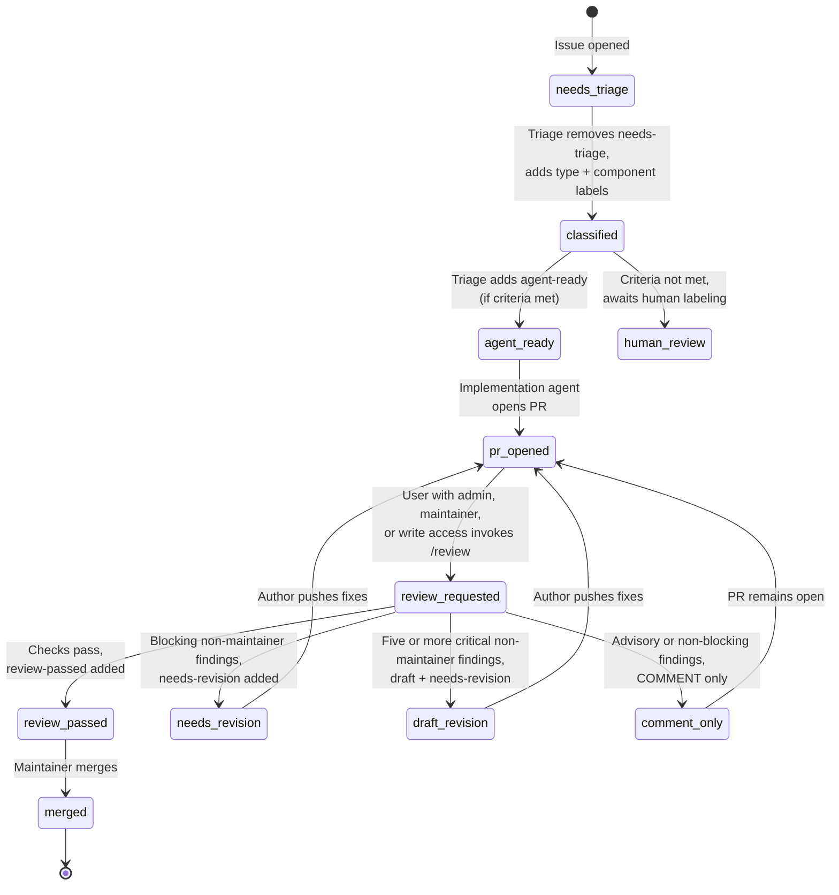
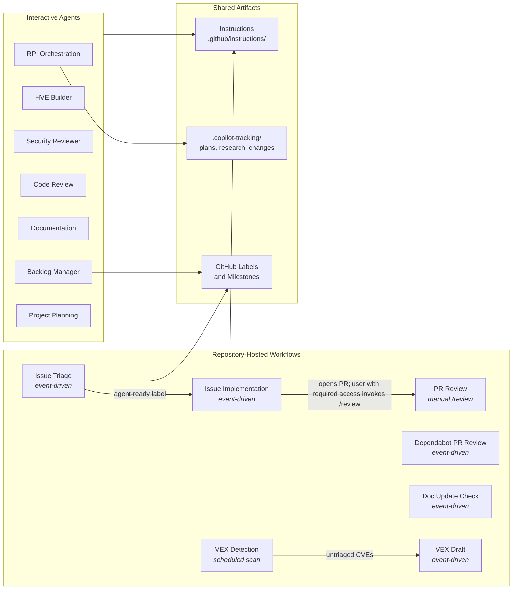

hve-core uses GitHub Agentic Workflows to support the journey from issue creation through implementation, code review, and dependency management. Six workflows connect specialized agents through labels, pull requests, comments, GitHub events, and manual slash commands.

> [!NOTE]
> GitHub Agentic Workflows is an experimental/beta feature. The workflows described here represent hve-core's early experiments with the technology and may evolve as the platform matures.

## End-to-End Process Flow


```mermaid
flowchart TD
    accTitle: Issue Triage and Pull Request Review Workflow
    accDescr: Issue triage routes qualifying issues into implementation. Opened pull requests pass through automated review outcomes, revision loops when needed, and human review before merge.
    subgraph TRIGGER["Issue Created or Labeled"]
        A["New issue opened<br/>or labeled needs-triage"]
    end

    subgraph TRIAGE["Issue Triage Workflow"]
        B["Read issue title, body,<br/>and template metadata"]
        C["Classify by type<br/>and component"]
        D["Detect duplicates<br/>via keyword search"]
        E["Assess issue quality"]
        H{"Passes all<br/>agent-ready criteria?"}
        I["Apply labels,<br/>remove needs-triage"]
        J["Add agent-ready label"]
        K["Leave for human<br/>review"]
    end

    subgraph IMPLEMENT["Issue Implementation Workflow"]
        L["Read issue and<br/>acceptance criteria"]
        M["Research codebase:<br/>files, patterns, conventions"]
        N["Plan minimal<br/>change set"]
        O["Implement changes"]
        P["Verify against<br/>acceptance criteria"]
        Q["Open pull request<br/>referencing the issue"]
    end

    subgraph REVIEW["PR Review Workflow"]
        R["User with admin, maintainer,<br/>or write access posts /review"]
        S["Analyze diff against<br/>coding standards"]
        T["Check conventions,<br/>security, quality"]
        U{"Review outcome?"}
        V["Add review-passed label"]
        W["Request changes and add<br/>needs-revision label"]
        Y["Submit COMMENT<br/>without an outcome label"]
        Z["Convert to draft, request changes,<br/>and add needs-revision label"]
        AA["Author addresses findings<br/>and pushes fixes"]
    end

    subgraph HUMAN["Human Review"]
        X["Maintainer reviews<br/>and merges"]
    end

    A --> B
    B --> C
    C --> D
    D --> E
    E --> H
    H -- Yes --> I
    I --> J
    H -- No --> I
    I --> K
    J --> L
    L --> M
    M --> N
    N --> O
    O --> P
    P --> Q
    Q -->|"Manual /review"| R
    R --> S
    S --> T
    T --> U
    U -- Clean --> V
    V --> X
    U -- "Blocking non-maintainer findings" --> W
    U -- "Five or more critical non-maintainer findings" --> Z
    U -- "Advisory or non-blocking findings" --> Y
    Y --> X
    W --> AA
    Z --> AA
    AA -->|"New /review"| R
```

## Workflow Details

| Workflow                   | Trigger                                                                                                    | Execution Owner                                                                                                                    | Key Actions                                                                                                                                                                                                                                                                            |
|----------------------------|------------------------------------------------------------------------------------------------------------|------------------------------------------------------------------------------------------------------------------------------------|----------------------------------------------------------------------------------------------------------------------------------------------------------------------------------------------------------------------------------------------------------------------------------------|
| Issue Triage               | Issue opened or labeled `needs-triage`                                                                     | [Issue Triage Agent](https://github.com/microsoft/hve-core/blob/main/.github/agents/issue-triage.agent.md)                         | Classify, detect duplicates, assess quality, label, evaluate readiness                                                                                                                                                                                                                 |
| Issue Implementation       | Issue labeled `agent-ready`                                                                                | Workflow-owned procedure in `.github/workflows/issue-implement.md`                                                                 | Research codebase, plan changes, implement, open PR                                                                                                                                                                                                                                    |
| PR Review                  | User with admin, maintainer, or write access posts `/review` in a PR conversation or inline review comment | [Code Review Agent](https://github.com/microsoft/hve-core/blob/main/.github/agents/coding-standards/code-review.agent.md)          | Add `review-passed` for clean reviews; request changes and add `needs-revision` for blocking non-maintainer findings; also convert non-maintainer PRs to draft for five or more critical findings; or submit `COMMENT` without an outcome label for advisory and non-blocking findings |
| Dependabot PR Review       | Dependabot PR opened or updated                                                                            | [Dependency Reviewer Agent](https://github.com/microsoft/hve-core/blob/main/.github/agents/dependency-reviewer.agent.md)           | Validate licensing, SHA pinning, and environment sync; post `COMMENT` or `REQUEST_CHANGES`; leave approval and merge to humans                                                                                                                                                         |
| Documentation Update Check | Push to main                                                                                               | [Documentation Agent](https://github.com/microsoft/hve-core/blob/main/.github/agents/hve-core/documentation.agent.md) (drift mode) | Map code changes to docs, flag stale documentation for follow-up                                                                                                                                                                                                                       |
| VEX Draft                  | `workflow_run` after VEX Detection succeeds, or `workflow_dispatch`                                        | [SSSC Reviewer](https://github.com/microsoft/hve-core/blob/main/.github/agents/security/sssc-reviewer.agent.md)                    | Enrich CVEs, analyze reachability, open one PR with OpenVEX draft statements for human review                                                                                                                                                                                          |

> [!TIP]
> The triage agent classifies issues, applies type, area, and priority labels, detects duplicates, assesses quality, and marks qualifying issues `agent-ready`. It does not create sub-issues, close issues, assign users, or modify issue titles.

<!-- markdownlint-disable-next-line MD028 -->

> [!NOTE]
> The implementation agent keeps PRs small and focused. If the issue is ambiguous or too large, it posts a comment requesting clarification instead of guessing.

<!-- markdownlint-disable-next-line MD028 -->

> [!NOTE]
> **Maintainer advisory mode.** When the PR author is a `MEMBER`, `OWNER`, or `COLLABORATOR`, the Code Review Agent switches to advisory mode: it posts a `COMMENT` review prefixed with "Advisory review …", never uses `REQUEST_CHANGES`, does not add the `needs-revision` label, and does not convert the PR to draft.

## Workflow Configuration

All six workflows are defined as GitHub Agentic Workflow markdown files under `.github/workflows/` and compiled to lock files using `gh aw compile`:

| Workflow File             | Lock File                       | Trigger                                                                      | Execution Owner          |
|---------------------------|---------------------------------|------------------------------------------------------------------------------|--------------------------|
| `issue-triage.md`         | `issue-triage.lock.yml`         | Issue opened or labeled `needs-triage`                                       | Issue Triage Agent       |
| `issue-implement.md`      | `issue-implement.lock.yml`      | Issue labeled `agent-ready`                                                  | Workflow-owned procedure |
| `pr-review.md`            | `pr-review.lock.yml`            | User with admin, maintainer, or write access posts `/review` in a PR comment | Code Review Agent        |
| `dependency-pr-review.md` | `dependency-pr-review.lock.yml` | Dependabot PR opened or updated                                              | Dependency Reviewer      |
| `doc-update-check.md`     | `doc-update-check.lock.yml`     | Push to main                                                                 | Documentation Agent      |
| `vex-draft.md`            | `vex-draft.lock.yml`            | VEX Detection `workflow_run` + dispatch                                      | SSSC Reviewer            |

Each workflow file declares permissions, safe output limits, and activation guards that prevent unintended execution.

### Lock File Ownership

The `*.lock.yml` files under `.github/workflows/` are generated outputs of `gh aw compile`. Editing them directly is not supported: the next compile overwrites the change. Edit the source `.md` workflow instead, then recompile.

Because these files are generated, Dependabot is configured to leave them alone. `.github/dependabot.yml` excludes the `.github/workflows/*.lock.yml` path and the `github/gh-aw-actions/*` action family, so action bumps inside a lock file never arrive as a pull request.

### Upgrading gh-aw-actions

The `gh-aw-actions` version is tied to the `gh aw` compiler release, not set independently, and Dependabot does not manage it. Since compiler v0.85.4 the `github/gh-aw-actions/*` family no longer resolves through `.github/aw/actions-lock.json`: the compiler emits the mutable tag `github/gh-aw-actions/<action>@vX.Y.Z` by default, and `--action-tag` is written to the lock files verbatim.

No compiler flag emits both an immutable SHA and a version comment, so the repository supplies the SHA at compile time and the version comment afterward:

1. Upgrade the `gh aw` CLI/compiler to the target release.
2. Resolve the matching `gh-aw-actions` release tag to its commit SHA: `gh api repos/github/gh-aw-actions/commits/vX.Y.Z --jq '.sha'`.
3. Recompile every workflow against that immutable commit: `gh aw compile --action-mode action --action-tag <sha>`.
4. Restore the version comments that the compiler omits, so SHA-pinned actions stay traceable:

   ```powershell
   $sha = '<sha>'
   $files = @('.github/workflows/agentics-maintenance.yml') + (Get-ChildItem .github/workflows -Filter '*.lock.yml').FullName
   foreach ($file in $files) {
       $raw = [System.IO.File]::ReadAllText($file)
       $annotated = [regex]::Replace($raw, "(github/gh-aw-actions/[^@\s]+@$sha)(?=\r?`$)", '$1 # vX.Y.Z', 'Multiline')
       [System.IO.File]::WriteAllText($file, $annotated, (New-Object System.Text.UTF8Encoding($false)))
   }
   ```

5. Run `npm run lint:dependency-pinning` and `npm run lint:version-consistency` to confirm the generated workflows satisfy both the SHA-pinning and version-comment policies.
6. Commit `.github/aw/actions-lock.json`, the regenerated lock files, and `agentics-maintenance.yml` together.

Because the pinned version is version-locked to the compiler that produces the lock files, the bump and the recompile belong in the same change.

## Label-Driven Handoffs

Labels coordinate automated issue stages and review outcomes. A `/review`
comment from a user with admin, maintainer, or write access starts the PR
Review workflow after a pull request opens:


```mermaid
stateDiagram-v2
    accTitle: Issue Lifecycle and Label State Machine
    accDescr: Issues move from triage and classification into agent implementation, pull request review, revision or approval outcomes, and final merge.
    [*] --> needs_triage: Issue opened
    needs_triage --> classified: Triage removes needs-triage,<br/>adds type + component labels
    classified --> agent_ready: Triage adds agent-ready<br/>(if criteria met)
    classified --> human_review: Criteria not met,<br/>awaits human labeling
    agent_ready --> pr_opened: Implementation agent<br/>opens PR
    pr_opened --> review_requested: User with admin, maintainer,<br/>or write access invokes /review
    review_requested --> review_passed: Checks pass,<br/>review-passed added
    review_requested --> needs_revision: Blocking non-maintainer findings,<br/>needs-revision added
    review_requested --> draft_revision: Five or more critical non-maintainer findings,<br/>draft + needs-revision
    review_requested --> comment_only: Advisory or non-blocking findings,<br/>COMMENT only
    comment_only --> pr_opened: PR remains open
    needs_revision --> pr_opened: Author pushes fixes
    draft_revision --> pr_opened: Author pushes fixes
    review_passed --> merged: Maintainer merges
    merged --> [*]
```

## Interactive Agent Workflows

Beyond the repository-hosted GitHub workflows, hve-core provides interactive
agents invoked through VS Code Copilot Chat. These agents support the manual
side of the development lifecycle.

### RPI Orchestration

The [RPI Agent](https://github.com/microsoft/hve-core/blob/main/.github/agents/hve-core/rpi-agent.agent.md) coordinates Research, Plan, Implement, Review, and Follow-up by activating four reusable phase skills:

| Skill           | Responsibility                                                         |
|-----------------|------------------------------------------------------------------------|
| `rpi-research`  | Closes demonstrated evidence gaps and produces research evidence       |
| `rpi-plan`      | Creates a marker-addressed task-centered plan and independent critique |
| `rpi-implement` | Executes approved work and records changes, amendments, and validation |
| `rpi-review`    | Reconciles evidence, records findings, and routes the next action      |

The skills coordinate through durable artifacts stored in `.copilot-tracking/`.

### Prompt Engineering

The `hve-builder` skill uses one lifecycle for agents, prompts, instructions, subagents, and skills:

1. Resolve mode, targets, write boundary, architecture, and applicable conventions
2. Author or perform read-only review according to the selected mode
3. Complete all known edits, fresh-context static review, and local validation before freezing the candidate and resolving one final behavior gate. Major mutations and behavior-bearing review targets invoke HVE Builder Tester at most once; eligible no-runtime review targets and Minor or Medium mutations are satisfied-and-skipped. A behavior finding ends the current run and becomes input to a later invocation rather than a same-run edit and retest
4. Keep known target files and caller-supplied canonical references as bounded lifecycle reads; activate `rpi-research` for open-ended exploration and decision-critical research
5. Run non-mutating host validation and resolve one overall outcome

HVE Builder selects a reasoning profile when it delegates isolated work. Fresh-context static review uses Medium. HVE Builder Tester executes the frozen target at its own profile and grades the evidence at the higher of Medium and that target profile. The lifecycle lead keeps bounded authoring and local validation in the current context rather than creating a worker turn for each stage.

Each ordered list is an availability fallback within its selected profile. The retained `prompt-builder`, `prompt-analyze`, and `prompt-refactor` skills remain compatibility aliases that route legacy requests to this lifecycle.

### Security Review

The [Security Reviewer](https://github.com/microsoft/hve-core/blob/main/.github/agents/security/security-reviewer.agent.md) orchestrates security skill assessment through four subagents: Codebase Profiler, Skill Assessor, Finding Deep Verifier, and Report Generator. It supports audit, diff, and plan modes across OWASP and Secure by Design frameworks.

### Code Review

The [Code Review](https://github.com/microsoft/hve-core/blob/main/.github/agents/coding-standards/code-review.agent.md) agent reviews branch diffs through one or more perspectives (functional, standards, accessibility, security, and PR-level) and merges them into a single human-gated report. It runs before code reaches a pull request and also backs the PR Review workflow after PR creation.

### Documentation Operations

The [Documentation](https://github.com/microsoft/hve-core/blob/main/.github/agents/hve-core/documentation.agent.md) agent coordinates documentation audit, drift, authoring, and validation work through its four modes, covering style compliance, accuracy against implementation, and coverage gaps.

### Backlog Management

The [Backlog Manager](https://github.com/microsoft/hve-core/blob/main/.github/agents/project-planning/backlog-manager.agent.md) resolves the backing tracker at runtime and coordinates work discovery, triage, sprint planning, assigned-work retrieval, task planning, and execution across Azure DevOps, GitHub, and Jira. Its planning modes are read-only and produce reviewed handoffs, and a separate execution pass applies those handoffs under a three-tier autonomy model with dry-run preview.

The [Functional Planner](https://github.com/microsoft/hve-core/blob/main/.github/agents/project-planning/functional-planner.agent.md) turns a PRD into a validated work item hierarchy handoff and never mutates a tracker.

### Project Planning

Five agents support upstream planning activities:

| Agent                       | Purpose                                  |
|-----------------------------|------------------------------------------|
| BRD Builder                 | Business Requirements Documents          |
| PRD Builder                 | Product Requirements Documents           |
| ADR Creation                | Architecture Decision Records            |
| Architecture Diagrams Skill | ASCII system architecture diagrams       |
| Security Plan Creator       | Security assessment and mitigation plans |

## How It All Connects


```mermaid
flowchart LR
    accTitle: Hosted Workflows and Interactive Agent Integration
    accDescr: Repository-hosted workflows coordinate through events and labels while interactive agents share instructions, skills, and tracking artifacts across the development lifecycle.
    subgraph HOSTED["Repository-Hosted Workflows"]
        direction TB
        TRIAGE["Issue Triage<br/><i>event-driven</i>"]
        IMPL["Issue Implementation<br/><i>event-driven</i>"]
        REVIEW["PR Review<br/><i>manual /review</i>"]
        DEPEND["Dependabot PR Review<br/><i>event-driven</i>"]
        DOCS["Doc Update Check<br/><i>event-driven</i>"]
        VEX_DETECT["VEX Detection<br/><i>scheduled scan</i>"]
        VEX_DRAFT["VEX Draft<br/><i>event-driven</i>"]
        TRIAGE -- "agent-ready label" --> IMPL
        IMPL -- "opens PR; user with required access invokes /review" --> REVIEW
        VEX_DETECT -- "untriaged CVEs" --> VEX_DRAFT
    end

    subgraph INTERACTIVE["Interactive Agents"]
        direction TB
        RPI["RPI Orchestration"]
        HB["HVE Builder"]
        SR["Security Reviewer"]
        CR["Code Review"]
        DOC["Documentation"]
        BM["Backlog Manager"]
        PP["Project Planning"]
    end

    subgraph ARTIFACTS["Shared Artifacts"]
        direction TB
        INST["Instructions<br/>.github/instructions/"]
        TRACK[".copilot-tracking/<br/>plans, research, changes"]
        LABELS["GitHub Labels<br/>and Milestones"]
    end

    HOSTED --> INST
    INTERACTIVE --> INST
    RPI --> TRACK
    BM --> LABELS
    TRIAGE --> LABELS
```

The repository-hosted workflows and interactive agents share instruction files for consistent coding standards. Interactive agents produce tracking artifacts that inform implementation. Repository-hosted workflows coordinate through labels, pull requests, comments, GitHub events, and manual slash commands, while interactive agents coordinate through `.copilot-tracking/` files.

---

🤖 Crafted with precision by ✨Copilot following brilliant human instruction, then carefully refined by our team of discerning human reviewers.
