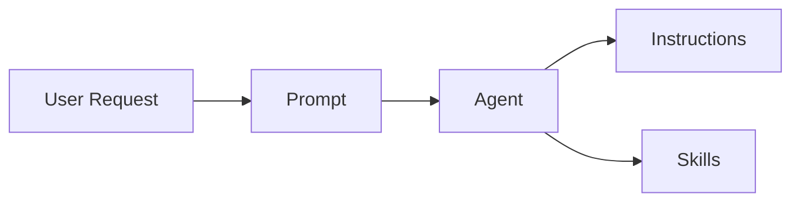

HVE Core provides a four-tier artifact system for customizing GitHub Copilot behavior. Each tier serves a distinct purpose in the delegation chain, enabling structured, reusable AI guidance that flows from user intent to technology-specific standards and executable utilities.

## Artifact Type Hierarchy

The artifact system organizes customizations by scope and responsibility. Prompts handle user interaction, agents orchestrate workflows, instructions encode standards, and skills provide executable utilities.

### Prompts

Prompts (`.prompt.md`) serve as workflow entry points. They capture user intent and translate requests into structured guidance for Copilot execution.

**Core characteristics:**

* Define single-session workflows with clear inputs and outputs
* Accept user inputs through `${input:varName}` template syntax
* Delegate to agents via `agent:` frontmatter references
* Specify invocation context through `mode:` field values

**Frontmatter structure:**

```yaml
---
description: 'Protocol for creating ADO pull requests'
mode: 'workflow'
agent: 'task-planner'
maturity: 'stable'
---
```

Prompts answer the question "what does the user want to accomplish?" and route execution to appropriate agents.

### Agents

Agents (`.agent.md`) define task-specific behaviors with access to Copilot tools. They orchestrate multi-step workflows and make decisions based on context.

**Core characteristics:**

* Specify available tools through `tools:` frontmatter arrays
* Enable workflow handoffs via `handoffs:` references to other agents
* Maintain conversation context across multiple interactions
* Apply domain expertise through detailed behavioral instructions

**Frontmatter structure:**

```yaml
---
description: 'Orchestrates task planning with research integration'
tools: ['codebase', 'search', 'editFiles', 'changes']
handoffs: ['task-implementor', 'task-researcher']
maturity: 'stable'
---
```

Agents answer the question "how should this task be executed?" and coordinate the necessary tools and resources.

### Instructions

Instructions (`.instructions.md`) encode technology-specific standards and conventions. They apply automatically based on file patterns and provide consistent guidance across the codebase.

**Core characteristics:**

* Match files through `applyTo:` glob patterns for automatic application
* Define coding standards, naming conventions, and quality requirements
* Apply to specific languages, frameworks, or file types
* Stack with other instructions when multiple patterns match

**Frontmatter structure:**

```yaml
---
description: 'Python scripting standards with type hints'
applyTo: '**/*.py, **/*.ipynb'
maturity: 'stable'
---
```

Instructions answer the question "what standards apply to this context?" and ensure consistent code quality.

### Skills

Skills (`.github/skills/<name>/SKILL.md`) provide executable utilities that agents invoke for specialized tasks. Unlike instructions (passive reference), skills contain actual scripts that perform operations.

**Core characteristics:**

* Provide self-contained utility packages with documentation and scripts
* Include parallel implementations for cross-platform support (`.sh` and `.ps1`)
* Execute actual operations rather than providing guidance
* Declare maturity level controlling extension channel inclusion

**Directory structure:**

```text
.github/skills/<skill-name>/
├── SKILL.md           # Required entry point with frontmatter
├── scripts/
│   ├── convert.sh     # Bash implementation
│   └── convert.ps1    # PowerShell implementation
└── examples/
    └── README.md      # Usage examples
```

**Frontmatter structure:**

```yaml
---
name: video-to-gif
description: 'Video-to-GIF conversion with FFmpeg optimization'
maturity: stable
---
```

**Required frontmatter fields:**

| Field         | Description                                             |
|---------------|---------------------------------------------------------|
| `name`        | Lowercase kebab-case identifier matching directory name |
| `description` | Brief capability description                            |
| `maturity`    | `stable`, `preview`, `experimental`, or `deprecated`    |

Skills answer the question "what specialized utility does this task require?" and provide executable capabilities beyond conversational guidance.

**Key distinction from instructions:**

| Aspect     | Instructions                | Skills                |
|------------|-----------------------------|-----------------------|
| Nature     | Passive reference           | Active execution      |
| Content    | Standards and conventions   | Scripts and utilities |
| Activation | Automatic via glob patterns | Explicit invocation   |
| Output     | Guidance for Copilot        | Executed operations   |

## Delegation Flow

The artifact system follows a hierarchical delegation model. User requests flow through prompts to agents, which apply relevant instructions during execution.



**Flow mechanics:**

1. User invokes a prompt through `/prompt` commands or workflow triggers.
2. Prompt references an agent via `agent:` frontmatter, delegating execution.
3. Agent executes with instructions auto-applied based on file context.
4. Agent invokes skills for specialized utilities with executable scripts.

This delegation model separates concerns. Prompts handle user interaction, agents manage orchestration, and instructions provide standards.

## Interface Contracts

Each artifact type defines clear interfaces for interoperability.

### Prompt-to-Agent References

Prompts reference agents through the `agent:` frontmatter field:

```yaml
---
description: 'Create a pull request with work item linking'
agent: 'pr-creator'
---
```

The referenced agent file (`pr-creator.agent.md`) must exist in `.github/agents/`. When a user invokes the prompt, Copilot activates the specified agent with the prompt's context.

### Instruction Glob Patterns

Instructions use `applyTo:` patterns for automatic activation:

| Pattern                      | Matches                              |
|------------------------------|--------------------------------------|
| `**/*.py`                    | All Python files recursively         |
| `**/tests/**/*.ts`           | TypeScript files in test directories |
| `**/.copilot-tracking/pr/**` | PR tracking files                    |

Multiple instructions can apply to the same file. When patterns overlap, all matching instructions contribute guidance. Pattern specificity determines precedence for conflicting directives.

### Skill Entry Points

Skills provide self-contained utilities through the `SKILL.md` file:

```text
.github/skills/<skill-name>/
├── SKILL.md                    # Entry point documentation
├── convert.sh                  # Bash implementation
├── convert.ps1                 # PowerShell implementation
└── examples/
    └── README.md
```

Copilot discovers skills automatically when their description matches the current task context. Skills can also be referenced explicitly by name. The skill's `SKILL.md` documents prerequisites, parameters, and usage patterns. Cross-platform scripts ensure consistent behavior across operating systems.

## Extension Integration

The VS Code extension discovers and activates AI artifacts through contribution points.

### Discovery Mechanism

The extension scans these directories at startup:

* `.github/prompts/` for workflow entry points
* `.github/agents/` for specialized behaviors
* `.github/instructions/` for technology standards
* `.github/skills/` for utility packages

Each artifact's `maturity:` field controls channel inclusion:

| Maturity       | Stable Channel | Pre-release Channel |
|----------------|----------------|---------------------|
| `stable`       | Included       | Included            |
| `preview`      | Excluded       | Included            |
| `experimental` | Excluded       | Included            |
| `deprecated`   | Excluded       | Excluded            |

### Activation Context

Instructions activate based on the current file's path matching `applyTo:` patterns. Prompts and agents activate through explicit user invocation. Skills activate when agents or users request their utilities.

The extension provides these contribution points:

* `/prompt <name>` invokes prompts by filename.
* Agents activate through prompt references or direct invocation.
* Matching instructions inject into Copilot context automatically.

## Related Documentation

* [AI Artifacts Common Standards](../contributing/ai-artifacts-common.md) - Quality requirements for all artifacts
* [Contributing Prompts](../contributing/prompts.md) - Prompt file specifications
* [Contributing Agents](../contributing/custom-agents.md) - Agent file specifications
* [Contributing Instructions](../contributing/instructions.md) - Instruction file specifications
* [Contributing Skills](../contributing/skills.md) - Skill package specifications

---

Brought to you by microsoft/hve-core
