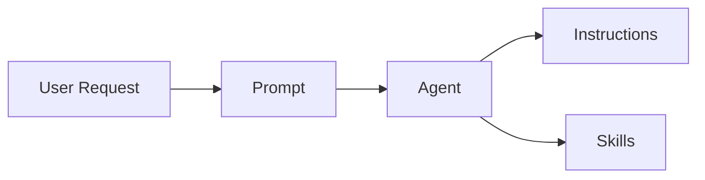

HVE Core provides a four-tier artifact system for customizing GitHub Copilot behavior. Each tier serves a distinct purpose in the delegation chain, enabling structured, reusable AI guidance that flows from user intent to technology-specific standards and executable utilities.

## Artifact Type Hierarchy

The artifact system organizes customizations by scope and responsibility. Prompts handle user interaction, agents orchestrate workflows, instructions encode standards, and skills provide executable utilities.

### Prompts

Prompts (`.prompt.md`) serve as workflow entry points. They capture user intent and translate requests into structured guidance for Copilot execution.

#### Core Characteristics

* Define single-session workflows with clear inputs and outputs
* Accept user inputs through `${input:varName}` template syntax
* Delegate to agents via `agent:` frontmatter references

#### Frontmatter Structure

```yaml
---
description: 'Protocol for creating ADO pull requests'
agent: RPI Agent
---
```

Prompts answer the question "what does the user want to accomplish?" and route execution to appropriate agents.

### Agents

Agents (`.agent.md`) define task-specific behaviors with access to Copilot tools. They orchestrate multi-step workflows and make decisions based on context.

#### Core Characteristics

* Specify available tools through `tools:` frontmatter arrays
* Enable workflow handoffs via `handoffs:` references to other agents
* Maintain conversation context across multiple interactions
* Apply domain expertise through detailed behavioral instructions

#### Frontmatter Structure

```yaml
---
description: 'Orchestrates task planning with research integration'
tools: ['codebase', 'search', 'editFiles', 'changes']
handoffs:
  - label: "Coordinate RPI Work"
    agent: RPI Agent
    prompt: "Coordinate this task through the applicable RPI phases"
    send: true
---
```

Agents answer the question "how should this task be executed?" and coordinate the necessary tools and resources.

### Instructions

Instructions (`.instructions.md`) encode technology-specific standards and conventions. They apply automatically based on file patterns and provide consistent guidance across the codebase.

#### Core Characteristics

* Match files through `applyTo:` glob patterns for automatic application
* Define coding standards, naming conventions, and quality requirements
* Apply to specific languages, frameworks, or file types
* Stack with other instructions when multiple patterns match

#### Frontmatter Structure

```yaml
---
description: 'Python scripting standards with type hints'
applyTo: '**/*.py, **/*.ipynb'
---
```

Instructions answer the question "what standards apply to this context?" and ensure consistent code quality.

#### Repo-Specific Instructions

Instructions placed at the root of `.github/instructions/` (without a subdirectory) are scoped to the hve-core repository itself and MUST NOT be included in plugin membership. These files govern internal repository concerns (CI/CD workflows, repo-specific conventions) that are not applicable outside the repository. Root-level artifacts are intentionally excluded from artifact selection and plugin composition.

> [!IMPORTANT]
> Root-level files under `.github/instructions/` (no subdirectory) are repo-specific and never distributed. Files in package subdirectories such as `hve-core/`, `ado/`, and `shared/` are eligible for distribution.

### Skills

Skills (`.github/skills/<name>/SKILL.md`) provide executable utilities that agents invoke for specialized tasks. Unlike instructions (passive reference), skills contain actual scripts that perform operations.

#### Core Characteristics

* Provide self-contained utility packages with documentation and scripts
* Include parallel implementations for cross-platform support (`.sh` and `.ps1`)
* Execute actual operations rather than providing guidance

#### Directory Structure (by Convention)

```text
.github/skills/{package-id}/<skill-name>/
├── SKILL.md           # Required entry point with frontmatter
├── scripts/
│   ├── convert.sh     # Bash implementation
│   └── convert.ps1    # PowerShell implementation
└── examples/
    └── README.md      # Usage examples
```

#### Frontmatter Structure

```yaml
---
name: video-to-gif
description: 'Video-to-GIF conversion with FFmpeg optimization'
---
```

#### Required Frontmatter Fields

| Field         | Description                                             |
|---------------|---------------------------------------------------------|
| `name`        | Lowercase kebab-case identifier matching directory name |
| `description` | Brief capability description                            |

Distribution is determined by tracked path and license classification, not skill maturity metadata. See [Plugin Identity](#plugin-identity).

Skills answer the question "what specialized utility does this task require?" and provide executable capabilities beyond conversational guidance.

#### Key Distinction from Instructions

| Aspect     | Instructions                | Skills                |
|------------|-----------------------------|-----------------------|
| Nature     | Passive reference           | Active execution      |
| Content    | Standards and conventions   | Scripts and utilities |
| Activation | Automatic via glob patterns | Explicit invocation   |
| Output     | Guidance for Copilot        | Executed operations   |

## Delegation Flow

The artifact system follows a hierarchical delegation model. User requests flow through prompts to agents, which apply relevant instructions during execution.


```mermaid
graph LR
    accTitle: AI Artifact Delegation Flow
    accDescr: User requests flow through prompts to agents, which apply instructions and invoke skills for specialized execution.
    USER[User Request] --> PROMPT[Prompt]
    PROMPT --> AGENT[Agent]
    AGENT --> INSTR[Instructions]
    AGENT --> SKILLS[Skills]
```

### Flow Mechanics

1. User invokes a prompt through `/prompt` commands or workflow triggers.
2. Prompt references an agent via `agent:` frontmatter, delegating execution.
3. Agent executes with instructions auto-applied based on file context.
4. Agent invokes skills for specialized utilities with executable scripts.

This delegation model separates concerns. Prompts handle user interaction, agents manage orchestration, and instructions provide standards.

## Interface Contracts

Each artifact type defines clear interfaces for interoperability.

### Prompt-to-Agent References

Prompts reference agents through the `agent:` frontmatter field:

```yaml
---
description: 'Create a pull request with work item linking'
agent: 'pr-creator'
---
```

The referenced agent file (`pr-creator.agent.md`) is typically organized under `.github/agents/{package-id}/` by convention. When a user invokes the prompt, Copilot activates the specified agent with the prompt's context.

### Instruction Glob Patterns

Instructions use `applyTo:` patterns for automatic activation:

| Pattern                      | Matches                              |
|------------------------------|--------------------------------------|
| `**/*.py`                    | All Python files recursively         |
| `**/tests/**/*.ts`           | TypeScript files in test directories |
| `**/.copilot-tracking/pr/**` | PR tracking files                    |

Multiple instructions can apply to the same file. When patterns overlap, all matching instructions contribute guidance. Pattern specificity determines precedence for conflicting directives.

### Skill Entry Points

Skills provide self-contained utilities through the `SKILL.md` file:

```text
.github/skills/{package-id}/<skill-name>/
├── SKILL.md                    # Entry point documentation
├── convert.sh                  # Bash implementation
├── convert.ps1                 # PowerShell implementation
└── examples/
    └── README.md
```

The `{package-id}` path segment reflects the conventional organization; artifacts can reside in any subfolder.

Copilot discovers skills automatically when their description matches the current task context. Skills can also be referenced explicitly by name. The skill's `SKILL.md` documents prerequisites, parameters, and usage patterns. Cross-platform scripts ensure consistent behavior across operating systems.

## Plugin Identity

Root `plugin.json` is the sole component-membership authority for the `hve-core` plugin and VSIX. `.github/plugin/marketplace.json` contains one relative locator to the repository root and does not repeat membership. The plugin details surface resolves root `README.md` and `LICENSE`; the VSIX keeps `extension/README.md` and `extension/LICENSE` as its separate metadata surface.

The one product identity includes every distributable agent, prompt, instruction, and skill. Stable and PreRelease use the same manifest membership.

### Deterministic Membership

`npm run plugin:sync` derives manifest membership from tracked canonical paths:

* `agents/<package>/**/*.agent.md`
* `prompts/<package>/**/*.prompt.md`
* `instructions/<package>/**/*.instructions.md`
* `skills/<package>/<skill>/SKILL.md`, unless its top-level license has a noncommercial qualifier

Repository-root artifacts without a package segment are excluded. Paths are unique and ordinal-sorted. The manifest declares a hook only while one ships under the plugin root; the repository ships none today.

`npm run plugin:validate` checks manifest drift, one-entry locator parity and containment, declared component coverage, and hooks without modifying files.

### Direct Outputs

The Copilot CLI installs directly from the `.github` plugin root. Extension preparation consumes the same manifest and produces one `hve-core` VSIX. The architecture has no package dependencies, package matrix, copied plugin tree, or plugin ZIP.

## Extension Integration

The VS Code extension discovers and activates AI artifacts through contribution points.

### Discovery Mechanism

The extension scans these directories at startup:

* `.github/prompts/{package-id}/` for workflow entry points
* `.github/agents/{package-id}/` for specialized behaviors
* `.github/instructions/{package-id}/` for technology standards
* `.github/skills/{package-id}/` for utility packages

These paths reflect the conventional directory structure. Artifact inclusion is controlled by root `plugin.json`, whose declarations are repository-relative `.github/...` paths. Artifacts directly under `.github/{type}/` with no package subdirectory are repo-specific, excluded from discovery, and never packaged into extension builds.

Stable and PreRelease differ in source ownership, cadence, and version, not component membership.

### Extension Identities

HVE Core has one Copilot plugin root at the repository root and one VSIX identity, `ise-hve-essentials.hve-core`. Artifact discovery remains bounded to eligible package-scoped paths under `.github`.

The VS Code extension is prepared with `Prepare-Extension.ps1` and packaged with `Package-Extension.ps1`. Both Stable and PreRelease preparation write the same component set to the single extension manifest and README. No Copilot package assembly step exists.

The plugin ships no hooks. Telemetry is opt-in through the `copilot-otel-metrics` skill, which the user installs and configures deliberately.

For a repository-owned selection, the installer validates chosen component paths against root `plugin.json`. It converts repository-relative manifest declarations to installer form, then copies agents, prompts, instructions, and complete distributable skill directories while preserving canonical `.github` target paths; hooks are not copied.

### Activation Context

Instructions activate based on the current file's path matching `applyTo:` patterns. Prompts and agents activate through explicit user invocation. Skills activate when agents or users request their utilities.

The extension provides these contribution points:

* `/prompt <name>` invokes prompts by filename.
* Agents activate through prompt references or direct invocation.
* Matching instructions inject into Copilot context automatically.

## Deprecated Artifacts

Artifacts that have been superseded or are scheduled for removal live under `.github/deprecated/{type}/`, preserving the same type subdirectories used by active artifacts.

### Location

```text
.github/deprecated/
├── agents/         # Superseded agent files
├── instructions/   # Retired instruction files
├── prompts/        # Retired prompt files
└── skills/         # Retired skill packages
```

### Automatic Exclusion

The build system excludes `.github/deprecated/` contents from all downstream surfaces:

| Surface             | Exclusion Mechanism                      |
|---------------------|------------------------------------------|
| Plugin manifest     | Sync scans only active artifact roots    |
| Extension packaging | Consumes only plugin manifest membership |
| VS Code activation  | Deprecated paths are not contributed     |

Run `npm run plugin:sync` after moving an artifact to `.github/deprecated/`. The path-based classification removes it from plugin and extension membership.

### Retention and Removal

Deprecated artifacts remain in the repository for traceability and migration guidance. Each deprecated file SHOULD contain a frontmatter note or heading that identifies its replacement. Permanent removal occurs at a planned retirement window with a corresponding changelog entry.

### When to Deprecate

Move an artifact to `.github/deprecated/{type}/` when:

* A newer artifact fully replaces its functionality
* The artifact is no longer maintained or tested
* The artifact targets a retired platform or workflow

## Removed Artifacts

Remove a retired artifact from its active package-scoped path and run `npm run plugin:sync`. The manifest update removes it from both channels. Preserve migration history in the changelog or durable documentation when users need it; no distribution tombstone or compatibility entry is required.

## Related Documentation

* [Agent Systems Catalog](../agents/) - Overview of all agent systems with workflow documentation
* [AI Artifacts Common Standards](../contributing/ai-artifacts-common.md) - Quality requirements for all artifacts
* [Contributing Prompts](../contributing/prompts.md) - Prompt file specifications
* [Contributing Agents](../contributing/custom-agents.md) - Agent file specifications
* [Contributing Instructions](../contributing/instructions.md) - Instruction file specifications
* [Contributing Skills](../contributing/skills.md) - Skill package specifications

🤖 *Crafted with precision by ✨Copilot following brilliant human instruction, then carefully refined by our team of discerning human reviewers.*
