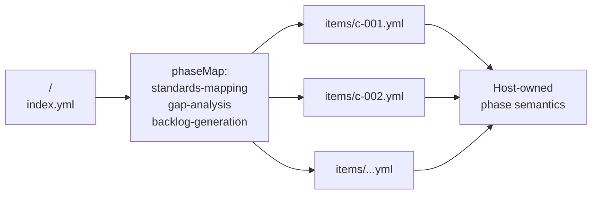

## Design Goals

The Framework Skill Interface (FSI) packages a single framework specification (controls, criteria, principles, capabilities, or document-section templates) as YAML files that any host agent in the repository can enumerate. Four properties shaped every design choice:

* Host-neutral. The same shape serves planners (SSSC, RAI, Sustainability), reviewers, importers, and content generators. Phase semantics belong to the consuming agent, not the bundle.
* Schema-validated. A single JSON Schema (`scripts/linting/schemas/framework-skill-manifest.schema.json`) governs every manifest. Per-item shapes ride on `itemKind` and validate against per-domain schemas.
* Discovery-driven. Hosts walk a domain root and enumerate every directory containing an `index.yml`. No registry file, no central import list, no per-host hardcoded path table.
* Governance-aware. Every manifest carries owners, review cadence, and last-reviewed date. Bundles age out of currency loudly through a lint, not silently in production.

The same four properties apply to both built-in Framework Skills shipped under [`.github/skills/`](../../.github/skills/shared/framework-skill-interface/SKILL.md) and user-authored bundles loaded through `-AdditionalRoots` discovery. There is no privileged path for first-party content.

## Decision Log

The contract is small on purpose. Each decision below traces to a property encoded in the [manifest schema](../../scripts/linting/schemas/framework-skill-manifest.schema.json).

### YAML over JSON for authored content

Manifests and per-item files are YAML. The schema is JSON. YAML keeps multi-line text (control descriptions, attribution snippets, disclaimers) readable in diffs without escape sequences, which matters because most authoring activity is review of upstream framework prose. The schema is JSON because every YAML loader the project uses (PowerShell `powershell-yaml`, Python `pyyaml`, Node loaders) round-trips to a structure that a draft-2020-12 validator accepts unchanged.

### Opaque phase labels

`phaseMap` keys are arbitrary lower-kebab strings. The schema validates the shape (`pattern: "^[a-z][a-z0-9-]*$"`) but enumerates no specific names. A planner uses `standards-mapping`, `gap-analysis`, `backlog-generation`. A reviewer uses `intake`, `triage`, `report`. A content generator uses `gather`, `render`, `export`. The schema cannot anticipate every host, so it owns none of them. Hosts that need to validate phase vocabulary do so in their own contract instructions, not at the schema layer.

### `phaseMap` instead of host-managed ordering

Item order is declared by the framework author, not inferred by the host. Two motivations:

1. Authors of imported frameworks (NIST SP 800-218, CIS Benchmarks, OWASP Top 10) preserve upstream sequencing without translating it into host-specific code.
2. A single bundle can map the same items into different phases for different hosts. A control bundle can list `c-001` under `standards-mapping` for a planner and under `intake` for a reviewer without duplicating the per-item file.

### Redistribution flags in `metadata.redistribution`

The metadata block records `textVerbatim`, `idsAndUrlsOnly`, and `derivedSummariesPermitted`. These flags drive both the per-item content lint (which rejects verbatim text in bundles flagged `idsAndUrlsOnly`) and the THIRD-PARTY-NOTICES aggregation. Redistribution is a manifest-level decision because licensing applies to the bundle, not to a single control. Per-item files MAY further constrain (an individual control marked "do not redistribute") but MUST NOT relax the manifest-level flags.

### `requiredSkills` block and skill-loading transparency

Manifests declare which other skills they require to be loaded by the host. The block is advisory at the schema level; planner identity instructions enforce it operationally by writing an append-only `skills-loaded.log` entry whenever a skill referenced by a manifest is read. This makes audit trails reconstructable from the log alone, without re-running the planner.

### Required `governance` block

`owners`, `review_cadence`, and `last_reviewed` are required on every manifest. The `governance-review-currency` lint warns when `last_reviewed + review_cadence < today`. Currency is a structural property, not an editorial preference, so it lives in the schema.

### `status: draft` default for unattended imports

Bundles produced by an import workflow start as `draft`. Hosts MUST skip drafts unless the consuming reference opts in (typically `frameworkRef.includeDrafts: true` in a planner state file). This prevents an in-progress import from leaking into a production planner run.

## Manifest and Per-Item Contract

A Framework Skill is a directory containing one manifest and a `items/` folder. The manifest names every item id under `phaseMap`; each id resolves to a per-item file that the host validates against a per-domain schema.

```text
<root>/<framework-id>/
├── SKILL.md            # Optional human-facing skill page (recommended for built-ins)
├── index.yml           # REQUIRED: validated by framework-skill-manifest.schema.json
└── items/
    ├── <id>.yml        # Per-item file; one per id in phaseMap
    └── ...
```



The schema is host-neutral. A planner walks `phaseMap.standards-mapping` in order during its standards-mapping phase. A reviewer walks `phaseMap.intake` during intake. The per-item file shape is enforced by a separate `<itemKind>.schema.json` selected from the manifest's `itemKind` hint.

## Lifecycle

A Framework Skill moves through three states tracked by `status` and `governance.deprecation.status`:

| State      | Manifest signal                             | Host behavior                                                    |
|------------|---------------------------------------------|------------------------------------------------------------------|
| Draft      | `status: draft`                             | Skipped unless caller opts in via `includeDrafts`                |
| Published  | `status: published` (default), `active`     | Loaded normally; `requiredSkills` resolution proceeds            |
| Deprecated | `governance.deprecation.status: deprecated` | Loaded with a warning; replacement bundle surfaced when declared |
| Sunset     | `governance.deprecation.status: sunset`     | Refused; host fails the run with a structured error              |

Currency is enforced separately. The `governance-review-currency` lint computes `last_reviewed + review_cadence` and warns when the result is in the past. The lint is advisory in CI but planners SHOULD surface stale bundles in their skill-loading log entries so audit reports record the staleness even when the lint is suppressed.

## Extension Points

The contract is designed to grow without re-versioning the schema.

### Adding a new `itemKind`

`itemKind` is an open lower-kebab string. To onboard a new shape (for example `document-section` for content-generation hosts):

1. Author a per-item schema at `scripts/linting/schemas/<itemKind>.schema.json`.
2. Register the schema in the linting mapping (`scripts/linting/schemas/schema-mapping.json`).
3. Document the shape under the host agent that consumes it (the manifest schema does not learn about it).

Existing bundles default to `itemKind: control` and are unaffected.

### Adding a new domain root

Discovery walks `.github/skills/<domain>/` by default. A user, team, or sibling repo can register an additional root with `-AdditionalRoots` on the discovery cmdlet. New roots inherit the same enumeration semantics and the same lints. There is no manifest change; the bundle layout under the new root is identical.

### Onboarding a new host agent

A new host agent adopts FSI by:

1. Defining its phase vocabulary in its own contract instructions (planner identity, reviewer identity, generator identity).
2. Calling the shared discovery cmdlet to enumerate Framework Skills under the relevant domain root.
3. Resolving `phaseMap` entries for each phase it executes.
4. Writing skill-loading log entries that name every manifest and per-item file it reads.

The host agent owns its phase semantics and its per-item schema selection. The schema, the discovery cmdlet, and the validator stay unchanged. The "Adopting FSI in a New Host Agent" section of the [Bring Your Own Framework](../customization/bring-your-own-framework) page covers the operational checklist.

### Future-shaped extensions

The proposal in [FSI Content Generation Extensions](fsi-content-generation-extensions) outlines additive extensions (new `itemKind` values, variable substitution, pipeline staging, signing) that close gaps surfaced by the PRD-builder use case. Every extension in that document is held to the four design constraints above; none requires a schema break.

## Related Documents

* [`framework-skill-interface` skill](../../.github/skills/shared/framework-skill-interface/SKILL.md): the authoring contract this page describes.
* [`framework-skill-manifest.schema.json`](../../scripts/linting/schemas/framework-skill-manifest.schema.json): the manifest schema that encodes every decision in the log above.
* [Framework Skills: How HVE Core Loads Any Standard as Data](../announcements/framework-skill-interfaces): announcement that introduced FSI and motivates the design.
* [Authoring Framework Skills with Prompt Builder](../customization/authoring-framework-skills): how-to guide for importing a framework using the Prompt Builder agent.
* [Bring Your Own Framework](../customization/bring-your-own-framework): host-neutral schema overview and `additionalRoot` registration.
* [FSI Content Generation Extensions](fsi-content-generation-extensions): forward-looking proposal for content-generation extensions to the contract.

🤖 *Crafted with precision by ✨Copilot following brilliant human instruction, then carefully refined by our team of discerning human reviewers.*
