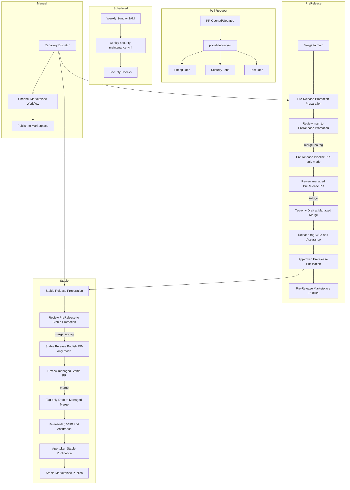
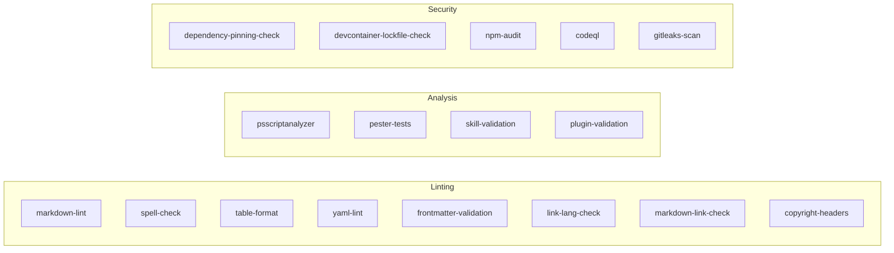
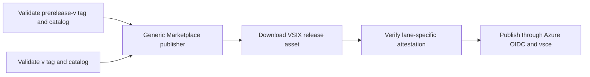

HVE Core uses GitHub Actions for continuous integration, quality validation, security scanning, and release automation. The workflow architecture emphasizes reusable components and parallel execution for fast feedback.

## Pipeline Overview

```mermaid
flowchart TD
    subgraph PR["Pull Request"]
        direction TB
        PR1[PR Opened/Updated] --> PV[pr-validation.yml]
        PV --> LINT[Linting Jobs]
        PV --> SEC[Security Jobs]
        PV --> TEST[Test Jobs]
    end

    subgraph PRE["PreRelease"]
        direction TB
        MERGE[Merge to main] --> PREP[Pre-Release Promotion Preparation]
        PREP --> PROMO[Review main to PreRelease Promotion]
        PROMO -->|merge, no tag| PRE_RP[Pre-Release Pipeline PR-only mode]
        PRE_RP --> PRE_REL[Review managed PreRelease PR]
        PRE_REL -->|merge| PRE_DRAFT[Tag-only Draft at Managed Merge]
        PRE_DRAFT --> PRE_EVIDENCE[Release-tag VSIX and Assurance]
        PRE_EVIDENCE --> PRE_PUBLISH[App-token Prerelease Publication]
        PRE_PUBLISH --> PRE_MARKET[Pre-Release Marketplace Publish]
    end

    subgraph STABLE["Stable"]
        direction TB
        PRE_PUBLISH --> ST_PREP[Stable Release Preparation]
        ST_PREP --> ST_PROMO[Review PreRelease to Stable Promotion]
        ST_PROMO -->|merge, no tag| ST_RP[Stable Release Publish PR-only mode]
        ST_RP --> ST_REL[Review managed Stable PR]
        ST_REL -->|merge| ST_DRAFT[Tag-only Draft at Managed Merge]
        ST_DRAFT --> ST_EVIDENCE[Release-tag VSIX and Assurance]
        ST_EVIDENCE --> ST_PUBLISH[App-token Stable Publication]
        ST_PUBLISH --> ST_MARKET[Stable Marketplace Publish]
    end

    subgraph SCHED["Scheduled"]
        direction TB
        CRON[Weekly Sunday 2AM] --> WEEKLY[weekly-security-maintenance.yml]
        WEEKLY --> SECCHECK[Security Checks]
    end

    subgraph MANUAL["Manual"]
        direction TB
        DISPATCH[Recovery Dispatch] --> PREP
        DISPATCH --> ST_PREP
        DISPATCH --> PUB[Channel Marketplace Workflow]
        PUB --> VSCE[Publish to Marketplace]
    end
```

## Workflow Inventory

| Workflow                             | Trigger                           | Purpose                                                                 |
|--------------------------------------|-----------------------------------|-------------------------------------------------------------------------|
| `pr-validation.yml`                  | Pull request, manual              | Pre-merge quality gate for main, develop, and both release branches     |
| `release-prerelease-prepare.yml`     | Merged PR to `main`, manual       | Open the reviewed `main` to `release/prerelease` promotion PR           |
| `release-prerelease.yml`             | Merged PR to `release/prerelease` | Prepare or publish the managed odd-minor PreRelease                     |
| `release-stable.yml`                 | Published PreRelease, manual      | Open the reviewed `release/prerelease` to `release/stable` promotion PR |
| `release-stable-publish.yml`         | Merged PR to `release/stable`     | Prepare or publish the managed even-minor Stable release                |
| `weekly-security-maintenance.yml`    | Sunday 2 AM UTC, manual           | Scheduled security posture review                                       |
| `weekly-validation.yml`              | Schedule, manual                  | Weekly full validation sweep                                            |
| `security-scan.yml`                  | Push to main/develop              | CodeQL security validation                                              |
| `release-marketplace-stable.yml`     | Published Stable release, manual  | VS Code extension Marketplace publishing                                |
| `release-marketplace-prerelease.yml` | Published PreRelease, manual      | VS Code extension pre-release publishing                                |
| `copilot-setup-steps.yml`            | Manual                            | Coding agent environment setup                                          |
| `devcontainer-change-log.yml`        | Push to main/develop              | Logs devcontainer infrastructure file changes to the step summary       |
| `devcontainer-lockfile-check.yml`    | Reusable                          | Validates devcontainer lockfile integrity and SHA-256 pinning           |
| `scorecard.yml`                      | Schedule, push                    | OpenSSF Scorecard security analysis                                     |
| `codeql-analysis.yml`                | Schedule                          | Weekly CodeQL security scan (also reusable)                             |
| `dependency-review.yml`              | Pull request                      | Dependency vulnerability review (also reusable)                         |
| `sha-staleness-check.yml`            | Manual                            | SHA reference freshness check (also reusable)                           |
| `deploy-docs.yml`                    | Push to main, manual              | Docusaurus documentation site deployment                                |
| `create-stale-docs-issues.yml`       | Schedule                          | Automated stale docs issue creation from ms.date freshness              |
| `msdate-freshness-check.yml`         | Schedule, manual                  | ms.date freshness validation across documentation                       |
| `label-sync.yml`                     | Push to main, manual              | Repository label synchronization                                        |
| `workflow-permissions-scan.yml`      | Schedule, manual                  | GitHub Actions permissions audit                                        |
| `weekly-gh-code-scanning.yml`        | Monday 3 AM UTC, manual           | Weekly GitHub code scanning alert retrieval and issue creation          |
| `vex-detect.yml`                     | Schedule, release, manual         | Dependency vulnerability scan and VEX triage issue creation             |

GitHub Agentic Workflow markdown files (`issue-triage.md`, `issue-implement.md`, `pr-review.md`, `dependency-pr-review.md`, `doc-update-check.md`, and `vex-draft.md`) compile to `*.lock.yml` workflows and are documented in [Agentic Workflows](agentic-workflows).

### Reusable Workflows

Individual validation workflows called by orchestration workflows:

| Workflow                              | Purpose                                          | npm Script                               |
|---------------------------------------|--------------------------------------------------|------------------------------------------|
| `markdown-lint.yml`                   | Markdownlint validation                          | `npm run lint:md`                        |
| `spell-check.yml`                     | cspell dictionary check                          | `npm run spell-check`                    |
| `frontmatter-validation.yml`          | AI artifact frontmatter schemas                  | `npm run lint:frontmatter`               |
| `markdown-link-check.yml`             | Broken link detection                            | `npm run lint:md-links`                  |
| `link-lang-check.yml`                 | Link language validation                         | `npm run lint:links`                     |
| `yaml-lint.yml`                       | YAML syntax validation                           | `npm run lint:yaml`                      |
| `ps-script-analyzer.yml`              | PowerShell static analysis                       | `npm run lint:ps`                        |
| `table-format.yml`                    | Markdown table formatting                        | `npm run format:tables`                  |
| `pester-tests.yml`                    | PowerShell unit tests                            | `npm run test:ps`                        |
| `skill-validation.yml`                | Skill structure validation                       | `npm run validate:skills`                |
| `dependency-pinning-scan.yml`         | Dependency pinning validation                    | N/A (PowerShell direct)                  |
| `sha-staleness-check.yml`             | SHA reference freshness*                         | N/A (PowerShell direct)                  |
| `codeql-analysis.yml`                 | CodeQL security scanning*                        | N/A (GitHub native)                      |
| `dependency-review.yml`               | Dependency vulnerability review*                 | N/A (GitHub native)                      |
| `gh-code-scanning.yml`                | GitHub code scanning alert retrieval             | N/A (PowerShell direct)                  |
| `create-gh-code-scanning-issues.yml`  | Create GitHub code scanning issues from alerts   | N/A (bash + gh CLI direct)               |
| `extension-package.yml`               | VS Code extension packaging (unprivileged)       | `npm run extension:package`              |
| `extension-provenance.yml`            | VS Code extension attestation and release upload | N/A                                      |
| `copyright-headers.yml`               | Copyright header validation                      | `npm run validate:copyright`             |
| `gitleaks-scan.yml`                   | Secret detection scanning                        | N/A (gitleaks direct)                    |
| `plugin-validation.yml`               | Plugin manifest, locator, and hook validation    | `npm run plugin:validate`                |
| `extension-marketplace-publish.yml`   | Extension marketplace publishing                 | N/A                                      |
| `python-lint.yml`                     | Python linting (ruff)                            | `npm run lint:py`                        |
| `pytest-tests.yml`                    | Python unit tests                                | `npm run test:py`                        |
| `pip-audit.yml`                       | Python dependency auditing                       | N/A (pip-audit direct)                   |
| `fuzz-tests.yml`                      | Python fuzz testing                              | N/A (pytest direct)                      |
| `docusaurus-tests.yml`                | Docusaurus test suite                            | N/A (npm test)                           |
| `model-validation.yml`                | Model reference validation                       | `npm run lint:models`                    |
| `ai-artifact-validation.yml`          | AI artifact structure validation                 | `npm run lint:ai-artifacts`              |
| `devcontainer-lockfile-check.yml`     | Devcontainer lockfile integrity                  | `npm run validate:devcontainer-lockfile` |
| `action-version-consistency-scan.yml` | Action version consistency                       | `npm run lint:version-consistency`       |

Workflows marked with `*` are dual-purpose: they accept `workflow_call` for reuse by orchestration workflows and also run independently via their own triggers.

### Composite Actions

Composite actions package reusable step sequences that workflows invoke directly. Unlike reusable workflows (called via `uses:` at the job level with `workflow_call`), composite actions are referenced as steps within a job.

| Action             | Purpose                                     | Reference                                  |
|--------------------|---------------------------------------------|--------------------------------------------|
| `setup-ps-modules` | Cached PowerShell module install with retry | `uses: ./.github/actions/setup-ps-modules` |

The `setup-ps-modules` action caches modules keyed on `scripts/security/ps-module-versions.json` and retries installation with exponential backoff on PSGallery failures. Workflows that need PowerShell modules must use `uses: ./.github/actions/setup-ps-modules` instead of inline `Install-Module` steps, consistent with the convention recorded in `.github/copilot-instructions.md`.

## PR Validation Pipeline

The `pr-validation.yml` workflow serves as the primary quality gate for all pull requests. It runs parallel linting, security, and testing jobs.

```mermaid
flowchart LR
    subgraph "Linting"
        ML[markdown-lint]
        SC[spell-check]
        TF[table-format]
        YL[yaml-lint]
        FV[frontmatter-validation]
        LLC[link-lang-check]
        MLC[markdown-link-check]
        CH[copyright-headers]
    end

    subgraph "Analysis"
        PSA[psscriptanalyzer]
        PT[pester-tests]
        SV[skill-validation]
        PV[plugin-validation]
    end

    subgraph "Security"
        DPC[dependency-pinning-check]
        DCL[devcontainer-lockfile-check]
        NA[npm-audit]
        CQL[codeql]
        GLS[gitleaks-scan]
    end
```

### Jobs

| Job                         | Reusable Workflow                 | Validates                       |
|-----------------------------|-----------------------------------|---------------------------------|
| spell-check                 | `spell-check.yml`                 | Spelling across all files       |
| markdown-lint               | `markdown-lint.yml`               | Markdown formatting rules       |
| table-format                | `table-format.yml`                | Markdown table structure        |
| psscriptanalyzer            | `ps-script-analyzer.yml`          | PowerShell code quality         |
| yaml-lint                   | `yaml-lint.yml`                   | YAML syntax                     |
| pester-tests                | `pester-tests.yml`                | PowerShell unit tests           |
| frontmatter-validation      | `frontmatter-validation.yml`      | AI artifact metadata            |
| skill-validation            | `skill-validation.yml`            | Skill directory structure       |
| link-lang-check             | `link-lang-check.yml`             | Link accessibility              |
| markdown-link-check         | `markdown-link-check.yml`         | Broken links                    |
| dependency-pinning-check    | `dependency-pinning-scan.yml`     | Dependency pinning              |
| devcontainer-lockfile-check | `devcontainer-lockfile-check.yml` | Devcontainer lockfile integrity |
| npm-audit                   | Inline                            | npm dependency vulnerabilities  |
| codeql                      | `codeql-analysis.yml`             | Code security patterns          |
| copyright-headers           | `copyright-headers.yml`           | Copyright header compliance     |
| plugin-validation           | `plugin-validation.yml`           | Plugin manifest, locator, hooks |
| gitleaks-scan               | `gitleaks-scan.yml`               | Secret detection                |

All jobs run in parallel with no dependencies, enabling fast feedback (typically under 3 minutes).

## Release Promotion and Publication

The preparation workflows each contain exactly two jobs:

| Workflow                         | Jobs                                     | Source and target                        |
|----------------------------------|------------------------------------------|------------------------------------------|
| `release-prerelease-prepare.yml` | `prepare-promotion`, `open-promotion-pr` | `main` to `release/prerelease`           |
| `release-stable.yml`             | `prepare-promotion`, `open-promotion-pr` | `release/prerelease` to `release/stable` |

Each preparation starts from the target branch, merges the current source,
restores target-owned release metadata, writes the exact `release-as`, and
opens a reviewed PR. Promotion heads are stable per hop and are updated without
force. The promotion merge creates no tag.

The release workflows accept only the exact promotion or managed head for
their channel. A promotion merge selects PR-only mode. A managed PR merge
selects tag-only mode and creates `prerelease-v<version>` for PreRelease or
`v<version>` for Stable at that managed merge commit.

### Release Version Allocation

Ordinary version allocation is branch-owned. PreRelease reads the current
`release/prerelease` version and returns the same major, minor plus two, and
patch zero. Stable reads the promoted PreRelease version and returns the
promoted major, promoted minor plus one, and patch zero. Current Stable state
only rejects a candidate that does not advance it. The ordinary sequence is
`3.3.101` to `3.5.0` to `3.6.0`.

No commit classification or automatic patch, minor, or major release class
participates in ordinary allocation. The plugin manifest and VSIX use the same
channel version. A major-line transition, or a Stable patch or hotfix, requires
a separate explicit manifest and release-state decision. Odd/even minor parity
is repository policy aligned with VS Code Marketplace guidance and behavior,
not a requirement of `MAJOR.MINOR.PATCH` syntax.

### Release Channel Jobs

`release-prerelease.yml` jobs: `validate-trigger`, `release-please`, `sync-release-pr`,
`validate-release`, `close-milestone`, `extension-package-prerelease`,
`generate-dependency-sbom`, `extension-provenance-prerelease`,
`verify-provenance`, and `publish-release`.

`release-stable-publish.yml` jobs: `validate-trigger`, `release-please`,
`sync-release-pr`, `validate-release`, `close-milestone`,
`extension-package-release`, `extension-provenance`,
`generate-dependency-sbom`, `vex-attest`, `verify-provenance`, `sbom-diff`,
`append-verification-notes`, and `publish-release`.

Both channels build the VSIX in `extension-package.yml`, which holds only
`contents: read`, and attest it in `extension-provenance.yml`, which holds the
signing scopes and never installs dependencies. No job does both.

Both release workflows verify event, merge, release-please, and release-tag
SHA equality plus target-branch ancestry. The extension uses the validated
release SHA bound to the immutable channel tag. Each workflow attaches one
VSIX with SPDX, Sigstore, and in-toto sidecars plus
`dependencies.spdx.json`; Stable also publishes and attests
`hve-core.openvex.json`.

Both channels publish their draft with a release GitHub App token. The
resulting `published` event triggers the matching Marketplace workflow.
Main is not part of either release completion graph. It remains a ref-less
development-tip channel sourced from canonical `.github` content and is not
updated by release completion. Release branches, immutable tags, and published
releases own release state and history.

The ref-less `microsoft/hve-core` registration sources canonical content from `.github` through the main catalog. An explicit marketplace refresh and plugin update are required for that catalog, which has no release gate, SBOM, or attestation. PreRelease and Stable retain reviewed, release-gated, SBOM-covered, and attested immutable delivery through moving branch registrations and exact tags.

## Security Workflows

### Weekly Security Maintenance

The `weekly-security-maintenance.yml` workflow runs every Sunday at 2AM UTC, providing scheduled security posture review.

| Job              | Purpose                              |
|------------------|--------------------------------------|
| validate-pinning | Verify dependency pinning compliance |
| check-staleness  | Detect outdated SHA references       |
| codeql-analysis  | Full CodeQL security scan            |
| summary          | Aggregate security status report     |

### Security Validation Tools

| Tool               | Script                            | Checks                                                                        |
|--------------------|-----------------------------------|-------------------------------------------------------------------------------|
| Dependency Pinning | `Test-DependencyPinning.ps1`      | Actions use SHA refs; npm uses exact versions                                 |
| SHA Staleness      | `Test-SHAStaleness.ps1`           | SHAs reference recent commits                                                 |
| audit-ci           | `audit-ci --config audit-ci.json` | Known vulnerabilities in dependencies, using the allowlist in `audit-ci.json` |
| CodeQL             | GitHub native                     | Code patterns indicating security issues                                      |
| Gitleaks           | `gitleaks`                        | Secret detection in repository history                                        |
| Dependency Review  | GitHub native                     | Dependency vulnerability analysis                                             |

## Extension Publishing

Both Marketplace entry workflows publish release assets selected by a
validated exact channel tag.

```mermaid
flowchart LR
    accTitle: Extension Marketplace publication flow
    accDescr: PreRelease and Stable validate their exact release tags, then use one publisher to download the VSIX, verify its attestation, and publish through Azure OIDC and vsce.
    PRE[Validate prerelease-v tag and catalog] --> GENERIC[Generic Marketplace publisher]
    STABLE[Validate v tag and catalog] --> GENERIC
    GENERIC --> ASSET[Download VSIX release asset]
    ASSET --> VERIFY[Verify lane-specific attestation]
    VERIFY --> OIDC[Publish through Azure OIDC and vsce]
```

### Channel Tags and Attestation Signers

| Channel    | Exact release tag       | Attestation signer         |
|------------|-------------------------|----------------------------|
| PreRelease | `prerelease-v<version>` | `extension-provenance.yml` |
| Stable     | `v<version>`            | `extension-provenance.yml` |

Both callers pass the exact tag to the generic publisher, which resolves the
signer to the one constant both channels sign from. It downloads the matching
VSIX release asset, verifies the attestation, and then publishes through Azure
OIDC and `vsce`.

### Marketplace Build

Both channel workflows validate the one-entry catalog and call the generic publisher for `hve-core`. The publisher validates inputs, downloads `hve-core-<version>.vsix`, verifies its lane-specific attestation, prepares the locked publisher toolchain from protected `main`, and publishes through Azure OIDC and `vsce`.

Stable and PreRelease package the same root `plugin.json` membership into the same extension identity. Each selected branch or exact-tag snapshot carries its own root manifest, README, and LICENSE. The channel controls version, release source, and the VS Code Marketplace pre-release flag, not component inclusion.

### Version Channels

| Channel     | Version Pattern    | Marketplace      |
|-------------|--------------------|------------------|
| Stable      | Even minor (1.2.0) | Main listing     |
| Pre-release | Odd minor (1.3.0)  | Pre-release flag |

Hosted Marketplace selection and installed-client switching remain operator
observations, not results of local workflow or documentation validation.

## npm Script Mapping

Workflows invoke validation through npm scripts defined in `package.json`:

| npm Script                      | Command                                                                                               | Used By                                     |
|---------------------------------|-------------------------------------------------------------------------------------------------------|---------------------------------------------|
| `lint:md`                       | `markdownlint-cli2`                                                                                   | markdown-lint.yml                           |
| `lint:md:fix`                   | `markdownlint-cli2 --fix`                                                                             | Local                                       |
| `spell-check`                   | `cspell`                                                                                              | spell-check.yml                             |
| `spell-check:fix`               | `cspell --show-suggestions`                                                                           | Local                                       |
| `lint:frontmatter`              | `Validate-MarkdownFrontmatter.ps1`                                                                    | frontmatter-validation.yml                  |
| `lint:md-links`                 | `Markdown-Link-Check.ps1`                                                                             | markdown-link-check.yml                     |
| `lint:links`                    | `Invoke-LinkLanguageCheck.ps1`                                                                        | link-lang-check.yml                         |
| `lint:yaml`                     | `Invoke-YamlLint.ps1`                                                                                 | yaml-lint.yml                               |
| `lint:ps`                       | `Invoke-PSScriptAnalyzer.ps1`                                                                         | ps-script-analyzer.yml                      |
| `lint:plugin-manifest`          | `Sync-PluginManifest.ps1 -Check`                                                                      | plugin-validation.yml                       |
| `lint:version-consistency`      | `Test-ActionVersionConsistency.ps1`                                                                   | Local                                       |
| `validate:local`                | Local-safe repository validation aggregate                                                            | Local-safe default                          |
| `validate:docs`                 | Docusaurus lint, label registry, typecheck, and component tests                                       | Local-safe docs default                     |
| `ci:docs:test:e2e`              | Delegates to the Docusaurus Playwright E2E suite                                                      | CI-owned browser lane                       |
| `ci:docs:setup:e2e`             | Provisions Chrome for the Docusaurus browser lane                                                     | CI-owned browser setup                      |
| `format:tables`                 | `markdown-table-formatter`                                                                            | table-format.yml                            |
| `test:ps`                       | `Invoke-PesterTests.ps1`                                                                              | pester-tests.yml                            |
| `validate:skills`               | `Validate-SkillStructure.ps1`                                                                         | skill-validation.yml                        |
| `validate:copyright`            | `Test-CopyrightHeaders.ps1`                                                                           | copyright-headers.yml                       |
| `extension:prepare`             | `pwsh ./scripts/extension/Prepare-Extension.ps1 && npm run extension:postprocess`                     | extension-package.yml                       |
| `extension:prepare:prerelease`  | `pwsh ./scripts/extension/Prepare-Extension.ps1 -Channel PreRelease && npm run extension:postprocess` | extension-package.yml                       |
| `extension:postprocess`         | `markdownlint-cli2 + markdown-table-formatter (extension/**/*.md)`                                    | extension-package.yml                       |
| `extension:package`             | `Package-Extension.ps1`                                                                               | extension-package.yml                       |
| `extension:package:prerelease`  | `Package-Extension.ps1 -PreRelease`                                                                   | extension-package.yml                       |
| `plugin:sync`                   | `Sync-PluginManifest.ps1`                                                                             | Local manifest update                       |
| `plugin:validate`               | Plugin manifest check plus hook validation                                                            | plugin-validation.yml                       |
| `lint:py`                       | `ruff check`                                                                                          | python-lint.yml                             |
| `lint:models`                   | `Validate-ModelReferences.ps1`                                                                        | model-validation.yml                        |
| `lint:ai-artifacts`             | `Validate-PlannerArtifacts.ps1 -FailOnMissing`                                                        | ai-artifact-validation.yml                  |
| `lint:permissions`              | `Test-WorkflowPermissions.ps1`                                                                        | workflow-permissions-scan.yml               |
| `lint:ps-module-pins`           | `Test-PSModulePins.ps1`                                                                               | Local                                       |
| `lint:dependency-pinning`       | `Test-DependencyPinning.ps1`                                                                          | dependency-pinning-scan.yml                 |
| `audit:npm`                     | `audit-ci --config audit-ci.json`                                                                     | pr-validation.yml                           |
| `test:py`                       | `uv run pytest`                                                                                       | pytest-tests.yml                            |
| `ci:eval:lint:vally`            | `Build-AgentBehaviorSpec.ps1 -WhatIf && vally lint --eval-spec evals/`                                | CI-owned static lane                        |
| `ci:eval:lint:schema`           | `Test-EvalSpec.ps1`                                                                                   | CI-owned static lane                        |
| `ci:eval:lint:text`             | `Test-EvalSpecText.ps1`                                                                               | CI-owned static lane                        |
| `ci:eval:lint:safety`           | `Test-VallyTestSafety.ps1`                                                                            | CI-owned static lane                        |
| `ci:eval:lint:skills`           | `vally lint .github/skills/`                                                                          | CI-owned static lane                        |
| `ci:eval:run`                   | Runs all eval suites                                                                                  | CI-owned model-backed lane                  |
| `ci:eval:run:skills`            | `vally eval --suite skill-quality`                                                                    | CI-owned model-backed lane                  |
| `ci:eval:run:agents`            | `vally eval --suite agent-behavior`                                                                   | CI-owned model-backed lane                  |
| `ci:eval:run:scripts`           | `vally eval --suite script-validation`                                                                | CI-owned model-backed lane                  |
| `ci:eval:compare`               | `vally compare`                                                                                       | CI-owned comparison lane                    |
| `ci:eval:presence`              | `Test-StimulusPresence.ps1` (changed-artifact eval-spec coverage gate)                                | CI-owned manifest lane                      |
| `ci:eval:execute`               | `Invoke-VallyEvals.ps1` (run evals for changed artifacts)                                             | CI-owned model-backed lane                  |
| `ci:eval:moderate`              | `Invoke-ContentModeration.ps1`                                                                        | CI-owned moderation lane                    |
| `ci:eval:moderate:corpus`       | `Invoke-CorpusModeration.ps1`                                                                         | CI-owned moderation lane                    |
| `ci:eval:moderate:artifacts`    | `Invoke-ArtifactModeration.ps1`                                                                       | CI-owned moderation lane                    |
| `ci:eval:moderate:test`         | Runs `Invoke-ContentModeration.Tests.ps1`                                                             | CI-owned test lane                          |
| `ci:eval:equivalence`           | `Invoke-BaselineEquivalence.ps1`                                                                      | CI-owned model-backed lane                  |
| `ci:eval:dashboard`             | `New-EquivalenceDashboard.ps1`                                                                        | CI-owned noninteractive report lane         |
| `ci:eval:run:equivalence`       | Runs baseline and customized equivalence specs                                                        | CI-owned model-backed lane                  |
| `ci:eval:behavior-prompts`      | `vally eval --eval-spec evals/behavior-conformance/prompts.eval.yaml`                                 | CI-owned model-backed lane                  |
| `ci:eval:behavior-instructions` | `vally eval --eval-spec evals/behavior-conformance/instructions.eval.yaml`                            | CI-owned model-backed lane                  |
| `ci:eval:behavior-skills`       | `vally eval --eval-spec evals/behavior-conformance/skill-behavior.eval.yaml`                          | CI-owned model-backed lane                  |
| `ci:eval:agent`                 | `Invoke-AgentMatrix.ps1` (agent behavior matrix)                                                      | CI-owned model-backed lane                  |
| `ci:eval:agent:matrix`          | `Invoke-AgentMatrix.ps1 -All -Tier nightly`                                                           | CI-owned model-backed lane                  |
| `ci:eval:agent:matrix:dryrun`   | `Invoke-AgentMatrix.ps1 -All -Tier nightly -WhatIf`                                                   | CI-owned dry-run lane                       |
| `ci:eval:agent:changed`         | `Invoke-AgentMatrix.ps1` for changed agents (PR tier)                                                 | CI-owned model-backed lane                  |
| `ci:eval:agent:dashboard`       | `New-AgentMatrixDashboard.ps1`                                                                        | CI-owned noninteractive report lane         |
| `ci:eval:agent:dashboard:open`  | `New-AgentMatrixDashboard.ps1 -Open`                                                                  | CI-owned interactive lane                   |
| `ci:eval:agent:report`          | Runs `ci:eval:agent:matrix` then `ci:eval:agent:dashboard`                                            | CI-owned noninteractive report lane         |
| `ci:eval:agent:report:dryrun`   | Runs `ci:eval:agent:matrix:dryrun` then `ci:eval:agent:dashboard`                                     | CI-owned noninteractive dry-run report lane |

## Related Documentation

* [Testing Architecture](testing.md) - PowerShell Pester test infrastructure
* [Scripts README](https://github.com/microsoft/hve-core/blob/main/scripts/README.md) - Script organization and usage
* [Validation Commands and CI-Owned Lanes](../contributing/validation) - Local-safe defaults, CI-owned lane prerequisites, and reproduction guidance

🤖 *Crafted with precision by ✨Copilot following brilliant human instruction, then carefully refined by our team of discerning human reviewers.*
