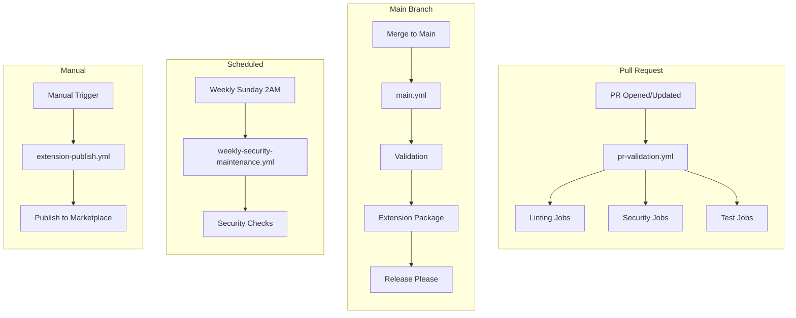
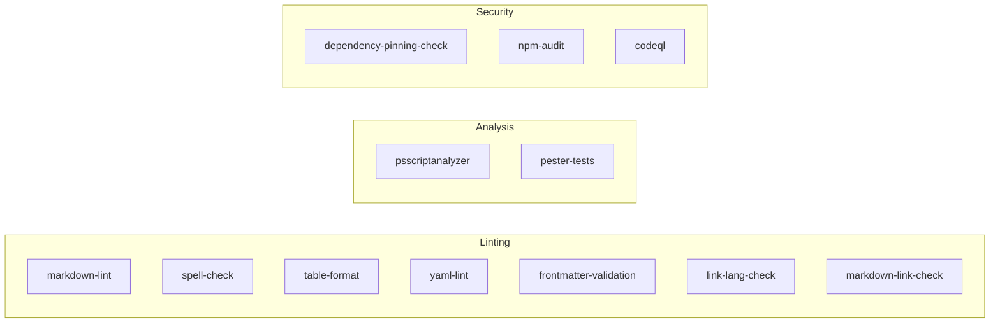
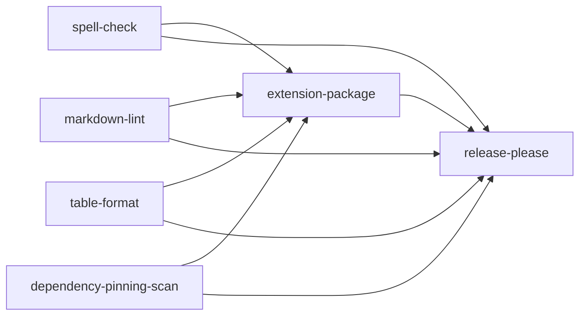
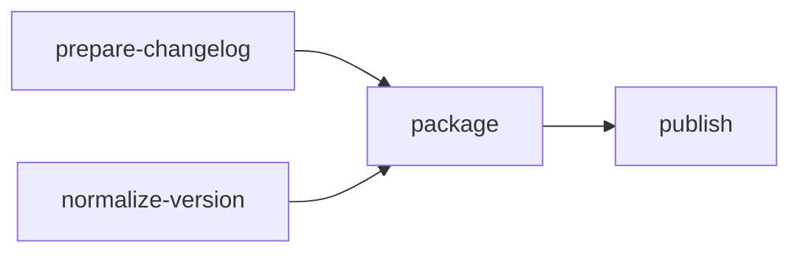

HVE Core uses GitHub Actions for continuous integration, quality validation, security scanning, and release automation. The workflow architecture emphasizes reusable components and parallel execution for fast feedback.

## Pipeline Overview

## Workflow Inventory

| Workflow                           | Trigger        | Purpose                                         |
|------------------------------------|----------------|-------------------------------------------------|
| `pr-validation.yml`                | Pull request   | Pre-merge quality gate with parallel validation |
| `main.yml`                         | Push to main   | Post-merge validation and release automation    |
| `weekly-security-maintenance.yml`  | Sunday 2AM UTC | Scheduled security posture review               |
| `extension-publish.yml`            | Manual         | VS Code extension marketplace publishing        |
| `extension-publish-prerelease.yml` | Manual         | VS Code extension pre-release publishing        |

### Reusable Workflows

Individual validation workflows called by orchestration workflows:

| Workflow                      | Purpose                         | npm Script                 |
|-------------------------------|---------------------------------|----------------------------|
| `markdown-lint.yml`           | Markdownlint validation         | `npm run lint:md`          |
| `spell-check.yml`             | cspell dictionary check         | `npm run spell-check`      |
| `frontmatter-validation.yml`  | AI artifact frontmatter schemas | `npm run lint:frontmatter` |
| `markdown-link-check.yml`     | Broken link detection           | `npm run lint:md-links`    |
| `link-lang-check.yml`         | Link language validation        | `npm run lint:links`       |
| `yaml-lint.yml`               | YAML syntax validation          | `npm run lint:yaml`        |
| `ps-script-analyzer.yml`      | PowerShell static analysis      | `npm run lint:ps`          |
| `table-format.yml`            | Markdown table formatting       | `npm run format:tables`    |
| `pester-tests.yml`            | PowerShell unit tests           | `npm run test:ps`          |
| `dependency-pinning-scan.yml` | GitHub Actions pinning          | N/A (PowerShell direct)    |
| `sha-staleness-check.yml`     | SHA reference freshness         | N/A (PowerShell direct)    |
| `codeql-analysis.yml`         | CodeQL security scanning        | N/A (GitHub native)        |
| `dependency-review.yml`       | Dependency vulnerability review | N/A (GitHub native)        |
| `security-scan.yml`           | Composite security validation   | N/A                        |
| `extension-package.yml`       | VS Code extension packaging     | N/A                        |

## PR Validation Pipeline

The `pr-validation.yml` workflow serves as the primary quality gate for all pull requests. It runs 12 parallel jobs covering linting, security, and testing.

### Jobs

| Job                      | Reusable Workflow             | Validates                      |
|--------------------------|-------------------------------|--------------------------------|
| spell-check              | `spell-check.yml`             | Spelling across all files      |
| markdown-lint            | `markdown-lint.yml`           | Markdown formatting rules      |
| table-format             | `table-format.yml`            | Markdown table structure       |
| psscriptanalyzer         | `ps-script-analyzer.yml`      | PowerShell code quality        |
| yaml-lint                | `yaml-lint.yml`               | YAML syntax                    |
| pester-tests             | `pester-tests.yml`            | PowerShell unit tests          |
| frontmatter-validation   | `frontmatter-validation.yml`  | AI artifact metadata           |
| link-lang-check          | `link-lang-check.yml`         | Link accessibility             |
| markdown-link-check      | `markdown-link-check.yml`     | Broken links                   |
| dependency-pinning-check | `dependency-pinning-scan.yml` | Action SHA pinning             |
| npm-audit                | Inline                        | npm dependency vulnerabilities |
| codeql                   | `codeql-analysis.yml`         | Code security patterns         |

All jobs run in parallel with no dependencies, enabling fast feedback (typically under 3 minutes).

## Main Branch Pipeline

The `main.yml` workflow runs after merges to main, performing validation and release automation.

### Main Branch Jobs

| Job                     | Purpose                        | Dependencies        |
|-------------------------|--------------------------------|---------------------|
| spell-check             | Post-merge spelling validation | None                |
| markdown-lint           | Post-merge markdown validation | None                |
| table-format            | Post-merge table validation    | None                |
| dependency-pinning-scan | Security pinning check         | None                |
| extension-package       | Build VS Code extension VSIX   | All validation jobs |
| release-please          | Automated release management   | All jobs            |

The release-please job creates release PRs and tags based on conventional commits.

## Security Workflows

### Weekly Security Maintenance

The `weekly-security-maintenance.yml` workflow runs every Sunday at 2AM UTC, providing scheduled security posture review.

| Job              | Purpose                               |
|------------------|---------------------------------------|
| validate-pinning | Verify GitHub Actions use SHA pinning |
| check-staleness  | Detect outdated SHA references        |
| codeql-analysis  | Full CodeQL security scan             |
| summary          | Aggregate security status report      |

### Security Validation Tools

| Tool               | Script                       | Checks                                   |
|--------------------|------------------------------|------------------------------------------|
| Dependency Pinning | `Test-DependencyPinning.ps1` | Actions use SHA refs, not tags           |
| SHA Staleness      | `Test-SHAStaleness.ps1`      | SHAs reference recent commits            |
| npm Audit          | `npm audit`                  | Known vulnerabilities in dependencies    |
| CodeQL             | GitHub native                | Code patterns indicating security issues |

## Extension Publishing

The `extension-publish.yml` workflow handles VS Code extension marketplace publishing through manual dispatch.

### Publishing Jobs

| Job               | Purpose                                  |
|-------------------|------------------------------------------|
| prepare-changelog | Extract release notes from CHANGELOG.md  |
| normalize-version | Ensure version consistency               |
| package           | Build VSIX using `extension-package.yml` |
| publish           | Upload to VS Code Marketplace via vsce   |

### Version Channels

| Channel     | Version Pattern    | Marketplace      |
|-------------|--------------------|------------------|
| Stable      | Even minor (1.2.0) | Main listing     |
| Pre-release | Odd minor (1.3.0)  | Pre-release flag |

## npm Script Mapping

Workflows invoke validation through npm scripts defined in `package.json`:

| npm Script         | Command                            | Used By                    |
|--------------------|------------------------------------|----------------------------|
| `lint:md`          | `markdownlint-cli2`                | markdown-lint.yml          |
| `spell-check`      | `cspell`                           | spell-check.yml            |
| `lint:frontmatter` | `Validate-MarkdownFrontmatter.ps1` | frontmatter-validation.yml |
| `lint:md-links`    | `Markdown-Link-Check.ps1`          | markdown-link-check.yml    |
| `lint:links`       | `Invoke-LinkLanguageCheck.ps1`     | link-lang-check.yml        |
| `lint:yaml`        | `Invoke-YamlLint.ps1`              | yaml-lint.yml              |
| `lint:ps`          | `Invoke-PSScriptAnalyzer.ps1`      | ps-script-analyzer.yml     |
| `format:tables`    | `markdown-table-formatter`         | table-format.yml           |
| `test:ps`          | `Invoke-Pester`                    | pester-tests.yml           |

## Related Documentation

* [Testing Architecture](testing.md) - PowerShell Pester test infrastructure
* [Scripts README](../../scripts/README.md) - Script organization and usage

---

Brought to you by microsoft/hve-core
