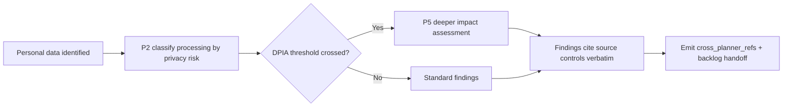

> **BRD-2026-Q2-PRIVACY-PLANNER** | Status: approved | Version: 1.0.0 | Last Updated: 2026-06-20

## Executive Summary

The hve-core planner family (accessibility, security, RAI, SSSC) lacks a privacy-specific planner. Teams handling personal data have no first-class, standards-anchored way to assess privacy risk, so privacy concerns currently leak into security and RAI assessments where they are neither named nor traceable to privacy law.

This initiative adds privacy as a first-class member of the planner family through three components plus a clean cross-planner handoff: a six-phase Privacy Planner agent isomorphic to the family spine, a privacy super-power skill (`privacy-standards`) holding the domain content, and a Privacy Reviewer cloned from the existing reviewer pattern. The work emits `cross_planner_refs` so downstream overlap with sibling planners is machine-detectable.

Cross-domain backlog deduplication, aggregation, and reconciliation are explicitly out of scope; that capability belongs to the backlog managers on a separate future thread. The privacy planner detects and flags overlap only; it never reconciles.

Success is measured by family isomorphism (the Privacy Planner conforms to the shared six-phase identity base), verbatim standards traceability (100% of findings cite an authoritative source control), and clean cross-planner handoff (privacy registers as a `backlog-templates` caller and emits `cross_planner_refs`). All three goals are time-bound to 2026-09-30.

---

## Business Context

This is an internal platform-capability initiative within the hve-core project. The existing planner family establishes a proven pattern: a shared identity base (`planner-identity-base`), six-phase orchestration, a domain super-power skill, a thin reviewer, and a backlog handoff via `backlog-templates`. Privacy is the missing domain in this family.

The standards backbone is locked to NIST Privacy Framework / NISTIR 8062, GDPR, CCPA, and OWASP Top 10 Privacy Risks. Licensing is mixed (OWASP CC-BY-SA-4.0, NIST public domain, paraphrased GDPR/CCPA). Findings must cite source controls verbatim.

The driver is an internal capability gap rather than an external regulatory deadline: privacy concerns currently surface inside security and RAI assessments where they cannot be traced to privacy law. There is no fixed compliance date; the initiative is sequenced behind the established planner family so the privacy member ships as an isomorphic extension rather than a bespoke build.

---

## Stakeholders

| Stakeholder                                       | Role                                                                  | Power  | Interest | Engagement Strategy                                                     |
|---------------------------------------------------|-----------------------------------------------------------------------|--------|----------|-------------------------------------------------------------------------|
| Data-handling practitioners (DS / security / eng) | Primary users                                                         | Medium | High     | Manage closely; primary feedback loop on usability and findings quality |
| Security Planner (sibling)                        | Consumer/producer of `cross_planner_refs`                             | Medium | High     | Keep informed; align on handoff contract                                |
| RAI Planner (closest sibling)                     | Shares P2 classification + P5 impact shape                            | Medium | High     | Keep informed; coordinate on personal-data-in-AI overlap                |
| Backlog managers (ADO / GitHub / Jira)            | Downstream consumers                                                  | Medium | Medium   | Keep informed; reconciliation owned on separate thread                  |
| Compliance / legal reviewers                      | Indirect; need verbatim-cited findings                                | High   | Medium   | Keep satisfied; validate citation fidelity                              |
| End users / data subjects                         | Indirect; ultimate privacy-harm concern                               | Low    | High     | Monitor; harm evidence not yet gathered (see assumption A-005)          |
| wberry (named sign-off authority)                 | Accountable approver (DRI) for the Discover, Define, and Govern gates | High   | High     | Manage closely; gate decisions and final sign-off                       |

---

## Design Decisions

DD-001: Standards backbone locked to NIST Privacy Framework / NISTIR 8062, GDPR, CCPA, and OWASP Top 10 Privacy Risks. LINDDUN and PLOT4ai were considered and dropped.

DD-002: Cross-planner overlap is detected and flagged only. Reconciliation/deduplication is deferred to the backlog managers on a separate thread.

DD-003: Gate cadence: the DPIA threshold is enforced as a **hard gate** at the Phase 2 (classification) to Phase 5 (impact assessment) transition. When P2 classifies processing as crossing the DPIA risk threshold, the planner blocks until the deeper P5 impact assessment is completed. This mirrors the family pattern of hard gates at high-risk transitions (SSSC enforces hard gates at Phases 1, 4, and 6) and matches the RAI sibling's P2-classification/P5-impact shape. Phase 3 remains a soft checkpoint.

DD-003a: DPIA threshold predicate: processing is classified as crossing the DPIA threshold
when **any** of the following trigger conditions hold, mirroring GDPR Article 35(1) and (3):
(1) systematic and extensive evaluation, profiling, or automated decision-making with legal
or similarly significant effects; (2) large-scale processing of special-category or
criminal-offence data; (3) systematic monitoring of a publicly accessible area on a large
scale; (4) processing that otherwise meets two or more of the supervisory-authority
high-risk criteria (new technologies, vulnerable data subjects, data matching/combining,
denial of a service or contract). The authoritative enumeration is owned by the
`privacy-standards` classification rule; this BRD names the predicate so FR-003 and AC-003
are independently verifiable.

DD-004: Privacy augmentation fields for the `backlog-templates` handoff are finalized as `data_category`, `processing_purpose`, `dpia_ref`, `lawful_basis`, and `risk_tier`, with a severity→priority mapping. These were candidates in DT scoping and are locked here so FR and AC content can reference a stable field set.

---

## Business Goals

BG-001: Ship the Privacy Planner as an isomorphic member of the planner family.
Priority: MUST
KPI: Privacy Planner conforms to `planner-identity-base` and the six-phase orchestration contract, validated by the same structural/frontmatter checks the sibling planners pass. Baseline: 0 privacy planners exist. Target: 1 Privacy Planner agent + `privacy-standards` skill + Privacy Reviewer passing family structural validation. Timeframe: by 2026-09-30.

BG-002: Guarantee verbatim standards traceability for every privacy finding.
Priority: MUST
KPI: Percentage of emitted privacy findings carrying a verbatim source-control citation (`gdpr_article`, `ccpa_section`, NIST PF function/category, or OWASP entry ID). Baseline: not applicable (no privacy findings today). Target: 100%. Timeframe: by 2026-09-30.

BG-003: Emit a clean, machine-detectable cross-planner handoff.
Priority: SHOULD
KPI: Privacy registers as the 5th `backlog-templates` caller and emits `cross_planner_refs` for sibling-planner overlap. Baseline: privacy is not a registered caller and emits no refs. Target: registered caller emitting populated `cross_planner_refs` on every assessment with detected overlap. Timeframe: by 2026-09-30.

**SMART Evaluation** (assessed at Define→Govern gate):

* [x] **S**pecific: each goal names a concrete deliverable (planner conformance, citation coverage, handoff emission).
* [x] **M**easurable: each goal has a counted or percentage KPI with baseline and target.
* [x] **A**chievable: built by isomorphism with four existing sibling planners; net-new effort concentrates in `privacy-standards`.
* [x] **R**elevant: closes the named planner-family privacy gap and the verbatim-traceability requirement from compliance reviewers.
* [x] **T**ime-bound: all three goals target 2026-09-30.

Status: graded

---

## Business Rules

BR-001: Every privacy finding must cite its source control verbatim (`gdpr_article`, `ccpa_section`, NIST PF function/category, OWASP entry IDs).
Category: Regulatory
Rationale: Compliance/legal reviewers require traceability to authoritative law and standards.
Enforceability: Mandatory
Enforcing FRs: FR-004

BR-002: The Privacy Planner must conform to the shared planner identity base and six-phase orchestration contract.
Category: Operational
Rationale: Family isomorphism keeps the planner maintainable and predictable.
Enforceability: Mandatory
Enforcing FRs: FR-001, FR-006

BR-003: Reproduced and paraphrased standards content carries its upstream license attribution per the mixed-license posture (OWASP CC-BY-SA-4.0, NIST public domain, paraphrased GDPR/CCPA).
Category: Regulatory
Rationale: Mixed-license content must preserve attribution to remain redistributable.
Enforceability: Mandatory
Enforcing FRs: FR-002, FR-004

---

## Functional Requirements

FR-001: Privacy Planner scaffolding.
Actor: Data-handling practitioner.
Trigger: Practitioner starts a privacy planning session.
Expected Outcome: A Privacy Planner agent runs six-phase orchestration over `planner-identity-base` with state management and session recovery isomorphic to the sibling planners.
Acceptance Criteria: AC-001.
Business Goals: BG-001.

FR-002: Data-flow reasoning super-power.
Actor: Privacy Planner (via `privacy-standards` skill).
Trigger: A processing activity is described during assessment.
Expected Outcome: The skill identifies personal data and maps its lifecycle (collection → processing → retention → sharing → deletion), attaching a lawful basis and processing purpose to each stage.
Acceptance Criteria: AC-002.
Business Goals: BG-001, BG-002.

FR-003: Classification gate and DPIA threshold.
Actor: Privacy Planner.
Trigger: Phase 2 classifies a processing activity by privacy risk.
Expected Outcome: When the processing meets the DPIA threshold predicate defined in DD-003a, a hard gate blocks progression until the deeper Phase 5 impact assessment is completed (per DD-003).
Acceptance Criteria: AC-003.
Business Goals: BG-001.

FR-004: Standards traceability.
Actor: Privacy Planner / Privacy Reviewer.
Trigger: A finding is emitted.
Expected Outcome: The finding cites its source control verbatim across the four-standard backbone (`gdpr_article`, `ccpa_section`, NIST PF function/category, OWASP entry ID).
Acceptance Criteria: AC-004.
Business Goals: BG-002.

FR-005: Backlog handoff registration.
Actor: Privacy Planner.
Trigger: An assessment completes with backlog-eligible findings.
Expected Outcome: Privacy registers as a 5th `backlog-templates` caller and emits a privacy augmentation block (`data_category`, `processing_purpose`, `dpia_ref`, `lawful_basis`, `risk_tier` with severity→priority mapping per DD-004) on each backlog-eligible finding.
Acceptance Criteria: AC-005.
Business Goals: BG-003.

FR-007: Cross-planner refs and no-reconciliation seam.
Actor: Privacy Planner.
Trigger: Overlap with a sibling planner is detected during assessment.
Expected Outcome: The planner populates `cross_planner_refs` for the detected overlap and stops at the handoff seam without reconciling or deduplicating (per DD-002).
Acceptance Criteria: AC-006.
Business Goals: BG-003.

FR-006: Privacy Reviewer.
Actor: Compliance/legal reviewer (and practitioner).
Trigger: A completed privacy plan is submitted for review.
Expected Outcome: A Privacy Reviewer, cloned from the existing reviewer pattern and pointed at `privacy-standards`, evaluates the plan against the privacy backbone.
Acceptance Criteria: AC-007.
Business Goals: BG-001.

---

## Non-Functional Requirements

*Organized by ISO/IEC 25010 Quality Characteristics.*

### Functional Suitability

NFR-001: Findings are complete and correct against the locked four-standard backbone: every classified privacy risk maps to at least one cited source control with no uncited findings emitted.

### Performance Efficiency

NFR-002: A privacy assessment session runs interactively within the same agent-turn responsiveness envelope as the sibling planners; no batch or long-running compute is introduced.

### Compatibility

NFR-003: The planner coexists with sibling planners via the shared `backlog-templates` contract and `cross_planner_refs`, emitting refs that downstream backlog managers can consume without privacy-specific parsing logic.

### Usability

NFR-004: Session structure, question cadence, and disclaimer presentation match the family conventions so a practitioner familiar with another planner can operate the Privacy Planner without new training.

### Reliability

NFR-005: Session state persists and recovers per `planner-identity-base`, so an interrupted privacy assessment resumes without loss of phase progress or classification decisions.

### Security

NFR-006: Personal data described during assessment is handled as sensitive working content; the planner does not persist raw personal data beyond the session artifacts required for traceability, and DPIA references are recorded by identifier rather than embedded payload.

### Maintainability

NFR-007: The Privacy Planner and Privacy Reviewer are thin orchestration over `privacy-standards`; domain content changes are made in the skill without modifying agent orchestration, preserving family isomorphism.

### Portability

NFR-008: The components install and run through the same collection/extension packaging path as the sibling planners with no privacy-specific runtime dependency.

---

## Constraints

CON-001: Standards backbone is fixed to NIST Privacy Framework / NISTIR 8062, GDPR, CCPA, and OWASP Top 10 Privacy Risks.
Imposing source: Governance decision (DD-001).
Affected boundary: Scope.
Non-negotiability: Backbone was deliberately locked during DT scoping.
Category: Technical
Impact: Requirement and acceptance.

CON-002: Mixed licensing (`license: mixed`): OWASP CC-BY-SA-4.0, NIST public domain, paraphrased GDPR/CCPA.
Imposing source: Upstream standards licensing.
Affected boundary: Compliance.
Non-negotiability: Upstream license terms are external.
Category: Regulatory.
Impact: Requirement and design.

CON-003: The planner detects and flags cross-planner overlap only; reconciliation is out of scope.
Imposing source: Governance decision (DD-002).
Affected boundary: Scope.
Non-negotiability: Reconciliation belongs to the backlog managers thread.
Category: Organizational.
Impact: Scope and delivery.

---

## Process Models

Phase numbering follows the family six-phase spine; the DPIA hard gate sits at the Phase 2 → Phase 5 transition per DD-003.

---

## Acceptance Criteria

AC-001 (FR-001):
Given a practitioner starts a privacy planning session,
When the Privacy Planner initializes,
Then it runs the six-phase orchestration over `planner-identity-base` with state persistence and session recovery, passing the same structural validation the sibling planners pass.

AC-002 (FR-002):
Given a processing activity is described,
When the `privacy-standards` skill reasons over it,
Then it identifies the personal data, maps the collection → processing → retention → sharing → deletion lifecycle, and attaches a lawful basis and processing purpose to each stage.

AC-003 (FR-003):
Given Phase 2 classifies a processing activity as crossing the DPIA threshold,
When the practitioner attempts to advance,
Then the planner blocks progression as a hard gate until the Phase 5 impact assessment is completed.

AC-004 (FR-004):
Given a privacy finding is emitted,
When it is recorded,
Then it carries a verbatim source-control citation from the four-standard backbone (`gdpr_article`, `ccpa_section`, NIST PF function/category, or OWASP entry ID).

AC-005 (FR-005):
Given an assessment completes with backlog-eligible findings,
When the handoff is produced,
Then privacy is registered as a `backlog-templates` caller and each item carries the augmentation block `data_category`, `processing_purpose`, `dpia_ref`, `lawful_basis`, and `risk_tier` with a severity→priority mapping.

AC-006 (FR-007):
Given detected overlap with a sibling planner,
When the handoff is produced,
Then `cross_planner_refs` is populated and the planner stops at the seam without performing reconciliation or deduplication.

AC-007 (FR-006):
Given a completed privacy plan,
When it is submitted for review,
Then the Privacy Reviewer (cloned from the reviewer pattern and pointed at `privacy-standards`) evaluates it against the privacy backbone and reports findings.

---

## Traceability Matrix

### FR-to-AC Coverage

| FR     | Acceptance Criteria | Covered |
|--------|---------------------|---------|
| FR-001 | AC-001              | Yes     |
| FR-002 | AC-002              | Yes     |
| FR-003 | AC-003              | Yes     |
| FR-004 | AC-004              | Yes     |
| FR-005 | AC-005              | Yes     |
| FR-006 | AC-007              | Yes     |
| FR-007 | AC-006              | Yes     |

FR-to-AC coverage: 100.0% (7 of 7 FRs), meeting the 80.0% threshold.

### FR-to-BG Alignment

| FR     | Business Goals |
|--------|----------------|
| FR-001 | BG-001         |
| FR-002 | BG-001, BG-002 |
| FR-003 | BG-001         |
| FR-004 | BG-002         |
| FR-005 | BG-003         |
| FR-006 | BG-001         |
| FR-007 | BG-003         |

FR-to-BG coverage: 100.0% (7 of 7 FRs aligned to at least one business goal).

### BR-to-FR Enforcement

| BR     | Enforcing FRs  |
|--------|----------------|
| BR-001 | FR-004         |
| BR-002 | FR-001, FR-006 |
| BR-003 | FR-002, FR-004 |

---

## Risks and Assumptions

### Key Assumptions

* A-001: The privacy planner is built by isomorphism with the existing family, not invented from scratch; net-new effort concentrates in the `privacy-standards` skill. Impact if false: High. Mitigation: validate family pattern reuse early.
* A-002: `backlog-templates` accepts a 5th caller (privacy) with a domain augmentation block. Impact if false: Medium. Mitigation: confirm against `backlog-templates` during Define.
* A-003: The reviewer pattern is thin orchestration and clones cheaply onto a new skill. Impact if false: Medium. Mitigation: prototype the clone.
* A-004: Privacy augmentation fields are finalized as `data_category`, `processing_purpose`, `dpia_ref`, `lawful_basis`, `risk_tier` (DD-004). Impact if false: Low. Mitigation: re-validate the field set against `backlog-templates` before Govern.
* A-005 (accepted Discover assumption): End-user / data-subject pain is not yet directly evidenced; all research traces to practitioner and sibling-planner inputs. Following the SSSC precedent of inferring impacted roles from repository ownership rather than blocking on direct evidence, this gap is accepted for Discover. Impact if false: Medium. Mitigation: schedule lightweight data-subject validation before any GA claim of end-user benefit.

### Risk Register

| Risk ID | Risk                                                                                | Probability | Impact | Mitigation                                                                                                 | Owner                        |
|---------|-------------------------------------------------------------------------------------|-------------|--------|------------------------------------------------------------------------------------------------------------|------------------------------|
| R-001   | Users treat Privacy Planner output as final legal/privacy approval                  | Medium      | High   | Require disclaimer display, professional-review reminders, and verbatim citation so reviewers can validate | Compliance / legal reviewers |
| R-002   | Standards backbone drifts from upstream (GDPR/CCPA/NIST/OWASP revisions)            | Medium      | Medium | Pin cited versions in `privacy-standards`; review on standards updates                                     | project-planning-maintainers |
| R-003   | Mixed-license content loses attribution on reproduction                             | Low         | High   | Enforce BR-003 attribution; validate licensing posture in review                                           | security-maintainers         |
| R-004   | Privacy/security/RAI overlap is mis-flagged, creating noisy `cross_planner_refs`    | Medium      | Medium | Detect-and-flag only (DD-002); tune overlap heuristics; reconciliation owned downstream                    | Backlog managers             |
| R-005   | End-user privacy harm under-weighted because pain is not directly evidenced (A-005) | Medium      | Medium | Record as accepted assumption; schedule data-subject validation before GA                                  | wberry (DRI)                 |
| R-006   | Family pattern reuse proves shallower than assumed, inflating effort                | Low         | High   | Validate isomorphism against a sibling planner early in Define/build                                       | project-planning-maintainers |

---

## Glossary

* DPIA: Data Protection Impact Assessment, a deeper privacy impact assessment triggered when processing crosses a risk threshold.
* `cross_planner_refs`: Machine-detectable references emitted to flag overlap between sibling planners.
* NIST PF: NIST Privacy Framework.
* `privacy-standards`: The privacy super-power skill holding domain content.

---

## Sign-Off

### Approval Checklist

* Business Sponsor: wberry (DRI) - APPROVED - Approves business case and strategic alignment.
* Product Owner: project-planning-maintainers - APPROVED (as recorded) - Approves requirements completeness and feasibility.
* Technical Lead: project-planning-maintainers - APPROVED (as recorded) - Approves technical feasibility and constraints.
* Quality Lead: BRD Quality Reviewer - APPROVED - Define gate PASS, all severities 0 (assessment requirements-quality-BRD-2026-Q2-PRIVACY-PLANNER-20260620T000000Z).
* Legal/Compliance: Compliance / legal reviewers - APPROVED (as recorded) - Approves regulatory and policy compliance (verbatim-citation fidelity).

Approval decision: APPROVED. Approval date: 2026-06-20. Approval authority: wberry (DRI / sign-off authority).

### Waivers

None.

### Handoff Readiness

Ready. Govern gate cleared on 2026-06-20. Quality evidence: `BRD_QUALITY_REPORT_V1` assessment `requirements-quality-BRD-2026-Q2-PRIVACY-PLANNER-20260620T000000Z` (overall PASS, define-exit APPROVED). Identifier counts: BG 3, FR 7, AC 7, NFR 8, CON 3, BR 3. Coverage: FR-to-AC 100.0%, FR-to-BG 100.0%. Approver decision: APPROVED (wberry, DRI). Waivers: none. `BRD_TO_PRD_HANDOFF_V1` emitted below.

---

## Disclaimer

> [!CAUTION]
> **Disclaimer:** This agent is an assistive tool only. It does not provide business approval,
> regulatory compliance validation, or executive sign-off and does not replace business analysts,
> stakeholder representatives, compliance teams, or other qualified human reviewers. The output
> consists of suggested business requirements, objectives, and scope definitions to support a
> user's own business analysis and decision-making. All Business Requirements Documents, business
> objectives, stakeholder analysis, and requirement traceability generated by this tool must be
> independently reviewed and validated by appropriate business and compliance reviewers before
> adoption. Outputs from this tool do not constitute business approval, requirements sign-off, or
> stakeholder commitment.

---

*🤖 Crafted with precision by ✨Copilot following brilliant human instruction, then carefully refined by our team of discerning human reviewers.*
