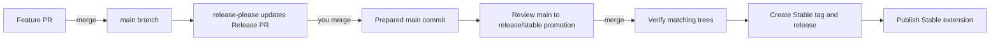
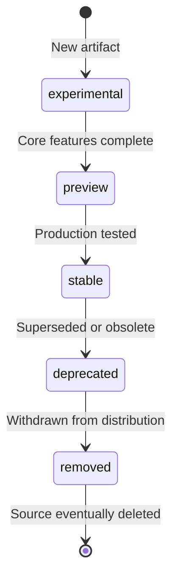

## Overview

This project uses trunk-based development with explicit channel ownership. Changes reach `main` through pull requests. PreRelease packages an approved `main` commit directly. Stable is created only after release-please prepares an even version and changelog on `main`, followed by a reviewed promotion into `release/stable`.

## How Releases Work



When you merge a PR to `main`:

1. **release-please analyzes commits** using conventional commit messages.
2. **The Release PR updates** even-minor version fields, the immutable plugin locator, and changelog entries.
3. **You decide** when to merge the Release PR into `main`.
4. **Stable preparation opens** a non-auto-merged promotion PR from `main` to `release/stable`.
5. **A reviewer merges** the promotion after confirming the release boundary.
6. **Stable publication verifies** matching trees, creates immutable tags and assets, then publishes the extension.

## The Release PR

The Release PR is not a deployment. It prepares version metadata and changelog changes on `main`:

* Updated `package.json` version
* Updated `extension/templates/package.template.json` version
* Updated `.github/plugin/marketplace.json` version and immutable `plugins-v<version>` locator
* Updated `CHANGELOG.md`

Your code changes are already on `main` from feature pull requests. The Release PR accumulates version and changelog updates until you are ready to promote that exact tree to Stable.

### Version Calculation

Release-please determines the version bump from commit prefixes:

| Commit Prefix                  | Version Bump | Example              |
|--------------------------------|--------------|----------------------|
| `feat:`                        | Minor        | 1.0.0 → 1.1.0        |
| `fix:`                         | Patch        | 1.0.0 → 1.0.1        |
| `feat!:` or `BREAKING CHANGE:` | Major        | 1.0.0 → 2.0.0        |
| `docs:`, `chore:`, `refactor:` | No bump      | Grouped in changelog |

> [!NOTE]
> Stable releases must have an even minor version number (e.g., `1.0`, `1.2`). Odd minor versions (e.g., `1.1`, `1.3`) are reserved for pre-release or unstable versions. This convention is enforced by CI (`release-stable.yml`).

## For Contributors

Write commits using conventional commit format. This enables automated changelog generation and version bumping.

```bash
# Features (triggers minor version bump)
git commit -m "feat: add new prompt for code review"

# Bug fixes (triggers patch version bump)
git commit -m "fix: resolve parsing error in instruction files"

# Documentation (no version bump, appears in changelog)
git commit -m "docs: update installation guide"

# Breaking changes (triggers major version bump)
git commit -m "feat!: redesign configuration schema"
```

For more details, see the [commit message instructions](https://github.com/microsoft/hve-core/blob/main/.github/instructions/hve-core/commit-message.instructions.md).

## For Maintainers

### Reviewing the Release PR

The Release PR titled "chore(main): release X.Y.Z" updates automatically as PRs merge. When ready to release:

1. Review the accumulated changelog in the PR
2. Verify version bump is appropriate for the changes
3. Merge the Release PR into `main`.
4. Review the generated `main` to `release/stable` promotion PR. Auto-merge is intentionally disabled.
5. Merge the promotion only when its tree is the reviewed `main` tree.
6. Verify the Stable publish workflow creates the tag, release assets, attestations, and published release.
7. Verify the published release triggers the Stable marketplace workflow.

### Release Cadence

Releases are on-demand. Merge the Release PR when:

* A meaningful set of changes has accumulated
* A critical fix needs immediate release
* A scheduled release milestone is reached

There is no requirement to release after every PR merge.

## Extension Publishing

VS Code extension publishing is automated. When `release-stable-publish.yml` publishes a verified Stable release, the `release: published` event triggers [`release-marketplace-stable.yml`](https://github.com/microsoft/hve-core/blob/main/.github/workflows/release-marketplace-stable.yml), which packages and publishes the one HVE Core extension through Azure OIDC authentication.

### Manual Fallback

If the automated publish did not trigger or you need to republish, use the workflow dispatch fallback:

1. Navigate to **Actions → Stable Marketplace Publish** in the repository
2. Select **Run workflow**
3. Choose the workflow from its default branch
4. Optionally specify a version (defaults to `package.json` version)
5. Optionally enable dry-run mode to package without publishing
6. Click **Run workflow**

### When to Publish

Publish the extension after merging a Release PR that includes extension-relevant changes:

* New prompts, instructions, or custom agents
* Bug fixes affecting extension behavior
* Updated extension metadata or documentation

Documentation-only releases may not require an extension publish.

## Version Quick Reference

| Action                        | Result                                               |
|-------------------------------|------------------------------------------------------|
| Merge feature PR to main      | Release PR updates with a changelog entry            |
| Merge Release PR              | Prepared version reaches `main`                      |
| Merge promotion PR            | Verified Stable tag and release pipeline starts      |
| Stable release published      | Stable extension marketplace workflow starts         |
| Run PreRelease for a main SHA | Odd-minor PreRelease tag and release pipeline starts |
| Merge docs-only PR            | Changelog updates without a version bump             |

## Extension Channels and Maturity

The VS Code extension is published to two same-content channels with different cadence, versioning, and source ownership.

### Extension Channels

| Channel    | Source                                        | Included Active Labels                  | Audience       |
|------------|-----------------------------------------------|-----------------------------------------|----------------|
| Stable     | Reviewed `main` promotion in `release/stable` | `stable`, `preview`, and `experimental` | All users      |
| PreRelease | Explicit commit on `main`                     | `stable`, `preview`, and `experimental` | Early adopters |

### Maturity Levels

The `hve-core` recipe declares non-stable component lifecycle labels in `x-hve.componentMaturity` under `.github/plugin/marketplace.json`:

| Level          | Description                                                                 | Included In     |
|----------------|-----------------------------------------------------------------------------|-----------------|
| `stable`       | Established component                                                       | Both channels   |
| `preview`      | Functional component still receiving compatibility work                     | Both channels   |
| `experimental` | Early development that may change significantly                             | Both channels   |
| `deprecated`   | Scheduled for removal                                                       | Neither channel |
| `removed`      | Source retained for traceability but withdrawn from generated distributions | Neither channel |

Lifecycle labels disclose support posture and inform governance. They are not channel filters and are separate from maturity classifications used in Responsible AI assessments.

### Maturity Lifecycle



The `removed` level is a marketplace tombstone. The artifact file remains in its
source location (for example, under `.github/skills/{package-id}/`) so history and
references stay intact, but every downstream surface (marketplace validation, plugin
generation, and extension packaging) excludes it. Use `removed` when you want to retire
an artifact from distribution without moving it to `.github/deprecated/` or deleting it
outright. See [AI Artifacts Architecture - Removed Artifacts](../architecture/ai-artifacts.md#removed-artifacts)
for the architectural contract.

### Contributor Guidelines

| Guideline          | Action                                                                                                                                                                                                                                                             |
|--------------------|--------------------------------------------------------------------------------------------------------------------------------------------------------------------------------------------------------------------------------------------------------------------|
| New contributions  | Omit component maturity for the default `stable` value unless targeting early adopters                                                                                                                                                                             |
| Experimental work  | Set `experimental` on the package-relative component path                                                                                                                                                                                                          |
| Preview promotions | Set `preview` when core functionality is complete                                                                                                                                                                                                                  |
| Stable promotions  | Remove the component-maturity override after production validation                                                                                                                                                                                                 |
| Deprecation        | Set `deprecated` before removal to provide transition time. Move the artifact file to `.github/deprecated/{type}/` when archival placement is intended. See [AI Artifacts Architecture](../architecture/ai-artifacts.md#deprecated-artifacts) for the full policy. |
| Removal            | Remove active standard membership and retain a `removed` tombstone in `x-hve.componentMaturity` when source should remain for history, references, or possible reinstatement. See [Removed Artifacts](../architecture/ai-artifacts.md#removed-artifacts).          |

---

<!-- markdownlint-disable MD036 -->
*🤖 Crafted with precision by ✨Copilot following brilliant human instruction,
then carefully refined by our team of discerning human reviewers.*
<!-- markdownlint-enable MD036 -->
