## Overview

This project uses a one-way reviewed branch ladder:
`main` to `release/prerelease` to `release/stable`. Each hop uses two pull
requests. A target-based promotion PR moves source changes into the release
branch and creates no tag. Its merge runs release-please in PR-only mode. The
later release-please managed PR owns version and changelog metadata. Its merge
creates `prerelease-v<version>` for PreRelease or `v<version>` for Stable.

`main` is not a release-please target. It is a ref-less development-tip channel and does not receive release metadata or changelog updates when a channel is published. An explicit marketplace refresh and plugin update are required for the ref-less main catalog, whose bytes have no release gate, SBOM, or attestation. Release branches, tags, and published GitHub releases own release state and history.

The ref-less `microsoft/hve-core` registration follows `main`. Main bytes have
no release gate, SBOM, or attestation. Release channels remain the reviewed
path through moving branch registrations and exact `prerelease-v<version>` or
`v<version>` refs: they are release-gated, SBOM-covered, and attested.

Workflow ownership is explicit:

* `release-prerelease-prepare.yml` opens the reviewed `main` to
    `release/prerelease` promotion.
* `release-prerelease.yml` validates reviewed heads, synchronizes release
    preparation, and lets release-please create the PreRelease tag and draft.
* `release-stable.yml` opens the reviewed `release/prerelease` to
    `release/stable` promotion.
* `release-stable-publish.yml` validates reviewed heads, synchronizes release
    preparation, and lets release-please create the Stable tag and draft.
* `release-vsix-publish.yml` is the sole post-tag producer for both channels.

## How Releases Work

```mermaid
flowchart TD
    accTitle: PreRelease and Stable Promotion Workflows
    accDescr: Each release channel uses a promotion pull request without a tag, followed by a managed release pull request that creates the channel tag before packaging and publication.
    subgraph PRE[PreRelease]
        P1[Review main to PreRelease promotion PR] -->|merge, no tag| P2[Review managed PreRelease PR]
        P2 -->|merge| P3[Release-please creates tag and draft]
        P3 -->|tag push| P4[Sole post-tag producer packages and attests]
        P4 --> P5[Publish prerelease with App token]
        P5 --> P6[Pre-Release Marketplace Publish]
    end
    subgraph STABLE[Stable]
        S1[Published PreRelease] --> S2[Review PreRelease to Stable promotion PR]
        S2 -->|merge, no tag| S3[Review managed Stable PR]
        S3 -->|merge| S4[Release-please creates tag and draft]
        S4 -->|tag push| S5[Sole post-tag producer packages and attests]
        S5 --> S6[Publish Stable release with App token]
        S6 --> S7[Stable Marketplace Publish]
    end
```



| Channel    | Promotion head                                                            | Managed head                                   | Promotion mode | Managed mode |
|------------|---------------------------------------------------------------------------|------------------------------------------------|----------------|--------------|
| PreRelease | `release-promotion--main--to--release-prerelease`                         | `release-please--branches--release/prerelease` | PR-only        | Tag-only     |
| Stable     | `release-promotion--release-prerelease--to--release-stable--<source-tag>` | `release-please--branches--release/stable`     | PR-only        | Tag-only     |

### PreRelease Flow

1. `Pre-Release Promotion Preparation` runs after an eligible merged PR to
   `main`, or through its input-free recovery dispatch.
2. It refreshes the target-based promotion head from `release/prerelease`,
   merges current `main`, restores channel-owned release state, writes the
   exact `release-as`, and opens a reviewed PR to `release/prerelease`.
3. Review `PR Validation Success`, the odd-minor intent, and the promoted tree.
   Merge the promotion PR. This merge creates no tag or GitHub release.
4. `Pre-Release Preparation` (`release-prerelease.yml`) runs release-please in PR-only mode with
   `release-please-prerelease-config.json` and
   `.release-please-prerelease-manifest.json`.
5. Review the managed PR. It carries the synchronized version fields,
   changelog, and manifest; postprocessing removes the consumed `release-as`.
6. Merge the managed PR. Release-please creates the exact odd-minor
    `prerelease-v<version>` tag and draft at that merge commit.
7. The tag push starts `release-vsix-publish.yml`. It proves the protected
    exact tag, source commit, channel branch, and synchronized committed release
    state, then discovers the matching draft through at most 12 attempts
    separated by 10 seconds.
8. The producer packages one VSIX from the validated release SHA, attaches the
    VSIX SPDX, Sigstore, and in-toto sidecars plus `dependencies.spdx.json`, and
    verifies provenance against the immutable release identity.
9. A release GitHub App token publishes the prerelease with
   `gh release edit --prerelease --draft=false`. The event triggers
   `Pre-Release Marketplace Publish`.
10. Release publication does not update `main`. The release branch, immutable
    tag, and published GitHub release retain the channel release state and
    history.

### Stable Flow

1. A published PreRelease event runs `Stable Release Preparation`. A recovery
    dispatch must provide the published `prerelease-v<version>` tag.
2. The workflow derives a promotion head from the validated source tag,
    refreshes it from `release/stable`, validates the published source tag,
    version, and branch ancestry, and merges only that tag commit. It restores
    selected-source manifest and version content, projects Stable version
    fields, writes the exact `release-as`, and opens a reviewed PR. Newer
    `release/prerelease` commits and other selected tags are excluded.
3. Review `PR Validation Success`, the even-minor intent, and the promoted
    tree. Merge the promotion PR. This merge creates no tag or GitHub release.
4. `Stable Release Preparation` (`release-stable-publish.yml`) revalidates the tag-scoped merged head and current
    Stable intent in a read-only job, then runs release-please in PR-only mode
    and opens or updates the managed Stable PR.
5. Review the managed version, changelog, plugin manifest, and marketplace
    locator version. The future release tag does not exist yet by design.
    Postprocessing removes the consumed `release-as`.
6. Merge the managed PR. Release-please creates the exact even-minor
   `v<version>` tag and draft at that managed merge commit.
7. The tag push starts `release-vsix-publish.yml`. It proves the protected
   exact tag, source commit, channel branch, and synchronized committed release
   state, then performs the same bounded exact-draft discovery.
8. The producer packages one VSIX from the release tag and attaches its SPDX,
   Sigstore, and in-toto sidecars, `dependencies.spdx.json`, Stable OpenVEX,
    provenance, an optional best-effort dependency diff when a prior SBOM is
    available, and verification notes. The VSIX and VEX
   assurance are bound to the immutable release identity.
9. A release GitHub App token publishes the Stable release with
    `gh release edit --draft=false`. The event triggers
    `Stable Marketplace Publish`.

Published channels do not synchronize release metadata or changelog history to
`main`.

### Packaging and Verification Boundary

`extension-provenance-signer.yml` provides the signer path and separates packaging
from signing. Its `package` job installs dependencies and builds the VSIX with
only `contents: read`. Its dependent privileged `attest` job receives the
fixed-name VSIX and dependency SBOM through digest-checked transfers. It never
installs dependencies or packages the extension. No job both packages and
signs.

Release verification is cryptographic first and semantic second. GitHub CLI
verification authenticates the exact subject digest, signer workflow and
revision, source ref and revision, and hosted-runner constraint. Fail-closed
policy then requires the exact subject and digest, SLSA provenance v1, GitHub
Actions `workflow/v1`, the `push` event, a GitHub-hosted runner, the expected
external parameters, one resolved source dependency, and the expected builder
identity. Missing, additional, or mismatched fields fail verification.

The published event starts a separate Marketplace workflow. That workflow
downloads and verifies only the VSIX from the matching published GitHub release
and does not rebuild the extension.

### Required Tag Governance

Tag governance is a mandatory activation prerequisite for post-tag production,
but it is not yet active or proven. The intended repository configuration has
two rulesets:

* `release-tags-creation-by-release-app` restricts creation only and grants a
    bypass to the Release App
* `release-tags-immutable` restricts updates, deletion, and force pushes with
    no bypass

Do not interpret this intended configuration as evidence that either ruleset
is installed.

> [!IMPORTANT]
> This release architecture does not establish SLSA Build Level 3. Future
> Stable and PreRelease releases still require successful runtime evidence,
> active governance evidence, platform assurance mapping, and qualified human
> review before making that claim.

## The Release PR

The release-please managed PR is not a deployment. Merging it is the reviewed
boundary that permits the channel's tag-only run. Both channel configs use
`draft: true`, `force-tag-creation: true`, and patch fallback. The managed PR
prepares channel version metadata and changelog changes on its release branch:

* Updated `package.json` and `package-lock.json` versions
* Updated `extension/templates/package.template.json` version
* Updated root `plugin.json` version
* Updated `.github/plugin/marketplace.json` metadata and sole entry version
* Updated channel manifest
* Updated `CHANGELOG.md`

The promoted code is already on the target release branch. The exact
promotion intent is consumed from the config and removed before the managed PR
merges, so tag-only publication does not depend on stale intent.

### Version Calculation

Promotion preparation determines the exact channel version before
release-please opens its managed PR:

| Channel    | Ordinary allocation input            | Exact result                                        |
|------------|--------------------------------------|-----------------------------------------------------|
| PreRelease | Current `release/prerelease` version | Same major, minor plus two, patch zero              |
| Stable     | Promoted PreRelease version          | Promoted major, promoted minor plus one, patch zero |

For example, the ordinary sequence is `3.3.101` to `3.5.0` to `3.6.0`.
PreRelease reads only `release/prerelease`. Stable derives its candidate from
the promoted PreRelease version; the current Stable version only rejects a
candidate that does not advance it. The plugin manifest and VSIX use the
identical channel version.

> [!NOTE]
> Stable releases use an even minor version number (for example, `1.2.0`), and
> PreRelease releases use an odd minor version number (for example, `1.3.0`).
> This parity is repository policy aligned with VS Code Marketplace guidance
> and behavior. It is not a requirement of `MAJOR.MINOR.PATCH` syntax.

Ordinary release allocation has no commit classification and no automatic
patch, minor, or major release class. Stable has no release-class recovery
dispatch. A major-line transition or a Stable patch or hotfix requires a
separate explicit manifest and release-state decision.

## For Contributors

Write commits using conventional commit format to support clear changelog
entries. Commit type does not select the release version.

```bash
# Feature changelog entry
git commit -m "feat: add new prompt for code review"

# Fix changelog entry
git commit -m "fix: resolve parsing error in instruction files"

# Documentation changelog entry
git commit -m "docs: update installation guide"

# Breaking-change changelog entry
git commit -m "feat!: redesign configuration schema"
```

For more details, see the [commit message instructions](https://github.com/microsoft/hve-core/blob/main/.github/instructions/hve-core/commit-message.instructions.md).

## For Maintainers

The checks in this section are authorized manual operations against GitHub and
release clients. Local documentation validation does not execute or verify
them.

### Recovering the Post-Tag Producer

Bounded draft discovery is a fail-closed safety control, not a guarantee that
GitHub will create or expose the draft during the observation window. Before
recovery, classify the exact tag and release state and use only its matching
row:

1. Neither tag nor release: rerun the approved release-please path. No
    producer event exists yet.
2. Tag exists and release is absent: rerun release-please to create the exact
    draft. If the original producer exhausted discovery, rerun that original
    tag-push workflow afterward.
3. Draft exists and tag is absent: rerun release-please to materialize the tag.
    The pre-tag run may report a duplicate release, but the App-created tag can
    start the producer after it independently validates the existing draft.
4. Tag and matching draft exist: rerun the workflow created by the original
    immutable tag-push event.
5. Tag and published release exist: rerun the original tag workflow for
    asset-set and provenance verification only. Do not rebuild or change release
    state.
6. Draft contains partial assets: rerun the original tag workflow. It may
    replace or restore draft assets, but publication remains blocked until every
    required job and provenance check passes.

The producer has no default `workflow_dispatch` recovery path. Never move,
delete, or recreate the tag; convert a published release back to draft; create
a replacement release identity; or treat a failed release-please run as
authority for post-tag work. Every producer attempt revalidates the protected
tag, source commit, channel branch, committed state, and exact release target.

Stop without mutation if the ruleset aggregate is unclear, the state does not
match one row, release lookup is inaccessible or ambiguous, source or channel
identity differs, or required asset and provenance verification fails. Use an
approved disposable repository or canary namespace, not a production release
identity, when deliberate partial-state testing is required.

### Recovering from an Occupied Candidate

Promotion preparation stops before branch mutation when the calculated exact
channel release identity already exists. The calculation is
deterministic, so rerunning preparation without reconciling channel state
selects the same occupied version and fails again.

1. Inspect the tag, the GitHub release, its target commit, and available
    published release assets and provenance. Determine whether they belong to a completed HVE
    Core release or are unrelated, manual, or abandoned state.
2. Do not delete, move, or force-update the immutable tag. Do not republish a
    completed release to make branch metadata agree with it.
3. If the identities belong to a completed release, reconcile the channel
    branch manifest and synchronized release metadata with that released commit
    through a reviewed pull request. Continue with the next ordinary channel
    release instead of recreating the occupied version.
4. If the identities must remain reserved but do not represent a completed
    channel release, make an explicit reviewed release-state decision:
    * For PreRelease, advance the `release/prerelease` manifest and synchronized
      version metadata to the occupied odd-minor baseline. Then run the
      input-free **Pre-Release Promotion Preparation** workflow dispatch. It
      calculates the following odd-minor candidate from the reviewed baseline.
    * For Stable, publish the next valid odd-minor PreRelease through the normal reviewed path. Publication starts **Stable Release Preparation** automatically. Inspect that run's outcome, including any no-op notice. If the run did not start or failed, dispatch the workflow manually with the published `prerelease-v<version>` tag. A successful preparation calculates the following even-minor candidate from the selected source.

Record the provenance finding and reviewed state change with the release. An
authentication, transport, rate-limit, or ambiguous lookup failure is not an
occupied-candidate recovery case; fix that failure and rerun the unchanged
preparation workflow.

### Reviewing the PreRelease

1. Review the target-based `main` to `release/prerelease` promotion PR and its
    `PR Validation Success` check.
2. Confirm the head is
    `release-promotion--main--to--release-prerelease`, the proposed version is
    odd-minor, and the source tree is the intended `main` state.
3. Merge the promotion and verify it creates no tag. Confirm the resulting
    `Pre-Release Preparation` (`release-prerelease.yml`) run opens the managed
    PR in PR-only mode.
4. Review the managed PR on `release/prerelease`, including synchronized
    versions, changelog, plugin manifest, and marketplace version parity.
5. Merge the managed PR and verify release-please creates the exact
   `prerelease-v<version>` tag and draft at that managed merge commit.
6. Verify the tag push starts `release-vsix-publish.yml` and passes protected
   tag, source, branch, committed-state, and exact-draft validation.
7. Verify packaging uses the release tag and attaches one VSIX, its SPDX,
    Sigstore, and in-toto sidecars, and `dependencies.spdx.json` for the same
    source SHA.
8. Verify App-token publication marks the GitHub release as a prerelease,
    and triggers `Pre-Release Marketplace Publish`.

### Reviewing the Stable Release

The promotion and managed release PR are separate review boundaries. When ready to release:

1. Review the `release/prerelease` to `release/stable` promotion PR and its
    `PR Validation Success` check. Auto-merge is intentionally disabled.
2. Confirm the head is
    `release-promotion--release-prerelease--to--release-stable--<source-tag>`,
    the suffix matches the selected published PreRelease tag, the source commit
    has matching release provenance, and the proposed version is
    even-minor. A
    newer branch tip or another selected tag must not enter the promotion.
3. Merge the promotion and verify it creates no tag. Confirm the resulting
    `Stable Release Preparation` (`release-stable-publish.yml`) run opens the
    managed PR in PR-only mode.
4. Review the managed PR on `release/stable`, including its changelog, version
    fields, plugin manifest, and marketplace version parity.
5. Merge the managed PR and verify release-please creates the exact tag and
    draft at that managed merge commit.
6. Verify the tag push starts `release-vsix-publish.yml` and passes protected
    tag, source, branch, committed-state, and exact-draft validation.
7. Verify the producer attaches one VSIX, its SPDX, Sigstore, and in-toto
    sidecars, `dependencies.spdx.json`, Stable OpenVEX, and provenance assets.
8. When a prior dependency SBOM is available, verify the best-effort Stable
    dependency diff. Always verify that the release notes retain the
    verification guidance.
9. Verify App-token publication triggers `Stable Marketplace Publish` for the
    same release tag.

### Release Cadence

Releases are on-demand. Merge the managed Stable release PR when:

* A meaningful set of changes has accumulated
* A critical fix needs immediate release
* A scheduled release milestone is reached

There is no requirement to release after every PR merge.

## Extension Publishing

VS Code extension publishing uses the channel Marketplace workflows. Both
channels are published by `release-vsix-publish.yml` with a release GitHub App
token, so each published event triggers its matching Marketplace workflow:

* [`release-marketplace-prerelease.yml`](https://github.com/microsoft/hve-core/blob/main/.github/workflows/release-marketplace-prerelease.yml)
* [`release-marketplace-stable.yml`](https://github.com/microsoft/hve-core/blob/main/.github/workflows/release-marketplace-stable.yml)

Both Marketplace workflows pass the validated exact release tag to the generic
publisher, which resolves the attesting workflow to the one constant both
channels sign from. The publisher downloads the release asset, verifies its
attestation against that signer, and publishes through Azure OIDC
authentication.

### Manual Fallback

If an automated publish did not trigger or you need to republish, use the
matching channel workflow dispatch fallback:

1. Navigate to **Actions**, then select the matching PreRelease or Stable
    Marketplace workflow
2. Select **Run workflow**
3. Choose the workflow from its default branch
4. Optionally specify a version; an empty value auto-detects the latest
    published release for that channel
5. Optionally enable dry-run mode to validate the version and catalog without
    publishing
6. Click **Run workflow**

### When to Publish

Publish the extension after merging a Release PR that includes extension-relevant changes:

* New prompts, instructions, or custom agents
* Bug fixes affecting extension behavior
* Updated extension metadata or documentation

Documentation-only releases may not require an extension publish.

## Historical Release Identities

Because snapshot publication has stopped, tags and catalogs remain immutable and supported only as historical records. Existing `hve-core-v<version>` and `plugins-v<version>` tags, releases, and catalogs are within that historical set. They are not active registration, publication, recovery, or compatibility namespaces. Current automation does not create, move, rewrite, delete, or migrate them.

## Version Quick Reference

| Action                                     | Result                                                            |
|--------------------------------------------|-------------------------------------------------------------------|
| Merge or dispatch PreRelease preparation   | Opens or refreshes the reviewed `main` to PreRelease promotion PR |
| Merge PreRelease promotion PR              | Opens the managed PreRelease PR; creates no tag                   |
| Merge managed PreRelease PR                | Creates the draft tag and starts the odd-minor artifact pipeline  |
| Publish PreRelease with App token          | Starts PreRelease Marketplace publication                         |
| Publish PreRelease or dispatch Stable prep | Opens or refreshes the reviewed PreRelease to Stable promotion PR |
| Merge Stable promotion PR                  | Opens the managed Stable PR; creates no tag                       |
| Merge managed Stable PR                    | Creates the draft tag and starts the even-minor artifact pipeline |
| Publish Stable with App token              | Starts Stable Marketplace publication                             |

## Extension Channels and Membership

The VS Code extension is published to two same-content channels with different cadence, versioning, and source ownership.

### Extension Channels

| Channel    | Moving source        | Immutable source        | Component membership |
|------------|----------------------|-------------------------|----------------------|
| Stable     | `release/stable`     | `v<version>`            | Complete manifest    |
| PreRelease | `release/prerelease` | `prerelease-v<version>` | Complete manifest    |

### Membership Policy

Root `plugin.json` is identical in membership across Stable and PreRelease.
`npm run plugin:sync` derives it from tracked package-scoped agents, prompts,
instructions, and distributable skills under `.github`; hooks are not part of
the manifest. Promotion and release validation version root `plugin.json`, and
each moving branch or exact tag resolves root README and LICENSE from its
selected snapshot. The VSIX continues to package `extension/README.md` and
`extension/LICENSE` from that immutable release source.

Channel selection changes version, source ownership, release assurance, and the VS Code Marketplace pre-release flag. It never filters components.

### Contributor Guidelines

| Guideline         | Action                                                                                                                                                                                           |
|-------------------|--------------------------------------------------------------------------------------------------------------------------------------------------------------------------------------------------|
| New contributions | Place the artifact under a package-scoped canonical path and run `npm run plugin:sync`.                                                                                                          |
| Validation        | Run `npm run plugin:validate` and applicable artifact, documentation, and extension checks.                                                                                                      |
| Deprecation       | Add migration guidance, then move the artifact under `.github/deprecated/` when it should leave both channels. See [Deprecated Artifacts](../architecture/ai-artifacts.md#deprecated-artifacts). |
| Removal           | Delete the active source and synchronize the manifest. Preserve needed history in the changelog or migration documentation rather than a distribution tombstone.                                 |

---

<!-- markdownlint-disable MD036 -->
*🤖 Crafted with precision by ✨Copilot following brilliant human instruction,
then carefully refined by our team of discerning human reviewers.*
<!-- markdownlint-enable MD036 -->
