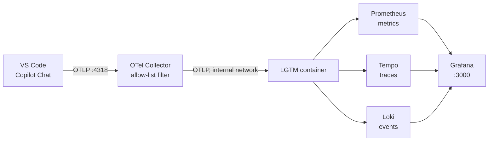
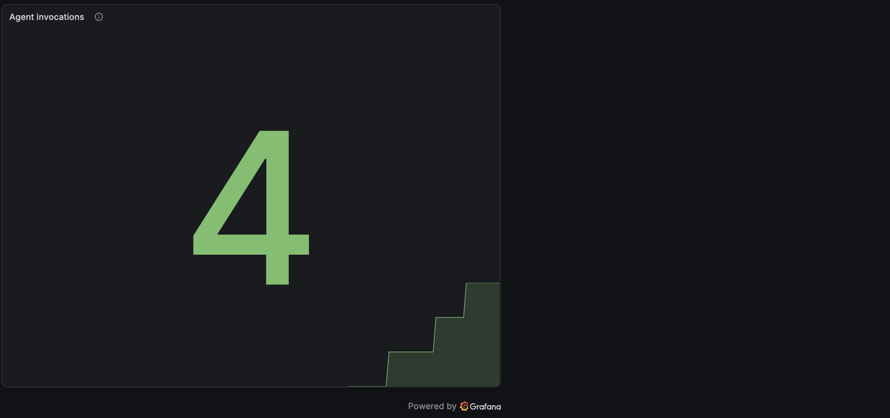
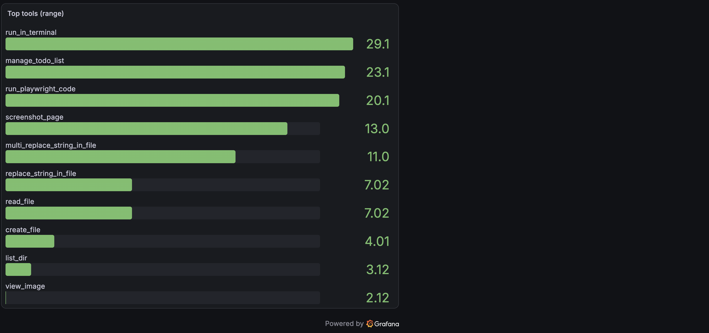
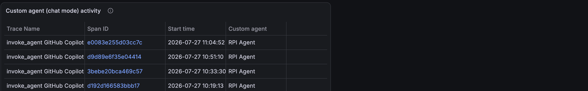
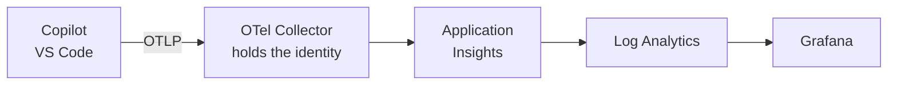

GitHub Copilot Chat can export traces, metrics, and events over OpenTelemetry. Point it at a collector you run yourself and you get a measured view of your own agent sessions: which models you use, how long calls take, which tools run most, how many tokens you burn, and how much of that is cache.

Everything up to [Configuring this for an organization](#configuring-this-for-an-organization) runs on one machine, in two containers, and sends nothing anywhere. You do not need an administrator to try it. The sections after that cover pushing the same configuration to a fleet and collecting it in Azure, which does need one.

:::tip Let the skill do it
The [`copilot-otel-metrics` skill](https://github.com/microsoft/hve-core/blob/main/.github/skills/experimental/copilot-otel-metrics/SKILL.md) walks this guide for you.
Invoke it explicitly with `/copilot-otel-metrics`; it does not activate on its own.

It has four modes, and you can name one directly or describe what you want and let it pick:

| Mode               | Ask for it when you want to                            |
|--------------------|--------------------------------------------------------|
| `local-setup`      | Turn export on for this machine                        |
| `local-stack`      | Stand up a backend here to receive it                  |
| `org-distribution` | Push OTel settings to a fleet through managed settings |
| `azure-capture`    | Collect a fleet's telemetry into Azure and chart it    |

It writes settings only after showing you an exact diff, and it generates and hands over the rest.
It never runs `docker compose`, `az deployment`, or `terraform apply` for you.
:::


## You probably do not need an administrator

The VS Code documentation renders a badge next to most OTel settings reading "This setting is managed at the organization level. Contact your administrator to change it." That badge means the setting *can* be governed by policy, not that it *is*.

The shipped extension manifest declares a `policyReference` but no applied `policy` value, and the documented resolution order is policy, then environment variable, then user setting, then default. With no policy present, your user setting wins.

If you are unsure whether a policy applies to you, run **Developer: Policy Diagnostics** from the command palette. It reports exactly which managed settings are enforced on your device.

## What Copilot emits

Three signal types, each answering a different kind of question.

| Signal  | Examples                                                     | Good for                                      |
|---------|--------------------------------------------------------------|-----------------------------------------------|
| Metrics | `gen_ai.client.token.usage`, `copilot_chat.tool.call.count`  | Rates, totals, percentiles, long-range trends |
| Traces  | `invoke_agent`, `chat`, `execute_tool`, `execute_hook` spans | Causality, per-session detail, attribution    |
| Events  | `copilot_chat.session.start`, `copilot_chat.tool.call`       | Discrete occurrences                          |

:::warning Names in this guide are a snapshot
Every signal, metric, and attribute name on this page came from one extension build at one moment, and the emitted surface follows the extension rather than this document. Settle names against your own store with `inspect_metrics.py`, and settle settings against the installed extension manifest. A wrong metric name fails silently: Prometheus returns an empty result and Grafana renders an empty panel, indistinguishable from a panel that is correct but idle.
:::

The split between metrics and traces matters more than it first appears, and the section on [choosing between metrics and traces](#choosing-between-metrics-and-traces) explains why.



## Start the stack

Two containers. The Grafana OTel-LGTM image bundles Grafana, Prometheus, Tempo, and Loki with the datasources pre-provisioned. In front of it sits an OpenTelemetry Collector that decides what is allowed to reach any of them.

The Collector is not decoration. It is the only OTLP listener published on your machine, and LGTM's own OTLP ports are deliberately unmapped. If both listened, any local process could write straight past the filter, and binding to loopback would not help, because everything on your machine is already on loopback.

```yaml
services:
  otel-collector:
    # otel/opentelemetry-collector-contrib:0.158.0
    image: otel/opentelemetry-collector-contrib@sha256:c5918f78992ee73b0d6f0e599423ac5ec52dd5d9726733114d6eca53d5a32ed5
    container_name: copilot-otel-collector
    restart: unless-stopped
    command: ["--config=/etc/otelcol-contrib/config.yaml"]
    ports:
      - "127.0.0.1:4317:4317"   # OTLP gRPC
      - "127.0.0.1:4318:4318"   # OTLP HTTP
    volumes:
      - ./otel-collector-local.yaml:/etc/otelcol-contrib/config.yaml:ro
    networks: [copilot-otel]
    depends_on:
      lgtm:
        condition: service_healthy

  lgtm:
    # grafana/otel-lgtm:0.29.2
    image: grafana/otel-lgtm@sha256:af7242c1a9608faf6d26e6f235392fd0c32b67258228f9a3cfc96e724974930c
    container_name: copilot-otel-lgtm
    restart: unless-stopped
    ports:
      - "127.0.0.1:3000:3000"   # Grafana
      - "127.0.0.1:9090:9090"   # Prometheus
      - "127.0.0.1:3200:3200"   # Tempo
    networks: [copilot-otel]
    environment:
      GF_AUTH_ANONYMOUS_ENABLED: "false"
      GF_AUTH_DISABLE_LOGIN_FORM: "false"
      GF_AUTH_BASIC_ENABLED: "true"
      GF_SECURITY_ADMIN_USER: ${COPILOT_OTEL_GRAFANA_USER:?set COPILOT_OTEL_GRAFANA_USER before starting the stack}
      GF_SECURITY_ADMIN_PASSWORD: ${COPILOT_OTEL_GRAFANA_PASSWORD:?set COPILOT_OTEL_GRAFANA_PASSWORD before starting the stack}
      PROMETHEUS_EXTRA_ARGS: "--enable-feature=otlp-deltatocumulative --storage.tsdb.retention.time=120d"
    volumes:
      - copilot-otel-data:/data

networks:
  copilot-otel:
    driver: bridge

volumes:
  copilot-otel-data:
    external: true
```

The Collector configuration it mounts is an allow-list, not a delete-list:

```yaml
processors:
  redaction:
    allow_all_keys: false
    allowed_keys:
      - service.name
      - gen_ai.request.model
      - gen_ai.usage.input_tokens
      - gen_ai.usage.output_tokens
      - copilot_chat.mode_name
      # ...the rest of the keys the dashboards actually read
    summary: silent
```

The allow-list is not the whole story, and the difference is worth knowing before you rely on it. It governs **attributes**, plus a map-valued log body. It does not reach span names, span status messages, span event names, trace state, non-map log bodies, severity text, metric metadata, span links, or metric exemplars. A second `transform/scrub` processor closes the ones nothing in the shipped dashboards reads.

Three things still reach the store unfiltered, and they are recorded as gaps rather than described away:

* **Span names and metric metadata**, because dashboard queries match on them. A span name is composed by the emitter, so this is the residual worth watching.
* **Span link attributes and metric exemplar attributes**, because this Collector distribution offers no way to reach them. OTTL has no `spanlink` context, refuses to index `links`, and silently ignores an assignment to `datapoint.exemplars`.
* **Instrumentation scope name and version, and the resource and scope schema URLs**, because they are expected to carry library identity rather than content. That is an expectation about a well-behaved emitter, not a control: nothing filters these fields, so anything placed in them is stored.

None of that is inferred from reading the configuration. `tests/test_collector_carriers.py` starts the pinned Collector, sends a distinct marker through each of 28 carriers, and records what survives, with a paired control run proving each marker is visible when nothing filters it. The recorded map is asserted, so a change that opens a carrier fails the test suite.

That direction is the whole point. A delete-list removes the content attributes someone already knows about; it passes through the one a future extension release adds. An allow-list drops anything it has not been told to keep, so an unfamiliar attribute is a dropped attribute rather than a stored one. The full file is in the skill's examples directory.

```bash
export COPILOT_OTEL_GRAFANA_USER=admin
read -rs -p 'Grafana password: ' COPILOT_OTEL_GRAFANA_PASSWORD; echo
export COPILOT_OTEL_GRAFANA_PASSWORD
docker volume create copilot-otel-data
docker compose up -d
```

The password is read rather than typed inline so it does not land in the terminal scrollback or the shell history file. In PowerShell, `Read-Host -AsSecureString` serves the same purpose. A Compose `.env` file reaches the containers but not the bundled Python helpers, which read the same two variables from the environment of the shell that runs them.

Several details in that file are deliberate:

* Grafana credentials are required and have no default. The LGTM image otherwise enables anonymous access with the Admin role and hides the login form, which would leave every panel and every stored prompt fragment readable by anything that can reach port 3000. The `${VAR:?message}` form fails the `up` rather than starting on a guessable credential.
* Both images are pinned by digest, with the tag kept in a comment. A tag is mutable, so a tag-pinned stack can change under a configuration you already reviewed.
* Ports bind to `127.0.0.1` because nothing here should be reachable from off-host.
* The volume is declared `external` so Compose binds the volume you created instead of making a project-prefixed duplicate and orphaning your history.
* `otlp-deltatocumulative` is set defensively. Prometheus drops delta-temporality metrics by default, and a dropped delta metric can fail the entire batched write, taking unrelated cumulative metrics with it. The flag converts instead of dropping and is inert when traffic is already cumulative.
* Retention is raised well past the 15 day default, because a monthly total would otherwise truncate silently at fifteen days.

The filter decides what is stored. It does not change what the extension emits, so content attributes still leave the editor and still cross the loopback hop in plaintext before the Collector drops them.

Two artifacts in this guide are not copy-pasteable. The dashboard is roughly nineteen kilobytes of JSON, and the Collector configuration is shown above only as an excerpt. The compose file bind-mounts `./otel-collector-local.yaml`, so the Collector cannot start without the complete file: Docker creates an empty directory at that path instead. Take both from the skill rather than from this page.
Runnable copies of the compose file, the full Collector configuration, the dashboard, and the helper scripts live in the
[copilot-otel-metrics skill](https://github.com/microsoft/hve-core/blob/main/.github/skills/experimental/copilot-otel-metrics/SKILL.md),
whose [examples directory](https://github.com/microsoft/hve-core/tree/main/.github/skills/experimental/copilot-otel-metrics/examples)
holds [the Collector configuration](https://github.com/microsoft/hve-core/blob/main/.github/skills/experimental/copilot-otel-metrics/examples/otel-collector-local.yaml)
and [the dashboard JSON](https://github.com/microsoft/hve-core/blob/main/.github/skills/experimental/copilot-otel-metrics/examples/dashboards/copilot-otel.json)
to import into Grafana. The YAML above mirrors the files shipped there.

## Turn on export

Add these to your **user** `settings.json`, then reload the window.

```json
{
  "github.copilot.chat.otel.enabled": true,
  "github.copilot.chat.otel.exporterType": "otlp-http",
  "github.copilot.chat.otel.otlpEndpoint": "http://localhost:4318"
}
```

> [!IMPORTANT]
> These settings do not take effect until you run **Developer: Reload Window**. If you enable export and see nothing, the reload is almost always why.

Which settings file they resolve from depends on the scope the installed build declares, and that is worth checking rather than assuming.
In the build verified for this page, none of the OTel keys declares a scope, so they take VS Code's default `window` scope and the active profile's settings file applies.
If your build declares them `scope: application`, they resolve from the **default profile no matter which profile is active**, and editing `User/profiles/<id>/settings.json` accomplishes nothing and tells you nothing: no error, no warning, no telemetry.

Run **Preferences: Open Application Settings (JSON)** from the command palette and VS Code opens the global file. That target is correct either way, so it is the safe place to write when you are unsure. If you run both stable and Insiders you have two of these files, and only the one belonging to the build you are testing counts.

<details>
<summary>All seven settings, and the environment variables that override them</summary>

Three keys turn export on. The other four tune it. Every name below is prefixed with `github.copilot.chat.otel.`.

Verified against GitHub Copilot Chat 0.52.0.
An earlier revision of this page listed eleven settings, adding `protocol`, `headers`, `serviceName`, and `resourceAttributes`, verified against build `0.59.2026072702` where all eleven were application-scoped.
Both observations were accurate for their own build, which is the real lesson: this surface moves with the extension.
Writing a key your build does not declare gives you a setting that is silently inert, so check your own installed extension before using any of them.

| Setting                  | Type    | Default                   | Sets what                                                              |
|--------------------------|---------|---------------------------|------------------------------------------------------------------------|
| `enabled`                | boolean | `false`                   | Master switch for trace, metric, and log emission                      |
| `exporterType`           | string  | `"otlp-http"`             | One of `otlp-grpc`, `otlp-http`, `console`, `file`                     |
| `otlpEndpoint`           | string  | `"http://localhost:4318"` | Where the data goes                                                    |
| `captureContent`         | boolean | `false`                   | Prompts, responses, system instructions, and tool definitions on spans |
| `maxAttributeSizeChars`  | integer | `0`                       | Truncation limit in characters; `0` disables truncation                |
| `outfile`                | string  | `""`                      | JSON-lines output path; setting it forces the `file` exporter          |
| `dbSpanExporter.enabled` | boolean | `false`                   | Local SQLite span exporter; turning it on turns OTel on                |

Resolution order is enterprise policy, then environment variable, then user setting, then default. A setting that looks like it was ignored is usually losing to a policy or a stray environment variable rather than failing to write.

| Setting                 | Environment variable                    |
|-------------------------|-----------------------------------------|
| `enabled`               | `COPILOT_OTEL_ENABLED`                  |
| `captureContent`        | `COPILOT_OTEL_CAPTURE_CONTENT`          |
| `otlpEndpoint`          | `OTEL_EXPORTER_OTLP_ENDPOINT`           |
| `maxAttributeSizeChars` | `COPILOT_OTEL_MAX_ATTRIBUTE_SIZE_CHARS` |

That second table is the practical route for a devcontainer or a CI runner, where editing a global settings file is awkward. `exporterType`, `outfile`, and `dbSpanExporter.enabled` declared no environment variable in the build inspected for this page, so those three come from settings or policy. Check your own installed extension before relying on either table.

</details>

Leave `captureContent` alone. Enabling it writes input and output messages, system instructions, and tool definitions into span attributes; the setting description marks it as containing potentially sensitive data.

> [!IMPORTANT]
> Leaving it alone is not the same as capturing nothing. With `captureContent` disabled I observed six attributes carrying plaintext content on spans, including your full prompt text. See [Check what your store actually holds](#check-what-your-store-actually-holds) before deciding this is fine for your machine.

## Confirm data is actually landing

An HTTP 200 from the OTLP endpoint proves nothing. Payloads that get dropped return exactly the same success response. Query the store instead:

```bash
curl -s 'http://localhost:9090/api/v1/label/__name__/values' \
  | python3 -c 'import json,sys; print([n for n in json.load(sys.stdin)["data"] if n.startswith(("copilot_chat","gen_ai"))])'
```

If that returns metric names, export is working. If it returns an empty list, reload the window and try again after a chat turn.

## Choosing between metrics and traces

This is the single most useful thing to understand about Copilot's telemetry, and it is not obvious from the documentation.

**Metrics carry model, provider, tool name, and token type.** They do not carry the custom agent you selected. Only two metrics carry any agent dimension at all, `copilot_chat.agent.invocation.duration` and `copilot_chat.agent.turn.count`, and their `gen_ai_agent_name` label holds the agent *surface* such as `GitHub Copilot Chat`.

**Traces carry everything else.** The `invoke_agent` span holds the custom agent name, the agent type, token counts, cache breakdown, and premium usage units.

So the rule is: reach for PromQL when you want rates and long-range totals, and reach for TraceQL when you want attribution.

| Question                        | Where it lives | Query language |
|---------------------------------|----------------|----------------|
| Tokens per hour, week, month    | Prometheus     | PromQL         |
| Latency percentiles by model    | Prometheus     | PromQL         |
| Tool call counts and duration   | Prometheus     | PromQL         |
| Which custom agent ran          | Tempo          | TraceQL        |
| Tokens attributed to that agent | Tempo          | TraceQL        |
| Cache hit rate                  | Tempo          | TraceQL        |
| Premium request units consumed  | Tempo          | TraceQL        |

The agent metrics that do exist are still worth watching. Turn count in particular tells you how many times an agent looped through the model before finishing.



## Useful metric queries

Metric names translate from the OTel names by turning dots into underscores, appending `_total` to monotonic counters, and appending a unit suffix when the emitter declares one.

:::warning Verify these names against your own store
The queries below worked against one build on the date in this page's frontmatter. The translation rule is a rule of thumb, not a guarantee: `gen_ai.client.operation.duration` is emitted with no unit, so its histogram is `gen_ai_client_operation_duration_bucket` and *not* `..._seconds_bucket`. Assuming the suffix produces an empty panel and no error.
:::

Token totals over rolling windows:

```promql
sum(increase(gen_ai_client_token_usage_sum[1h]))
sum(increase(gen_ai_client_token_usage_sum[7d]))
sum(increase(gen_ai_client_token_usage_sum[30d]))
```


Latency percentiles split by model:

```promql
histogram_quantile(0.95,
  sum by (le, gen_ai_request_model) (rate(gen_ai_client_operation_duration_bucket[5m])))
```


That panel is where model choice stops being abstract. In this session `claude-opus-5` sat near 19 seconds at p95 while `gpt-5.6-luna` stayed near 2 seconds.

> [!NOTE]
> `gen_ai.client.operation.duration` is emitted without a unit, so the series is `gen_ai_client_operation_duration_bucket` and **not** `..._seconds_bucket`. Several documented metrics, including `copilot_chat.lines_of_code.count` and `copilot_chat.edit.acceptance.count`, may not appear at all until the matching activity occurs. Check `__name__` values before assuming a query is wrong.

Which tools your agent actually leans on:

```promql
topk(10, sum by (gen_ai_tool_name) (increase(copilot_chat_tool_call_count_total[$__range])))
```



Mean tool duration, which is usually dominated by terminal commands:

```promql
sum by (gen_ai_tool_name) (rate(copilot_chat_tool_call_duration_sum[10m]))
  / sum by (gen_ai_tool_name) (rate(copilot_chat_tool_call_duration_count[10m]))
```


## Useful trace queries

Tempo supports TraceQL metrics, which aggregate span attributes over time and render as ordinary time series. That is what makes agent attribution possible.

Which custom agent ran, with turn counts:

```text
{span.copilot_chat.mode_name != ""}
  | select(span.copilot_chat.mode_name, span.github.copilot.agent.type, span.copilot_chat.turn_count)
```



Tokens attributed to that agent:

```text
{name=~"invoke_agent.*"} | sum_over_time(span.gen_ai.usage.input_tokens) by (span.copilot_chat.mode_name)
```


Cache reads, which are billed differently from fresh input:

```text
{name=~"invoke_agent.*"} | sum_over_time(span.gen_ai.usage.cache_read.input_tokens)
```


Comparing those last two panels is the most valuable thing on the dashboard. Across two agent runs I measured 24,066,702 input tokens of which 23,216,047 were cache reads, a 96.5 percent hit rate, leaving 122 tokens of genuinely fresh input. Prompt-cache efficiency dominates cost in an agentic workload, and neither figure appears anywhere in the metrics.

> [!TIP]
> Put one TraceQL metrics query per panel. The Tempo datasource names every series after its own label and overwrites the frame `refId` with that name, so two queries in one panel return two identically named lines. Neither `legendFormat` nor a `byFrameRefID` override can separate them.

## The helper scripts

Four small Python scripts sit beside the dashboard in the skill's [examples directory](https://github.com/microsoft/hve-core/tree/main/.github/skills/experimental/copilot-otel-metrics/examples). They use only the standard library, so there is nothing to install, and each answers a question this page raises but cannot answer for your machine.

| Script                  | Answers                                                                     |
|-------------------------|-----------------------------------------------------------------------------|
| `verify.py`             | Is the stack healthy, is the delta flag set, and are Copilot signals stored |
| `inspect_metrics.py`    | What metric names does my installed build actually emit                     |
| `baseline.py`           | Is this telemetry genuinely Copilot's, or residue from something else       |
| `validate_dashboard.py` | Does every panel in this dashboard return data                              |

All four import `_input_policy.py`, a fifth file in the same directory that holds their shared endpoint and path rules. Download it alongside them and keep it in the same directory, or every one of them fails at import:

```bash
python3 verify.py
python3 inspect_metrics.py
```

`inspect_metrics.py` is the answer to "is this metric name still right". Run it before trusting any name copied from documentation, this page included.

`baseline.py` earns its place more than it first looks. The local OTLP endpoint is unauthenticated, so any process on your machine can write series carrying genuine Copilot names. Snapshot before you enable export and diff afterwards, and you get provenance instead of mere presence:

```bash
python3 baseline.py capture   # before enabling export
python3 baseline.py diff      # after enabling export and reloading
```

`validate_dashboard.py` imports with `overwrite: true`, so it replaces any dashboard sharing the same uid. It refuses a Grafana that is not on loopback, and it checks Prometheus and Tempo dashboards only. Point it at the Azure dashboard and it exits rather than handing you results that mean nothing.

## Things that look broken but are not

Three behaviours cost me time, and all three are working as designed.

An OTLP endpoint returning `200 {"partialSuccess":{}}` tells you the payload was accepted for processing, not that it was stored. Always confirm against Prometheus or Tempo.

Tempo takes roughly 30 seconds to make a freshly ingested trace searchable. Checking a trace panel immediately after a chat turn looks identical to failure. Prometheus has no such delay, so use metrics for a fast confirmation.

An `invoke_agent` span only closes when the agent turn ends. While a turn is still running it contributes nothing, which means agent-attributed panels lag behind metric panels during a long session.

<details>
<summary>Plugin and skill telemetry is not currently emitted</summary>

Searching every emitted span attribute for `skill`, `plugin`, or `mcp` returns nothing. The documented `github.copilot.tool.parameters.skill_name`, `mcp_server_name_hash`, and `mcp_tool_name` attributes are absent, and the only `tool.parameters.*` attribute present is `edit_type`.

MCP usage remains inferable but not directly counted. MCP tools appear in `gen_ai_tool_name` under their prefixed names, and `gen_ai.tool.type` reports `extension` rather than `function`:

```promql
sum by (gen_ai_tool_name) (increase(copilot_chat_tool_call_count_total{gen_ai_tool_name=~"mcp_.*"}[$__range]))
```

Neither approach yields a plugin count or an inventory of loaded plugins.

</details>

### When nothing arrives at all

Work down this list before concluding something is broken. It is ordered by how often each one turns out to be the answer.

1. Was the window reloaded after the settings change? These settings are read at startup.
2. Was the setting written to the file that actually resolves? Application-scoped keys come from the default profile whichever profile is active.
3. Is a policy or an environment variable overriding it? **Developer: Policy Diagnostics** answers the policy half.
4. Is the stack up and listening on the endpoint the setting names?
5. Has any Copilot activity happened since the reload? An idle editor emits nothing.
6. For traces only, has 30 seconds elapsed?

If you adapted the compose file, check that `otlp-deltatocumulative` survived. Without it Prometheus drops delta-temporality metrics, and a dropped delta metric can fail the whole batched write, taking unrelated cumulative metrics down with it.

## Check what your store actually holds

`captureContent` defaults to off. That does not settle what is in your store, so check rather than assume:

```bash
curl -s --get http://localhost:3200/api/search \
  --data-urlencode 'q={span.copilot_chat.user_request!=""}' | python3 -m json.tool | head
```

That command returns your own prompt text. Do not paste its output into a shared log, an issue, a pull request, or a chat transcript.

> [!WARNING]
> With content capture disabled I still observed six attributes populated in plaintext on spans: `copilot_chat.user_request`, `gen_ai.input.messages`,
> `gen_ai.output.messages`, `gen_ai.tool.call.arguments`, `gen_ai.tool.call.result`, and `gen_ai.system_instructions`.
> A seventh, `copilot_chat.reasoning_content`, was present but marked `[encrypted]`. **The extension emits these regardless of the setting.**
> The Collector's allow-list is what keeps them out of the store: none of them is allowed, so they are dropped before Prometheus or Tempo sees them. That covers these seven, which are attributes. It does not cover every carrier: span names and metric metadata reach storage unfiltered because dashboard queries read them, and span links and metric exemplars reach it because no processor in this distribution can address them.
> What the filter cannot change is that they leave the editor and cross the loopback hop in plaintext, so anything reading the OTLP port directly still sees them.
> The volume itself is unencrypted and `docker compose down` preserves it deliberately, so any local user with Docker or filesystem access can read whatever
> survived filtering. It stops being a local question entirely the moment `otlpEndpoint` points at a shared or hosted collector. Treat both the endpoint and the volume as sensitive.

## Configuring this for an organization

Administrators can mandate OTel export centrally so telemetry reaches an approved collector without each developer configuring anything. The configuration applies to both the Copilot Chat extension and the agent host process.

Settings are delivered through the `telemetry` block in Copilot managed settings:

```json
{
  "telemetry": {
    "enabled": true,
    "endpoint": "https://collector.example.internal:4318",
    "protocol": "otlp-http",
    "captureContent": false,
    "lockCaptureContent": true,
    "serviceName": "copilot-chat",
    "resourceAttributes": { "team.id": "platform", "department": "engineering" }
  }
}
```

Three delivery channels are available. The highest-precedence channel that supplies any managed settings wins outright rather than merging with the others. An organization that sets one value by MDM and expects the rest to arrive from a file gets only the MDM value.

| Precedence | Channel        | Location                                                                                                                                                                                  |
|------------|----------------|-------------------------------------------------------------------------------------------------------------------------------------------------------------------------------------------|
| Highest    | Native MDM     | macOS managed preferences for `com.github.copilot`; Windows `HKLM\SOFTWARE\Policies\GitHubCopilot`                                                                                        |
| Middle     | Server-managed | `copilot/managed-settings.json` on the GitHub enterprise or organization                                                                                                                  |
| Lowest     | File-based     | macOS `/Library/Application Support/GitHubCopilot/managed-settings.json`; Windows `%ProgramFiles%\GitHubCopilot\managed-settings.json`; Linux `/etc/github-copilot/managed-settings.json` |

:::warning Channel paths and precedence change
These paths and the precedence rule were current for VS Code 1.128. Confirm against [Manage AI settings in enterprise environments](https://code.visualstudio.com/docs/enterprise/ai-settings) before a rollout, and have one developer run **Developer: Policy Diagnostics** to confirm what actually applies on a real device.
:::

Worth carrying into a rollout:

* A managed value always wins over environment variables and user settings, so developers cannot redirect telemetry once it is set.
* Managed `telemetry.headers` apply only to the extension's exporter and are never passed through environment variables, which stops an auth token leaking into spawned tool subprocesses. They are consequently not delivered to the agent host.
* The agent host computes its telemetry configuration at startup, so changing a managed value requires a VS Code reload.
* Channel precedence enforcement begins in VS Code 1.128.

### Where the fleet's telemetry actually goes

Managed settings only decide where Copilot sends data. Something has to receive it, and for an organization that is rarely a container on someone's laptop.

The intuitive answer, pointing `endpoint` straight at Azure Monitor, does not work. Copilot's exporter sends a fixed set of headers configured once, while Azure Monitor's OTLP ingestion requires Microsoft Entra credentials that rotate. **A collector between the two is mandatory, not an optimization.**



The collector is also where the useful controls live. It is the only place you can strip attributes before they reach billable storage, and the only way to authenticate a fleet without handing every workstation an Azure identity.

### Which Grafana

Two products can chart this, and the cheaper one is usually the right one.

**Azure Monitor dashboards with Grafana** renders Grafana dashboards inside the Azure portal at no cost and with no setup. Microsoft's own comparison names it the first choice when the only data you want is Azure Monitor data, which is exactly this scenario. It is also the option you can deploy as code, because those dashboards are ordinary Azure resources of type `Microsoft.Dashboard/dashboards`.

**Azure Managed Grafana** is a full managed Grafana with its own web interface. Reach for it when one of these actually applies, and not before:

* Data sources beyond Azure Monitor, Azure Managed Prometheus, and Azure Resource Graph.
* Grafana alerting or email notification.
* Scheduled reports.
* Sharing a dashboard without also sharing access to the data behind it. The free option authenticates data sources as the current user, so every viewer needs their own data access.
* Private networking, a deterministic outbound IP, or Grafana Enterprise plugins.

Alerts, reports, library panels, snapshots, playlists, and app plugins are all absent from the free option. Those absences are the honest reason to upgrade. The price is not.

This page does not quote prices, because they move and a stale figure is worse than none. What is stable is the shape: the free option costs nothing, and Azure Managed Grafana bills a per-instance rate plus a per-active-user charge, so its cost scales with the size of the team you give access to.
Price the product from the [Azure Managed Grafana pricing page](https://azure.microsoft.com/pricing/details/managed-grafana/) and the ingestion separately from the [Azure Monitor pricing page](https://azure.microsoft.com/pricing/details/monitor/), against your own region and tenant. Starting free does not lock you in either: a saved dashboard can be copied into a Managed Grafana instance later from the portal.

Free dashboards do not make the telemetry free. Log Analytics bills on what you ingest and retain, and `captureContent` is the dominant multiplier, because turning it on puts prompt text, response text, system instructions, and tool arguments on every span. That is orders of magnitude, not percentages.
For fleet capture, set `captureContent: false` with `lockCaptureContent: true`, strip content attributes at the collector, and choose retention and a daily ingestion cap deliberately rather than accepting the defaults.

### The credential is the real decision

Whatever channel distributes the collector configuration puts a shared write-side secret on every workstation. There is no per-user binding, and no documented way to rotate it in place.

Write-side is narrower than a data breach, and it is not nothing. Anyone holding that credential can inject fabricated telemetry, which means your dashboards can be made to say whatever they want them to say, and can inflate ingestion volume, which is billed. Revoking it is a fleet-wide redistribution rather than a per-user reset.

Decide that on purpose before anything is generated. The key belongs in a secret store and gets supplied at deploy time, never in a template, a repository, or a chat window.

### What you have to supply

None of these get invented for you, and the skill stops rather than substituting a placeholder that looks real:

* Subscription and tenant.
* Region, which has to match between the resource group and the dashboard.
* Resource naming, which usually follows a convention you already have.
* The principal that gets `Monitoring Reader`, plus `Monitoring Data Reader` where Prometheus data is involved.
* Retention, which is a cost decision rather than a default.

### What gets generated

| Artifact                             | Produces                                                                                              |
|--------------------------------------|-------------------------------------------------------------------------------------------------------|
| `otel-collector-config.yaml`         | A collector pipeline exporting to Application Insights, stripping content attributes before they bill |
| `main.bicep`                         | Log Analytics workspace, Application Insights, and a `Microsoft.Dashboard/dashboards` dashboard       |
| `main.tf` and its companions         | The same resources through the AzureRM and AzAPI providers                                            |
| `deploy.sh`                          | The Azure CLI equivalent, for operators who would rather not adopt an IaC toolchain                   |
| `dashboards/copilot-otel-azure.json` | A Grafana dashboard querying Log Analytics in KQL                                                     |

Two details will save you a support round trip. `backend.tf` is deliberately missing from the Terraform: remote state belongs to your repository, not to a generated template. And `deploy.sh` checks for the `application-insights` CLI extension and exits if it is absent rather than installing it, because installing an extension changes your CLI rather than your subscription.

Verify every API and provider version against current documentation at deploy time. Do not trust one because a template already contains it.

### The Azure dashboard is a different dashboard

The local dashboard and the Azure one share a subject and nothing else. The local one queries Prometheus and Tempo in PromQL and TraceQL; the Azure one queries Log Analytics in KQL, where Copilot spans arrive as `dependencies` rows with their attributes under `customDimensions`. Panels do not port between them, so import the one that matches your backend.

It needs Grafana 10.0 or later and the Azure Monitor datasource, which both products bundle. Microsoft also publishes a prebuilt Copilot dashboard for Azure Managed Grafana at `aka.ms/amg/dash/gh-copilot`. Treat that as an alternative rather than an equivalent, since its panels have not been compared against the generated one.

:::note The Copilot Metrics API is a different question
If what you actually want is seat-level adoption across the organization, the GitHub Copilot Metrics API answers that far more cheaply. It returns daily aggregate reports with no spans, tools, tokens, or latency, so it complements this pipeline rather than replacing it.
:::

## Stopping and repeating

Two teardown paths, and the difference matters:

```bash
# Stop the stack, keep all history
docker compose down

# Stop the stack and discard all history
docker compose down
docker volume rm copilot-otel-data
```

Because the volume is external, `docker compose down` leaves it intact and `docker compose up -d` brings the stack back with its history. Only the explicit `docker volume rm` throws data away.

To stop exporting, set `github.copilot.chat.otel.enabled` to `false` and reload the window.

## Related reading

* The [copilot-otel-metrics skill](https://github.com/microsoft/hve-core/blob/main/.github/skills/experimental/copilot-otel-metrics/SKILL.md) walks this guide for you and generates the local stack, both dashboards, and the Azure collector and infrastructure templates. It is invoked explicitly and never activates on its own.
* The skill's [examples directory](https://github.com/microsoft/hve-core/tree/main/.github/skills/experimental/copilot-otel-metrics/examples) holds runnable copies of everything on this page: the compose file, the Collector configuration, both dashboards, the helper scripts, and the [Azure templates](https://github.com/microsoft/hve-core/tree/main/.github/skills/experimental/copilot-otel-metrics/examples/azure) with their own deploy guide.
* [Monitor agent usage with OpenTelemetry](https://code.visualstudio.com/docs/agents/guides/monitoring-agents) is the upstream reference for signal names and settings.
* [Manage AI settings in enterprise environments](https://code.visualstudio.com/docs/enterprise/ai-settings) documents the managed settings channels in full.
* [Visualize Azure Monitor data with Grafana](https://learn.microsoft.com/azure/azure-monitor/visualize/visualize-grafana-overview) compares the two Grafana products in Microsoft's own words.
* [OTel GenAI semantic conventions](https://github.com/open-telemetry/semantic-conventions/blob/main/docs/gen-ai/) define the `gen_ai.*` attribute namespace.

<!-- markdownlint-disable MD036 -->
*🤖 Crafted with precision by ✨Copilot following brilliant human instruction,
then carefully refined by our team of discerning human reviewers.*
<!-- markdownlint-enable MD036 -->
