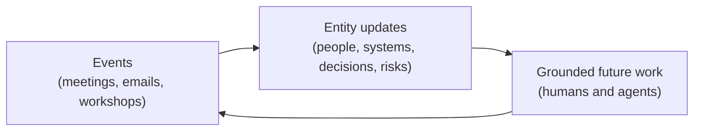

## What a Project Knowledge Base Is

A project knowledge base (project KB) is a source-backed, repository-shaped
memory for a project, engagement, product, or workstream. It models the
durable context of the work, including the people, organizations, systems,
concepts, decisions, risks, deliverables, and assets involved, so humans and
agents can work from a shared current understanding.

A project KB is not the same as the `docs/` folder in a working repository.
Working-repo docs describe the thing being built. The project KB carries the
context needed to understand why it is being built, who it affects, what has
already been decided, and what an agent should read before generating new
work.

## When to Use One

A project KB earns its maintenance cost when one or more of these hold:

* The work spans multiple repositories that need the same shared context.
* The project runs long enough that decisions, stakeholders, and constraints
  change while people rotate in and out.
* Agents assist with planning, drafting, or implementation and need grounding
  beyond the source code, such as who owns a system or why a decision stands.
* Meetings, emails, and workshops carry facts that would otherwise live only
  in individual memory or scattered note files.

For a short-lived, single-repo effort with a stable team, a well-kept `docs/`
folder is usually enough.

## Separate Repository Model

A project KB works best as its own Git repository, cloned beside, mounted
into, or referenced from one or more working repositories:

```text
workspace/
|-- working-repo/
|   |-- src/
|   `-- docs/
|
`-- knowledge-base-repo/
    |-- project/
    |-- people/
    |-- organizations/
    |-- systems/
    |-- concepts/
    |-- events/
    |-- decisions/
    |-- risks/
    |-- deliverables/
    `-- assets/
```

Separation buys three things:

* Portability. The same KB can ground several working repositories without
  duplication.
* Access control. Project context often has a different audience than source
  code, and a separate repository can carry its own permissions.
* Focus. The code repository stays about building the thing; the KB carries
  the shared understanding around it.

## Starter Taxonomy

Each top-level directory holds one kind of durable context:

| Directory        | Holds                                                                     |
|------------------|---------------------------------------------------------------------------|
| `project/`       | Scope, timeline, workstreams, goals, success criteria, open questions     |
| `people/`        | Stakeholders, roles, responsibilities, preferences, availability          |
| `organizations/` | Customers, partners, vendors, internal teams                              |
| `systems/`       | Applications, platforms, data stores, integrations, technical constraints |
| `concepts/`      | Domain language, business concepts, policies, processes, patterns         |
| `events/`        | Meetings, emails, chats, workshops, research captures, agent sessions     |
| `decisions/`     | Architectural, delivery, product, or process decisions                    |
| `risks/`         | Known risks, assumptions, mitigations, unresolved uncertainty             |
| `deliverables/`  | Proposals, readouts, decks, summaries, designs, plans                     |
| `assets/`        | Source files, diagrams, media, templates, supporting material             |

Treat the taxonomy as a starting point. Add directories only when content
demands them, and keep one clear admission rule per directory so contributors
and agents know where each fact belongs.

## The Event-to-Entity Update Loop

The core pattern that keeps a project KB current:

```text
events -> update entities -> entities ground future work
```



In this model a meeting is not just meeting notes. It is evidence that may
update a person profile, a system description, a project risk, a decision
record, or a concept definition. For example, a design review where a
stakeholder changes roles and a latency constraint is agreed should produce
three writes: the event capture under `events/`, an updated role on the
person's profile under `people/`, and a new constraint on the relevant page
under `systems/`.

This loop is what makes the KB useful for agent-assisted continuity. An agent
that reads current entities inherits the accumulated judgment of every prior
event without replaying the events themselves.

## Referencing the KB from a Working Repository

Use an instructions file to point agents at the KB. With the KB cloned as a
peer of the working repository:

```markdown
---
applyTo: '**'
---

# Project knowledge

Before planning or generating work, read the project knowledge base cloned at
`../knowledge-base-repo/`. Treat it as the source of truth for people,
systems, decisions, and open risks. When new evidence contradicts it, propose
a KB update rather than working from the stale fact.
```

Saved as `.github/instructions/project-knowledge.instructions.md`, this
grounds every Copilot conversation in the working repository. See
[Customizing with Instructions](instructions.md) for the mechanism.

## Maintenance Guardrails

Folder structure alone does not keep a KB trustworthy. Apply these rules from
day one:

* Source-backed updates only. Every entity fact should trace to an event
  capture or an external source. Restructure and summarize what sources say;
  never invent detail the sources do not contain.
* Date-stamp decaying facts. Roles, availability, and status change; a fact
  with a date can be judged, an undated fact must be re-verified.
* One canonical page per concept. When two pages describe the same thing,
  merge them rather than letting definitions fork.
* No catch-all files. Inbox-style dumping grounds accumulate facts that never
  reach the entity they should update. If a fact has no clear home, that is a
  taxonomy conversation, not a triage file.
* Curate on a cadence. Schedule a recurring pass, human or agent-assisted, to
  find stale facts, misplaced files, and conflicting concepts before they
  erode trust in the KB.

## Possible Follow-On Work

This recipe is deliberately documentation-only. If teams find the pattern
useful, natural extensions include a scaffold generator or bootstrap skill for
the starter taxonomy, schema validation for entity frontmatter, and a curator
agent that automates the maintenance pass. Each of those should be its own
proposal.

<!-- markdownlint-disable MD036 -->
*🤖 Crafted with precision by ✨Copilot following brilliant human instruction,
then carefully refined by our team of discerning human reviewers.*
<!-- markdownlint-enable MD036 -->
