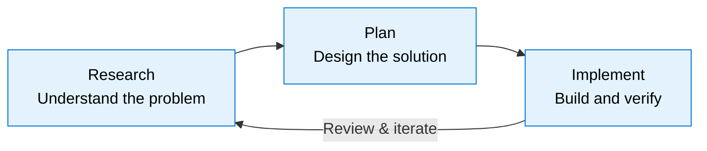

:::caution Draft Content
This documentation site is under active development. Content on this page is preliminary and subject to change.
:::

The Research-Plan-Implement (RPI) workflow is the primary development cycle in HVE Core. It provides a structured approach to AI-assisted development that goes beyond simple code generation.

## The Three Phases

### Research

The research phase uses dedicated agents to explore the codebase, gather requirements, and build understanding before writing any code. Key tools include:

- `task-researcher` agent for comprehensive codebase analysis
- `plan-1a-explore` for deep-dive research with prior learning integration

### Plan

The planning phase produces structured specifications and implementation plans. This phase ensures alignment before implementation begins:

- `plan-1b-specify` creates feature specifications focused on user value
- `plan-3-architect` generates phase-based implementation plans
- `plan-2c-workshop` provides detailed design for complex concepts

### Implement

The implementation phase executes the plan with AI assistance while tracking progress and maintaining quality:

- `plan-6-implement-phase` executes one phase at a time
- `plan-7-code-review` reviews changes against the plan
- Execution logs capture decisions and discoveries for future reference

## When to Use RPI

The RPI workflow is most valuable for:

- Features that touch multiple files or components
- Work that requires understanding existing patterns before changing them
- Tasks where the implementation approach is not immediately obvious

For simple, well-understood changes, direct implementation with Copilot Chat may be more appropriate.

🤖 *Crafted with precision by ✨Copilot following brilliant human instruction, then carefully refined by our team of discerning human reviewers.*
