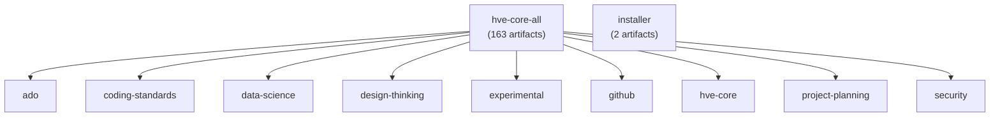

## How HVE Artifacts Are Organized

HVE distributes agents, prompts, instructions, and skills through collections, which are curated bundles of related artifacts. Each collection targets a specific domain or workflow, so you can install exactly what you need.

Two VS Code Marketplace extensions deliver these collections:

### HVE Core (`ise-hve-essentials.hve-core-all`)

The complete bundle containing 163 artifacts across all domains. If you want access to everything without choosing individual collections, install this extension. It is the recommended starting point for most users.

### HVE Installer (`ise-hve-essentials.hve-installer`)

A selective deployment tool with 2 artifacts. Rather than installing the full bundle, the installer lets you choose specific collections and deploy them into your workspace. Use the installer when you want fine-grained control over which artifacts are available.

## Collection Relationships

Collections are additive, meaning installing multiple collections may include overlapping items, and that is expected. The `hve-core-all` extension is the superset bundle containing every artifact from every domain collection. Individual collections exist as independent units, so you can also install them separately through the installer.

Items retain their maturity annotations regardless of how they are installed. For example, design-thinking artifacts are marked "preview" even when accessed through the `hve-core-all` bundle.

The installer enables targeted deployment of specific collections into workspaces without requiring the full bundle. It is a separate tool, not a subset of `hve-core-all`.

## Available Collections

| Collection       | Description                                                                                                                                    | Artifacts | Maturity     |
|------------------|------------------------------------------------------------------------------------------------------------------------------------------------|-----------|--------------|
| ado              | Manage Azure DevOps work items, monitor builds, create pull requests, and convert requirements documents into structured work item hierarchies | 21        | Stable       |
| coding-standards | Enforce language-specific coding conventions and best practices across your projects, with pre-PR code review agents                           | 14        | Stable       |
| data-science     | Generate data specifications, Jupyter notebooks, and Streamlit dashboards from natural language descriptions                                   | 7         | Stable       |
| design-thinking  | AI-enhanced design thinking coaching across nine methods                                                                                       | 58        | Preview      |
| experimental     | Experimental and preview artifacts not yet promoted to stable collections                                                                      | 6         | Experimental |
| github           | Manage GitHub issue backlogs with agents for discovery, triage, sprint planning, and execution                                                 | 12        | Stable       |
| hve-core         | RPI (Research, Plan, Implement, Review) workflow for complex tasks with Git workflow prompts                                                   | 40        | Stable       |
| hve-core-all     | Complete collection of all artifacts across all domains                                                                                        | 163       | Stable       |
| installer        | Deploy HVE artifacts across workspace configurations with decision-driven setup                                                                | 2         | Stable       |
| project-planning | Create architecture decision records, requirements documents, and diagrams through guided AI workflows                                         | 16        | Stable       |
| security         | Security review, planning, incident response, risk assessment, and vulnerability analysis                                                      | 4         | Experimental |

## How Collections Fit Together

The following diagram shows how the domain collections relate to the two marketplace extensions.

`hve-core-all` bundles every domain collection into a single extension. The `installer` operates independently as a deployment tool for selecting and installing individual collections into workspaces.

## Choosing Your Path

If you are getting started and want the simplest setup, install `hve-core-all`. You get every artifact immediately and can explore at your own pace.

If you prefer a leaner workspace or need to standardize which artifacts are available across a team, use the `installer` to deploy only the collections relevant to your workflow.

> [!TIP]
> You can always switch later. Start with `hve-core-all` to explore, then move to the installer approach when you know which collections your team needs.

---

<!-- markdownlint-disable MD036 -->
*🤖 Crafted with precision by ✨Copilot following brilliant human instruction,
then carefully refined by our team of discerning human reviewers.*
<!-- markdownlint-enable MD036 -->
